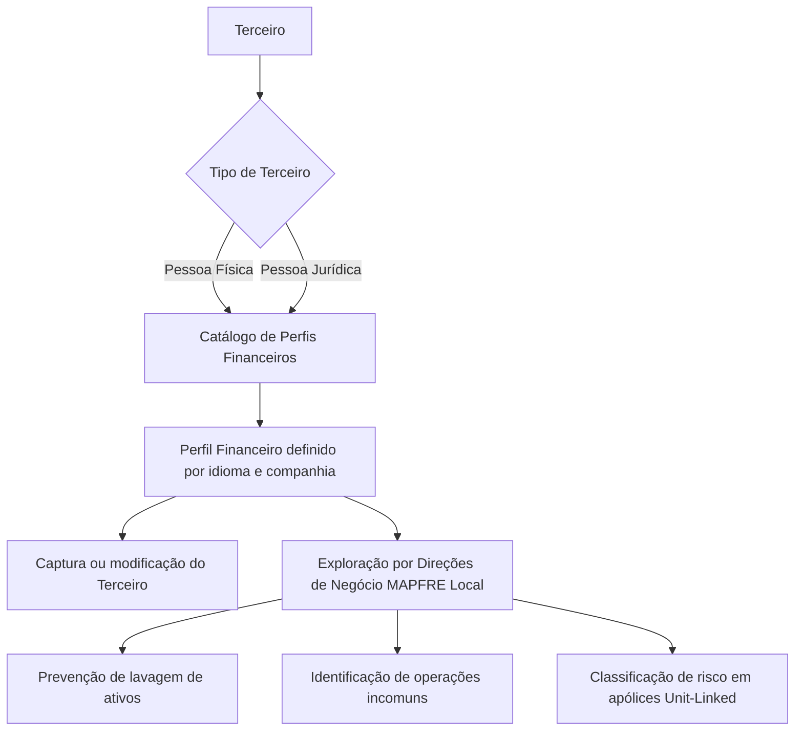

# Definição de Perfis Financeiros de Terceiros no Sistema MAPFRE Local

## 1. Metadados do Documento
- **Arquivo de Origem:** Não informado
- **Tipo de Documento:** Especificação Funcional
- **Domínio / Sistema:** Perfis Financeiros de Terceiros — entidade asseguradora / MAPFRE Local
- **Público-Alvo:** Negócio, analistas funcionais, operação e equipes responsáveis pela gestão de Terceiros
- **Data/Versão Identificada:** Não identificada

---

## 2. Resumo Executivo & Contexto de Negócio

O documento descreve a definição e a utilização de **Perfis Financeiros de Terceiros** no núcleo do sistema de uma entidade asseguradora. Os perfis financeiros consolidam atributos e características socioeconômicas e financeiras de clientes, sejam indivíduos ou empresas.

Os atributos mencionados incluem tolerância ao risco, idade, período de investimento, objetivos de rentabilidade, rendimentos, património pessoal ou empresarial e conhecimentos financeiros. Esses atributos compõem perfis que podem ser associados aos Terceiros durante processos de identificação e captura de informações.

As Direções de Negócio da entidade MAPFRE Local podem explorar posteriormente as informações dos perfis financeiros segundo critérios próprios. Os exemplos apresentados incluem prevenção de lavagem de ativos, identificação de operações incomuns e classificação técnica do perfil de risco do Terceiro na emissão de apólices Unit-Linked.

Funcionalmente, o sistema permite identificar e codificar diferentes perfis financeiros para pessoas físicas e pessoas jurídicas em um catálogo de informação específico. A definição ocorre por idioma e por companhia, permitindo nomear e identificar individualmente cada perfil com uma denominação ou texto descritivo.

---

## 3. Arquitetura, Componentes & Tecnologias Envolvidas

O conteúdo não descreve tecnologias, protocolos, APIs, bancos de dados, microsserviços, ambientes técnicos, URLs ou contratos de integração. A estrutura funcional explicitamente identificada é composta pelo núcleo do sistema, pelo catálogo de Perfis Financeiros e pelos registros de Terceiros.

| Componente / Entidade | Função descrita |
| :--- | :--- |
| Núcleo do Sistema | Permite identificar e codificar os Perfis Financeiros de Terceiros. |
| Catálogo de informação específico | Repositório funcional para a definição dos Perfis Financeiros de pessoas físicas e jurídicas. |
| Perfil Financeiro | Conjunto de atributos e características socioeconômicas e financeiras associado a um Terceiro. |
| Terceiro | Pessoa física ou pessoa jurídica cujo perfil financeiro pode ser identificado e capturado. |
| Direções de Negócio da MAPFRE Local | Determinam critérios para exploração posterior das informações dos Perfis Financeiros. |
| Operações de captura e modificação do Terceiro | Operações nas quais um Perfil Financeiro habilitado pode ser utilizado. |
| Emissão de apólices Unit-Linked | Contexto citado para classificação técnica do perfil de risco do Terceiro. |



> **Nota de Análise:** O documento descreve relações funcionais entre o catálogo, os Perfis Financeiros e os Terceiros, mas não detalha implementação técnica, persistência de dados, métodos HTTP, integrações ou contratos JSON.

---

## 4. Regras de Negócio, Especificações Funcionais & Processos

### 4.1 Finalidade dos Perfis Financeiros

1. Os Perfis Financeiros representam um conjunto de atributos e características socioeconômicas e financeiras de um cliente.
2. O cliente pode ser um indivíduo ou uma empresa.
3. Entre os atributos explicitamente citados estão:
   - Maior ou menor tolerância ao risco.
   - Idade.
   - Período no qual serão realizados investimentos.
   - Objetivos de rentabilidade.
   - Rendimentos.
   - Património pessoal ou da empresa.
   - Conhecimentos financeiros.
4. Os Perfis Financeiros podem ser associados durante a identificação e captura de informações dos Terceiros.
5. As informações associadas podem ser exploradas posteriormente conforme critérios definidos pelas Direções de Negócio da entidade MAPFRE Local.

### 4.2 Casos de Uso Mencionados

| Caso de uso | Aplicação descrita |
| :--- | :--- |
| Prevenção de lavagem de ativos | Uso posterior da informação dos Perfis Financeiros segundo critérios das Direções de Negócio. |
| Identificação de operações incomuns | Uso posterior da informação dos Perfis Financeiros segundo critérios das Direções de Negócio. |
| Emissão de apólices Unit-Linked | Classificação técnica do perfil de risco do Terceiro. |

### 4.3 Definição e Codificação

1. O núcleo do Sistema possui capacidade de identificar e codificar diferentes Perfis Financeiros de Terceiros.
2. Os Terceiros abrangidos podem ser pessoas físicas ou pessoas jurídicas.
3. Os Perfis Financeiros são definidos em um catálogo de informação específico.
4. A definição de um Perfil Financeiro é realizada:
   - Por idioma.
   - Em nível de companhia.
5. Cada Perfil Financeiro pode receber denominação ou texto descritivo para identificação individual.

### 4.4 Propriedades Operativas

#### Uso em Pessoas Físicas

A propriedade indica se o Perfil Financeiro definido será usado para pessoas físicas ou para pessoas jurídicas.

#### Ordem de Visualização

A propriedade indica a ordem de apresentação dos Perfis Financeiros nos programas de consulta do Sistema.

### 4.5 Outras Propriedades

#### Inabilitação

A propriedade de inabilitação informa ao Sistema que o Perfil Financeiro não está habilitado para utilização em operações de captura e/ou modificação do Terceiro.

#### Data de Validade

A Data de Validade informa a data a partir da qual o Perfil Financeiro está plenamente operativo no Sistema. O uso correto dessa propriedade permite manter histórico das alterações efetuadas nas definições dos Perfis Financeiros.

### 4.6 Vínculos Documentais

O documento recomenda a leitura de diretrizes e documentos funcionais relacionados para evitar interpretações isoladas e incorretas. O vínculo explicitamente listado é:

- **Atividades de Terceiros**

> **Nota de Análise:** O documento não detalha o conteúdo do documento vinculado “Atividades de Terceiros”, nem especifica regras adicionais decorrentes desse vínculo.

---

## 5. Tabelas de Parâmetros, Ambientes e Estruturas de Dados

| Item / Parâmetro | Descrição / Função | Tipo / Valores / Formato | Ambiente / Observações |
| :--- | :--- | :--- | :--- |
| Perfil Financeiro | Conjunto de atributos e características socioeconômicas e financeiras de um Terceiro. | Aplicável a pessoas físicas e pessoas jurídicas. | Definido em catálogo específico. |
| Idioma | Critério de definição do Perfil Financeiro. | Não detalhado. | A definição ocorre por idioma. |
| Companhia | Critério organizacional de definição do Perfil Financeiro. | Não detalhado. | A definição ocorre em nível de companhia. |
| Denominação / texto descritivo | Permite nomear e identificar individualmente cada Perfil Financeiro. | Texto. | Não há tamanho, obrigatoriedade ou regras de preenchimento informados. |
| Uso em Pessoas Físicas | Indica se o Perfil Financeiro é usado para pessoas físicas ou pessoas jurídicas. | Atributo de uso; valores exatos não detalhados. | Propriedade operativa. |
| Ordem de Visualização | Define a ordem de exibição dos Perfis Financeiros em programas de consulta. | Ordem; formato não detalhado. | Propriedade operativa. |
| Inabilitação | Impede o uso do Perfil Financeiro nas operações de captura e/ou modificação do Terceiro. | Propriedade de estado; valores exatos não detalhados. | Propriedade adicional. |
| Data de Validade | Define a data a partir da qual o Perfil Financeiro está plenamente operativo. | Data; formato não detalhado. | Permite histórico das alterações nas definições. |
| Terceiro | Entidade à qual um Perfil Financeiro pode ser associado. | Pessoa física ou pessoa jurídica. | Utilizado nos processos de identificação, captura e modificação. |
| Unit-Linked | Contexto de emissão de apólices no qual se pode classificar tecnicamente o perfil de risco do Terceiro. | Não detalhado. | Citado como exemplo de exploração das informações. |

> **Nota de Análise:** O documento não apresenta servidores, URLs, portas, ambientes de desenvolvimento/homologação/produção, caminhos de logs, variáveis de configuração ou estruturas de dados com campos técnicos.

---

## 6. Bateria de Perguntas & Respostas para RAG (FAQ Sintético)

### P1: Qual é o objetivo dos Perfis Financeiros de Terceiros no Sistema?
**R:** Os Perfis Financeiros de Terceiros permitem identificar, codificar e associar conjuntos de atributos socioeconômicos e financeiros a Terceiros, sejam pessoas físicas ou pessoas jurídicas. Essas informações podem ser exploradas posteriormente pelas Direções de Negócio da MAPFRE Local segundo critérios definidos pela entidade.

### P2: Quais características podem compor um Perfil Financeiro de Terceiro?
**R:** O documento cita maior ou menor tolerância ao risco, idade, período no qual os investimentos serão realizados, objetivos de rentabilidade, rendimentos, património pessoal ou empresarial e conhecimentos financeiros. O documento não estabelece uma lista fechada, formato ou obrigatoriedade para esses atributos.

### P3: Os Perfis Financeiros podem ser atribuídos a pessoas físicas e jurídicas?
**R:** Sim. O núcleo do Sistema permite identificar e codificar Perfis Financeiros para Terceiros que sejam pessoas físicas ou pessoas jurídicas. A propriedade “Uso em Pessoas Físicas” indica se um perfil definido será utilizado para pessoas físicas ou para pessoas jurídicas.

### P4: Onde são definidos os Perfis Financeiros de Terceiros?
**R:** Os Perfis Financeiros são definidos em um catálogo de informação específico do núcleo do Sistema. A definição ocorre por idioma e em nível de companhia.

### P5: Como um Perfil Financeiro é individualmente identificado no catálogo?
**R:** Cada Perfil Financeiro pode ser denominado e identificado individualmente por meio de uma denominação ou texto descritivo. O documento não detalha regras de unicidade, tamanho, idioma padrão ou obrigatoriedade desse texto.

### P6: Qual é a finalidade da propriedade Ordem de Visualização?
**R:** A propriedade Ordem de Visualização determina a ordem em que os Perfis Financeiros serão apresentados nos programas de consulta do Sistema.

### P7: O que ocorre quando um Perfil Financeiro está inabilitado?
**R:** Quando a propriedade de Inabilitação indica que um Perfil Financeiro está inabilitado, o Perfil Financeiro não pode ser empregado nas operações de captura e/ou modificação do Terceiro.

### P8: Qual é a função da Data de Validade de um Perfil Financeiro?
**R:** A Data de Validade indica a data a partir da qual o Perfil Financeiro está plenamente operativo no Sistema. O uso correto dessa propriedade permite manter histórico das alterações efetuadas nas definições dos Perfis Financeiros.

### P9: Como as Direções de Negócio podem utilizar as informações dos Perfis Financeiros?
**R:** As Direções de Negócio da entidade MAPFRE Local podem explorar as informações associadas aos Perfis Financeiros conforme critérios por elas determinados. O documento cita como exemplos a prevenção de lavagem de ativos, a identificação de operações incomuns e a classificação técnica de risco na emissão de apólices Unit-Linked.

### P10: O documento define uma padronização corporativa para a codificação das atividades dos Terceiros?
**R:** Não. A seção de perguntas frequentes declara que não existe, corporativamente, preferência ou recomendação para estabelecer ou padronizar no Sistema a codificação das atividades dos Terceiros.

---

## 7. Glossário de Termos, Siglas & Conceitos-Chave

- **Direções de Negócio:** Áreas da entidade MAPFRE Local responsáveis por determinar critérios para exploração posterior das informações dos Perfis Financeiros.
- **Inabilitação:** Propriedade que impede o emprego de um Perfil Financeiro em operações de captura e/ou modificação do Terceiro.
- **MAPFRE Local:** Entidade local mencionada como contexto para definição dos critérios de exploração das informações.
- **Perfil Financeiro:** Conjunto de atributos e características socioeconômicas e financeiras de um Terceiro.
- **Pessoa Física:** Tipo de Terceiro indicado no documento como indivíduo.
- **Pessoa Jurídica:** Tipo de Terceiro indicado no documento como empresa.
- **Terceiro:** Cliente ou entidade para a qual podem ser identificados, capturados e associados Perfis Financeiros.
- **Unit-Linked:** Contexto de emissão de apólices citado para classificação técnica do perfil de risco do Terceiro.

---

## 8. Notas Críticas, Riscos & Limitações

- O documento não identifica arquivo de origem, autor, data, versão, sistema específico, módulo, ambiente ou responsável pela manutenção.
- Não são detalhados modelos de dados, campos obrigatórios, regras de validação, códigos de erro, fluxos de aprovação ou permissões de acesso.
- Não há especificações sobre APIs, métodos HTTP, integrações, bancos de dados, tecnologias, servidores, URLs, logs ou mecanismos de auditoria.
- A propriedade “Uso em Pessoas Físicas” é descrita como indicadora de uso para pessoas físicas ou jurídicas, mas o documento não informa os valores técnicos possíveis nem o comportamento em cenários de ambos os tipos.
- A Data de Validade é relacionada à manutenção de histórico, mas o documento não especifica como o histórico é persistido, consultado ou aplicado a perfis já associados a Terceiros.
- A pergunta frequente aborda a codificação de “atividades dos Terceiros”, embora o documento trate de Perfis Financeiros. Não há detalhamento da relação funcional entre atividades de Terceiros e Perfis Financeiros.
- A leitura do documento vinculado **Atividades de Terceiros** é recomendada para evitar interpretação isolada, mas o conteúdo desse documento não foi fornecido.

---

## 9. Conteúdo Bruto Estruturado (Referência Fiel)

```text
--- [PÁGINA 1 DE 2] ---

DEFINICIÓN de Perfiles Financieros de
Terceros
Contexto
En los diferentes procesos que se circunscriben a la actividad propia de una entidad aseguradora en
ocasiones es necesario identificar el conjunto de atributos y características socioeconómicas y
financieras del cliente, ya sea éste un individuo o una empresa (entre los que se encuentran su
mayor o menor tolerancia al riesgo, la edad, el periodo de tiempo en el que se van a realizar las
inversiones, los objetivos de rentabilidad, los ingresos y el patrimonio personal o de la empresa, los
conocimientos financieros, etc.)
Este conjunto de atributos y características conformarán los distintos perfiles financieros, perfiles
que se podrán asociar en la identificación y captura de información de los Terceros y que permitirán
explotar posteriormente su información con los criterios que determinen las Direcciones de Negocio
de la entidad MAPFRE Local, como por ejemplo para prevenir el lavado de activos, para la
identificación de operaciones inusuales, para clasificar técnicamente el perfil de riesgo del Tercero en
la emisión de pólizas de Unit-Linked,…
Propiedades Generales
Funcionalmente, el núcleo del Sistema cuenta con la posibilidad de identificar y codificar los
diferentes Perfiles Financieros de los Terceros, sean estos personas Físicas o Jurídicas, en un
catálogo de información específico.
La definición de los perfiles financieros se realiza por idioma y a nivel de compañía pudiendo
denominar e identificar individualmente cada uno de ellos mediante una denominación o texto
 / 
 CF
Home Solutions APIs Documentation Zeus
EN


--- [PÁGINA 2 DE 2] ---

descriptivo.
Propiedades Operativas
Uso en Personas Físicas
Este atributo indica si el perfil financiero definido se usa para personas físicas o bien para personas
Jurídicas.
Orden de Visualización
Este atributo indica el orden en el que se mostrarán los perfiles financieros en los programas de
consulta del sistema.
Otras Propiedades
Inhabilitación
Esta propiedad le indica al Sistema que el Perfil Financiero está inhabilitado para poder ser empleado
en las operaciones de captura y/o modificación del Tercero.
Fecha de Validez
Esta propiedad le indica al Sistema la fecha a partir de la cual el Perfil Financiero está plenamente
operativo en el sistema por lo que su correcto uso permite tener un histórico de los cambios
efectuados en sus definiciones.
Vínculos
Relación de Directrices y Documentos funcionales cuya lectura recomendada para evitar que la
interpretación aislada del presente documento pueda conducir a error.
Actividades de Terceros
Preguntas frecuentes
(1) ¿Existe alguna recomendación operativa que deba ser tomada en consideración localmente en la
codificación, uso y definición de los Perfiles Financieros de los Terceros en el Sistema?
No existe Corporativamente una preferencia o recomendación para establecer o estandarizar en el
sistema la codificación de las actividades de los Terceros en el sistema.
```
