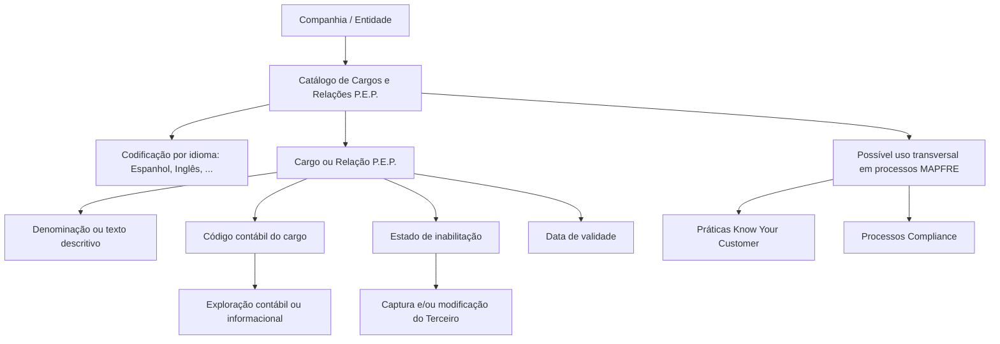

# Definição de Cargos de Pessoas Politicamente Expostas (P.E.P.) — Catálogo de Cargos e Relações

## 1. Metadados do Documento
- **Arquivo de Origem:** Não identificado; conteúdo bruto fornecido pelo solicitante.
- **Tipo de Documento:** Especificação Funcional.
- **Domínio / Sistema:** Gestão de Terceiros, catálogo de Cargos e Relações de Pessoas Politicamente Expostas (P.E.P.), MAPFRE.
- **Público-Alvo:** Negócio, Compliance, Operação, Desenvolvedores e Arquitetos.
- **Data/Versão Identificada:** Não identificada.

---

## 2. Resumo Executivo & Contexto de Negócio

O documento define o contexto funcional para a identificação e codificação de cargos ou relações de Pessoas Politicamente Expostas (P.E.P.) em um catálogo específico do sistema. Uma P.E.P. é caracterizada como pessoa exposta politicamente ou com responsabilidade pública proeminente, condição que pode elevar o risco potencial de participação em subornos e corrupção devido à posição e influência exercidas.

O núcleo do sistema disponibiliza às entidades um catálogo inicialmente vazio. Cada companhia pode preencher e administrar esse catálogo de informação, registrando cargos e relações de P.E.P. de forma individualizada, com denominação ou texto descritivo.

A manutenção do catálogo ocorre em nível de companhia e por idioma, incluindo explicitamente Espanhol e Inglês. O documento apresenta uma codificação exemplificativa de cargos, como `00 Presidente del Gobierno`, `01 Vicepresidente` e `02 Tribunal Supremo`, sem estabelecer uma codificação padrão ou obrigatória para todas as entidades.

O cadastro de cada cargo pode incluir código contábil, inabilitação e data de validade. Esses atributos suportam a exploração contábil ou informacional, o bloqueio de uso de cargos inabilitados em operações de captura e modificação de Terceiros e o histórico das alterações de definição de cargos.

A MAPFRE deve analisar a conveniência de usar transversalmente esse catálogo nos processos corporativos. O documento cita como exemplos práticas Know Your Customer, atendimento de exigências legais e regulatórias — incluindo Anti Money Laundering, Regulamento Geral de Proteção de Dados e Electronic IDentification, Authentication and Trust Services — e processos de Compliance.

---

## 3. Arquitetura, Componentes & Tecnologias Envolvidas

Os componentes funcionais identificados são:

- **Núcleo do Sistema:** disponibiliza o catálogo específico para cargos ou relações de P.E.P.
- **Entidade / Companhia:** administra a codificação, o uso e a definição do catálogo.
- **Catálogo de Cargos e Relações de P.E.P.:** repositório inicialmente vazio, preenchido pela companhia e organizado por idioma.
- **Operações sobre Terceiros:** operações de captura e/ou modificação que podem utilizar cargos ou relações de P.E.P., desde que não estejam inabilitados.
- **Exploração contábil ou informacional:** possível utilização posterior do código contábil atribuído a cargos homologados oficialmente.
- **Processos corporativos potenciais:** Know Your Customer, Compliance e atendimento de normas e regulações.



**Nota de Análise:** o documento não especifica arquitetura técnica, métodos HTTP, contratos JSON, banco de dados, interfaces, tecnologias de implementação, ambientes ou integrações técnicas.

---

## 4. Regras de Negócio, Especificações Funcionais & Processos

### 4.1 Definição de Pessoa Politicamente Exposta

1. Uma P.E.P. descreve pessoas expostas politicamente ou com responsabilidade pública proeminente.
2. Uma P.E.P. pode apresentar maior risco de envolvimento potencial em subornos e corrupção.
3. O risco decorre da posição ocupada e da influência potencial exercida pela pessoa.
4. A denominação em inglês indicada pelo documento é **Politically Exposed Person**.

### 4.2 Administração do catálogo de cargos e relações

1. O núcleo do sistema disponibiliza um catálogo de informações específico para identificar e codificar cargos ou relações de P.E.P.
2. O catálogo é entregue inicialmente vazio às entidades.
3. A companhia pode codificar cargos e relações no nível da própria companhia.
4. A companhia pode codificar cargos e relações por idioma; Espanhol e Inglês são exemplos explicitamente citados.
5. Cada cargo ou relação deve ser denominado e identificado individualmente por meio de denominação ou texto descritivo.
6. O documento apresenta exemplos de codificação, mas não determina um padrão obrigatório de codificação no sistema.
7. A entidade MAPFRE deve avaliar a conveniência de utilizar transversalmente o catálogo nos processos corporativos para viabilizar sua correta exploração posterior.

### 4.3 Código contábil do cargo

1. O código contábil determina o código atribuído ao cargo.
2. O atributo é aplicável em países onde postos ou cargos sejam oficialmente homologados por meio de chaves.
3. A atribuição de código permite explorar posteriormente as informações de forma contábil ou informacional.

### 4.4 Inabilitação

1. O atributo **Inabilitação** informa ao sistema que determinado cargo ou relação de P.E.P. está inabilitado.
2. Um cargo ou relação inabilitado não pode ser utilizado em operações de captura do Terceiro.
3. Um cargo ou relação inabilitado não pode ser utilizado em operações de modificação do Terceiro.

### 4.5 Data de validade

1. O atributo **Data de Validade** indica a data a partir da qual o cargo está plenamente operativo no sistema.
2. O uso correto da data de validade permite manter histórico das mudanças realizadas nas definições de cargos.

### 4.6 Uso corporativo potencial do catálogo

O documento cita a possibilidade de uso transversal do catálogo em:

- Práticas de **Know Your Customer**, para verificar a identidade de clientes da entidade.
- Cumprimento de exigências legais, normas e regulações vigentes.
- Contextos de **Anti Money Laundering**.
- Contextos de **Regulamento Geral de Proteção de Dados**.
- Contextos de **Electronic IDentification, Authentication and Trust Services**.
- Processos de **Compliance**.

---

## 5. Tabelas de Parâmetros, Ambientes e Estruturas de Dados

| Item / Parâmetro | Descrição / Função | Tipo / Valores / Formato | Ambiente / Observações |
| :--- | :--- | :--- | :--- |
| Catálogo de Cargos e Relações P.E.P. | Catálogo específico usado para identificar e codificar cargos ou relações de P.E.P. | Catálogo de informações | É entregue inicialmente vazio às entidades. |
| Companhia | Nível organizacional que administra o catálogo. | Entidade organizacional | A codificação pode ser realizada no nível da companhia. |
| Idioma | Permite codificar cargos e relações por idioma. | Espanhol, Inglês, ... | O documento não limita os idiomas aos exemplos apresentados. |
| Cargo ou Relação P.E.P. | Registro individual relativo a cargo ou relação de uma P.E.P. | Registro de catálogo | Deve possuir denominação ou texto descritivo. |
| Denominação / texto descritivo | Identifica individualmente um cargo ou relação. | Texto | Não é especificado tamanho, formato ou obrigatoriedade técnica. |
| Código contábil do cargo | Código atribuído a cargo homologado oficialmente por chaves em determinados países. | Código não especificado | Permite exploração contábil ou informacional posterior. |
| Inabilitação | Indica que cargo ou relação não pode ser empregado em operações sobre Terceiros. | Estado de inabilitado | Bloqueia captura e/ou modificação do Terceiro. |
| Data de Validade | Data a partir da qual o cargo passa a estar plenamente operativo. | Data | Suporta histórico das mudanças nas definições de cargos. |
| Exemplo de código `00` | Exemplo de cargo P.E.P. codificado. | `Presidente del Gobierno` | Apenas exemplo apresentado no documento. |
| Exemplo de código `01` | Exemplo de cargo P.E.P. codificado. | `Vicepresidente` | Apenas exemplo apresentado no documento. |
| Exemplo de código `02` | Exemplo de cargo P.E.P. codificado. | `Tribunal Supremo` | Apenas exemplo apresentado no documento. |
| Know Your Customer | Prática citada como possível uso transversal do catálogo. | Processo de verificação de identidade de clientes | Associada ao atendimento de exigências legais e regulações. |
| Compliance | Processo corporativo citado como potencial consumidor do catálogo. | Processo corporativo | Não há detalhamento de regras ou integração. |

---

## 6. Bateria de Perguntas & Respostas para RAG (FAQ Sintético)

### P1: O que é uma Pessoa Politicamente Exposta (P.E.P.) no contexto do documento?
**R:** Uma P.E.P. é uma pessoa exposta politicamente ou com responsabilidade pública proeminente. O documento indica que essa condição pode elevar o risco potencial de participação em subornos e corrupção devido à posição ocupada e à influência que a pessoa pode exercer.

### P2: O catálogo de Cargos e Relações de P.E.P. já possui conteúdo quando é entregue às entidades?
**R:** Não. O núcleo do sistema entrega às entidades um catálogo específico inicialmente vazio. Cada entidade deve definir e codificar os cargos ou relações de P.E.P. que utilizará.

### P3: Em que nível a companhia pode administrar os cargos e relações de P.E.P.?
**R:** O sistema permite administrar e codificar cargos ou relações de P.E.P. no nível da companhia e por idioma. O documento cita Espanhol e Inglês como exemplos de idiomas.

### P4: Como um cargo ou relação de P.E.P. deve ser identificado no catálogo?
**R:** Cada cargo ou relação deve ser denominado e identificado individualmente mediante uma denominação ou um texto descritivo. O documento não define formato técnico, tamanho máximo ou estrutura obrigatória para esse texto.

### P5: Qual é a finalidade do código contábil do cargo?
**R:** O código contábil determina o código atribuído ao cargo nos países em que postos ou cargos sejam oficialmente homologados por chaves. Esse código permite explorar posteriormente a informação de forma contábil ou informacional.

### P6: O que acontece se um cargo ou relação de P.E.P. estiver inabilitado?
**R:** Um cargo ou relação de P.E.P. inabilitado não pode ser utilizado nas operações de captura e/ou modificação do Terceiro.

### P7: Para que serve a data de validade de um cargo P.E.P.?
**R:** A data de validade informa a partir de qual data o cargo está plenamente operativo no sistema. O uso correto desse atributo permite manter um histórico das mudanças realizadas nas definições de cargos.

### P8: Existe uma codificação padrão obrigatória para cargos P.E.P. no sistema?
**R:** Não. O documento afirma que não existe preferência nem recomendação para estabelecer ou padronizar a codificação no sistema. A MAPFRE deve analisar a conveniência de utilizar o catálogo transversalmente em seus processos para permitir sua exploração adequada.

### P9: Quais são os exemplos de cargos P.E.P. apresentados no documento?
**R:** O documento apresenta os exemplos `00 Presidente del Gobierno`, `01 Vicepresidente` e `02 Tribunal Supremo`. Os exemplos ilustram uma possível codificação, sem constituírem padrão obrigatório.

### P10: Quais processos corporativos podem usar transversalmente o catálogo de cargos e relações de P.E.P.?
**R:** O documento cita práticas Know Your Customer para verificação de identidade de clientes, atendimento de exigências legais e normas vigentes, contextos de Anti Money Laundering, Regulamento Geral de Proteção de Dados, Electronic IDentification, Authentication and Trust Services e processos de Compliance.

### P11: O documento define métodos de integração, contratos de API ou tecnologias do sistema?
**R:** Não. O documento descreve propriedades funcionais do catálogo de cargos e relações de P.E.P., mas não detalha métodos HTTP, contratos JSON, integrações, bancos de dados, tecnologias, URLs ou ambientes técnicos.

---

## 7. Glossário de Termos, Siglas & Conceitos-Chave

- **P.E.P.:** Pessoa Politicamente Exposta; pessoa exposta politicamente ou com responsabilidade pública proeminente.
- **Politically Exposed Person:** Denominação em inglês de P.E.P. indicada no documento.
- **Cargo ou Relação P.E.P.:** Registro do catálogo utilizado para representar um cargo ou relação vinculado ao contexto de Pessoas Politicamente Expostas.
- **Terceiro:** Entidade sobre a qual podem ocorrer operações de captura e/ou modificação utilizando cargos ou relações P.E.P.
- **Código contábil do cargo:** Código atribuído a um cargo em países onde postos ou cargos são homologados oficialmente por chaves.
- **Inabilitação:** Propriedade que impede o uso de um cargo ou relação P.E.P. nas operações de captura e/ou modificação do Terceiro.
- **Data de Validade:** Data a partir da qual o cargo se torna plenamente operativo no sistema.
- **Know Your Customer:** Prática citada para verificar a identidade dos clientes da entidade.
- **Anti Money Laundering:** Contexto regulatório citado no documento.
- **Regulamento Geral de Proteção de Dados:** Norma ou regulação citada no documento.
- **Electronic IDentification, Authentication and Trust Services:** Norma ou contexto regulatório citado no documento.
- **Compliance:** Processos corporativos citados como possível área de utilização transversal do catálogo.
- **MAPFRE:** Entidade mencionada como responsável por analisar a conveniência de uso transversal do catálogo nos processos da companhia.

---

## 8. Notas Críticas, Riscos & Limitações

- O documento não estabelece padrão, preferência ou recomendação de codificação para o catálogo de cargos e relações de P.E.P.
- A ausência de padronização pode exigir decisão local da entidade quanto à nomenclatura, codificação e governança do catálogo.
- O catálogo é entregue inicialmente vazio, tornando necessária a definição de conteúdo pela entidade.
- O uso efetivo e transversal do catálogo pela MAPFRE é apresentado como conveniência a ser analisada, não como obrigação explicitamente definida.
- Não há detalhamento sobre fluxos técnicos de aprovação, permissões de manutenção, trilha de auditoria, responsáveis, integrações ou validações de dados.
- Não são especificados métodos HTTP, contratos JSON, estruturas de banco de dados, endpoints, ambientes, URLs, credenciais ou mecanismos técnicos de integração.
- O documento referencia diretrizes e documentos funcionais relacionados, incluindo **Cargos/Funciones en Personas Jurídicas**, mas não fornece o conteúdo desses materiais. A interpretação isolada do documento pode conduzir a erro, conforme alerta expresso no próprio texto.

---

## 9. Conteúdo Bruto Estruturado (Referência Fiel)

```text
--- [PÁGINA 1 DE 3] ---

DEFINICIÓN de Cargos de Personas
Políticamente Expuestas
Contexto
En la regulación financiera, un P.E.P. es un término que describe a las personas que están expuestas
políticamente o que tienen una responsabilidad pública prominente. Por lo general, una PEP
presenta un mayor riesgo de participación potencial en sobornos y corrupción en virtud de su
posición y la influencia que pueda tener.
(En Inglés P.E.P: Politically Exposed Person)
Propiedades Generales
Funcionalmente, el núcleo del Sistema cuenta con la posibilidad de identificar y codificar los Cargos o
Relaciones de las Personas Políticamente Expuestas, en un catálogo de información específico que
se entrega a las entidades inicialmente vacío de contenido.
El sistema permite a nivel de compañía y por idioma (Español, Inglés,...) codificar estos Cargos
denominando e identificando individualmente cada una de ellos mediante una denominación o texto
descriptivo.
A modo de ejemplo:
 / 
 CF
Home Solutions APIs Documentation Zeus
EN


--- [PÁGINA 2 DE 3] ---

CARGO PEP. DESCRIPCIÓN
00 Presidente del Gobierno
01 Vicepresidente
02 Tribunal Supremo
... ...
Código Contable del Cargo
Esta propiedad determina el código asignado al cargo, en aquellos países en los que los
puestos/cargos estuvieran homologados oficialmente mediante claves, lo que permitirá explotar
posteriormente la información contable o informacionalmente.
Otras Propiedades
Inhabilitación
Esta propiedad le indica al Sistema que el Cargo o Relación del P.E.P está inhabilitado para poder
ser empleado en las operaciones de captura y/o modificación del Tercero.
Fecha de Validez
Esta propiedad le indica al Sistema la fecha a partir de la cual el cargo está plenamente operativo en
el sistema por lo que su correcto uso permite tener un histórico de los cambios efectuados en las
definiciones de los cargos.
Vínculos
Relación de Directrices y Documentos funcionales cuya lectura recomendada para evitar que la
interpretación aislada del presente documento pueda conducir a error.
Cargos/Funciones en Personas Jurídicas
Preguntas frecuentes
(1) ¿Existe alguna recomendación operativa que deba ser tomada en consideración localmente en la
codificación, uso y definición del catálogo de Cargos y Relaciones de los P.E.P.'s en el Sistema?
Ejemplo:


--- [PÁGINA 3 DE 3] ---

No existe una preferencia ni recomendación para establecer o estandarizar en el sistema su
codificación, si bien la entidad MAPFRE debe analizar la conveniencia de utilizar transversalmente en
los procesos de la compañía este catálogo de información para su correcta y posterior explotación,
e.g: Prácticas Know Your Customer para verificar la identidad de los clientes de la entidad
cumpliendo con las exigencias legales así como con las normativas y regulaciones vigentes (Anti
Money Laundering, Reglamento General de Protección de Datos, Electronic IDentification,
Authentication and Trust Services,..), Procesos Compliance, ...
```
