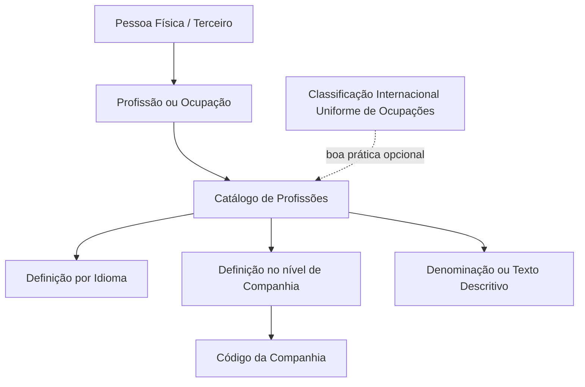

# Definição de Profissões/Ocupações de Pessoas Físicas no Sistema

## 1. Metadados do Documento
- **Arquivo de Origem:** `Não informado`
- **Tipo de Documento:** Manual Operacional
- **Domínio / Sistema:** Catálogo de Profissões/Ocupações de Terceiros
- **Público-Alvo:** Negócio, Operação e Administradores do Sistema
- **Data/Versão Identificada:** Não identificada

---

## 2. Resumo Executivo & Contexto de Negócio

O documento descreve a definição de Profissões/Ocupações para pessoas físicas no núcleo do Sistema. O Sistema permite identificar e codificar profissões em um catálogo específico de informações.

No contexto apresentado, profissão é entendida como a atividade habitual da pessoa, incluindo emprego ou ocupação exercida geralmente em troca de retribuição, remuneração ou salário. A definição das profissões ocorre por idioma e no nível de companhia.

Cada profissão pode ser identificada individualmente por uma denominação ou texto descritivo. A propriedade de companhia informa ao Sistema o código da companhia para a qual a profissão do Terceiro está sendo definida.

O catálogo de Profissões é entregue inicialmente vazio às instalações. Não existe uma recomendação corporativa obrigatória para codificação ou padronização das profissões, embora o documento indique como boa prática adotar uma classificação que facilite a organização, homogeneização e exploração posterior das informações.

---

## 3. Arquitetura, Componentes & Tecnologias Envolvidas

Os elementos funcionais identificados são:

- **Núcleo do Sistema:** componente que permite identificar e codificar Profissões/Ocupações.
- **Catálogo de Profissões:** catálogo específico para registrar informações de profissões de pessoas físicas.
- **Companhia:** propriedade que determina o código da companhia associado à definição da profissão do Terceiro.
- **Idioma:** dimensão pela qual a definição das profissões é realizada.
- **Terceiro:** pessoa cuja profissão é definida no Sistema.
- **Classificação Internacional Uniforme de Ocupações:** classificação citada como possível boa prática para organizar e homogeneizar os dados.
- **Organização Internacional do Trabalho:** organização mencionada como referência da Classificação Internacional Uniforme de Ocupações.



> **Nota de Análise:** O documento não detalha interfaces, métodos HTTP, contratos de dados, tecnologias de implementação, persistência, permissões ou integrações do Sistema.

---

## 4. Regras de Negócio, Especificações Funcionais & Processos

1. O núcleo do Sistema permite identificar e codificar as Profissões/Ocupações de pessoas físicas em um catálogo específico.
2. Profissão corresponde à atividade habitual da pessoa, ao emprego ou à ocupação geralmente exercida mediante retribuição, remuneração ou salário.
3. A definição de profissões de pessoas físicas é realizada por idioma.
4. A definição de profissões de pessoas físicas é realizada no nível de companhia.
5. Cada profissão pode receber uma denominação ou um texto descritivo para identificação individual.
6. A propriedade **Companhia** informa o código da companhia sobre a qual está sendo realizada a definição da profissão do Terceiro.
7. O catálogo de Profissões é inicialmente entregue vazio às instalações.
8. Não há preferência ou recomendação corporativa para estabelecer ou padronizar a codificação das profissões dos Terceiros.
9. É considerada boa prática utilizar uma classificação para organizar e homogeneizar as informações de profissões para exploração posterior.
10. O documento cita a **Classificação Internacional Uniforme de Ocupações**, da Organização Internacional do Trabalho, como exemplo de classificação que pode ser utilizada.
11. O documento relaciona como vínculos de leitura recomendada os materiais **Actividades de Terceros** e **Definición de Titulaciones**, a fim de evitar interpretação isolada e potencialmente incorreta.

---

## 5. Tabelas de Parâmetros, Ambientes e Estruturas de Dados

| Item / Parâmetro | Descrição / Função | Tipo / Valores / Formato | Ambiente / Observações |
| :--- | :--- | :--- | :--- |
| Profissão/Ocupação | Atividade habitual, emprego ou ocupação exercida pela pessoa física. | Denominação ou texto descritivo. | Associada a uma pessoa física ou Terceiro. |
| Catálogo de Profissões | Catálogo específico utilizado pelo núcleo do Sistema para identificar e codificar profissões. | Catálogo de informação. | Entregue inicialmente vazio às instalações. |
| Idioma | Dimensão pela qual a definição das profissões é realizada. | Não detalhado. | Aplicável à definição de profissões de pessoas físicas. |
| Companhia | Propriedade que indica o código da companhia para a definição da profissão do Terceiro. | Código da companhia. | Definição realizada no nível de companhia. |
| Denominação | Identificação individual da profissão. | Texto descritivo. | Pode ser utilizada para nomear uma profissão. |
| Classificação de ocupações | Estrutura opcional para organização e homogeneização das informações. | Exemplo: Classificação Internacional Uniforme de Ocupações. | Não obrigatória corporativamente. |
| Actividades de Terceros | Documento funcional relacionado. | Vínculo documental. | Leitura recomendada. |
| Definición de Titulaciones | Documento funcional relacionado. | Vínculo documental. | Leitura recomendada. |

---

## 6. Bateria de Perguntas & Respostas para RAG (FAQ Sintético)

### P1: Qual é a finalidade do catálogo de Profissões/Ocupações?
**R:** O catálogo de Profissões/Ocupações permite ao núcleo do Sistema identificar e codificar as profissões de pessoas físicas em um catálogo específico de informações.

### P2: Como o documento define uma profissão?
**R:** Profissão é a atividade habitual da pessoa, o emprego ou a ocupação que a pessoa geralmente exerce em troca de retribuição, remuneração ou salário.

### P3: A definição de profissões é global ou específica por companhia?
**R:** A definição das profissões de pessoas físicas é realizada no nível de companhia. A propriedade Companhia informa ao Sistema o código da companhia sobre a qual a definição da profissão do Terceiro está sendo efetuada.

### P4: A definição de uma profissão considera idioma?
**R:** Sim. O documento estabelece que a definição das profissões de pessoas físicas é realizada por idioma e no nível de companhia.

### P5: Como uma profissão pode ser identificada individualmente?
**R:** Cada profissão pode ser denominada e identificada individualmente por meio de uma denominação ou de um texto descritivo.

### P6: O catálogo de Profissões possui conteúdo inicial?
**R:** Não. O documento informa que o catálogo de Profissões é entregue inicialmente às instalações vazio de conteúdo.

### P7: Existe um padrão corporativo obrigatório para codificar profissões?
**R:** Não. O documento informa que não existe preferência ou recomendação corporativa para estabelecer ou padronizar a codificação das profissões dos Terceiros no Sistema.

### P8: Qual classificação é sugerida como boa prática para profissões?
**R:** O documento sugere como boa prática a utilização de alguma classificação, como a Classificação Internacional Uniforme de Ocupações da Organização Internacional do Trabalho, para organizar e homogeneizar a informação visando exploração posterior.

### P9: A Classificação Internacional Uniforme de Ocupações é obrigatória?
**R:** Não. A classificação é apresentada como uma possível boa prática, não como uma exigência corporativa ou padrão obrigatório.

### P10: Quais documentos relacionados devem ser consultados?
**R:** O documento recomenda a leitura de **Actividades de Terceros** e **Definición de Titulaciones**, pois a interpretação isolada do documento de Profissões/Ocupações pode conduzir a erro.

---

## 7. Glossário de Termos, Siglas & Conceitos-Chave

- **Catálogo de Profissões:** catálogo específico de informação utilizado para identificar e codificar profissões ou ocupações de pessoas físicas.
- **Companhia:** propriedade que contém o código da companhia na qual a profissão do Terceiro está sendo definida.
- **Profissão/Ocupação:** atividade habitual, emprego ou ocupação exercida geralmente em troca de retribuição, remuneração ou salário.
- **Terceiro:** entidade cuja profissão é definida no Sistema; o documento a associa a pessoas físicas.
- **Classificação Internacional Uniforme de Ocupações:** classificação mencionada como boa prática para organizar e homogeneizar informações de profissões.
- **Organização Internacional do Trabalho:** organização citada como referência da Classificação Internacional Uniforme de Ocupações.
- **Titulaciones:** termo presente no título do documento relacionado `Definición de Titulaciones`; não possui definição adicional no conteúdo fornecido.

---

## 8. Notas Críticas, Riscos & Limitações

- O catálogo de Profissões é entregue inicialmente vazio, exigindo definição e carga de conteúdo por cada instalação.
- Não existe padronização corporativa obrigatória para a codificação de profissões; isso pode resultar em classificações heterogêneas entre instalações ou companhias.
- A adoção de uma classificação ocupacional é indicada apenas como boa prática, sem regras de implantação, mapeamento ou governança detalhadas.
- O documento não informa campos obrigatórios, identificadores técnicos, regras de unicidade, processos de manutenção, permissões, APIs ou integrações.
- A leitura isolada do documento pode conduzir a erro; o próprio conteúdo recomenda a consulta aos documentos relacionados `Actividades de Terceros` e `Definición de Titulaciones`.

---

## 9. Conteúdo Bruto Estruturado (Referência Fiel)

```text
--- [PÁGINA 1 DE 2] ---

DEFINICIÓN de Profesiones/Ocupaciones
Propiedades Generales
Funcionalmente, el núcleo del Sistema cuenta con la posibilidad de identificar y codificar en un
catálogo de información específico las Profesiones/Ocupaciones de las personas físicas
entendiendo por profesión a la actividad habitual de la persona, el empleo u ocupación que
generalmente ejerce a cambio de una retribución, remuneración o salario.
La definición de las Profesiones de las personas Físicas se realiza por idioma y a nivel de compañía
pudiendo denominar e identificar individualmente cada una de ellas mediante una denominación o
texto descriptivo.
NOTA: El catálogo de Profesiones se entrega inicialmente a las instalaciones vacío de contenido.
Compañía
Esta propiedad le indica al sistema el código de la compañía sobre la que se está realizando la
definición de la Profesión del Tercero.
Vínculos
Relación de Directrices y Documentos funcionales cuya lectura recomendada para evitar que la
interpretación aislada del presente documento pueda conducir a error.
Actividades de Terceros
Definición de Titulaciones
 /
 CF
Home Solutions APIs Documentation Zeus
EN

--- [PÁGINA 2 DE 2] ---

Definición del Nivel de Estudios
Preguntas frecuentes
(1) ¿Existe alguna recomendación operativa que deba ser tomada en consideración localmente en la
codificación, uso y definición de las Profesiones de los Terceros en el Sistema?
No existe Corporativamente una preferencia o recomendación para establecer o estandarizar en el
sistema la codificación de las profesiones de los Terceros en el sistema, sin embargo puede ser una
buena práctica utilizar alguna Clasificación, tal y como la Clasificación Internacional Uniforme de
Ocupaciones de la Organización Internacional del Trabajo, que permita organizar y homogeneizar la
información para su posterior explotación.
```
