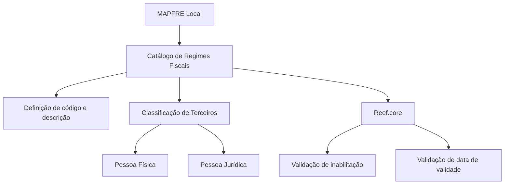

# Definição de Regimes Fiscais — Catálogo de Terceiros no Reef.core

## 1. Metadados do Documento
- **Arquivo de Origem:** `Não identificado — conteúdo bruto fornecido na solicitação`
- **Tipo de Documento:** `Especificação Funcional`
- **Domínio / Sistema:** `Reef.core / MAPFRE Local / Cadastro de Terceiros`
- **Público-Alvo:** `Analistas Funcionais, Negócio, Operação e equipes de configuração do sistema`
- **Data/Versão Identificada:** `Não identificada`

---

## 2. Resumo Executivo & Contexto de Negócio

O documento descreve a definição e a utilização do catálogo de **Regimes Fiscais** associado a Terceiros no sistema Reef.core. Um regime fiscal é apresentado como o conjunto de normas e instituições que regem a situação tributária de uma pessoa física ou jurídica, incluindo direitos e obrigações decorrentes de determinada atividade econômica.

O núcleo do sistema disponibiliza um catálogo específico para identificar e codificar os códigos de regimes fiscais dos Terceiros. Esse catálogo é entregue inicialmente sem conteúdo, cabendo à entidade definir os códigos e as descrições aplicáveis ao seu contexto operacional.

A entidade MAPFRE Local pode utilizar o atributo de regime fiscal para realizar uma classificação própria e específica dos Terceiros. A definição de cada regime fiscal considera companhia, idioma, código, descrição, tipo de pessoa elegível, situação de inabilitação e data de validade.

O documento não determina uma codificação padronizada ou uma recomendação obrigatória para os regimes fiscais. Contudo, recomenda que a entidade MAPFRE avalie a conveniência de utilizar o catálogo transversalmente nos processos da companhia, visando à correta definição e à posterior exploração das informações.

---

## 3. Arquitetura, Componentes & Tecnologias Envolvidas

| Componente / Entidade | Papel descrito no documento |
| :--- | :--- |
| **Reef.core** | Sistema que utiliza a propriedade de inabilitação e a data de validade do regime fiscal para controlar a utilização operacional dos códigos. |
| **Núcleo do Sistema** | Disponibiliza a capacidade de identificar e codificar códigos de regimes fiscais de Terceiros. |
| **Catálogo de Regimes Fiscais** | Catálogo específico de informação para definição dos códigos de regimes fiscais; é entregue inicialmente vazio. |
| **Terceiro** | Pessoa física e/ou jurídica para a qual o regime fiscal pode ser definido e utilizado. |
| **MAPFRE Local** | Entidade que pode adotar uma classificação própria e específica dos Terceiros por meio do atributo de regime fiscal. |
| **Companhia** | Propriedade que informa o código da companhia para a qual a definição do regime fiscal está sendo realizada. |
| **Idioma** | Propriedade que identifica o idioma utilizado na definição do regime fiscal no catálogo. |



**Nota de Análise:** o documento não descreve integrações técnicas, APIs, métodos HTTP, contratos JSON, bancos de dados, ambientes de infraestrutura ou tecnologias de implementação além da referência ao Reef.core.

---

## 4. Regras de Negócio, Especificações Funcionais & Processos

### 4.1 Definição de regime fiscal

- O regime fiscal corresponde ao conjunto de normas e instituições que regulam a situação tributária de uma pessoa física ou jurídica.
- Os regimes fiscais envolvem direitos e obrigações decorrentes do desenvolvimento de uma atividade econômica.
- O sistema permite identificar e codificar os códigos de regimes fiscais dos Terceiros em um catálogo específico.
- O catálogo de regimes fiscais é entregue às entidades inicialmente vazio de conteúdo.
- A entidade MAPFRE Local pode utilizar o atributo de regime fiscal para classificar Terceiros conforme necessidades locais e específicas.

### 4.2 Identificação organizacional e linguística

- A propriedade **Companhia** informa o código da companhia sobre a qual a definição do regime fiscal do Terceiro está sendo realizada.
- A propriedade **Idioma** informa o idioma utilizado na definição do regime fiscal no catálogo.
- O documento apresenta como exemplos de idiomas: espanhol, inglês e turco.

### 4.3 Código e descrição do regime fiscal

- A propriedade **Código do Regime Fiscal** identifica no sistema o código do regime fiscal aplicável à pessoa física e/ou jurídica.
- A propriedade **Descrição do Regime Fiscal** informa a denominação ou descrição do regime fiscal do Terceiro de acordo com o idioma utilizado na definição.
- O documento apresenta os seguintes exemplos de descrições em espanhol:
  - Régimen de Incorporación Fiscal.
  - Enajenación de bienes.
  - Régimen de Actividades Empresariales con Ingresos a través de Plataformas Tecnológicas.
  - Régimen de Arrendamiento.
  - Régimen de Actividades Empresariales y Profesionales.

### 4.4 Elegibilidade por tipo de Terceiro

O atributo **Uso em Pessoas Físicas/Jurídicas** define quais tipos de Terceiros podem utilizar determinado código de regime fiscal:

1. Pessoas físicas.
2. Pessoas jurídicas.
3. Indistintamente, pessoas físicas e pessoas jurídicas.

### 4.5 Inabilitação operacional

- A propriedade **Inabilitação** informa ao Reef.core se o código de regime fiscal está inabilitado.
- Um código inabilitado não pode ser utilizado em operações de captura e/ou modificação do Terceiro.

### 4.6 Vigência e histórico

- A propriedade **Data de Validade** informa ao Reef.core a data a partir da qual o regime fiscal do Terceiro estará plenamente operativo no sistema.
- O uso correto da data de validade permite manter um histórico das alterações realizadas nas definições das categorias.

### 4.7 Orientação operacional local

- Não existe preferência ou recomendação para estabelecer ou padronizar a codificação dos regimes fiscais no sistema.
- A entidade MAPFRE deve analisar a conveniência de utilizar o catálogo de forma transversal nos processos da companhia.
- A utilização transversal deve apoiar a correta definição e a posterior exploração do catálogo de informações.

### 4.8 Documentos relacionados

O documento recomenda a leitura da diretriz ou documento funcional:

- **Actividades de Terceros**

---

## 5. Tabelas de Parâmetros, Ambientes e Estruturas de Dados

| Item / Parâmetro | Descrição / Função | Tipo / Valores / Formato | Ambiente / Observações |
| :--- | :--- | :--- | :--- |
| Regime Fiscal | Conjunto de normas e instituições que regula a situação tributária de uma pessoa física ou jurídica. | Conceito funcional. | Relacionado a direitos e obrigações provenientes de atividade econômica. |
| Catálogo de Regimes Fiscais | Catálogo específico para identificação e codificação de regimes fiscais de Terceiros. | Catálogo de informação. | Entregue inicialmente vazio de conteúdo. |
| Companhia | Indica o código da companhia para a qual o regime fiscal do Terceiro está sendo definido. | Código de companhia. | Não são apresentados formato ou valores permitidos. |
| Idioma | Indica o idioma empregado na definição do regime fiscal no catálogo. | Idioma. | Exemplos: espanhol, inglês e turco. |
| Código do Regime Fiscal | Indica no sistema o código do regime fiscal da pessoa física e/ou jurídica. | Código. | Não são apresentados formato, tamanho ou convenção de codificação. |
| Descrição do Regime Fiscal | Indica a denominação ou descrição do regime fiscal do Terceiro no idioma definido. | Texto descritivo. | Deve corresponder ao idioma utilizado na definição. |
| Uso em Pessoas Físicas/Jurídicas | Define o tipo de Terceiro que pode utilizar o código do regime fiscal. | Pessoas físicas; pessoas jurídicas; indistintamente. | Propriedade operacional. |
| Inabilitação | Informa se o código está impedido de uso. | Estado de inabilitação. | Código inabilitado não pode ser usado na captura e/ou modificação do Terceiro. |
| Data de Validade | Define a data a partir da qual o regime fiscal estará plenamente operativo. | Data. | Apoia o histórico de alterações nas definições de categorias. |
| MAPFRE Local | Entidade que pode realizar classificação própria e específica de Terceiros. | Entidade organizacional. | Deve avaliar a utilização transversal do catálogo. |
| Reef.core | Sistema que recebe informações de inabilitação e validade do regime fiscal. | Sistema. | O documento não detalha interfaces ou mecanismos técnicos. |

---

## 6. Bateria de Perguntas & Respostas para RAG (FAQ Sintético)

### P1: O que é um regime fiscal no contexto do documento?
**R:** Um regime fiscal é o conjunto de normas e instituições que rege a situação tributária de uma pessoa física ou jurídica. O regime fiscal abrange os direitos e as obrigações originados pelo desenvolvimento de determinada atividade econômica.

### P2: Qual é a finalidade do catálogo de Regimes Fiscais?
**R:** O catálogo de Regimes Fiscais permite identificar e codificar os códigos de regimes fiscais dos Terceiros em um repositório específico de informação. O catálogo é entregue inicialmente sem conteúdo e deve ser definido pela entidade conforme sua necessidade.

### P3: O catálogo de Regimes Fiscais possui uma codificação padronizada obrigatória?
**R:** Não. O documento informa que não existe preferência ou recomendação para estabelecer ou padronizar a codificação dos regimes fiscais no sistema. A entidade MAPFRE deve avaliar a conveniência de empregar o catálogo transversalmente em seus processos.

### P4: Como a MAPFRE Local pode utilizar o atributo de regime fiscal?
**R:** A MAPFRE Local pode utilizar o atributo de regime fiscal para efetuar uma classificação de uso própria e específica dos Terceiros pertencentes à entidade.

### P5: Qual é a função da propriedade Companhia?
**R:** A propriedade Companhia informa o código da companhia sobre a qual está sendo realizada a definição do regime fiscal do Terceiro. O documento não especifica o formato nem os valores possíveis desse código.

### P6: Para que serve a propriedade Idioma no catálogo?
**R:** A propriedade Idioma indica o idioma utilizado na definição do regime fiscal no catálogo. O documento cita espanhol, inglês e turco como exemplos de idiomas que podem ser empregados.

### P7: Quais tipos de Terceiros podem utilizar um código de regime fiscal?
**R:** O atributo Uso em Pessoas Físicas/Jurídicas define se o código pode ser utilizado por pessoas físicas, por pessoas jurídicas ou indistintamente por ambos os tipos de Terceiros.

### P8: O que ocorre quando um código de regime fiscal está inabilitado?
**R:** A propriedade Inabilitação informa ao Reef.core que o código de regime fiscal está impedido de uso. Um código inabilitado não pode ser utilizado nas operações de captura e/ou modificação do Terceiro.

### P9: Qual é a finalidade da Data de Validade do regime fiscal?
**R:** A Data de Validade informa ao Reef.core a data a partir da qual o regime fiscal do Terceiro estará plenamente operativo no sistema. O uso correto dessa propriedade permite manter um histórico das alterações efetuadas nas definições das categorias.

### P10: Quais exemplos de descrições de regimes fiscais são apresentados?
**R:** O documento fornece, em espanhol, os exemplos “Régimen de Incorporación Fiscal”, “Enajenación de bienes”, “Régimen de Actividades Empresariales con Ingresos a través de Plataformas Tecnológicas”, “Régimen de Arrendamiento” e “Régimen de Actividades Empresariales y Profesionales”.

### P11: O documento detalha APIs, contratos JSON ou métodos HTTP para o catálogo?
**R:** Não. O documento descreve propriedades funcionais do catálogo de Regimes Fiscais, mas não apresenta métodos HTTP, APIs, contratos JSON, integrações técnicas, tecnologias de persistência ou detalhes de infraestrutura.

### P12: Qual documento complementar é recomendado para interpretação do conteúdo?
**R:** O documento recomenda a leitura de “Actividades de Terceros”, pois a interpretação isolada do conteúdo sobre Regimes Fiscais pode conduzir a erro.

---

## 7. Glossário de Termos, Siglas & Conceitos-Chave

- **Reef.core:** sistema citado como destinatário das informações de inabilitação e data de validade do código de regime fiscal.
- **MAPFRE Local:** entidade que pode utilizar o atributo de regime fiscal para classificação própria e específica de Terceiros.
- **Terceiro:** pessoa física e/ou jurídica à qual pode ser associado um código de regime fiscal.
- **Regime Fiscal:** conjunto de normas e instituições que regula a situação tributária de pessoa física ou jurídica.
- **Catálogo de Regimes Fiscais:** catálogo específico utilizado para identificar e codificar códigos de regimes fiscais de Terceiros.
- **Inabilitação:** propriedade que determina que um código de regime fiscal não pode ser utilizado em operações de captura e/ou modificação do Terceiro.
- **Data de Validade:** data a partir da qual o regime fiscal do Terceiro estará plenamente operativo no sistema.
- **Captura:** operação mencionada no documento na qual um código de regime fiscal inabilitado não pode ser utilizado.
- **Modificação do Terceiro:** operação mencionada no documento na qual um código de regime fiscal inabilitado não pode ser utilizado.

---

## 8. Notas Críticas, Riscos & Limitações

- O catálogo de Regimes Fiscais é entregue inicialmente vazio; a qualidade e a completude da informação dependem da definição realizada pela entidade.
- O documento não estabelece padrão para codificação dos regimes fiscais, o que pode demandar governança local para garantir consistência de uso entre processos.
- O documento recomenda avaliar o uso transversal do catálogo pela companhia, mas não define processos, responsáveis ou critérios de governança para essa avaliação.
- A interpretação isolada do documento pode conduzir a erro; é recomendada a leitura do material relacionado **Actividades de Terceros**.
- Não há detalhamento sobre APIs, integrações, estrutura de dados física, validações de formato, regras de unicidade, permissões, logs ou tratamento de erros.
- **Nota de Análise:** o documento lista o sistema Reef.core, porém não detalha telas, serviços, métodos HTTP, contratos JSON ou mecanismos pelos quais as propriedades do regime fiscal são persistidas ou validadas.

---

## 9. Conteúdo Bruto Estruturado (Referência Fiel)

```text
--- [PÁGINA 1 DE 3] ---

DEFINICIÓN de Regímenes Fiscales
Contexto
El régimen fiscal es el conjunto de las normas e instituciones que rigen la situación tributaria de
una persona física o jurídica. Se trata por lo tanto, del conjunto de derechos y obligaciones que
surgen del desarrollo de una determinada actividad económica.
Propiedades Generales
Funcionalmente, el núcleo del Sistema cuenta con la posibilidad de identificar y codificar los Códigos
de los Regímenes Fiscales de los Terceros en un catálogo de información específico que se entrega
a las entidades inicialmente vacío de contenido...
... De esta manera la entidad MAPFRE Local podrá emplear este atributo para efectuar una
clasificación de uso propia y específica con los Terceros de la entidad.
Compañía
Esta propiedad le indica al sistema el código de la compañía sobre la que se está realizando la
definición del Régimen Fiscal del Tercero.
Idioma
Esta propiedad le indica al sistema el Idioma empleado en la definición del Régimen Fiscal en el
Catálogo, como por ejemplo: español, inglés, Turco, ...
 / 
 CF
Home Solutions APIs Documentation Zeus
EN


--- [PÁGINA 2 DE 3] ---

Código del Régimen Fiscal
Esta propiedad indicará en el sistema el código del Régimen Fiscal de la Persona Física y/o Jurídica.
Descripción del Régimen Fiscal
Esta propiedad le indica al sistema cual es la denominación o descripción del Régimen Fiscal del
Tercero, de acuerdo con el idioma utilizado en su definición.
A modo de ejemplo y en idioma español:
Régimen de Incorporación Fiscal.
Enajenación de bienes.
Régimen de Actividades Empresariales con Ingresos a través de Plataformas Tecnológicas.
Régimen de Arrendamiento.
Régimen de Actividades Empresariales y Profesionales.
...
Propiedades Operativas
Uso en Personas Físicas/Jurídicas
Este atributo indica el Tipo de Terceros que puede utilizar el Código del Régimen Fiscal que se esté
definiendo en el Sistema, siendo sus valores:
personas Físicas.
personas Jurídicas.
indistintamente para unas y para otras.
Otras Propiedades
Inhabilitación
Esta propiedad le indica a Reef.core si el código del Régimen Fiscal está inhabilitado para poder ser
utilizado en las operaciones de captura y/o modificación del Tercero.
Fecha de Validez
Esta propiedad le indica a Reef.core la fecha a partir de la cual el Régimen Fiscal del Tercero estará
plenamente operativo en el sistema por lo que su correcto uso permite tener un histórico de los
cambios efectuados en las definiciones de los categorías.
Vínculos


--- [PÁGINA 3 DE 3] ---

Relación de Directrices y Documentos funcionales cuya lectura recomendada para evitar que la
interpretación aislada del presente documento pueda conducir a error.
Actividades de Terceros
Preguntas frecuentes
(1) ¿Existe alguna recomendación operativa que deba ser tomada en consideración localmente en la
codificación, uso y definición del catálogo de Regímenes Fiscales en el Sistema?
No existe una preferencia ni recomendación para establecer o estandarizar en el sistema su
codificación si bien la entidad MAPFRE debe analizar la conveniencia de utilizar transversalmente en
los procesos de la compañía este catálogo de información para su correcta definición y posterior
explotación.
```
