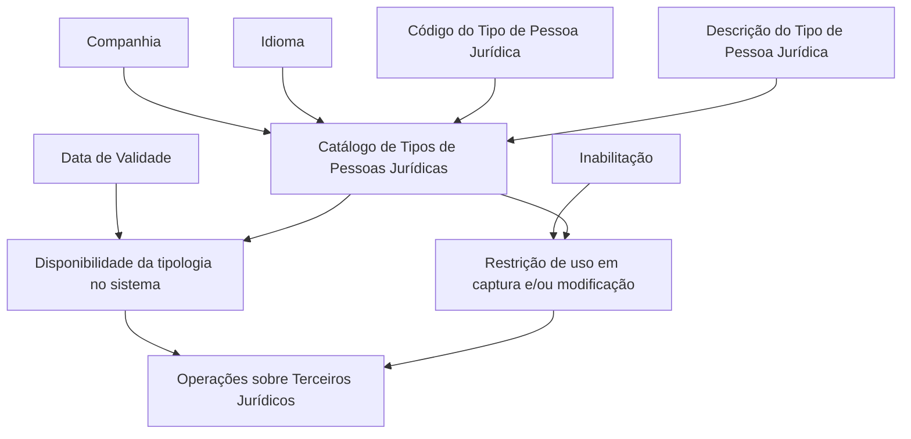

# Definição dos Tipos de Pessoas Jurídicas — Catálogo de Terceiros Jurídicos

## 1. Metadados do Documento
- **Arquivo de Origem:** Não identificado no conteúdo bruto fornecido
- **Tipo de Documento:** Especificação Funcional
- **Domínio / Sistema:** Catálogo de Tipos de Pessoas Jurídicas / Terceiros Jurídicos / MAPFRE
- **Público-Alvo:** Negócio, Analistas Funcionais e Operação
- **Data/Versão Identificada:** Não identificada

---

## 2. Resumo Executivo & Contexto de Negócio

O documento define o catálogo de **Tipos de Pessoas Jurídicas**, cujo objetivo é classificar os **Terceiros Jurídicos** no sistema. A classificação é identificada por um código de tipo de pessoa jurídica e possui uma descrição associada ao idioma configurado.

Cada definição de tipo de pessoa jurídica está vinculada a uma companhia e a um idioma. A companhia determina para qual entidade corporativa a tipologia está sendo definida, enquanto o idioma determina a língua utilizada para definir o código de consentimento, com exemplos de espanhol, inglês e turco.

O catálogo apresenta atributos de governança operacional, incluindo a possibilidade de inabilitar um tipo de pessoa jurídica para operações de captura e/ou modificação de terceiros. Também contém uma data de validade, utilizada para controlar a disponibilidade da tipologia no sistema e manter histórico das alterações feitas nas definições.

O documento recomenda utilizar as descrições dos códigos como complemento informacional da tipologia definida, exemplificando a identificação de terceiros de âmbito público ou privado. A entidade MAPFRE deve analisar a forma mais adequada de utilizar transversalmente esse catálogo nos processos corporativos, considerando sua correta definição e exploração posterior.

---

## 3. Arquitetura, Componentes & Tecnologias Envolvidas

O conteúdo descreve um catálogo funcional dentro de um sistema, sem detalhar arquitetura técnica, microsserviços, APIs, tecnologias, métodos HTTP, contratos JSON, bancos de dados ou ambientes de infraestrutura.

Os componentes funcionais identificados são:

- **Catálogo de Tipos de Pessoas Jurídicas:** estrutura destinada à classificação de terceiros jurídicos.
- **Companhia:** atributo que identifica a companhia para a qual um tipo de pessoa jurídica é definido.
- **Idioma:** atributo que define o idioma empregado na definição.
- **Código do Tipo de Pessoa Jurídica:** chave que identifica a tipologia do terceiro jurídico no sistema.
- **Descrição do Tipo de Pessoa Jurídica:** denominação da chave do terceiro no idioma utilizado.
- **Inabilitação:** propriedade que impede o uso do tipo em operações de captura e/ou modificação.
- **Data de Validade:** propriedade que determina a disponibilidade da tipologia e suporta o histórico de alterações.
- **Processos de Captura e Modificação do Terceiro:** operações nas quais um tipo inabilitado não pode ser empregado.



> **Nota de Análise:** O documento não detalha a implementação técnica do catálogo, os mecanismos de persistência, interfaces de usuário, integrações ou contratos de serviço.

---

## 4. Regras de Negócio, Especificações Funcionais & Processos

### Objetivo do catálogo

1. O catálogo de Tipos de Pessoas Jurídicas deve permitir a classificação de Terceiros Jurídicos.
2. A classificação é representada por uma tipologia identificada no sistema por um código de tipo de pessoa jurídica.

### Definição por companhia

1. Todo tipo de pessoa jurídica é definido para uma companhia.
2. O atributo **Companhia** contém o código da companhia para a qual o tipo de pessoa jurídica está sendo definido.

### Definição por idioma

1. O atributo **Idioma** indica ao sistema o idioma empregado na definição.
2. O documento menciona como exemplos de idiomas: espanhol, inglês e turco.
3. A descrição do tipo de pessoa jurídica deve corresponder ao idioma utilizado na definição.

### Código e descrição da tipologia

1. O atributo **Código do Tipo de Pessoa Jurídica** identifica no sistema a chave da tipologia do terceiro jurídico.
2. O atributo **Descrição do Tipo de Pessoa Jurídica** contém a denominação ou descrição da chave do terceiro.
3. As descrições podem complementar a informação da tipologia, por exemplo, indicando se o terceiro é de âmbito público ou privado.
4. Para idioma espanhol, o documento exemplifica códigos como `AAA`, `BBB`, `CCC`, `000`, `001` e `002`.

### Inabilitação

1. A propriedade **Inhabilitación** determina que um tipo de pessoa jurídica está inabilitado.
2. Um tipo de pessoa jurídica inabilitado não pode ser empregado nas operações de captura e/ou modificação do terceiro.

### Data de validade e histórico

1. A propriedade **Fecha de Validez** estabelece a data a partir da qual uma tipologia de pessoa jurídica está disponível para uso no sistema.
2. O uso correto da data de validade permite manter histórico das mudanças efetuadas nas definições.
3. O histórico pode ser explorado posteriormente.

### Recomendação operacional

1. Recomenda-se utilizar as descrições das chaves definidas para complementar a informação sobre a tipologia.
2. A entidade MAPFRE deve analisar a melhor forma de utilizar o catálogo transversalmente nos processos da companhia.
3. A definição deve considerar a exploração posterior das informações catalogadas.

### Documentos e temas relacionados

O documento referencia os seguintes vínculos recomendados para leitura, com o objetivo de evitar interpretações isoladas:

- **Actividades de Terceros**
- **Preguntas frecuentes**

> **Nota de Análise:** O conteúdo não apresenta regras de unicidade dos códigos, obrigatoriedade dos atributos, formato de datas, critérios de aprovação, responsáveis pela manutenção do catálogo ou comportamento do sistema diante de datas de validade futuras ou expiradas.

---

## 5. Tabelas de Parâmetros, Ambientes e Estruturas de Dados

| Item / Parâmetro | Descrição / Função | Tipo / Valores / Formato | Ambiente / Observações |
| :--- | :--- | :--- | :--- |
| Catálogo de Tipos de Pessoas Jurídicas | Permite classificar Terceiros Jurídicos. | Catálogo funcional. | Não são detalhados ambiente ou implementação técnica. |
| Companhia | Contém o código da companhia para a qual o tipo de pessoa jurídica está sendo definido. | Código de companhia. | A estrutura e os valores permitidos não são informados. |
| Idioma | Indica o idioma empregado na definição. | Exemplos citados: espanhol, inglês e turco. | Relaciona-se à definição do Código del Consentimiento, conforme texto original. |
| Código do Tipo de Pessoa Jurídica | Identifica a chave da tipologia do terceiro jurídico no sistema. | Códigos exemplificados: `AAA`, `BBB`, `CCC`, `000`, `001`, `002`. | Não há regra de formato, tamanho ou unicidade informada. |
| Descrição do Tipo de Pessoa Jurídica | Contém a denominação ou descrição da chave do terceiro, de acordo com o idioma utilizado. | Texto descritivo. | Pode complementar informações como âmbito público ou privado. |
| Inhabilitación | Estabelece que o tipo de pessoa jurídica está inabilitado para uso operacional. | Propriedade de estado; valores não detalhados. | Impede uso nas operações de captura e/ou modificação do terceiro. |
| Fecha de Validez | Determina a data a partir da qual a tipologia está disponível no sistema. | Data; formato não especificado. | Suporta histórico de alterações nas definições. |
| `AAA` | Corporación Int. Público. | Código de tipo de pessoa jurídica. | Exemplo apresentado para idioma espanhol. |
| `BBB` | Asociación Int. Público. | Código de tipo de pessoa jurídica. | Exemplo apresentado para idioma espanhol. |
| `CCC` | Fundación Int. Público. | Código de tipo de pessoa jurídica. | Exemplo apresentado para idioma espanhol. |
| `000` | Empresa Int. Privado. | Código de tipo de pessoa jurídica. | Exemplo apresentado para idioma espanhol. |
| `001` | Cooperativa Int. Privado. | Código de tipo de pessoa jurídica. | Exemplo apresentado para idioma espanhol. |
| `002` | Sociedad Civil Int. Privado. | Código de tipo de pessoa jurídica. | Exemplo apresentado para idioma espanhol. |
| Actividades de Terceros | Documento ou diretriz funcional vinculada. | Referência documental. | Leitura recomendada. |
| Preguntas frecuentes | Documento ou diretriz funcional vinculada. | Referência documental. | Leitura recomendada. |

---

## 6. Bateria de Perguntas & Respostas para RAG (FAQ Sintético)

### P1: Qual é o objetivo do catálogo de Tipos de Pessoas Jurídicas?
**R:** O objetivo do catálogo é permitir a classificação de Terceiros Jurídicos no sistema por meio de uma tipologia identificada por código e descrição.

### P2: Para que serve o atributo Companhia na definição de um tipo de pessoa jurídica?
**R:** O atributo Companhia contém o código da companhia para a qual o tipo de pessoa jurídica está sendo definido.

### P3: Qual é a finalidade do atributo Idioma?
**R:** O atributo Idioma indica ao sistema o idioma empregado na definição. O documento cita espanhol, inglês e turco como exemplos e informa que a descrição da chave deve estar de acordo com o idioma utilizado.

### P4: O que identifica o Código do Tipo de Pessoa Jurídica?
**R:** O Código do Tipo de Pessoa Jurídica identifica no sistema a chave da tipologia do Terceiro Jurídico.

### P5: Como deve ser utilizada a descrição de um tipo de pessoa jurídica?
**R:** A descrição contém a denominação da chave do terceiro conforme o idioma utilizado. O documento recomenda que as descrições complementem a informação da tipologia, como a indicação de âmbito público ou privado.

### P6: O que acontece quando um Tipo de Pessoa Jurídica está inabilitado?
**R:** Um Tipo de Pessoa Jurídica inabilitado não pode ser empregado nas operações de captura e/ou modificação do Terceiro.

### P7: Qual é a função da Fecha de Validez no catálogo?
**R:** A Fecha de Validez estabelece a data a partir da qual a tipologia de pessoa jurídica está disponível no sistema. Seu uso correto permite manter um histórico das mudanças realizadas nas definições para exploração posterior.

### P8: Quais exemplos de códigos de Tipos de Pessoas Jurídicas são apresentados para o idioma espanhol?
**R:** O documento apresenta `AAA` para Corporación Int. Público, `BBB` para Asociación Int. Público, `CCC` para Fundación Int. Público, `000` para Empresa Int. Privado, `001` para Cooperativa Int. Privado e `002` para Sociedad Civil Int. Privado.

### P9: O documento define o formato da data de validade?
**R:** Não. O documento informa apenas que a Fecha de Validez estabelece a disponibilidade da tipologia no sistema, sem definir formato, timezone, comportamento para datas expiradas ou validações técnicas.

### P10: O documento especifica APIs, métodos HTTP ou contratos JSON para o catálogo?
**R:** Não. O documento apresenta definições funcionais do catálogo, mas não detalha APIs, métodos HTTP, contratos JSON, microsserviços, banco de dados ou tecnologias de implementação.

### P11: Que leituras relacionadas são recomendadas pelo documento?
**R:** O documento recomenda a leitura de **Actividades de Terceros** e **Preguntas frecuentes**, para evitar que a interpretação isolada do documento conduza a erro.

### P12: Qual é a orientação para utilização corporativa do catálogo na MAPFRE?
**R:** A MAPFRE deve analisar a melhor maneira de utilizar transversalmente o catálogo nos processos da companhia, assegurando sua correta definição e considerando a exploração posterior das informações.

---

## 7. Glossário de Termos, Siglas & Conceitos-Chave

- **MAPFRE:** Entidade mencionada como responsável por analisar a melhor utilização transversal do catálogo nos processos da companhia.
- **Terceiro Jurídico:** Entidade classificada pelo catálogo de Tipos de Pessoas Jurídicas.
- **Tipo de Pessoa Jurídica:** Tipologia usada para classificar um Terceiro Jurídico.
- **Companhia:** Código da companhia para a qual a tipologia está sendo definida.
- **Idioma:** Língua utilizada na definição; o documento cita espanhol, inglês e turco.
- **Código do Tipo de Pessoa Jurídica:** Chave que identifica a tipologia do Terceiro Jurídico no sistema.
- **Descrição do Tipo de Pessoa Jurídica:** Denominação da chave do terceiro conforme o idioma utilizado.
- **Inhabilitación:** Propriedade que torna um Tipo de Pessoa Jurídica indisponível para operações de captura e/ou modificação.
- **Fecha de Validez:** Data a partir da qual uma tipologia fica disponível para uso no sistema.
- **Captura:** Operação mencionada no documento na qual um tipo inabilitado não pode ser utilizado.
- **Modificação do Terceiro:** Operação mencionada no documento na qual um tipo inabilitado não pode ser utilizado.

---

## 8. Notas Críticas, Riscos & Limitações

- O documento não identifica o arquivo de origem, versão, data de publicação ou autor.
- Não há detalhamento de arquitetura técnica, APIs, integrações, tecnologias, ambientes, servidores ou mecanismos de persistência.
- Não são definidos formato e regras de validação da data de validade.
- Não são especificadas regras de unicidade, obrigatoriedade ou tamanho para códigos de tipo de pessoa jurídica.
- O comportamento do sistema para tipos com data de validade futura ou anterior não é detalhado.
- O conteúdo recomenda a leitura de documentos relacionados para reduzir o risco de interpretações isoladas e incorretas.
- A utilização transversal do catálogo pela MAPFRE depende de análise adicional da própria entidade.
- **Nota de Análise:** O documento lista exemplos de tipologias, mas não informa se os códigos apresentados constituem uma lista completa, catálogo oficial ou apenas amostra ilustrativa.

---

## 9. Conteúdo Bruto Estruturado (Referência Fiel)

```text
--- [PÁGINA 1 DE 3] ---

DEFINICIÓN de los Tipos de Personas
Jurídicas
Objetivo
El objeto de este catálogo es poder efectuar una clasificación de los Terceros Jurídicos.
Propiedades Generales
Otras Propiedades
Propiedades Generales
Compañía
Este atributo contiene el código de la compañía para la que se está definiendo el tipo de Persona
Jurídica.
Idioma
Esta propiedad le indica al sistema el Idioma empleado en la definición del Código del
Consentimiento como por ejemplo: español, inglés, turco,...
Código del Tipo de Persona Jurídica
Este atributo identifica en el sistema la clave de la Tipología del Tercero Jurídico.
Descripción del Tipo de Persona Jurídica
 /
 CF
Home Solutions APIs Documentation Zeus
EN


--- [PÁGINA 2 DE 3] ---

Esta propiedad contiene la denominación o descripción de la clave del Tercero, de acuerdo con el
idioma utilizado en la definición.
A modo de ejemplo y si el Idioma utilizado en la definición es el español:
TIPO de PERSONA JURÍDICA DESCRIPCIÓN
AAA Corporación Int. Público
BBB Asociación Int. Público
CCC Fundación Int. Público
000 Empresa Int. Privado
001 Cooperativa Int. Privado
002 Sociedad Civil Int. Privado
...
Otras Propiedades
Inhabilitación
Esta propiedad establece que el Tipo de Persona Jurídica está inhabilitado para poder ser empleado
en las operaciones de captura y/o modificación del Tercero.
Fecha de Validez
Esta propiedad establece la fecha a partir de la cual la Tipología de la Persona Jurídica está
disponible en el sistema para ser utilizada por lo que su correcto uso permite tener un histórico de los
cambios efectuados en las definiciones de las mismas para su posterior explotación.
Vínculos
Relación de Directrices y Documentos funcionales cuya lectura recomendada para evitar que la
interpretación aislada del presente documento pueda conducir a error.
Actividades de Terceros
Preguntas frecuentes


--- [PÁGINA 3 DE 3] ---

(1) ¿Existe alguna recomendación operativa que deba ser tomada en consideración localmente en la
codificación, uso y definición del catálogo de Tipos de Personas Jurídicas en el Sistema?
Una práctica que se ha demostrado que funciona bien y por tanto se recomienda como modelo es
utilizar las descripciones de las claves definidas para complementar la información de la tipología
definida (en el ejemplo mostrado previamente se identifica si la Tipología del Tercero es de ámbito
público o privado ), si bien la entidad MAPFRE debe analizar la mejor manera de utilizar
transversalmente en los procesos de la compañía este catálogo de información para su correcta
definición contemplando su posterior explotación.
```
