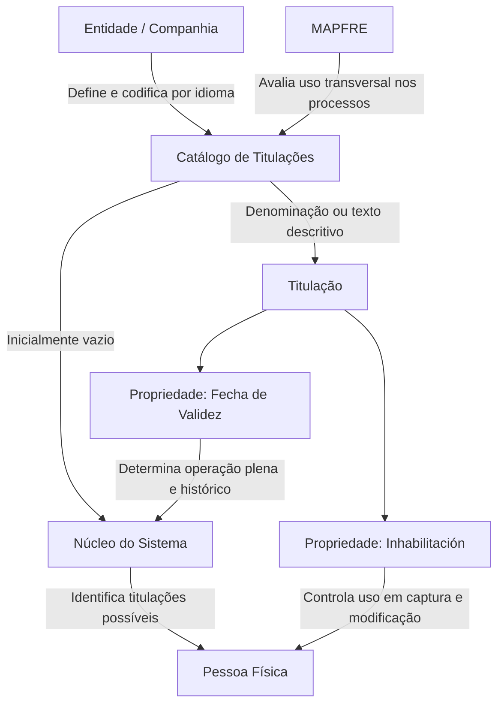

# Definição das Titulações de Terceiros no Sistema

## 1. Metadados do Documento
- **Arquivo de Origem:** `Não identificado no conteúdo fornecido`
- **Tipo de Documento:** `Especificação Funcional`
- **Domínio / Sistema:** `Cadastro de Terceiros / Pessoas Físicas — MAPFRE`
- **Público-Alvo:** `Negócio, Operação e equipes responsáveis pela configuração do Sistema`
- **Data/Versão Identificada:** `Não identificada`

---

## 2. Resumo Executivo & Contexto de Negócio

O documento define o tratamento funcional das **Titulaciones** — títulos oficiais que habilitam uma pessoa ao exercício de uma profissão em território nacional — no catálogo de informações de Pessoas Físicas do Sistema.

O núcleo do Sistema permite identificar e codificar as titulações possíveis das Pessoas Físicas em um catálogo específico. Esse catálogo é entregue inicialmente sem conteúdo às entidades, exigindo que cada entidade realize a definição e a codificação dos dados necessários.

A configuração das titulações pode ser realizada por companhia e por idioma, incluindo Espanhol e Inglês. Cada titulação pode ser identificada individualmente por uma denominação ou texto descritivo, como os exemplos de Graduado, Máster Universitario e Doctorado.

O documento também estabelece duas propriedades operacionais relevantes: **Inhabilitación**, que controla se uma titulação pode ser utilizada nas operações de captura e/ou modificação de uma Pessoa Física, e **Fecha de Validez**, que determina a data a partir da qual a titulação está plenamente operativa no Sistema.

Não existe recomendação ou padronização obrigatória para a codificação das titulações. Entretanto, a entidade MAPFRE deve avaliar a conveniência de utilizar esse catálogo de forma transversal nos processos corporativos, visando sua exploração posterior.

---

## 3. Arquitetura, Componentes & Tecnologias Envolvidas

Os componentes e conceitos explicitamente identificados são:

| Componente / Conceito | Papel descrito no documento |
| :--- | :--- |
| Sistema | Mantém e utiliza o catálogo de Titulações nas operações relacionadas a Pessoas Físicas. |
| Núcleo do Sistema | Possui a capacidade de identificar e codificar titulações possíveis de Pessoas Físicas. |
| Catálogo de Titulações | Catálogo específico de informação entregue inicialmente vazio às entidades. |
| Entidade / Companhia | Define e codifica titulações no catálogo de informação. |
| Idioma | Permite a configuração das titulações por idioma, incluindo Espanhol e Inglês. |
| Pessoa Física | Entidade cujas titulações podem ser capturadas ou modificadas no Sistema. |
| MAPFRE | Entidade que deve analisar a conveniência de utilizar o catálogo transversalmente nos processos da companhia. |
| Atividades de Terceiros | Documento ou diretriz funcional vinculada, recomendado para leitura. |
| Profissões | Documento ou diretriz funcional vinculada, recomendado para leitura. |
| Nível de Estudos | Documento ou diretriz funcional vinculado, recomendado para leitura. |



**Nota de Análise:** O documento não detalha arquitetura técnica, interfaces, métodos HTTP, contratos JSON, banco de dados, tecnologias de implementação, URLs, ambientes ou mecanismos de integração.

---

## 4. Regras de Negócio, Especificações Funcionais & Processos

### 4.1 Definição de Titulação

- Uma **Titulación** é o título oficial que habilita uma pessoa para o exercício de uma profissão no território nacional.
- O Sistema permite identificar e codificar as possíveis titulações de Pessoas Físicas.
- As titulações são mantidas em um catálogo de informação específico.
- O catálogo de titulações é entregue às entidades inicialmente sem conteúdo.

### 4.2 Configuração por companhia e idioma

- O Sistema permite que cada companhia defina e codifique a relação de titulações.
- A definição das titulações pode ser realizada por idioma.
- Os idiomas citados explicitamente são Espanhol e Inglês, sem que o documento limite a configuração a esses idiomas.
- Cada titulação pode receber denominação ou texto descritivo individual.

### 4.3 Exemplos de codificação apresentados

- Código `01`: Graduado.
- Código `02`: Máster Universitario.
- Código `03`: Doctorado.

### 4.4 Propriedade de Inhabilitación

- A propriedade **Inhabilitación** informa ao Sistema se determinada titulação está ou não inabilitada.
- Uma titulação inabilitada não pode ser utilizada nas operações de captura e/ou modificação da Pessoa Física.
- O documento não especifica valores técnicos, formato de armazenamento ou comportamento de titulações previamente atribuídas após sua inabilitação.

### 4.5 Propriedade de Fecha de Validez

- A propriedade **Fecha de Validez** informa a data a partir da qual uma titulação está plenamente operativa no Sistema.
- O uso correto da data de validade permite manter histórico das alterações efetuadas nas definições das titulações.
- O documento não especifica o formato da data, o tratamento de datas futuras ou retroativas, nem as regras de validação de sobreposição temporal.

### 4.6 Diretriz para MAPFRE

- Não existe preferência ou recomendação para estabelecer ou padronizar a codificação das titulações de Terceiros no Sistema.
- A entidade MAPFRE deve analisar a conveniência de utilizar o catálogo de Titulações transversalmente nos processos da companhia.
- A finalidade indicada para o uso transversal é permitir a correta exploração posterior das informações catalogadas.

### 4.7 Documentos funcionais vinculados

A interpretação isolada do documento pode levar a erro. O documento recomenda a leitura das seguintes diretrizes ou documentos funcionais relacionados:

1. Atividades de Terceiros.
2. Profissões.
3. Nível de Estudos.

---

## 5. Tabelas de Parâmetros, Ambientes e Estruturas de Dados

| Item / Parâmetro | Descrição / Função | Tipo / Valores / Formato | Ambiente / Observações |
| :--- | :--- | :--- | :--- |
| Titulação | Título oficial que habilita o exercício de uma profissão em território nacional. | Catálogo de informação. | Aplicável a Pessoas Físicas. |
| Código de Titulação | Identifica individualmente uma titulação no catálogo. | Exemplos: `01`, `02`, `03`. | Não existe padronização obrigatória de codificação. |
| Denominação / descrição | Texto que denomina e identifica individualmente a titulação. | Texto descritivo. | Pode ser definido por idioma. |
| Idioma | Contexto linguístico para definir e codificar as titulações. | Exemplos citados: Espanhol, Inglês. | O documento utiliza reticências, indicando possibilidade de outros idiomas sem detalhá-los. |
| Inhabilitación | Indica se a titulação está inabilitada para uso operacional. | Valor não especificado no documento. | Afeta operações de captura e/ou modificação de Pessoa Física. |
| Fecha de Validez | Data a partir da qual a titulação está plenamente operativa no Sistema. | Data; formato não especificado. | Permite manter histórico de alterações nas definições. |
| Catálogo de Titulações | Repositório específico das titulações possíveis de Pessoas Físicas. | Inicialmente vazio. | Entregue às entidades para configuração. |
| Uso transversal | Possível utilização do catálogo nos processos da companhia. | Decisão a ser analisada pela MAPFRE. | Visa correta exploração posterior das informações. |

| Código de exemplo | Descrição de exemplo | Observações |
| :--- | :--- | :--- |
| `01` | Graduado | Exemplo fornecido pelo documento. |
| `02` | Máster Universitario | Exemplo fornecido pelo documento. |
| `03` | Doctorado | Exemplo fornecido pelo documento. |

---

## 6. Bateria de Perguntas & Respostas para RAG (FAQ Sintético)

### P1: O que é uma Titulação no contexto do Sistema?
**R:** Uma Titulação é o título oficial que habilita uma pessoa para o exercício de uma profissão no território nacional. O Sistema registra as possíveis titulações das Pessoas Físicas em um catálogo específico.

### P2: O catálogo de Titulações já vem preenchido quando é entregue à entidade?
**R:** Não. O catálogo de informação de Titulações é entregue inicialmente vazio de conteúdo, cabendo às entidades definir e codificar as titulações necessárias.

### P3: A configuração das Titulações pode variar entre companhias?
**R:** Sim. O Sistema permite que cada companhia defina e codifique a relação de Titulações aplicável ao seu contexto.

### P4: As Titulações podem ser configuradas em mais de um idioma?
**R:** Sim. O Sistema permite definir e codificar a relação de Titulações por idioma. O documento cita Espanhol e Inglês como exemplos.

### P5: Como uma Titulação é identificada no catálogo?
**R:** Cada Titulação pode ser identificada por um código e por uma denominação ou texto descritivo individual. O documento apresenta como exemplos os códigos `01` para Graduado, `02` para Máster Universitario e `03` para Doctorado.

### P6: Qual é o efeito da propriedade Inhabilitación?
**R:** A propriedade Inhabilitación informa ao Sistema se uma Titulação está ou não inabilitada para ser utilizada nas operações de captura e/ou modificação da Pessoa Física.

### P7: Para que serve a Fecha de Validez de uma Titulação?
**R:** A Fecha de Validez indica a data a partir da qual uma Titulação está plenamente operativa no Sistema. Seu uso correto permite manter histórico dos cambios efetuados nas definições das Titulações.

### P8: Existe um padrão obrigatório para os códigos de Titulações?
**R:** Não. O documento declara que não existe preferência ou recomendação para estabelecer ou padronizar a codificação das Titulações de Terceiros no Sistema.

### P9: Qual orientação é dada especificamente à entidade MAPFRE?
**R:** A MAPFRE deve analisar a conveniência de utilizar transversalmente o catálogo de Titulações nos processos da companhia, para permitir sua correta exploração posterior.

### P10: Quais documentos devem ser consultados para evitar interpretação isolada da definição de Titulações?
**R:** O documento recomenda a leitura de Atividades de Terceiros, Profissões e Nível de Estudos, pois a interpretação isolada da definição de Titulações pode conduzir a erro.

### P11: O documento define métodos HTTP, APIs ou contratos de integração para Titulações?
**R:** Não. O conteúdo fornecido descreve regras funcionais do catálogo de Titulações, mas não detalha métodos HTTP, APIs, contratos JSON, integrações, tecnologias ou URLs.

---

## 7. Glossário de Termos, Siglas & Conceitos-Chave

- **Titulación / Titulações:** Título oficial que habilita o exercício de uma profissão no território nacional.
- **Terceiros:** Termo utilizado no documento para referir-se ao contexto de titulações de terceiros no Sistema.
- **Pessoa Física:** Pessoa cujas Titulações podem ser utilizadas nas operações de captura e/ou modificação.
- **Catálogo de Informação:** Catálogo específico no qual são identificadas e codificadas as possíveis Titulações de Pessoas Físicas.
- **Inhabilitación:** Propriedade que indica se uma Titulação está inabilitada para utilização em operações de captura e/ou modificação de Pessoa Física.
- **Fecha de Validez:** Propriedade que determina a data a partir da qual uma Titulação está plenamente operativa no Sistema.
- **MAPFRE:** Entidade mencionada como responsável por analisar a conveniência do uso transversal do catálogo nos processos da companhia.
- **Uso Transversal:** Utilização do catálogo de Titulações em múltiplos processos da companhia.
- **Home Solutions APIs Documentation Zeus:** Texto presente no conteúdo bruto fornecido; o documento não apresenta definição funcional ou técnica para esse termo.

---

## 8. Notas Críticas, Riscos & Limitações

- O catálogo de Titulações é entregue inicialmente vazio; a qualidade e completude da informação dependem da definição e codificação realizadas pelas entidades.
- Não existe recomendação ou padronização para a codificação das Titulações, o que pode produzir divergências entre companhias ou processos caso não exista governança corporativa complementar.
- O documento recomenda leitura de Atividades de Terceiros, Profissões e Nível de Estudos, pois sua interpretação isolada pode conduzir a erro.
- O documento não especifica formato de código, formato de data, regras para datas futuras ou retroativas, campos obrigatórios, permissões, trilha de auditoria ou critérios de exclusão.
- O documento não detalha tecnologias, arquitetura técnica, persistência, APIs, contratos, integrações, ambientes, URLs, logs ou mecanismos de tratamento de erro.
- O uso transversal do catálogo é apresentado como uma análise de conveniência a ser feita pela MAPFRE, não como obrigação já estabelecida.

---

## 9. Conteúdo Bruto Estruturado (Referência Fiel)

```text
--- [PÁGINA 1 DE 2] ---

DEFINICIÓN de las Titulaciones de los Terceros
Propiedades Generales
Titulación: El Título Oficial que habilita para el ejercicio de una Profesión en el territorio nacional.
Funcionalmente, el núcleo del Sistema cuenta con la posibilidad de identificar y codificar las posibles
Titulaciones de las Personas Físicas en un catálogo de información específico que se entrega a
las entidades inicialmente vacío de contenido.
El sistema permite a nivel de compañía y por idioma (Español, Inglés,...) definir y codificar la relación
de estas Titulaciones Relaciones pudiendo denominar e identificar individualmente cada una de ellas
mediante una denominación o texto descriptivo, e.g:
Titulación Descripción
01 Graduado
02 Máster Universitario
03 Doctorado
... ...
Otras Propiedades
 /
 CF
Home Solutions APIs Documentation Zeus
EN


--- [PÁGINA 2 DE 2] ---

Inhabilitación
Esta propiedad le indica al Sistema si la Titulación está o no inhabilitada para poder ser utilizada en
las operaciones de captura y/o modificación de la persona física.
Fecha de Validez
Esta propiedad le indica al Sistema la fecha a partir de la cual la Titulación está plenamente operativa
en el sistema por lo que su correcto uso permite tener un histórico de los cambios efectuados en las
definiciones de las mismas.
Vínculos
Relación de Directrices y Documentos funcionales cuya lectura recomendada para evitar que la
interpretación aislada del presente documento pueda conducir a error.
Actividades de Terceros
Profesiones
Nivel de Estudios
Preguntas frecuentes
(1) ¿Existe alguna recomendación operativa que deba ser tomada en consideración localmente en la
codificación, uso y definición de la tabla de Titulaciones en el Sistema?
No existe una preferencia ni recomendación para establecer o estandarizar la codificación de las
Titulaciones de los Terceros en el sistema, si bien la entidad MAPFRE debe analizar la conveniencia
de utilizar transversalmente en los procesos de la compañía este catálogo de información para su
correcta y posterior explotación.
```
