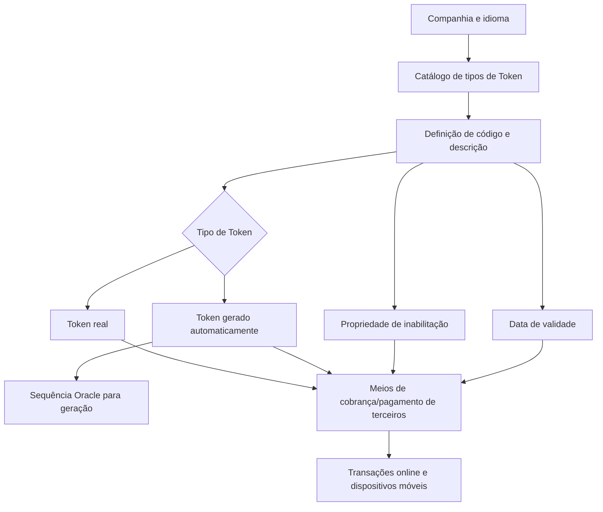

# Definição dos Tipos de Token nos Meios de Cobro ou Pago

## 1. Metadados do Documento
- **Arquivo de Origem:** Não identificado no conteúdo fornecido
- **Tipo de Documento:** Especificação Técnica
- **Domínio / Sistema:** Tesouraria; meios de cobrança e pagamento de terceiros
- **Público-Alvo:** Usuários funcionais e equipes responsáveis pela configuração de meios de cobrança/pagamento
- **Data/Versão Identificada:** Não identificada

---

## 2. Resumo Executivo & Contexto de Negócio

O documento descreve a definição e a configuração de tipos de Token usados nos meios de cobrança e pagamento de terceiros dentro do sistema de Tesouraria de uma companhia. No contexto apresentado, criar um Token equivale a substituir o número de conta tradicional de uma tarjeta de pagamento por uma ficha digital destinada a transações online e dispositivos móveis.

A tokenização preserva as informações associadas à tarjeta sem comprometer sua segurança. O Token também pode ser restringido a um dispositivo móvel específico, comércio específico ou tipo específico de transação.

O núcleo do sistema disponibiliza um catálogo específico para identificar os tipos de Token permitidos nos meios de cobrança e pagamento de terceiros. Esse catálogo é entregue inicialmente vazio e deve ser configurado por companhia e por idioma, como Espanhol e Inglês.

Cada tipo de Token pode ser individualmente identificado por código e denominação descritiva. A configuração funcional inclui propriedades operativas para determinar se o Token é real ou gerado automaticamente, além da sequência Oracle a ser usada na geração automática.

O documento também define propriedades de inabilitação e data de validade para controlar a disponibilidade operacional das tipologias de Token e preservar o histórico de alterações nas definições de cargos. Não existe recomendação corporativa para padronizar a codificação dos tipos de Token.

---

## 3. Arquitetura, Componentes & Tecnologias Envolvidas

### Componentes e conceitos identificados

| Componente / Conceito | Função descrita |
| :--- | :--- |
| Sistema | Núcleo que identifica os tipos de Token utilizáveis nos meios de cobrança e pagamento de terceiros. |
| Tesouraria | Contexto de negócio no qual ocorre a criação e o uso de Tokens. |
| Meios de Cobro ou Pago | Meios de cobrança ou pagamento de terceiros que utilizam tipologias de Token. |
| Catálogo de tipos de Token | Catálogo específico, inicialmente vazio, usado para definir tipos de Token. |
| Companhia | Unidade para a qual a definição de tipos de Token é realizada. |
| Idioma | Dimensão de configuração da definição dos Tokens; são citados Espanhol e Inglês. |
| Token real | Tipo de Token identificado pelo sistema como ficha real. |
| Token gerado automaticamente | Tipo de Token cuja geração é indicada como automática. |
| Sequência Oracle | Código da sequência Oracle que deve ser executada para gerar o Token. |
| Operações de captura e/ou modificação do terceiro | Operações nas quais um tipo de Token inabilitado não pode ser utilizado. |
| Atividades de Terceiros | Documento funcional vinculado, recomendado para leitura complementar. |
| TSP VISA | Exemplo de descrição de Token: `TOKEN TSP VISA`. |
| TSP MasterCard | Exemplo de descrição de Token: `TOKEN TSP MasterCard`. |



> **Nota de Análise:** O documento menciona o sistema, o catálogo de Tokens e a sequência Oracle, mas não detalha interfaces, métodos HTTP, contratos JSON, estrutura de banco de dados, nomes de tabelas ou integrações técnicas adicionais.

---

## 4. Regras de Negócio, Especificações Funcionais & Processos

### 4.1 Conceito de criação de Token

1. A criação de um Token nos processos de Tesouraria representa a substituição do número de conta tradicional de uma tarjeta de pagamento.
2. O número tradicional é substituído por um Token, também denominado ficha digital.
3. O Token é utilizado em transações online e em dispositivos móveis.
4. A tokenização conserva a informação dos dados da tarjeta sem comprometer sua segurança.
5. Um Token pode ser restringido para:
   - Um dispositivo móvel específico.
   - Um comércio específico.
   - Um tipo específico de transação.

### 4.2 Definição de tipos de Token

1. O núcleo do sistema deve permitir a identificação dos tipos de Token que podem ser utilizados nos meios de cobrança e pagamento de terceiros.
2. A identificação ocorre em um catálogo específico de informação.
3. O catálogo é entregue inicialmente vazio de conteúdo.
4. A definição dos tipos de Token deve ser realizada por:
   - Companhia.
   - Idioma.
5. Os idiomas explicitamente citados são Espanhol e Inglês.
6. Cada tipo de Token pode ser individualmente denominado e identificado mediante uma denominação ou texto descritivo.

### 4.3 Propriedades operativas

#### Token real ou Token gerado

A propriedade informa ao sistema se o Token é:
- Uma ficha real; ou
- Um Token gerado automaticamente.

#### Sequência para gerar o Token

A propriedade informa ao sistema o código da sequência Oracle que deve ser executada para gerar o Token.

### 4.4 Outras propriedades

#### Inabilitação

A propriedade de inabilitação indica ao sistema que o tipo de Token está inabilitado para ser utilizado em operações de:
- Captura do terceiro.
- Modificação do terceiro.

#### Data de validade

A propriedade de data de validade indica a data a partir da qual a tipologia do Token dos meios de cobrança ou pagamento está plenamente operativa no sistema.

O uso correto da data de validade permite manter um histórico das alterações efetuadas nas definições de cargos.

### 4.5 Diretriz de codificação

Não existe preferência ou recomendação corporativa para estabelecer ou padronizar a codificação dos tipos de Token utilizados no sistema.

---

## 5. Tabelas de Parâmetros, Ambientes e Estruturas de Dados

| Item / Parâmetro | Descrição / Função | Tipo / Valores / Formato | Ambiente / Observações |
| :--- | :--- | :--- | :--- |
| Tipo de Token | Identifica a tipologia de Token utilizável em meios de cobrança ou pagamento. | Exemplos: `001`, `002`, `aa1`, `CB1`. | Definido por companhia e idioma. |
| Descrição do Token | Denominação ou texto descritivo individual do tipo de Token. | Exemplos: `TOKEN Manual`, `TOKEN Automático`, `TOKEN TSP VISA`, `TOKEN TSP MasterCard`. | Não há padrão corporativo de codificação informado. |
| Companhia | Unidade organizacional para a qual os tipos de Token são definidos. | Não especificado. | Configuração obrigatoriamente contextualizada por companhia. |
| Idioma | Idioma da definição do tipo de Token. | Espanhol, Inglês, outros não detalhados. | A definição é realizada por idioma. |
| Token real ou Token gerado | Indica se o Token é uma ficha real ou é gerado automaticamente. | Ficha real; Token gerado automaticamente. | Propriedade operativa. |
| Sequência para gerar o Token | Código da sequência Oracle executada para gerar o Token. | Código de sequência Oracle não especificado. | Aplicável à geração do Token. |
| Inabilitação | Indica que o tipo de Token não pode ser usado em determinadas operações. | Habilitado ou inabilitado; valores técnicos não especificados. | Bloqueia uso em captura e/ou modificação do terceiro. |
| Data de validade | Data a partir da qual a tipologia de Token está plenamente operativa. | Data; formato não especificado. | Possibilita histórico de mudanças em definições de cargos. |
| Catálogo de tipos de Token | Catálogo específico para os tipos de Token dos meios de cobrança/pagamento. | Inicialmente vazio. | Gerenciado pelo núcleo do sistema. |
| Restrição de uso do Token | Limita o uso de um Token a determinado contexto. | Dispositivo móvel, comércio ou tipo de transação específico. | Aplicável a transações online e dispositivos móveis. |

### Exemplos de tipos de Token apresentados

| Tipo de Token | Descrição |
| :--- | :--- |
| `001` | TOKEN Manual |
| `002` | TOKEN Automático |
| `aa1` | TOKEN TSP VISA |
| `CB1` | TOKEN TSP MasterCard |

---

## 6. Bateria de Perguntas & Respostas para RAG (FAQ Sintético)

### P1: O que significa criar um Token nos processos de Tesouraria?
**R:** Criar um Token significa substituir o número de conta tradicional de uma tarjeta de pagamento por um Token ou ficha digital. O Token é destinado ao uso em transações online e com dispositivos móveis, preservando os dados da tarjeta sem comprometer sua segurança.

### P2: Quais restrições podem ser aplicadas a um Token?
**R:** Um Token pode ser restringido para uso com um dispositivo móvel específico, um comércio específico ou um tipo específico de transação.

### P3: Onde são definidos os tipos de Token utilizados nos meios de cobrança e pagamento?
**R:** Os tipos de Token são definidos em um catálogo específico de informação do núcleo do sistema. Esse catálogo permite identificar os tipos de Token utilizáveis nos meios de cobrança e pagamento de terceiros.

### P4: Como o catálogo de tipos de Token é entregue inicialmente?
**R:** O catálogo específico de tipos de Token é entregue inicialmente vazio de conteúdo.

### P5: Quais dimensões são usadas para definir os tipos de Token?
**R:** A definição dos tipos de Token é realizada por companhia e idioma. O documento cita Espanhol e Inglês como exemplos de idiomas.

### P6: Qual é a diferença entre Token real e Token gerado?
**R:** A propriedade “Token Real ou Token Gerado” informa ao sistema se o Token corresponde a uma ficha real ou se é um Token gerado automaticamente. O documento não detalha critérios técnicos adicionais para essa classificação.

### P7: Qual é a função da sequência Oracle na configuração de Token?
**R:** A propriedade “Sequência para gerar o Token” informa ao sistema o código da sequência Oracle que deve ser executada para gerar o Token.

### P8: O que ocorre quando um tipo de Token está inabilitado?
**R:** Quando um tipo de Token está inabilitado, ele não pode ser utilizado nas operações de captura e/ou modificação do terceiro.

### P9: Para que serve a data de validade de uma tipologia de Token?
**R:** A data de validade informa a partir de quando a tipologia do Token dos meios de cobrança ou pagamento está plenamente operativa no sistema. Seu uso correto permite manter um histórico das alterações realizadas nas definições de cargos.

### P10: Existe um padrão corporativo obrigatório para codificar tipos de Token?
**R:** Não. O documento informa explicitamente que não existe preferência ou recomendação corporativa para estabelecer ou padronizar a codificação dos tipos de Token no sistema.

### P11: Quais exemplos de tipos de Token são fornecidos?
**R:** São apresentados os exemplos `001 — TOKEN Manual`, `002 — TOKEN Automático`, `aa1 — TOKEN TSP VISA` e `CB1 — TOKEN TSP MasterCard`.

### P12: Qual documento funcional é recomendado como leitura complementar?
**R:** O documento recomenda a leitura de “Actividades de Terceros” para evitar que a interpretação isolada da especificação conduza a erro.

---

## 7. Glossário de Termos, Siglas & Conceitos-Chave

- **Token / Toquen / Tóquen:** Ficha digital que substitui o número de conta tradicional de uma tarjeta de pagamento para utilização em transações online e dispositivos móveis.
- **Token real:** Token identificado pelo sistema como uma ficha real.
- **Token gerado automaticamente:** Token produzido automaticamente conforme a configuração aplicável.
- **Meios de Cobro ou Pago:** Meios de cobrança ou pagamento de terceiros.
- **Terceiro:** Entidade cujos meios de cobrança ou pagamento são objeto de captura e/ou modificação no sistema.
- **Tesouraria:** Contexto funcional no qual ocorre a criação e a utilização dos Tokens.
- **Sequência Oracle:** Sequência Oracle cujo código deve ser executado para gerar um Token.
- **TSP VISA:** Texto descritivo apresentado para o tipo de Token `aa1`.
- **TSP MasterCard:** Texto descritivo apresentado para o tipo de Token `CB1`.
- **Catálogo:** Catálogo específico de informação que contém os tipos de Token utilizáveis pelo sistema.
- **Data de validade:** Data a partir da qual uma tipologia de Token se torna plenamente operativa.
- **Inabilitação:** Propriedade que impede o uso de um tipo de Token em operações de captura e/ou modificação do terceiro.

---

## 8. Notas Críticas, Riscos & Limitações

- O catálogo de tipos de Token é entregue inicialmente vazio; a disponibilidade das tipologias depende de configuração posterior por companhia e idioma.
- O documento não define um padrão corporativo de codificação para os tipos de Token. Essa ausência pode resultar em convenções locais distintas entre companhias ou implementações.
- O documento não especifica o formato, tamanho, unicidade ou regras de validação dos códigos de tipos de Token.
- A sequência Oracle é mencionada, mas não são fornecidos o nome, o contrato de execução, as permissões necessárias ou o tratamento de falhas dessa sequência.
- Não são detalhados os critérios operacionais que distinguem um Token real de um Token gerado automaticamente.
- A propriedade de inabilitação impede o uso em captura e/ou modificação do terceiro, mas o documento não esclarece o comportamento para Tokens já associados, históricos ou utilizados em transações anteriores.
- A data de validade permite manter histórico das alterações nas definições de cargos, mas não são especificados formato, fuso horário, regra para datas futuras ou comportamento para datas expiradas.
- A leitura de **Actividades de Terceros** é recomendada para evitar interpretações isoladas incorretas.

---

## 9. Conteúdo Bruto Estruturado (Referência Fiel)

```text
--- [PÁGINA 1 DE 3] ---

DEFINICIÓN de los Tipos de Token en los
Medios de Cobro o Pago
Contexto
La acción de 'crear un toquen (Token)' en los Procesos de la Tesorería de una compañía no es sino
el reemplazo del número de cuenta tradicional de una tarjeta de pago con un toquen (Token) o ficha
digital para su uso en las transacciones en línea y con dispositivos móviles, conservando la
información de los datos de la Tarjeta pero sin comprometer su seguridad.
El toquen se puede restringir para utilizar con un dispositivo móvil, comercio o tipo de transacción
específico.
Propiedades Generales
Funcionalmente, el núcleo del Sistema cuenta con la posibilidad de identificar los tipos de tóquenes
que se pueden utilizar en los medios de Cobro y Pago de los Terceros, en un catálogo de información
específico que se entrega inicialmente a las instalaciones vacío de contenido.
La definición de los tipos de tóquenes utilizados en los Medios de Cobro/Pago en el Sistema se
realiza por compañía e idioma (Español , Inglés, ...) pudiendo denominar e identificar individualmente
cada una de ellos mediante una denominación o texto descriptivo, e.g:
Tipo de TOQUEN Descripción
001 TOKEN Manual
 / 
 CF
Home Solutions APIs Documentation Zeus
EN


--- [PÁGINA 2 DE 3] ---

Tipo de TOQUEN Descripción
002 TOKEN Automático
aa1 TOKEN TSP VISA
CB1 TOKEN TSP MasterCard
... ...
Propiedades Operativas
Toquen Real o Toquen Generado
Esta propiedad le indica al sistema si el Toquen es una ficha Real o es en cambio un toquen
generado automáticamente.
Secuencia para generar el Toquen
Esta propiedad le indica al sistema el código de la secuencia ORACLE que se ha de ejecutar para
generar el Toquen.
Otras Propiedades
Inhabilitación
Esta propiedad le indica al Sistema que el tipo de Toquen está inhabilitada para poder ser utilizada en
las operaciones de captura y/o modificación del Tercero.
Fecha de Validez
Esta propiedad le indica al Sistema la fecha a partir de la cual la Tipología del Token de los Medios
de Cobro o Pago está plenamente operativo en el sistema por lo que su correcto uso permite tener
un histórico de los cambios efectuados en las definiciones de los cargos.
Vínculos
Relación de Directrices y Documentos funcionales cuya lectura recomendada para evitar que la
interpretación aislada del presente documento pueda conducir a error.
Actividades de Terceros


--- [PÁGINA 3 DE 3] ---

Preguntas frecuentes
(1) ¿Existe alguna recomendación operativa que deba ser tomada en consideración localmente en la
codificación, uso y definición de las tipologías de los Tóquenes que pueden ser utilizadas en el
Sistema?
No existe Corporativamente una preferencia o recomendación para establecer o estandarizar en el
sistema su codificación.
```
