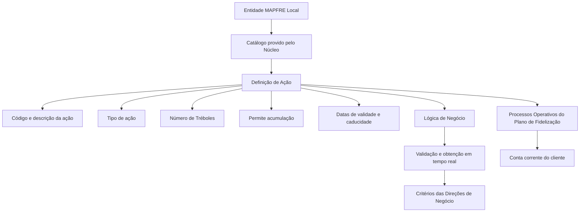

# Catálogo de Ações para Somar/Subtrair Tréboles no Plano de Fidelização

## 1. Metadados do Documento
- **Arquivo de Origem:** Não identificado — conteúdo bruto fornecido em três páginas
- **Tipo de Documento:** Especificação Funcional
- **Domínio / Sistema:** Plano de Fidelização MAPFRE Local — catálogo de ações para gestão de Tréboles
- **Público-Alvo:** Negócio, Operação, Configuração de Catálogos e Arquitetura Funcional
- **Data/Versão Identificada:** Não identificada

---

## 2. Resumo Executivo & Contexto de Negócio

O documento define as ações que permitem somar ou subtrair Tréboles na conta corrente do cliente dentro de um Plano de Fidelização. O objetivo é configurar e classificar, em um catálogo fornecido pelo núcleo, todas as ações que geram incremento ou redenção de Tréboles.

Cada ação do catálogo é associada a uma companhia, um código, uma descrição em idioma específico, um tipo de ação, uma quantidade de Tréboles, regras de acumulação, datas de validade e caducidade, estado de inabilitação e uma lógica de negócio. A configuração permite que o sistema determine como a ação impacta o saldo de Tréboles do cliente.

O catálogo possui requisitos mandatórios: as ações de código `[1] - Cobro del Recibo` e `[2] - Anulado de Cobro del Recibo` devem estar obrigatoriamente definidas para a entidade. O documento também estabelece que ações com impacto em recibos e que permitam canje de Tréboles, tais como emissão de apólice, suplemento ou renovação, devem ser configuradas com zero no número de Tréboles.

A definição temporal das ações, por meio de data de validade e data de caducidade, permite preservar histórico de alterações, rastrear configurações e explorar informações posteriormente. A lógica de negócio associada a cada ação pode validar e obter, em tempo real, o número de Tréboles aplicável segundo critérios definidos pelas Direções de Negócio da entidade MAPFRE Local.

---

## 3. Arquitetura, Componentes & Tecnologias Envolvidas

O documento não apresenta uma arquitetura técnica detalhada, tecnologias de implementação, APIs, protocolos, bancos de dados, ambientes ou contratos de integração. A estrutura funcional identificada contém os seguintes componentes e conceitos:

- **Núcleo:** provê o catálogo no qual as ações são configuradas e classificadas.
- **Catálogo de Ações:** repositório funcional de definições de ações que incrementam ou redimem Tréboles.
- **Plano de Fidelização:** contexto de negócio que utiliza as ações configuradas.
- **Conta corrente do cliente:** saldo no qual as ações podem incrementar ou impactar Tréboles.
- **Lógica de Negócio:** mecanismo cujo nome é informado na configuração e que valida ou obtém, em tempo real, o número de Tréboles.
- **Direções de Negócio da entidade MAPFRE Local:** definem combinações de critérios utilizadas pela lógica de negócio.
- **Processos Operativos:** processos associados ao Plano de Fidelização que não podem utilizar uma ação inabilitada.



> **Nota de Análise:** O documento descreve o catálogo como provido pelo núcleo, mas não detalha a tecnologia do núcleo, métodos HTTP, contratos JSON, persistência, interfaces de usuário, serviços, URLs, ambientes ou mecanismos de integração.

---

## 4. Regras de Negócio, Especificações Funcionais & Processos

### 4.1 Objetivo do catálogo

O catálogo deve configurar e classificar todas as ações que impliquem:

- Incremento de Tréboles na conta corrente do cliente.
- Redenção de Tréboles na conta corrente do cliente.

### 4.2 Identificação por companhia

O atributo **Compañía** contém o código da companhia sobre a qual é realizada a definição da ação específica do Plano de Fidelização.

### 4.3 Código da ação

O atributo **Código de la Acción** determina o código ou chave da ação configurada no catálogo.

As seguintes ações devem ser obrigatoriamente definidas para a entidade:

- Código `[1]`: `Cobro del Recibo`.
- Código `[2]`: `Anulado de Cobro del Recibo`.

O documento afirma que não existe preferência nem recomendação obrigatória para padronizar a codificação das ações no sistema. Entretanto, a entidade MAPFRE deve avaliar a conveniência de utilizar o catálogo de maneira transversal nos processos da companhia, para permitir exploração posterior adequada das informações.

Como exemplos de organização opcional da codificação, o documento indica:

- Agrupar e codificar ações por faixas, conforme o âmbito de utilização.
- Agrupar e codificar ações conforme a atividade econômica à qual são dirigidas.

### 4.4 Descrição da ação e idioma

A propriedade **Descripción de la Acción** contém a denominação ou descrição da ação conforme o idioma utilizado na definição.

A propriedade **Idioma** é a chave do idioma utilizado para definir as ações. O documento cita como exemplos espanhol, inglês e turco.

### 4.5 Tipo de ação

A propriedade **Tipo de Acción** determina a tipologia da ação do Plano de Fidelização e indica se a ação serve para incrementar ou redimir o saldo de Tréboles do cliente.

Os valores exemplificados são:

- Tipo `1`: `REDIMIR GENÉRICO`.
- Tipo `2`: `INCREMENTAR GENÉRICO`.

### 4.6 Número de Tréboles

Para cada ação, deve ser identificada a quantidade de Tréboles associada. A quantidade pode ser positiva ou negativa.

Segundo o texto:

- Quando a quantidade for **positiva**, ela corresponde ao número de Tréboles que podem ser redimidos para aplicar um desconto sobre o prêmio.
- Quando a quantidade for **negativa**, ela corresponde ao número de Tréboles que podem ser monetizados, por exemplo, para compra de entradas de cinema ou outra ação realizada por parceiro externo.
- Para ações que possam impactar recibos e sobre as quais seja possível aplicar o canje de Tréboles, tais como emissão de apólice, suplemento ou renovação, deve ser informado o valor **zero** no número de Tréboles.

> **Nota de Análise:** O documento estabelece os valores positivos, negativos e zero para o atributo Número de Tréboles, mas não apresenta exemplos completos que relacionem esses sinais aos tipos `REDIMIR GENÉRICO` e `INCREMENTAR GENÉRICO`. A interpretação deve preservar a regra textual e ser validada localmente quando houver necessidade de implementação.

### 4.7 Acumulação reiterativa

O atributo **Permite Acumularlos** determina se a ação permite ou não acumular reiteradamente a quantidade de Tréboles configurada para a ação definida.

### 4.8 Caducidade e validade

A propriedade **Fecha de Caducidad** determina a data de caducidade da ação definida. Essa propriedade permite estabelecer caducidades diferentes de acordo com a origem da obtenção dos Tréboles.

A propriedade **Fecha de Validez** estabelece a data a partir da qual a definição de uma ação fica disponível para uso no sistema. Uma configuração correta da data de validade permite:

1. Manter histórico das alterações efetuadas nas definições.
2. Rastrear as alterações realizadas.
3. Explorar posteriormente as informações históricas.

### 4.9 Lógica de negócio em tempo real

A propriedade **Lógica de Negocio** informa ao sistema o nome da lógica de negócio que permite:

1. Validar a ação definida.
2. Obter o número de Tréboles da ação definida.
3. Executar a validação e a obtenção em tempo real.
4. Considerar as combinações de critérios determinadas pelas Direções de Negócio da entidade MAPFRE Local.

O documento não detalha os nomes das lógicas de negócio, os critérios disponíveis, os algoritmos de cálculo, os contratos de entrada e saída ou os mecanismos técnicos de execução em tempo real.

### 4.10 Inabilitação

A propriedade **Inhabilitación** estabelece que o código da ação definida está inabilitado para uso nos Processos Operativos associados ao Plano de Fidelização.

### 4.11 Documentos relacionados

A seção **Vínculos** informa que existe relação com diretrizes e documentos funcionais cuja leitura é recomendada. A finalidade é evitar que a interpretação isolada do documento leve a erro.

> **Nota de Análise:** O conteúdo fornecido menciona os vínculos, mas não identifica nomes, URLs, códigos ou versões dos documentos funcionais relacionados.

---

## 5. Tabelas de Parâmetros, Ambientes e Estruturas de Dados

| Item / Parâmetro | Descrição / Função | Tipo / Valores / Formato | Ambiente / Observações |
| :--- | :--- | :--- | :--- |
| Compañía | Contém o código da companhia para a qual a ação concreta do Plano de Fidelização é definida. | Código de companhia; formato não detalhado. | Aplicável à entidade configurada. |
| Código de la Acción | Determina o código ou chave da ação no catálogo. | Código; formato não detalhado. | Códigos `1` e `2` são obrigatórios. |
| Código `1` | Ação obrigatória denominada `Cobro del Recibo`. | Valor fixo identificado no documento. | Deve estar definida para a entidade. |
| Código `2` | Ação obrigatória denominada `Anulado de Cobro del Recibo`. | Valor fixo identificado no documento. | Deve estar definida para a entidade. |
| Descripción de la Acción | Contém a denominação ou descrição da ação no idioma definido. | Texto; idioma associado à definição. | Não há limite de tamanho informado. |
| Tipo de Acción | Determina se a ação serve para incrementar ou redimir saldo de Tréboles. | `1 = REDIMIR GENÉRICO`; `2 = INCREMENTAR GENÉRICO`. | O documento apresenta esses valores como exemplos possíveis. |
| Número de Tréboles | Quantidade de Tréboles associada a cada ação. | Número positivo, negativo ou zero. | Positivo: Tréboles para redenção e desconto sobre prêmio; negativo: Tréboles monetizáveis; zero: ações com impacto em recibos e canje, como emissão, suplemento ou renovação. |
| Permite Acumularlos | Define se a ação permite acumular reiteradamente a quantidade de Tréboles. | Booleano ou formato não detalhado. | O documento não especifica valores técnicos. |
| Fecha de Caducidad | Determina a data de caducidade da ação. | Data; formato não detalhado. | Pode variar conforme a origem da obtenção dos Tréboles. |
| Lógica de Negocio | Informa o nome da lógica que valida e obtém o número de Tréboles da ação. | Nome ou identificador; formato não detalhado. | Executada em tempo real segundo critérios das Direções de Negócio MAPFRE Local. |
| Idioma | Chave do idioma empregado na definição das ações. | Exemplos: espanhol, inglês, turco. | A descrição da ação é definida conforme o idioma. |
| Fecha de Validez | Define a data a partir da qual a ação pode ser utilizada pelo sistema. | Data; formato não detalhado. | Suporta histórico, rastreabilidade e exploração posterior das alterações. |
| Inhabilitación | Indica que o código da ação não pode ser empregado em Processos Operativos do Plano de Fidelização. | Estado de inabilitação; formato não detalhado. | Bloqueia o uso operacional da ação. |
| Vínculos | Relação de diretrizes e documentos funcionais recomendados. | Referências não fornecidas. | A leitura é recomendada para evitar interpretação isolada incorreta. |
| Núcleo | Provedor do catálogo onde ações são configuradas e classificadas. | Tecnologia não detalhada. | Não há detalhes de interfaces ou integrações. |
| Direções de Negócio MAPFRE Local | Determinam combinações de critérios usadas pela lógica de negócio. | Critérios não detalhados. | Aplicável à validação e obtenção em tempo real. |

---

## 6. Bateria de Perguntas & Respostas para RAG (FAQ Sintético)

### P1: Qual é o objetivo do catálogo de ações para somar ou subtrair Tréboles?
**R:** O catálogo tem o objetivo de configurar e classificar, em um catálogo fornecido pelo núcleo, todas as ações que impliquem incremento ou redenção de Tréboles na conta corrente do cliente no Plano de Fidelização.

### P2: Quais códigos de ação devem obrigatoriamente existir para a entidade?
**R:** A entidade deve obrigatoriamente ter definidas as ações de código `[1] - Cobro del Recibo` e `[2] - Anulado de Cobro del Recibo`.

### P3: O documento exige uma padronização obrigatória para os códigos das ações?
**R:** Não. O documento afirma que não existe preferência nem recomendação para estabelecer ou padronizar a codificação no sistema. Ainda assim, recomenda que a entidade MAPFRE avalie o uso transversal do catálogo nos processos da companhia para facilitar a exploração posterior das informações.

### P4: Como a entidade pode organizar os códigos de ações caso opte por uma convenção local?
**R:** O documento apresenta como exemplos a organização dos códigos por faixas, segundo o âmbito de utilização, ou o agrupamento e codificação conforme a atividade econômica à qual as ações são dirigidas.

### P5: Quais tipos de ação são apresentados para o Plano de Fidelização?
**R:** O documento apresenta como valores possíveis o tipo `1 - REDIMIR GENÉRICO` e o tipo `2 - INCREMENTAR GENÉRICO`. A propriedade Tipo de Acción indica se a ação serve para incrementar ou redimir o saldo de Tréboles do cliente.

### P6: Como deve ser configurado o Número de Tréboles para uma ação?
**R:** Cada ação deve ter uma quantidade de Tréboles associada. Essa quantidade pode ser positiva, negativa ou zero. Quantidades positivas correspondem ao número de Tréboles que podem ser redimidos para aplicar desconto sobre o prêmio; quantidades negativas correspondem a Tréboles monetizáveis, como em compra de entradas de cinema ou ações realizadas por parceiros externos.

### P7: Quando o Número de Tréboles deve ser configurado com zero?
**R:** O valor zero deve ser informado para ações que possam impactar recibos e sobre as quais possa ser aplicado o canje de Tréboles, incluindo exemplos como emissão de apólice, suplemento ou renovação.

### P8: O que controla o atributo Permite Acumularlos?
**R:** O atributo Permite Acumularlos determina se a ação permite ou não acumular reiteradamente a quantidade de Tréboles configurada para aquela ação.

### P9: Qual é a diferença entre Fecha de Validez e Fecha de Caducidad?
**R:** Fecha de Validez estabelece a data a partir da qual a definição da ação fica disponível para uso no sistema. Fecha de Caducidad determina a data de caducidade da ação. A data de validade suporta histórico, rastreabilidade e exploração posterior de mudanças; a data de caducidade permite estabelecer vencimentos diferentes conforme a origem de obtenção dos Tréboles.

### P10: Qual é a finalidade da propriedade Lógica de Negocio?
**R:** Lógica de Negocio informa ao sistema o nome da lógica responsável por validar e obter, em tempo real, o número de Tréboles da ação definida, considerando as combinações de critérios determinadas pelas Direções de Negócio da entidade MAPFRE Local.

### P11: O que acontece quando uma ação está inabilitada?
**R:** Quando a propriedade Inhabilitación estabelece que o código de uma ação está inabilitado, esse código não pode ser empregado nos Processos Operativos associados ao Plano de Fidelização.

### P12: Como o idioma é aplicado à definição das ações?
**R:** O atributo Idioma é a chave do idioma empregada na definição da ação. A Descripción de la Acción contém a denominação ou descrição da ação de acordo com esse idioma. O documento cita espanhol, inglês e turco como exemplos.

### P13: O documento especifica APIs, tecnologias ou contratos técnicos para o catálogo?
**R:** Não. O documento informa que o catálogo é fornecido pelo núcleo e descreve propriedades funcionais das ações, mas não detalha APIs, métodos HTTP, tecnologias, bancos de dados, URLs, ambientes, formatos de mensagens ou contratos técnicos.

---

## 7. Glossário de Termos, Siglas & Conceitos-Chave

- **Ação:** definição configurada no catálogo para provocar incremento ou redenção de Tréboles na conta corrente do cliente.
- **Canje de Tréboles:** uso ou troca de Tréboles em ações que podem impactar recibos, como emissão de apólice, suplemento ou renovação.
- **Catálogo:** estrutura provida pelo núcleo para configurar e classificar ações relacionadas a Tréboles.
- **Cobro del Recibo:** ação obrigatória de código `1`.
- **Cuenta corriente del cliente:** conta corrente do cliente na qual as ações impactam o saldo de Tréboles.
- **Direções de Negócio:** áreas que determinam combinações de critérios utilizadas pela Lógica de Negócio da entidade MAPFRE Local.
- **Emisión de una Póliza:** exemplo de ação com possível impacto em recibos, para a qual o Número de Tréboles deve ser zero.
- **Fecha de Caducidad:** data de caducidade de uma ação definida.
- **Fecha de Validez:** data a partir da qual a ação fica disponível para uso no sistema.
- **Inhabilitación:** propriedade que impede o emprego do código de ação nos Processos Operativos associados ao Plano de Fidelização.
- **Lógica de Negocio:** lógica cujo nome é informado ao sistema para validar e obter, em tempo real, o número de Tréboles de uma ação.
- **MAPFRE Local:** entidade MAPFRE cujas Direções de Negócio definem os critérios associados à lógica de negócio.
- **Núcleo:** componente que provê o catálogo de ações, sem detalhamento técnico adicional.
- **Plano de Fidelização:** contexto funcional no qual são configuradas e utilizadas as ações para gestão de Tréboles.
- **Processos Operativos:** processos associados ao Plano de Fidelização que não podem utilizar ações inabilitadas.
- **Suplemento:** exemplo de ação com possível impacto em recibos, para a qual o Número de Tréboles deve ser zero.
- **Tréboles:** unidade de saldo gerenciada na conta corrente do cliente pelo Plano de Fidelização.

---

## 8. Notas Críticas, Riscos & Limitações

- O documento não especifica implementação técnica, arquitetura de infraestrutura, APIs, contratos de integração, URLs, ambientes, servidores, bancos de dados ou mecanismos de persistência.
- O documento não fornece nomes concretos das lógicas de negócio, critérios de negócio, fórmulas ou algoritmos usados para validar e obter o número de Tréboles em tempo real.
- O documento não detalha o formato dos campos, tipos técnicos, obrigatoriedade de preenchimento, validações de entrada ou regras de precedência entre datas.
- A relação entre os tipos `REDIMIR GENÉRICO` e `INCREMENTAR GENÉRICO` e o sinal positivo ou negativo do Número de Tréboles não é explicitamente detalhada; a implementação deve respeitar o texto e obter validação funcional local quando necessário.
- A configuração de datas de validade e caducidade é relevante para a rastreabilidade e para o histórico das definições; configurações incorretas podem afetar a disponibilidade ou vencimento operacional das ações.
- Uma ação inabilitada não pode ser usada nos Processos Operativos do Plano de Fidelização.
- O documento recomenda a leitura de diretrizes e documentos funcionais vinculados para evitar interpretação isolada incorreta, porém essas referências não foram fornecidas.
- A codificação das ações não possui padrão obrigatório definido pelo documento. A ausência de uma convenção local pode reduzir a capacidade de exploração transversal das informações pela companhia.

---

## 9. Conteúdo Bruto Estruturado (Referência Fiel)

```text
--- [PÁGINA 1 DE 3] ---

DEFINICIÓN de las ACCIONES que permiten
SUMAR/RESTAR TRÉBOLES
Objetivo
Configurar y clasificar en un catálogo provisto por el núcleo, de todas aquellas acciones que
conlleven un incremento o redención de los Tréboles en la 'cuenta corriente' del cliente.
Propiedades
Otras Propiedades
Propiedades
Compañía
Este Atributo del catálogo contiene el código de la compañía sobre la que se está realizando la
definición de la acción concreta del Plan de Fidelización.
Código de la Acción
Este Atributo determina el código o clave de la acción que se está configurando en el catálogo.
Las acciones con códigos [1] - 'Cobro del Recibo' y [2] - 'Anulado de Cobro del Recibo' son
acciones que tienen que estar obligatoriamente definidas para la entidad.
Descripción de la Acción
 / 
 CF
Home Solutions APIs Documentation Zeus
EN


--- [PÁGINA 2 DE 3] ---

Esta propiedad contiene la denominación o descripción de la acción de acuerdo con el idioma
utilizado en la definición.
Tipo de Acción
Esta Propiedad determina la tipología de la acción del Plan de Fidelización indicando si la misma
sirve para incrementar o redimir el saldo de tréboles del Cliente, siendo por ejemplo sus posibles
valores:
TIPO DESCRIPCIÓN
1 REDIMIR GENÉRICO
2 INCREMENTAR GENÉRICO
Número de Tréboles
Por cada acción se debe identificar la cantidad de tréboles asociados a la misma, cantidad que podrá
ser un número positivo o negativo, de tal manera que...
Si es positiva, la cantidad configurada se corresponderá con el número de tréboles que se
pueden redimir para aplicar un descuento sobre la prima.
Si es negativa, se corresponderá con el número de tréboles que se pueden monetizar, como por
ejemplo para la compra de unas entradas en el cine o cualquier otra acción que se determine
sea realizada por algún socio externo.
En aquellas acciones que puedan tener un impacto en los Recibos y sobre las que se pueda
aplicar el canje de tréboles, como por ejemplo la Emisión de una Póliza, Suplemento o
Renovación, se debe informar un cero en el número de tréboles.
Permite Acumularlos
Este atributo determina si la acción permite o no acumular de manera reiterativa el número de
tréboles para la acción definida.
Fecha de Caducidad
Este Atributo determina la fecha de caducidad de la acción definida y por tanto se puede establecer
diferentes caducidades de acuerdo con el origen de su obtención.
Lógica de Negocio
Esta propiedad le indica al Sistema el nombre de la Lógica de Negocio que que permite validar y
obtener el número de tréboles de la acción definida, en tiempo real y con las combinaciones de


--- [PÁGINA 3 DE 3] ---

criterios que determinen las Direcciones de Negocio de la entidad MAPFRE Local.
Idioma
Esta propiedad es la clave del Idioma empleado en la definición de las acciones, como por ejemplo:
español, inglés, turco, ...
Otras Propiedades
Fecha de Validez
Esta propiedad establece la fecha a partir de la cual la definición de la acción está disponible en el
sistema para ser utilizada, por lo que una correcta configuración habilita tener un histórico de los
cambios efectuados en las definiciones y poder así trazar y explotar posteriormente esta información.
Inhabilitación
Esta propiedad establece que el Código de la Acción definida está inhabilitado para poder ser
empleado en los Procesos Operativos asociados al Plan de Fidelización.
Vínculos
Relación de Directrices y Documentos funcionales cuya lectura recomendada para evitar que la
interpretación aislada del presente documento pueda conducir a error.
Tipos de Acciones
Preguntas frecuentes
(1) ¿Existe alguna recomendación operativa que deba ser tomada en consideración localmente en la
codificación, uso y definición del catálogo de Acciones para Sumar o Restar Tréboles?
No existe una preferencia ni recomendación para establecer o estandarizar en el sistema su
codificación, si bien la entidad MAPFRE debe analizar la conveniencia de utilizar transversalmente en
los procesos de la compañía este catálogo de información para su correcta y posterior explotación,
e.g:
Agrupando y codificando los códigos de las acciones por tramos de acuerdo con su ámbito de
utilización, agrupando y codificando los códigos de las acciones de acuerdo con la actividad
económica a la que van dirigida,...
```
