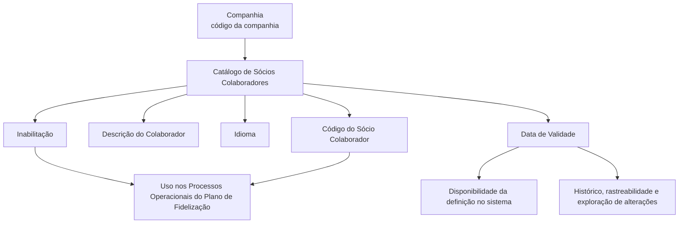

# Definição de Sócios Colaboradores do Plano de Fidelização

## 1. Metadados do Documento
- **Arquivo de Origem:** Não identificado no conteúdo fornecido
- **Tipo de Documento:** Especificação Técnica / Funcional
- **Domínio / Sistema:** Catálogo de Sócios Colaboradores do Plano de Fidelização
- **Público-Alvo:** Negócio, Analistas Funcionais, Operação e equipes responsáveis pela configuração de catálogos
- **Data/Versão Identificada:** Não identificada

---

## 2. Resumo Executivo & Contexto de Negócio

O documento define o catálogo de **Sócios Colaboradores** de um Plano de Fidelização. Sócios colaboradores são empresas relacionadas ao programa que podem oferecer serviços ou produtos de qualidade aos associados vinculados ao plano.

O objetivo explícito é definir a relação de sócios do programa de fidelização da companhia seguradora. A definição é realizada por meio de propriedades de catálogo que identificam a companhia, o sócio colaborador, a descrição em determinado idioma, a validade e a condição de inabilitação.

A propriedade de data de validade permite que uma definição de Sócio Colaborador esteja disponível no sistema a partir de uma data determinada. Essa configuração também viabiliza o histórico das alterações realizadas nas definições e a rastreabilidade e exploração posterior dessas informações.

A propriedade de inabilitação controla se o código identificador do Sócio Colaborador pode ser empregado nos processos operacionais associados ao Plano de Fidelização. O documento informa que não há preferência ou recomendação para padronizar a codificação local dos Sócios Colaboradores.

---

## 3. Arquitetura, Componentes & Tecnologias Envolvidas

Os componentes e conceitos identificados são:

- **Plano de Fidelização:** contexto funcional no qual os Sócios Colaboradores são utilizados.
- **Catálogo de Sócios Colaboradores:** estrutura de configuração que contém as propriedades da definição.
- **Companhia:** entidade cujo código identifica a companhia para a qual a definição do Sócio Colaborador está sendo realizada.
- **Sócio Colaborador:** empresa que pode oferecer serviços ou produtos aos associados ao programa.
- **Processos Operacionais:** processos associados ao Plano de Fidelização que podem utilizar o código do Sócio Colaborador, desde que o código não esteja inabilitado.
- **Idioma:** chave de idioma aplicada à descrição do colaborador.
- **Diretrizes e Documentos Funcionais:** documentos relacionados cuja leitura é recomendada para evitar interpretação isolada incorreta.

O documento não descreve arquitetura de software, microsserviços, APIs, protocolos, ambientes técnicos, métodos HTTP, contratos JSON, bancos de dados ou tecnologias de implementação.



---

## 4. Regras de Negócio, Especificações Funcionais & Processos

1. Um Sócio Colaborador de um programa de fidelização corresponde a uma empresa que pode oferecer serviços ou produtos de qualidade aos associados vinculados ao programa.

2. A definição de um Sócio Colaborador deve ser realizada no catálogo correspondente e associada a uma companhia por meio do código da companhia.

3. O código do Sócio Colaborador determina a chave ou o código do colaborador que está sendo configurado no catálogo.

4. A descrição do colaborador contém a denominação do Sócio Colaborador conforme o idioma utilizado em sua definição.

5. O idioma é a chave de idioma empregada na configuração dos Colaboradores do Plano de Fidelização. O documento fornece como exemplos os idiomas espanhol, inglês e turco.

6. A data de validade estabelece a data a partir da qual a definição do Sócio Colaborador fica disponível para uso no sistema.

7. A configuração correta da data de validade permite manter um histórico das alterações efetuadas nas definições de Sócios Colaboradores.

8. O histórico de alterações pode ser rastreado e explorado posteriormente.

9. A propriedade de inabilitação estabelece que o código identificador do Sócio Colaborador está inabilitado para uso nos processos operacionais associados ao Plano de Fidelização.

10. Não existe preferência nem recomendação para estabelecer ou padronizar localmente a codificação de Sócios Colaboradores no sistema.

11. A leitura das diretrizes e documentos funcionais relacionados é recomendada, pois a interpretação isolada do documento pode conduzir a erro.

---

## 5. Tabelas de Parâmetros, Ambientes e Estruturas de Dados

| Item / Parâmetro | Descrição / Função | Tipo / Valores / Formato | Ambiente / Observações |
| :--- | :--- | :--- | :--- |
| Companhia | Contém o código da companhia para a qual está sendo realizada a definição do Sócio Colaborador. | Código da companhia; formato não detalhado. | Propriedade do catálogo. |
| Código do Sócio Colaborador | Determina o código ou a chave do Sócio Colaborador configurado no catálogo. | Código ou chave; formato não detalhado. | Não há recomendação ou padrão de codificação definido pelo documento. |
| Descrição do Colaborador | Contém a denominação do Sócio Colaborador. | Texto; idioma aplicado conforme a definição. | Propriedade do catálogo. |
| Idioma | Identifica a chave do idioma usada na configuração dos Colaboradores do Plano de Fidelização. | Chave de idioma. Exemplos: espanhol, inglês e turco. | Propriedade do catálogo. |
| Data de Validade | Define a data a partir da qual a definição fica disponível no sistema. | Data; formato não detalhado. | Permite histórico, rastreabilidade e exploração posterior de alterações. |
| Inabilitação | Define que o código identificador do Sócio Colaborador não pode ser usado nos processos operacionais associados ao Plano de Fidelização. | Condição de inabilitação; valores não detalhados. | Afeta o uso operacional do código. |
| Tipos de Ações | Documento funcional relacionado. | Referência documental. | Leitura recomendada. |
| Ações do Plano de Fidelização | Documento funcional relacionado. | Referência documental. | Leitura recomendada. |
| Home Solutions APIs Documentation Zeus | Texto presente na extração. | Não detalhado. | Não há contexto suficiente para classificá-lo como sistema, API ou vínculo funcional. |

---

## 6. Bateria de Perguntas & Respostas para RAG (FAQ Sintético)

### P1: Qual é o objetivo do catálogo de Sócios Colaboradores do Plano de Fidelização?
**R:** O catálogo tem o objetivo de definir a relação de sócios do programa de fidelização da companhia seguradora. Os Sócios Colaboradores são empresas que podem oferecer serviços ou produtos de qualidade aos associados vinculados ao programa.

### P2: O que representa a propriedade Companhia na definição de um Sócio Colaborador?
**R:** A propriedade Companhia contém o código da companhia sobre a qual está sendo realizada a definição do Sócio Colaborador no catálogo.

### P3: Para que serve o Código do Sócio Colaborador?
**R:** O Código do Sócio Colaborador determina o código ou a chave do Sócio Colaborador configurado no catálogo. O documento informa que não existe preferência ou recomendação para padronizar essa codificação no sistema.

### P4: Como a descrição de um Sócio Colaborador é tratada no catálogo?
**R:** A propriedade Descrição do Colaborador contém a denominação do Sócio Colaborador de acordo com o idioma utilizado em sua definição.

### P5: Qual é a função da propriedade Idioma no catálogo de Colaboradores do Plano de Fidelização?
**R:** A propriedade Idioma corresponde à chave de idioma empregada na configuração dos Colaboradores do Plano de Fidelização. O documento cita espanhol, inglês e turco como exemplos de idiomas.

### P6: O que a Data de Validade controla na definição de um Sócio Colaborador?
**R:** A Data de Validade estabelece a data a partir da qual a definição do Sócio Colaborador fica disponível no sistema para utilização.

### P7: Como a Data de Validade contribui para auditoria e rastreabilidade?
**R:** Uma configuração correta da Data de Validade habilita a manutenção de histórico das alterações feitas nas definições de Sócios Colaboradores, permitindo rastrear e explorar essas informações posteriormente.

### P8: Qual é o efeito da Inabilitação de um Sócio Colaborador?
**R:** A Inabilitação determina que o código que identifica o Sócio Colaborador está inabilitado e não pode ser empregado nos Processos Operacionais associados ao Plano de Fidelização.

### P9: Existe uma convenção obrigatória para codificar Sócios Colaboradores?
**R:** Não. O documento declara expressamente que não existe preferência nem recomendação para estabelecer ou padronizar a codificação dos Sócios Colaboradores no sistema.

### P10: Quais documentos relacionados devem ser consultados para interpretar corretamente a definição de Sócios Colaboradores?
**R:** O documento recomenda a leitura de diretrizes e documentos funcionais relacionados, incluindo **Tipos de Ações** e **Ações do Plano de Fidelização**, para evitar que uma interpretação isolada conduza a erro.

---

## 7. Glossário de Termos, Siglas & Conceitos-Chave

- **Sócio Colaborador:** empresa relacionada a um programa de fidelização que pode oferecer serviços ou produtos de qualidade aos associados do programa.
- **Plano de Fidelização:** programa no qual os Sócios Colaboradores são definidos e utilizados em processos operacionais associados.
- **Catálogo:** estrutura em que é configurada a definição do Sócio Colaborador e suas propriedades.
- **Companhia:** entidade identificada por código para a qual é feita a definição do Sócio Colaborador.
- **Código do Sócio Colaborador:** código ou chave que identifica o Sócio Colaborador no catálogo.
- **Data de Validade:** data a partir da qual a definição do Sócio Colaborador fica disponível no sistema.
- **Inabilitação:** condição que impede o uso do código do Sócio Colaborador nos processos operacionais associados ao Plano de Fidelização.
- **Rastreabilidade:** capacidade de acompanhar alterações realizadas nas definições e explorar posteriormente essas informações.

---

## 8. Notas Críticas, Riscos & Limitações

- **Nota de Análise:** O documento não informa o nome do arquivo de origem, a versão, a data de publicação nem autores responsáveis.
- **Nota de Análise:** O documento não detalha arquitetura técnica, APIs, métodos HTTP, contratos JSON, persistência de dados, integrações, perfis de acesso ou fluxos de aprovação.
- **Risco de interpretação:** A leitura isolada do documento pode conduzir a erro. O próprio conteúdo recomenda consultar diretrizes e documentos funcionais relacionados.
- **Limitação de codificação:** Não há regra de padronização, preferência ou recomendação para a codificação de Sócios Colaboradores. Equipes locais precisam considerar essa ausência ao definir convenções internas.
- **Limitação de inabilitação:** O documento informa o efeito funcional da inabilitação, mas não especifica os valores possíveis, o mecanismo de configuração, os responsáveis pela alteração ou regras de reabilitação.
- **Dependência documental:** Os documentos “Tipos de Ações” e “Ações do Plano de Fidelização” são citados como vínculos, mas seu conteúdo não foi fornecido.

---

## 9. Conteúdo Bruto Estruturado (Referência Fiel)

```text
--- [PÁGINA 1 DE 2] ---

DEFINICIÓN de las SOCIOS
COLABORADORES del PLAN de
FIDELIZACIÓN
Contexto
Los socios colaboradores de un programa de fidelización son la relación de empresas que pueden
ofrecer servicios o productos de calidad a los socios adscritos al programa.
Objetivo
Definir la relación de socios del programa de fidelización de la compañía aseguradora.
Propiedades
Otras Propiedades
Propiedades
Compañía
Este Atributo del catálogo contiene el código de la compañía sobre la que se está realizando la
definición del Socio Colaborador del Plan.
Código del Socio Colaborador
 /
 CF
Home Solutions APIs Documentation Zeus
EN


--- [PÁGINA 2 DE 2] ---

Este Atributo determina el código o clave del socio colaborador que se está configurando en el
catálogo.
Descripción del Colaborador
Esta propiedad contiene la denominación del socio colaborador de acuerdo con el idioma utilizado en
su definición.
Idioma
Esta propiedad es la clave del Idioma empleado en la configuración de los Colaboradores del Plan de
Fidelización como por ejemplo: español, inglés, turco, ...
Otras Propiedades
Fecha de Validez
Esta propiedad establece la fecha a partir de la cual la definición del Socio Colaborador está
disponible en el sistema para ser utilizada, por lo que una correcta configuración habilita tener un
histórico de los cambios efectuados en las definiciones y poder así trazar y explotar posteriormente
esta información.
Inhabilitación
Esta propiedad establece que el Código que identifica al Socio Colaborador está inhabilitado para
poder ser empleado en los Procesos Operativos asociados al Plan de Fidelización.
Vínculos
Relación de Directrices y Documentos funcionales cuya lectura recomendada para evitar que la
interpretación aislada del presente documento pueda conducir a error.
Tipos de Acciones
Acciones Plan de Fidelización
Preguntas frecuentes
(1) ¿Existe alguna recomendación operativa que deba ser tomada en consideración localmente en la
codificación, uso y definición del catálogo de Socios Colaboradores del Plan de Fidelización?
No existe una preferencia ni recomendación para establecer o estandarizar en el sistema su
codificación.
```
