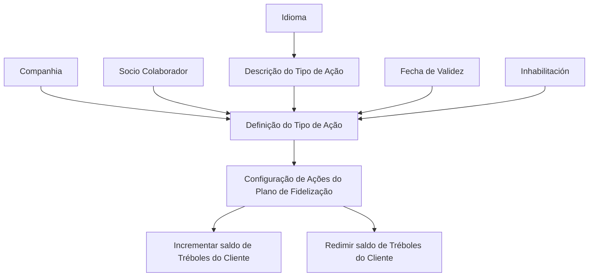

# Definição dos Tipos de Ações para Somar/Subtrair Tréboles no Plano de Fidelização

## 1. Metadados do Documento
- **Arquivo de Origem:** Não informado
- **Tipo de Documento:** Especificação Técnica / Funcional
- **Domínio / Sistema:** Plano de Fidelização MAPFRE — catálogo de Tipos de Ações para Tréboles
- **Público-Alvo:** Negócio, configuração funcional e administração do Plano de Fidelização
- **Data/Versão Identificada:** Não identificada

---

## 2. Resumo Executivo & Contexto de Negócio

O documento define propriedades do catálogo de **Tipos de Ações** que permitem somar ou subtrair o saldo de **Tréboles** de um cliente no contexto do Plano de Fidelização. O Tipo de Ação é utilizado para classificar ações que incrementam ou redimem esse saldo.

A definição de um Tipo de Ação está associada a uma companhia e pode ser personalizada para um Socio Colaborador específico. A descrição do Tipo de Ação é mantida de acordo com o idioma empregado na definição, permitindo que a denominação seja apresentada em diferentes idiomas.

O documento estabelece propriedades de vigência e inabilitação. A **Fecha de Validez** determina a partir de quando uma definição fica disponível para uso no sistema e suporta a manutenção de histórico de alterações. A **Inhabilitación** impede que um código definido seja usado na configuração de novas ações do Plano de Fidelização.

Não existe uma recomendação ou preferência obrigatória para a codificação dos Tipos de Ações. Entretanto, a entidade MAPFRE deve avaliar a conveniência de usar o catálogo transversalmente em seus processos, com codificação e agrupamento que favoreçam a exploração posterior das informações.

---

## 3. Arquitetura, Componentes & Tecnologias Envolvidas

O conteúdo não descreve arquitetura de software, microsserviços, interfaces, métodos HTTP, contratos JSON, bancos de dados ou tecnologias de implementação. O documento descreve exclusivamente o modelo funcional de configuração do catálogo de Tipos de Ações do Plano de Fidelização.

Componentes e conceitos identificados:

- **Catálogo de Tipos de Ações:** catálogo usado para definir e classificar ações que incrementam ou redimem Tréboles.
- **Companhia:** código da companhia sobre a qual a definição do Tipo de Ação é realizada.
- **Cliente:** entidade cujo saldo de Tréboles é incrementado ou redimido.
- **Socio Colaborador:** entidade para a qual os Tipos de Ações podem ser personalizados.
- **Plano de Fidelização:** contexto funcional no qual ações são configuradas.
- **Idioma:** chave do idioma usada na definição da descrição do Tipo de Ação.
- **Fecha de Validez:** data a partir da qual a definição pode ser utilizada.
- **Inhabilitación:** estado que bloqueia o uso do código em novas configurações de ações.



> **Nota de Análise:** o documento não detalha a persistência do catálogo, os fluxos de aprovação, os perfis autorizados a configurá-lo, nem os contratos técnicos usados para consumir as definições.

---

## 4. Regras de Negócio, Especificações Funcionais & Processos

### 4.1 Classificação de Tipos de Ações

O Tipo de Ação classifica as ações que impactam o saldo de Tréboles do Cliente:

- Ações que **incrementam** o saldo de Tréboles.
- Ações que **redimem** o saldo de Tréboles.

O documento apresenta os seguintes exemplos de valores possíveis:

- Código `1`: `REDIMIR GENÉRICO`.
- Código `2`: `INCREMENTAR GENÉRICO`.

### 4.2 Associação à Companhia

Cada definição de Tipo de Ação deve conter o código da companhia para a qual está sendo realizada a definição. A propriedade **Compañía** identifica a companhia relacionada ao cadastro funcional.

### 4.3 Descrição e Idioma

A propriedade **Descripción del Tipo de Acción** contém a denominação ou descrição do Tipo de Ação no idioma utilizado durante a definição.

A propriedade **Idioma** corresponde à chave do idioma usada na definição das ações. O documento cita como exemplos espanhol, inglês e turco.

### 4.4 Personalização por Socio Colaborador

A propriedade **Socio Colaborador** permite personalizar Tipos de Ações para que pertençam a um Socio Colaborador específico.

### 4.5 Vigência da Definição

A propriedade **Fecha de Validez** define a data a partir da qual a definição do Tipo de Ação fica disponível no sistema para uso.

Uma configuração adequada da data de validade permite:

1. Manter um histórico das alterações realizadas nas definições.
2. Rastrear alterações posteriores nas definições.
3. Explorar posteriormente as informações históricas.

### 4.6 Inabilitação do Código

A propriedade **Inhabilitación** determina que o Código do Tipo de Ação definido está inabilitado para uso na configuração de novas ações do Plano de Fidelização.

O documento não especifica se um código inabilitado pode continuar sendo consultado, usado por ações já configuradas ou reabilitado posteriormente.

### 4.7 Diretriz de Codificação

Não existe preferência ou recomendação obrigatória para estabelecer ou padronizar a codificação dos Tipos de Ações no sistema.

Apesar da ausência de padronização obrigatória, a MAPFRE deve analisar a conveniência de utilizar o catálogo transversalmente nos processos da companhia para permitir exploração adequada das informações.

Exemplos de organização sugeridos no documento:

- Agrupar e codificar tipos de diferentes ações de acordo com seu uso nos processos da entidade.
- Agrupar códigos por faixas.
- Utilizar os códigos de `0` a `50` para códigos de Socios Colaboradores que ofereçam produtos.
- Utilizar os códigos de `51` a `100` para configurar Tipos de Ações de Socios Colaboradores que ofereçam serviços.

> **Nota de Análise:** as faixas numéricas apresentadas são exemplos (`e.g.`) e não são definidas pelo documento como regra obrigatória.

---

## 5. Tabelas de Parâmetros, Ambientes e Estruturas de Dados

| Item / Parâmetro | Descrição / Função | Tipo / Valores / Formato | Ambiente / Observações |
| :--- | :--- | :--- | :--- |
| Compañía | Contém o código da companhia sobre a qual é realizada a definição do Tipo de Ação. | Código de companhia; formato não detalhado. | Associado à definição do catálogo. |
| Tipo de Acción | Classifica ações que incrementam ou redimem o saldo de Tréboles do Cliente. | Exemplos: `1 - REDIMIR GENÉRICO`; `2 - INCREMENTAR GENÉRICO`. | Os valores apresentados são exemplos de possíveis classificações. |
| Descripción del Tipo de Acción | Contém a denominação ou descrição do Tipo de Ação. | Texto no idioma empregado na definição. | Relacionada à propriedade Idioma. |
| Socio Colaborador | Permite personalizar Tipos de Ações para um Socio Colaborador específico. | Identificador não detalhado. | Aplicável quando a ação pertence a um Socio Colaborador particular. |
| Idioma | Chave do idioma usada na definição das ações. | Exemplos: espanhol, inglês, turco. | Determina o idioma da descrição do Tipo de Ação. |
| Fecha de Validez | Define a data a partir da qual a definição fica disponível para uso. | Data; formato não detalhado. | Permite histórico, rastreabilidade e exploração posterior de alterações. |
| Inhabilitación | Indica que o código do Tipo de Ação está inabilitado. | Estado/indicador; valores não detalhados. | Impede o uso do código na configuração de novas ações do Plano de Fidelização. |
| Faixa `0` a `50` | Exemplo de agrupamento de códigos. | Códigos de `0` a `50`. | Exemplo para Socios Colaboradores que ofereçam produtos. |
| Faixa `51` a `100` | Exemplo de agrupamento de códigos. | Códigos de `51` a `100`. | Exemplo para Tipos de Ações de Socios Colaboradores que ofereçam serviços. |
| Referência funcional | Documento relacionado recomendado para leitura. | `Acciones Plan de Fidelización`. | Leitura recomendada para evitar interpretação isolada. |
| Referência funcional | Documento relacionado recomendado para leitura. | `Socios Colaboradores del Plan de Fidelización`. | Leitura recomendada para evitar interpretação isolada. |

---

## 6. Bateria de Perguntas & Respostas para RAG (FAQ Sintético)

### P1: Qual é o objetivo do catálogo de Tipos de Ações no Plano de Fidelização?
**R:** O catálogo de Tipos de Ações permite definir e classificar ações que somam ou subtraem o saldo de Tréboles do Cliente. O documento cita como exemplos ações genéricas de redimir e incrementar Tréboles.

### P2: Quais exemplos de Tipos de Ações são apresentados?
**R:** O documento apresenta dois exemplos de possíveis valores: código `1`, com a descrição `REDIMIR GENÉRICO`, e código `2`, com a descrição `INCREMENTAR GENÉRICO`.

### P3: Para que serve a propriedade Compañía na definição de um Tipo de Ação?
**R:** A propriedade Compañía contém o código da companhia sobre a qual está sendo realizada a definição do Tipo de Ação.

### P4: Como a descrição de um Tipo de Ação é definida?
**R:** A propriedade Descripción del Tipo de Acción contém a denominação ou descrição do Tipo de Ação de acordo com o idioma usado na definição.

### P5: Qual é a finalidade da propriedade Idioma?
**R:** A propriedade Idioma é a chave do idioma utilizada na definição das ações. O documento cita espanhol, inglês e turco como exemplos de idiomas.

### P6: Um Tipo de Ação pode ser específico para um Socio Colaborador?
**R:** Sim. A propriedade Socio Colaborador permite personalizar Tipos de Ações para que pertençam a um Socio Colaborador em particular.

### P7: O que a Fecha de Validez controla?
**R:** A Fecha de Validez estabelece a data a partir da qual uma definição de Tipo de Ação está disponível no sistema para uso. Uma configuração adequada permite manter histórico de alterações, rastrear mudanças e explorar posteriormente essas informações.

### P8: Qual é o efeito da Inhabilitación sobre um Tipo de Ação?
**R:** A Inhabilitación estabelece que o Código do Tipo de Ação definido está inabilitado para ser usado na configuração de novas ações do Plano de Fidelização.

### P9: Existe uma convenção obrigatória para codificar Tipos de Ações?
**R:** Não. O documento afirma que não existe preferência ou recomendação para estabelecer ou padronizar a codificação no sistema. A MAPFRE deve, contudo, analisar a conveniência de utilizar o catálogo transversalmente para apoiar a exploração correta das informações.

### P10: Quais faixas de código são sugeridas como exemplo?
**R:** O documento sugere, como exemplo, a faixa de `0` a `50` para códigos de Socios Colaboradores que ofereçam produtos e a faixa de `51` a `100` para Tipos de Ações de Socios Colaboradores que ofereçam serviços. Essas faixas não são apresentadas como obrigatórias.

### P11: Quais documentos devem ser consultados para evitar interpretação isolada desta definição?
**R:** O documento recomenda a leitura de `Acciones Plan de Fidelización` e `Socios Colaboradores del Plan de Fidelización`.

### P12: O documento detalha APIs, métodos HTTP ou contratos JSON para o catálogo?
**R:** Não. O documento não apresenta métodos HTTP, URLs, contratos JSON, tecnologias de implementação, persistência de dados ou interfaces técnicas.

---

## 7. Glossário de Termos, Siglas & Conceitos-Chave

- **Tipo de Acción:** classificação de ações que incrementam ou redimem o saldo de Tréboles do Cliente.
- **Tréboles:** saldo do Cliente que pode ser incrementado ou redimido por ações do Plano de Fidelização.
- **Compañía:** código da companhia sobre a qual é definida uma ação.
- **Socio Colaborador:** entidade para a qual um Tipo de Ação pode ser personalizado.
- **Fecha de Validez:** data a partir da qual uma definição fica disponível no sistema.
- **Inhabilitación:** propriedade que impede o uso de um código de Tipo de Ação na configuração de novas ações.
- **Plano de Fidelização:** contexto funcional em que ações relacionadas ao saldo de Tréboles são configuradas.
- **MAPFRE:** entidade mencionada como responsável por analisar a conveniência de uso transversal do catálogo.

---

## 8. Notas Críticas, Riscos & Limitações

- O documento não estabelece um padrão obrigatório de codificação para Tipos de Ações.
- As faixas de código de `0` a `50` e de `51` a `100` são apresentadas apenas como exemplos.
- Não há detalhamento sobre formatos técnicos de códigos, datas, identificadores de companhia ou identificadores de Socio Colaborador.
- O documento não especifica regras para reabilitação de códigos inabilitados.
- O documento não informa o comportamento de ações já configuradas quando o respectivo Tipo de Ação é inabilitado.
- Não são descritos perfis de acesso, aprovações, auditoria, APIs, integrações, banco de dados ou mecanismos de persistência.
- A interpretação isolada é desaconselhada; o documento recomenda consultar as referências funcionais relacionadas.

---

## 9. Conteúdo Bruto Estruturado (Referência Fiel)

```text
--- [PÁGINA 1 DE 3] ---

DEFINICIÓN de los TIPOS de ACCIONES que
permiten Sumar/Restar TRÉBOLES
Objetivo
Propiedades
Otras Propiedades
Propiedades
Compañía
Este Atributo del catálogo contiene el código de la compañía sobre la que se está realizando la
definición del tipo de Acción.
Tipo de Acción
Esta Propiedad permite clasificar las acciones que incrementan o redimen el saldo de tréboles del
Cliente, siendo por ejemplo sus posibles valores:
TIPO DESCRIPCIÓN
1 REDIMIR GENÉRICO
2 INCREMENTAR GENÉRICO
 /
 CF
Home Solutions APIs Documentation Zeus
EN


--- [PÁGINA 2 DE 3] ---

Descripción del Tipo de Acción
Esta propiedad contiene la denominación o descripción del Tipo de Acción, de acuerdo con el idioma
utilizado en la definición.
Socio Colaborador
Este atributo permite personalizar los Tipos de acciones para que pertenezcan a un Socio
Colaborador en particular.
Idioma
Esta propiedad es la clave del Idioma empleado en la definición de las acciones, como por ejemplo:
español, inglés, turco, ...
Otras Propiedades
Fecha de Validez
Esta propiedad establece la fecha a partir de la cual la definición del tipo de acción está disponible en
el sistema para ser utilizada, por lo que una correcta configuración habilita tener un histórico de los
cambios efectuados en las definiciones y poder así trazar y explotar posteriormente esta información.
Inhabilitación
Esta propiedad establece que el Código del Tipo de Acción definido está inhabilitado para poder ser
empleado en la configuración de nuevas acciones del Plan de Fidelización.
Vínculos
Relación de Directrices y Documentos funcionales cuya lectura recomendada para evitar que la
interpretación aislada del presente documento pueda conducir a error.
Acciones Plan de Fidelización
Socios Colaboradores del Plan de Fidelización
Preguntas frecuentes
(1) ¿Existe alguna recomendación operativa que deba ser tomada en consideración localmente en la
codificación, uso y definición del catálogo de Tipos de Acciones para Sumar o Restar Tréboles?
No existe una preferencia ni recomendación para establecer o estandarizar en el sistema su
codificación, si bien la entidad MAPFRE debe analizar la conveniencia de utilizar transversalmente en
los procesos de la compañía este catálogo de información para su correcta y posterior explotación,
e.g:


--- [PÁGINA 3 DE 3] ---

Agrupando y codificando los tipos de las diferentes Acciones de acuerdo a su uso en los
procesos de la entidad
Agrupando y codificando los códigos por tramos, e.g: del 0 al 50 para códigos de Socios
Colaboradores que oferten productos, del 51 al 100 para configurar tipos de acciones de socios
colaboradores que oferten servicios,...
```
