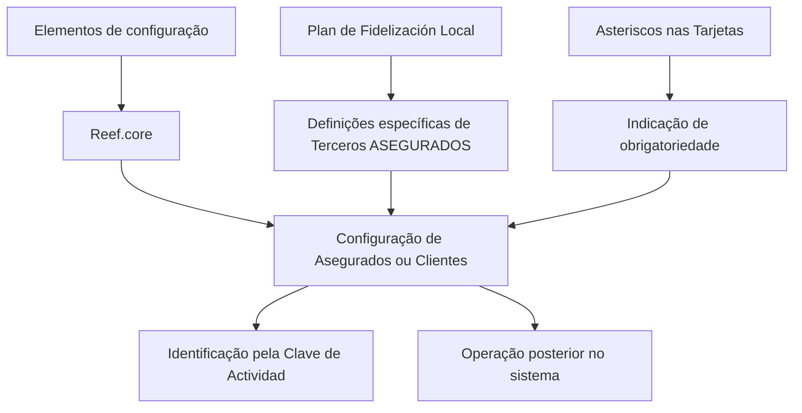

# Configuração de Segurados ou Clientes no Reef.core

## 1. Metadados do Documento
- **Arquivo de Origem:** `Não identificado`
- **Tipo de Documento:** `Especificação Técnica`
- **Domínio / Sistema:** `Reef.core — definição de Terceiros Segurados`
- **Público-Alvo:** `Negócio, operação e equipes de configuração do Reef.core`
- **Data/Versão Identificada:** `Não identificada`

---

## 2. Resumo Executivo & Contexto de Negócio

O conteúdo descreve a definição e a configuração de **Asegurados** ou **Clientes** no sistema **Reef.core**. A finalidade declarada é relacionar os elementos necessários para que esses terceiros possam ser configurados no sistema e operados posteriormente.

O Reef.core identifica os Asegurados por meio da **Clave de Actividad**. O material também indica que os asteriscos exibidos nos cartões representam se a configuração de determinado elemento é obrigatória em relação à definição dos Asegurados.

O documento distingue um grupo de definições específicas aplicáveis exclusivamente quando o terceiro possui a condição de **ASEGURADO**. Entre os tópicos citados está a configuração de um **Plan de Fidelización Local**.

Também há referências isoladas a “CF”, “Home Solutions APIs Documentation”, “Zeus” e “EN”. O conteúdo fornecido não explica a função, integração, tecnologia, ambiente ou relacionamento operacional desses termos.

---

## 3. Arquitetura, Componentes & Tecnologias Envolvidas

Os componentes e conceitos explicitamente citados são:

| Componente / Conceito | Papel identificado no conteúdo |
| :--- | :--- |
| Reef.core | Sistema que permite configurar e operar Asegurados ou Clientes. |
| Asegurados / Clientes | Terceiros configurados no Reef.core para operação posterior. |
| Clave de Actividad | Elemento utilizado pelo Reef.core para identificar Asegurados. |
| Tarjetas | Elementos cuja marcação por asterisco indica obrigatoriedade de configuração. |
| Terceros ASEGURADOS | Grupo que contém definições utilizadas exclusivamente quando o terceiro é um Asegurado. |
| Plan de Fidelización Local | Item cuja configuração é mencionada no grupo de definições específicas. |
| CF | Termo listado sem descrição adicional. |
| Home Solutions APIs Documentation | Referência listada sem detalhamento adicional. |
| Zeus | Referência listada sem detalhamento adicional. |
| EN | Referência listada sem detalhamento adicional. |



**Nota de Análise:** O conteúdo não descreve interfaces, métodos HTTP, contratos de API, bancos de dados, tecnologias de implementação, ambientes, protocolos ou relações técnicas entre “Home Solutions APIs Documentation”, “Zeus”, “CF” e “EN”.

---

## 4. Regras de Negócio, Especificações Funcionais & Processos

1. A configuração de Asegurados ou Clientes no Reef.core requer a relação de elementos que permitam configurar esses terceiros.
2. A configuração é necessária para permitir a operação posterior dos Asegurados ou Clientes no sistema.
3. O Reef.core identifica os Asegurados por meio da **Clave de Actividad**.
4. Os asteriscos exibidos nas Tarjetas indicam se a configuração de um elemento é obrigatória para a definição dos Asegurados.
5. Existe um grupo de definições específicas utilizado exclusivamente quando o Tercero possui a condição de ASEGURADO.
6. A configuração do **Plan de Fidelización Local** é mencionada como parte das definições específicas dos Terceros ASEGURADOS.
7. O conteúdo não informa quais elementos concretos devem ser configurados, quais Tarjetas existem, quais asteriscos estão presentes nem quais regras determinam a obrigatoriedade de cada elemento.

---

## 5. Tabelas de Parâmetros, Ambientes e Estruturas de Dados

| Item / Parâmetro | Descrição / Função | Tipo / Valores / Formato | Ambiente / Observações |
| :--- | :--- | :--- | :--- |
| Asegurado | Terceiro que pode ser configurado e posteriormente operado no Reef.core. | Entidade de negócio | Identificado no Reef.core pela Clave de Actividad. |
| Cliente | Termo citado como equivalente no contexto de configuração de Asegurados ou Clientes. | Entidade de negócio | O conteúdo não detalha diferenças entre Cliente e Asegurado. |
| Clave de Actividad | Chave usada pelo Reef.core para identificar Asegurados. | Chave de identificação | Formato e domínio de valores não informados. |
| Tarjetas | Elementos de configuração relacionados à definição de Asegurados. | Elemento de interface ou configuração | O conteúdo não especifica as Tarjetas existentes. |
| Asterisco nas Tarjetas | Indicador de obrigatoriedade de configuração de um elemento. | Indicador visual | A regra detalhada por Tarjeta não foi fornecida. |
| Tercero ASEGURADO | Terceiro para o qual se aplicam definições específicas. | Classificação de terceiro | As definições são exclusivas quando o Tercero é um ASEGURADO. |
| Plan de Fidelización Local | Configuração mencionada para Terceros ASEGURADOS. | Configuração funcional | Não há parâmetros, critérios ou fluxo de configuração descritos. |
| CF | Referência textual sem explicação. | Não informado | Sem ambiente, valor ou função identificados. |
| Home Solutions APIs Documentation | Referência textual sem explicação. | Não informado | Não há URL, contrato de API ou integração descritos. |
| Zeus | Referência textual sem explicação. | Não informado | Não há função técnica ou operacional descrita. |
| EN | Referência textual sem explicação. | Não informado | Pode ser um marcador textual; significado não definido. |

---

## 6. Bateria de Perguntas & Respostas para RAG (FAQ Sintético)

### P1: Qual é o objetivo da definição de Asegurados no Reef.core?
**R:** O objetivo é relacionar os elementos necessários para configurar Asegurados ou Clientes no Reef.core, permitindo que esses terceiros sejam operados posteriormente no sistema.

### P2: Como o Reef.core identifica os Asegurados?
**R:** O Reef.core identifica os Asegurados por meio da **Clave de Actividad**. O documento não informa o formato, os valores permitidos ou o processo de atribuição dessa chave.

### P3: O que significam os asteriscos nas Tarjetas do Reef.core?
**R:** Os asteriscos indicam se a configuração de um elemento é obrigatória em relação à definição dos Asegurados. O conteúdo não apresenta uma lista das Tarjetas nem especifica quais elementos são obrigatórios.

### P4: Quando as definições específicas de Terceros ASEGURADOS devem ser utilizadas?
**R:** As definições específicas devem ser utilizadas exclusivamente quando o Tercero possui a condição de ASEGURADO.

### P5: O que é o Plan de Fidelización Local no contexto do documento?
**R:** O Plan de Fidelización Local é uma configuração mencionada dentro das definições específicas aplicáveis aos Terceros ASEGURADOS. O material não detalha seus parâmetros, regras de adesão ou comportamento operacional.

### P6: O documento diferencia Cliente de Asegurado?
**R:** O documento menciona “Asegurados o Clientes” no contexto de configuração no Reef.core, mas não descreve diferenças funcionais, cadastrais ou operacionais entre Cliente e Asegurado.

### P7: Quais integrações de API são documentadas para o Reef.core?
**R:** Nenhuma integração de API é descrita. A expressão “Home Solutions APIs Documentation” é citada isoladamente, sem URL, métodos HTTP, autenticação, endpoints ou contratos de dados.

### P8: Qual é a função do componente Zeus?
**R:** O conteúdo apenas lista “Zeus”, sem definir seu papel, vínculo com o Reef.core, tecnologia, ambiente ou fluxo de integração.

### P9: Quais campos são obrigatórios para cadastrar um Asegurado?
**R:** O documento informa somente que os asteriscos nas Tarjetas indicam obrigatoriedade. Ele não identifica os campos, elementos ou Tarjetas obrigatórios.

### P10: Existem ambientes ou servidores definidos para a configuração de Asegurados?
**R:** Não. O conteúdo fornecido não apresenta nomes de ambientes, servidores, URLs, portas, credenciais, rotas de log ou configurações de implantação.

---

## 7. Glossário de Termos, Siglas & Conceitos-Chave

- **Asegurado:** Terceiro identificado e configurado no Reef.core para operação no sistema.
- **Cliente:** Termo citado junto de Asegurado no contexto de configuração no Reef.core.
- **Clave de Actividad:** Chave utilizada pelo Reef.core para identificar Asegurados.
- **Reef.core:** Sistema em que Asegurados ou Clientes são configurados e posteriormente operados.
- **Tarjetas:** Elementos associados à configuração; seus asteriscos indicam obrigatoriedade.
- **Tercero:** Entidade classificada no documento; possui definições específicas quando é um ASEGURADO.
- **Tercero ASEGURADO:** Tercero para o qual se aplicam definições exclusivas de Asegurado.
- **Plan de Fidelización Local:** Configuração citada para Terceros ASEGURADOS.
- **CF:** Termo apresentado sem expansão ou definição.
- **EN:** Termo apresentado sem expansão ou definição.
- **Home Solutions APIs Documentation:** Referência textual sem detalhamento de APIs ou documentação associada.
- **Zeus:** Referência textual sem definição de função ou contexto técnico.

---

## 8. Notas Críticas, Riscos & Limitações

- O material não fornece o nome do arquivo original, autor, data, versão ou fonte documental.
- Não há descrição dos elementos de configuração necessários para criar ou manter Asegurados ou Clientes.
- A **Clave de Actividad** é citada como identificador, mas não possui formato, regras de geração, validações ou exemplos.
- Os asteriscos nas Tarjetas indicam obrigatoriedade, porém o conteúdo não identifica as Tarjetas nem seus campos obrigatórios.
- O **Plan de Fidelización Local** é citado sem parâmetros, regras de negócio, telas, integrações ou critérios operacionais.
- “CF”, “Home Solutions APIs Documentation”, “Zeus” e “EN” não possuem explicação suficiente para estabelecer dependências ou responsabilidades.
- Não foram identificados contratos de API, URLs, ambientes, logs, credenciais, fluxos de erro ou procedimentos operacionais.

---

## 9. Conteúdo Bruto Estruturado (Referência Fiel)

```text
--- [PÁGINA 1 DE 1] ---

DEFINICIÓN de los ASEGURADOS
Se relacionan los elementos que permiten configurar en Reef.core a los Asegurados o Clientes
para poder operar posteriormente con ellos en el Sistema.
Reef.core identifica a los Asegurados con la Clave de Actividad... 1.
Los Asteriscos de las Tarjetas indican si la configuración del elemento es obligatoria en relación
con la definición de los Asegurados.
DEFINICIONES ESPECÍFICAS, propias de los
Terceros ASEGURADOS
En este Grupo se encuentran definiciones que se utilizan
exclusivamente cuando el Tercero es un ASEGURADO.
PLAN DE FIDELIZACIÓN LOCAL
Configuración del Plan de Fidelización Local.
 / 
 CF
Home Solutions APIs Documentation Zeus
EN
```
