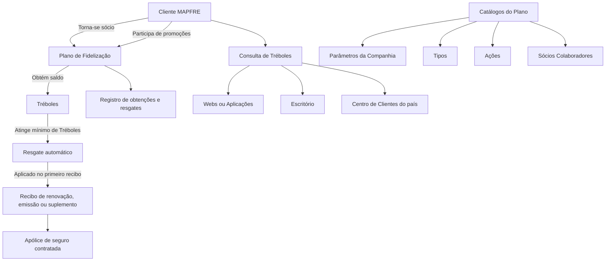

# Plano de Fidelização da Entidade MAPFRE — Definição e Catálogos

## 1. Metadados do Documento
- **Arquivo de Origem:** `Não identificado (texto bruto fornecido)`
- **Tipo de Documento:** `Especificação Funcional`
- **Domínio / Sistema:** `Plano de Fidelização MAPFRE`
- **Público-Alvo:** `Negócio, Analistas Funcionais, Desenvolvedores e Operação`
- **Data/Versão Identificada:** `Não identificada`

---

## 2. Resumo Executivo & Contexto de Negócio

O documento define o Plano de Fidelização das entidades MAPFRE como uma estratégia de marketing destinada a premiar o comportamento de compra dos clientes. O objetivo declarado é gerar lealdade e fidelidade à marca MAPFRE.

O benefício econômico para o cliente ocorre por meio de descontos nas primas das apólices de seguro contratadas. A moeda do plano é denominada **Trébol**, utilizada para representar o saldo acumulado pelo cliente participante.

Para obter Tréboles, o cliente deve tornar-se sócio do Plano de Fidelização e participar das promoções oferecidas pelo programa. Cada Trébol possui um valor econômico determinado individualmente por país, porém os Tréboles não podem ser convertidos em dinheiro em espécie.

O saldo de Tréboles não expira enquanto o cliente mantiver produtos contratados com a MAPFRE. Quando houver saldo mínimo de Tréboles, o resgate deve ocorrer automaticamente no primeiro recibo de renovação, emissão ou suplemento de uma apólice contratada pelo cliente.

O documento também estabelece a necessidade de registro dos processos de obtenção e resgate de Tréboles, além de canais de consulta para o cliente: Webs, Aplicações da entidade, escritório e Centro de Clientes do país correspondente.

---

## 3. Arquitetura, Componentes & Tecnologias Envolvidas

O texto não descreve arquitetura técnica, APIs, microsserviços, métodos HTTP, contratos JSON, bancos de dados, tecnologias ou ambientes de infraestrutura. A estrutura funcional identificada é composta pelo cliente, Plano de Fidelização, saldo de Tréboles, processos de obtenção e resgate, apólices de seguro, registros de operações e canais de consulta.

Também são citados catálogos configuráveis do Plano de Fidelização, aplicáveis quando a entidade local contempla esse plano em sua operação: Parâmetros da Companhia, Tipos, Ações e Sócios Colaboradores.



> **Nota de Análise:** O documento não detalha a implementação técnica dos registros, dos canais de consulta, do cálculo do saldo mínimo, do valor econômico de cada Trébol por país ou das integrações com sistemas de apólices.

---

## 4. Regras de Negócio, Especificações Funcionais & Processos

### Plano de Fidelização
1. O Plano de Fidelização é uma estratégia de marketing da MAPFRE.
2. O Plano de Fidelização busca premiar o comportamento de compra dos clientes.
3. O efeito esperado do programa é criar sentimento de lealdade e fidelidade à marca.
4. O benefício econômico é realizado por descontos nas primas das apólices contratadas pelo cliente.

### Tréboles
1. O Trébol é a moeda utilizada no Plano de Fidelização das entidades MAPFRE.
2. O cliente deve tornar-se sócio do Plano de Fidelização para obter Tréboles.
3. O cliente pode participar das promoções oferecidas pelo Plano de Fidelização para obter Tréboles.
4. Cada Trébol equivale a uma quantidade econômica determinada por país.
5. Tréboles não podem ser trocados por dinheiro em espécie.
6. Tréboles não possuem validade enquanto o cliente mantiver produtos contratados com a MAPFRE.

### Resgate de Tréboles
1. O resgate exige que o cliente possua um mínimo de Tréboles.
2. Quando o mínimo de Tréboles é atingido, o resgate ocorre automaticamente.
3. O resgate automático é aplicado ao primeiro recibo relacionado a:
   - renovação;
   - emissão;
   - suplemento;
   de uma apólice de seguro contratada pelo cliente.

### Rastreabilidade e consulta
1. Deve existir registro de todos os processos de obtenção de Tréboles realizados pelo cliente.
2. Deve existir registro de todos os processos de resgate de Tréboles realizados pelo cliente.
3. O cliente deve poder consultar Tréboles por meio de:
   - Webs da entidade;
   - Aplicações da entidade;
   - escritório;
   - Centro de Clientes do país.

### Catálogos do Plano de Fidelização
Os catálogos devem ser configurados somente quando a entidade local contempla o Plano de Fidelização na própria operação.

- **Parâmetros da Companhia:** configuração dos parâmetros da companhia relativos ao Plano de Fidelização.
- **Tipos:** configuração dos tipos ou agrupamentos de ações da companhia relativos ao Plano de Fidelização.
- **Ações:** configuração das ações que aumentam ou resgatam o saldo de Tréboles do cliente.
- **Sócios Colaboradores:** configuração dos sócios colaboradores da companhia relacionados ao Plano de Fidelização.

---

## 5. Tabelas de Parâmetros, Ambientes e Estruturas de Dados

| Item / Parâmetro | Descrição / Função | Tipo / Valores / Formato | Ambiente / Observações |
| :--- | :--- | :--- | :--- |
| Plano de Fidelização | Programa que premia o comportamento de compra do cliente e busca gerar lealdade à MAPFRE. | Estratégia de marketing | Aplicável às entidades MAPFRE. |
| Trébol | Moeda empregada no Plano de Fidelização. | Saldo ou moeda do programa | Possui valor econômico determinado por país. |
| Valor do Trébol | Equivalência econômica de cada Trébol. | Quantidade econômica | Determinada por cada país; valor não informado. |
| Sócio do Plano | Cliente inscrito no Plano de Fidelização. | Condição de participação | Necessária para obtenção de Tréboles. |
| Promoções | Ofertas do Plano de Fidelização das quais o cliente pode participar. | Mecanismo de obtenção | O documento não detalha promoções, critérios ou quantidades de Tréboles. |
| Mínimo de Tréboles | Saldo necessário para acionar o resgate automático. | Limite mínimo | Valor não informado no documento. |
| Resgate automático | Aplicação automática de Tréboles no primeiro recibo elegível. | Processo automático | Aplicável a renovação, emissão ou suplemento. |
| Recibo de renovação | Primeiro recibo elegível para aplicação do resgate. | Tipo de recibo | Associado a apólice de seguro contratada. |
| Recibo de emissão | Primeiro recibo elegível para aplicação do resgate. | Tipo de recibo | Associado a apólice de seguro contratada. |
| Recibo de suplemento | Primeiro recibo elegível para aplicação do resgate. | Tipo de recibo | Associado a apólice de seguro contratada. |
| Registro de obtenção | Registro dos processos de obtenção de Tréboles. | Registro operacional | Deve abranger todos os processos realizados pelo cliente. |
| Registro de resgate | Registro dos processos de resgate de Tréboles. | Registro operacional | Deve abranger todos os processos realizados pelo cliente. |
| Webs | Canal para consulta de Tréboles pelo cliente. | Canal digital | Não detalhado. |
| Aplicações da entidade | Canal para consulta de Tréboles pelo cliente. | Canal digital | Não detalhado. |
| Escritório | Canal presencial para consulta de Tréboles. | Canal físico | Não detalhado. |
| Centro de Clientes | Canal de atendimento para consulta de Tréboles. | Canal de atendimento | Referente ao país do cliente. |
| Parâmetros da Companhia | Catálogo de parâmetros da companhia relativos ao Plano de Fidelização. | Catálogo configurável | Configurado se a entidade local contemplar o plano. |
| Tipos | Catálogo de tipos ou agrupamentos de ações da companhia. | Catálogo configurável | Relacionado ao Plano de Fidelização. |
| Ações | Catálogo das ações que aumentam ou resgatam saldo de Tréboles. | Catálogo configurável | Relacionado ao saldo de Tréboles do cliente. |
| Sócios Colaboradores | Catálogo de parceiros colaboradores relacionados ao plano. | Catálogo configurável | Relacionado à companhia e ao Plano de Fidelização. |

---

## 6. Bateria de Perguntas & Respostas para RAG (FAQ Sintético)

### P1: Qual é o objetivo do Plano de Fidelização da MAPFRE?
**R:** O Plano de Fidelização da MAPFRE é uma estratégia de marketing destinada a premiar o comportamento de compra dos clientes, promovendo sentimento de lealdade e fidelidade à marca MAPFRE.

### P2: O que é um Trébol no Plano de Fidelização MAPFRE?
**R:** O Trébol é a moeda utilizada no Plano de Fidelização das entidades MAPFRE. O cliente acumula Tréboles ao participar do plano e das promoções disponibilizadas.

### P3: Como um cliente pode obter Tréboles?
**R:** Para obter Tréboles, o cliente deve tornar-se sócio do Plano de Fidelização e pode participar das promoções oferecidas pelo programa. O documento não detalha as regras específicas das promoções nem as quantidades concedidas.

### P4: Cada Trébol possui o mesmo valor em todos os países?
**R:** Não. Cada Trébol equivale a uma quantidade econômica determinada por cada país. O documento não informa os valores econômicos nem os países abrangidos.

### P5: É possível trocar Tréboles por dinheiro em espécie?
**R:** Não. Os Tréboles não podem ser resgatados ou trocados por dinheiro em espécie.

### P6: Os Tréboles expiram?
**R:** Os Tréboles não têm caducidade enquanto o cliente continuar tendo produtos contratados com a MAPFRE.

### P7: Quando ocorre o resgate de Tréboles?
**R:** Quando o cliente possui o mínimo de Tréboles exigido, os Tréboles são resgatados automaticamente no primeiro recibo de renovação, emissão ou suplemento de uma apólice de seguro contratada pelo cliente. O valor mínimo não é informado.

### P8: Como o benefício dos Tréboles é aplicado ao cliente?
**R:** O documento informa que o Plano de Fidelização permite benefícios econômicos por meio de descontos nas primas das apólices contratadas. O resgate automático ocorre no primeiro recibo elegível de renovação, emissão ou suplemento.

### P9: Quais operações precisam ser registradas no Plano de Fidelização?
**R:** Deve haver registro de todos os processos de obtenção e de resgate de Tréboles realizados pelo cliente.

### P10: Por quais canais o cliente pode consultar os Tréboles?
**R:** O cliente pode consultar Tréboles pelas Webs ou Aplicações da entidade, presencialmente em um escritório ou entrando em contato com o Centro de Clientes do respectivo país.

### P11: Quando os catálogos do Plano de Fidelização devem ser configurados?
**R:** Os catálogos devem ser configurados quando a entidade local contempla o Plano de Fidelização na sua operação.

### P12: Quais catálogos do Plano de Fidelização são citados?
**R:** O documento cita quatro catálogos: Parâmetros da Companhia, Tipos, Ações e Sócios Colaboradores. As Ações incluem aquelas que aumentam ou resgatam o saldo de Tréboles do cliente.

---

## 7. Glossário de Termos, Siglas & Conceitos-Chave

- **MAPFRE:** Entidade ou marca associada ao Plano de Fidelização descrito no documento.
- **Plano de Fidelização:** Programa que premia o comportamento de compra do cliente e concede benefícios econômicos relacionados a apólices.
- **Trébol:** Moeda utilizada no Plano de Fidelização das entidades MAPFRE.
- **Primas:** Valores associados às apólices de seguro sobre os quais podem ser realizados descontos.
- **Apólice:** Contrato de seguro mantido pelo cliente.
- **Renovação:** Tipo de recibo elegível para o resgate automático de Tréboles.
- **Emissão:** Tipo de recibo elegível para o resgate automático de Tréboles.
- **Suplemento:** Tipo de recibo elegível para o resgate automático de Tréboles.
- **Sócio do Plano:** Cliente que aderiu ao Plano de Fidelização.
- **Sócios Colaboradores:** Parceiros colaboradores da companhia relacionados ao Plano de Fidelização.
- **Catálogos:** Conjunto de configurações do Plano de Fidelização: Parâmetros da Companhia, Tipos, Ações e Sócios Colaboradores.

---

## 8. Notas Críticas, Riscos & Limitações

- O documento não informa o mínimo de Tréboles necessário para o resgate automático.
- O documento não define o valor econômico do Trébol para nenhum país.
- O documento não detalha regras de participação, elegibilidade ou concessão das promoções.
- O documento não especifica como descontos em primas são calculados ou aplicados.
- O documento não descreve fluxos de exceção, como ausência de recibo elegível, cancelamento de apólice ou perda de elegibilidade.
- O documento não detalha arquitetura técnica, integrações, APIs, persistência, segurança, auditoria técnica ou responsabilidades operacionais.
- O documento cita Webs, Aplicações, escritórios e Centro de Clientes como canais de consulta, mas não apresenta funcionalidades, URLs, autenticação ou contratos desses canais.
- A configuração dos catálogos depende de a entidade local contemplar o Plano de Fidelização em sua operação.

---

## 9. Conteúdo Bruto Estruturado (Referência Fiel)

```text
--- [PÁGINA 1 DE 2] ---

DEFINICIÓN del PLAN de FIDELIZACIÓN de la
Entidad MAPFRE
Contexto
Un programa de fidelización es una estrategia de marketing establecida por una empresa con el
propósito de premiar el comportamiento de compra de sus clientes, lo que produce en ellos un
sentido de lealtad y fidelidad hacia la marca. El programa de fidelización de MAPFRE permite a sus
clientes la posibilidad de beneficiarse económicamente mediante la realización de descuentos en las
primas de las pólizas que estos tengan contratadas.
El Trébol es la moneda empleada en el Plan de Fidelización de las entidades MAPFRE.
Para obtener tréboles, los Clientes tienen que hacerse socios del plan de Fidelización pudiendo
participar de las promociones que ofrece dicho programa.
 / 
 CF
Home Solutions APIs Documentation Zeus
EN


--- [PÁGINA 2 DE 2] ---

Cada Trébol equivale a una cantidad económica determinada por cada país.
Los Tréboles no pueden canjearse por dinero en efectivo.
No tienen caducidad mientras el cliente siga teniendo contratados productos con MAPFRE.
Cuando se tiene un mínimo de Tréboles, se canjearán automáticamente en el primer recibo
de renovación, emisión o suplemento de la póliza de seguro contratado por el Cliente.
Se tendrá un Registro de todos los procesos de obtención y canje de tréboles que haya
realizado el cliente.
El cliente debe poder consultar sus tréboles a través de las Webs o Aplicaciones de la
entidad, acudiendo a su oficina o llamando al Centro de Clientes de su país.
Catálogos del Plan de Fidelización de la Entidad
Este conjunto de catálogos se ha de configurar siempre y cuando la
entidad localmente contemple el Plan de Fidelización en su operativa.
PARÁMETROS DE LA COMPAÑÍA 
Configuración de los Parámetros de la
Compañía Relativos al Plan de Fidelización.
TIPOS 
Configuración de los Tipos o Agrupaciones de
Acciones de la Compañía Relativas al Plan de
Fidelización.
ACCIONES 
Configuración de las Acciones que
conllevarán un incremento o una redención
del saldo de Tréboles del Cliente como
moneda del Plan de Fidelización.
SOCIOS COLABORADORES
Configuración de los Socios Colaboradores
de la Compañía relacionados con el Plan de
Fidelización.
```
