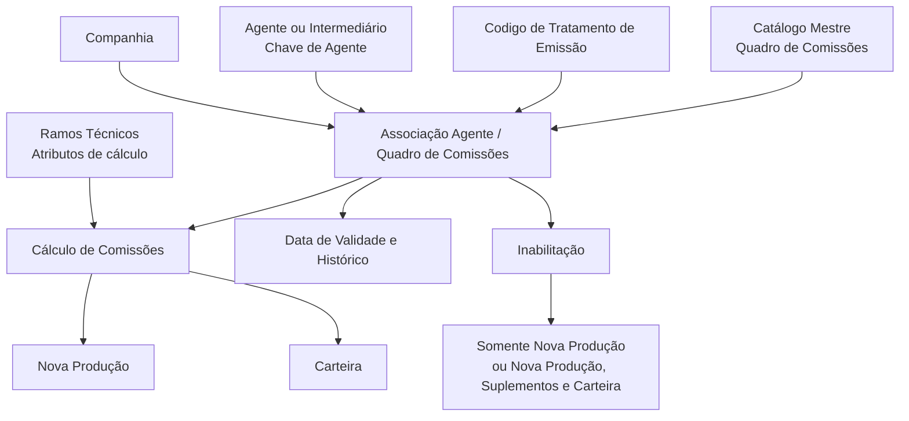

# Definição dos Quadros de Comissões de um Agente

## 1. Metadados do Documento
- **Arquivo de Origem:** Não informado; conteúdo bruto fornecido pelo solicitante.
- **Tipo de Documento:** Especificação Funcional.
- **Domínio / Sistema:** Gestão de agentes, quadros de comissões, emissão de apólices e configuração de ramos técnicos.
- **Público-Alvo:** Negócio, analistas funcionais, desenvolvedores, arquitetura e operação.
- **Data/Versão Identificada:** Não identificada.

---

## 2. Resumo Executivo & Contexto de Negócio

O documento define a associação entre agentes e as chaves de quadros de comissões que podem ser utilizadas no cálculo das comissões de apólices de um agente específico. A associação é condicionada pelos atributos de cálculo de comissões configurados nos Ramos Técnicos.

A configuração identifica a companhia, a chave do agente ou intermediário, o código de tratamento de emissão e o quadro de comissões previamente definido no catálogo mestre. Esses atributos formam o contexto utilizado pelo sistema para disponibilizar um quadro de comissões a um agente.

O documento também estabelece controles para inabilitar uma chave de quadro de comissões. A inabilitação pode afetar exclusivamente apólices de Nova Produção ou afetar tanto movimentos de Nova Produção quanto suplementos emitidos sobre essas apólices e Movimentos de Carteira.

A data de validade da associação Agente/Quadro de Comissões permite que a associação esteja disponível a partir de determinada data e possibilita manter histórico das alterações efetuadas nas definições configuradas. O documento recomenda a leitura conjunta de Estructura de Productos, Configuración de Ramos e Actividades de Terceros para evitar interpretações isoladas e incorretas.

---

## 3. Arquitetura, Componentes & Tecnologias Envolvidas

Os componentes funcionais identificados no documento são:

- **Agente / Intermediário:** entidade à qual são associadas chaves de quadros de comissões.
- **Companhia:** contexto corporativo em que a associação do agente ao quadro de comissões é realizada.
- **Chave de Agente:** identificador da chave do intermediário, conforme configuração previamente estabelecida.
- **Código de Tratamento de Emissão:** chave identificada no sistema conforme a configuração da estrutura de produtos da entidade.
- **Quadro de Comissões:** chave de quadro previamente definida no catálogo mestre.
- **Ramos Técnicos:** fonte de configuração dos atributos de cálculo de comissões.
- **Apólices:** objeto sobre o qual as comissões são calculadas.
- **Nova Produção:** comissões percebidas exclusivamente no primeiro ano de vigência da apólice.
- **Cartera / Carteira:** comissões originadas em apólices vigentes em anos sucessivos.
- **Suplementos:** emissões efetuadas sobre apólices de Nova Produção.
- **Movimentos de Carteira:** movimentos relacionados à carteira de apólices vigentes.



**Nota de Análise:** o documento não informa tecnologias, protocolos, métodos HTTP, contratos JSON, bases de dados, URLs, ambientes, integrações técnicas ou detalhes de implementação.

---

## 4. Regras de Negócio, Especificações Funcionais & Processos

### 4.1 Objetivo da associação

A associação Agente/Quadro de Comissões tem como objetivo atribuir e associar aos agentes uma ou mais chaves de quadros de comissões. Essas chaves podem ser utilizadas no cálculo das comissões das apólices de um agente específico.

A utilização das chaves de quadros de comissões depende da definição dos atributos de cálculo de comissões especificados na configuração dos Ramos Técnicos.

### 4.2 Propriedades gerais

1. **Companhia**
   - Contém o código da companhia na qual o quadro de comissões está sendo associado ao agente.

2. **Chave de Agente**
   - Identifica a chave do intermediário de acordo com a configuração previamente estabelecida para essas chaves.

3. **Código de Tratamento de Emissão**
   - Identifica, no sistema, a chave do tratamento de emissão.
   - A configuração do tratamento de emissão é realizada na estrutura de produtos da entidade.

4. **Quadro de Comissões**
   - Identifica, no sistema, a chave do quadro de comissões previamente definida no catálogo mestre.

### 4.3 Outras propriedades

1. **Inabilitação**
   - Estabelece que a chave do quadro de comissões está inabilitada para utilização no sistema.

2. **Tipo de Inabilitação**
   - Determina o alcance da inabilitação do quadro de comissões.
   - O alcance pode afetar apenas apólices de Nova Produção.
   - O alcance também pode afetar movimentos de Nova Produção, suplementos emitidos sobre essas apólices e Movimentos de Carteira.

3. **Data de Validade**
   - Estabelece a data a partir da qual a associação Agente/Quadro de Comissões fica disponível no sistema.
   - O uso correto da data de validade permite manter histórico das alterações efetuadas nas definições configuradas.

### 4.4 Recomendação operacional sobre descrições de chaves

O documento recomenda como prática operacional utilizar as descrições das chaves definidas para apresentar informação adicional. A entidade MAPFRE deve analisar a melhor forma de utilizar transversalmente esse catálogo de informações nos processos da companhia, considerando a definição correta e a exploração posterior das informações.

### 4.5 Distinção obrigatória entre conceitos

- Um **Quadro de Comissões** não deve ser confundido com um **Quadro de Distribuição de Comissões**.
- O documento não detalha a definição funcional de Quadro de Distribuição de Comissões.

### 4.6 Nova Produção e Carteira

| Conceito | Regra funcional |
| :--- | :--- |
| Comissão de Nova Produção | Comissão percebida exclusivamente durante o primeiro ano de vigência da apólice. Em geral, para estimular a captação de novas operações, esse tipo de comissão costuma ter valor superior ao da comissão de carteira. |
| Comissão de Carteira | Comissão que se origina na carteira de quem a percebe, referente a apólices vigentes em anos sucessivos. A comissão existe enquanto permanecerem vigentes as apólices subscritas mediante a gestão comercial do agente. |

---

## 5. Tabelas de Parâmetros, Ambientes e Estruturas de Dados

| Item / Parâmetro | Descrição / Função | Tipo / Valores / Formato | Ambiente / Observações |
| :--- | :--- | :--- | :--- |
| Companhia | Código da companhia na qual o quadro de comissões é associado ao agente. | Código de companhia; formato não detalhado. | Não informado. |
| Chave de Agente | Identifica a chave do intermediário. | Chave configurada previamente; formato não detalhado. | Associada ao agente ou intermediário. |
| Código de Tratamento de Emissão | Identifica a chave do tratamento de emissão no sistema. | Chave configurada na estrutura de produtos da entidade; formato não detalhado. | Relacionado à estrutura de produtos. |
| Quadro de Comissões | Identifica a chave do quadro de comissões. | Chave definida previamente no catálogo mestre; formato não detalhado. | Utilizada no cálculo de comissões de apólices. |
| Inabilitação | Indica que a chave do quadro de comissões não pode ser utilizada no sistema. | Estado de inabilitação; valores não detalhados. | Aplicável à chave do quadro de comissões. |
| Tipo de Inabilitação | Define o alcance funcional da inabilitação. | Nova Produção; ou Nova Produção, suplementos e Movimentos de Carteira. | O documento não detalha valores técnicos ou codificação. |
| Data de Validade | Define a data a partir da qual a associação Agente/Quadro de Comissões está disponível. | Data; formato não detalhado. | Permite histórico das alterações de configuração. |
| Ramos Técnicos | Especificam atributos de cálculo de comissões. | Configuração funcional; estrutura não detalhada. | Dependência da associação e do cálculo de comissões. |
| Catálogo Mestre | Local no qual o quadro de comissões é previamente definido. | Catálogo; estrutura não detalhada. | Fonte da chave de Quadro de Comissões. |
| Estrutura de Produtos | Local de configuração do tratamento de emissão. | Estrutura funcional; detalhes não informados. | Documento vinculado recomendado. |
| Configuração de Ramos | Documento funcional vinculado recomendado. | Não detalhado. | Deve ser lido em conjunto com o documento principal. |
| Actividades de Terceros | Documento funcional vinculado recomendado. | Não detalhado. | Deve ser lido em conjunto com o documento principal. |

---

## 6. Bateria de Perguntas & Respostas para RAG (FAQ Sintético)

### P1: Qual é o objetivo da associação entre um agente e um quadro de comissões?
**R:** O objetivo é atribuir e associar aos agentes uma ou mais chaves de quadros de comissões que possam ser utilizadas no cálculo das comissões das apólices de um agente específico. A utilização ocorre de acordo com os atributos de cálculo de comissões definidos na configuração dos Ramos Técnicos.

### P2: Quais atributos identificam uma associação de quadro de comissões a um agente?
**R:** O documento identifica como propriedades gerais a Companhia, a Chave de Agente, o Código de Tratamento de Emissão e o Quadro de Comissões. A Companhia contém o código da companhia; a Chave de Agente identifica o intermediário; o Código de Tratamento de Emissão identifica o tratamento configurado na estrutura de produtos; e o Quadro de Comissões identifica uma chave previamente definida no catálogo mestre.

### P3: Onde é configurado o código de tratamento de emissão?
**R:** O Código de Tratamento de Emissão é configurado na estrutura de produtos da entidade. O atributo identifica no sistema a chave correspondente ao tratamento de emissão.

### P4: Qual é a finalidade da data de validade na associação Agente/Quadro de Comissões?
**R:** A Data de Validade estabelece a partir de qual data a associação Agente/Quadro de Comissões está disponível para uso no sistema. Seu uso correto permite manter o histórico das mudanças efetuadas nas definições configuradas.

### P5: O que significa inabilitar um quadro de comissões?
**R:** A inabilitação estabelece que a chave do Quadro de Comissões está inabilitada e não pode ser empregada para utilização no sistema. O documento não informa como essa inabilitação é tecnicamente persistida ou operada.

### P6: Quais escopos podem ser afetados pelo tipo de inabilitação de um quadro de comissões?
**R:** O Tipo de Inabilitação pode afetar exclusivamente as apólices de Nova Produção ou pode afetar os movimentos de Nova Produção, os suplementos emitidos sobre essas apólices e os Movimentos de Carteira.

### P7: O que caracteriza uma comissão de Nova Produção?
**R:** A comissão de Nova Produção é percebida exclusivamente durante o primeiro ano de vigência da apólice. O documento afirma que, geralmente, esse tipo de comissão costuma ter valor mais elevado que a comissão de carteira para estimular a captação de novas operações.

### P8: O que caracteriza uma comissão de Carteira?
**R:** A comissão de Carteira tem origem na carteira de quem a percebe e está associada a apólices vigentes em anos sucessivos. A comissão existe enquanto as apólices subscritas mediante a gestão comercial do agente permanecerem vigentes.

### P9: Um Quadro de Comissões é o mesmo que um Quadro de Distribuição de Comissões?
**R:** Não. O documento determina expressamente que um Quadro de Comissões não deve ser confundido com um Quadro de Distribuição de Comissões. Contudo, o documento não apresenta definição adicional para Quadro de Distribuição de Comissões.

### P10: Qual recomendação operacional é feita para as descrições das chaves configuradas?
**R:** O documento recomenda utilizar as descrições das chaves definidas para mostrar informação adicional. A entidade MAPFRE deve avaliar a forma mais adequada de usar transversalmente esse catálogo de informações nos processos da companhia, contemplando a definição e a exploração posterior das informações.

### P11: Quais documentos devem ser consultados junto desta definição para evitar interpretações isoladas?
**R:** O documento recomenda consultar Estructura de Productos, Configuración de Ramos e Actividades de Terceros. A leitura desses documentos busca evitar que a interpretação isolada do documento de Quadros de Comissões de um Agente conduza a erro.

---

## 7. Glossário de Termos, Siglas & Conceitos-Chave

- **Agente:** entidade à qual são associadas chaves de Quadros de Comissões para cálculo de comissões de apólices.
- **Intermediário:** entidade identificada pela Chave de Agente.
- **Companhia:** entidade cujo código identifica o contexto em que o quadro de comissões é associado ao agente.
- **Chave de Agente:** propriedade que identifica a chave do intermediário conforme configuração previamente estabelecida.
- **Código de Tratamento de Emissão:** chave que identifica o tratamento de emissão configurado na estrutura de produtos da entidade.
- **Quadro de Comissões:** chave previamente definida no catálogo mestre e utilizada para cálculo de comissões de apólices de um agente.
- **Quadro de Distribuição de Comissões:** conceito distinto de Quadro de Comissões; o documento não fornece detalhamento adicional.
- **Catálogo Mestre:** catálogo em que o Quadro de Comissões é previamente definido.
- **Ramos Técnicos:** configuração que especifica atributos de cálculo de comissões.
- **Nova Produção:** período associado ao primeiro ano de vigência da apólice para fins de comissão.
- **Carteira / Cartera:** conjunto de apólices vigentes em anos sucessivos que pode originar comissão de carteira.
- **Movimentos de Carteira:** movimentos de carteira citados como potencialmente afetados pela inabilitação.
- **Suplementos:** emissões sobre apólices de Nova Produção, citadas como potencialmente afetadas pela inabilitação.
- **MAPFRE:** entidade mencionada como responsável por analisar a melhor forma de utilização transversal do catálogo de informações.
- **CF:** termo exibido de forma isolada no conteúdo bruto, sem definição contextual suficiente.

---

## 8. Notas Críticas, Riscos & Limitações

- O documento não informa formatos, domínios de valores, obrigatoriedade, regras de precedência ou validações técnicas para Companhia, Chave de Agente, Código de Tratamento de Emissão, Quadro de Comissões, Inabilitação e Data de Validade.
- O documento não descreve APIs, métodos HTTP, contratos JSON, interfaces, eventos, bases de dados, URLs, ambientes, servidores, credenciais ou rotinas operacionais.
- Não há detalhamento sobre o comportamento do sistema quando houver múltiplas associações Agente/Quadro de Comissões simultaneamente válidas.
- Não há especificação sobre conflitos entre associações, sobreposição de datas de validade ou prioridades entre quadros de comissões.
- O conceito de Quadro de Distribuição de Comissões é citado apenas para indicar que não deve ser confundido com Quadro de Comissões.
- A correta interpretação depende da leitura dos documentos vinculados: Estructura de Productos, Configuración de Ramos e Actividades de Terceros.
- A exploração transversal das descrições das chaves é uma recomendação operacional; a decisão de uso deve ser analisada pela entidade MAPFRE.

---

## 9. Conteúdo Bruto Estruturado (Referência Fiel)

```text
--- [PÁGINA 1 DE 3] ---

DEFINICIÓN de los Cuadros de Comisiones de
un Agente
Objetivo
El objetivo es asignar y asociar a los Agentes la/s clave/s de los Cuadros de Comisiones que
pueden ser utilizados en el cálculo de las comisiones de las pólizas de un Agente específico y de
acuerdo con la definición de los atributos de cálculo de comisiones que se especifican en la
configuración de los Ramos Técnicos.
Propiedades Generales
Otras Propiedades
Propiedades Generales
Compañía
Este atributo contiene el código de la compañía en la que se está asociando al agente el cuadro de
comisiones.
Clave de Agente
Esta propiedad identifica la clave del intermediario de acuerdo con la configuración de las mismas
previamente establecidas.
Código de Tratamiento de Emisión
 / 
 CF
Home Solutions APIs Documentation Zeus
EN


--- [PÁGINA 2 DE 3] ---

Este atributo identifica en el sistema la clave del tratamiento de Emisión de acuerdo con la
configuración realizada en la estructura de productos de la entidad.
Cuadro de Comisiones
Este atributo identifica en el sistema la clave del cuadro de comisiones definido previamente en el
catálogo maestro.
Otras Propiedades
Inhabilitación
Esta propiedad establece que la Clave del Cuadro de Comisiones está inhabilitada para poder ser
empleada para su utilización en el Sistema.
Tipo de Inhabilitación
Esta propiedad establece si la inhabilitación del Cuadro de Comisiones va a afectar únicamente a las
pólizas de Nueva Producción o afecta tanto a los Movimientos de Nueva Producción como a los
suplementos emitidos sobre ellas o Movimientos de Cartera.
Fecha de Validez
Esta propiedad establece la fecha a partir de la cual la asociación Agente/Cuadro de Comisiones está
disponible en el sistema para ser utilizada por lo que su correcto uso permite tener un histórico de los
cambios efectuados en las definiciones configuradas.
Vínculos
Relación de Directrices y Documentos funcionales cuya lectura recomendada para evitar que la
interpretación aislada del presente documento pueda conducir a error.
Estructura de Productos
Configuración de Ramos
Actividades de Terceros
Preguntas frecuentes
(1) ¿Existe alguna aclaración operativa que deba ser tomada en consideración localmente en la
asignación de los cuadros de comisiones a los agentes?
Una práctica que se ha demostrado que funciona bien y por tanto se recomienda como modelo es
utilizar las descripciones de las claves definidas para 'mostrar' algo más de información, si bien la
entidad MAPFRE debe analizar la mejor manera de utilizar transversalmente en los procesos de la


--- [PÁGINA 3 DE 3] ---

compañía este catálogo de información para su correcta definición contemplando su posterior
explotación.
(2) No confundir un Cuadro de Comisiones con un Cuadro de Distribución de Comisiones
(3) Diferencia del término Nueva Producción vs. Cartera
Atendiendo al momento temporal en el que se generan las comisiones en el proceso de emisión,
puede establecerse la siguiente clasificación:
Comisiones de nueva producción. Para distinguirlas de la comisión de cartera, se da ese nombre
a la que se percibe exclusivamente durante el primer año de vigencia de la póliza (Generalmente
y a fin de estimular la labor de captación de nuevas operaciones, este tipo de comisión suele ser
de importe más elevado que la de cartera).
Comisiones de cartera. Para distinguirla de la comisión de nueva producción, se da este nombre
a la que tiene su origen en la cartera de quien la percibe (pólizas vigentes en años sucesivos).
Esta comisión existe mientras tengan vigencia las pólizas suscritas a través de la gestión
comercial del agente.
```
