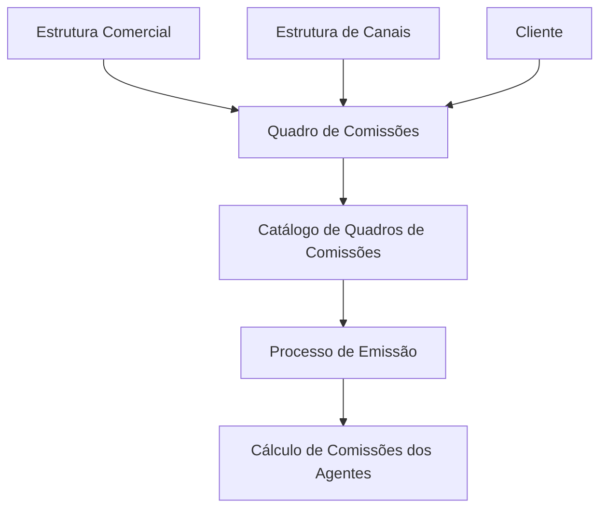

# Definição dos Quadros de Comissões da Companhia

## 1. Metadados do Documento
- **Arquivo de Origem:** Não identificado no conteúdo fornecido
- **Tipo de Documento:** Especificação Funcional
- **Domínio / Sistema:** Configuração de Quadros de Comissões; processo de emissão e cálculo de comissões de agentes
- **Público-Alvo:** Negócio, configuração funcional, operação e equipes responsáveis pela definição de catálogos corporativos
- **Data/Versão Identificada:** Não identificada

---

## 2. Resumo Executivo & Contexto de Negócio

O documento define o conceito de **Quadro de Comissões** como um elemento interno utilizado na configuração do Sistema. Um Quadro de Comissões relaciona e organiza, sob uma mesma chave, características heterogêneas associadas à estrutura comercial, à estrutura de Canais e ao Cliente.

As chaves de Quadros de Comissões são utilizadas no Processo de Emissão e empregadas no cálculo das comissões dos agentes. Portanto, a definição correta do catálogo de Quadros de Comissões possui impacto direto na organização das informações utilizadas pelos processos corporativos de emissão e comissionamento.

Funcionalmente, o núcleo do Sistema permite identificar e codificar até **999 Quadros de Comissões**. O catálogo de informação é entregue inicialmente vazio para as entidades, exigindo configuração local e definição consciente da forma como cada entidade utilizará as chaves disponíveis.

O documento recomenda que a entidade MAPFRE avalie a utilização transversal desse catálogo nos processos da companhia. Como prática recomendada, as descrições das chaves podem apresentar informações adicionais que apoiem a identificação e a posterior exploração do catálogo.

O documento também estabelece uma distinção essencial: um **Quadro de Comissões** não deve ser confundido com um **Quadro de Distribuição de Comissões**. O conteúdo fornecido não detalha a definição funcional do Quadro de Distribuição de Comissões.

---

## 3. Arquitetura, Componentes & Tecnologias Envolvidas

O conteúdo não descreve tecnologias, servidores, integrações técnicas, APIs, métodos HTTP, contratos JSON, bancos de dados ou ambientes de implantação.

Os elementos funcionais identificados são:

- **Sistema:** núcleo que disponibiliza o catálogo de Quadros de Comissões.
- **Catálogo de Quadros de Comissões:** catálogo inicialmente vazio, com capacidade de codificação de até 999 Quadros de Comissões.
- **Quadro de Comissões:** chave que agrupa características heterogêneas.
- **Estrutura Comercial:** uma das fontes de características relacionadas por um Quadro de Comissões.
- **Estrutura de Canais:** uma das fontes de características relacionadas por um Quadro de Comissões.
- **Cliente:** uma das fontes de características relacionadas por um Quadro de Comissões.
- **Processo de Emissão:** processo que utiliza as chaves de Quadros de Comissões.
- **Cálculo de Comissões dos Agentes:** processo que utiliza as chaves de Quadros de Comissões.
- **Entidade MAPFRE:** entidade citada como responsável por analisar a utilização transversal do catálogo.



> **Nota de Análise:** O diagrama representa exclusivamente a relação funcional descrita no documento. O conteúdo não especifica interfaces, persistência, serviços, regras de cálculo, contratos de integração ou responsabilidades técnicas entre componentes.

---

## 4. Regras de Negócio, Especificações Funcionais & Processos

### 4.1 Conceito de Quadro de Comissões

Um Quadro de Comissões é um conceito interno empregado na configuração do Sistema. A função do Quadro de Comissões é relacionar e estruturar, sob uma mesma chave, características heterogêneas.

As características heterogêneas explicitamente citadas são:

1. Características da estrutura comercial.
2. Características da estrutura de Canais.
3. Características do Cliente.

As chaves definidas para os Quadros de Comissões são utilizadas no Processo de Emissão e no cálculo das comissões dos agentes.

### 4.2 Capacidade do Catálogo

O núcleo do Sistema possui a possibilidade de identificar e codificar até **999 Quadros de Comissões**.

O catálogo de informação é entregue às entidades inicialmente vazio de conteúdo. Consequentemente, o documento estabelece que a entidade deve realizar a configuração e definição das chaves que utilizará.

### 4.3 Propriedades Gerais

#### Companhia

O atributo **Companhia** contém o código da companhia na qual o Quadro de Comissões está sendo definido.

#### Descrição do Quadro de Comissões

A propriedade **Descrição do Quadro de Comissões** contém o nome ou a descrição do Quadro de Comissões.

#### Descrição Abreviada do Quadro de Comissões

O atributo **Descrição Abreviada do Quadro de Comissões** indica a denominação ou descrição abreviada da chave do Quadro de Comissões que está sendo definida.

### 4.4 Prática Recomendada para Descrições

O documento recomenda, com base em uma prática considerada bem-sucedida, utilizar as descrições das chaves definidas para apresentar informações adicionais.

A entidade MAPFRE deve analisar a forma mais adequada de utilizar transversalmente o catálogo de informação nos processos da companhia. A definição deve considerar a exploração posterior do catálogo.

### 4.5 Restrição Conceitual

Um Quadro de Comissões não deve ser confundido com um Quadro de Distribuição de Comissões.

> **Nota de Análise:** O documento alerta sobre a distinção entre os dois conceitos, mas não fornece a definição, os atributos ou o fluxo de um Quadro de Distribuição de Comissões.

### 4.6 Documentos Funcionais Relacionados

A leitura dos seguintes documentos funcionais é recomendada para evitar interpretação isolada e incorreta do presente documento:

1. Estrutura de Produtos.
2. Configuração de Ramos.

---

## 5. Tabelas de Parâmetros, Ambientes e Estruturas de Dados

| Item / Parâmetro | Descrição / Função | Tipo / Valores / Formato | Ambiente / Observações |
| :--- | :--- | :--- | :--- |
| Quadro de Comissões | Conceito interno de configuração que relaciona e estrutura características heterogêneas sob uma mesma chave. | Chave de catálogo; formato não especificado. | Utilizado no Processo de Emissão e no cálculo das comissões dos agentes. |
| Capacidade de Quadros de Comissões | Quantidade máxima que o núcleo do Sistema pode identificar e codificar. | Até 999 Quadros de Comissões. | O catálogo é entregue inicialmente vazio às entidades. |
| Companhia | Código da companhia na qual o Quadro de Comissões está sendo definido. | Código; formato não especificado. | Propriedade geral do Quadro de Comissões. |
| Descrição do Quadro de Comissões | Nome ou descrição do Quadro de Comissões. | Texto; formato não especificado. | Pode ser utilizada para apresentar informações adicionais. |
| Descrição Abreviada do Quadro de Comissões | Denominação ou descrição abreviada da chave do Quadro de Comissões. | Texto abreviado; formato não especificado. | Exemplos documentados: `AUTOS`, `DIV.`, `R-N-V`, `VIDA`. |
| Processo de Emissão | Processo que utiliza as chaves dos Quadros de Comissões. | Processo corporativo; detalhes não especificados. | Relacionado ao cálculo de comissões dos agentes. |
| Cálculo de Comissões dos Agentes | Uso funcional das chaves de Quadros de Comissões. | Processo de cálculo; regras não especificadas. | O documento não detalha fórmulas, critérios ou exceções. |
| Estrutura Comercial | Fonte de características que pode ser relacionada sob uma chave de Quadro de Comissões. | Característica heterogênea; formato não especificado. | Componente conceitual citado no documento. |
| Estrutura de Canais | Fonte de características que pode ser relacionada sob uma chave de Quadro de Comissões. | Característica heterogênea; formato não especificado. | Componente conceitual citado no documento. |
| Cliente | Fonte de características que pode ser relacionada sob uma chave de Quadro de Comissões. | Característica heterogênea; formato não especificado. | Componente conceitual citado no documento. |

### Exemplos de Chaves e Descrições Abreviadas

| Quadro | Descrição | Abreviatura |
| :--- | :--- | :--- |
| 100 | Cuadro AUTOS | AUTOS |
| 300 | Cuadro DIVERSOS | DIV. |
| 500 | Cuadro RESTO NO VIDA | R-N-V |
| 750 | Cuadro VIDA | VIDA |
| ... | ... | ... |

> **Nota de Análise:** O conteúdo não informa se os valores exemplificados constituem códigos obrigatórios, valores padrão ou apenas exemplos ilustrativos.

---

## 6. Bateria de Perguntas & Respostas para RAG (FAQ Sintético)

### P1: O que é um Quadro de Comissões no Sistema?
**R:** Um Quadro de Comissões é um conceito interno utilizado na configuração do Sistema. Um Quadro de Comissões relaciona e estrutura, sob uma mesma chave, características heterogêneas da estrutura comercial, da estrutura de Canais e do Cliente.

### P2: Para que as chaves de Quadros de Comissões são utilizadas?
**R:** As chaves de Quadros de Comissões são utilizadas no Processo de Emissão e empregadas no cálculo das comissões dos agentes.

### P3: Quantos Quadros de Comissões o núcleo do Sistema permite identificar e codificar?
**R:** O núcleo do Sistema permite identificar e codificar até 999 Quadros de Comissões.

### P4: O catálogo de Quadros de Comissões já possui conteúdo quando é entregue às entidades?
**R:** Não. O catálogo de informação é entregue inicialmente vazio de conteúdo às entidades.

### P5: Qual informação deve ser preenchida no atributo Companhia?
**R:** O atributo Companhia deve conter o código da companhia na qual o Quadro de Comissões está sendo definido.

### P6: Qual é a finalidade da Descrição do Quadro de Comissões?
**R:** A Descrição do Quadro de Comissões contém o nome ou a descrição do Quadro de Comissões. O documento recomenda que as descrições das chaves possam apresentar informações adicionais para apoiar a definição e a exploração do catálogo.

### P7: O que representa a Descrição Abreviada do Quadro de Comissões?
**R:** A Descrição Abreviada indica a denominação ou a descrição abreviada da chave do Quadro de Comissões que está sendo definida. Os exemplos apresentados incluem `AUTOS`, `DIV.`, `R-N-V` e `VIDA`.

### P8: Quais tipos de características podem ser associados a um Quadro de Comissões?
**R:** Um Quadro de Comissões pode relacionar e estruturar características heterogêneas da estrutura comercial, da estrutura de Canais e do Cliente.

### P9: Um Quadro de Comissões é igual a um Quadro de Distribuição de Comissões?
**R:** Não. O documento afirma expressamente que um Quadro de Comissões não deve ser confundido com um Quadro de Distribuição de Comissões. O conteúdo fornecido não detalha as diferenças funcionais adicionais entre os dois conceitos.

### P10: Qual orientação o documento fornece para a entidade MAPFRE sobre a configuração dos Quadros de Comissões?
**R:** A entidade MAPFRE deve analisar a melhor forma de utilizar transversalmente, nos processos da companhia, o catálogo de informação de Quadros de Comissões. A definição deve contemplar a posterior exploração do catálogo.

### P11: Quais documentos devem ser consultados para evitar interpretação isolada da especificação?
**R:** O documento recomenda a leitura dos materiais funcionais “Estrutura de Produtos” e “Configuração de Ramos”, pois a interpretação isolada da especificação pode conduzir a erro.

### P12: O documento especifica fórmulas ou critérios de cálculo das comissões dos agentes?
**R:** Não. O documento informa que as chaves de Quadros de Comissões são empregadas no cálculo das comissões dos agentes, mas não detalha fórmulas, percentuais, critérios de elegibilidade, regras de distribuição ou exceções de cálculo.

---

## 7. Glossário de Termos, Siglas & Conceitos-Chave

- **Catálogo de Informação:** Catálogo inicialmente vazio entregue às entidades, utilizado para identificar e codificar Quadros de Comissões.
- **Cliente:** Elemento cujas características podem ser relacionadas sob uma chave de Quadro de Comissões.
- **Companhia:** Companhia na qual o Quadro de Comissões está sendo definido; identificada pelo atributo de código de companhia.
- **Descrição Abreviada:** Denominação ou descrição abreviada da chave do Quadro de Comissões.
- **Estrutura Comercial:** Elemento cujas características podem ser relacionadas sob uma chave de Quadro de Comissões.
- **Estrutura de Canais:** Elemento cujas características podem ser relacionadas sob uma chave de Quadro de Comissões.
- **MAPFRE:** Entidade mencionada no documento como responsável por analisar a utilização transversal do catálogo de informação nos processos da companhia.
- **Processo de Emissão:** Processo que utiliza as chaves dos Quadros de Comissões.
- **Quadro de Comissões:** Conceito interno de configuração que relaciona e estrutura características heterogêneas sob uma mesma chave.
- **Quadro de Distribuição de Comissões:** Conceito distinto de Quadro de Comissões; o documento não fornece definição adicional.

---

## 8. Notas Críticas, Riscos & Limitações

- O catálogo de Quadros de Comissões é entregue inicialmente vazio, exigindo definição e governança local por cada entidade.
- O documento recomenda a leitura de “Estrutura de Produtos” e “Configuração de Ramos”, pois a interpretação isolada pode conduzir a erro.
- Não há detalhamento de tecnologias, arquitetura física, ambientes, URLs, logs, integrações, APIs ou estruturas de dados persistentes.
- Não há especificação de formatos técnicos para o código de companhia, identificadores de Quadros de Comissões, descrições ou abreviaturas.
- Não há detalhamento das regras de cálculo das comissões dos agentes, apesar de o documento indicar que as chaves são utilizadas nesse cálculo.
- Não há definição funcional detalhada de Quadro de Distribuição de Comissões, embora o documento alerte que esse conceito não deve ser confundido com Quadro de Comissões.
- Os exemplos de Quadros `100`, `300`, `500` e `750` são apresentados sem indicação de obrigatoriedade, abrangência ou regra de uso.

---

## 9. Conteúdo Bruto Estruturado (Referência Fiel)

```text
--- [PÁGINA 1 DE 2] ---

DEFINICIÓN de los Cuadros de Comisiones de
la Compañía
Contexto
Un cuadro de comisiones es un concepto interno empleado en la configuración del Sistema cuyo
significado es relacionar y estructurar bajo una misma clave características heterogéneas (de la
estructura comercial, de la estructura de Canales, del Cliente, ...), claves que serán utilizadas en el
Proceso de Emisión y empleadas en el cálculo de las comisiones de los agentes.
Objetivo
Funcionalmente, el núcleo del Sistema cuenta con la posibilidad de identificar y codificar hasta 999
Cuadros de Comisiones en un catálogo de información que se entrega a las entidades inicialmente
vacío de contenido.
Propiedades Generales
Compañía
Este atributo contiene el código de la compañía en la que se está definiendo el Cuadro de
comisiones.
Descripción del Cuadro de Comisiones
Esta propiedad contiene el nombre o descripción del Cuadro de Comisiones.
 / 
 CF
Home Solutions APIs Documentation Zeus
EN


--- [PÁGINA 2 DE 2] ---

Descripción Abreviada del Cuadro de Comisiones
Este Atributo indica cual es la denominación o descripción abreviada de la clave del Cuadro de
Comisiones que se está definiendo.
A modo de ejemplo:
CUADRO DESCRIPCIÓN ABREVIATURA
100 Cuadro AUTOS AUTOS
300 Cuadro DIVERSOS DIV.
500 Cuadro RESTO NO VIDA R-N-V
750 Cuadro VIDA VIDA
... ... ...
Vínculos
Relación de Directrices y Documentos funcionales cuya lectura recomendada para evitar que la
interpretación aislada del presente documento pueda conducir a error.
Estructura de Productos
Configuración de Ramos
Preguntas frecuentes
(1) ¿Existe alguna aclaración operativa que deba ser tomada en consideración localmente en la
configuración de los cuadros de comisiones?
Una práctica que se ha demostrado que funciona bien y por tanto se recomienda como modelo es
utilizar las descripciones de las claves definidas para 'mostrar' algo más de información, si bien la
entidad MAPFRE debe analizar la mejor manera de utilizar transversalmente en los procesos de la
compañía este catálogo de información para su correcta definición contemplando su posterior
explotación.
(2) No confundir un Cuadro de Comisiones con un Cuadro de Distribución de Comisiones
```
