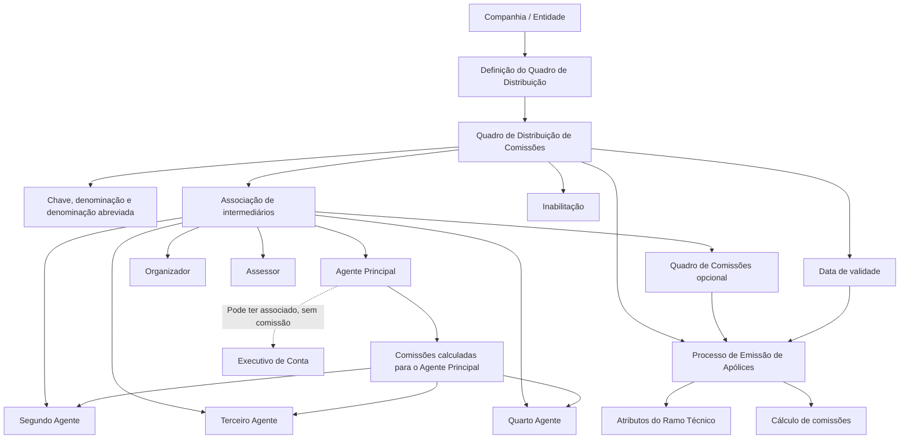

# Reef.core — Cuadros de Distribución de Comisiones: Definición y Asociación de Intermediarios

## 1. Metadados do Documento
- **Arquivo de Origem:** `Não identificado no conteúdo fornecido`
- **Tipo de Documento:** `Manual Operacional / Especificação Funcional`
- **Domínio / Sistema:** `Reef.core — distribuição de comissões de intermediários em apólices`
- **Público-Alvo:** `Negócio, Operação, usuários emissores, analistas funcionais e equipes de configuração`
- **Data/Versão Identificada:** `Não identificada`

---

## 2. Resumo Executivo & Contexto de Negócio

O documento descreve a configuração de **Cuadros de Distribución de Comisiones** no sistema **Reef.core**. Um quadro de distribuição é um código identificador que pré-configura as condições de divisão de comissões entre os intermediários que podem participar de uma apólice.

Toda apólice emitida no Reef.core possui obrigatoriamente uma chave de **Agente Principal**. A apólice pode conter, de forma discricionária, até cinco outras figuras de intermediação, totalizando até seis figuras independentes: Agente Principal, Segundo Agente, Terceiro Agente, Quarto Agente, Organizador e Assessor. O documento também cita uma possível sétima figura, o **Executivo de Conta**, atribuível ao Agente Principal por razões comerciais, mas que não recebe comissões.

As comissões calculadas para o Agente Principal são repartidas entre o Agente Principal, Segundo Agente, Terceiro Agente e Quarto Agente. Organizador e Assessor possuem comissões próprias. O quadro de distribuição determina, durante o processo de emissão, como deve ser realizado o cálculo da distribuição aplicável.

A criação de quadros de distribuição não é obrigatória. Sua função principal é facilitar a captura de informações pelos usuários no processo de emissão e reduzir a possibilidade de erros de preenchimento. Os quadros são definidos no nível da companhia, podem ser numerosos e são identificados individualmente por chave, denominação descritiva e denominação abreviada.

Para utilização durante a emissão, cada quadro deve ter previamente definidos os intermediários participantes, os percentuais de comissões aplicáveis e uma data a partir da qual a parametrização estará operacional. O objetivo funcional é definir os quadros na entidade e associar agentes e percentuais em conformidade com os atributos do **Ramo Técnico** envolvidos no cálculo das comissões das apólices.

---

## 3. Arquitetura, Componentes & Tecnologias Envolvidas

### Componentes funcionais identificados

- **Reef.core:** sistema no qual são definidos e utilizados os quadros de distribuição de comissões.
- **Companhia / Entidade:** nível organizacional no qual os quadros são configurados.
- **Processo de Emissão:** processo que utiliza os quadros previamente configurados para capturar e aplicar informações de distribuição de comissões em apólices.
- **Quadro de Distribuição de Comissões:** código que estrutura a distribuição de comissões entre intermediários.
- **Quadro de Comissões:** código opcionalmente associado ao quadro de distribuição; caso esteja vazio, o sistema exige sua captura na emissão da apólice.
- **Ramo Técnico:** possui atributos que intervêm especificamente no cálculo das comissões das apólices.
- **Intermediários:** Agente Principal, Segundo Agente, Terceiro Agente, Quarto Agente, Organizador e Assessor.
- **Executivo de Conta:** figura comercial possível, associada ao Agente Principal, sem percepção de comissões.



### Relações e comportamento funcional

- O Agente Principal é obrigatório em toda apólice emitida no Reef.core.
- Segundo Agente, Terceiro Agente, Quarto Agente, Organizador e Assessor são figuras discricionárias.
- O Agente Principal, Segundo Agente, Terceiro Agente e Quarto Agente repartem o valor das comissões calculadas para o Agente Principal.
- Organizador e Assessor possuem suas próprias comissões.
- O Executivo de Conta pode ser associado ao Agente Principal por motivos comerciais, mas não recebe comissões.
- A chave do Quadro de Comissões não é obrigatória na associação. Quando não informada, o sistema força sua captura durante a emissão da apólice.
- A data de validade controla a partir de quando o quadro, intermediários e percentuais ficam disponíveis para utilização no sistema.
- A data de validade também permite manter histórico das alterações realizadas nas definições.

> **Nota de Análise:** O conteúdo fornecido não detalha tecnologias de infraestrutura, APIs, métodos HTTP, contratos JSON, bases de dados, URLs, ambientes técnicos ou mecanismos de cálculo numérico de comissão.

---

## 4. Regras de Negócio, Especificações Funcionais & Processos

### 4.1. Composição de intermediários em uma apólice

1. Toda apólice emitida no Reef.core deve possuir uma chave de Agente Principal.
2. A apólice pode possuir discricionariamente outras cinco figuras de intermediação.
3. Podem coexistir até seis figuras independentes na intermediação da apólice:
   - Agente Principal;
   - Segundo Agente;
   - Terceiro Agente;
   - Quarto Agente;
   - Organizador;
   - Assessor.
4. Pode existir uma sétima figura, denominada Executivo de Conta.
5. O Executivo de Conta não recebe comissões.
6. O Executivo de Conta pode estar atribuído ao Agente Principal por razões comerciais.

### 4.2. Regras de distribuição de comissões

1. Agente Principal, Segundo Agente, Terceiro Agente e Quarto Agente dividem o valor das comissões calculadas para o Agente Principal.
2. O percentual do Agente Secundário representa o percentual relativo do total de comissões do Agente Principal atribuído ao Segundo Agente.
3. O percentual do Terceiro Agente representa o percentual relativo do total de comissões do Agente Principal atribuído ao Terceiro Agente.
4. O percentual do Quarto Agente representa o percentual relativo do total de comissões do Agente Principal atribuído ao Quarto Agente.
5. Organizador e Assessor possuem comissões próprias; o conteúdo fornecido não descreve percentuais ou fórmulas específicos para essas duas figuras.

### 4.3. Definição do Quadro de Distribuição de Comissões

1. Um Quadro de Distribuição de Comissões é um código identificador para pré-definir e estruturar a distribuição de comissões entre intermediários possíveis de uma apólice.
2. A definição do quadro não pode ser modificada, conforme descrito no documento.
3. O quadro determina como o cálculo deve ser realizado no processo de emissão.
4. A definição de quadros não é obrigatória.
5. O quadro atua como facilitador da emissão, agilizando a captura de dados e reduzindo erros de preenchimento.
6. Os quadros são definidos no nível da companhia.
7. A companhia pode codificar inúmeros quadros de distribuição.
8. Cada quadro pode ser identificado por denominação ou texto descritivo e por uma abreviatura.

### 4.4. Associação de intermediários e percentuais

Para que um quadro seja utilizado no Processo de Emissão, devem ser previamente configurados:

1. As chaves dos intermediários que compõem o quadro.
2. Os percentuais de comissões dos intermediários.
3. A data a partir da qual a parametrização estará plenamente operacional no sistema.
4. Opcionalmente, o código do Quadro de Comissões.

### 4.5. Associação opcional do Quadro de Comissões

1. O código do Quadro de Comissões não é obrigatório na associação ao Quadro de Distribuição de Comissões.
2. Caso o código do Quadro de Comissões esteja vazio, o sistema força a sua captura durante a emissão das apólices.
3. A ausência da associação prévia deixa a operação da entidade mais aberta, segundo o documento.

### 4.6. Vigência, inabilitação e histórico

1. A propriedade de Inabilitação estabelece que a chave do Quadro de Distribuição de Comissões está inabilitada para uso no sistema.
2. A Data de Validade estabelece a data a partir da qual o quadro, seus intermediários e seus percentuais de comissão estão ou estarão disponíveis no sistema.
3. O uso correto da Data de Validade permite manter registro histórico das alterações efetuadas nas definições.

---

## 5. Tabelas de Parâmetros, Ambientes e Estruturas de Dados

### 5.1. Entidades, figuras e comportamento de comissão

| Item / Parâmetro | Descrição / Função | Tipo / Valores / Formato | Ambiente / Observações |
| :--- | :--- | :--- | :--- |
| Agente Principal | Figura de intermediação obrigatória em toda apólice emitida no Reef.core. | Chave de agente. | Suas comissões calculadas podem ser repartidas com Segundo, Terceiro e Quarto Agentes. |
| Segundo Agente | Intermediário adicional da apólice. | Chave de agente. | Participação discricionária; recebe percentual relativo do total de comissões do Agente Principal. |
| Terceiro Agente | Intermediário adicional da apólice. | Chave de agente. | Participação discricionária; recebe percentual relativo do total de comissões do Agente Principal. |
| Quarto Agente | Intermediário adicional da apólice. | Chave de agente. | Participação discricionária; recebe percentual relativo do total de comissões do Agente Principal. |
| Organizador | Intermediário associado ao Agente Principal e ao Quadro de Distribuição configurado. | Chave de organizador. | Possui comissões próprias. |
| Assessor | Intermediário associado ao Agente Principal e ao Quadro de Distribuição configurado. | Chave de assessor. | Possui comissões próprias. |
| Executivo de Conta | Figura comercial que pode ser atribuída ao Agente Principal. | Figura adicional possível. | Não recebe comissões. |
| Quadro de Distribuição de Comissões | Código que pré-configura condições de distribuição de comissões. | Código identificador. | Definido no nível da companhia; utilizado no Processo de Emissão. |
| Quadro de Comissões | Código do quadro de comissões configurado para os intermediários e percentuais. | Código de catálogo. | Associação não obrigatória; se vazio, deve ser capturado na emissão. |
| Ramo Técnico | Fonte de atributos que intervêm especificamente no cálculo das comissões. | Atributos funcionais não detalhados. | O documento não lista os atributos específicos. |

### 5.2. Propriedades do Quadro de Distribuição de Comissões

| Item / Parâmetro | Descrição / Função | Tipo / Valores / Formato | Ambiente / Observações |
| :--- | :--- | :--- | :--- |
| Companhia | Identifica a companhia para a qual o quadro de distribuição de comissões é configurado. | Identificador de companhia. | A definição dos quadros ocorre no nível da companhia. |
| Quadro de distribuição de comissões | Contém a chave que identifica o quadro de distribuição de comissões. | Chave / código identificador. | Utilizado para identificar o quadro no sistema. |
| Denominação do quadro de distribuição de comissões | Estabelece o nome do quadro de distribuição de comissões. | Texto descritivo. | Permite nomear individualmente o quadro. |
| Denominação abreviada | Estabelece o nome abreviado do quadro de distribuição de comissões. | Texto abreviado. | Complementa a identificação do quadro. |
| Chave de agente | Identifica a chave do intermediário Principal do quadro, segundo a relação de agentes operativos da entidade. | Chave de agente. | Corresponde ao Agente Principal. |
| Quadro de comissões | Contém o código do Quadro de Comissões sobre o qual são configurados intermediários e percentuais de participação. | Código de catálogo. | Não obrigatório; se vazio, a emissão exige sua captura. |
| Chave do segundo agente | Identifica a chave do Segundo Agente segundo a relação de agentes operativos da entidade. | Chave de agente. | Figura discricionária. |
| Porcentagem do Agente Secundário | Contém o percentual relativo do total de comissões do Agente Principal atribuído ao Segundo Agente. | Percentual. | Método de cálculo numérico não detalhado. |
| Chave do terceiro agente | Identifica a chave do Terceiro Agente intermediário segundo a relação de agentes operativos da entidade. | Chave de agente. | Figura discricionária. |
| Porcentagem do terceiro agente | Contém o percentual relativo do total de comissões do Agente Principal atribuído ao Terceiro Agente. | Percentual. | Método de cálculo numérico não detalhado. |
| Chave do quarto agente | Identifica a chave do Quarto Agente intermediário segundo a relação de agentes operativos da entidade. | Chave de agente. | Figura discricionária. |
| Porcentagem do quarto agente | Contém o percentual relativo do total de comissões do Agente Principal atribuído ao Quarto Agente. | Percentual. | Método de cálculo numérico não detalhado. |
| Chave do organizador | Identifica a chave do Organizador associado ao Agente Principal e ao Quadro de Distribuição configurado. | Chave de organizador. | O documento informa que o Organizador possui comissões próprias. |
| Chave do assessor | Identifica a chave do Assessor associado ao Agente Principal e ao Quadro de Distribuição configurado. | Chave de assessor. | O documento informa que o Assessor possui comissões próprias. |
| Inabilitação | Estabelece que a chave do Quadro de Distribuição de Comissões está inabilitada para uso no sistema. | Estado de inabilitação. | Impede o emprego da chave no sistema. |
| Data de Validade | Estabelece a data de disponibilização do quadro, intermediários e percentuais no sistema. | Data. | Permite manter histórico de alterações nas definições. |

### 5.3. Exemplos de quadros de distribuição

| Chave do Quadro | Denominação | Denominação Abreviada | Observações |
| :--- | :--- | :--- | :--- |
| 1 | El Corte Inglés Premium | ECI. PR. | Exemplo apresentado no documento. |
| 2 | El Corte Inglés Standard | ECI. Std. | Exemplo apresentado no documento. |
| 3 | Cuadro Standard | std. | Exemplo apresentado no documento. |

### 5.4. Ambientes, URLs, servidores e logs

| Item / Parâmetro | Descrição / Função | Tipo / Valores / Formato | Ambiente / Observações |
| :--- | :--- | :--- | :--- |
| Ambientes técnicos | Não especificados. | Não identificado. | O documento não apresenta URLs, servidores ou ambientes de execução. |
| Rotas de log | Não especificadas. | Não identificado. | O documento não apresenta variáveis, caminhos ou políticas de logs. |
| APIs e contratos técnicos | Não especificados. | Não identificado. | O documento não descreve APIs, métodos HTTP ou contratos JSON. |

---

## 6. Bateria de Perguntas & Respostas para RAG (FAQ Sintético)

### P1: O que é um Quadro de Distribuição de Comissões no Reef.core?
**R:** Um Quadro de Distribuição de Comissões é um código identificador que permite pré-definir e estruturar no Reef.core as condições de distribuição de comissões entre os intermediários que podem participar de uma apólice. O quadro determina, no processo de emissão, como deve ser realizado o cálculo da distribuição das comissões.

### P2: A configuração de Quadros de Distribuição de Comissões é obrigatória no Reef.core?
**R:** Não. A definição de Quadros de Distribuição de Comissões não é obrigatória. Sua função principal é facilitar e agilizar a captura de informações no Processo de Emissão, reduzindo a possibilidade de erros no preenchimento dos dados pelos usuários emissores.

### P3: Quais figuras de intermediação podem coexistir em uma apólice do Reef.core?
**R:** Uma apólice pode conter até seis figuras independentes de intermediação: Agente Principal, Segundo Agente, Terceiro Agente, Quarto Agente, Organizador e Assessor. O Agente Principal é obrigatório. O documento também menciona uma sétima figura possível, o Executivo de Conta, associável por razões comerciais e sem recebimento de comissões.

### P4: Como as comissões do Agente Principal são distribuídas?
**R:** As comissões calculadas para o Agente Principal são repartidas entre Agente Principal, Segundo Agente, Terceiro Agente e Quarto Agente. Os percentuais dos agentes Secundário, Terceiro e Quarto representam percentuais relativos ao total de comissões do Agente Principal atribuído a cada um desses intermediários.

### P5: Organizador e Assessor participam da divisão das comissões do Agente Principal?
**R:** O documento afirma que Organizador e Assessor possuem suas próprias comissões. Portanto, o texto diferencia essas duas figuras do grupo composto por Agente Principal, Segundo Agente, Terceiro Agente e Quarto Agente, que reparte o valor das comissões calculadas para o Agente Principal.

### P6: O código do Quadro de Comissões é obrigatório na associação ao Quadro de Distribuição?
**R:** Não. Não é obrigatório informar e associar o código do Quadro de Comissões ao Quadro de Distribuição de Comissões. Quando esse código permanece vazio, o sistema força sua captura durante a emissão das apólices, deixando a operação da entidade mais aberta.

### P7: Quais informações devem ser pré-configuradas para utilizar um quadro no Processo de Emissão?
**R:** Devem ser pré-configuradas as chaves dos intermediários que compõem o quadro, os percentuais de comissões desses intermediários e uma data a partir da qual a parametrização estará plenamente operacional no sistema. O código do Quadro de Comissões pode também ser associado, mas essa associação é opcional.

### P8: Qual é a finalidade da Data de Validade no Quadro de Distribuição de Comissões?
**R:** A Data de Validade estabelece a partir de quando o quadro de distribuição, seus intermediários e seus percentuais de comissões estão ou estarão disponíveis para uso no sistema. O documento informa que o uso correto dessa data permite manter um registro histórico das mudanças realizadas nas definições.

### P9: O que ocorre quando um Quadro de Distribuição de Comissões está inabilitado?
**R:** A propriedade Inabilitação estabelece que a chave do Quadro de Distribuição de Comissões fica inabilitada para ser utilizada no sistema.

### P10: Em que nível organizacional os Quadros de Distribuição de Comissões são definidos?
**R:** Os Quadros de Distribuição de Comissões são definidos no nível da companhia. A companhia pode codificar inúmeros quadros e identificar cada um por uma denominação ou texto descritivo, além de uma denominação abreviada.

### P11: Qual é o papel do Ramo Técnico na configuração descrita?
**R:** O objetivo da configuração deve estar em consonância com os atributos do Ramo Técnico que intervêm especificamente no cálculo das comissões das apólices. O documento, contudo, não detalha quais atributos do Ramo Técnico são utilizados nem como influenciam o cálculo.

### P12: O Executivo de Conta recebe comissões na apólice?
**R:** Não. O documento indica que pode existir uma sétima figura denominada Executivo de Conta, atribuída ao Agente Principal por questões comerciais, mas essa figura não recebe comissões.

---

## 7. Glossário de Termos, Siglas & Conceitos-Chave

- **Reef.core:** Sistema no qual são definidos e utilizados os Quadros de Distribuição de Comissões.
- **Apólice:** Unidade contratual emitida no Reef.core e associada a intermediários.
- **Agente Principal:** Intermediário obrigatório em toda apólice emitida; suas comissões calculadas podem ser compartilhadas com Segundo, Terceiro e Quarto Agentes.
- **Segundo Agente / Agente Secundário:** Intermediário cujo percentual representa parte relativa das comissões do Agente Principal.
- **Terceiro Agente:** Intermediário cujo percentual representa parte relativa das comissões do Agente Principal.
- **Quarto Agente:** Intermediário cujo percentual representa parte relativa das comissões do Agente Principal.
- **Organizador:** Intermediário associado ao Agente Principal e ao quadro configurado; possui comissões próprias.
- **Assessor:** Intermediário associado ao Agente Principal e ao quadro configurado; possui comissões próprias.
- **Executivo de Conta:** Figura comercial possível em uma apólice; pode ser atribuída ao Agente Principal e não recebe comissões.
- **Quadro de Distribuição de Comissões:** Código que pré-configura a distribuição de comissões entre intermediários.
- **Quadro de Comissões:** Código de catálogo que pode ser associado opcionalmente ao Quadro de Distribuição para configurar intermediários e percentuais.
- **Ramo Técnico:** Contexto cujos atributos intervêm especificamente no cálculo de comissões das apólices.
- **Inabilitação:** Propriedade que torna a chave do Quadro de Distribuição indisponível para uso no sistema.
- **Data de Validade:** Data a partir da qual o quadro configurado se torna disponível no sistema e que permite registrar histórico de alterações.
- **N/A:** Indicação apresentada para a pergunta frequente sobre esclarecimentos operacionais locais na atribuição de quadros de comissões aos agentes.

---

## 8. Notas Críticas, Riscos & Limitações

- O documento afirma que a definição de um quadro “não pode ser modificada”, mas também informa que a Data de Validade permite manter registro histórico das alterações efetuadas nas definições. O mecanismo operacional para criar versões ou registrar essas alterações não é detalhado.
- O conteúdo não informa regras de validação para garantir que percentuais de Segundo, Terceiro e Quarto Agentes atendam a limites, totalizações ou consistência matemática.
- Não são apresentados valores de percentuais, fórmulas de cálculo, exemplos de apólices ou cenários numéricos de distribuição.
- Não há detalhamento dos atributos do Ramo Técnico que intervêm no cálculo das comissões.
- Não são descritos fluxos de aprovação, perfis de acesso, permissões ou responsabilidades para criar, alterar, inabilitar ou associar quadros.
- O documento não apresenta APIs, contratos de integração, URLs, ambientes, servidores, portas, mecanismos de autenticação, logs ou monitoramento.
- A associação do Quadro de Comissões é opcional; quando vazia, o sistema exige a captura na emissão. Isso amplia a flexibilidade operacional, mas pode transferir decisões de configuração para o processo de emissão.
- A pergunta frequente sobre necessidade de esclarecimentos operacionais locais na atribuição de quadros de comissões a agentes possui resposta **“N/A”**, sem instruções complementares.
- Os vínculos recomendados para evitar interpretação isolada são: **Actividades de Terceros**, **Configuración de Ramos** e **Preguntas frecuentes**. Esses documentos não foram fornecidos.

---

## 9. Conteúdo Bruto Estruturado (Referência Fiel)

```text
--- [PÁGINA 1 DE 4] ---

Cuadro de distribución de comisiones
Contexto
Toda póliza emitida en Reef.core tiene obligatoriamente asociada una clave de agente principal y
discrecionalmente otras cinco posibles figuras, pudiendo por tanto coexistir en total hasta 6 figuras
independientes en la de intermediación de la póliza: 4 de ellas (Agente Principal, Segundo Agente,
Tercer Agente y Cuarto Agente) se reparten el importe de las comisiones calculadas para el agente
principal, mientras que las dos figuras restantes, el Organizador y el Asesor, cuentan con sus propias
comisiones (En las pólizas puede existir una séptima figura denominada Ejecutivo de Cuenta que no
percibe comisiones pero que por cuestiones comerciales puede estar asignada al agente principal).
Un cuadro de distribución de comisiones es un código identificador por el que podemos prefijar y
estructurar en Reef.core las condiciones de distribución de las comisiones entre los posibles
intermediarios existentes en la póliza, no pudiendo modificarse y determinando de esta manera en el
proceso de emisión cómo debe realizarse su cálculo.
La definición de los cuadros de distribución de comisiones en Reef.core no es una tarea que haya de
realizarse obligatoriamente puesto que su principal función estriba en ser un facilitador que agiliza en
el proceso de Emisión la captura de información por parte de los usuarios emisores minimizando la
posibilidad de cometer errores en la captura de los datos.
La definición de los cuadros de distribución de comisiones se realiza a nivel de la compañía
permitiendo codificar innumerables cuadros de distribución y pudiendo denominar e identificar
individualmente cada uno de ellos mediante una denominación o texto descriptivo además de una
abreviatura.
 / 
 CF
Home Solutions APIs Documentation Zeus
EN


--- [PÁGINA 2 DE 4] ---

Para que en el Proceso de Emisión se puedan utilizar los cuadros de distribución de comisiones, es
necesario prefijar en cada uno de ellos las claves de los intermediarios que lo van a conformar y los
porcentajes de las comisiones de estos intermediarios además de indicar una fecha a partir de la cual
la parametrización realizada estará plenamente operativa en el sistema.
Objetivo
El objetivo es doble, primero Definir los Cuadros de Distribución de Comisiones en la entidad para
posteriormente Asociar en ellos la información de los Agentes participantes y sus porcentajes, todo
ello en consonancia con los atributos del Ramo Técnico que intervienen específicamente en el
cálculo de las comisiones de sus pólizas.
Configuraciones Previas
Definición Cuadros de Distribución
Asociación Cuadros de Distribución
Cuadros de distribución
Compañía
Identifica la compañía para la que se está configurando el cuadro de distribución de comisiones.
Cuadro de distribución de comisiones
Esta propiedad contiene la clave por la que se identificará el cuadro de distribución de comisiones.
Denominación del cuadro de distribución de comisiones
Esta propiedad establece el nombre del de cuadro de distribución de comisiones.
Denominación abreviada
Este atributo establece el nombre abreviado del cuadro de distribución de comisiones.
A modo de ejemplo, podemos definir los siguientes Cuadros de Distribución de Comisiones:
CLAVE DEL CUADRO DENOMINACIÓN ABREVIADA.
1 El Corte Inglés Premium ECI. PR.
2 El Corte Inglés Standard ECI. Std.
3 Cuadro Standard std.


--- [PÁGINA 3 DE 4] ---

CLAVE DEL CUADRO DENOMINACIÓN ABREVIADA.
... ... ...
Asociación de intermediarios
Clave de agente
Esta propiedad identifica la clave del intermediario Principal del cuadro de distribución de
Comisiones de acuerdo con la relación de Agentes operativos para la entidad.
Cuadro de comisiones
Esta Propiedad del catálogo contiene el código del Cuadro de Comisiones sobre el que se están
configurando los intermediarios y sus porcentajes de participación.
NOTA: No es obligatorio informar y asociar al Cuadro de distribución de comisiones el código del
cuadro de comisiones puesto que de estar vacío el Sistema forzará su captura en la Emisión de las
pólizas (dejando más abierta la operativa de la entidad).
Clave del segundo agente
Esta propiedad identifica la clave del segundo Agente de acuerdo con la relación de Agentes
operativos de la entidad.
Porcentaje del Agente Secundario
Este Atributo contiene el porcentaje relativo del total de comisiones del Agente Principal asignado al
Agente Secundario.
Clave del tercer agente
Esta propiedad identifica la clave del tercer Agente intermediario de acuerdo con la relación de
Agentes operativos de la entidad.
Porcentaje del tercer agente
Este Atributo contiene el porcentaje relativo del total de comisiones del Agente Principal asignado al
Tercer Agente.
Clave del cuarto agente
Esta propiedad identifica la clave del Cuarto Agente intermediario de acuerdo con la relación de
Agentes operativos para la entidad.


--- [PÁGINA 4 DE 4] ---

Porcentaje del cuarto agente
Este Atributo contiene el porcentaje relativo del total de comisiones del Agente Principal asignado al
Cuarto Agente.
Clave del organizador
Esta propiedad identifica la clave del Organizador asociado al Agente Principal y para el Cuadro de
Distribución de Comisiones que se está configurando.
Clave del asesor
Esta propiedad identifica la clave del Asesor asociado al Agente Principal y para el Cuadro de
Distribución de Comisiones que se está configurando.
Inhabilitación
Esta propiedad establece que la Clave del Cuadro de Distribución de Comisiones está inhabilitada
para poder ser empleada en el Sistema.
Fecha de Validez
Esta propiedad establece la fecha a partir de la cual el cuadro de distribución de comisiones con los
intermediarios y porcentajes de comisiones está o estará disponible en el sistema para ser utilizado.
Su correcto uso permite tener un registro histórico de los cambios efectuados en sus definiciones.
Vínculos
Relación de Directrices y Documentos funcionales cuya lectura recomendada para evitar que la
interpretación aislada del presente documento pueda conducir a error.
Actividades de Terceros
Configuración de Ramos
Preguntas frecuentes
(1) ¿Existe alguna aclaración operativa que deba ser tomada en consideración localmente en la
asignación de los cuadros de comisiones a los agentes?
N/A
```
