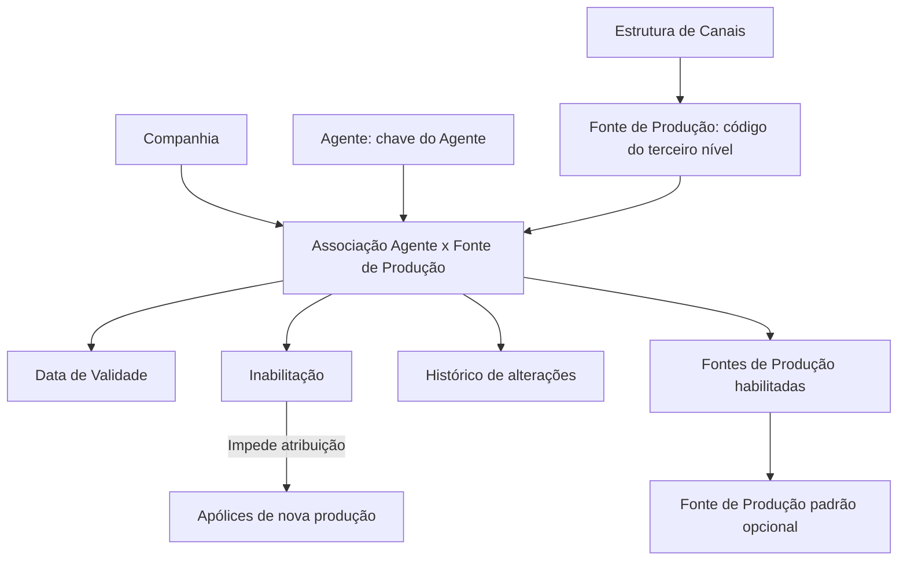

# Definição da Relação entre Agentes e Fontes de Produção

## 1. Metadados do Documento
- **Arquivo de Origem:** Não identificado no conteúdo fornecido
- **Tipo de Documento:** Especificação Funcional
- **Domínio / Sistema:** Configuração de Agentes, Estrutura de Canais e Fontes de Produção
- **Público-Alvo:** Negócio, Analistas Funcionais, Desenvolvedores e Operação
- **Data/Versão Identificada:** Não identificada

---

## 2. Resumo Executivo & Contexto de Negócio

O documento descreve a configuração da relação entre Agentes de uma entidade e as Fontes de Produção que cada Agente está autorizado a utilizar. O núcleo do sistema permite associar fontes específicas a cada Agente, utilizando atributos de companhia, chave de Agente e código do terceiro nível da estrutura de canais.

A associação entre Agente e Fonte de Produção é controlada por propriedades que determinam disponibilidade temporal e possibilidade de uso em apólices de nova produção. A propriedade de inabilitação impede que determinada Fonte de Produção de Cliente Distribuidor seja atribuída a novas apólices.

A data de validade estabelece a partir de quando uma associação fica disponível no sistema. Essa configuração permite manter histórico das alterações realizadas nas definições da relação entre Agentes e Fontes de Produção, viabilizando a exploração posterior dessas informações.

O documento também registra que, opcionalmente, a configuração de um Agente pode definir uma Fonte de Produção padrão. A Fonte de Produção padrão deve pertencer ao conjunto de Fontes de Produção habilitadas para aquele Agente.

---

## 3. Arquitetura, Componentes & Tecnologias Envolvidas

Os componentes e conceitos citados são:

- **Núcleo do Sistema:** Componente que permite configurar e associar Fontes de Produção aos Agentes da entidade.
- **Companhia:** Contexto organizacional no qual a associação entre Agente e Fonte de Produção é realizada.
- **Agente:** Entidade identificada por uma chave e configurada com uma ou mais Fontes de Produção.
- **Fonte de Produção:** Elemento associado ao Agente e identificado pela chave do terceiro nível da estrutura de canais.
- **Estrutura de Canais:** Documento ou conceito relacionado, recomendado para interpretação correta da associação.
- **Cliente Distribuidor:** Contexto mencionado na regra de inabilitação da Fonte de Produção.
- **Apólices de nova produção:** Apólices para as quais Fontes de Produção inabilitadas não podem ser atribuídas.
- **Fonte de Produção padrão:** Associação opcional escolhida dentre as Fontes de Produção habilitadas para o Agente.



**Nota de Análise:** O documento não detalha interfaces de usuário, métodos HTTP, contratos JSON, persistência de dados, integrações técnicas, tecnologias de implementação ou regras de validação adicionais.

---

## 4. Regras de Negócio, Especificações Funcionais & Processos

### 4.1 Configuração da relação entre Agentes e Fontes de Produção

1. O núcleo do sistema permite configurar e associar Fontes de Produção específicas para cada Agente da entidade.
2. A associação é realizada no contexto de uma Companhia.
3. A associação deve identificar a chave do Agente.
4. A associação deve identificar o código da Fonte de Produção por meio da chave do terceiro nível da estrutura de canais.
5. Uma relação entre Agente e Fonte de Produção pode possuir propriedades gerais e outras propriedades.

### 4.2 Regra de inabilitação

1. A propriedade **Inabilitação** estabelece que a Fonte de Produção do Cliente Distribuidor está inabilitada.
2. Uma Fonte de Produção inabilitada não pode ser atribuída em apólices de nova produção.
3. O documento não detalha se a inabilitação afeta apólices já existentes, renovações, alterações contratuais ou outros processos.

### 4.3 Regra de data de validade

1. A propriedade **Data de Validade** define a data a partir da qual a associação entre Agente e Fonte de Produção fica disponível para uso no sistema.
2. A configuração correta da Data de Validade permite manter histórico das mudanças realizadas nas definições.
3. O histórico resultante pode ser explorado posteriormente.
4. O documento não informa formato de data, regras de data final, tratamento de datas retroativas ou mecanismo de consulta ao histórico.

### 4.4 Fonte de Produção padrão

1. Na configuração dos Agentes, é possível especificar voluntariamente uma Fonte de Produção padrão.
2. A Fonte de Produção padrão deve ser selecionada dentre as Fontes de Produção habilitadas na relação do Agente.
3. A definição da Fonte de Produção padrão é opcional.
4. O documento não especifica o comportamento do sistema quando não existir Fonte de Produção padrão configurada.

---

## 5. Tabelas de Parâmetros, Ambientes e Estruturas de Dados

| Item / Parâmetro | Descrição / Função | Tipo / Valores / Formato | Ambiente / Observações |
| :--- | :--- | :--- | :--- |
| Companhia | Contém o código da companhia na qual é associada uma Fonte de Produção a uma chave de Agente. | Código de companhia; formato não detalhado. | Propriedade geral da associação. |
| Agente | Identifica a chave do Agente. | Chave de Agente; formato não detalhado. | Propriedade geral da associação. |
| Código do Terceiro Nível | Identifica a chave do terceiro nível da estrutura de canais ou da Fonte de Produção atribuída ao Agente. | Código/chave; formato não detalhado. | Propriedade geral da associação. |
| Fonte de Produção | Fonte específica que cada Agente pode utilizar. | Associada ao código do terceiro nível. | Pode ser habilitada, inabilitada ou definida como padrão. |
| Inabilitação | Estabelece que a Fonte de Produção do Cliente Distribuidor está inabilitada para atribuição em novas apólices. | Estado/propriedade; valores não detalhados. | Não pode ser utilizada em apólices de nova produção. |
| Data de Validade | Determina a data a partir da qual a associação entre Agente e Fonte de Produção está disponível no sistema. | Data; formato não detalhado. | Permite histórico das alterações de definições. |
| Fonte de Produção padrão | Fonte de Produção opcional definida na configuração do Agente. | Seleção voluntária. | Deve pertencer às Fontes de Produção habilitadas do Agente. |
| Estrutura de Canais | Documento/conceito relacionado à identificação da Fonte de Produção pelo terceiro nível. | Não detalhado. | Leitura recomendada para evitar interpretação isolada incorreta. |

**Ambientes, URLs, servidores, rotas de log e variáveis técnicas:** não identificados no conteúdo fornecido.

---

## 6. Bateria de Perguntas & Respostas para RAG (FAQ Sintético)

### P1: Qual é o objetivo da relação entre Agentes e Fontes de Produção?
**R:** A relação permite que o núcleo do sistema configure e associe, para cada Agente da entidade, as Fontes de Produção específicas que esse Agente pode utilizar.

### P2: Quais atributos identificam uma associação entre Agente e Fonte de Produção?
**R:** A associação é identificada pelo código da Companhia, pela chave do Agente e pelo Código do Terceiro Nível da estrutura de canais ou Fonte de Produção atribuída ao Agente.

### P3: O que representa o atributo Companhia na configuração?
**R:** O atributo Companhia contém o código da companhia na qual está sendo associada uma Fonte de Produção a uma chave de Agente determinada.

### P4: Qual é a função do atributo Agente?
**R:** O atributo Agente identifica a chave do Agente que receberá a associação com a Fonte de Produção.

### P5: O que é o Código do Terceiro Nível na relação de Agentes e Fontes de Produção?
**R:** O Código do Terceiro Nível identifica a chave do terceiro nível da estrutura de canais ou a Fonte de Produção que está sendo atribuída ao Agente.

### P6: O que acontece quando uma Fonte de Produção está inabilitada?
**R:** A inabilitação estabelece que a Fonte de Produção do Cliente Distribuidor não pode ser atribuída em apólices de nova produção.

### P7: Uma Fonte de Produção inabilitada pode ser utilizada em apólices já existentes?
**R:** O documento informa somente que a Fonte de Produção inabilitada não pode ser atribuída em apólices de nova produção. Não há detalhamento sobre apólices existentes, renovações ou alterações.

### P8: Para que serve a Data de Validade da associação?
**R:** A Data de Validade determina a partir de qual data a associação entre Agente e Fonte de Produção fica disponível no sistema para utilização.

### P9: Como a Data de Validade contribui para o histórico das configurações?
**R:** Uma configuração correta da Data de Validade permite manter histórico das mudanças realizadas nas definições da associação entre Agentes e Fontes de Produção, possibilitando explorar essas informações posteriormente.

### P10: É obrigatório definir uma Fonte de Produção padrão para cada Agente?
**R:** Não. O documento afirma que a Fonte de Produção padrão pode ser especificada voluntariamente na configuração do Agente.

### P11: Qual Fonte de Produção pode ser definida como padrão para um Agente?
**R:** A Fonte de Produção padrão deve ser escolhida dentre as Fontes de Produção habilitadas na relação de Fontes de Produção do Agente.

### P12: Qual documento relacionado deve ser consultado para interpretar corretamente a relação?
**R:** O documento recomenda a leitura de **Estrutura de Canais**, pois a interpretação isolada do documento de relação entre Agentes e Fontes de Produção pode conduzir a erro.

---

## 7. Glossário de Termos, Siglas & Conceitos-Chave

- **Agente:** Entidade identificada por uma chave e configurada com Fontes de Produção que pode utilizar.
- **Apólice de nova produção:** Apólice para a qual uma Fonte de Produção inabilitada não pode ser atribuída.
- **Cliente Distribuidor:** Contexto associado à Fonte de Produção cuja inabilitação impede utilização em novas apólices.
- **Companhia:** Organização identificada por código, na qual ocorre a associação entre Agente e Fonte de Produção.
- **Data de Validade:** Data a partir da qual a associação entre Agente e Fonte de Produção fica disponível no sistema.
- **Estrutura de Canais:** Estrutura referenciada para identificação do terceiro nível associado à Fonte de Produção.
- **Fonte de Produção:** Fonte específica associada a um Agente e identificada pelo código do terceiro nível da estrutura de canais.
- **Fonte de Produção padrão:** Fonte opcional definida para o Agente dentre as Fontes de Produção habilitadas.
- **Inabilitação:** Propriedade que impede a atribuição da Fonte de Produção do Cliente Distribuidor em apólices de nova produção.
- **Terceiro Nível:** Nível da estrutura de canais cuja chave identifica a Fonte de Produção atribuída ao Agente.

---

## 8. Notas Críticas, Riscos & Limitações

- O documento recomenda a leitura da **Estrutura de Canais**, pois a interpretação isolada pode conduzir a erro.
- Não foram informados formatos, tamanhos, valores permitidos ou obrigatoriedade dos campos Companhia, Agente, Código do Terceiro Nível e Data de Validade.
- Não há detalhamento sobre interface de configuração, APIs, contratos de integração, persistência, permissões ou responsáveis pelo cadastro.
- A regra de inabilitação está limitada explicitamente à atribuição em apólices de nova produção; o efeito sobre apólices existentes não é detalhado.
- Não há definição de data final de validade, sobreposição de períodos de vigência, conflitos entre associações ou tratamento de retroatividade.
- Não há detalhamento sobre como o histórico de mudanças é consultado, armazenado ou auditado.
- O conteúdo apresenta referências textuais a “CF”, “Home Solutions APIs Documentation” e “Zeus”, mas não fornece contexto suficiente para definir sua relação com a configuração de Agentes e Fontes de Produção.

---

## 9. Conteúdo Bruto Estruturado (Referência Fiel)

```text
--- [PÁGINA 1 DE 2] ---

DEFINICIÓN de la Relación de Agentes y
Fuentes de Producción
Contexto
Funcionalmente, el núcleo del Sistema cuenta con la posibilidad de configurar y asociar para cada
uno de los Agentes de la Entidad las Fuentes de Producción específicas que cada uno de ellos
puede utilizar.
Propiedades Generales
Otras Propiedades
Propiedades Generales
Compañía
Este atributo contiene el código de la compañía en la que se está asociando para una clave de
agente determinada el código de la Fuente de Producción.
Agente
Este atributo identifica la clave del Agente.
Código del Tercer Nivel
Este atributo identificará la clave del Tercer Nivel de la estructura de canales o Fuente de
Producción que se está asignando al agente.
 / 
 CF
Home Solutions APIs Documentation Zeus
EN


--- [PÁGINA 2 DE 2] ---

Otras Propiedades
Inhabilitación
Esta propiedad establece que la Fuente de Producción del Cliente Distribuidor está inhabilitada para
poder ser asignada en pólizas de nueva producción.
Fecha de Validez
Esta propiedad establece la fecha a partir de la cual la asociación del Agente y la Fuente de
Producción está disponible en el sistema para ser utilizada, por lo que una correcta configuración
habilita tener un histórico de los cambios efectuados en las definiciones y poder así explotar
posteriormente esta información.
Vínculos
Relación de Documentos / Conceptos cuya lectura recomendada para evitar que la interpretación
aislada del presente documento pueda conducir a error.
Estructura de Canales
Preguntas frecuentes
1 ¿Existe alguna premisa que deba ser tomada en consideración en la asignación de las Fuentes de
Producción a los Agentes?
En la configuración de los Agentes, se puede especificar de manera voluntaria cual es la fuente de
producción por defecto que el agente tiene asignada de la relación de fuentes de producción que
éste tenga habilitadas.
```
