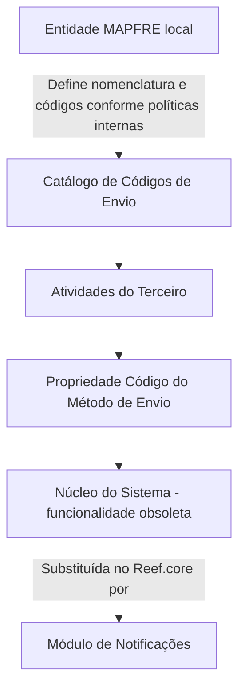

# Definição dos Métodos de Envio — Catálogo de Códigos no Núcleo do Sistema

## 1. Metadados do Documento
- **Arquivo de Origem:** Não identificado
- **Tipo de Documento:** Especificação Técnica
- **Domínio / Sistema:** Núcleo do Sistema / Reef.core / Notificações
- **Público-Alvo:** Desenvolvedores, Arquitetos, Operação e Negócio
- **Data/Versão Identificada:** Não identificada

---

## 2. Resumo Executivo & Contexto de Negócio

O documento descreve a definição funcional dos **Métodos de Envio**, também chamados de **Códigos de Envio**, usados para associar meios de transmissão de informações às atividades de um Terceiro no núcleo do Sistema. O catálogo de códigos é entregue inicialmente vazio às entidades.

Como exemplo funcional, o documento relaciona a atividade **1 - Asegurados** a códigos de método de envio como correio eletrônico, correio postal, fax e SMS. A codificação permite identificar o meio de envio associado às atividades do Terceiro.

Entretanto, a funcionalidade dessa propriedade está explicitamente marcada como **descontinuada e obsoleta** no núcleo do Sistema. Portanto, o catálogo ou a propriedade de Métodos de Envio não pode ser usado nem reutilizado para finalidades de escopo local.

O documento informa que a funcionalidade legada foi substituída, no núcleo do **Reef.core**, pelo módulo de **Notificações**. A responsabilidade pela nomenclatura e pela definição local dos códigos de envio é atribuída à entidade **MAPFRE local**, de acordo com suas políticas e procedimentos internos.

---

## 3. Arquitetura, Componentes & Tecnologias Envolvidas

| Componente / Termo | Papel descrito no documento | Situação |
| :--- | :--- | :--- |
| Núcleo do Sistema | Disponibilizava a identificação e codificação de Métodos de Envio em um catálogo de informação. | Funcionalidade de propriedade descontinuada e obsoleta. |
| Catálogo de Códigos de Envio | Catálogo inicialmente vazio entregue às entidades para codificar possíveis métodos de envio de informação. | Não deve ser usado ou reutilizado localmente. |
| Atividades do Terceiro | Elemento ao qual o Código do Método de Envio seria associado. | Citado com o exemplo da atividade 1 - Asegurados. |
| Reef.core | Núcleo no qual a funcionalidade anterior foi substituída. | Referência ao sistema núcleo. |
| Módulo de Notificações | Módulo que substitui a funcionalidade de Métodos de Envio no Reef.core. | Mecanismo substituto informado. |
| MAPFRE local | Entidade responsável pela nomenclatura e definição dos códigos de envio conforme políticas internas. | Responsabilidade local declarada. |



> **Nota de Análise:** O documento não detalha interfaces, métodos HTTP, contratos JSON, persistência de dados, integrações ou operações técnicas do módulo de Notificações.

---

## 4. Regras de Negócio, Especificações Funcionais & Processos

1. O núcleo do Sistema possuiu a capacidade funcional de identificar e codificar possíveis Códigos ou Métodos de Envio de informação.
2. Os códigos eram mantidos em um catálogo de informação entregue inicialmente vazio às entidades.
3. A propriedade **Código do Envío** indica o código do Método de Envio que seria associado às atividades do Terceiro.
4. O documento apresenta a atividade **1 - Asegurados** como exemplo de atividade que pode ser associada a Métodos de Envio.
5. A propriedade de Métodos de Envio está descontinuada e obsoleta no núcleo do Sistema.
6. A funcionalidade obsoleta não pode ser utilizada nem reutilizada para qualquer finalidade de escopo local.
7. No núcleo do **Reef.core**, a funcionalidade foi substituída pelo módulo de **Notificações**.
8. A entidade **MAPFRE local** é responsável pela nomenclatura e pela definição dos códigos de envio, respeitando suas próprias políticas e procedimentos internos.
9. O documento menciona a pendência de incluir um enlace para o documento de definição de impostos e retenções da **Tesorería A1001100**, mas não fornece o enlace nem o conteúdo desse documento.

---

## 5. Tabelas de Parâmetros, Ambientes e Estruturas de Dados

| Item / Parâmetro | Descrição / Função | Tipo / Valores / Formato | Ambiente / Observações |
| :--- | :--- | :--- | :--- |
| Código do Envio | Identifica o código do Método de Envio associado às atividades do Terceiro. | Código numérico exemplificado com três dígitos. | Propriedade descontinuada e obsoleta no núcleo do Sistema. |
| Método de Envio `001` | Correio eletrônico. | Código `001`. | Exemplo para a atividade 1 - Asegurados. |
| Método de Envio `002` | Correio postal. | Código `002`. | Exemplo para a atividade 1 - Asegurados. |
| Método de Envio `003` | Fax. | Código `003`. | Exemplo para a atividade 1 - Asegurados. |
| Método de Envio `004` | SMS. | Código `004`. | Exemplo para a atividade 1 - Asegurados. |
| Catálogo de Códigos de Envio | Repositório funcional de possíveis códigos ou métodos de envio. | Inicialmente vazio. | Não reutilizar para propósitos locais devido à obsolescência. |
| Módulo de Notificações | Substitui a funcionalidade antiga de Métodos de Envio. | Não detalhado. | Substituição informada no núcleo do Reef.core. |
| Tesorería A1001100 | Referência a documento de definição de impostos e retenções. | Enlace pendente. | O documento não apresenta o enlace. |

---

## 6. Bateria de Perguntas & Respostas para RAG (FAQ Sintético)

### P1: Qual era a finalidade do Catálogo de Códigos de Envio no núcleo do Sistema?
**R:** O Catálogo de Códigos de Envio permitia identificar e codificar possíveis Métodos de Envio de informação. O catálogo era entregue inicialmente vazio às entidades e os códigos podiam ser associados às atividades de um Terceiro.

### P2: O que representa a propriedade Código do Envio?
**R:** A propriedade Código do Envio indica o código do Método de Envio que seria associado às atividades do Terceiro no Sistema.

### P3: Quais Métodos de Envio são exemplificados para a atividade 1 - Asegurados?
**R:** O documento exemplifica quatro códigos para a atividade 1 - Asegurados: `001` para Correio Eletrônico, `002` para Correio Postal, `003` para Fax e `004` para SMS.

### P4: Posso reutilizar localmente a funcionalidade de Métodos de Envio?
**R:** Não. O documento afirma que a funcionalidade dessa propriedade está descontinuada e obsoleta no núcleo do Sistema e não pode ser usada nem reutilizada para qualquer finalidade de escopo local.

### P5: Qual módulo substituiu a funcionalidade de Métodos de Envio?
**R:** A funcionalidade foi substituída no núcleo do Reef.core pelo módulo de Notificações.

### P6: O documento detalha como integrar tecnicamente com o módulo de Notificações?
**R:** Não. O documento informa somente que o módulo de Notificações substitui a funcionalidade anterior no Reef.core. Não são descritos endpoints, métodos HTTP, contratos de dados, eventos ou procedimentos de integração.

### P7: Quem é responsável pela nomenclatura e definição dos códigos de envio?
**R:** A responsabilidade pela nomenclatura e pela definição dos códigos de envio é da entidade MAPFRE local, conforme suas políticas e procedimentos internos.

### P8: O Catálogo de Códigos de Envio é entregue preenchido?
**R:** Não. O documento informa que o catálogo de informação é entregue inicialmente vazio de conteúdo às entidades.

### P9: Existe uma definição disponível para impostos e retenções da Tesorería A1001100?
**R:** O documento registra uma pendência para incluir o enlace ao documento de definição de impostos e retenções da Tesorería A1001100. O enlace não está presente no conteúdo fornecido.

### P10: O que é a atividade 1 - Asegurados no contexto do documento?
**R:** A atividade 1 - Asegurados é usada como exemplo de atividade do Terceiro à qual poderia ser associado um Código de Método de Envio. O documento não fornece detalhamento funcional adicional sobre essa atividade.

---

## 7. Glossário de Termos, Siglas & Conceitos-Chave

- **Código do Envio:** Propriedade que indica o código do Método de Envio associado às atividades do Terceiro.
- **Método de Envio:** Meio de transmissão de informação, exemplificado por correio eletrônico, correio postal, fax e SMS.
- **Catálogo de Códigos de Envio:** Catálogo inicialmente vazio para identificação e codificação de possíveis Métodos de Envio.
- **Terceiro:** Entidade cujas atividades podem receber uma associação com um Código de Método de Envio.
- **Asegurados:** Termo apresentado como atividade 1 no exemplo do documento.
- **Reef.core:** Núcleo mencionado como local onde a funcionalidade legada foi substituída pelo módulo de Notificações.
- **MAPFRE local:** Entidade local responsável por definir a nomenclatura e os códigos de envio conforme políticas e procedimentos internos.
- **Tesorería A1001100:** Referência associada a um documento de definição de impostos e retenções cujo enlace está pendente.
- **SMS:** Método de Envio identificado pelo código `004`; o documento não expande a sigla.

---

## 8. Notas Críticas, Riscos & Limitações

- A funcionalidade de Métodos de Envio no núcleo do Sistema é explicitamente classificada como descontinuada e obsoleta.
- O uso ou a reutilização local da propriedade de Métodos de Envio é proibido pelo documento.
- O módulo de Notificações é mencionado como substituto, mas não possui detalhamento funcional ou técnico no conteúdo fornecido.
- A responsabilidade local sobre nomenclatura e definição de códigos depende das políticas e dos procedimentos internos da entidade MAPFRE local.
- Existe uma pendência documental: inserir o enlace para a definição de impostos e retenções da Tesorería A1001100.
- Não há informações sobre ambientes, URLs, portas, autenticação, bancos de dados, logs, contratos de integração ou versionamento.

---

## 9. Conteúdo Bruto Estruturado (Referência Fiel)

```text
--- [PÁGINA 1 DE 2] ---

Pendiente Falta: Colocar el enlace al documento de definición de los impuestos y retenciones de la
Tesorería A1001100
DEFINICIÓN de los Métodos de Envío
Contexto
Funcionalmente, el núcleo del Sistema cuenta con la posibilidad de identificar y codificar los posibles
Códigos o Métodos de Envío de información en un catálogo de información que se entrega a las
entidades inicialmente vacío de contenido.
Código del Envío
Esta propiedad indica en el sistema el código del Método de Envío que se asociará a las actividades
del Tercero. Como ejemplo y para la actividad 1 - Asegurados:
Método de Envío Significado
001 Correo Electrónico
002 Correo Postal
003 Fax
004 SMS
 /
 CF
Home Solutions APIs Documentation Zeus
EN


--- [PÁGINA 2 DE 2] ---

Método de Envío Significado
... ...
La funcionalidad de esta propiedad está descontinuada y obsoleta en el núcleo del sistema por lo que
no se puede usar o reutilizar para ningún propósito de ámbito local.
NOTA: La funcionalidad ha sido sustituida en el núcleo de Reef.core por el módulo de Notificaciones.
Vínculos
Preguntas frecuentes
(1) ¿Existe alguna recomendación operativa que deba ser tomada en consideración localmente en la
codificación, estandarización, uso y definición del Catálogo de Códigos de Envío en el Sistema?
La responsabilidad en la nomenclatura y definición de los códigos de Envío corresponde a la entidad
MAPFRE local de acuerdo con sus políticas y procedimientos internos
```
