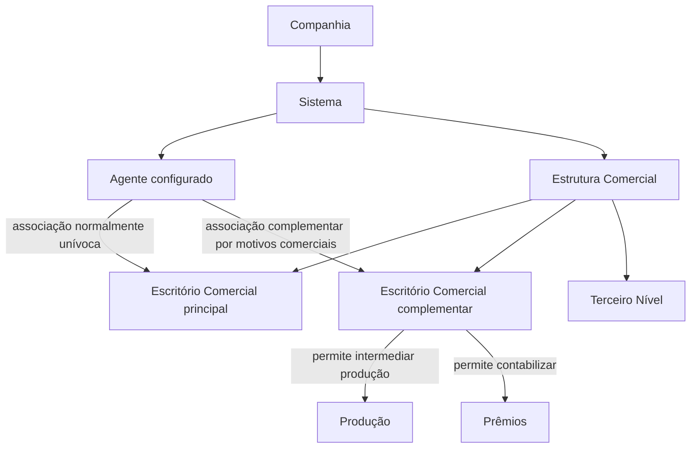

# Definição das Agências Habilitadas por Agente

## 1. Metadados do Documento
- **Arquivo de Origem:** `Não identificado no conteúdo fornecido`
- **Tipo de Documento:** `Especificação Funcional`
- **Domínio / Sistema:** `Estrutura Comercial da Entidade — Agentes e Escritórios Comerciais`
- **Público-Alvo:** `Negócio, Operação, Analistas Funcionais e Administradores de Configuração`
- **Data/Versão Identificada:** `Não identificada`

---

## 2. Resumo Executivo & Contexto de Negócio

O documento define a associação entre Agentes configurados no Sistema e Escritórios pertencentes à Estrutura Comercial da Companhia. Cada Agente possui uma Agência/Escritório atribuído na Estrutura Comercial, normalmente de forma unívoca.

Em determinadas situações motivadas por razões comerciais, um Agente pode intermediar produção em Escritórios complementares. O objetivo funcional é associar ao Agente as chaves desses Escritórios Comerciais complementares, permitindo que a produção seja intermediada e que os respectivos prêmios sejam contabilizados nesses Escritórios.

A configuração é composta por propriedades gerais, incluindo Companhia, Chave de Agente e Chave do Terceiro Nível da Estrutura Comercial. Também existem propriedades complementares para controlar a indisponibilidade da associação e sua vigência temporal.

A propriedade de data de validade viabiliza o histórico das alterações realizadas nas definições configuradas. O documento recomenda a leitura do material relacionado à Estrutura Comercial da Entidade para evitar interpretações isoladas incorretas.

---

## 3. Arquitetura, Componentes & Tecnologias Envolvidas

Os elementos funcionais identificados são:

- **Sistema:** ambiente no qual Agentes, Escritórios Comerciais e associações são configurados.
- **Agente:** intermediário identificado por uma chave previamente configurada.
- **Estrutura Comercial:** estrutura organizacional da Companhia que contém Escritórios Comerciais e o Terceiro Nível.
- **Escritório Comercial:** unidade da Estrutura Comercial associada ao Agente.
- **Escritório Complementar:** Escritório Comercial adicional no qual o Agente pode intermediar produção e contabilizar prêmios.
- **Companhia:** entidade cujo código é registrado na associação entre Agente e Escritório Comercial.
- **Terceiro Nível:** código que identifica o Terceiro Nível da Estrutura Comercial no Sistema.



**Nota de Análise:** o documento não detalha arquitetura técnica, tecnologias, integrações, interfaces, métodos HTTP, contratos de dados, bases de dados ou ambientes de implantação.

---

## 4. Regras de Negócio, Especificações Funcionais & Processos

1. Todos os Agentes configurados no Sistema possuem um Escritório da Estrutura Comercial da Companhia atribuído.
2. A atribuição entre Agente e Escritório Comercial é normalmente unívoca.
3. Por motivos comerciais, um Agente pode ser autorizado a emitir ou intermediar produção em outros Escritórios complementares.
4. A associação de Escritórios complementares ao Agente deve registrar as chaves dos Escritórios Comerciais nos quais o Agente poderá intermediar produção.
5. A associação também permite contabilizar os prêmios da produção nos Escritórios complementares habilitados.
6. O atributo **Companhia** contém o código da Companhia na qual o Código do Escritório Comercial está sendo associado ao Agente.
7. O atributo **Chave de Agente** identifica a chave do intermediário conforme configuração previamente estabelecida.
8. O atributo **Chave do Terceiro Nível** contém o código que identifica o Terceiro Nível da Estrutura Comercial no Sistema.
9. A propriedade **Inabilitação** determina que o Escritório da Estrutura Comercial associado à chave do Agente está inabilitado para uso no Sistema.
10. A propriedade **Data de Validade** determina a data a partir da qual a associação entre Agente e Escritório fica habilitada para uso no Sistema.
11. O uso correto da Data de Validade permite manter histórico das alterações efetuadas nas definições configuradas.
12. Não há esclarecimento operacional local adicional a ser considerado na atribuição de Escritórios Comerciais a Agentes; a resposta da seção de perguntas frequentes é `N/A`.

---

## 5. Tabelas de Parâmetros, Ambientes e Estruturas de Dados

| Item / Parâmetro | Descrição / Função | Tipo / Valores / Formato | Ambiente / Observações |
| :--- | :--- | :--- | :--- |
| Companhia | Contém o código da Companhia na qual o Código do Escritório Comercial é associado ao Agente. | Código da Companhia; formato não detalhado. | Aplicável à associação entre Agente e Escritório Comercial. |
| Chave de Agente | Identifica a chave do intermediário segundo configurações previamente estabelecidas. | Chave de intermediário; formato não detalhado. | O documento exibe referência parcial a “CF”, sem explicação adicional. |
| Chave do Terceiro Nível | Contém o código identificador do Terceiro Nível da Estrutura Comercial no Sistema. | Código; formato não detalhado. | Relacionada à Estrutura Comercial. |
| Inabilitação | Indica que o Escritório da Estrutura Comercial associado à chave do Agente está inabilitado para uso no Sistema. | Indicador de estado; valores não detalhados. | Impede a utilização do Escritório associado. |
| Data de Validade | Estabelece a data a partir da qual a associação entre Agente e Escritório fica habilitada para uso. | Data; formato não detalhado. | Permite preservar histórico de alterações de configuração. |
| Escritório Comercial complementar | Escritório adicional no qual o Agente pode intermediar produção e contabilizar prêmios. | Chave de Escritório Comercial; formato não detalhado. | Permitido em ocasiões e por motivos comerciais. |

---

## 6. Bateria de Perguntas & Respostas para RAG (FAQ Sintético)

### P1: Qual é o objetivo da definição de Escritórios habilitados por Agente?
**R:** O objetivo é associar ao Agente as chaves dos Escritórios Comerciais complementares da Estrutura Comercial nos quais o Agente poderá intermediar sua produção e contabilizar seus prêmios.

### P2: Todo Agente possui um Escritório Comercial associado?
**R:** Sim. O documento estabelece que todos os Agentes configurados no Sistema têm um Escritório da Estrutura Comercial da Companhia atribuído.

### P3: A associação entre Agente e Escritório Comercial é sempre única?
**R:** Normalmente a atribuição é unívoca. Contudo, em algumas ocasiões e por motivos comerciais, um Agente pode emitir ou intermediar produção em outros Escritórios complementares.

### P4: O que representa o atributo Companhia?
**R:** O atributo Companhia contém o código da Companhia na qual está sendo realizada a associação entre o Agente e o Código do Escritório Comercial.

### P5: Como a Chave de Agente é definida?
**R:** A Chave de Agente identifica a chave do intermediário de acordo com a configuração previamente estabelecida dessas chaves no Sistema.

### P6: Qual é a finalidade da Chave do Terceiro Nível?
**R:** A Chave do Terceiro Nível contém o código utilizado para identificar o Terceiro Nível da Estrutura Comercial no Sistema.

### P7: O que acontece quando a propriedade Inabilitação é aplicada?
**R:** A propriedade Inabilitação estabelece que o Escritório da Estrutura Comercial associado à chave do Agente está inabilitado e não pode ser utilizado no Sistema.

### P8: Para que serve a Data de Validade da associação?
**R:** A Data de Validade determina a data a partir da qual a associação entre Agente e Escritório está habilitada para uso no Sistema. Seu uso correto permite manter um histórico das mudanças realizadas nas definições configuradas.

### P9: Um Agente pode contabilizar prêmios em um Escritório complementar?
**R:** Sim. A associação com Escritórios complementares permite que o Agente intermedeie sua produção e contabilize seus prêmios nos Escritórios Comerciais complementares habilitados.

### P10: Existem orientações operacionais locais adicionais para a atribuição de Escritórios Comerciais a Agentes?
**R:** Não. A pergunta frequente sobre esclarecimentos operacionais locais apresenta a resposta `N/A`.

### P11: Qual documento relacionado deve ser lido para evitar interpretação isolada incorreta?
**R:** O documento recomenda a leitura da documentação referente à **Estrutura Comercial da Entidade**, pois a interpretação isolada do conteúdo atual pode conduzir a erro.

---

## 7. Glossário de Termos, Siglas & Conceitos-Chave

- **Agente:** intermediário configurado no Sistema, identificado por uma chave.
- **Chave de Agente:** identificador do intermediário conforme configuração previamente estabelecida.
- **Companhia:** entidade cujo código contextualiza a associação do Agente ao Escritório Comercial.
- **Data de Validade:** data a partir da qual a associação entre Agente e Escritório fica habilitada para utilização.
- **Estrutura Comercial:** estrutura da Companhia que contém os Escritórios Comerciais e respectivos níveis organizacionais.
- **Escritório Comercial:** unidade da Estrutura Comercial atribuída a um Agente.
- **Escritório Complementar:** Escritório Comercial adicional habilitado para um Agente intermediar produção e contabilizar prêmios.
- **Inabilitação:** propriedade que indica que o Escritório associado ao Agente não pode ser utilizado no Sistema.
- **Intermediário:** entidade identificada pela Chave de Agente.
- **Prêmios:** valores cuja contabilização é permitida nos Escritórios complementares associados.
- **Terceiro Nível:** nível da Estrutura Comercial identificado por um código no Sistema.
- **N/A:** sem informação adicional ou não aplicável, conforme a resposta da pergunta frequente.

---

## 8. Notas Críticas, Riscos & Limitações

- O documento não especifica os critérios comerciais que justificam a associação de Escritórios complementares a um Agente.
- Não são detalhados formatos, tipos técnicos, obrigatoriedade ou domínios válidos dos atributos Companhia, Chave de Agente, Chave do Terceiro Nível e Data de Validade.
- O documento não define o comportamento operacional após a inabilitação de um Escritório já associado ao Agente.
- Não há detalhamento sobre telas, APIs, métodos de manutenção, perfis de acesso, integrações ou validações técnicas.
- A leitura da documentação de **Estrutura Comercial da Entidade** é recomendada para evitar interpretação incorreta do documento de forma isolada.
- A seção de perguntas frequentes não fornece esclarecimentos operacionais locais adicionais, pois registra `N/A`.

---

## 9. Conteúdo Bruto Estruturado (Referência Fiel)

```text
--- [PÁGINA 1 DE 2] ---

DEFINICIÓN de las Oficinas Habilitadas por
Agente
Contexto
Todos y cada uno de los Agentes configurados en el Sistema tienen asignada una Oficina de la
Estructura Comercial de la Compañía. Normalmente esta asignación es unívoca pero en
ocasiones y por motivos comerciales se permite que un agente pueda emitir su producción en otras
Oficinas complementarias.
Objetivo
Asignar/Asociar a los Agentes la/s clave/s de las Oficinas Complementarias de la Estructura
Comercial en las que van a poder intermediar su Producción y contabilizar sus primas.
Propiedades Generales
Otras Propiedades
Propiedades Generales
Compañía
Este atributo contiene el código de la compañía en la que se está asociando al Agente el Código de
la Oficina Comercial.
Clave de Agente
 /
 CF
Home Solutions APIs Documentation Zeus
EN


--- [PÁGINA 2 DE 2] ---

Esta propiedad identifica la clave del intermediario de acuerdo con la configuración de las mismas
previamente establecidas.
Clave del Tercer Nivel
Este atributo contiene el código por el que se identificará el Tercer Nivel de la Estructura Comercial
en el Sistema.
Otras Propiedades
Inhabilitación
Esta propiedad establece que la Oficina de la Estructura Comercial asociada a la clave del Agente,
se encuentra inhabilitada para poder ser utilizada en el Sistema.
Fecha de Validez
Esta propiedad establece la fecha a partir de la cual la asociación del Agente y la Oficina está
habilitada en el sistema para ser utilizada, por lo que su correcto uso permite tener un histórico de los
cambios efectuados en las definiciones configuradas.
Vínculos
Relación de Directrices y Documentos funcionales cuya lectura recomendada para evitar que la
interpretación aislada del presente documento pueda conducir a error.
Estructura Comercial de la Entidad
Preguntas frecuentes
(1) ¿Existe alguna aclaración operativa que deba ser tomada en consideración localmente en la
asignación de las Oficinas Comerciales a los Agentes?
N/A
```
