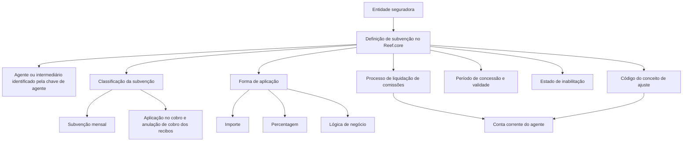

# Definição e Configuração de Subvenções Concedidas a Agentes no Reef.core

## 1. Metadados do Documento
- **Arquivo de Origem:** Não identificado no conteúdo fornecido
- **Tipo de Documento:** Especificação Funcional
- **Domínio / Sistema:** Reef.core — liquidação de comissões para força de vendas de entidade seguradora
- **Público-Alvo:** Não identificado explicitamente; conteúdo aplicável a operação, negócio e configuração funcional
- **Data/Versão Identificada:** Não identificada

---

## 2. Resumo Executivo & Contexto de Negócio

O documento define o cadastro de **subvenções** concedidas a agentes no sistema Reef.core. Uma subvenção é apresentada como uma ajuda econômica atribuída a uma pessoa ou instituição para realizar uma atividade considerada de interesse.

No contexto de uma entidade seguradora, o Reef.core permite configurar subvenções para a força de vendas como estratégia de gratificação e reconhecimento. O objetivo declarado é fortalecer o vínculo de lealdade e compromisso entre a entidade seguradora e os agentes ou intermediários.

A configuração de subvenções permite que a companhia seguradora determine as modalidades de subvenção que deseja conceder e as considere como comissões específicas durante o processo de liquidação de comissões do Reef.core.

A definição funcional é composta por propriedades identificativas, operativas e outras propriedades. Entre os elementos principais estão companhia, chave do agente, moeda, classificação, forma de aplicação, conceito de ajuste de comissões, períodos de concessão, valores, percentuais, lógica de negócio, valor mínimo de cobrança, inabilitação e data de validade.

A documentação também impõe uma recomendação operacional: os códigos de conceitos de ajuste informados no catálogo de subvenções devem estar livres de impostos.

---

## 3. Arquitetura, Componentes & Tecnologias Envolvidas

O conteúdo fornecido não descreve arquitetura técnica de infraestrutura, APIs, protocolos, servidores, bancos de dados, métodos HTTP, contratos JSON ou tecnologias de implementação. A relação funcional identificada envolve o sistema Reef.core, a entidade seguradora, o agente/intermediário, o catálogo de subvenções e o processo de liquidação de comissões.

### Componentes e conceitos identificados

| Componente / Conceito | Papel no documento |
| :--- | :--- |
| **Reef.core** | Sistema que permite configurar subvenções para a força de vendas e considerá-las no processo de liquidação de comissões. |
| **Entidade seguradora** | Organização que define as subvenções e os critérios de concessão aos agentes. |
| **Agente / Intermediário** | Beneficiário identificado pela chave de agente e associado à subvenção configurada. |
| **Subvenção** | Ajuda econômica configurável como comissão específica para o processo de liquidação de comissões. |
| **Conceito de ajuste de comissões** | Código que identifica especificamente, na conta corrente do agente, a subvenção satisfeita. |
| **Conta corrente do agente** | Local onde o conceito de ajuste identifica a subvenção paga ao agente. |
| **Processo de liquidação de comissões** | Processo no qual subvenções válidas e habilitadas podem ser consideradas. |
| **Moedas** | Documento funcional relacionado recomendado para leitura complementar. |



> **Nota de Análise:** O documento não detalha interfaces técnicas, integrações, métodos de cálculo da liquidação, contratos de dados ou a implementação da lógica de negócio.

---

## 4. Regras de Negócio, Especificações Funcionais & Processos

### 4.1 Objetivo funcional

A companhia seguradora deve determinar e configurar as subvenções que deseja estabelecer. Essas subvenções devem ser consideradas como comissões específicas no processo de liquidação de comissões do Reef.core.

### 4.2 Identificação da subvenção

Uma definição de subvenção inclui os seguintes elementos identificativos:

1. **Companhia:** determina o código da companhia para a qual a definição está sendo realizada.
2. **Chave de agente:** identifica a chave do intermediário conforme a identificação e definição estabelecidas pela entidade seguradora.
3. **Moeda:** indica o código da moeda para a qual a subvenção é concedida.
4. **Classificação da subvenção:** deve corresponder a um valor corporativamente configurado no Reef.core.
5. **Forma de aplicação da subvenção:** deve corresponder a um valor corporativamente configurado no Reef.core.
6. **Código do conceito de ajuste:** identifica a subvenção satisfeita na conta corrente do agente.

### 4.3 Classificações permitidas para subvenções

A classificação da subvenção pode assumir um dos seguintes valores configurados corporativamente no Reef.core:

1. **SUBVENÇÃO MENSAL**
2. **APLICAÇÃO NO COBRO E ANULAÇÃO DE COBRO DOS RECIBOS**

### 4.4 Formas de aplicação permitidas

A forma de aplicação da subvenção pode assumir um dos seguintes valores configurados corporativamente no Reef.core:

1. **IMPORTE:** o valor deve estar de acordo com a moeda da definição.
2. **PORCENTAGEM**
3. **LÓGICA DE NEGÓCIO**

### 4.5 Regras para código do conceito de ajuste

O código do conceito de ajuste de comissões deve:

- Identificar especificamente, na conta corrente do agente, a subvenção que foi satisfeita.
- Possuir agrupamento contábil do tipo **MP**.
- Estar livre de impostos, conforme recomendação operacional apresentada na seção de perguntas frequentes.

### 4.6 Regras operativas de concessão

- A **data de início da concessão da subvenção** identifica a data a partir da qual a subvenção é concedida ao agente.
- A **data de caducidade da concessão da subvenção** determina a data de vencimento da subvenção concedida.
- O **importe da subvenção** somente se aplica quando a forma de aplicação for **IMPORTE**.
- A **porcentagem da subvenção** somente se aplica quando a forma de aplicação for **PORCENTAGEM**.
- A porcentagem é aplicada sobre o total das comissões do agente.
- A **lógica de negócio para obter o importe ou a porcentagem** somente se aplica quando a forma de aplicação for **LÓGICA DE NEGÓCIO**.
- A lógica de negócio permite avaliar dinamicamente os critérios de negócio considerados pela entidade seguradora para obter o importe ou a porcentagem da subvenção.
- O **importe mínimo de cobrança** somente se aplica quando a classificação da subvenção for **SUBVENÇÃO MENSAL**.
- O importe mínimo de cobrança determina o valor mínimo que o agente deve cobrar para receber a subvenção mensal.

### 4.7 Regras de disponibilidade, histórico e inabilitação

- A propriedade **Inabilitação** informa ao Reef.core que o registro de subvenção não está habilitado para uso no processo de liquidação de comissões da entidade seguradora.
- A **Data de Validade** determina a data a partir da qual a definição está disponível no sistema para uso nos processos aplicáveis.
- O uso correto da Data de Validade permite manter um histórico das alterações realizadas nas definições de subvenções.

---

## 5. Tabelas de Parâmetros, Ambientes e Estruturas de Dados

| Item / Parâmetro | Descrição / Função | Tipo / Valores / Formato | Ambiente / Observações |
| :--- | :--- | :--- | :--- |
| Companhia | Determina o código da companhia sobre a qual a definição é realizada. | Código de companhia | Não detalhado |
| Chave de agente | Identifica a chave do intermediário conforme a identificação da entidade seguradora. | Chave de intermediário | Não detalhado |
| Moeda | Indica o código da moeda para a qual a subvenção é concedida. | Código de moeda | Relacionado ao documento funcional “Monedas”. |
| Classificação da subvenção | Determina a modalidade funcional da subvenção concedida. | `SUBVENÇÃO MENSUAL`; `APLICAÇÃO NO COBRO E ANULAÇÃO DE COBRO DOS RECIBOS` | Valores configurados corporativamente no Reef.core. |
| Forma de aplicação da subvenção | Determina como o valor da subvenção será aplicado. | `IMPORTE`; `PORCENTAGEM`; `LÓGICA DE NEGÓCIO` | Valores configurados corporativamente no Reef.core. |
| Código do conceito de ajuste | Identifica a subvenção satisfeita na conta corrente do agente. | Código de conceito de ajuste de comissões | Agrupamento contábil obrigatório do tipo `MP`; código deve estar livre de impostos. |
| Data de início da concessão | Identifica a data desde a qual a subvenção é concedida ao agente. | Data | Não detalhado |
| Data de caducidade da concessão | Determina a data de vencimento da subvenção concedida. | Data | Não detalhado |
| Importe da subvenção | Identifica o valor concedido ao agente. | Importe monetário | Aplicável somente quando a forma de aplicação for `IMPORTE`; conforme a moeda da definição. |
| Porcentagem da subvenção | Identifica a porcentagem aplicada sobre o total das comissões do agente. | Porcentagem | Aplicável somente quando a forma de aplicação for `PORCENTAGEM`. |
| Lógica de negócio | Avalia dinamicamente critérios de negócio para obter importe ou porcentagem. | Lógica de negócio | Aplicável somente quando a forma de aplicação for `LÓGICA DE NEGÓCIO`; critérios não detalhados. |
| Importe mínimo de cobrança | Define o valor mínimo que o agente deve cobrar para receber a subvenção mensal. | Importe monetário | Aplicável somente à classificação `SUBVENÇÃO MENSUAL`. |
| Inabilitação | Indica que o registro de subvenção está inabilitado para uso na liquidação de comissões. | Estado de habilitação | Impede o uso do registro no processo de liquidação de comissões. |
| Data de Validade | Estabelece a data a partir da qual a definição está disponível no sistema. | Data | Permite manter histórico de alterações das definições. |
| Agrupamento contábil | Classificação contábil do conceito de ajuste. | `MP` | Obrigatório para o código do conceito de ajuste. |

---

## 6. Bateria de Perguntas & Respostas para RAG (FAQ Sintético)

### P1: Qual é o objetivo da configuração de subvenções no Reef.core?
**R:** O objetivo é determinar e configurar as subvenções que a companhia seguradora deseja estabelecer para seus agentes ou força de vendas, permitindo que essas subvenções sejam consideradas como comissões específicas no processo de liquidação de comissões do Reef.core.

### P2: O que é uma subvenção no contexto do documento?
**R:** Uma subvenção é uma ajuda econômica concedida a uma pessoa ou instituição para realizar uma atividade considerada de interesse. No Reef.core, a subvenção é configurada para a força de vendas da entidade seguradora como estratégia de gratificação e reconhecimento.

### P3: Quais classificações de subvenção podem ser configuradas no Reef.core?
**R:** O documento identifica duas classificações corporativamente configuradas no Reef.core: `SUBVENÇÃO MENSUAL` e `APLICAÇÃO NO COBRO E ANULAÇÃO DE COBRO DOS RECIBOS`.

### P4: Quais formas de aplicação de subvenção estão disponíveis?
**R:** A forma de aplicação pode ser `IMPORTE`, `PORCENTAGEM` ou `LÓGICA DE NEGÓCIO`. Quando for importe, o valor respeita a moeda da definição; quando for porcentagem, ela é aplicada sobre o total das comissões do agente; quando for lógica de negócio, os critérios são avaliados dinamicamente.

### P5: Quando o importe da subvenção deve ser informado?
**R:** O importe da subvenção deve ser informado somente quando a forma de aplicação da subvenção determinar que a concessão será realizada por `IMPORTE`.

### P6: Como funciona a porcentagem da subvenção?
**R:** A porcentagem da subvenção é utilizada somente quando a forma de aplicação for `PORCENTAGEM`. A porcentagem definida é aplicada sobre o total das comissões do agente.

### P7: Para que serve a lógica de negócio na definição de subvenções?
**R:** A lógica de negócio é utilizada quando a forma de aplicação for `LÓGICA DE NEGÓCIO`. Ela permite avaliar dinamicamente os critérios de negócio definidos pela entidade seguradora para obter o importe ou a porcentagem da subvenção a aplicar. O documento não detalha quais critérios ou implementações de lógica podem ser utilizados.

### P8: Quando o importe mínimo de cobrança é aplicável?
**R:** O importe mínimo de cobrança é aplicável somente quando a classificação da subvenção for `SUBVENÇÃO MENSUAL`. Esse parâmetro define o valor mínimo que o agente deve cobrar para ter direito à subvenção mensal.

### P9: Qual é a função do código do conceito de ajuste?
**R:** O código do conceito de ajuste de comissões identifica especificamente, na conta corrente do agente, a subvenção que foi satisfeita. O agrupamento contábil desse conceito deve ser do tipo `MP`.

### P10: Há alguma exigência tributária para os códigos de conceitos de ajuste?
**R:** Sim. A recomendação operacional do documento determina que os códigos de conceitos de ajuste informados no catálogo de subvenções devem estar livres de impostos.

### P11: O que acontece quando uma subvenção está inabilitada?
**R:** Quando a propriedade Inabilitação indica que o registro está inabilitado, o Reef.core não deve utilizar esse registro de subvenção no processo de liquidação de comissões estabelecido pela entidade seguradora.

### P12: Qual é o propósito da Data de Validade?
**R:** A Data de Validade estabelece a partir de quando uma definição de subvenção fica disponível no sistema para utilização nos processos aplicáveis. Seu uso correto permite manter histórico das mudanças realizadas nas definições de subvenções.

---

## 7. Glossário de Termos, Siglas & Conceitos-Chave

- **Agente:** Beneficiário da subvenção e integrante da força de vendas da entidade seguradora.
- **Agrupamento contábil MP:** Tipo obrigatório de agrupamento contábil para o conceito de ajuste associado à subvenção. O documento não expande o significado da sigla `MP`.
- **Chave de agente:** Identificador do intermediário conforme a identificação e definição da entidade seguradora.
- **Conceito de ajuste:** Código de ajuste de comissões que identifica a subvenção satisfeita na conta corrente do agente.
- **Conta corrente do agente:** Registro no qual a subvenção satisfeita é identificada pelo código do conceito de ajuste.
- **Data de caducidade:** Data de vencimento da concessão da subvenção.
- **Data de início da concessão:** Data desde a qual a subvenção é concedida ao agente.
- **Data de Validade:** Data a partir da qual a definição de subvenção fica disponível no sistema.
- **Entidade seguradora:** Organização que define e concede subvenções à sua força de vendas.
- **Força de vendas:** Grupo de agentes para o qual a entidade seguradora pode configurar subvenções.
- **Inabilitação:** Propriedade que impede o uso de um registro de subvenção no processo de liquidação de comissões.
- **Lógica de negócio:** Mecanismo para avaliação dinâmica de critérios usados na obtenção de importe ou porcentagem de subvenção.
- **Liquidação de comissões:** Processo do Reef.core no qual as subvenções podem ser consideradas como comissões específicas.
- **Moeda:** Código monetário associado à concessão de uma subvenção.
- **Reef.core:** Sistema que permite configurar subvenções para agentes e considerá-las no processo de liquidação de comissões.
- **Subvenção:** Ajuda econômica concedida ao agente como estratégia de gratificação e reconhecimento.

---

## 8. Notas Críticas, Riscos & Limitações

- O código do conceito de ajuste deve possuir agrupamento contábil do tipo `MP`.
- Os códigos de conceitos de ajuste usados no catálogo de subvenções devem estar livres de impostos.
- Uma subvenção inabilitada não pode ser utilizada no processo de liquidação de comissões.
- O documento não especifica formatos de datas, precisão monetária, regras de arredondamento, moedas permitidas ou validações de consistência entre datas.
- O documento não detalha como a lógica de negócio é implementada, executada, configurada ou auditada.
- O documento não define os métodos de cálculo aplicáveis à classificação de aplicação no cobro e anulação de cobro dos recibos.
- O documento recomenda a leitura do documento funcional relacionado a **Moedas** para evitar interpretação isolada incorreta.
- Não há detalhamento de APIs, contratos de integração, permissões, ambientes, servidores, URLs, logs ou procedimentos operacionais de implantação.

---

## 9. Conteúdo Bruto Estruturado (Referência Fiel)

```text
--- [PÁGINA 1 DE 4] ---

DEFINICIÓN de las SUBVENCIONES
Concedidas a los Agentes
Contexto
Una subvención es una ayuda económica que se da a una persona o institución para que realice una
actividad considerada de interés.
Funcionalmente, Reef.core cuenta con la posibilidad de configurar subvenciones a la fuerza de
ventas de la entidad aseguradora como estrategia de gratificación y reconocimiento, generando así
un vínculo de lealtad y compromiso entre ambas partes.
Objetivo
Determinar y configurar las posibles subvenciones que la compañía aseguradora haya estimado
establecer para contemplarlas como comisiones específicas dentro del proceso de liquidación de
comisiones de Reef.core.
Propiedades identificativas
Propiedades Operativas
Otras Propiedades
Propiedades Identificativas
Compañía
 /
 CF
Home Solutions APIs Documentation Zeus
EN


--- [PÁGINA 2 DE 4] ---

Determina el código de la compañía sobre la que se está realizando la definición.
Clave de agente
Esta propiedad identifica la clave del intermediario de acuerdo con la identificación y definición
realizada por la entidad aseguradora.
Moneda
Esta propiedad indica el código de la moneda para la que se concede la subvención.
Clasificación de la subvención
Esta propiedad determina la clasificación de la subvención concedida, de acuerdo con uno de los
posibles valores configurados a nivel corporativo en Reef.core:
(1) SUBVENCIÓN MENSUAL
(2) APLICACIÓN EN EL COBRO Y ANULADO DE COBRO DE LOS RECIBOS
Forma de aplicación de la subvención
Esta propiedad determina la forma de aplicación de la subvención concedida, de acuerdo con uno de
los posibles valores configurados a nivel corporativo en Reef.core:
(1) IMPORTE (de acuerdo a la Moneda de la definición)
(2) PORCENTAJE
(3) LÓGICA DE NEGOCIO
Código del concepto de ajuste
Identifica el código del concepto de ajuste de comisiones, que identificará específicamente en la
cuenta corriente del agente la subvención que haya satisfecho.
La agrupación contable del concepto de ajuste debe ser del tipo MP.
Propiedades Operativas
Fecha inicio concesión Subvención
Identifica la fecha desde la que se concede la subvención al agente.
Fecha caducidad concesión Subvención
Determina la fecha de caducidad de la subvención concedida.


--- [PÁGINA 3 DE 4] ---

Importe de la subvención
Siempre y cuando la forma de aplicación de la subvención determine que sea un importe, este
atributo identifica el importe de la subvención concedida al agente.
Porcentaje de la subvención
Siempre y cuando la forma de aplicación de la subvención determine que sea un porcentaje, esta
propiedad de la definición identifica el porcentaje de la subvención que se va a aplicar sobre el total
de las comisiones del Agente.
Lógica de negocio para obtener el importe o porcentaje de la subvención
Siempre y cuando la forma de aplicación de la subvención determine que se obtenga mediante la
ejecución de una lógica de negocio, este atributo permite evaluar dinámicamente los criterios de
negocio que se hubieren considerado por parte de la entidad aseguradora al fin de obtener el importe
o el porcentaje de la subvención a aplicar.
Importe mínimo cobranza
Siempre y cuando la clasificación de la subvención indique que sea una subvención mensual, esta
propiedad determina el importe mínimo que el Agente tiene que cobrar para percibir la subvención
mensual.
Otras Propiedades
Inhabilitación
Esta propiedad le indica a Reef.core que el registro que identifica la subvención está inhabilitado para
poder ser utilizado en el proceso de liquidación de comisiones que tenga establecida la entidad
aseguradora.
Fecha de Validez
Esta propiedad establece la fecha a partir de la cual la definición realizada está disponible en el
sistema para ser utilizada en los procesos en los que tenga que considerarse. Su correcto uso
permite tener un histórico de los cambios efectuados en las definiciones de las subvenciones.
Vínculos
Relación de Directrices y Documentos funcionales cuya lectura recomendada para evitar que la
interpretación aislada del presente documento pueda conducir a error.
Monedas


--- [PÁGINA 4 DE 4] ---

Preguntas frecuentes
(1) ¿Existe alguna recomendación operativa que deba ser tomada en consideración localmente en la
configuración de la tabla de subvenciones de los agentes en el Sistema?
Se debe respetar el que los códigos de conceptos de ajuste informados en este catálogo estén libres
de impuestos.
```
