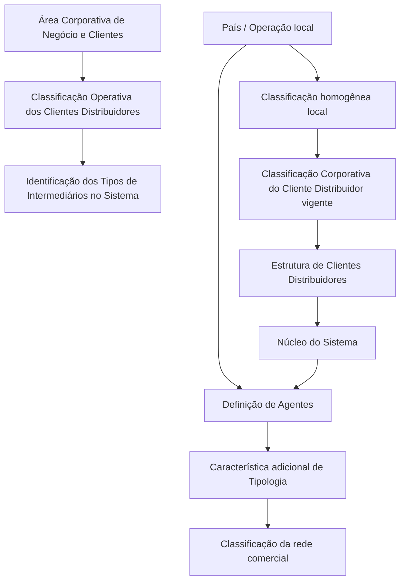

# Definição das Tipologias de Agentes para Clientes Distribuidores

## 1. Metadados do Documento
- **Arquivo de Origem:** Não identificado
- **Tipo de Documento:** Especificação Funcional
- **Domínio / Sistema:** Clientes Distribuidores, Tipologias de Agentes e rede comercial MAPFRE
- **Público-Alvo:** Negócio, equipes locais de operação, analistas funcionais e responsáveis pela classificação de clientes distribuidores
- **Data/Versão Identificada:** Não identificada

---

## 2. Resumo Executivo & Contexto de Negócio

O documento define o contexto funcional para a classificação de clientes distribuidores e para a configuração de Tipologias de Agentes no sistema. Um Cliente Distribuidor é uma pessoa ou entidade jurídica que distribui, ou pode distribuir, produtos seguradores, financeiros ou serviços para MAPFRE ou para entidades concorrentes.

Cada país deve implementar uma classificação homogênea de clientes distribuidores que atenda às necessidades locais de negócio e, simultaneamente, permaneça sincronizada com a Classificação Corporativa do Cliente Distribuidor vigente. A classificação deve respeitar as definições corporativas aprovadas na Estrutura de Clientes Distribuidores.

O núcleo do sistema permite complementar a definição corporativa capturando uma característica adicional na definição dos Agentes. Essa característica adicional permite obter o grau de granularidade necessário para classificar a rede comercial conforme as necessidades locais.

O documento apresenta exemplos de atributos que podem orientar a tipologia, como grau de vinculação, localização física, canal de origem, oferta de produtos, condição de subvencionamento e âmbito geográfico. Também estabelece que a identificação dos tipos de intermediários deve respeitar a Classificação Operativa dos Clientes Distribuidores definida pela Área Corporativa de Negócio e Clientes.

---

## 3. Arquitetura, Componentes & Tecnologias Envolvidas

O conteúdo descreve uma estrutura funcional de classificação, sem detalhar arquitetura tecnológica, APIs, protocolos, bancos de dados, URLs, ambientes ou contratos de integração.

Os componentes funcionais identificados são:

- **Núcleo do Sistema:** permite complementar a classificação definida na Estrutura de Clientes Distribuidores.
- **Estrutura de Clientes Distribuidores:** contém as definições corporativas aprovadas para agrupamento de mediadores por fontes de produção.
- **Definição de Agentes:** captura uma característica adicional para classificação local da rede comercial.
- **Classificação Corporativa do Cliente Distribuidor:** referência corporativa vigente com a qual as classificações locais devem permanecer sincronizadas.
- **Classificação Operativa dos Clientes Distribuidores:** referência para identificação dos tipos de intermediários no sistema.
- **Área Corporativa de Negócio e Clientes:** área citada como definidora da Classificação Operativa dos Clientes Distribuidores.
- **Países / operação local:** responsáveis por implementar classificações homogêneas adaptadas às necessidades locais.



**Nota de Análise:** O documento cita “CF Home Solutions APIs Documentation Zeus” no conteúdo bruto, mas não descreve a relação desse texto com a tipologia de agentes, nem fornece detalhes técnicos de APIs, serviços, métodos HTTP ou contratos JSON.

---

## 4. Regras de Negócio, Especificações Funcionais & Processos

### 4.1. Definição de Cliente Distribuidor

Um Cliente Distribuidor é uma pessoa ou entidade jurídica que:

- distribui produtos seguradores, financeiros ou serviços para MAPFRE; ou
- poderia distribuir produtos seguradores, financeiros ou serviços para MAPFRE; ou
- distribui ou poderia distribuir produtos para uma entidade concorrente.

### 4.2. Classificação homogênea por país

Cada país deve implementar uma classificação de clientes distribuidores que cumpra simultaneamente os seguintes critérios:

1. Deve ser homogênea.
2. Deve atender às necessidades de negócio próprias da operação local.
3. Deve estar sincronizada com a Classificação Corporativa do Cliente Distribuidor vigente.

### 4.3. Conformidade com definições corporativas

Ao agrupar mediadores por fontes de produção, devem ser consideradas características que cumpram as definições corporativas aprovadas. Essas definições corporativas são realizadas especificamente na Estrutura de Clientes Distribuidores.

### 4.4. Granularidade da classificação de Agentes

O núcleo do sistema permite complementar a definição proveniente da Estrutura de Clientes Distribuidores por meio da captura de uma característica adicional na definição dos Agentes.

Essa característica adicional pode determinar o nível de granularidade necessário para classificar a rede comercial de acordo com as necessidades locais.

### 4.5. Exemplos de critérios para tipologia de Agentes

O documento apresenta, como exemplos, os seguintes critérios para caracterização adicional da tipologia:

- Grau de vinculação.
- Localização física.
- Canal de origem, com os valores exemplificados:
  - Tradicional;
  - Digital;
  - Telefônico.
- Oferta de produtos.
- Subvencionado ou não.
- Âmbito:
  - Global;
  - Regional;
  - Local.

**Nota de Análise:** O documento apresenta esses elementos como exemplos de atributos possíveis. Não determina que todos sejam obrigatórios, nem descreve regras de validação, formatos, domínios fechados completos ou prioridade entre critérios.

### 4.6. Propriedade: Companhia

A propriedade **Companhia** informa ao sistema o código da companhia sobre a qual está sendo realizada a definição do Tipo de Agente.

### 4.7. Propriedade: Tipo de Intermediário

A propriedade **Tipo de Intermediário** informa o código do Tipo de Intermediário que está sendo capturado no sistema.

### 4.8. Propriedade: Denominação do Tipo de Intermediário

A propriedade **Denominação do Tipo de Intermediário** indica a denominação ou descrição da Tipologia do Agente, conforme o uso e a exploração local desejados.

O documento fornece os seguintes exemplos de classificações:

| Tipo de classificação exemplificada | Código exemplificado | Descrição exemplificada |
| :--- | :--- | :--- |
| Condição de subvencionamento | 1 | Subvencionado |
| Condição de subvencionamento | 2 | Não Subvencionado |
| Atendimento ao público | 1 | Oficina de Atención al Público |
| Atendimento ao público | 2 | Oficina si Atención al Público |
| Oferta de produtos | 1 | MultiProducto |
| Oferta de produtos | 2 | Especializado |
| Oferta de produtos | 3 | MonoProducto |

**Nota de Análise:** Os exemplos não estabelecem uma codificação corporativa definitiva para todas as operações locais. A codificação efetiva deve respeitar a Classificação Operativa dos Clientes Distribuidores.

### 4.9. Propriedade: Inabilitação

A propriedade **Inhabilitación** informa ao sistema que o Tipo de Intermediário está inabilitado para utilização nas operações de:

- captura de Agente; e/ou
- modificação de Agente.

### 4.10. Diretriz operacional obrigatória

A recomendação operacional expressa no documento determina que a identificação dos tipos de intermediários no sistema deve respeitar a Classificação Operativa dos Clientes Distribuidores definida pela Área Corporativa de Negócio e Clientes.

### 4.11. Documentos funcionais relacionados

O documento recomenda a leitura de diretrizes e documentos funcionais relacionados para evitar interpretações isoladas que possam conduzir a erro:

- Actividades de Terceros;
- Canales y Fuentes de Producción;
- Preguntas frecuentes.

---

## 5. Tabelas de Parâmetros, Ambientes e Estruturas de Dados

| Item / Parâmetro | Descrição / Função | Tipo / Valores / Formato | Ambiente / Observações |
| :--- | :--- | :--- | :--- |
| Cliente Distribuidor | Pessoa ou entidade jurídica que distribui ou poderia distribuir produtos seguradores, financeiros ou serviços para MAPFRE ou concorrentes. | Pessoa ou entidade jurídica. | Definição funcional. |
| Classificação de Clientes Distribuidores | Classificação implementada por cada país para atender à operação local. | Deve ser homogênea. | Deve permanecer sincronizada com a Classificação Corporativa vigente. |
| Estrutura de Clientes Distribuidores | Estrutura onde são realizadas definições corporativas aprovadas para agrupamento de mediadores. | Estrutura funcional corporativa. | Referência para definições de classificação. |
| Característica adicional do Agente | Informação complementar capturada na definição de Agentes para aumentar a granularidade da classificação. | Não especificado. | Pode refletir necessidades locais. |
| Grau de Vinculação | Exemplo de atributo que pode determinar a tipologia do Agente. | Não especificado. | Exemplo apresentado pelo documento. |
| Ubicación física | Exemplo de atributo para tipologia do Agente. | Não especificado. | Exemplo apresentado pelo documento. |
| Canal de Origen | Exemplo de atributo para tipologia do Agente. | Tradicional, Digital, Telefónico. | Os valores aparecem como exemplos. |
| Oferta de Productos | Exemplo de atributo para tipologia do Agente. | MultiProducto, Especializado, MonoProducto. | Valores exemplificados. |
| Subvencionado o no | Exemplo de atributo para tipologia do Agente. | Subvencionado, No Subvencionado. | Valores exemplificados. |
| Ámbito | Exemplo de atributo para tipologia do Agente. | Global, Regional, Local. | Valores exemplificados. |
| Compañía | Indica o código da companhia sobre a qual a definição do Tipo de Agente é realizada. | Código da companhia. | Formato não especificado. |
| Tipo de Intermediario | Indica o código do Tipo de Intermediário capturado no sistema. | Código do Tipo de Intermediário. | Formato não especificado. |
| Denominación del Tipo de Intermediario | Indica a denominação ou descrição da Tipologia do Agente. | Texto descritivo. | Definida segundo uso e exploração local. |
| Inhabilitación | Indica que o Tipo de Intermediário não pode ser utilizado na captura e/ou modificação do Agente. | Estado de inabilitação. | Valores e implementação não especificados. |
| Classificação Operativa dos Clientes Distribuidores | Referência obrigatória para identificação dos tipos de intermediários no sistema. | Classificação corporativa/operativa. | Definida pela Área Corporativa de Negócio e Clientes. |

**Nota de Análise:** O documento não informa servidores, ambientes técnicos, URLs, portas, caminhos de logs, variáveis de configuração, formatos de payload ou estruturas de banco de dados.

---

## 6. Bateria de Perguntas & Respostas para RAG (FAQ Sintético)

### P1: O que é considerado um Cliente Distribuidor neste contexto?
**R:** Um Cliente Distribuidor é uma pessoa ou entidade jurídica que distribui, ou poderia distribuir, produtos seguradores, financeiros ou serviços para MAPFRE ou para alguma entidade concorrente.

### P2: Qual é a obrigação de cada país em relação à classificação de clientes distribuidores?
**R:** Cada país deve implementar uma classificação homogênea de clientes distribuidores que responda às necessidades de negócio da operação local e permaneça sincronizada com a Classificação Corporativa do Cliente Distribuidor vigente.

### P3: Onde estão definidas as definições corporativas aprovadas para agrupamento de mediadores?
**R:** As definições corporativas aprovadas são realizadas especificamente na Estrutura de Clientes Distribuidores. Elas devem ser consideradas quando mediadores forem agrupados por fontes de produção.

### P4: Como o núcleo do sistema permite maior granularidade na classificação da rede comercial?
**R:** O núcleo do sistema permite complementar a definição da Estrutura de Clientes Distribuidores mediante a captura de uma característica adicional na definição dos Agentes. Essa característica adicional pode determinar o nível de granularidade necessário conforme as necessidades locais.

### P5: Quais exemplos de atributos podem ser utilizados para caracterizar uma Tipologia de Agente?
**R:** O documento exemplifica grau de vinculação, localização física, canal de origem, oferta de produtos, condição subvencionada ou não subvencionada e âmbito global, regional ou local. Esses atributos são apresentados como exemplos, sem obrigatoriedade ou formato detalhado.

### P6: Quais valores de Canal de Origem são citados no documento?
**R:** Os valores exemplificados para Canal de Origem são Tradicional, Digital e Telefónico.

### P7: Qual é a função da propriedade Companhia?
**R:** A propriedade Companhia informa ao sistema o código da companhia sobre a qual está sendo realizada a definição do Tipo de Agente.

### P8: Qual é a função da propriedade Tipo de Intermediário?
**R:** A propriedade Tipo de Intermediário indica o código do Tipo de Intermediário que está sendo capturado no sistema. O documento não especifica o formato técnico desse código.

### P9: O que representa a Denominação do Tipo de Intermediário?
**R:** A Denominação do Tipo de Intermediário representa a denominação ou descrição da Tipologia do Agente, definida de acordo com o uso e a exploração que se pretende realizar localmente.

### P10: Quais exemplos de denominação para Tipologia de Agente são apresentados?
**R:** O documento apresenta exemplos de tipologias por subvencionamento — Subvencionado e No Subvencionado —, por atendimento ao público — Oficina de Atención al Público e Oficina si Atención al Público — e por oferta de produtos — MultiProducto, Especializado e MonoProducto.

### P11: O que acontece quando um Tipo de Intermediário está inabilitado?
**R:** Quando um Tipo de Intermediário possui a propriedade Inhabilitación, ele fica inabilitado para ser utilizado nas operações de captura e/ou modificação do Agente.

### P12: Qual diretriz deve ser seguida para a identificação de tipos de intermediários no sistema?
**R:** A identificação dos tipos de intermediários deve respeitar a Classificação Operativa dos Clientes Distribuidores definida pela Área Corporativa de Negócio e Clientes.

### P13: Quais documentos relacionados devem ser lidos para evitar interpretação isolada da especificação?
**R:** O documento recomenda a leitura de Actividades de Terceros, Canales y Fuentes de Producción e Preguntas frecuentes para evitar que a interpretação isolada do conteúdo conduza a erro.

---

## 7. Glossário de Termos, Siglas & Conceitos-Chave

- **Agente:** Entidade cuja definição no sistema pode receber uma característica adicional para classificação da rede comercial.
- **Canal de Origen:** Atributo exemplificado para classificar o Agente conforme o canal de origem, como Tradicional, Digital ou Telefónico.
- **Classificação Corporativa do Cliente Distribuidor:** Classificação corporativa vigente com a qual a classificação local de cada país deve estar sincronizada.
- **Classificação Operativa dos Clientes Distribuidores:** Referência que deve ser respeitada na identificação dos tipos de intermediários no sistema.
- **Cliente Distribuidor:** Pessoa ou entidade jurídica que distribui ou poderia distribuir produtos seguradores, financeiros ou serviços para MAPFRE ou entidades concorrentes.
- **Compañía:** Propriedade que informa o código da companhia sobre a qual se realiza a definição do Tipo de Agente.
- **Denominación del Tipo de Intermediario:** Descrição ou denominação da Tipologia do Agente para uso e exploração local.
- **Estrutura de Clientes Distribuidores:** Estrutura onde são realizadas definições corporativas aprovadas para agrupamento de mediadores por fontes de produção.
- **Inhabilitación:** Propriedade que torna um Tipo de Intermediário indisponível para operações de captura e/ou modificação do Agente.
- **MAPFRE:** Organização citada como destinatária potencial da distribuição de produtos seguradores, financeiros ou serviços.
- **Mediadores:** Entidades agrupadas por fontes de produção conforme características e definições corporativas aprovadas.
- **Núcleo do Sistema:** Componente funcional que permite complementar a definição corporativa com uma característica adicional na definição dos Agentes.
- **Tipo de Intermediario:** Código do tipo de intermediário capturado no sistema.
- **Tipologia de Agente:** Classificação ou descrição adicional aplicada aos Agentes conforme necessidades locais.

---

## 8. Notas Críticas, Riscos & Limitações

- O documento não identifica nome de arquivo, data, versão, autor, proprietário funcional ou ciclo de aprovação.
- Não são informados detalhes de implementação técnica, como APIs, métodos HTTP, contratos JSON, bancos de dados, integrações, autenticação, URLs, servidores, portas ou ambientes.
- Os atributos de tipologia apresentados — como canal de origem, âmbito, oferta de produtos e subvencionamento — são exemplos; o documento não determina quais atributos são obrigatórios.
- Os códigos numéricos apresentados para tipos de agentes aparecem apenas como exemplos de denominações possíveis e não devem ser interpretados, isoladamente, como catálogo corporativo definitivo.
- A codificação e identificação dos tipos de intermediários dependem da Classificação Operativa dos Clientes Distribuidores definida pela Área Corporativa de Negócio e Clientes.
- A interpretação isolada do documento pode conduzir a erro; o próprio conteúdo recomenda consulta aos documentos Actividades de Terceros, Canales y Fuentes de Producción e Preguntas frecuentes.
- Não há detalhamento sobre o comportamento operacional da inabilitação, como tratamento de registros já existentes, mensagens de erro, permissões ou regras de reativação.

---

## 9. Conteúdo Bruto Estruturado (Referência Fiel)

```text
--- [PÁGINA 1 DE 3] ---

DEFINICIÓN de las Tipologías de Agentes
Contexto
Un Cliente Distribuidor es aquella persona o entidad jurídica que distribuye o podría distribuir
productos aseguradores, financieros o servicios para MAPFRE o para alguna entidad competidora.
Cada país debe implementar una clasificación de clientes distribuidores homogénea que de servicio
a las necesidades de negocio propias de la operación y que a su vez esté sincronizada con la
Clasificación Corporativa del Cliente Distribuidor vigente.
A la hora de agrupar a los mediadores por fuentes de producción, hay ciertas características que se
deben tener en cuenta y que deben cumplir con las definiciones corporativas aprobadas, definiciones
que se realizan específicamente en la Estructura de Clientes Distribuidores.
Propiedades Generales
Funcionalmente, el núcleo del Sistema cuenta con la posibilidad de complementar la definición
realizada en la Estructura de Clientes Distribuidores con la captura de una característica adicional
en la definición de los Agentes, característica que puede determinar el nivel de granularidad
necesario para clasificar la red comercial de acuerdo a las necesidades locales.
A modo de ejemplo, este Atributo podría determinar ...
Grado de Vinculación.
Ubicación física.
Canal de Origen: Tradicional, Digital, Telefónico.
 / 
 CF
Home Solutions APIs Documentation Zeus
EN


--- [PÁGINA 2 DE 3] ---

Oferta de Productos.
Subvencionado o no.
Ámbito: Global, Regional o Local.
étc.
Compañía
Esta propiedad le indica al sistema el código de la compañía sobre la que se está realizando la
definición del Tipo de Agente.
Tipo de Intermediario
Esta propiedad indica el código del Tipo de Intermediario que se está capturando en el sistema.
Denominación del Tipo de Intermediario
De acuerdo con el uso y explotación que se le vaya a dar localmente, este Atributo indicará la
denominación o descripción de la Tipología del Agente, como por ejemplo:
Tipo de Agente Descripción
1 Subvencionado
2 No Subvencionado
... ...
o bien:
Tipo de Agente Descripción
1 Oficina de Atención al Público
2 Oficina si Atención al Público
... ...
o bien:


--- [PÁGINA 3 DE 3] ---

Tipo de Agente Descripción
1 MultiProducto
2 Especializado
3 MonoProducto
... ...
Otras Propiedades
Inhabilitación
Esta propiedad le indica al Sistema que el Tipo de Intermediario está inhabilitada para poder ser
utilizada en las operaciones de captura y/o modificación del Agente.
Vínculos
Relación de Directrices y Documentos funcionales cuya lectura recomendada para evitar que la
interpretación aislada del presente documento pueda conducir a error.
Actividades de Terceros
Canales y Fuentes de Producción
Preguntas frecuentes
(1) ¿Existe alguna recomendación operativa que deba ser tomada en consideración localmente en la
codificación, uso y definición de la Tipología de Intermediarios en el Sistema?
Se debe respetar la Identificación de los tipos de Intermediarios en el sistema de acuerdo con la
Clasificación Operativa de los Clientes Distribuidores definida por el Área Corporativa de Negocio y
CLientes.
```
