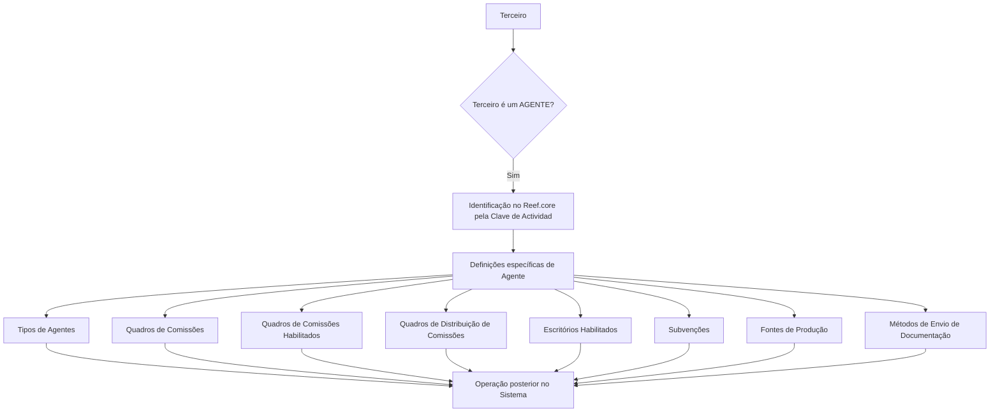

# Definição e Configuração de Agentes ou Intermediários no Reef.core

## 1. Metadados do Documento
- **Arquivo de Origem:** `Não identificado`
- **Tipo de Documento:** Manual Operacional
- **Domínio / Sistema:** Reef.core — gestão de Terceiros, Agentes ou Intermediários
- **Público-Alvo:** Operação, Negócio, Administradores de Configuração
- **Data/Versão Identificada:** Não identificada

---

## 2. Resumo Executivo & Contexto de Negócio

O documento descreve os elementos de configuração necessários para definir Agentes ou Intermediários no sistema Reef.core. A configuração é apresentada como uma etapa prévia para que esses terceiros possam operar posteriormente no sistema.

O Reef.core identifica Agentes por meio da **Clave de Actividad**. O texto também indica que existe uma ordem para realizar as definições, embora não detalhe a sequência completa nem apresente passos numerados.

O material diferencia definições específicas aplicáveis exclusivamente quando o Terceiro é um **AGENTE**. Essas definições incluem tipos de agentes, quadros de comissões, quadros de distribuição de comissões, escritórios habilitados, subvenções, fontes de produção e métodos de envio de documentação.

O documento ressalta que a obrigatoriedade dos elementos de configuração é indicada por asteriscos nos cartões da interface. Não há detalhamento de campos, valores permitidos, contratos técnicos, permissões, APIs ou regras de cálculo de comissões.

---

## 3. Arquitetura, Componentes & Tecnologias Envolvidas

O conteúdo apresenta o Reef.core como o sistema no qual são configurados Terceiros classificados como Agentes ou Intermediários. A estrutura descrita é funcional e configuracional: um Terceiro identificado como Agente recebe definições específicas que habilitam sua operação no sistema.

### Componentes e conceitos identificados

| Componente / Conceito | Papel descrito |
| :--- | :--- |
| Reef.core | Sistema que permite configurar Agentes ou Intermediários para operação posterior. |
| Terceiro | Entidade para a qual podem existir definições específicas. |
| Agente | Tipo de Terceiro com configurações próprias e específicas. |
| Intermediário | Entidade mencionada conjuntamente com Agente na configuração do Reef.core. |
| Clave de Actividad | Identificador utilizado pelo Reef.core para identificar Agentes. |
| Cartões / Tarjetas | Elementos da interface cujos asteriscos indicam obrigatoriedade de configuração. |
| Tipos de Agentes | Configuração dos tipos aplicáveis aos Agentes. |
| Quadros de Comissões | Configuração de quadros de comissões. |
| Quadros de Comissões Habilitados | Configuração dos quadros de comissões habilitados para cada Agente. |
| Quadros de Distribuição de Comissões | Configuração de quadros de distribuição de comissões habilitados para o Agente. |
| Escritórios Habilitados | Configuração dos escritórios da estrutura comercial nos quais o Agente pode contratar apólices. |
| Subvenções | Configuração das subvenções concedidas aos Agentes. |
| Fontes de Produção | Configuração das fontes de produção da estrutura de canais habilitadas para o Agente. |
| Métodos de Envio de Documentação | Configuração dos métodos de envio de documentação habilitados para o Agente. |



**Nota de Análise:** O documento não especifica arquitetura técnica, integrações, APIs, bancos de dados, protocolos, tecnologias de implementação ou contratos de dados do Reef.core.

---

## 4. Regras de Negócio, Especificações Funcionais & Processos

### 4.1 Configuração prévia à operação

1. O Reef.core disponibiliza elementos para configurar Agentes ou Intermediários.
2. A definição desses elementos deve ser realizada antes que os Agentes ou Intermediários possam operar posteriormente no sistema.
3. O documento afirma que há uma ordem na qual a definição deve ser realizada.
4. O documento não apresenta a ordem detalhada, etapas numeradas ou dependências explícitas entre todas as configurações.

### 4.2 Identificação de Agentes

1. O Reef.core identifica os Agentes pela **Clave de Actividad**.
2. O documento não informa o formato, a origem, a unicidade ou as regras de preenchimento da Clave de Actividad.
3. O documento não detalha se a Clave de Actividad também se aplica aos Intermediários.

### 4.3 Obrigatoriedade de configuração

1. Os asteriscos exibidos nos cartões indicam se a configuração de determinado elemento é obrigatória ou não.
2. A obrigatoriedade é relacionada à definição dos Agentes.
3. O documento não informa quais cartões possuem asterisco nem quais condições tornam um elemento obrigatório.

### 4.4 Definições específicas para Terceiros classificados como Agentes

As seguintes definições são empregadas exclusivamente quando o Terceiro é um AGENTE:

- Configuração dos tipos de Agentes.
- Configuração dos quadros de comissões.
- Configuração dos quadros de comissões habilitados para o Agente.
- Configuração dos quadros de distribuição de comissões habilitados para o Agente.
- Configuração dos escritórios da estrutura comercial nos quais o Agente pode contratar apólices.
- Configuração das subvenções concedidas aos Agentes.
- Configuração das fontes de produção da estrutura de canais habilitadas para o Agente.
- Configuração dos métodos de envio de documentação habilitados para o Agente.

### 4.5 Restrições e lacunas documentais

- O documento não detalha regras de cálculo para comissões.
- O documento não detalha regras de distribuição de comissões.
- O documento não apresenta critérios de habilitação de escritórios.
- O documento não especifica os tipos de subvenção disponíveis.
- O documento não lista fontes de produção nem canais.
- O documento não enumera métodos de envio de documentação.
- O documento não descreve fluxos de aprovação, perfis de acesso ou regras de auditoria.

---

## 5. Tabelas de Parâmetros, Ambientes e Estruturas de Dados

| Item / Parâmetro | Descrição / Função | Tipo / Valores / Formato | Ambiente / Observações |
| :--- | :--- | :--- | :--- |
| Clave de Actividad | Identifica Agentes no Reef.core. | Não informado. | Aplicável à identificação de Agentes. |
| Asteriscos nos cartões | Indicam se a configuração de um elemento é obrigatória. | Indicador visual de obrigatoriedade. | O documento não lista os cartões obrigatórios. |
| Tipos de Agentes | Permite configurar tipos de Agentes. | Não informado. | Definição específica de Terceiros classificados como AGENTES. |
| Quadros de Comissões | Permite configurar quadros de comissões. | Não informado. | O documento não apresenta fórmulas, faixas ou valores. |
| Quadros de Comissões Habilitados | Define os quadros de comissões habilitados para o Agente. | Não informado. | Associado ao Agente. |
| Quadros de Distribuição de Comissões | Define quadros de distribuição de comissões habilitados para o Agente. | Não informado. | Associado ao Agente. |
| Escritórios Habilitados | Define escritórios da estrutura comercial nos quais o Agente pode contratar apólices. | Não informado. | Associado ao Agente e à estrutura comercial. |
| Subvenções | Configura subvenções concedidas aos Agentes. | Não informado. | Associado ao Agente. |
| Fontes de Produção | Configura fontes de produção da estrutura de canais habilitadas para o Agente. | Não informado. | Associado ao Agente e à estrutura de canais. |
| Métodos de Envio de Documentação | Configura métodos de envio de documentação habilitados para o Agente. | Não informado. | Associado ao Agente. |
| Ambiente | Não identificado. | Não informado. | O documento não menciona desenvolvimento, homologação, produção ou URLs. |
| Logs | Não identificados. | Não informado. | O documento não fornece caminhos, níveis ou ferramentas de log. |

---

## 6. Bateria de Perguntas & Respostas para RAG (FAQ Sintético)

### P1: Qual é o objetivo da definição de Agentes ou Intermediários no Reef.core?
**R:** O objetivo é configurar os elementos necessários para que Agentes ou Intermediários possam operar posteriormente no sistema Reef.core. O documento informa que essas definições devem ser realizadas em uma ordem, mas não detalha a sequência.

### P2: Como o Reef.core identifica um Agente?
**R:** O Reef.core identifica os Agentes pela **Clave de Actividad**. O documento não informa o formato, a origem ou as regras de validação dessa chave.

### P3: O que significam os asteriscos nos cartões da configuração de Agentes?
**R:** Os asteriscos nos cartões indicam se a configuração de determinado elemento é obrigatória ou não para a definição dos Agentes.

### P4: Quais definições são específicas para um Terceiro classificado como AGENTE?
**R:** As definições específicas incluem Tipos de Agentes, Quadros de Comissões, Quadros de Comissões Habilitados, Quadros de Distribuição de Comissões, Escritórios Habilitados, Subvenções, Fontes de Produção e Métodos de Envio de Documentação.

### P5: O que são os Quadros de Comissões Habilitados para um Agente?
**R:** São configurações que determinam os quadros de comissões habilitados para o Agente. O documento não fornece detalhes sobre critérios de habilitação, valores, cálculo ou associação entre Agente e quadro.

### P6: Para que servem os Quadros de Distribuição de Comissões?
**R:** Os Quadros de Distribuição de Comissões permitem configurar os quadros de distribuição de comissões habilitados para o Agente. O documento não descreve regras de distribuição, participantes ou percentuais.

### P7: O que são Escritórios Habilitados no contexto de Agentes?
**R:** Escritórios Habilitados são os escritórios da estrutura comercial nos quais o Agente pode contratar apólices. O documento não lista os escritórios nem detalha critérios para habilitação.

### P8: O documento define como as subvenções dos Agentes são calculadas?
**R:** Não. O documento somente informa que existem configurações para subvenções concedidas aos Agentes. Não apresenta tipos de subvenção, critérios, valores, cálculos ou aprovações.

### P9: Qual é a finalidade das Fontes de Produção para um Agente?
**R:** As Fontes de Produção permitem configurar as fontes de produção da estrutura de canais que estão habilitadas para o Agente. O material não enumera fontes, canais ou regras de associação.

### P10: O que é configurado em Métodos de Envio de Documentação?
**R:** São configurados os métodos de envio de documentação que ficam habilitados para o Agente. O documento não identifica quais métodos existem nem descreve formatos, destinatários ou fluxos de entrega.

### P11: O documento apresenta APIs ou métodos HTTP para a configuração de Agentes?
**R:** Não. O documento não detalha APIs, métodos HTTP, endpoints, contratos JSON, mecanismos de integração ou tecnologias de implementação.

### P12: Há informação sobre ambientes, URLs, servidores ou logs do Reef.core?
**R:** Não. O conteúdo fornecido não apresenta URLs, ambientes de execução, servidores, portas, rotas de logs ou procedimentos de monitoramento.

---

## 7. Glossário de Termos, Siglas & Conceitos-Chave

- **Reef.core:** Sistema mencionado como responsável por identificar e permitir a configuração de Agentes ou Intermediários.
- **Agente:** Tipo de Terceiro que possui definições específicas de configuração no Reef.core.
- **Intermediário:** Entidade mencionada juntamente com Agente como objeto de configuração no Reef.core.
- **Terceiro:** Entidade que pode receber definições específicas quando classificada como AGENTE.
- **Clave de Actividad:** Chave utilizada pelo Reef.core para identificar Agentes.
- **Quadros de Comissões:** Elementos configuráveis relacionados a comissões.
- **Quadros de Comissões Habilitados:** Quadros de comissões que podem ser habilitados para um Agente.
- **Quadros de Distribuição de Comissões:** Quadros configuráveis para distribuição de comissões habilitados para um Agente.
- **Escritórios Habilitados:** Escritórios da estrutura comercial nos quais o Agente pode contratar apólices.
- **Subvenções:** Benefícios ou concessões configuráveis para Agentes; o documento não apresenta detalhamento adicional.
- **Fontes de Produção:** Fontes da estrutura de canais que podem ser habilitadas para o Agente.
- **Métodos de Envio de Documentação:** Métodos de envio de documentação habilitados para o Agente.
- **Apólices:** Itens que o Agente pode contratar em escritórios habilitados da estrutura comercial.

---

## 8. Notas Críticas, Riscos & Limitações

- **Detalhamento reduzido:** O conteúdo é composto por descrições breves de funcionalidades e não apresenta procedimentos completos de configuração.
- **Ordem não documentada:** O texto afirma que existe uma ordem de definição dos elementos, mas não informa qual é essa ordem.
- **Ausência de dados técnicos:** Não há informações sobre APIs, integrações, métodos HTTP, contratos JSON, bancos de dados, infraestrutura, autenticação ou autorização.
- **Ausência de critérios operacionais:** Não são informados critérios para habilitar escritórios, quadros de comissões, fontes de produção ou métodos de envio de documentação.
- **Ausência de regras financeiras:** Os quadros de comissões e de distribuição de comissões são mencionados, mas fórmulas, percentuais, faixas, exceções e mecanismos de cálculo não são detalhados.
- **Navegação residual:** Os termos “CF”, “Home Solutions APIs Documentation Zeus” e “EN” aparecem no conteúdo extraído, mas não recebem explicação funcional ou técnica no documento.
- **Nota de Análise:** O documento lista configurações associadas a Agentes, porém não detalha telas, campos, valores permitidos, validações, permissões ou procedimentos de manutenção.

---

## 9. Conteúdo Bruto Estruturado (Referência Fiel)

```text
--- [PÁGINA 1 DE 2] ---

DEFINICIÓN de los AGENTES
Se relacionan los elementos que permiten configurar en Reef.core a los Agentes o Intermediarios
(así como el orden en el que esta definición se debe realizar) para poder operar posteriormente con
ellos en el Sistema.
Reef.core identifica a los Agentes con la Clave de Actividad... 2.
Los Asteriscos de las Tarjetas indican si la configuración del elemento es o no obligatoria en
relación con la definición de los Agentes.
Definiciones ESPECÍFICAS, propias de los
Terceros AGENTES
En este Grupo se encuentran definiciones que se emplean
exclusivamente cuando el Tercero es un AGENTE.
TIPOS DE Agentes
Configuración de los tipos de Agentes.
CUADROS DE COMISIONES
Configuración de los cuadros de comisiones.
 /
 CF
Home Solutions APIs Documentation Zeus
EN


--- [PÁGINA 2 DE 2] ---

CUADROS DE COMISIONES HABILITADOS
Configuración de los cuadros de comisiones
habilitados para el agente.
CUADROS DE DISTRIBUCIÓN DE
COMISIONES
Configuración de los cuadros de distribución
de comisiones habilitados para el agente.
OFICINAS HABILITADAS
Configuración de las oficinas de la estructura
comercial en las que el agente puede
contratar pólizas.
SUBVENCIONES
Configuración de las subvenciones
concedidas a los agentes.
FUENTES DE PRODUCCIÓN
Configuración de las fuentes de producción
de la estructura de canales habilitadas para el
agente.
MÉTODOS DE ENVÍO de Documentación
Configuración de los métodos de envío de
Documentación habilitados para el agente.
```
