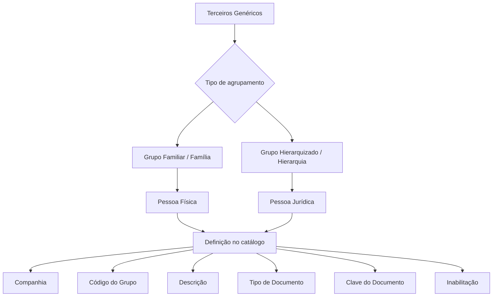

# Definição de Grupos Familiares ou Hierarquizados de Terceiros

## 1. Metadados do Documento
- **Arquivo de Origem:** Não identificado no conteúdo extraído
- **Tipo de Documento:** Especificação Técnica / Funcional
- **Domínio / Sistema:** Catálogo de Grupos Familiares e Grupos Hierarquizados de Terceiros
- **Público-Alvo:** Usuários funcionais e responsáveis pela definição do catálogo de Terceiros
- **Data/Versão Identificada:** Não identificada

---

## 2. Resumo Executivo & Contexto de Negócio

O documento define o uso de um catálogo de informação para organizar Terceiros Genéricos em Grupos Familiares, também chamados Famílias, ou em Grupos Hierarquizados, também chamados Hierarquias. O catálogo é inicialmente entregue às instalações sem conteúdo.

Os Grupos Familiares aplicam-se ao conceito de família para Pessoas Físicas, com base em laços de sangue entre Terceiros. Os Grupos Hierarquizados aplicam-se a Pessoas Jurídicas e representam uma estrutura baseada em critérios de subordinação ou interdependência.

O conceito de hierarquia pode considerar critérios como superioridade, inferioridade, anterioridade, posterioridade ou qualquer outra qualidade categórica de graduação que caracterize a relação entre Pessoas. A finalidade é identificar e organizar Terceiros de acordo com os grupos aos quais pertencem.

A definição de cada grupo inclui companhia, classificação como familiar ou hierárquica, código e descrição do grupo, identificação documental da pessoa que inicia a criação e condição de inabilitação da associação. O documento recomenda também a consulta ao material relacionado sobre Relações Entre Terceiros.

Não existe uma recomendação ou padronização operacional predefinida para a codificação dos Grupos Hierarquizados ou Famílias. A entidade MAPFRE deve analisar como utilizar transversalmente o catálogo nos processos corporativos para que a exploração posterior das informações gere valor.

---

## 3. Arquitetura, Componentes & Tecnologias Envolvidas

Os componentes funcionais explicitamente identificados são:

| Componente / Conceito | Descrição |
| :--- | :--- |
| Sistema | Mantém o catálogo para definição de Famílias e Hierarquias de Terceiros. |
| Catálogo de Grupos | Catálogo inicialmente vazio utilizado para registrar Grupos Familiares ou Hierarquizados. |
| Terceiros Genéricos | Entidades que devem ser identificadas e organizadas por família ou hierarquia. |
| Pessoa Física | Pode participar de Grupo Familiar baseado em laços de sangue. |
| Pessoa Jurídica | Pode participar de Grupo Hierarquizado. |
| Companhia | Contexto organizacional para o qual a Família ou Hierarquia é definida. |
| Relações Entre Terceiros | Documento funcional relacionado, recomendado para interpretação complementar. |



**Nota de Análise:** O conteúdo não detalha tecnologias, APIs, bancos de dados, métodos HTTP, contratos JSON, ambientes técnicos ou integrações entre sistemas. As expressões “Home Solutions APIs Documentation Zeus” e “EN” aparecem na extração, sem explicação adicional sobre seu papel no documento.

---

## 4. Regras de Negócio, Especificações Funcionais & Processos

1. O núcleo do Sistema permite agrupar Terceiros em Grupos Familiares ou Grupos Hierarquizados.
2. O catálogo de informação específico para esses agrupamentos é inicialmente entregue às instalações vazio de conteúdo.
3. Grupos Familiares representam Famílias para Pessoas Físicas.
4. A organização em Grupo Familiar deve considerar os laços de sangue que possam existir entre os Terceiros.
5. Grupos Hierarquizados representam Hierarquias para Pessoas Jurídicas.
6. Uma hierarquia é uma estrutura definida conforme um critério de subordinação entre Pessoas.
7. O critério de subordinação pode ser superioridade, inferioridade, anterioridade, posterioridade ou outra qualidade categórica de graduação que caracterize a interdependência.
8. A propriedade **Companhia** informa o código da companhia para a qual a definição da Família ou Hierarquia está sendo realizada.
9. A propriedade **Grupo Familiar ou Jerárquico** identifica, pelo respectivo valor, se os Terceiros são membros de uma Unidade Familiar ou de um Grupo Hierárquico determinado.
10. A propriedade **Código do Grupo** informa o código familiar ou hierárquico usado na definição.
11. A propriedade **Descrição** informa a descrição associada ao código familiar ou hierárquico.
12. O atributo **Tipo Documento** identifica o tipo de documento da Pessoa Física ou Jurídica que inicia a criação do Grupo Familiar ou Grupo Hierarquizado.
13. Os valores de **Tipo Documento** devem ter sido previamente configurados no Sistema.
14. A propriedade **Clave do Documento** contém a chave do documento que identifica a Pessoa criadora do Grupo Familiar ou Hierárquico.
15. A propriedade **Inabilitação** indica que a associação familiar ou hierárquica entre Terceiros está desativada.
16. A leitura de diretrizes e documentos funcionais relacionados é recomendada para evitar interpretação isolada e incorreta deste documento.
17. Não há preferência, recomendação ou padronização definida para a codificação de Famílias ou Grupos Hierarquizados.
18. A entidade MAPFRE deve decidir a melhor forma de utilizar transversalmente o catálogo nos processos corporativos, visando à geração de valor na exploração posterior das informações.

---

## 5. Tabelas de Parâmetros, Ambientes e Estruturas de Dados

| Item / Parâmetro | Descrição / Função | Tipo / Valores / Formato | Ambiente / Observações |
| :--- | :--- | :--- | :--- |
| Companhia | Indica o código da companhia sobre a qual é definida a Família ou Hierarquia. | Código de companhia | Não há ambiente técnico informado. |
| Grupo Familiar ou Jerárquico | Identifica se os Terceiros pertencem a uma Unidade Familiar ou a um Grupo Hierárquico determinado. | Grupo Familiar ou Grupo Hierárquico | O valor determina a classificação do agrupamento. |
| Código do Grupo | Indica o código familiar ou hierárquico da definição. | Código | Não há padrão de codificação definido. |
| Descrição | Informa a descrição do código familiar ou hierárquico. | Texto descritivo | Associada ao Código do Grupo. |
| Tipo Documento | Identifica o tipo de documento da Pessoa Física ou Jurídica que inicia a criação do grupo. | Valores previamente configurados no Sistema | O documento não enumera os tipos permitidos. |
| Clave do Documento | Contém a chave do documento que identifica a Pessoa criadora do Grupo Familiar ou Hierárquico. | Chave de documento | Formato não detalhado. |
| Inabilitação | Indica que a associação Familiar ou Hierárquica entre Terceiros está desativada. | Indicador de desativação | Valores específicos não detalhados. |
| Catálogo de Grupos | Repositório de informação para Famílias e Hierarquias. | Catálogo inicialmente vazio | Deve ser definido pela instalação/entidade. |
| Relações Entre Terceiros | Documento funcional relacionado. | Referência documental | Leitura recomendada. |

---

## 6. Bateria de Perguntas & Respostas para RAG (FAQ Sintético)

### P1: Qual é o objetivo do catálogo de Grupos Familiares ou Hierarquizados de Terceiros?
**R:** O objetivo é identificar e organizar Terceiros Genéricos conforme os laços de sangue existentes entre eles, no caso de Pessoas Físicas organizadas como Família, ou conforme os Grupos Hierarquizados aos quais pertencem, no caso de Pessoas Jurídicas.

### P2: Qual é a diferença entre Grupo Familiar e Grupo Hierarquizado?
**R:** Grupo Familiar representa o conceito de Família para Pessoas Físicas e considera laços de sangue entre Terceiros. Grupo Hierarquizado representa o conceito de Hierarquia para Pessoas Jurídicas e considera critérios de subordinação ou interdependência.

### P3: Quais critérios podem definir uma hierarquia entre Pessoas?
**R:** A hierarquia pode ser definida por superioridade, inferioridade, anterioridade, posterioridade ou qualquer qualidade categórica de graduação que caracterize a interdependência entre Pessoas.

### P4: O catálogo de Famílias e Hierarquias já possui conteúdo ao ser entregue às instalações?
**R:** Não. O documento informa que o catálogo específico de informação é inicialmente entregue às instalações vazio de conteúdo.

### P5: Qual é a função da propriedade Companhia?
**R:** A propriedade Companhia indica o código da companhia para a qual está sendo realizada a definição da Família ou da Hierarquia do Terceiro.

### P6: O que a propriedade Grupo Familiar ou Jerárquico identifica?
**R:** A propriedade Grupo Familiar ou Jerárquico identifica, por meio de seu valor, se os Terceiros estão relacionados como membros de uma Unidade Familiar ou como integrantes de um Grupo Hierárquico determinado.

### P7: Como o criador de um Grupo Familiar ou Hierárquico é identificado?
**R:** O criador é identificado pelo Tipo Documento, configurado previamente no Sistema, e pela Clave do Documento, que contém a chave documental da Pessoa Física ou Jurídica que inicia a criação do grupo.

### P8: O que significa Inabilitação no cadastro de grupos?
**R:** Inabilitação indica ao Sistema que a associação Familiar ou Hierárquica entre Terceiros está desativada.

### P9: Existe uma codificação obrigatória ou padronizada para Famílias e Grupos Hierarquizados?
**R:** Não. O documento declara que não existe preferência ou recomendação para estabelecer ou padronizar a codificação no Sistema.

### P10: Quem deve definir como utilizar o catálogo transversalmente nos processos corporativos?
**R:** A entidade MAPFRE deve analisar a melhor maneira de utilizar transversalmente o catálogo de informação nos processos da companhia, buscando gerar valor a partir de sua exploração posterior.

### P11: Há documentação complementar recomendada?
**R:** Sim. O documento recomenda a leitura de diretrizes e documentos funcionais relacionados, especialmente a referência “Relações Entre Terceiros”, para evitar interpretações incorretas decorrentes da leitura isolada.

---

## 7. Glossário de Termos, Siglas & Conceitos-Chave

- **Terceiros Genéricos:** Terceiros que devem ser identificados e organizados em Famílias ou Hierarquias.
- **Grupo Familiar / Família:** Agrupamento aplicável a Pessoas Físicas, fundamentado nos laços de sangue entre Terceiros.
- **Grupo Hierarquizado / Hierarquia:** Agrupamento aplicável a Pessoas Jurídicas, baseado em critérios de subordinação ou interdependência.
- **Pessoa Física:** Pessoa associada ao conceito de Grupo Familiar no documento.
- **Pessoa Jurídica:** Pessoa associada ao conceito de Grupo Hierarquizado no documento.
- **Companhia:** Código da companhia para a qual uma Família ou Hierarquia é definida.
- **Código do Grupo:** Código familiar ou hierárquico utilizado na definição do agrupamento.
- **Tipo Documento:** Atributo que identifica o tipo de documento da Pessoa que inicia a criação do grupo.
- **Clave do Documento:** Chave do documento que identifica a Pessoa criadora do Grupo Familiar ou Hierárquico.
- **Inabilitação:** Estado que indica desativação da associação Familiar ou Hierárquica entre Terceiros.
- **MAPFRE:** Entidade mencionada como responsável por analisar o uso transversal do catálogo. O documento não expande a sigla ou nome.
- **Zeus:** Termo presente no cabeçalho extraído como “Home Solutions APIs Documentation Zeus”; sem definição adicional.

---

## 8. Notas Críticas, Riscos & Limitações

- O catálogo é inicialmente entregue vazio; sua utilidade depende da definição e manutenção de conteúdo pela instalação ou entidade responsável.
- O documento não estabelece padrão de codificação para Famílias ou Grupos Hierarquizados, o que pode resultar em critérios divergentes caso a entidade MAPFRE não defina uma estratégia transversal.
- O documento não detalha valores permitidos, formato, obrigatoriedade ou regras de validação para Companhia, Código do Grupo, Tipo Documento, Clave do Documento ou Inabilitação.
- O documento não especifica como os laços de sangue são registrados, validados ou comprovados.
- O documento não detalha como critérios hierárquicos, como superioridade ou anterioridade, são configurados ou persistidos.
- A interpretação isolada pode conduzir a erro; a leitura de “Relações Entre Terceiros” é recomendada.
- Não há detalhamento técnico sobre APIs, métodos HTTP, contratos de dados, bancos de dados, integrações, URLs, ambientes, logs ou mecanismos de segurança.

---

## 9. Conteúdo Bruto Estruturado (Referência Fiel)

```text
--- [PÁGINA 1 DE 3] ---

DEFINIR los GRUPOS (FAMILIARES o
JERARQUIZADOS) de los TERCEROS
Contexto
Funcionalmente, el núcleo del Sistema cuenta con la posibilidad de agrupar a los Terceros en Grupos
Familiares(Familias) o Grupos Jerarquizados (Jerarquías) sobre un catálogo de información
específico que se entrega inicialmente a las instalaciones vacío de contenido.
¿Qué debemos considerar por jerarquía?
La jerarquía es una estructura que se establece en orden a su criterio de subordinación entre
Personas. Este criterio puede ser superioridad, inferioridad, anterioridad, posterioridad, etc; es decir,
cualquier cualidad categórica de gradación que caracterice su interdependencia.
Objetivo
Identificar y Organizar a los Terceros Genéricos de acuerdo con los lazos de sangre que puedan
tener entre ellos(concepto de Familia para Personas Físicas) o Grupos Jerarquizados (Concepto de
Jerarquía -para Personas Jurídicas) a los que pertenecen.
Propiedades
Otras Propiedades
Propiedades
Compañía
 /
 CF
Home Solutions APIs Documentation Zeus
EN


--- [PÁGINA 2 DE 3] ---

Esta propiedad le indica al sistema el código de la compañía sobre la que se está realizando la
definición de la Familia o de la Jerarquía del Tercero.
Grupo Familiar o Jerárquico
Esta propiedad identifica por su valor si los Terceros están relacionados por ser miembros
pertenecientes a una Unidad Familiar o por pertenecer a un Grupo Jerárquico determinado.
Código del Grupo
Esta propiedad le indica al sistema el código Familiar o Jerárquico sobre la que se está realizando la
definición de la Familia o de la Jerarquía del Tercero.
Descripción
Esta propiedad le indica al sistema la descripción del código Familiar o Jerárquico sobre la que se
está realizando la definición.
Tipo Documento
Este Atributo del identifica el tipo de documento con el que se identifica a la persona física o jurídica
que inicia con la creación del Grupo Familiar o Grupo Jerarquizado y de acuerdo con los valores que
hayan sido configurados en el sistema previamente.
Clave del Documento
Esta propiedad contiene la clave del documento que identifica a la Persona creadora del Grupo
Familiar o Jerárquico.
Otras Propiedades
Inhabilitación
Esta propiedad le indica al Sistema que la asociación Familiar o Jerárquica entre terceros se
encuentra desactivada.
Vínculos
Relación de Directrices y Documentos funcionales cuya lectura recomendada para evitar que la
interpretación aislada del presente documento pueda conducir a error.
Relaciones Entre Terceros
Identificar las Relaciones existentes entre Terceros


--- [PÁGINA 3 DE 3] ---

Preguntas frecuentes
(1) ¿Existe alguna recomendación operativa que deba ser tomada en consideración localmente en la
codificación, uso y definición del catálogo de Grupos Jerarquizados o Familias de los Terceros?
No existe una preferencia ni recomendación para establecer o estandarizar en el sistema su
codificación, si bien la entidad MAPFRE debe analizar la mejor manera de emplear transversalmente
en los procesos de la compañía este catálogo de información para que su posterior explotación
aporte valor a la entidad.
```
