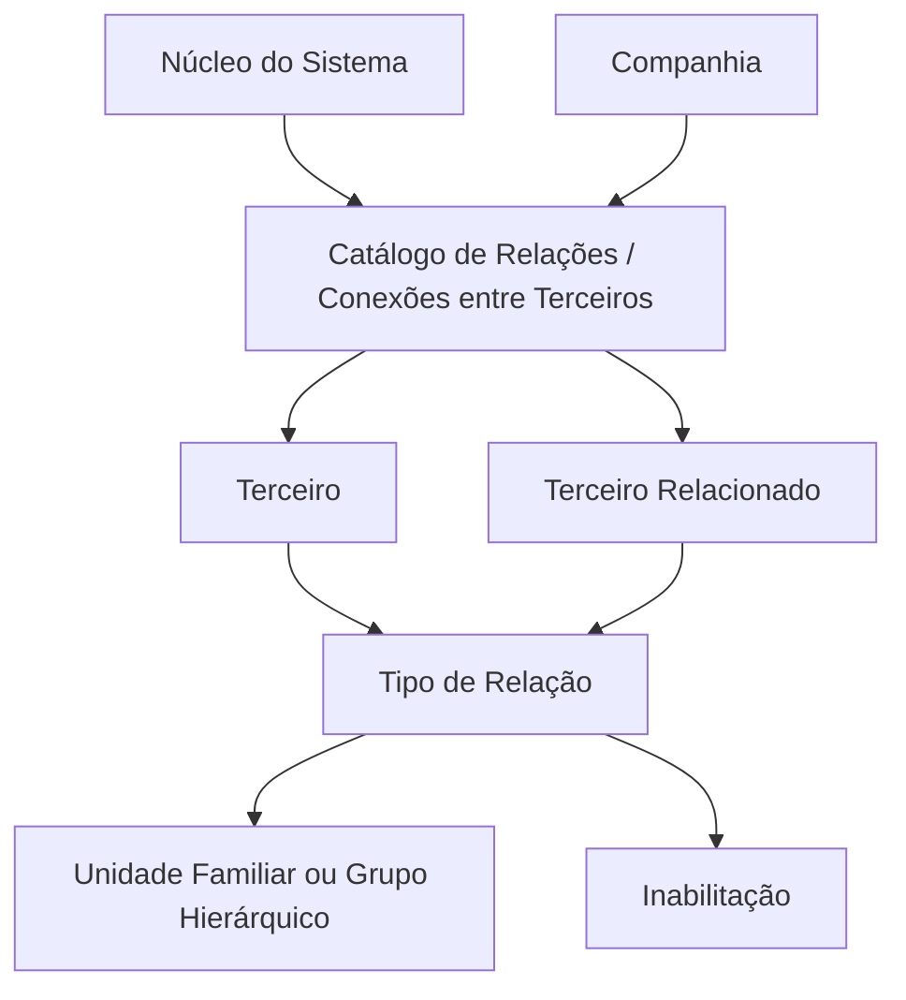

# Configuração de Relações Existentes entre Terceiros

## 1. Metadados do Documento
- **Arquivo de Origem:** Não identificado no conteúdo fornecido
- **Tipo de Documento:** Especificação Funcional
- **Domínio / Sistema:** Sistema MAPFRE — catálogo de Relações / Conexões entre Terceiros
- **Público-Alvo:** Negócio, Analistas Funcionais, Desenvolvedores e Operação
- **Data/Versão Identificada:** Não identificada

---

## 2. Resumo Executivo & Contexto de Negócio

O documento descreve a configuração de relações existentes entre terceiros no núcleo do Sistema. O Sistema permite identificar, em um catálogo de informações, possíveis relações entre pessoas físicas e jurídicas previamente capturadas.

As relações entre terceiros podem existir por parentesco, nexos econômicos, vínculos emocionais, conexões acionariais ou outros motivos não detalhados. O objetivo funcional é identificar e organizar as possíveis relações que a entidade deseja estabelecer localmente entre atividades e terceiros.

A configuração de uma relação associa informações de companhia, atividade, documento e identificação de dois terceiros: o terceiro de origem e o terceiro relacionado. A relação também registra o tipo de vínculo, a eventual associação a uma unidade familiar ou grupo hierárquico e um código correspondente.

O documento indica que não existe uma recomendação operacional ou padronização obrigatória para a codificação do catálogo de relações. A entidade MAPFRE deve analisar a melhor forma de explorar e utilizar esse catálogo nos processos da companhia.

---

## 3. Arquitetura, Componentes & Tecnologias Envolvidas

O conteúdo não descreve uma arquitetura técnica de software, APIs, bancos de dados, serviços, protocolos, contratos JSON, métodos HTTP ou ambientes de execução. O documento apresenta exclusivamente um modelo funcional de cadastro e identificação de relações entre terceiros.

Os componentes funcionais identificados são:

- **Sistema:** núcleo responsável por identificar relações entre pessoas físicas e jurídicas capturadas.
- **Catálogo de Relações / Conexões entre Terceiros:** catálogo que concentra os possíveis tipos de relações.
- **Terceiro:** pessoa física e/ou jurídica identificada por atividade, tipo de documento e chave de documento.
- **Terceiro Relacionado:** pessoa física e/ou jurídica vinculada ao terceiro de origem.
- **Tipo de Relação:** classificação da relação conforme os valores disponíveis no catálogo.
- **Unidade Familiar / Grupo Hierárquico:** agrupamento opcional determinado pelo valor da propriedade correspondente.
- **Inabilitação:** propriedade que desativa um tipo de relação, vínculo ou laço familiar.



> **Nota de Análise:** O documento menciona “Home Solutions APIs Documentation Zeus” na extração bruta, mas não apresenta qualquer detalhe funcional, técnico ou relacional que permita caracterizar esse item como componente da solução.

---

## 4. Regras de Negócio, Especificações Funcionais & Processos

### 4.1 Objetivo funcional

O Sistema deve permitir que a entidade identifique e organize localmente as possíveis relações entre atividades e terceiros. As relações são definidas no catálogo de informações disponível no núcleo do Sistema.

### 4.2 Escopo das relações entre terceiros

As relações podem ser estabelecidas entre pessoas físicas e jurídicas capturadas no Sistema. O documento cita os seguintes motivos possíveis:

- Parentesco.
- Nexos econômicos.
- Vínculos emocionais.
- Conexões acionariais.
- Outros motivos não especificados.

### 4.3 Identificação do terceiro de origem

A identificação do terceiro de origem depende dos seguintes elementos:

1. Código da companhia em que a definição da relação está sendo realizada.
2. Código da atividade do terceiro.
3. Tipo de documento utilizado para identificar uma das pessoas físicas e/ou jurídicas relacionadas.
4. Chave do documento que identifica o terceiro no Sistema, de acordo com o código de atividade ao qual o terceiro pertence.

### 4.4 Identificação do terceiro relacionado

A identificação do terceiro relacionado depende dos seguintes elementos:

1. Código da atividade do terceiro relacionado.
2. Tipo de documento utilizado para identificar o terceiro com o qual a relação é estabelecida.
3. Chave do documento que identifica o terceiro relacionado, conforme o código de atividade ao qual pertence.
4. Nome do terceiro relacionado.

### 4.5 Classificação e agrupamento da relação

O tipo de relação deve ser identificado de acordo com um dos valores existentes no catálogo de possíveis tipos de relação.

A propriedade **Grupo Familiar ou Jerárquico** determina, por seu valor, se os terceiros estão relacionados por:

- Pertencerem à mesma unidade familiar; ou
- Pertencerem a determinado grupo hierárquico.

A propriedade **Código** informa o código da unidade familiar ou do grupo hierárquico sobre o qual a relação está sendo estabelecida.

### 4.6 Inabilitação de vínculos

A propriedade **Inhabilitación** indica ao Sistema que determinado tipo de relação, vínculo ou laço familiar está desativado.

### 4.7 Orientação operacional sobre codificação

Não existe preferência ou recomendação para estabelecer ou padronizar localmente a codificação do catálogo de Relações / Conexões entre Terceiros. A entidade MAPFRE deve avaliar a melhor maneira de explorar e utilizar esse catálogo nos processos da companhia.

### 4.8 Dependências documentais

O documento recomenda a leitura de diretrizes e documentos funcionais relacionados para evitar interpretações isoladas e potencialmente incorretas. É citada a referência:

- **Grupos Familiares / Grupos Jerarquizados**

> **Nota de Análise:** O documento não detalha regras de validação, obrigatoriedade de campos, persistência de dados, permissões, fluxos de aprovação, integração entre sistemas ou comportamento do Sistema quando uma relação é inabilitada.

---

## 5. Tabelas de Parâmetros, Ambientes e Estruturas de Dados

| Item / Parâmetro | Descrição / Função | Tipo / Valores / Formato | Ambiente / Observações |
| :--- | :--- | :--- | :--- |
| Companhia | Indica o código da companhia sobre a qual a definição da relação de terceiros está sendo realizada. | Código de companhia; formato não detalhado. | Aplicável à definição da relação. |
| Código de Atividade do Terceiro | Indica o código da atividade do terceiro. | Código de atividade; formato não detalhado. | Identifica a atividade do terceiro de origem. |
| Tipo Documento | Identifica o tipo de documento usado para identificar uma das duas pessoas físicas e/ou jurídicas relacionadas. | Tipo de documento; valores não detalhados. | Aplicável ao terceiro de origem. |
| Chave do Documento | Contém a chave do documento que identifica o terceiro no Sistema, conforme o código de atividade ao qual pertence. | Chave de documento; formato não detalhado. | Aplicável ao terceiro de origem. |
| Código de Atividade do Terceiro Relacionado | Indica o código da atividade do terceiro relacionado. | Código de atividade; formato não detalhado. | Identifica a atividade do terceiro relacionado. |
| Tipo Documento do Terceiro Relacionado | Identifica o tipo de documento usado para identificar o terceiro com o qual a relação é estabelecida. | Tipo de documento; valores não detalhados. | Aplicável ao terceiro relacionado. |
| Chave do Documento do Terceiro Relacionado | Contém a chave do documento que identifica o terceiro relacionado conforme o código de atividade ao qual pertence. | Chave de documento; formato não detalhado. | Aplicável ao terceiro relacionado. |
| Nome do Terceiro Relacionado | Identifica o nome do terceiro relacionado. | Nome; formato não detalhado. | Aplicável ao terceiro relacionado. |
| Tipo de Relação | Identifica o tipo de relação conforme algum valor do catálogo de possíveis valores. | Valor de catálogo; lista de valores não detalhada. | Pode representar parentesco, nexo econômico, vínculo emocional ou conexão acionarial, entre outros. |
| Grupo Familiar ou Hierárquico | Determina se os terceiros estão relacionados por pertencerem a uma unidade familiar ou a um grupo hierárquico. | Valor não detalhado. | Associado à natureza do agrupamento da relação. |
| Código | Indica o código da unidade familiar ou do grupo hierárquico sobre o qual a relação está sendo estabelecida. | Código; formato não detalhado. | Aplicável quando há unidade familiar ou grupo hierárquico. |
| Inabilitação | Indica ao Sistema que o tipo de relação, vínculo ou laço familiar está desativado. | Valor de inabilitação; formato e valores não detalhados. | O documento não define o comportamento posterior da inabilitação. |
| Catálogo de Relações / Conexões entre Terceiros | Repositório funcional de possíveis relações entre terceiros. | Catálogo; valores não detalhados. | A codificação não possui recomendação ou padronização definida no documento. |
| Grupos Familiares / Grupos Jerarquizados | Documento funcional relacionado cuja leitura é recomendada. | Referência documental. | Deve ser consultado para evitar interpretação isolada. |

---

## 6. Bateria de Perguntas & Respostas para RAG (FAQ Sintético)

### P1: Qual é o objetivo da configuração de relações existentes entre terceiros?
**R:** O objetivo é identificar e organizar as possíveis relações que a entidade deseja estabelecer localmente entre atividades e terceiros. O núcleo do Sistema disponibiliza um catálogo de informações para identificar relações entre pessoas físicas e jurídicas capturadas.

### P2: Quais motivos de relacionamento entre terceiros são citados no documento?
**R:** O documento cita relações por parentesco, nexos econômicos, vínculos emocionais e conexões acionariais. Também admite a existência de outros motivos, mas não os detalha.

### P3: Como o terceiro de origem é identificado na definição de uma relação?
**R:** O terceiro de origem é identificado pelo código de atividade do terceiro, pelo tipo de documento e pela chave do documento. A chave do documento identifica o terceiro no Sistema de acordo com o código de atividade ao qual o terceiro pertence.

### P4: Quais dados identificam o terceiro relacionado?
**R:** O terceiro relacionado é identificado pelo código de atividade do terceiro relacionado, pelo tipo de documento do terceiro relacionado, pela chave do documento do terceiro relacionado e pelo nome do terceiro relacionado.

### P5: Qual é a função do campo Tipo de Relação?
**R:** O campo Tipo de Relação identifica a classificação do relacionamento entre os terceiros de acordo com um dos valores disponíveis no catálogo que contém os possíveis tipos de relação.

### P6: O que determina a propriedade Grupo Familiar ou Hierárquico?
**R:** A propriedade Grupo Familiar ou Hierárquico determina, por seu valor, se os terceiros estão relacionados por pertencerem a uma unidade familiar ou por pertencerem a um grupo hierárquico determinado.

### P7: Para que serve o campo Código na relação entre terceiros?
**R:** O campo Código informa ao Sistema o código da unidade familiar ou do grupo hierárquico sobre o qual a relação entre terceiros está sendo estabelecida.

### P8: O que ocorre quando uma relação está marcada como Inhabilitación?
**R:** A propriedade Inhabilitación informa ao Sistema que o tipo de relação, vínculo ou laço familiar está desativado. O documento não detalha os efeitos operacionais, funcionais ou técnicos adicionais dessa desativação.

### P9: Existe uma recomendação para padronizar a codificação do catálogo de relações?
**R:** Não. O documento afirma que não existe preferência nem recomendação para estabelecer ou padronizar a codificação no Sistema. A entidade MAPFRE deve analisar a melhor forma de explorar e utilizar o catálogo nos processos da companhia.

### P10: Quais tipos de pessoas podem participar de uma relação cadastrada no Sistema?
**R:** As relações podem ser estabelecidas entre pessoas físicas e jurídicas capturadas no Sistema.

### P11: O documento define os valores permitidos para Tipo de Relação?
**R:** Não. O documento informa que o Tipo de Relação deve corresponder a algum valor do catálogo de possíveis valores, mas não apresenta a lista desse catálogo.

### P12: Quais documentos relacionados devem ser consultados para interpretar corretamente a configuração de relações?
**R:** O documento recomenda a leitura de diretrizes e documentos funcionais relacionados, citando especificamente “Grupos Familiares / Grupos Jerarquizados”, para evitar que uma interpretação isolada do documento conduza a erro.

---

## 7. Glossário de Termos, Siglas & Conceitos-Chave

- **Catálogo de Relações / Conexões entre Terceiros:** Catálogo de informações usado pelo Sistema para identificar possíveis relações entre terceiros.
- **Chave do Documento:** Chave que identifica um terceiro ou terceiro relacionado no Sistema de acordo com o código de atividade correspondente.
- **Código de Atividade:** Código que identifica a atividade atribuída a um terceiro ou terceiro relacionado.
- **Companhia:** Código da companhia na qual a definição da relação de terceiros está sendo realizada.
- **Conexões Acionariais:** Relações fundamentadas em conexões de natureza acionarial; o documento não apresenta detalhamento adicional.
- **Grupo Hierárquico:** Agrupamento determinado ao qual terceiros podem pertencer, conforme a propriedade Grupo Familiar ou Hierárquico.
- **Inhabilitación:** Propriedade que indica que determinado tipo de relação, vínculo ou laço familiar está desativado.
- **MAPFRE:** Entidade mencionada como responsável por analisar a melhor forma de explorar e utilizar o catálogo nos processos da companhia.
- **Nexos Econômicos:** Relações fundamentadas em vínculos econômicos; o documento não apresenta detalhamento adicional.
- **Terceiro:** Pessoa física e/ou jurídica capturada no Sistema e identificada por atividade, documento e chave de documento.
- **Terceiro Relacionado:** Pessoa física e/ou jurídica com a qual o terceiro estabelece uma relação.
- **Tipo de Documento:** Atributo que identifica o tipo de documento utilizado para identificar um terceiro.
- **Tipo de Relação:** Classificação da relação segundo os valores disponíveis no catálogo.
- **Unidade Familiar:** Agrupamento familiar ao qual terceiros podem pertencer quando a relação for caracterizada dessa forma.
- **Vínculo / Laço Familiar:** Relação que pode ser desativada por meio da propriedade Inhabilitación.

---

## 8. Notas Críticas, Riscos & Limitações

- O documento não identifica o nome do arquivo de origem, data, versão, autor ou responsável pela documentação.
- O documento não apresenta uma lista de valores do catálogo de Tipo de Relação.
- Não há detalhamento de formatos, domínios, tamanhos, obrigatoriedade ou validações para os campos descritos.
- Não são descritos fluxos de criação, alteração, exclusão, aprovação ou consulta de relações entre terceiros.
- O comportamento técnico e operacional decorrente da propriedade Inhabilitación não é especificado.
- Não há informações sobre integrações, APIs, métodos HTTP, contratos de mensagens, persistência, banco de dados, logs, permissões ou ambientes.
- A ausência de recomendação para padronização de codificação pode resultar em decisões locais divergentes, caso a entidade MAPFRE não estabeleça governança complementar.
- O documento recomenda consultar diretrizes e documentos funcionais relacionados, especialmente “Grupos Familiares / Grupos Jerarquizados”, para evitar interpretações isoladas.
- **Nota de Análise:** O documento lista a configuração de relações entre terceiros, mas não detalha os valores concretos de tipos de relação, os métodos técnicos de manutenção do catálogo ou os contratos de integração expostos pelo Sistema.

---

## 9. Conteúdo Bruto Estruturado (Referência Fiel)

```text
--- [PÁGINA 1 DE 3] ---

CONFIGURAR las RELACIONES Existentes
entre TERCEROS
Contexto
Funcionalmente, el núcleo del Sistema cuenta con la posibilidad de identificar en un catálogo de
información las posibles relaciones existentes entre las Personas Físicas y Jurídicas capturadas en el
Sistema.
Estas relaciones pueden establecerse por motivos de parentesco, por nexos económicos, por
vínculos emocionales, por conexiones accionariales, etcétera,...
Objetivo
Identificar y Organizar las posibles Relaciones que la entidad localmente desea establecer entre
Actividades y Terceros.
Propiedades Generales
Otras Propiedades
Propiedades
Compañía
Esta propiedad le indica al sistema el código de la compañía sobre la que se está realizando la
definición de la Relación de los Terceros.
 / 
 CF
Home Solutions APIs Documentation Zeus
EN


--- [PÁGINA 2 DE 3] ---

Código de Actividad del Tercero
Esta propiedad indica en el sistema el código de la Actividad del Tercero.
Tipo Documento
Este Atributo del identifica el tipo de documento con el que se va a identificar a una de las dos
personas físicas y/o jurídicas relacionadas.
Clave del Documento
Esta propiedad contiene la clave del documento que identifica al Tercero en el Sistema de acuerdo
con el Código de Actividad al que pertenece.
Código de Actividad del Tercero Relacionado
Esta propiedad indica en el sistema el código de la Actividad del Tercero Relacionado.
Tipo Documento del Tercero Relacionado
Este Atributo del identifica el tipo de documento con el que se va a identificar al Tercero con el que se
establece la relación.
Clave del Documento del Tercero Relacionado
Esta propiedad contiene la clave del documento que identifica al Tercero relacionado de acuerdo con
el Código de Actividad al que pertenece.
Nombre del Tercero Relacionado
Esta propiedad identifica el nombre del Tercero relacionado.
Tipo de Relación
Este Atributo identifica el Tipo de Relación de acuerdo con alguno de los valores del catálogo en el
que se identifican sus posibles valores.
Grupo Familiar o Jerárquico
Esta propiedad determina por su valor si los Terceros están relacionados por ser miembros
pertenecientes a una Unidad Familiar o por pertenecer a un Grupo Jerárquico determinado.
Código
Esta propiedad le indica al sistema el código de la Unidad Familiar o del Grupo Jerárquico sobre la
que se está estableciendo la relación.


--- [PÁGINA 3 DE 3] ---

Otras Propiedades
Inhabilitación
Esta propiedad le indica al Sistema que el Tipo de Relación, vínculo o Lazo Familiar se encuentra
desactivado.
Vínculos
Relación de Directrices y Documentos funcionales cuya lectura recomendada para evitar que la
interpretación aislada del presente documento pueda conducir a error.
Grupos Familiares / Grupos Jerarquizados
Preguntas frecuentes
(1) ¿Existe alguna recomendación operativa que deba ser tomada en consideración localmente en la
codificación, uso y definición del catálogo de Relaciones / Conexiones entre Terceros?
No existe una preferencia ni recomendación para establecer o estandarizar en el sistema su
codificación, si bien la entidad MAPFRE debe analizar la mejor manera de explotar y utilizar en los
procesos de la compañía este catálogo de información.
```
