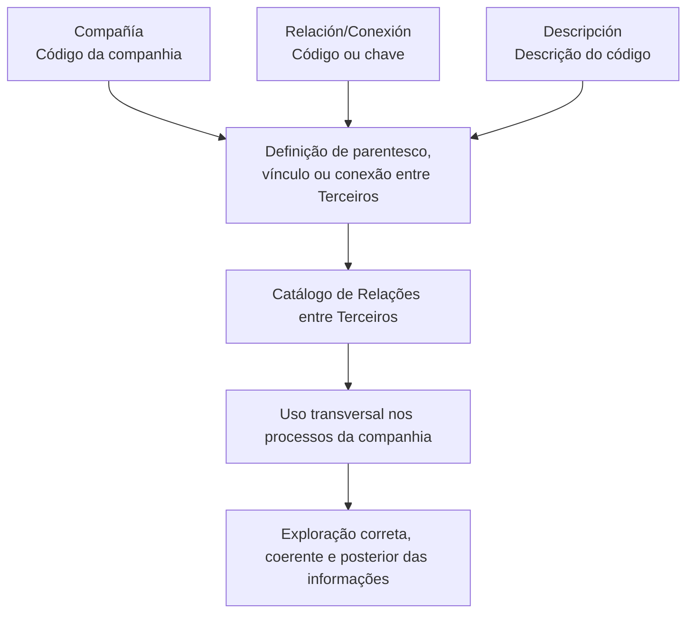

# Definição das Possíveis Relações e Conexões entre Terceiros

## 1. Metadados do Documento
- **Arquivo de Origem:** Não identificado no conteúdo fornecido
- **Tipo de Documento:** Documento funcional de definição de catálogo
- **Domínio / Sistema:** Relações, vínculos e conexões entre Terceiros; entidade MAPFRE
- **Público-Alvo:** Negócio, analistas funcionais e equipes responsáveis pela parametrização e utilização do catálogo
- **Data/Versão Identificada:** Não identificada

---

## 2. Resumo Executivo & Contexto de Negócio

O documento define o objetivo de identificar e organizar possíveis conexões ou relações entre Terceiros. O escopo apresentado concentra-se na definição de parentesco, vínculo ou conexão aplicável a Terceiros dentro de uma companhia.

A definição é composta pelas propriedades **Compañía**, **Relación/Conexión** e **Descripción**. A propriedade Compañía informa ao sistema o código da companhia sobre a qual a definição é realizada. A propriedade Relación/Conexión identifica o código ou chave da relação, enquanto Descripción registra a descrição do código de parentesco, vínculo ou conexão definido.

O documento recomenda a leitura de diretrizes e documentos funcionais relacionados, especialmente **Grupos Familiares** e **Grupos Jerarquizados**, para impedir que a interpretação isolada do conteúdo gere conclusões incorretas.

Não existe recomendação operacional para padronizar a codificação do catálogo de Relações entre Terceiros. Entretanto, cada entidade MAPFRE deve analisar a forma mais adequada de utilizar o catálogo transversalmente nos processos da companhia, visando exploração posterior correta e coerente das informações.

---

## 3. Arquitetura, Componentes & Tecnologias Envolvidas

O conteúdo não descreve arquitetura de software, integrações técnicas, tecnologias, APIs, métodos HTTP, contratos JSON, servidores ou ambientes. O material apresenta uma estrutura funcional de catálogo para relações e conexões entre Terceiros.



**Nota de Análise:** o documento menciona os termos “Home Solutions APIs Documentation Zeus”, “Vínculos” e “CF”, mas não fornece detalhamento funcional, técnico ou arquitetural suficiente para estabelecer uma relação confirmada entre esses termos e o catálogo de Relações entre Terceiros.

---

## 4. Regras de Negócio, Especificações Funcionais & Processos

1. O catálogo tem como objetivo identificar e organizar as possíveis conexões ou relações existentes entre Terceiros.
2. A definição de cada item do catálogo está relacionada a uma companhia específica, identificada pelo respectivo código de companhia.
3. Cada relação ou conexão deve possuir um código ou chave identificadora.
4. Cada código de parentesco, vínculo ou conexão deve possuir uma descrição associada.
5. A definição cobre parentesco, vínculo ou conexão entre Terceiros.
6. A leitura de documentos funcionais relacionados, incluindo **Grupos Familiares** e **Grupos Jerarquizados**, é recomendada para evitar interpretações isoladas e potencialmente incorretas.
7. Não há recomendação operacional para estabelecer ou padronizar a codificação do catálogo no sistema.
8. A entidade MAPFRE deve analisar como utilizar transversalmente o catálogo nos processos da companhia.
9. O uso do catálogo deve buscar garantir exploração posterior correta e coerente das informações.

---

## 5. Tabelas de Parâmetros, Ambientes e Estruturas de Dados

| Item / Parâmetro | Descrição / Função | Tipo / Valores / Formato | Ambiente / Observações |
| :--- | :--- | :--- | :--- |
| Compañía | Informa ao sistema o código da companhia sobre a qual é realizada a definição de parentesco, vínculo ou conexão entre Terceiros. | Código da companhia | O formato do código não é detalhado. |
| Relación/Conexión | Identifica o código ou a chave da relação ou conexão. | Código ou chave | Não há regra de codificação ou padronização definida no documento. |
| Descripción | Informa a descrição do código de parentesco, vínculo ou conexão para o qual a definição está sendo realizada. | Descrição textual | O tamanho, idioma e obrigatoriedade não são detalhados. |
| Catálogo de Relações entre Terceiros | Catálogo de informações utilizado para registrar relações, vínculos e conexões entre Terceiros. | Catálogo funcional | Deve ser analisado pela entidade MAPFRE para utilização transversal nos processos da companhia. |
| Grupos Familiares | Documento funcional recomendado para leitura complementar. | Referência documental | O conteúdo não apresenta detalhes adicionais. |
| Grupos Jerarquizados | Documento funcional recomendado para leitura complementar. | Referência documental | O conteúdo não apresenta detalhes adicionais. |

---

## 6. Bateria de Perguntas & Respostas para RAG (FAQ Sintético)

### P1: Qual é o objetivo do catálogo de Relações entre Terceiros?
**R:** O objetivo é identificar e organizar as possíveis conexões ou relações que possam ocorrer entre Terceiros.

### P2: Qual informação a propriedade Compañía fornece ao sistema?
**R:** A propriedade Compañía informa o código da companhia sobre a qual está sendo realizada a definição de parentesco, vínculo ou conexão entre Terceiros.

### P3: O que é identificado pelo atributo Relación/Conexión?
**R:** O atributo Relación/Conexión identifica o código ou a chave da relação ou conexão registrada no catálogo.

### P4: Qual é a finalidade da propriedade Descripción?
**R:** A propriedade Descripción informa a descrição do código de parentesco, vínculo ou conexão para o qual está sendo realizada a definição.

### P5: O documento estabelece uma codificação padronizada para o catálogo de Relações entre Terceiros?
**R:** Não. O documento afirma que não existe recomendação para estabelecer ou padronizar no sistema a codificação do catálogo de Relações entre Terceiros.

### P6: Quem deve decidir como utilizar o catálogo de Relações entre Terceiros?
**R:** A entidade MAPFRE deve analisar a melhor forma de utilizar transversalmente o catálogo de informações nos processos da companhia.

### P7: Qual resultado é esperado do uso transversal do catálogo?
**R:** Espera-se permitir a correta, coerente e posterior exploração das informações do catálogo nos processos da companhia.

### P8: Quais documentos funcionais devem ser lidos para evitar interpretação isolada do documento?
**R:** O documento recomenda a leitura de **Grupos Familiares** e **Grupos Jerarquizados**, pois a interpretação isolada do material pode conduzir a erro.

### P9: O documento detalha APIs, métodos HTTP ou contratos JSON?
**R:** Não. O documento não detalha APIs, métodos HTTP, contratos JSON, tecnologias, integrações técnicas ou arquitetura de software.

### P10: Quais tipos de ligação entre Terceiros são cobertos pela definição?
**R:** A definição cobre parentesco, vínculo ou conexão entre Terceiros.

---

## 7. Glossário de Termos, Siglas & Conceitos-Chave

- **Terceiros:** Entidades para as quais podem ser definidos parentescos, vínculos ou conexões.
- **Compañía:** Propriedade que informa o código da companhia relacionada à definição.
- **Relación/Conexión:** Atributo que identifica o código ou chave da relação ou conexão.
- **Descripción:** Propriedade que descreve o código de parentesco, vínculo ou conexão.
- **Catálogo de Relações entre Terceiros:** Catálogo de informações utilizado para identificar e organizar relações, vínculos e conexões entre Terceiros.
- **MAPFRE:** Entidade mencionada como responsável por analisar a utilização transversal do catálogo nos processos da companhia.
- **Grupos Familiares:** Documento funcional complementar recomendado.
- **Grupos Jerarquizados:** Documento funcional complementar recomendado.
- **CF:** Termo apresentado no conteúdo bruto sem definição adicional.
- **Zeus:** Termo apresentado no conteúdo bruto sem definição adicional.

---

## 8. Notas Críticas, Riscos & Limitações

- O documento não define formato, tamanho, obrigatoriedade, unicidade ou ciclo de vida dos campos Compañía, Relación/Conexión e Descripción.
- Não há uma recomendação de codificação padronizada para o catálogo; essa ausência pode resultar em práticas distintas entre entidades ou processos, caso a análise transversal não seja realizada.
- O conteúdo recomenda consulta a Grupos Familiares e Grupos Jerarquizados, indicando que a interpretação isolada deste documento pode conduzir a erro.
- Não há detalhamento de integrações, APIs, tecnologias, ambientes, permissões, validações sistêmicas ou responsabilidades operacionais.
- Os termos “Vínculos”, “CF”, “Home Solutions APIs Documentation” e “Zeus” não possuem explicação adicional no material fornecido.

---

## 9. Conteúdo Bruto Estruturado (Referência Fiel)

```text
--- [PÁGINA 1 DE 2] ---

DEFINICIÓN de las Posibles RELACIONES y
CONEXIONES de los TERCEROS
Objetivo
Identificar y Organizar las Posibles Conexiones o Relaciones que se puedan dar entre Terceros.
Propiedades
Propiedades
Compañía
Esta propiedad le indica al sistema el código de la compañía sobre la que se está realizando la
definición del parentesco, vínculo o conexión entre Terceros.
Relación/Conexión
Este Atributo identifica el Código o Clave de la Relación/Conexión.
Descripción
Esta propiedad le indica al sistema la descripción del código de parentesco, vínculo o conexión para
el que se está realizando la definición.
Vínculos
 /
 CF
Home Solutions APIs Documentation Zeus
EN


--- [PÁGINA 2 DE 2] ---

Relación de Directrices y Documentos funcionales cuya lectura recomendada para evitar que la
interpretación aislada del presente documento pueda conducir a error.
Grupos Familiares y Grupos Jerarquizados
Preguntas frecuentes
(1) ¿Existe alguna recomendación operativa que deba ser tomada en consideración localmente en la
codificación, uso y definición del catálogo de Relaciones entre Terceros?
No existe recomendación alguna para establecer o estandarizar en el sistema su codificación, si bien
la entidad MAPFRE debe analizar la mejor manera de utilizar transversalmente en los procesos de la
compañía este catálogo de información para su correcta, coherente y posterior explotación.
```
