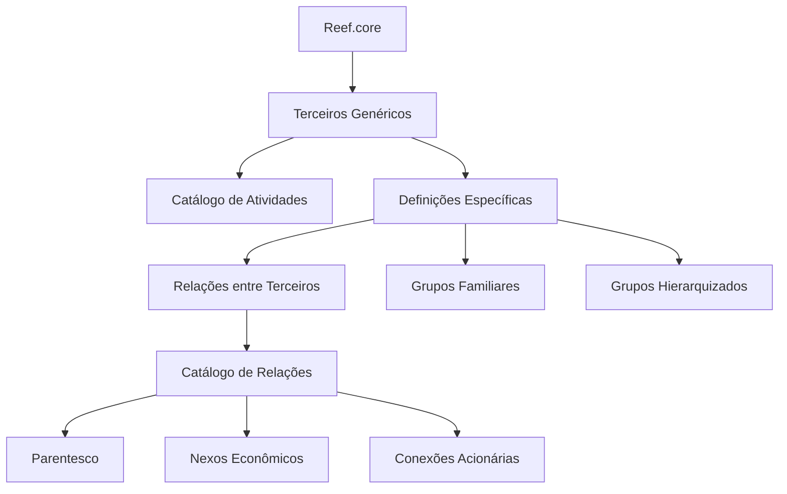

# Definição e Configuração de Terceiros Genéricos no Reef.core

## 1. Metadados do Documento
- **Arquivo de Origem:** Não identificado
- **Tipo de Documento:** Manual Operacional
- **Domínio / Sistema:** Reef.core — Terceiros Genéricos
- **Público-Alvo:** Operação, Negócio e Administradores de Configuração
- **Data/Versão Identificada:** Não identificada

---

## 2. Resumo Executivo & Contexto de Negócio

O documento descreve a definição de **Terceiros Genéricos** no sistema **Reef.core** e os elementos de configuração necessários para que essas entidades possam ser utilizadas posteriormente pelo sistema. Terceiros Genéricos abrangem pessoas físicas ou jurídicas cujas atividades laborais correspondem a profissões e categorias previamente classificadas.

A classificação apresentada inclui profissionais, fornecedores, entidades públicas, estabelecimentos, representantes e terceiros ligados a seguros. Cada atividade possui uma chave numérica e uma descrição, permitindo identificar o tipo de Terceiro Genérico configurado.

O documento também apresenta definições específicas utilizadas exclusivamente quando o terceiro é um Terceiro Genérico. Entre essas definições estão a configuração de relações entre terceiros, o catálogo de grupos familiares e hierarquizados e a identificação das relações existentes entre terceiros cadastrados.

Não há detalhamento de telas, APIs, métodos HTTP, contratos JSON, permissões, regras de persistência ou fluxos técnicos de integração. O conteúdo concentra-se no catálogo funcional de atividades e nas possibilidades de relacionamento entre terceiros.

---

## 3. Arquitetura, Componentes & Tecnologias Envolvidas

O único sistema explicitamente citado é o **Reef.core**. O documento não apresenta arquitetura técnica, microsserviços, bancos de dados, integrações, ambientes, URLs, tecnologias de desenvolvimento ou mecanismos de autenticação.

Os componentes funcionais identificados são:

- **Reef.core:** sistema que identifica e permite configurar Terceiros Genéricos.
- **Terceiros Genéricos:** pessoas físicas ou jurídicas classificadas por atividade profissional ou categoria.
- **Definições específicas de Terceiros Genéricos:** configurações exclusivas aplicáveis a esse tipo de terceiro.
- **Relações entre Terceiros:** configuração de conexões e relações entre terceiros registrados.
- **Grupos Familiares e Grupos Hierarquizados:** catálogo de grupos com os quais os terceiros registrados podem se relacionar.
- **Catálogo de Relações:** catálogo de vínculos possíveis, incluindo parentesco, nexo econômico e conexão acionária.



**Nota de Análise:** o diagrama representa exclusivamente as relações funcionais descritas no conteúdo. O documento não detalha componentes técnicos, interfaces, persistência de dados ou fluxos de integração.

---

## 4. Regras de Negócio, Especificações Funcionais & Processos

### 4.1 Definição de Terceiros Genéricos

O Reef.core identifica como Terceiros Genéricos pessoas físicas ou jurídicas cujas atividades laborais correspondam às profissões e categorias apresentadas no catálogo de atividades.

A configuração dos elementos relacionados aos Terceiros Genéricos é necessária para que essas entidades possam ser operadas posteriormente no sistema.

### 4.2 Classificação por atividade

Cada Terceiro Genérico pode ser associado a uma atividade identificada por uma chave numérica e uma descrição. O documento lista atividades como Peritos, Inspetores, Médicos, Advogados, Fornecedores, Oficinas, Clínicas, Tribunais, Notarias, Delegacias e Representantes Legais.

### 4.3 Configurações específicas

O grupo de definições específicas contém configurações utilizadas exclusivamente quando o terceiro registrado é classificado como Terceiro Genérico.

O documento informa que os asteriscos presentes nos cartões indicam se a configuração de um elemento é obrigatória em relação à definição de Terceiros Genéricos. Contudo, o material fornecido não identifica quais cartões possuem asteriscos nem quais elementos são obrigatórios.

### 4.4 Relações entre terceiros

O sistema permite configurar conexões ou relações entre Terceiros registrados. As relações podem ser associadas a:

1. Motivos de parentesco.
2. Nexos econômicos.
3. Conexões acionárias.

### 4.5 Grupos familiares e hierarquizados

O Reef.core permite configurar um catálogo de grupos familiares e grupos hierarquizados. Os grupos configurados podem ser utilizados para relacionar os Terceiros registrados no sistema.

### 4.6 Identificação de relações existentes

O documento indica a necessidade de identificar relações já existentes entre terceiros. Não são detalhados critérios de identificação, regras de validação, responsabilidades operacionais, campos de cadastro ou comportamento do sistema diante de relações conflitantes.

---

## 5. Tabelas de Parâmetros, Ambientes e Estruturas de Dados

### 5.1 Catálogo de atividades de Terceiros Genéricos

| Item / Parâmetro | Descrição / Função | Tipo / Valores / Formato | Ambiente / Observações |
| :--- | :--- | :--- | :--- |
| Chave de atividade 3 | Peritos | Número | Categoria de Terceiro Genérico |
| Chave de atividade 4 | Inspetores | Número | Categoria de Terceiro Genérico |
| Chave de atividade 5 | Médicos | Número | Categoria de Terceiro Genérico |
| Chave de atividade 6 | Advogados | Número | Categoria de Terceiro Genérico |
| Chave de atividade 7 | Procuradores | Número | Categoria de Terceiro Genérico |
| Chave de atividade 10 | Fornecedores | Número | Categoria de Terceiro Genérico |
| Chave de atividade 11 | Executivos de Cta. | Número | Categoria de Terceiro Genérico |
| Chave de atividade 12 | Cobradores | Número | Categoria de Terceiro Genérico |
| Chave de atividade 15 | Empregados | Número | Categoria de Terceiro Genérico |
| Chave de atividade 17 | Oficinas | Número | Categoria de Terceiro Genérico |
| Chave de atividade 18 | Clínicas | Número | Categoria de Terceiro Genérico |
| Chave de atividade 19 | Juízos | Número | Categoria de Terceiro Genérico |
| Chave de atividade 20 | Vidraceiros | Número | Categoria de Terceiro Genérico |
| Chave de atividade 21 | Chaveiros | Número | Categoria de Terceiro Genérico |
| Chave de atividade 22 | Encanadores | Número | Categoria de Terceiro Genérico |
| Chave de atividade 23 | Eletricistas | Número | Categoria de Terceiro Genérico |
| Chave de atividade 24 | Guinchos | Número | Categoria de Terceiro Genérico |
| Chave de atividade 25 | Investigadores | Número | Categoria de Terceiro Genérico |
| Chave de atividade 26 | Recuperadores | Número | Categoria de Terceiro Genérico |
| Chave de atividade 27 | Ajustadores | Número | Categoria de Terceiro Genérico |
| Chave de atividade 28 | Ferreiros | Número | Categoria de Terceiro Genérico |
| Chave de atividade 29 | Tribunais | Número | Categoria de Terceiro Genérico |
| Chave de atividade 30 | Terceiros Seg. MOTOR | Número | Categoria de Terceiro Genérico |
| Chave de atividade 31 | Terceiros Seg. SAÚDE | Número | Categoria de Terceiro Genérico |
| Chave de atividade 32 | Terceiros Seg. PATRIMONIAIS | Número | Categoria de Terceiro Genérico |
| Chave de atividade 33 | Depósitos | Número | Categoria de Terceiro Genérico |
| Chave de atividade 34 | Notarias | Número | Categoria de Terceiro Genérico |
| Chave de atividade 35 | Centros de Peritagem | Número | Categoria de Terceiro Genérico |
| Chave de atividade 36 | Delegacias | Número | Categoria de Terceiro Genérico |
| Chave de atividade 38 | Filial | Número | Categoria de Terceiro Genérico |
| Chave de atividade 45 | Representantes Legais | Número | Categoria de Terceiro Genérico |

### 5.2 Estruturas funcionais citadas

| Item / Parâmetro | Descrição / Função | Tipo / Valores / Formato | Ambiente / Observações |
| :--- | :--- | :--- | :--- |
| Terceiro Genérico | Pessoa física ou jurídica cuja atividade corresponde às profissões ou categorias do catálogo | Entidade funcional | Operada no Reef.core |
| Asteriscos dos cartões | Indicam se a configuração de um elemento é obrigatória para a definição de Terceiros Genéricos | Indicador de obrigatoriedade | Elementos específicos não foram identificados |
| Relações entre Terceiros | Configuração de conexões e relações entre terceiros | Configuração funcional | Aplicável a terceiros registrados |
| Grupos Familiares | Catálogo de grupos familiares para relacionamento entre terceiros | Catálogo funcional | Aplicável a terceiros registrados |
| Grupos Hierarquizados | Catálogo de grupos hierarquizados para relacionamento entre terceiros | Catálogo funcional | Aplicável a terceiros registrados |
| Catálogo de Relações | Relações possíveis entre terceiros registrados | Catálogo funcional | Inclui parentesco, nexos econômicos e conexões acionárias |

---

## 6. Bateria de Perguntas & Respostas para RAG (FAQ Sintético)

### P1: O que são Terceiros Genéricos no Reef.core?
**R:** Terceiros Genéricos são pessoas físicas ou jurídicas cujas atividades laborais correspondem às profissões ou categorias definidas no catálogo apresentado pelo documento. O Reef.core permite configurar esses elementos para que sejam operados posteriormente no sistema.

### P2: Quais tipos de profissionais podem ser classificados como Terceiros Genéricos?
**R:** O documento lista, entre outros, Peritos, Inspetores, Médicos, Advogados, Procuradores, Cobradores, Empregados, Vidraceiros, Chaveiros, Encanadores, Eletricistas, Investigadores, Recuperadores, Ajustadores, Ferreiros e Representantes Legais.

### P3: Qual é a chave de atividade para Médicos no catálogo de Terceiros Genéricos?
**R:** A chave de atividade para Médicos é **5**.

### P4: Qual é a chave de atividade para Oficinas?
**R:** A chave de atividade para Oficinas é **17**.

### P5: Quais categorias de terceiros relacionados a seguros aparecem no catálogo?
**R:** O catálogo apresenta as categorias **Terceiros Seg. MOTOR** com chave 30, **Terceiros Seg. SAÚDE** com chave 31 e **Terceiros Seg. PATRIMONIAIS** com chave 32.

### P6: Para que servem os asteriscos nos cartões de configuração?
**R:** Os asteriscos indicam se a configuração de um elemento é obrigatória em relação à definição dos Terceiros Genéricos. O documento não especifica quais cartões ou elementos possuem essa obrigatoriedade.

### P7: Que tipos de relações entre terceiros podem ser configurados no sistema?
**R:** O sistema permite configurar relações entre terceiros registrados por motivos de parentesco, nexos econômicos e conexões acionárias.

### P8: O que são grupos familiares e grupos hierarquizados no contexto de Terceiros Genéricos?
**R:** São catálogos de grupos com os quais os Terceiros registrados podem se relacionar. O documento menciona grupos familiares e grupos hierarquizados, mas não detalha atributos, regras de associação ou critérios de manutenção desses catálogos.

### P9: Qual é a chave de atividade para Clínicas?
**R:** A chave de atividade para Clínicas é **18**.

### P10: Qual é a chave de atividade para Representantes Legais?
**R:** A chave de atividade para Representantes Legais é **45**.

### P11: O documento descreve APIs ou contratos de integração para Terceiros Genéricos?
**R:** Não. O documento não descreve APIs, métodos HTTP, contratos JSON, URLs, integrações, tecnologias ou detalhes técnicos de implementação para Terceiros Genéricos.

### P12: Qual é a finalidade do catálogo de relações entre terceiros?
**R:** O catálogo de relações permite configurar as relações que podem ocorrer entre terceiros registrados no sistema, incluindo relações de parentesco, nexos econômicos e conexões acionárias.

---

## 7. Glossário de Termos, Siglas & Conceitos-Chave

- **Reef.core:** sistema citado como responsável por identificar e permitir a configuração de Terceiros Genéricos.
- **Terceiro Genérico:** pessoa física ou jurídica classificada conforme uma atividade profissional ou categoria do catálogo.
- **Chave de Atividade:** identificador numérico associado a uma categoria de Terceiro Genérico.
- **Relações entre Terceiros:** conexões ou vínculos configuráveis entre terceiros registrados.
- **Grupos Familiares:** grupos usados para relacionar terceiros por vínculos familiares.
- **Grupos Hierarquizados:** grupos usados para relacionar terceiros segundo uma estrutura hierárquica.
- **Nexos Econômicos:** relações entre terceiros motivadas por vínculos econômicos.
- **Conexões Acionárias:** relações entre terceiros baseadas em vínculos acionários.
- **Terceiros Seg. MOTOR:** categoria de terceiros de seguros identificada pela chave 30.
- **Terceiros Seg. SAÚDE:** categoria de terceiros de seguros identificada pela chave 31.
- **Terceiros Seg. PATRIMONIAIS:** categoria de terceiros de seguros identificada pela chave 32.
- **Cta.:** abreviação apresentada no documento em “Executivos de Cta.”; o significado não é expandido no conteúdo fornecido.

---

## 8. Notas Críticas, Riscos & Limitações

- O documento não identifica o arquivo de origem, data, versão, autor ou responsável pelo conteúdo.
- O conteúdo não fornece detalhes técnicos sobre arquitetura, APIs, microsserviços, banco de dados, segurança, autenticação, ambientes ou monitoramento.
- Não há descrição dos campos necessários para cadastrar Terceiros Genéricos nem critérios para validar a associação entre um terceiro e uma atividade.
- Embora o documento informe que asteriscos indicam configurações obrigatórias, os cartões e os elementos marcados não estão presentes no conteúdo extraído.
- O documento cita a identificação de relações existentes entre terceiros, mas não define critérios de detecção, prevenção de duplicidade, prioridade ou resolução de conflitos.
- O catálogo apresentado contém reticências após a chave 45, indicando que podem existir atividades adicionais não incluídas no conteúdo fornecido.
- **Nota de Análise:** o documento lista categorias e possibilidades de relacionamento, porém não detalha métodos operacionais, permissões, fluxos de aprovação ou contratos técnicos.

---

## 9. Conteúdo Bruto Estruturado (Referência Fiel)

```text
--- [PÁGINA 1 DE 4] ---

DEFINICIÓN de los TERCEROS GENÉRICOS
Se relacionan los elementos que permiten configurar en Reef.core a los Terceros Genéricos para
poder operar posteriormente con ellos en el Sistema.
Reef.core identifica a los "Terceros Genéricos" con todas aquellas personas físicas o jurídicas cuyas
actividades laborales se corresponden con las siguientes profesiones...
CLAVE ACTIVIDAD DESCRIPCIÓN
3 Peritos
4 Inspectores
5 Médicos
6 Abogados
7 Procuradores
10 Proveedores
11 Ejecutivos de Cta.
 / 
 CF
Home Solutions APIs Documentation Zeus
EN


--- [PÁGINA 2 DE 4] ---

CLAVE ACTIVIDAD DESCRIPCIÓN
12 Cobradores
15 Empleados
17 Talleres
18 Clínicas
19 Juzgados
20 Cristaleros
21 Cerrajeros
22 Plomeros
23 Electricistas
24 Grúas
25 Investigadores
26 Recuperadores
27 Ajustadores
28 Herreros
29 Tribunales
30 Terceros Seg. MOTOR
31 Terceros Seg. SALUD
32 Terceros Seg. PATRIMONIALES


--- [PÁGINA 3 DE 4] ---

CLAVE ACTIVIDAD DESCRIPCIÓN
33 Depósitos
34 Notarías
35 Centros de Peritación
36 Comisarías
38 Filial
45 Representantes Legales
... ...
Los Asteriscos de las Tarjetas indican si la configuración del elemento es obligatoria en relación
con la definición de los Terceros Genéricos.
Definiciones ESPECÍFICAS, propias de los
TERCEROS GENÉRICOS
En este Grupo se encuentran definiciones que se emplean
exclusivamente cuando el Tercero es un TERCERO GENÉRICO.
RELACIONES ENTRE TERCEROS
Configuración de las conexiones/relaciones
entre Terceros.
GRUPOS FAMILIARES Y GRUPOS
JERARQUIZADOS
Configuración del catálogo de grupos
familiares y jerárquicos con los que se pueden
relacionar los Terceros registrados.
IDENTIFICAR LAS RELACIONES
EXISTENTES ENTRE TERCEROS


--- [PÁGINA 4 DE 4] ---

Configuración del catálogo de relaciones que
se pueden dar entre los Terceros registrados
en el Sistema: por motivos de parentesco, por
nexos económicos, por conexiones
accionariales,...
```
