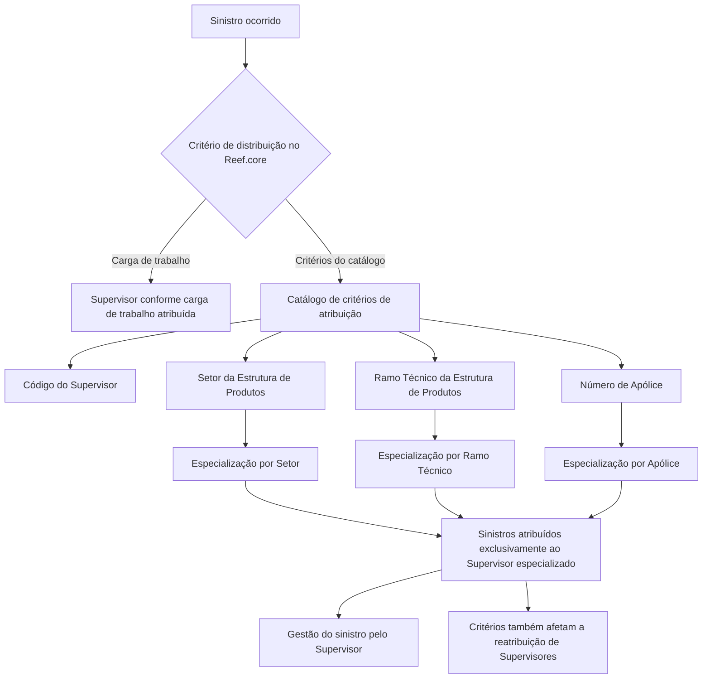

# Critérios de Atribuição de Sinistros a Supervisores no Reef.core

## 1. Metadados do Documento
- **Arquivo de Origem:** `Não identificado — conteúdo bruto fornecido na solicitação`
- **Tipo de Documento:** Especificação Funcional
- **Domínio / Sistema:** Reef.core — gestão e distribuição de sinistros
- **Público-Alvo:** Negócio, Operação, Analistas Funcionais e Desenvolvedores
- **Data/Versão Identificada:** Não identificada

---

## 2. Resumo Executivo & Contexto de Negócio

O documento descreve a funcionalidade do Reef.core para atribuir e distribuir automaticamente sinistros ocorridos ao corpo de Supervisores configurados no sistema. A finalidade é direcionar a gestão de cada sinistro a Supervisores adequados, considerando a carga de trabalho vigente ou critérios de especialização previamente definidos.

A distribuição pode ocorrer conforme a carga de trabalho atribuída a cada Supervisor em determinado momento. Alternativamente, o catálogo de critérios de atribuição permite configurar especializações para que determinados sinistros sejam destinados exclusivamente aos Supervisores correspondentes.

As especializações de Supervisores são definidas com base em atributos da estrutura de produtos e em uma apólice específica. Os atributos identificados são: código do Supervisor, Setor, Ramo Técnico e Número de Apólice.

O Reef.core oferece valores genéricos para ampliar o escopo de atribuição: o Setor genérico `9999` e o Ramo Técnico genérico `999`. A combinação desses atributos permite configurar Supervisores para receber sinistros de todos, vários ou somente um Setor e/ou Ramo Técnico, inclusive todos os Ramos Técnicos de um Setor específico.

As especializações configuradas para Supervisores também afetam o processo de reatribuição de Supervisores. O documento recomenda a consulta dos materiais relacionados sobre Supervisores, Responsáveis de Supervisores e Perguntas Frequentes para evitar interpretações isoladas.

---

## 3. Arquitetura, Componentes & Tecnologias Envolvidas

### Componentes e conceitos identificados

| Componente / Conceito | Papel descrito no documento |
| :--- | :--- |
| **Reef.core** | Sistema que possui a funcionalidade de atribuir e distribuir automaticamente sinistros aos Supervisores configurados. |
| **Sinistros** | Ocorrências cuja gestão é distribuída aos Supervisores. |
| **Supervisor** | Responsável pela gestão dos sinistros atribuídos conforme carga de trabalho ou critérios de especialização. |
| **Corpo de Supervisores** | Conjunto de Supervisores configurados para receber e gerir sinistros. |
| **Catálogo de critérios de atribuição** | Catálogo utilizado para definir critérios de distribuição e especializações de Supervisores. |
| **Estrutura de Produtos** | Estrutura que fornece as chaves de Setor e Ramo Técnico utilizadas nos critérios de especialização. |
| **Setor** | Chave da Estrutura de Produtos usada para especializar a gestão de sinistros de um Supervisor. |
| **Ramo Técnico** | Chave da Estrutura de Produtos usada para especializar a gestão de sinistros de um Supervisor. |
| **Apólice** | Identificada pelo Número de Apólice; pode direcionar sinistros a um Supervisor específico. |
| **Processo de reatribuição de Supervisores** | Processo afetado pelas especializações configuradas para Supervisores. |



> **Nota de Análise:** O documento não detalha interfaces de usuário, métodos HTTP, contratos JSON, persistência de dados, serviços técnicos, integrações externas ou algoritmos específicos para cálculo de carga de trabalho.

---

## 4. Regras de Negócio, Especificações Funcionais & Processos

### 4.1. Modalidades de atribuição e distribuição de sinistros

1. O Reef.core possui funcionalidade para atribuir e distribuir automaticamente sinistros ocorridos ao corpo de Supervisores configurados.
2. A distribuição dos sinistros pode ser realizada conforme a carga de trabalho atribuída aos Supervisores em determinado momento.
3. A distribuição também pode ser realizada conforme definições feitas previamente no catálogo de critérios de atribuição.
4. No modelo baseado no catálogo de critérios, o sistema permite configurar especializações de Supervisores.
5. A especialização pode indicar que um Supervisor está especializado em sinistros relacionados a:
   - uma apólice;
   - um Ramo Técnico;
   - um Setor específico.
6. Sinistros que possuam as características configuradas para uma especialização devem ser atribuídos somente aos Supervisores correspondentes.

### 4.2. Critério: Código do Supervisor

1. O Código do Supervisor identifica o Supervisor ao qual são atribuídos critérios de atribuição e distribuição de sinistros.
2. O Código do Supervisor é o identificador usado para vincular a configuração de especialização ao respectivo Supervisor.

### 4.3. Critério: Setor

1. O Setor identifica a chave do Setor na Estrutura de Produtos.
2. A chave do Setor permite especializar a gestão do Supervisor.
3. Sinistros que tenham a característica de Setor configurada devem ser atribuídos exclusivamente aos Supervisores especializados nesse Setor.
4. O Reef.core permite utilizar o Setor genérico `9999` na configuração da propriedade Setor no catálogo.
5. Mediante combinações adequadas de critérios, um Supervisor pode receber sinistros de:
   - todos os Setores;
   - vários Setores;
   - um único Setor.
6. O documento não detalha quais combinações específicas devem ser utilizadas para cada cenário de atribuição.

### 4.4. Critério: Ramo Técnico

1. O Ramo Técnico identifica a chave do Ramo na Estrutura de Produtos.
2. A chave do Ramo Técnico permite especializar a gestão do Supervisor.
3. Sinistros que tenham a característica de Ramo Técnico configurada devem ser atribuídos exclusivamente aos Supervisores especializados nesse Ramo Técnico.
4. O Reef.core permite utilizar o Ramo Técnico genérico `999` na configuração desse atributo no catálogo.
5. O Ramo Técnico pode ser combinado com o atributo Setor.
6. As combinações entre Setor e Ramo Técnico permitem atribuir a um Supervisor sinistros de:
   - todos os Ramos Técnicos;
   - vários Ramos Técnicos;
   - um único Ramo Técnico;
   - todos os Ramos Técnicos de um Setor específico.
7. O documento não especifica a precedência entre critérios de Setor, Ramo Técnico, Número de Apólice ou carga de trabalho quando mais de um critério for aplicável.

### 4.5. Critério: Número de Apólice

1. O Número de Apólice identifica a chave de uma apólice.
2. Uma apólice pode ser associada a um Supervisor específico quando houver características técnicas e/ou comerciais especiais.
3. Uma apólice também pode ser associada a um Supervisor determinado em função da experiência desse Supervisor.
4. A finalidade da configuração é garantir que o Supervisor designado seja responsável pela gestão dos sinistros da apólice configurada.
5. O documento não detalha o formato, tamanho, máscara ou validações do Número de Apólice.

### 4.6. Impacto no processo de reatribuição

1. As definições de especialização dos Supervisores também impactam o processo de reatribuição de Supervisores.
2. O documento não explica o comportamento detalhado da reatribuição, seus gatilhos, critérios de prioridade ou tratamento de conflitos.

---

## 5. Tabelas de Parâmetros, Ambientes e Estruturas de Dados

### 5.1. Parâmetros de critérios de atribuição

| Item / Parâmetro | Descrição / Função | Tipo / Valores / Formato | Ambiente / Observações |
| :--- | :--- | :--- | :--- |
| Código do Supervisor | Identifica o Supervisor que recebe os critérios de atribuição e distribuição de sinistros. | Código do Supervisor; formato não detalhado. | Utilizado no catálogo de critérios de atribuição. |
| Setor | Identifica a chave do Setor da Estrutura de Produtos e permite especializar a gestão de sinistros. | Chave de Setor; valor genérico permitido: `9999`. | Sinistros com a característica configurada são atribuídos somente aos Supervisores especializados. |
| Ramo Técnico | Identifica a chave do Ramo da Estrutura de Produtos e permite especializar a gestão de sinistros. | Chave de Ramo Técnico; valor genérico permitido: `999`. | Pode ser combinado com Setor para definir o escopo de atribuição. |
| Número de Apólice | Identifica uma apólice cujos sinistros devem ser geridos por um Supervisor determinado. | Chave de apólice; formato não detalhado. | Aplicável em razão de características técnicas, comerciais ou experiência do Supervisor. |
| Carga de trabalho | Critério alternativo para distribuição automática de sinistros. | Não detalhado. | Considera a carga atribuída ao Supervisor em determinado momento. |

### 5.2. Valores genéricos explicitamente documentados

| Item / Parâmetro | Descrição / Função | Tipo / Valores / Formato | Ambiente / Observações |
| :--- | :--- | :--- | :--- |
| Setor genérico | Permite configurar abrangência genérica de Setor para a especialização de um Supervisor. | `9999` | Valor permitido pelo Reef.core. |
| Ramo Técnico genérico | Permite configurar abrangência genérica de Ramo Técnico para a especialização de um Supervisor. | `999` | Valor permitido pelo Reef.core. |

### 5.3. Materiais vinculados

| Item / Parâmetro | Descrição / Função | Tipo / Valores / Formato | Ambiente / Observações |
| :--- | :--- | :--- | :--- |
| Supervisores | Documento ou diretriz funcional relacionada. | Referência documental. | Leitura recomendada. |
| Responsáveis de Supervisores | Documento ou diretriz funcional relacionada. | Referência documental. | Leitura recomendada. |
| Perguntas frequentes | Material relacionado para consulta. | Referência documental. | Leitura recomendada. |

> **Nota de Análise:** O conteúdo fornecido não apresenta URLs, servidores, ambientes de implantação, diretórios de log, variáveis de configuração, permissões, APIs, tabelas físicas de banco de dados ou estruturas de payload.

---

## 6. Bateria de Perguntas & Respostas para RAG (FAQ Sintético)

### P1: Qual é a finalidade dos critérios de atribuição de sinistros no Reef.core?
**R:** Os critérios de atribuição permitem ao Reef.core atribuir e distribuir automaticamente sinistros ocorridos ao corpo de Supervisores configurados. A atribuição pode considerar a carga de trabalho dos Supervisores ou especializações definidas previamente no catálogo de critérios de atribuição.

### P2: Quais são as formas de distribuição automática de sinistros descritas no documento?
**R:** O documento descreve duas formas: distribuição conforme a carga de trabalho atribuída aos Supervisores em um determinado momento e distribuição conforme definições configuradas no catálogo de critérios de atribuição.

### P3: Quais propriedades podem ser usadas para especializar um Supervisor no Reef.core?
**R:** O documento identifica quatro propriedades operativas: Código do Supervisor, Setor, Ramo Técnico e Número de Apólice. Setor e Ramo Técnico pertencem à Estrutura de Produtos; o Número de Apólice permite tratar apólices específicas.

### P4: Para que serve o Código do Supervisor nos critérios de atribuição?
**R:** O Código do Supervisor identifica o Supervisor ao qual estão sendo atribuídos os critérios de atribuição e distribuição de sinistros. O documento não informa o formato técnico desse código.

### P5: Qual é o valor genérico permitido para o atributo Setor?
**R:** O Reef.core permite utilizar o valor `9999` como Setor genérico na configuração da propriedade Setor no catálogo de critérios de atribuição.

### P6: O que a especialização por Setor permite configurar?
**R:** A especialização por Setor permite direcionar exclusivamente a determinados Supervisores os sinistros que possuam a característica de Setor configurada. Com combinações adequadas, um Supervisor pode receber sinistros de todos, vários ou somente um Setor.

### P7: Qual é o valor genérico permitido para o Ramo Técnico?
**R:** O Reef.core permite utilizar o valor `999` como Ramo Técnico genérico na configuração desse atributo no catálogo.

### P8: Como Setor e Ramo Técnico podem ser combinados?
**R:** O documento informa que Setor e Ramo Técnico podem ser combinados para definir o escopo de especialização. Essas combinações podem permitir a atribuição de sinistros de todos, vários ou um único Ramo Técnico, inclusive de todos os Ramos Técnicos pertencentes a um Setor específico.

### P9: Quando o Número de Apólice deve ser usado como critério de atribuição?
**R:** O Número de Apólice deve ser utilizado quando uma apólice, por características técnicas e/ou comerciais especiais, ou pela experiência de um Supervisor, deve ter seus sinistros tratados por um Supervisor determinado.

### P10: Os critérios de especialização influenciam somente a atribuição inicial de sinistros?
**R:** Não. O documento estabelece que as definições realizadas nas especializações dos Supervisores também afetam o processo de reatribuição de Supervisores.

### P11: O documento define a prioridade entre especialização por apólice, Setor, Ramo Técnico e carga de trabalho?
**R:** Não. O conteúdo fornecido não especifica regras de precedência, desempate, conflitos de critérios ou comportamento quando um sinistro atende simultaneamente a mais de uma configuração de especialização.

### P12: Quais documentos relacionados devem ser consultados para compreender integralmente os critérios de atribuição?
**R:** O documento recomenda consultar os materiais relacionados intitulados **Supervisores**, **Responsáveis de Supervisores** e **Perguntas frequentes**, pois a leitura isolada do documento pode conduzir a interpretações incorretas.

---

## 7. Glossário de Termos, Siglas & Conceitos-Chave

- **Reef.core:** Sistema que possui a funcionalidade de atribuir e distribuir automaticamente sinistros ao corpo de Supervisores configurados.
- **Sinistro:** Ocorrência cuja gestão é atribuída a um Supervisor no Reef.core.
- **Supervisor:** Responsável pela gestão dos sinistros atribuídos.
- **Corpo de Supervisores:** Conjunto de Supervisores configurados para receber sinistros.
- **Critérios de Atribuição:** Definições configuradas para direcionar e distribuir sinistros aos Supervisores.
- **Catálogo de Critérios de Atribuição:** Catálogo no qual são realizadas configurações de especialização e distribuição de Supervisores.
- **Especialização:** Configuração que restringe a atribuição de sinistros a Supervisores com determinadas características de Setor, Ramo Técnico ou Apólice.
- **Estrutura de Produtos:** Estrutura referenciada pelo documento como origem das chaves de Setor e Ramo Técnico.
- **Setor:** Chave da Estrutura de Produtos utilizada para especializar a gestão de sinistros por Supervisor.
- **Setor genérico `9999`:** Valor permitido pelo Reef.core para configuração genérica do atributo Setor.
- **Ramo Técnico:** Chave da Estrutura de Produtos utilizada para especializar a gestão de sinistros por Supervisor.
- **Ramo Técnico genérico `999`:** Valor permitido pelo Reef.core para configuração genérica do atributo Ramo Técnico.
- **Número de Apólice:** Chave de uma apólice usada para encaminhar seus sinistros a um Supervisor determinado.
- **Reatribuição de Supervisores:** Processo de mudança ou nova atribuição de Supervisores, afetado pelas especializações configuradas.

---

## 8. Notas Críticas, Riscos & Limitações

- O documento não detalha como o Reef.core calcula, mede ou atualiza a carga de trabalho dos Supervisores.
- Não há definição da ordem de prioridade entre os critérios de carga de trabalho, Número de Apólice, Setor e Ramo Técnico.
- Não há regras documentadas para resolução de conflitos quando múltiplos Supervisores ou múltiplos critérios forem aplicáveis ao mesmo sinistro.
- Não são especificados formatos, validações ou obrigatoriedade para Código do Supervisor, chaves de Setor, chaves de Ramo Técnico e Número de Apólice.
- O documento não apresenta detalhes técnicos sobre APIs, métodos HTTP, contratos de integração, banco de dados, logs, URLs, ambientes ou mecanismos de auditoria.
- A especialização influencia a reatribuição de Supervisores, mas o documento não detalha os gatilhos, o fluxo operacional ou as consequências dessa influência.
- A interpretação isolada deste conteúdo pode levar a erro; o próprio documento recomenda a leitura das referências relacionadas: **Supervisores**, **Responsáveis de Supervisores** e **Perguntas frequentes**.

---

## 9. Conteúdo Bruto Estruturado (Referência Fiel)

```text
--- [PÁGINA 1 DE 3] ---

DEFINIR los CRITERIOS de ASIGNACIÓN del
SUPERVISOR
Objetivo
Reef.core tiene la funcionalidad de poder asignar y distribuir automáticamente los Siniestros
acaecidos al cuerpo de Supervisores configurados de acuerdo con:
La carga de trabajo que tengan asignada en un momento determinado o
De acuerdo con las definiciones realizadas ex-profeso en el catálogo de criterios de asignación.
En este segundo caso se configura si el Supervisor está especializado en los Siniestros de una
póliza, de un Ramo Técnico o de un Sector en particular y de esta manera los siniestros con esas
características les serán asignados únicamente a ellos.
Propiedades Operativas
Propiedades Operativas
Código del Supervisor
Este dato identifica el código del Supervisor al que se están dando los criterios de asignación y
distribución de Siniestros.
Sector
Esta propiedad identifica la clave del Sector de la Estructura de Productos, clave que permite
'especializar' las labores de Gestión del Supervisor para que los siniestros con esta característica le
 / 
 CF
Home Solutions APIs Documentation Zeus
EN


--- [PÁGINA 2 DE 3] ---

sean asignados únicamente a ellos.
Reef.core permite el uso del sector genérico (9999) en la configuración de esta propiedad del
catálogo.
De esta manera y realizando las combinaciones adecuadas, a un Supervisor determinado se le
podrán asignar los siniestros de aquellas pólizas adscritas a todos, a varios o a un único Sector.
Ramo Técnico
Esta propiedad identifica la clave del Ramo de la Estructura de Productos, clave que a su vez
permitirá 'especializar' las labores de Gestión del Supervisor para que los siniestros con esta
característica sean asignados únicamente a ellos.
Reef.core permite el uso del Ramo Técnico genérico (999) en la configuración de este atributo del
Catálogo.
De esta manera y realizando las combinaciones adecuadas (conjuntamente con el atributo del
Sector anterior), a un Supervisor determinado se le podrán asignar los siniestros de todos, de
varios o de un único Ramo Técnico, de todos los Ramos Técnicos de un Sector en particular,
etcétera.
Número de Póliza
Esta propiedad identifica la clave de una Póliza que por sus especiales características técnicas y/o
comerciales o por la experiencia del Supervisor, la entidad considere adecuado sea un Supervisor
determinado quien se encargue y responsabilice de la Gestión de sus Siniestros.
Vínculos
Relación de Directrices y Documentos funcionales cuya lectura recomendada para evitar que la
interpretación aislada del presente documento pueda conducir a error.
Supervisores
Responsables de Supervisores
Preguntas frecuentes
Consejo:
Consejo:


--- [PÁGINA 3 DE 3] ---

(1) ¿Existe alguna particularidad operativa que deba ser tomada en consideración localmente en la
codificación, uso y definición de los Criterios de Asignación de Siniestros para los Supervisores en el
Sistema?
Las Definiciones realizadas en las especializaciones de los Supervisores también les afectan en el
proceso de reasignación de supervisores. etcétera.
```
