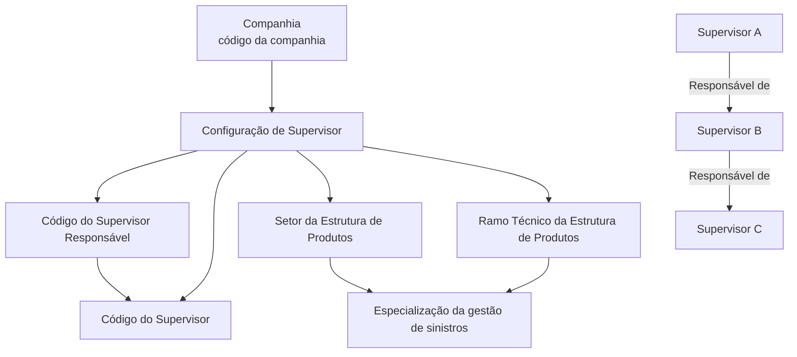

# Definição de Supervisor e Responsável de Supervisores no Módulo de Sinistros do Reef.core

## 1. Metadados do Documento
- **Arquivo de Origem:** Não identificado no conteúdo fornecido
- **Tipo de Documento:** Especificação Funcional
- **Domínio / Sistema:** Reef.core — módulo de sinistros
- **Público-Alvo:** Analistas funcionais, administradores de catálogo, operação e negócio
- **Data/Versão Identificada:** Não identificada

---

## 2. Resumo Executivo & Contexto de Negócio

O documento descreve a definição das informações de **Supervisor** e **Responsável de Supervisores** no módulo de sinistros do sistema Reef.core. Um Supervisor é caracterizado como a pessoa responsável por monitorar e supervisionar o desempenho diário de um pequeno grupo, equipe ou departamento.

O núcleo funcional do sistema permite identificar e configurar pessoas físicas ou jurídicas que atuarão como Supervisores e, adicionalmente, como Responsáveis de outros Supervisores. Essa configuração estabelece relações de dependência e gestão entre Supervisores.

A definição é contextualizada por Companhia, Código do Supervisor Responsável, Código do Supervisor, Setor e Ramo Técnico. Setor e Ramo Técnico pertencem à Estrutura de Produtos da Companhia e permitem especializar o escopo de gestão de um Supervisor Responsável sobre os Supervisores atribuídos.

O Reef.core aceita valores genéricos para Setor (`99999`) e Ramo Técnico (`999*`). Por meio das combinações desses critérios, a entidade pode configurar a gestão de sinistros para todos os Ramos Técnicos, grupos específicos, um único Ramo Técnico ou um setor particular.

O documento também informa que a configuração pode formar estruturas hierárquicas de múltiplos níveis, nas quais um Supervisor pode simultaneamente ser supervisionado e ser Responsável por outro Supervisor.

---

## 3. Arquitetura, Componentes & Tecnologias Envolvidas

### Componentes e conceitos identificados

| Componente / Conceito | Descrição baseada no documento |
| :--- | :--- |
| Reef.core | Sistema que permite configurar informações de Supervisores e Responsáveis de Supervisores no módulo de sinistros. |
| Módulo de sinistros | Módulo no qual os Supervisores e Responsáveis de Supervisores atuam na gestão de sinistros. |
| Supervisor | Pessoa responsável por monitorar e supervisionar o desempenho diário de um pequeno grupo, equipe ou departamento. |
| Supervisor Responsável | Supervisor identificado como responsável pela gestão de um ou mais Supervisores dependentes. |
| Companhia | Contexto organizacional identificado por um código de companhia durante a definição. |
| Estrutura de Produtos da Companhia | Estrutura na qual são identificadas as chaves de Setor e Ramo Técnico. |
| Setor | Critério que especializa a gestão do Supervisor Responsável sobre o grupo de Supervisores atribuído. |
| Ramo Técnico | Critério que especializa a gestão do Supervisor Responsável sobre o grupo de Supervisores atribuído. |



> **Nota de Análise:** O documento não detalha interfaces, métodos HTTP, contratos JSON, banco de dados, tecnologias de implantação ou integrações externas do Reef.core.

---

## 4. Regras de Negócio, Especificações Funcionais & Processos

### Definição funcional de Supervisor

1. Um Supervisor é uma pessoa responsável por monitorar e supervisionar o desempenho diário de um pequeno grupo, equipe ou departamento.
2. O sistema permite identificar e configurar pessoas físicas ou jurídicas que atuarão como Supervisores.
3. As pessoas configuradas como Supervisores também podem atuar como Responsáveis de outros Supervisores.
4. A definição está associada ao módulo de sinistros do Reef.core.

### Relação entre Supervisor Responsável e Supervisor

1. O **Código do Supervisor Responsável** identifica o Supervisor Responsável no sistema.
2. Um ou mais Supervisores dependem do Supervisor Responsável identificado.
3. O **Código do Supervisor** identifica o Supervisor associado ao Supervisor Responsável.
4. A configuração pode construir relações hierárquicas entre Supervisores.
5. Um Supervisor pode assumir simultaneamente dois papéis:
   - ser Supervisor subordinado a outro Supervisor Responsável;
   - ser Supervisor Responsável de outro Supervisor.

### Especialização da gestão por Setor

1. A propriedade **Setor** identifica a chave do Setor da Estrutura de Produtos da Companhia.
2. O Setor permite especializar as atividades de gestão do Supervisor Responsável sobre o grupo de Supervisores atribuído.
3. O Reef.core permite utilizar o Setor genérico de código `99999` na configuração da propriedade de catálogo.

### Especialização da gestão por Ramo Técnico

1. A propriedade **Ramo Técnico** identifica a chave do Ramo Técnico da Estrutura de Produtos da Companhia.
2. O Ramo Técnico permite especializar as atividades de gestão do Supervisor Responsável sobre o grupo de Supervisores atribuído.
3. O Reef.core permite utilizar o Ramo Técnico genérico `999*` na configuração da propriedade de catálogo.

### Escopos de gestão resultantes das combinações

Mediante configurações adequadas de Supervisor Responsável, Supervisor, Setor e Ramo Técnico, um Supervisor Responsável poderá gerir sinistros:

- de todos os Ramos Técnicos para um Supervisor determinado;
- de um grupo de Ramos Técnicos para um Supervisor determinado;
- de um único Ramo Técnico para um Supervisor determinado;
- de todos os Ramos Técnicos de todos os Supervisores sob sua responsabilidade;
- de um setor em particular.

### Hierarquia multinível

A entidade pode configurar uma estrutura de múltiplos níveis. O documento apresenta o seguinte padrão:

1. O Supervisor A é Supervisor.
2. O Supervisor A também é Supervisor Responsável nível 1 do Supervisor B.
3. O Supervisor B também é Responsável nível 2 do Supervisor C.
4. A sequência pode continuar até atender às necessidades de gestão da entidade.

---

## 5. Tabelas de Parâmetros, Ambientes e Estruturas de Dados

| Item / Parâmetro | Descrição / Função | Tipo / Valores / Formato | Ambiente / Observações |
| :--- | :--- | :--- | :--- |
| Companhia | Indica o código da companhia sobre a qual está sendo realizada a definição. | Código de companhia; formato não detalhado. | Aplicável à definição no sistema. |
| Código do Supervisor Responsável | Identifica o código do Supervisor Responsável do qual dependem um ou mais Supervisores. | Código; formato não detalhado. | Define a relação de responsabilidade. |
| Código do Supervisor | Identifica o Supervisor associado ao Supervisor Responsável. | Código; formato não detalhado. | Define o Supervisor dependente. |
| Setor | Identifica a chave do Setor da Estrutura de Produtos da Companhia. | Chave de Setor; valor genérico aceito: `99999`. | Permite especializar a gestão sobre o grupo de Supervisores. |
| Ramo Técnico | Identifica a chave do Ramo Técnico da Estrutura de Produtos da Companhia. | Chave de Ramo Técnico; valor genérico aceito: `999*`. | Permite especializar a gestão sobre o grupo de Supervisores. |
| Supervisor | Pessoa que monitora e supervisiona o desempenho diário de pequeno grupo, equipe ou departamento. | Pessoa física ou jurídica. | Pode também atuar como Supervisor Responsável. |
| Supervisor Responsável | Supervisor que gerencia Supervisores dependentes. | Supervisor identificado por código. | Pode participar de hierarquias com múltiplos níveis. |

---

## 6. Bateria de Perguntas & Respostas para RAG (FAQ Sintético)

### P1: Qual é o objetivo da configuração de Supervisores e Responsáveis de Supervisores no Reef.core?
**R:** A configuração permite identificar e definir pessoas físicas ou jurídicas que atuarão como Supervisores e como Responsáveis de outros Supervisores no módulo de sinistros do Reef.core.

### P2: O que é um Supervisor segundo o documento?
**R:** Um Supervisor é uma pessoa responsável por monitorar e supervisionar o desempenho diário de um pequeno grupo, equipe ou departamento.

### P3: O que informa a propriedade Companhia na definição de Supervisor?
**R:** A propriedade Companhia indica o código da companhia sobre a qual está sendo realizada a definição de Supervisor e Supervisor Responsável.

### P4: Para que serve o Código do Supervisor Responsável?
**R:** O Código do Supervisor Responsável identifica, no sistema, o Supervisor Responsável do qual dependem um ou mais Supervisores.

### P5: Qual é a função do Código do Supervisor?
**R:** O Código do Supervisor identifica o Supervisor associado ao Código do Supervisor Responsável e que depende desse Supervisor Responsável.

### P6: Como o Setor influencia a gestão realizada pelo Supervisor Responsável?
**R:** O Setor identifica uma chave da Estrutura de Produtos da Companhia e permite especializar as atividades de gestão do Supervisor Responsável sobre o grupo de Supervisores atribuído.

### P7: Qual valor genérico de Setor é aceito pelo Reef.core?
**R:** O Reef.core permite utilizar o código de Setor genérico `99999` na configuração da propriedade de catálogo.

### P8: Qual valor genérico de Ramo Técnico é aceito pelo Reef.core?
**R:** O Reef.core permite utilizar o Ramo Técnico genérico `999*` na configuração da propriedade de catálogo.

### P9: Quais escopos de gestão de sinistros podem ser configurados?
**R:** Por combinações adequadas de configuração, um Supervisor Responsável pode gerir sinistros de todos, de um grupo ou de um único Ramo Técnico para um Supervisor determinado; também pode gerir todos os Ramos Técnicos de todos os Supervisores sob sua responsabilidade ou os sinistros de um setor particular.

### P10: Um Supervisor pode também ser Responsável por outro Supervisor?
**R:** Sim. O documento informa que um Supervisor pode ser simultaneamente Supervisor e Supervisor Responsável de outro Supervisor, permitindo estruturas de vários níveis.

### P11: Como funciona a hierarquia de Supervisores em múltiplos níveis?
**R:** Um Supervisor A pode ser Supervisor e, ao mesmo tempo, Supervisor Responsável nível 1 de um Supervisor B. O Supervisor B pode, por sua vez, ser Responsável nível 2 de um Supervisor C. A estrutura pode continuar conforme as necessidades de gestão da entidade.

### P12: O documento detalha métodos HTTP, contratos JSON ou integrações técnicas do módulo?
**R:** Não. O conteúdo fornecido apresenta regras funcionais de configuração de Supervisores, Setor e Ramo Técnico, mas não descreve métodos HTTP, contratos JSON, integrações, tecnologias de infraestrutura ou rotas de serviço.

---

## 7. Glossário de Termos, Siglas & Conceitos-Chave

- **Reef.core:** Sistema citado como responsável por permitir a configuração de Supervisores e Responsáveis de Supervisores no módulo de sinistros.
- **Supervisor:** Pessoa responsável por monitorar e supervisionar o desempenho diário de um pequeno grupo, equipe ou departamento.
- **Supervisor Responsável:** Supervisor responsável pela gestão de um ou mais Supervisores dependentes.
- **Companhia:** Entidade identificada por código, sobre a qual é realizada a definição de Supervisor.
- **Setor:** Chave da Estrutura de Produtos da Companhia usada para especializar as atividades de gestão.
- **Ramo Técnico:** Chave da Estrutura de Produtos da Companhia usada para especializar as atividades de gestão.
- **Estrutura de Produtos:** Estrutura da Companhia que contém as chaves de Setor e Ramo Técnico.
- **Módulo de sinistros:** Módulo no qual ocorre a configuração e gestão descritas.
- **Siniestros:** Termo em espanhol presente no documento, correspondente a sinistros.

---

## 8. Notas Críticas, Riscos & Limitações

- O documento recomenda a leitura das diretrizes e documentos funcionais relacionados a **Supervisores**, pois a interpretação isolada pode conduzir a erro.
- A seção de perguntas frequentes apresenta a pergunta sobre particularidades operacionais locais na codificação, uso e definição dos Responsáveis de Supervisores, mas o conteúdo fornecido não contém uma resposta explícita.
- Não há detalhamento de validações técnicas, obrigatoriedade de campos, formatos de códigos, mensagens de erro, permissões, APIs, persistência de dados ou processos de aprovação.
- O documento não identifica data, versão, autor, nome do arquivo ou ambiente específico.
- A utilização de valores genéricos para Setor (`99999`) e Ramo Técnico (`999*`) amplia o escopo da gestão; o documento não especifica controles adicionais para prevenir configurações excessivamente abrangentes.
- **Nota de Análise:** O documento descreve a capacidade de criar estruturas de múltiplos níveis, mas não especifica limite de profundidade hierárquica, prevenção de ciclos ou regras de resolução de conflitos entre responsáveis.

---

## 9. Conteúdo Bruto Estruturado (Referência Fiel)

```text
--- [PÁGINA 1 DE 3] ---

DEFINIR la Información del SUPERVISOR,
RESPONSABLE de SUPERVISORES
Contexto
Un Supervisor es aquella persona responsable de monitorear y supervisar el desempeño diario de un
pequeño grupo, equipo o departamento.
Objetivo
Funcionalmente, el núcleo del Sistema cuenta con la posibilidad de identificar y configurar la
información de aquellas personas físicas o jurídicas que van a actuar como Supervisores y además
van a actuar como Responsables de otros Supervisores en el módulo de siniestros.
Propiedades Operativas
Propiedades Operativas
Compañía
Esta propiedad le indica al sistema el código de la compañía sobre la que se está realizando la
definición.
Código del Supervisor Responsable
Este dato identifica el código del Supervisor Responsable en el Sistema del que dependerán uno o n
Supervisores.
 / 
 CF
Home Solutions APIs Documentation Zeus
EN


--- [PÁGINA 2 DE 3] ---

Código del Supervisor
Este dato identifica el código del Supervisor asociado al atributo anterior y del que depende.
Sector
Esta propiedad identifica la clave del Sector de la Estructura de Productos de la Compañía, clave que
permite 'especializar' las labores de Gestión del Supervisor Responsable, sobre el Grupo de
Supervisores que tenga asignado.
Reef.core permite el uso del sector genérico (código 99999) en la configuración de esta propiedad
del catálogo.
Ramo Técnico
Esta propiedad identifica la clave del Ramo Técnico de la Estructura de Productos de la Compañía,
clave que a su vez permitirá 'especializar' las labores de Gestión del Supervisor Responsable, sobre
el Grupo de Supervisores que tenga asignado.
Reef.core permite el uso del Ramo Técnico genérico (999*) en la configuración de esta propiedad
del Catálogo.
De esta manera y realizando las combinaciones adecuadas, un Supervisor Responsable podrá
gestionar los siniestros de todos, de un grupo o de un único Ramo Técnico para un Supervisor
determinado, de todos los Ramos Técnicos de todos sus Supervisados o los de un sector en
particular,...
Vínculos
Relación de Directrices y Documentos funcionales cuya lectura recomendada para evitar que la
interpretación aislada del presente documento pueda conducir a error.
Supervisores
Preguntas frecuentes
(1) ¿Existe alguna particularidad operativa que deba ser tomada en consideración localmente en la
codificación, uso y definición de los Responsables de Supervisores en el Sistema?
Consejo:
Consejo:


--- [PÁGINA 3 DE 3] ---

Se puede lograr, mediante una adecuada configuración, tener una estructura de varios niveles en la
que un Supervisor (A) sea Supervisor y a su vez Supervisor Responsable (1) de otro Supervisor (B)
que a su vez sea Responsable (2) de otro supervisor (C) y así hasta completar las necesidades de
gestión que tenga la entidad.
```
