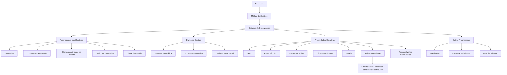

# Definição de Informações do Supervisor de Sinistros no Reef.core

## 1. Metadados do Documento
- **Arquivo de Origem:** Não identificado no conteúdo fornecido
- **Tipo de Documento:** Especificação Funcional
- **Domínio / Sistema:** Reef.core — Módulo de Sinistros
- **Público-Alvo:** Analistas funcionais, desenvolvedores, arquitetos, operação e gestores de sinistros
- **Data/Versão Identificada:** Não identificada

---

## 2. Resumo Executivo & Contexto de Negócio

O documento especifica a definição e a configuração de Supervisores no módulo de Sinistros do sistema Reef.core. Um Supervisor é uma pessoa responsável por monitorar e supervisionar o desempenho diário de um pequeno grupo, equipe ou departamento. No contexto do módulo de Sinistros, as equipes supervisionadas incluem pessoas que executam atividades como Tramitadores.

O núcleo funcional do Reef.core permite identificar e configurar pessoas físicas ou jurídicas que atuarão como Supervisores no módulo de Sinistros. A definição do Supervisor reúne informações identificativas, dados de contato, propriedades operativas e propriedades adicionais relacionadas à disponibilidade e inabilitação.

A configuração operacional permite especializar a atuação de um Supervisor por Setor, Ramo Técnico, Número de Póliza e Oficina Tramitadora. Essa especialização determina o escopo de sinistros pelo qual o Supervisor pode ser responsável.

O documento também descreve mecanismos para acompanhamento da carga de trabalho, incluindo o número de sinistros pendentes atribuídos ao Supervisor. Esse valor é atualizado quando um sinistro é aberto, encerrado, atribuído ou reatribuído.

A definição contempla histórico e rastreabilidade por meio da Data de Validade, que estabelece quando a configuração do Supervisor fica disponível no sistema. Além disso, a definição pode registrar inabilitação e respectiva causa, bem como indicar se o Supervisor pode atuar como responsável por outros supervisores ou grupos de supervisores.

---

## 3. Arquitetura, Componentes & Tecnologias Envolvidas

O documento não descreve arquitetura técnica, protocolos, APIs, bancos de dados, microsserviços, URLs, ambientes ou tecnologias de infraestrutura. O conteúdo apresenta uma arquitetura funcional de cadastro e configuração de Supervisores no sistema Reef.core.

### Componentes e conceitos funcionais identificados

| Componente / Conceito | Descrição |
| :--- | :--- |
| Reef.core | Sistema mencionado como responsável pela configuração e gestão de Supervisores no módulo de Sinistros. |
| Módulo de Sinistros | Módulo no qual os Supervisores realizam atividades de supervisão relacionadas a sinistros. |
| Catálogo de Supervisores | Catálogo que contém atributos de identificação, contato, operação, estado e inabilitação do Supervisor. |
| Supervisor | Pessoa física ou jurídica configurada para monitorar e supervisionar um grupo, equipe ou departamento. |
| Tramitadores | Pessoas que realizam tarefas nos times do módulo de Sinistros. |
| Estrutura Geográfica | Estrutura de localização composta por País, Estado, Província, Localidade e Código Postal. |
| Estrutura Comercial | Estrutura cuja terceira camada identifica a Oficina Tramitadora de Sinistros. |
| Setor | Chave de especialização das atividades de gestão de um Supervisor. |
| Ramo Técnico | Chave de especialização das atividades de gestão de um Supervisor para determinado ramo técnico. |
| Póliza | Apólice que pode exigir a responsabilidade de um Supervisor específico por suas características. |
| Siniestro / Sinistro | Entidade operacional cuja abertura, encerramento, atribuição ou reatribuição atualiza a carga pendente do Supervisor. |
| Entidade | Contexto de definição cujas propriedades de Terceiros devem ser consideradas localmente. |
| Instalação de Reef.core | Contexto cujas propriedades também devem ser consideradas para a codificação, uso e definição de Supervisores. |



> **Nota de Análise:** O documento não detalha interfaces técnicas, métodos HTTP, contratos JSON, persistência de dados, integrações externas, controles de autenticação ou fluxos de implantação do Reef.core.

---

## 4. Regras de Negócio, Especificações Funcionais & Processos

### 4.1 Definição de Supervisor

1. Um Supervisor é responsável por monitorar e supervisionar o desempenho diário de um pequeno grupo, equipe ou departamento.
2. No módulo de Sinistros do Reef.core, os grupos podem ser compostos por pessoas que realizam funções como Tramitadores.
3. O sistema permite configurar como Supervisor uma pessoa física ou uma pessoa jurídica.
4. A definição de um Supervisor é composta por:
   - Propriedades Identificativas;
   - Dados de Contato;
   - Propriedades Operativas;
   - Outras Propriedades.

### 4.2 Regras de identificação

1. A Companhia indica o código da companhia para a qual a definição do Supervisor está sendo realizada.
2. O Tipo de Documento Identificador deve corresponder a um tipo de documento previamente configurado no sistema.
3. A Chave do Documento Identificador contém a chave do Supervisor associada ao Tipo de Documento Identificador.
4. O Código de Atividade do Terceiro identifica a atividade do Terceiro.
5. O Código do Supervisor identifica o Supervisor no sistema.
6. A Chave de Usuário contém o código de Usuário associado ao Supervisor no catálogo de Supervisores da Entidade.

### 4.3 Regras de endereço e contato

1. O endereço do Supervisor utiliza a estrutura geográfica configurada no catálogo mestre do sistema.
2. País corresponde ao primeiro nível da estrutura geográfica.
3. Estado corresponde ao segundo nível da estrutura geográfica.
4. Província corresponde ao terceiro nível da estrutura geográfica.
5. Localidade corresponde ao quarto nível da estrutura geográfica.
6. Nome da Localidade contém o nome do quarto nível da estrutura geográfica.
7. O Código Postal identifica o código postal associado aos cinco níveis da estrutura geográfica onde está localizado o endereço do Terceiro.
8. A Extensão Postal complementa o Código Postal.
9. O Tipo de Domicílio representa o tipo de via associado ao Supervisor, conforme codificação local da entidade seguradora.
10. Domicílio `<1>` e Domicílio `<2>` formam o endereço corporativo do Supervisor e permitem registrar informações complementares para facilitar a localização.
11. Número, Portal, Piso, Letra, Escalera e Urbanización/Polígono são informações adicionais de localização do endereço.
12. O Prefixo Telefônico do País representa o código telefônico nacional associado ao telefone corporativo do Supervisor.
13. O Prefixo Zonal Telefônico representa o código de área associado ao telefone corporativo do Supervisor.
14. Número Telefônico, Extensão Telefônica, Número Fax e Direção de Correio Eletrônico registram os canais corporativos de contato.

### 4.4 Regras operativas de especialização

1. O Setor identifica a chave do Setor configurado no sistema e especializa a atuação do Supervisor para sinistros de determinado Setor.
2. O Reef.core permite o uso do Setor genérico de código `9999` na configuração do Supervisor.
3. O Ramo Técnico identifica a chave do Ramo Técnico e especializa a atuação do Supervisor para sinistros de determinado Ramo Técnico.
4. O Reef.core permite o uso do Ramo Técnico genérico de código `999`.
5. A configuração do Ramo Técnico genérico `999` implica que o Supervisor pode gerenciar sinistros de todos os Ramos Técnicos definidos no sistema.
6. O Número de Póliza identifica uma apólice para a qual, por características especiais, foi determinado que um Supervisor específico será responsável pela gestão.
7. A Oficina Tramitadora contém o código do terceiro nível da Estrutura Comercial ao qual o Supervisor é atribuído e que é identificado como Oficina Tramitadora de Sinistros.
8. O Estado do Supervisor é apresentado na data de consulta e deve assumir um dos valores configurados no Reef.core.
9. O número de sinistros pendentes é atualizado sempre que um sinistro é aberto, encerrado, atribuído ou reatribuído.
10. O indicador “¿Responsable de Supervisores?” define se o Reef.core permitirá que o Supervisor seja responsável por outro Supervisor ou por um grupo de Supervisores.

### 4.5 Regras de inabilitação, vigência e histórico

1. A Inabilitação indica ao sistema que o Supervisor está desativado.
2. Quando o Supervisor está inabilitado, o Código da Causa de Inabilitação deve indicar, de acordo com o Código de Atividade do Terceiro, a causa da inabilitação do Terceiro no sistema.
3. A Data de Validade determina a data a partir da qual a definição do Supervisor estará disponível para utilização.
4. A correta configuração da Data de Validade permite manter histórico das alterações realizadas na definição do Supervisor.
5. O histórico possibilita rastrear e explorar posteriormente as alterações nas definições de Supervisores.

### 4.6 Dependências funcionais recomendadas

A leitura isolada da especificação pode causar interpretação incorreta. O documento recomenda consultar:

- Estrutura de Produtos;
- Usuários da Companhia.

### 4.7 Consideração operacional local

A codificação, o uso e a definição de Supervisores devem considerar simultaneamente:

1. As Propriedades de Terceiros configuradas na definição da Entidade.
2. As Propriedades configuradas na Instalação do Reef.core.

---

## 5. Tabelas de Parâmetros, Ambientes e Estruturas de Dados

### 5.1 Propriedades identificativas

| Item / Parâmetro | Descrição / Função | Tipo / Valores / Formato | Ambiente / Observações |
| :--- | :--- | :--- | :--- |
| Companhia | Indica o código da companhia para a qual a definição do Supervisor é realizada. | Código | Não detalhado. |
| Tipo Documento Identificador | Define o tipo de documento usado para identificar o Supervisor como pessoa física ou jurídica. | Tipo de documento configurado previamente | Depende dos tipos de documentos configurados no sistema. |
| Chave do Documento Identificador | Contém a chave do Supervisor associada ao tipo de documento identificador. | Chave | Associada ao Tipo Documento Identificador. |
| Código de Atividade do Terceiro | Indica o código da atividade do Terceiro. | Código | Relacionado à causa de inabilitação. |
| Código do Supervisor | Identifica o código do Supervisor no sistema. | Código | Não detalhado. |
| Chave de Usuário | Contém o código de Usuário associado ao Supervisor. | Código de usuário | Presente no catálogo de Supervisores da Entidade. |

### 5.2 Estrutura geográfica e endereço corporativo

| Item / Parâmetro | Descrição / Função | Tipo / Valores / Formato | Ambiente / Observações |
| :--- | :--- | :--- | :--- |
| País | Código do primeiro nível da estrutura geográfica do endereço do Supervisor. | Código geográfico | Valores existentes no catálogo mestre do sistema. |
| Estado | Código do segundo nível da estrutura geográfica do endereço do Supervisor. | Código geográfico | Valores existentes no catálogo mestre do sistema. |
| Província | Código do terceiro nível da estrutura geográfica do endereço do Supervisor. | Código geográfico | Valores existentes no catálogo mestre do sistema. |
| Localidade | Código do quarto nível da estrutura geográfica do endereço do Supervisor. | Código geográfico | Valores existentes no catálogo mestre do sistema. |
| Nome da Localidade | Nome do quarto nível da estrutura geográfica. | Texto | Não detalhado. |
| Código Postal | Chave que identifica o código postal associado aos cinco níveis da estrutura geográfica. | Chave | Relacionado ao endereço do Terceiro. |
| Extensão Postal | Extensão complementar do Código Postal. | Texto ou código | Não detalhado. |
| Tipo de Domicílio | Tipo de via associado ao Supervisor. | Código de tipo de via | Codificação local da entidade seguradora. |
| Domicílio `<1>` | Primeira parte do endereço corporativo do Supervisor. | Texto | Pode conter informações complementares de localização. |
| Domicílio `<2>` | Segunda parte do endereço corporativo do Supervisor. | Texto | Usado conjuntamente com Domicílio `<1>`. |
| Número | Número associado ao tipo de via do endereço. | Número | Não detalhado. |
| Portal | Número do portal do endereço, quando necessário. | Número | Opcional conforme necessidade. |
| Piso | Número do piso ou planta do endereço, quando necessário. | Número | Opcional conforme necessidade. |
| Letra | Letra do endereço, quando necessária. | Texto | Opcional conforme necessidade. |
| Escalera | Escada que identifica o endereço, quando necessária. | Texto | Opcional conforme necessidade. |
| Urbanización/Polígono | Urbanização, desenvolvimento urbano, polígono ou informação equivalente do endereço. | Texto | Opcional conforme necessidade. |

### 5.3 Valores exemplificados para Tipo de Domicílio

| Código | Tipo de Via | Descrição / Observações |
| :--- | :--- | :--- |
| `001` | Calle | Exemplo apresentado no documento. |
| `002` | Avenida | Exemplo apresentado no documento. |
| `003` | Plaza | Exemplo apresentado no documento. |
| `004` | Carretera | Exemplo apresentado no documento. |
| `005` | Eje Vial | Exemplo apresentado no documento. |

> **Nota de Análise:** A lista de tipos de via é apresentada apenas como exemplo e contém reticências, portanto não representa um catálogo completo.

### 5.4 Dados de contato

| Item / Parâmetro | Descrição / Função | Tipo / Valores / Formato | Ambiente / Observações |
| :--- | :--- | :--- | :--- |
| Prefixo Telefônico do País | Prefixo nacional do telefone corporativo do Supervisor. | Prefixo telefônico | Exemplos: Espanha `+34`, México `+52`, Argentina `+54`. |
| Prefixo Zonal Telefônico | Prefixo zonal ou código de área do telefone corporativo do Supervisor. | Prefixo telefônico | Exemplos: Madrid `91`, Barcelona `93`, Monterrey `81`, Cidade do México `55`. |
| Número Telefônico | Número de telefone do Supervisor. | Número telefônico | Telefone corporativo. |
| Extensão Telefônica | Extensão associada ao telefone corporativo do Supervisor. | Número ou texto | Usada quando necessária. |
| Número Fax | Número telefônico do fax corporativo do Supervisor. | Número telefônico | Não detalhado. |
| Direção de Correio Eletrônico | Endereço de e-mail corporativo do Supervisor. | Endereço de e-mail | Não detalhado. |

### 5.5 Propriedades operativas

| Item / Parâmetro | Descrição / Função | Tipo / Valores / Formato | Ambiente / Observações |
| :--- | :--- | :--- | :--- |
| Setor | Especializa as atividades de gestão do Supervisor para sinistros de um Setor específico. | Chave de Setor | O Reef.core permite o Setor genérico `9999`. |
| Ramo Técnico | Especializa as atividades de gestão do Supervisor para sinistros de um Ramo Técnico específico. | Chave de Ramo Técnico | O Reef.core permite o Ramo Técnico genérico `999`. |
| Ramo Técnico genérico | Permite gestão de sinistros de todos os Ramos Técnicos definidos no sistema. | Código `999` | Aplicável à configuração do Supervisor. |
| Número de Póliza | Identifica uma apólice cuja gestão exige Supervisor específico. | Chave de Póliza | Aplicável quando a apólice possui características especiais. |
| Oficina Tramitadora | Código do terceiro nível da Estrutura Comercial ao qual o Supervisor é atribuído. | Código | Identifica a Oficina Tramitadora de Sinistros. |
| Estado | Exibe o estado do Supervisor na data de consulta. | Valor configurado | Deve corresponder a um dos valores configurados no Reef.core. |
| Número de Siniestros Pendientes | Quantidade de sinistros pendentes atribuídos ao Supervisor. | Número | Atualizada em abertura, encerramento, atribuição e reatribuição de sinistros. |
| ¿Responsable de Supervisores? | Indica se o Supervisor pode ser responsável por outro Supervisor ou grupo de Supervisores. | Indicador | Não detalha valores ou formato. |

### 5.6 Outras propriedades

| Item / Parâmetro | Descrição / Função | Tipo / Valores / Formato | Ambiente / Observações |
| :--- | :--- | :--- | :--- |
| Inabilitação | Indica que o Supervisor está desativado. | Indicador | Não detalha valores ou formato. |
| Código da Causa de Inabilitação | Informa a causa da inabilitação do Terceiro no sistema. | Código | Aplicável se o Supervisor estiver inabilitado; condicionado ao Código de Atividade do Terceiro. |
| Data de Validade | Define a data a partir da qual a definição do Supervisor fica disponível. | Data | Permite histórico, rastreabilidade e exploração posterior das alterações. |

---

## 6. Bateria de Perguntas & Respostas para RAG (FAQ Sintético)

### P1: Qual é a função de um Supervisor no módulo de Sinistros do Reef.core?
**R:** Um Supervisor é uma pessoa responsável por monitorar e supervisionar o desempenho diário de um pequeno grupo, equipe ou departamento. No módulo de Sinistros do Reef.core, esses grupos podem incluir pessoas que realizam tarefas como Tramitadores.

### P2: O Reef.core permite configurar Supervisores como pessoas jurídicas?
**R:** Sim. O núcleo funcional do sistema permite identificar e configurar informações de pessoas físicas ou jurídicas que atuarão como Supervisores no módulo de Sinistros.

### P3: Quais grupos de informações compõem a definição de um Supervisor?
**R:** A definição é organizada em Propriedades Identificativas, Dados de Contato, Propriedades Operativas e Outras Propriedades.

### P4: Como o Setor genérico é configurado para um Supervisor?
**R:** O Reef.core permite utilizar o código genérico de Setor `9999` na configuração de um Supervisor. O documento informa essa possibilidade, mas não detalha regras adicionais de priorização ou combinação com outros critérios operativos.

### P5: O que acontece quando um Supervisor é configurado com o Ramo Técnico genérico `999`?
**R:** O uso do Ramo Técnico genérico de código `999` implica que o Supervisor pode gerenciar sinistros de todos os Ramos Técnicos definidos no sistema.

### P6: Quando o número de sinistros pendentes de um Supervisor é atualizado?
**R:** O Número de Siniestros Pendientes é atualizado e modificado sempre que um sinistro é aberto, encerrado, atribuído ou reatribuído.

### P7: Como uma apólice pode ser vinculada a um Supervisor específico?
**R:** O atributo Número de Póliza identifica uma apólice que, devido às suas características especiais, foi determinada para ser gerida sob responsabilidade de um Supervisor específico.

### P8: Qual é a finalidade da Data de Validade na definição de um Supervisor?
**R:** A Data de Validade estabelece a data a partir da qual a definição do Supervisor está disponível para utilização no sistema. A configuração correta desse atributo permite manter histórico das alterações, rastrear mudanças e explorar posteriormente essa informação.

### P9: O que deve ser informado quando um Supervisor está inabilitado?
**R:** A Inabilitação informa que o Supervisor está desativado. Quando o Supervisor está inabilitado, o Código da Causa de Inabilitação deve informar, conforme o Código de Atividade do Terceiro, a causa da inabilitação do Terceiro no sistema.

### P10: Como a localização do endereço do Supervisor é estruturada?
**R:** O endereço usa uma estrutura geográfica composta por País, Estado, Província e Localidade, que correspondem, respectivamente, ao primeiro, segundo, terceiro e quarto níveis da estrutura geográfica. O Código Postal é associado aos cinco níveis dessa estrutura geográfica.

### P11: O que é a Oficina Tramitadora na configuração do Supervisor?
**R:** A Oficina Tramitadora é o código do terceiro nível da Estrutura Comercial ao qual o Supervisor é atribuído no sistema. Esse código identifica a Oficina Tramitadora de Sinistros.

### P12: Um Supervisor pode ser responsável por outros Supervisores?
**R:** Sim, desde que o campo “¿Responsable de Supervisores?” permita essa condição. Esse campo identifica se o Reef.core permitirá que o Supervisor seja responsável por outro Supervisor ou por um grupo de Supervisores.

### P13: Quais fontes devem ser consideradas para a definição local de Supervisores?
**R:** A definição local deve considerar as Propriedades de Terceiros configuradas na definição da Entidade e as Propriedades configuradas na Instalação do Reef.core.

---

## 7. Glossário de Termos, Siglas & Conceitos-Chave

- **Reef.core:** Sistema mencionado como responsável pela configuração e gestão dos Supervisores no módulo de Sinistros.
- **Supervisor:** Pessoa física ou jurídica configurada para supervisionar o desempenho diário de uma equipe, grupo ou departamento.
- **Siniestro / Sinistro:** Entidade associada ao módulo de Sinistros; sua abertura, término, atribuição ou reatribuição atualiza a carga pendente do Supervisor.
- **Tramitador:** Pessoa que realiza atividades nos grupos ou equipes do módulo de Sinistros.
- **Terceiro:** Entidade cuja atividade e causa de inabilitação são referenciadas na definição do Supervisor.
- **Setor:** Critério de especialização que permite limitar a gestão de um Supervisor aos sinistros de determinado setor.
- **Ramo Técnico:** Critério de especialização que permite limitar a gestão de um Supervisor aos sinistros de determinado ramo técnico.
- **Póliza:** Apólice que pode requerer gestão por um Supervisor específico.
- **Oficina Tramitadora:** Unidade identificada pelo terceiro nível da Estrutura Comercial e associada à gestão de sinistros.
- **Estrutura Geográfica:** Hierarquia de localização composta por País, Estado, Província, Localidade e referência de Código Postal.
- **Estrutura Comercial:** Hierarquia organizacional cuja terceira camada identifica a Oficina Tramitadora de Sinistros.
- **Código Postal:** Chave associada aos cinco níveis da estrutura geográfica do endereço do Terceiro.
- **Inabilitação:** Condição que indica que o Supervisor está desativado.
- **Data de Validade:** Data a partir da qual a definição do Supervisor está disponível para uso no sistema.
- **Setor genérico `9999`:** Código que o Reef.core permite utilizar na configuração do Supervisor.
- **Ramo Técnico genérico `999`:** Código que permite ao Supervisor gerir sinistros de todos os Ramos Técnicos definidos no sistema.

---

## 8. Notas Críticas, Riscos & Limitações

1. O documento é funcional e não apresenta detalhes de arquitetura técnica, APIs, contratos de integração, modelos físicos de dados, mecanismos de persistência, autenticação ou autorização.
2. Não são descritos formatos, obrigatoriedades, tamanhos máximos, validações sintáticas ou regras de unicidade dos campos do catálogo de Supervisores.
3. O documento afirma que o Estado do Supervisor deve corresponder a um valor configurado no Reef.core, mas não lista os valores possíveis.
4. O campo “¿Responsable de Supervisores?” é descrito funcionalmente, mas seus valores permitidos e regras de hierarquia não são detalhados.
5. A lista de tipos de via é exemplificativa e não é exaustiva.
6. Os exemplos de prefixos telefônicos são apenas referências apresentadas no documento e não constituem catálogo completo.
7. A definição local de Supervisores depende das Propriedades de Terceiros configuradas na Entidade e das Propriedades configuradas na Instalação do Reef.core.
8. A interpretação isolada deste documento pode conduzir a erro; a especificação recomenda consultar os documentos de Estrutura de Produtos e Usuários da Companhia.
9. Não há detalhamento adicional sobre como o Setor genérico `9999` interage com Setores específicos.
10. Não há detalhamento adicional sobre prioridade, conflito ou combinação entre Setor, Ramo Técnico, Número de Póliza e Oficina Tramitadora.

---

## 9. Conteúdo Bruto Estruturado (Referência Fiel)

```text
--- [PÁGINA 1 DE 7] ---

DEFINIR Información del SUPERVISOR de
SINIESTROS
Contexto
Un Supervisor es aquella persona responsable de monitorear y supervisar el desempeño diario de un
pequeño grupo, equipo o departamento.
En el ámbito de Reef.core y para el Módulo de Siniestros estos equipos se conforman con personas
que realizan labores como Tramitadores.
Objetivo
Funcionalmente, el núcleo del Sistema cuenta con la posibilidad de identificar y configurar la
información de aquellas personas físicas o jurídicas que van a actuar como supervisores en el
módulo de siniestros.
Propiedades Identificativas
Datos de Contacto
Propiedades Operativas
Otras Propiedades
Propiedades Identificativas
Compañía
 / 
 CF
Home Solutions APIs Documentation Zeus
EN


--- [PÁGINA 2 DE 7] ---

Esta propiedad le indica al sistema el código de la compañía sobre la que se está realizando la
definición del Supervisor.
Tipo Documento Identificador
Este Atributo del colapsador contiene el tipo de documento con el que se va a identificar al
Supervisor como persona física o jurídica y de acuerdo con los tipos de documentos que hayan sido
configurados en el sistema previamente.
Clave del Documento Identificador
Este Atributo del catálogo contendrá la clave del Supervisor asociado al Tipo de Documento
Identificador.
Código de Actividad del Tercero
Esta propiedad indicará el código de la Actividad del Tercero.
Código del Supervisor
Este dato identifica el código del Supervisor en el Sistema.
Clave de Usuario
Este Atributo del catálogo de Supervisores de la Entidad contiene el código del Usuario.
Datos de Contacto
Pais
Este Campo contiene el código del primer nivel de la estructura Geográfica en la que se encuentra
ubicada la Dirección del Supervisor de acuerdo con la relación de posibles valores existentes en el
catálogo maestro existente en el Sistema.
Estado
Este Campo contiene el código del segundo nivel de la estructura Geográfica en la que se encuentra
ubicada la Dirección del Supervisor de acuerdo con la relación de posibles valores existentes en el
catálogo maestro existente en el Sistema.
Provincia
Este Campo contiene el código del tercer nivel de la estructura Geográfica en la que se encuentra
ubicada la Dirección del Supervisor de acuerdo con la relación de posibles valores existentes en el
catálogo maestro existente en el Sistema.


--- [PÁGINA 3 DE 7] ---

Localidad
Este Campo contiene el código del cuarto nivel de la estructura Geográfica en la que se encuentra
ubicada la Dirección del Supervisor de acuerdo con la relación de posibles valores existentes en el
catálogo maestro existente en el Sistema.
Nombre de la Localidad
Este Campo contiene el nombre del cuarto nivel de la estructura geográfica.
Código Postal
Esta Propiedad contiene la clave que identifica el Código Postal asociado a los cinco niveles de la
estructura geográfica en la que está ubicada la Dirección del Tercero.
Extensión Postal
Este atributo del catálogo de Supervisores contiene la extensión del Código Postal.
Tipo de Domicilio
De acuerdo con el callejero local, este dato contendrá el Tipo de Vía que se va a asociar al
Supervisor de acuerdo con la codificación efectuada localmente por parte de la entidad aseguradora.
A modo de ejemplo sus valores podrían ser:
Código TIPO VIA DESCRIPCIÓN
001 Calle
002 Avenida
003 Plaza
004 Carretera
005 Eje Vial
... ...
Domicilio <1>
Este Atributo contiene el domicilio Corporativo del Supervisor de acuerdo con la ubicación geográfica
y la tipología del domicilio además de permitir la captura de información complementaria que facilite


--- [PÁGINA 4 DE 7] ---

su ubicación.
Domicilio <2>
Este Atributo, conjuntamente con el atributo anterior, contiene el domicilio Corporativo del Supervisor
de acuerdo con la ubicación geográfica y la tipología del domicilio además de permitir la captura de
información complementaria que facilite su ubicación.
Número
Este Atributo contiene el número del tipo de vía del Domicilio del Supervisor.
Portal
Este Atributo contiene, de ser necesario, el número del Portal del Domicilio del Supervisor.
Piso
Este Atributo contiene, de ser necesario, el número del Piso/Planta del Domicilio del Supervisor.
Letra
Este Atributo contiene, de plantearse la necesidad, la Letra del del Domicilio del Supervisor.
Escalera
Este Atributo contiene, caso de ser necesario, la Escalera que identifica el Domicilio del Supervisor.
Urbanización/Polígono
Este Atributo en caso de ser necesario contendrá la Urbanización, Desarrollo Urbano, Polígono, ...
que identifica el Domicilio del Supervisor.
Prefijo Telefónico del País
Este atributo contiene el Prefijo del País Telefónico correspondiente al número telefónico Corporativo
del Supervisor.
A modo de ejemplo, en España el prefijo es +34, en México +52 y en Argentina +54.
Prefijo Zonal Telefónico
Este atributo contiene el Prefijo Zonal Telefónico que corresponde al número telefónico Corporativo
del Supervisor.
A modo de ejemplo,


--- [PÁGINA 5 DE 7] ---

En España el prefijo zonal de Madrid es el 91, el de Barcelona 93, ...
En México la Clave Lada local que corresponde a Monterrey, Nuevo León es 81, la de Ciudad de
México es 55,...
Número Telefónico
Este Campo contiene el número telefónico del Supervisor.
Extensión Telefónica
Caso de ser necesario, este atributo contendrá la Extensión Telefónica correspondiente al Teléfono
Corporativo del Supervisor.
Número Fax
Este atributo contiene el Número Telefónico del Fax Corporativo del Supervisor.
Dirección Correo Electrónico
Este atributo contiene la dirección de correo electrónico corporativo del Supervisor.
Propiedades Operativas
Sector
Esta propiedad identifica la clave del Sector que se está configurando en el Sistema y que permite
'especializar' las labores de Gestión del Supervisor para que se ocupe de los siniestros de un Sector
en concreto.
NOTA: Reef.core permite el uso del sector genérico (código 9999) en la configuración del Supervisor.
Ramo Técnico
Esta propiedad identifica la clave del Ramo Técnico y que permite 'especializar' las labores de
Gestión del Supervisor para que se ocupe de los siniestros de un Ramo Técnico en particular.
NOTA: Reef.core permite el uso del Ramo Técnico genérico (código 999) en la configuración del
Supervisor, lo que implica que el Supervisor puede gestionar los siniestros de todos los Ramos
Técnicos definidos en el Sistema.
Número de Póliza
Esta propiedad identifica la clave de una Póliza en la que por sus especiales características se haya
determinado que un Supervisor específico ha de ser la persona que se responsabilice en su gestión.
Oficina Tramitadora


--- [PÁGINA 6 DE 7] ---

Este atributo contiene el código del tercer nivel de la Estructura Comercial al que estará asignado el
Supervisor en el Sistema y que la identifica como Oficina Tramitadora de Siniestros.
Estado
Esta propiedad del Catálogo de Supervisores muestra el estado en el que se encuentra el Supervisor
a la fecha de Consulta del mismo, estado que tiene que tener uno de los posibles valores
configurados en Reef.core.
Número de Siniestros Pendientes
Este Atributo contiene el número de siniestros pendientes que tiene asignado un Supervisor,
sabiendo que cada vez que se abre, se termina, se asigna o se reasigna un siniestro, se actualiza y
modifica su contenido.
¿Responsable de Supervisores?
Este campo identifica si Reef.core va a permitir que el Supervisor sea a su vez o no Responsable de
otro supervisor o grupo de supervisores.
Otras Propiedades
Inhabilitación
Esta propiedad le indica al Sistema que el Supervisor se encuentra desactivado.
Código de la Causa de Inhabilitación
Si el Supervisor está inhabilitado, este Atributo indicará de acuerdo con el código de actividad del
Tercero, el código de la Causa de la Inhabilitación del Tercero en el sistema.
Fecha de Validez
Esta propiedad establece la fecha a partir de la cual la definición del Supervisor está disponible en el
sistema para ser utilizado, por lo que una correcta configuración habilita tener un histórico de los
cambios efectuados en sus definiciones y poder así trazar y explotar posteriormente esta
información.
Vínculos
Relación de Directrices y Documentos funcionales cuya lectura recomendada para evitar que la
interpretación aislada del presente documento pueda conducir a error.
Estructura de Productos
Usuarios de la Compañía


--- [PÁGINA 7 DE 7] ---

Preguntas frecuentes
(1) ¿Existe alguna particularidad operativa que deba ser tomada en consideración localmente en la
codificación, uso y definición de los Supervisores en el Sistema?
Se debe considerar tanto las Propiedades de Terceros configuradas en la definición de la Entidad,
como aquellas Propiedades configuradas en la Instalación de Reef.core.
```
