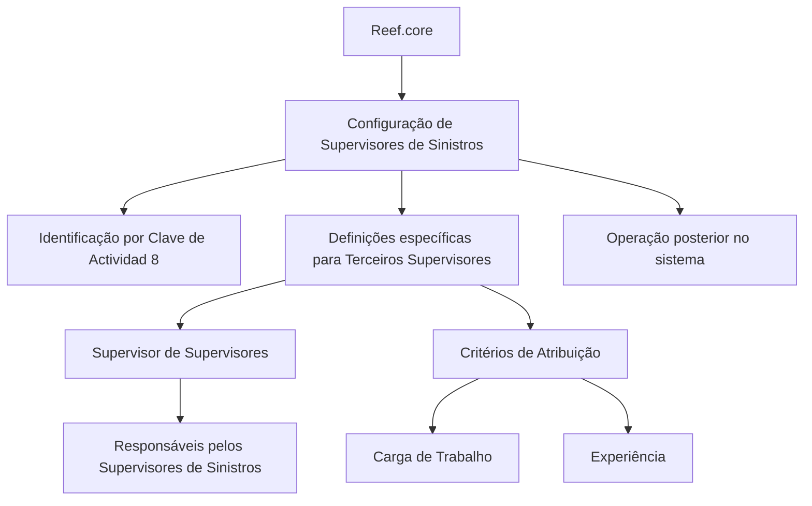

# Definição de Supervisores de Sinistros no Reef.core

## 1. Metadados do Documento
- **Arquivo de Origem:** Não identificado
- **Tipo de Documento:** Especificação Técnica
- **Domínio / Sistema:** Reef.core / Supervisores de Sinistros
- **Público-Alvo:** Operação, Negócio e Configuração de Sistema
- **Data/Versão Identificada:** Não identificada

---

## 2. Resumo Executivo & Contexto de Negócio

O documento descreve elementos de configuração de **Supervisores de Sinistros** no sistema **Reef.core**. Essas configurações permitem que os Supervisores sejam definidos no sistema e posteriormente utilizados em operações relacionadas a sinistros.

O Reef.core identifica Supervisores por meio da **Clave de Actividad 8**. A documentação também informa que a obrigatoriedade de configurações é indicada por asteriscos nas respectivas tarjetas, embora não detalhe quais elementos são obrigatórios.

Existem definições específicas aplicáveis exclusivamente quando um terceiro é classificado como Supervisor. Entre os itens mencionados estão a configuração de responsáveis pelos Supervisores de Sinistros e critérios para atribuição de sinistros.

Os critérios de atribuição citados consideram, entre outros fatores, a carga de trabalho e a experiência dos Supervisores. O documento não apresenta regras de cálculo, prioridades, contratos, telas ou parâmetros detalhados.

---

## 3. Arquitetura, Componentes & Tecnologias Envolvidas

| Componente / Conceito | Papel descrito |
| :--- | :--- |
| Reef.core | Sistema no qual Supervisores de Sinistros são configurados e operados. |
| Supervisor de Sinistros | Terceiro configurado no Reef.core para atuação posterior no sistema. |
| Clave de Actividad 8 | Identificador utilizado pelo Reef.core para reconhecer Supervisores. |
| Supervisor de Supervisores | Configuração dos responsáveis pelos Supervisores de Sinistros. |
| Critérios de Atribuição | Configuração para distribuir sinistros aos Supervisores. |
| Home Solutions APIs Documentation Zeus | Termo exibido no conteúdo bruto; a função ou relação com Reef.core não é detalhada. |



> **Nota de Análise:** O documento não detalha interfaces, APIs, métodos HTTP, bancos de dados, contratos JSON, tecnologias de implementação ou fluxos de integração entre sistemas.

---

## 4. Regras de Negócio, Especificações Funcionais & Processos

1. O Reef.core possui configurações destinadas aos **Supervisores de Sinistros**.
2. A finalidade dessas configurações é permitir a operação posterior dos Supervisores no sistema.
3. O Reef.core identifica Supervisores utilizando a **Clave de Actividad 8**.
4. A documentação informa que a obrigatoriedade de um elemento de configuração é indicada por asteriscos nas tarjetas.
5. Existem definições específicas aplicáveis somente quando o terceiro é um **Supervisor**.
6. A configuração **Supervisor de Supervisores** define os responsáveis pelos Supervisores de Sinistros.
7. A configuração de **Critérios de Atribuição** define critérios para alocação de sinistros aos Supervisores.
8. Entre os critérios de atribuição explicitamente mencionados estão:
   - Carga de trabalho.
   - Experiência.
9. O documento utiliza reticências após “Experiência”, indicando que podem existir outros critérios, mas não os especifica.

> **Nota de Análise:** Não foram apresentados pesos, fórmulas, critérios de desempate, limites de carga, níveis de experiência, exceções ou regras de reatribuição de sinistros.

---

## 5. Tabelas de Parâmetros, Ambientes e Estruturas de Dados

| Item / Parâmetro | Descrição / Função | Tipo / Valores / Formato | Ambiente / Observações |
| :--- | :--- | :--- | :--- |
| Clave de Actividad | Identifica Supervisores no Reef.core. | Valor informado: `8`. | Aplicável ao Reef.core. |
| Supervisor de Supervisores | Configura responsáveis pelos Supervisores de Sinistros. | Configuração funcional. | Sem detalhamento de campos, permissões ou regras. |
| Critérios de Atribuição | Configura a atribuição de sinistros aos Supervisores. | Critérios mencionados: carga de trabalho e experiência. | Outros critérios podem existir, mas não são identificados. |
| Asteriscos nas tarjetas | Indicam se a configuração de determinado elemento é obrigatória. | Indicador visual de obrigatoriedade. | O documento não lista os elementos obrigatórios. |
| Terceiros Supervisores | Grupo que contém definições usadas exclusivamente quando o terceiro é Supervisor. | Classificação de terceiro. | Sem detalhes cadastrais ou estruturais. |
| Home Solutions APIs Documentation Zeus | Texto apresentado no conteúdo extraído. | Não identificado. | Relação funcional ou técnica não detalhada. |

---

## 6. Bateria de Perguntas & Respostas para RAG (FAQ Sintético)

### P1: Qual sistema permite configurar Supervisores de Sinistros?
**R:** O sistema citado é o **Reef.core**. O documento informa que existem elementos de configuração no Reef.core para definir Supervisores de Sinistros e permitir sua operação posterior no sistema.

### P2: Como o Reef.core identifica um Supervisor?
**R:** O Reef.core identifica Supervisores pela **Clave de Actividad 8**. O documento não especifica como essa chave é cadastrada, validada ou integrada a outros dados.

### P3: O que indicam os asteriscos nas tarjetas de configuração?
**R:** Os asteriscos indicam se a configuração de um elemento é obrigatória em relação à definição dos Supervisores. A documentação não informa quais tarjetas ou elementos possuem obrigatoriedade.

### P4: O que são as definições específicas dos Terceiros Supervisores?
**R:** São definições empregadas exclusivamente quando o terceiro é um **Supervisor**. O conteúdo extraído não detalha todos os campos ou configurações pertencentes a esse grupo.

### P5: Qual é a finalidade da configuração “Supervisor de Supervisores”?
**R:** A configuração “Supervisor de Supervisores” é usada para definir os responsáveis pelos Supervisores de Sinistros.

### P6: O que são os Critérios de Atribuição de Sinistros?
**R:** Os Critérios de Atribuição configuram a distribuição de sinistros aos Supervisores. O documento menciona explicitamente carga de trabalho e experiência como fatores considerados.

### P7: Quais critérios são explicitamente mencionados para atribuir sinistros a Supervisores?
**R:** O documento menciona **carga de trabalho** e **experiência**. Não são descritos pesos, fórmulas de priorização ou critérios adicionais.

### P8: O documento define como calcular a carga de trabalho de um Supervisor?
**R:** Não. O documento cita a carga de trabalho como critério de atribuição, mas não fornece método de cálculo, indicadores, limites ou periodicidade de atualização.

### P9: O documento apresenta contratos de API para a configuração de Supervisores?
**R:** Não. Embora o texto contenha a expressão “Home Solutions APIs Documentation Zeus”, não há detalhamento de APIs, endpoints, métodos HTTP, autenticação ou payloads.

### P10: Há informações sobre ambientes, URLs ou servidores do Reef.core?
**R:** Não. O conteúdo fornecido não apresenta URLs, nomes de ambientes, servidores, portas, caminhos de log ou parâmetros técnicos de infraestrutura.

---

## 7. Glossário de Termos, Siglas & Conceitos-Chave

- **Reef.core:** Sistema no qual são configurados e posteriormente operados os Supervisores de Sinistros.
- **Supervisor de Sinistros:** Terceiro configurado no Reef.core para atuar em processos relacionados a sinistros.
- **Clave de Actividad 8:** Chave de atividade usada pelo Reef.core para identificar Supervisores.
- **Terceiros Supervisores:** Grupo de definições aplicável exclusivamente quando o terceiro é classificado como Supervisor.
- **Supervisor de Supervisores:** Configuração referente aos responsáveis pelos Supervisores de Sinistros.
- **Critérios de Atribuição:** Configuração usada para atribuir sinistros aos Supervisores, considerando fatores como carga de trabalho e experiência.
- **Tarjetas:** Elementos visuais de configuração nos quais asteriscos indicam obrigatoriedade.
- **Home Solutions APIs Documentation Zeus:** Expressão presente no documento sem definição contextual adicional.

---

## 8. Notas Críticas, Riscos & Limitações

- O arquivo de origem, a data, a versão e a autoria do documento não foram identificados.
- O conteúdo descreve conceitos e configurações em nível resumido, sem especificações técnicas detalhadas.
- Não há definição de campos cadastrais, tipos de dados, telas, permissões ou matriz de responsabilidades.
- Não há detalhamento sobre algoritmos, pesos ou regras de desempate para os Critérios de Atribuição.
- Não há informação sobre exceções, reatribuição, indisponibilidade de Supervisores ou tratamento de capacidade excedida.
- Não há contratos de integração, endpoints, autenticação, URLs, ambientes, servidores ou mecanismos de observabilidade.
- A expressão “Home Solutions APIs Documentation Zeus” não possui explicação suficiente para estabelecer uma relação técnica confiável com os demais elementos.
- A segunda página não contém texto funcional recuperável, sendo descrita como página em branco ou composta apenas por elementos visuais/imagem.

---

## 9. Conteúdo Bruto Estruturado (Referência Fiel)

```text
--- [PÁGINA 1 DE 2] ---

DEFINICIÓN de los SUPERVISORES
Se relacionan los elementos que permiten configurar en Reef.core a los Supervisores de Siniestros
para poder operar posteriormente con ellos en el Sistema.
Reef.core identifica a los Supervisores con la Clave de Actividad... 8.
Los Asteriscos de las Tarjetas indican si la configuración del elemento es obligatoria en relación
con la definición de los Supervisores.
Definiciones ESPECÍFICAS, propias de los
Terceros SUPERVISORES
En este Grupo se encuentran definiciones que se emplean
exclusivamente cuando el Tercero es un SUPERVISOR.
SUPERVISOR DE SUPERVISORES
Configuración de los Responsables de los
Supervisores de Siniestros.
CRITERIOS DE ASIGNACIÓN
Configuración de los Criterios de Asignación
de Siniestros a los Supervisores por carga de
Trabajo, Experiencia,...
 /
 CF
Home Solutions APIs Documentation Zeus
EN


--- [PÁGINA 2 DE 2] ---

[Página em branco ou apenas elementos visuais/imagem]
```
