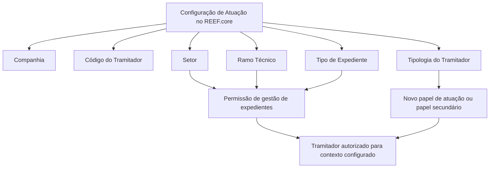

# Definição de Atuações do Tramitador no REEF.core

## 1. Metadados do Documento
- **Arquivo de Origem:** Não informado
- **Tipo de Documento:** Especificação Técnica / Funcional
- **Domínio / Sistema:** REEF.core — configuração de atuações de tramitadores
- **Público-Alvo:** Não identificado explicitamente; conteúdo voltado à configuração operacional de tramitadores
- **Data/Versão Identificada:** Não identificada

---

## 2. Resumo Executivo & Contexto de Negócio

O documento descreve a funcionalidade do sistema REEF.core para configurar atuações de tramitadores. A configuração permite que um tramitador cujo papel padrão não autorize a gestão de expedientes possa realizar essa gestão em um contexto delimitado por companhia, setor, ramo técnico e tipo de expediente.

A funcionalidade também permite alterar o papel de atuação principal previamente configurado para um tramitador ou atribuir um papel de atuação secundário. A autorização ou alteração é aplicável a combinações específicas da Estrutura de Produtos da Companhia.

A configuração está restrita a tramitadores com uma única tipologia entre: Recepcionista, Centro Telefônico, Tramitador Abogado ou Colaborador. O documento não detalha o comportamento do sistema para tipologias diferentes das quatro listadas.

O uso operacional mais habitual indicado é habilitar a gestão ou tramitação de expedientes por profissionais do centro telefônico. O documento ressalta que o uso não se destina principalmente à alteração do papel de atuação principal do tramitador.

---

## 3. Arquitetura, Componentes & Tecnologias Envolvidas

O documento cita o sistema **REEF.core** e a **Estrutura de Produtos da Companhia** como elementos funcionais relevantes. Não são detalhados microsserviços, APIs, métodos HTTP, contratos JSON, bancos de dados, ambientes técnicos, URLs ou mecanismos de persistência.

A configuração de atuações do tramitador é definida pelos atributos Companhia, Código do Tramitador, Setor, Ramo Técnico, Tipo de Expediente e Tipologia do Tramitador.



**Nota de Análise:** O documento não especifica componentes técnicos, integrações, serviços, persistência, interfaces de usuário ou fluxos de aprovação para a configuração.

---

## 4. Regras de Negócio, Especificações Funcionais & Processos

1. O REEF.core permite configurar uma atuação para que um tramitador, cujo papel normalmente impede a gestão de expedientes, possa gerir expedientes em uma combinação determinada de:
   - Companhia;
   - Setor;
   - Ramo Técnico;
   - Tipo de Expediente.

2. A funcionalidade também permite considerar a alteração do papel de atuação principal que o tramitador possua configurado previamente.

3. A configuração somente é permitida quando a tipologia do tramitador for exclusivamente uma das seguintes:
   - Recepcionista;
   - Centro Telefônico;
   - Tramitador Abogado;
   - Colaborador.

4. O atributo **Companhia** identifica o código da companhia sobre a qual a definição está sendo realizada.

5. O atributo **Código do Tramitador** identifica o código do tramitador no sistema.

6. O atributo **Setor** determina o setor da Estrutura de Produtos da Companhia:
   - para permitir ao tramitador gerir expedientes das respectivas apólices; ou
   - para considerar a alteração do papel de atuação principal do tramitador.
   - O valor genérico permitido para Setor é o código `9999`.

7. O atributo **Ramo Técnico** determina o ramo técnico da Estrutura de Produtos da Companhia:
   - para permitir ao tramitador gerir expedientes das respectivas apólices; ou
   - para considerar a alteração do papel de atuação principal do tramitador.
   - O valor genérico permitido para Ramo Técnico é o código `999`.

8. O atributo **Tipo de Expediente** identifica o tipo de expediente:
   - para o qual se pretende habilitar a gestão pelo tramitador; ou
   - para o qual é determinada a alteração no papel de atuação principal.
   - O valor genérico permitido para Tipo de Expediente é o código `ZZZ`.

9. O atributo **Tipologia do Tramitador** determina o novo papel de atuação, que pode ser um novo papel principal ou um papel de atuação secundário atribuído ao tramitador.

10. O uso mais frequente da funcionalidade é permitir a gestão ou tramitação de expedientes pelo pessoal do centro telefônico, e não alterar o papel de atuação principal do tramitador.

11. O documento recomenda a leitura do documento funcional **Definición Tramitadores** para evitar interpretações isoladas incorretas.

---

## 5. Tabelas de Parâmetros, Ambientes e Estruturas de Dados

| Item / Parâmetro | Descrição / Função | Tipo / Valores / Formato | Ambiente / Observações |
| :--- | :--- | :--- | :--- |
| Companhia | Indica o código da companhia para a qual a definição de atuação é realizada. | Código de companhia; formato não detalhado. | Aplicável à configuração no REEF.core. |
| Código do Tramitador | Identifica o código do tramitador no sistema. | Código de tramitador; formato não detalhado. | O documento não descreve origem ou validação do código. |
| Setor | Determina o setor da Estrutura de Produtos da Companhia para habilitar gestão de expedientes ou considerar mudança no papel principal. | Código de setor; aceita valor genérico `9999`. | Relacionado a expedientes das apólices. |
| Ramo Técnico | Determina o ramo técnico da Estrutura de Produtos da Companhia para habilitar gestão de expedientes ou considerar mudança no papel principal. | Código de ramo técnico; aceita valor genérico `999`. | Relacionado a expedientes das apólices. |
| Tipo de Expediente | Identifica o tipo de expediente para habilitação de gestão ou mudança no papel principal. | Código de tipo de expediente; aceita valor genérico `ZZZ`. | O documento não lista tipos concretos. |
| Tipologia do Tramitador | Determina o novo papel de atuação ou o papel secundário atribuído ao tramitador. | Recepcionista; Centro Telefônico; Tramitador Abogado; Colaborador. | Apenas essas tipologias são permitidas. |
| Papel de atuação principal | Papel previamente configurado para o tramitador, passível de alteração conforme a configuração. | Não detalhado. | A alteração não é o uso mais habitual da funcionalidade. |
| Papel de atuação secundário | Papel adicional que pode ser atribuído ao tramitador por meio da tipologia configurada. | Não detalhado. | O documento não informa regras de coexistência entre papéis. |
| Documento relacionado | Documento recomendado para complementar a interpretação funcional. | `Definición Tramitadores`. | Leitura recomendada. |

---

## 6. Bateria de Perguntas & Respostas para RAG (FAQ Sintético)

### P1: Qual é o objetivo da funcionalidade de atuações do tramitador no REEF.core?
**R:** A funcionalidade permite configurar condições para que um tramitador cujo papel normalmente não permite gerir expedientes possa realizar essa gestão para uma combinação determinada de companhia, setor, ramo técnico e tipo de expediente. Também pode ser utilizada para considerar uma alteração no papel de atuação principal previamente configurado.

### P2: Quais tipologias de tramitador podem utilizar a configuração de atuações?
**R:** A configuração só é permitida quando a tipologia do tramitador for exclusivamente Recepcionista, Centro Telefônico, Tramitador Abogado ou Colaborador.

### P3: Para que serve o campo Companhia na definição de atuações do tramitador?
**R:** O campo Companhia informa ao REEF.core o código da companhia sobre a qual está sendo realizada a definição de atuação do tramitador.

### P4: O que representa o Código do Tramitador?
**R:** O Código do Tramitador identifica o código do tramitador no sistema. O documento não especifica formato, origem ou regras adicionais de validação para esse código.

### P5: Qual valor genérico pode ser utilizado para o campo Setor?
**R:** O campo Setor pode utilizar o código genérico `9999`. O Setor determina o setor da Estrutura de Produtos da Companhia aplicável à habilitação de gestão de expedientes ou à consideração de mudança do papel principal.

### P6: Qual valor genérico pode ser utilizado para o campo Ramo Técnico?
**R:** O campo Ramo Técnico pode utilizar o código genérico `999`. O Ramo Técnico determina o ramo técnico da Estrutura de Produtos da Companhia associado à habilitação de gestão ou à alteração do papel de atuação principal.

### P7: Qual valor genérico pode ser utilizado para o Tipo de Expediente?
**R:** O Tipo de Expediente pode utilizar o código genérico `ZZZ`. Esse atributo identifica o tipo de expediente para o qual o tramitador será habilitado a gerir expedientes ou para o qual será considerada uma mudança de papel de atuação principal.

### P8: A configuração é usada principalmente para alterar o papel principal do tramitador?
**R:** Não. O documento informa que a utilização mais habitual é permitir a gestão ou tramitação de expedientes pelo pessoal do centro telefônico, e não modificar o papel de atuação principal do tramitador.

### P9: Qual é a função da Tipologia do Tramitador na configuração?
**R:** A Tipologia do Tramitador determina o novo papel de atuação atribuído ao tramitador, que pode ser um novo papel de atuação principal ou um papel de atuação secundário.

### P10: A quais elementos da Estrutura de Produtos da Companhia a configuração se relaciona?
**R:** A configuração se relaciona ao Setor e ao Ramo Técnico da Estrutura de Produtos da Companhia. Esses atributos delimitam o contexto para habilitar a gestão de expedientes de apólices ou para considerar a alteração do papel principal.

### P11: Existe documentação complementar recomendada?
**R:** Sim. O documento recomenda a leitura de **Definición Tramitadores**, pois a interpretação isolada do documento atual pode conduzir a erro.

### P12: O documento define APIs, contratos JSON ou métodos HTTP para essa funcionalidade?
**R:** Não. O conteúdo fornecido apresenta regras funcionais e atributos de configuração, mas não detalha APIs, métodos HTTP, contratos JSON, persistência, componentes técnicos ou integrações.

---

## 7. Glossário de Termos, Siglas & Conceitos-Chave

- **REEF.core:** Sistema mencionado como responsável pela funcionalidade de configuração de atuações de tramitadores.
- **Tramitador:** Profissional identificado no sistema por código e sujeito a regras de atuação e gestão de expedientes.
- **Atuação:** Configuração que habilita a gestão de expedientes para condições determinadas ou que altera o papel de atuação do tramitador.
- **Papel de atuação principal:** Papel configurado originalmente para o tramitador, passível de alteração conforme a configuração.
- **Papel de atuação secundário:** Papel adicional atribuído ao tramitador pela configuração de tipologia.
- **Expediente:** Entidade cuja gestão ou tramitação pode ser habilitada para o tramitador.
- **Setor:** Elemento da Estrutura de Produtos da Companhia; aceita o valor genérico `9999`.
- **Ramo Técnico:** Elemento da Estrutura de Produtos da Companhia; aceita o valor genérico `999`.
- **Tipo de Expediente:** Classificação do expediente; aceita o valor genérico `ZZZ`.
- **Centro Telefônico:** Uma das tipologias permitidas e o contexto de uso mais habitual citado pelo documento.
- **Tramitador Abogado:** Uma das tipologias de tramitador permitidas pelo documento.
- **Colaborador:** Uma das tipologias de tramitador permitidas pelo documento.
- **Recepcionista:** Uma das tipologias de tramitador permitidas pelo documento.

---

## 8. Notas Críticas, Riscos & Limitações

- O documento não informa o nome do arquivo de origem, data, versão, autor ou responsável pela manutenção.
- O documento não detalha interfaces de configuração, APIs, contratos de integração, métodos HTTP, estruturas de persistência ou trilhas de auditoria.
- O documento não especifica a precedência entre configurações específicas e valores genéricos `9999`, `999` e `ZZZ`.
- O documento não descreve o tratamento para tipologias de tramitador fora de Recepcionista, Centro Telefônico, Tramitador Abogado e Colaborador.
- O documento não detalha se um tramitador pode possuir simultaneamente mais de uma atuação secundária, nem como conflitos de papéis são resolvidos.
- A interpretação isolada pode conduzir a erro; a leitura de **Definición Tramitadores** é explicitamente recomendada.
- O uso principal declarado é a habilitação de gestão de expedientes pelo centro telefônico; mudanças de papel principal são apresentadas como uso menos frequente.

---

## 9. Conteúdo Bruto Estruturado (Referência Fiel)

```text
--- [PÁGINA 1 DE 3] ---

DEFINIR Actuaciones del Tramitador
Objetivo
Reef.core tiene la funcionalidad de poder configurar para permitir el que un tramitador, cuyo rol en
principio le impide gestionar expedientes, pueda hacerlo para un sector, ramo técnico y tipo de
expediente determinados o cambiar el rol de actuación principal que el tramitador tenga configurado
per se.
Esto está permitido siempre y cuando la tipología del Tramitador sea únicamente una de las
siguientes:
Recepcionista.
Centro Telefónico.
Tramitador Abogado, ó
Colaborador.
Propiedades Operativas
Propiedades Operativas
Compañía
Esta propiedad le indica al sistema el código de la compañía sobre la que se está realizando la
definición.
 / 
 CF
Home Solutions APIs Documentation Zeus
EN


--- [PÁGINA 2 DE 3] ---

Código del Tramitador
Este atributo identifica el código del tramitador en el Sistema.
Sector
Esta propiedad determina el Sector de la Estructura de Productos de la Compañía que se configura
para permitir al tramitador la gestión de los expedientes de sus pólizas o para el que se considera el
cambio en el rol de actuación principal del tramitador.
Se puede emplear el valor genérico de este campo (código 9999) en su configuración.
Ramo Técnico
Esta propiedad determina el ramo técnico de la Estructura de Productos de la Compañía que se
configura para permitir al tramitador la gestión de los expedientes de sus pólizas o para el que se
considera el cambio en el rol de actuación principal del tramitador.
Se puede emplear el valor genérico de este campo (código 999) en la configuración.
Tipo de Expediente
Este atributo identifica el tipo de expediente sobre el que se pretende habilitar al tramitador su
gestión o para el que se determina el cambio en el rol de actuación principal del tramitador.
Se puede emplear el valor genérico de este campo (código ZZZ) en la configuración.
Tipología del Tramitador
Este campo del determinará el nuevo rol de actuación (o rol de actuación secundario) asignado al
tramitador.
Vínculos
Relación de Directrices y Documentos funcionales cuya lectura recomendada para evitar que la
interpretación aislada del presente documento pueda conducir a error.
Definición Tramitadores
Consejo:
Consejo:
Consejo:


--- [PÁGINA 3 DE 3] ---

Preguntas frecuentes
(1) ¿Existe alguna particularidad operativa que deba ser tomada en consideración localmente en la
codificación, uso y configuración de las actuaciones secundarias de los Tramitadores en el Sistema?
Su empleo más habitual es para permitir la gestión o tramitación de los expedientes por parte del
personal del centro telefónico y no tanto para modificar el rol de actuación principal del tramitador.
```
