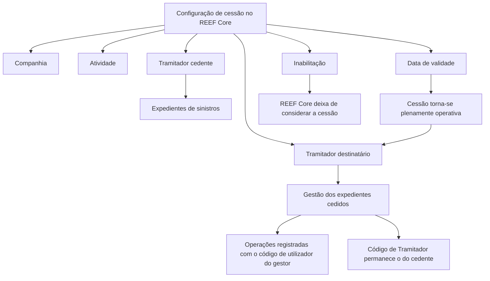

# Definição de Cessões Temporárias de Expedientes do TRAMITADOR no REEF Core

## 1. Metadados do Documento
- **Arquivo de Origem:** Não identificado
- **Tipo de Documento:** Especificação Técnica / Funcional
- **Domínio / Sistema:** REEF Core — gestão de sinistros e expedientes
- **Público-Alvo:** Operação, Analistas Funcionais, Configuradores e Desenvolvedores
- **Data/Versão Identificada:** Não identificada

---

## 2. Resumo Executivo & Contexto de Negócio

O documento descreve a funcionalidade de definição de cessões temporárias de expedientes no sistema REEF Core. A funcionalidade permite alterar a atribuição de expedientes que pertencem a um Tramitador para que outro Tramitador possa retomar a respetiva gestão.

A cessão temporária pode ser utilizada em situações operacionais como elevada carga de trabalho, necessidade de eficiência operacional, doença, férias ou baixa temporária do Tramitador originalmente responsável. A configuração determina um Tramitador cedente, um Tramitador destinatário e uma data a partir da qual a cessão se torna operacional.

A configuração é condicionada por informações de Companhia e Atividade. A Atividade é herdada do Bloco de Dados Básicos do Terceiro e identifica o código de atividade correspondente aos Tramitadores.

O documento também ressalta que limites máximos de expedientes atribuíveis a um Tramitador e a quantidade de sinistros pendentes podem condicionar a configuração da cessão, mesmo quando os demais critérios forem atendidos. Quando um Tramitador gere casos cedidos, as operações ficam registradas com o código de utilizador do gestor efetivo, enquanto o código de Tramitador permanece associado ao Tramitador cedente.

---

## 3. Arquitetura, Componentes & Tecnologias Envolvidas

O documento cita o sistema **REEF Core** como responsável pela operacionalidade de modificação de atribuição de Expedientes. Não há detalhes sobre arquitetura física, serviços, APIs, métodos HTTP, contratos JSON, bases de dados, URLs, ambientes ou tecnologias de implementação.

Componentes e conceitos identificados:

- **REEF Core:** sistema que suporta a configuração e consideração operacional das cessões.
- **Catálogo de configuração:** estrutura em que são definidos os atributos de cessão.
- **Tramitador cedente:** Tramitador que cede os expedientes de sinistros.
- **Tramitador destinatário:** Tramitador que recebe os expedientes de sinistros.
- **Companhia:** código da companhia sobre a qual a definição é realizada.
- **Atividade:** código de atividade dos Tramitadores, herdado do Bloco de Dados Básicos do Terceiro.
- **Inabilitação:** condição que faz o sistema deixar de considerar a cessão entre os Tramitadores envolvidos.



> *Nota de Análise: O documento menciona “Home Solutions APIs Documentation Zeus”, mas não descreve a sua relação técnica ou funcional com a cessão temporária de expedientes.*

---

## 4. Regras de Negócio, Especificações Funcionais & Processos

### Objetivo da cessão temporária

1. O REEF Core permite modificar a atribuição de Expedientes a um Tramitador.
2. A alteração permite que outro Tramitador retome a gestão dos Expedientes.
3. Os motivos operacionais explicitamente citados são:
   - Carga de trabalho;
   - Eficiência operacional;
   - Doença;
   - Férias;
   - Baixa temporária.

### Propriedades gerais e operativas

1. **Companhia**
   - Indica o código da companhia para a qual está sendo realizada a definição da cessão.

2. **Atividade**
   - É originada e herdada do Bloco de Dados Básicos do Terceiro.
   - Identifica o código de atividade correspondente aos Tramitadores.
   - A propriedade permite que, futuramente, sinistros ou expedientes possam ser cedidos entre Supervisores de Sinistros.
   - A funcionalidade de cessão entre Supervisores de Sinistros não está habilitada no momento descrito pelo documento.

3. **Tramitador cedente**
   - Contém o código do Tramitador que cede os expedientes dos sinistros.

4. **Tramitador destinatário**
   - Determina o código do Tramitador que recebe os expedientes dos sinistros.

5. **Data de validade**
   - Indica a data a partir da qual a cessão de Expedientes passa a existir e fica plenamente operativa no sistema.

6. **Inabilitação**
   - Determina que a cessão de Expedientes do Tramitador está inabilitada no sistema.
   - A partir da inabilitação, o sistema deixa de considerar a cessão de casos entre os Tramitadores envolvidos.

### Restrições e condicionantes operacionais

1. O número máximo de Expedientes que podem ser atribuídos a um Tramitador pode condicionar a configuração da cessão.
2. O número de sinistros pendentes que um Tramitador pode ter em determinado momento pode condicionar a configuração da cessão.
3. As condicionantes de capacidade podem afetar a configuração mesmo quando o Tramitador cumpre todos os demais critérios.
4. Quando um Tramitador gere sinistros ou expedientes de outro Tramitador:
   - As operações são registradas com o código de utilizador do Tramitador que efetivamente executa a operação.
   - O código de Tramitador permanece o código do Tramitador cedente.

### Documentos relacionados

O documento recomenda a leitura da documentação relacionada para evitar interpretações isoladas ou incorretas:

- **Definición de Tramitadores**

---

## 5. Tabelas de Parâmetros, Ambientes e Estruturas de Dados

| Item / Parâmetro | Descrição / Função | Tipo / Valores / Formato | Ambiente / Observações |
| :--- | :--- | :--- | :--- |
| Companhia | Identifica a companhia para a qual a definição de cessão é realizada. | Código de companhia | O formato do código não é detalhado. |
| Atividade | Identifica o código de atividade correspondente aos Tramitadores. | Código de atividade | Herdada do Bloco de Dados Básicos do Terceiro. |
| Tramitador cedente | Identifica o Tramitador que cede os Expedientes dos sinistros. | Código de Tramitador | O formato do código não é detalhado. |
| Tramitador destinatário | Identifica o Tramitador que recebe os Expedientes dos sinistros. | Código de Tramitador | O formato do código não é detalhado. |
| Data de validade | Define a data a partir da qual a cessão se torna plenamente operativa. | Data | O formato da data não é detalhado. |
| Inabilitação | Indica que a cessão não deve mais ser considerada pelo sistema. | Atributo de catálogo de configuração | Após a inabilitação, a cessão entre os envolvidos deixa de ser considerada. |
| Número máximo de Expedientes | Pode limitar a configuração da cessão. | Limite operacional | O valor máximo não é informado. |
| Número de sinistros pendentes | Pode limitar a configuração da cessão. | Indicador operacional | O limite aplicável não é informado. |
| Código de utilizador | Código utilizado para registrar operações executadas pelo gestor efetivo. | Código de utilizador | Diferente do código de Tramitador mantido no caso cedido. |
| Código de Tramitador | Código mantido nos casos cedidos. | Código de Tramitador | Permanece associado ao Tramitador cedente. |

---

## 6. Bateria de Perguntas & Respostas para RAG (FAQ Sintético)

### P1: Qual é o objetivo da cessão temporária de Expedientes no REEF Core?
**R:** A cessão temporária permite modificar a atribuição de Expedientes de um Tramitador para outro Tramitador. O objetivo é permitir que outro profissional retome a gestão dos casos por motivos como carga de trabalho, eficiência operacional, doença, férias ou baixa temporária.

### P2: Quais dados identificam uma cessão temporária de Expedientes?
**R:** A cessão utiliza as propriedades Companhia, Atividade, Tramitador cedente, Tramitador destinatário, Data de validade e Inabilitação. O documento não informa formatos técnicos, obrigatoriedade ou regras de validação de preenchimento para esses campos.

### P3: Quando uma cessão de Expedientes passa a ser operacional no sistema?
**R:** A cessão passa a tomar efeito e fica plenamente operativa a partir da Data de validade configurada no catálogo de configuração.

### P4: O que ocorre quando uma cessão é inabilitada?
**R:** A inabilitação determina que a cessão de Expedientes do Tramitador está inabilitada no sistema. A partir desse momento, o sistema deixa de considerar a cessão de casos entre os Tramitadores envolvidos.

### P5: O que é o Tramitador cedente?
**R:** O Tramitador cedente é o Tramitador cujo código identifica a pessoa responsável por ceder os Expedientes dos sinistros para gestão por outro Tramitador.

### P6: O que é o Tramitador destinatário?
**R:** O Tramitador destinatário é o Tramitador cujo código determina quem recebe os Expedientes dos sinistros cedidos pelo Tramitador cedente.

### P7: Como ficam registrados os acessos e operações realizadas por quem gere Expedientes cedidos?
**R:** As operações realizadas pelo Tramitador que efetivamente gere os sinistros ou Expedientes de outro Tramitador ficam registradas com o código de utilizador desse gestor. Contudo, o código de Tramitador mantido no caso continua sendo o do Tramitador que cedeu os casos.

### P8: Existem limites operacionais que podem impedir ou condicionar uma cessão?
**R:** Sim. O número máximo de Expedientes que podem ser atribuídos a um Tramitador e o número de sinistros pendentes que esse Tramitador possui em determinado momento podem condicionar a configuração da cessão, mesmo que os demais critérios sejam cumpridos.

### P9: Qual é a origem da propriedade Atividade?
**R:** A propriedade Atividade procede e é herdada do Bloco de Dados Básicos do Terceiro. Ela identifica o código de atividade que corresponde aos Tramitadores.

### P10: A cessão entre Supervisores de Sinistros está disponível?
**R:** Não. O documento informa que a propriedade Atividade pode permitir futuramente a cessão de sinistros ou Expedientes entre Supervisores de Sinistros, mas essa funcionalidade não está habilitada no momento descrito.

### P11: O documento define APIs, endpoints ou contratos de integração para a cessão?
**R:** Não. Embora o conteúdo mencione “Home Solutions APIs Documentation Zeus”, não há especificação de métodos HTTP, URLs, contratos JSON, autenticação, eventos ou integrações técnicas relacionadas à cessão temporária.

---

## 7. Glossário de Termos, Siglas & Conceitos-Chave

- **REEF Core:** Sistema citado como responsável pela operacionalidade de modificar a atribuição de Expedientes a um Tramitador.
- **Tramitador:** Entidade ou profissional identificado por código, responsável pela gestão de sinistros e Expedientes.
- **Tramitador cedente:** Tramitador que cede os Expedientes de sinistros.
- **Tramitador destinatário:** Tramitador que recebe os Expedientes de sinistros cedidos.
- **Expediente:** Caso associado a sinistros e gerido por um Tramitador, conforme o contexto do documento.
- **Sinistro:** Entidade operacional cujos Expedientes podem ser cedidos entre Tramitadores.
- **Companhia:** Código que identifica a companhia sobre a qual a definição de cessão é realizada.
- **Atividade:** Código de atividade associado aos Tramitadores e herdado do Bloco de Dados Básicos do Terceiro.
- **Bloco de Dados Básicos do Terceiro:** Origem da informação de Atividade, segundo o documento.
- **Catálogo de configuração:** Catálogo que contém atributos utilizados para definir e inabilitar a cessão.
- **Inabilitação:** Estado que faz o sistema deixar de considerar uma cessão entre Tramitadores.
- **Código de utilizador:** Código usado para registrar a operação realizada pelo gestor efetivo do caso.

---

## 8. Notas Críticas, Riscos & Limitações

- O documento não informa identificador, nome ou caminho do arquivo original.
- Não são especificados formatos, tipos técnicos, obrigatoriedade ou validações de entrada para Companhia, Atividade, códigos de Tramitador e Data de validade.
- Não são fornecidos valores para o número máximo de Expedientes atribuíveis nem para o número máximo de sinistros pendentes.
- Não há detalhamento sobre o comportamento do sistema quando os limites operacionais de capacidade são excedidos.
- Não há especificação de APIs, interfaces, persistência, auditoria técnica, permissões, URLs, ambientes ou integrações.
- A cessão entre Supervisores de Sinistros é citada como possibilidade futura, mas está explicitamente indisponível.
- A interpretação isolada do documento pode conduzir a erro; o próprio documento recomenda a leitura de **Definición de Tramitadores**.
- **Nota de Análise:** O documento lista a funcionalidade de cessão e os seus atributos, mas não detalha fluxos de criação, alteração, exclusão, aprovação ou consulta da configuração.

---

## 9. Conteúdo Bruto Estruturado (Referência Fiel)

```text
--- [PÁGINA 1 DE 2] ---

DEFINIR CESIONES TEMPORALES de
Expedientes del TRAMITADOR
Objetivo
Reef.core tiene la operatividad de modificar la asignación de los Expedientes a un Tramitador para
que algún otro tramitador pueda retomar su gestión (ya sea por carga de trabajo, eficiencia operativa,
enfermedad, vacaciones, baja temporal,...)
Propiedades Generales
Propiedades Operativas
Compañía
Esta propiedad le indica al sistema el código de la compañía sobre la que se está realizando la
definición.
Actividad
Este dato procede y se hereda del Bloque de Datos Básicos del Tercero e identifica el código de
actividad que le corresponde a los Tramitadores [9]
Esta propiedad permite el que en un futuro se puedan ceder siniestros/expedientes entre
Supervisores de Siniestros (Por ahora esta funcionalidad no está habilitada)
 / 
 CF
Home Solutions APIs Documentation Zeus
EN


--- [PÁGINA 2 DE 2] ---

Tramitador Cedente
Este atributo contiene el código del Tramitador que cede los expedientes de los siniestros.
Tramitador Destinatario
Esta propiedad, por el contrario, determinará el código del Tramitador que recibe los expedientes de
los siniestros.
Fecha de Validez
Esta propiedad le indica al Sistema la fecha a partir de la cual la cesión de expedientes tomará
cuerpo y estará plenamente operativa en el sistema.
Inhabilitación
Este atributo del catálogo de configuración determina que la cesión de expedientes del Tramitador
está inhabilitada en el Sistema por lo que a partir del momento de su inhabilitación no se va a
considerar la cesión de casos entre los tramitadores implicados.
Vínculos
Relación de Directrices y Documentos funcionales cuya lectura recomendada para evitar que la
interpretación aislada del presente documento pueda conducir a error.
Definición de Tramitadores
Preguntas frecuentes
¿Existe alguna particularidad operativa que deba ser tomada en consideración localmente en el uso y
configuración de las cesiones de Siniestros/Expedientes entre tramitadores?
(1) No debemos perder de vista que tanto en la cesión de casos como en la asignación y distribución
de Siniestros y Expedientes el número máximo de expedientes que se le puedan asignar a un
Tramitador y el número de siniestros pendientes que pueda tener en un momento determinado,
pueden condicionar (aunque el Tramitador cumpla justamente con todos los criterios) la configuración
de este catálogo.
(2) Cuando un tramitador gestiona los siniestros/expedientes de otro tramitador todas las
operaciones que realice quedarán registradas con su código de usuario, pero como código de
tramitador se mantendrá el del tramitador que cedió los casos.
```
