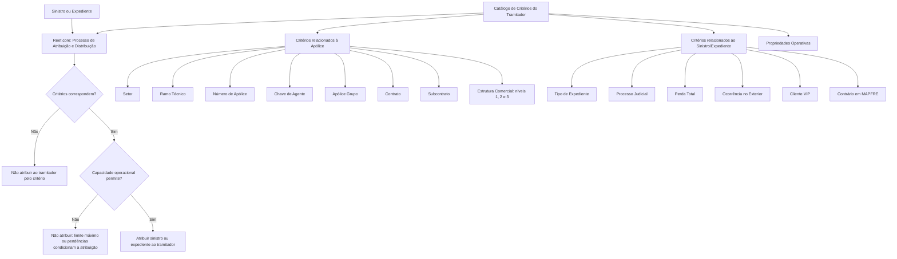

# Critérios de Atribuição e Distribuição de Sinistros/Expedientes para Tramitadores no Reef.core

## 1. Metadados do Documento
- **Arquivo de Origem:** `Não identificado — texto bruto fornecido na solicitação`
- **Tipo de Documento:** `Especificação Funcional`
- **Domínio / Sistema:** `Reef.core — gestão, atribuição e distribuição de sinistros/expedientes`
- **Público-Alvo:** `Analistas funcionais, gestores de sinistros, tramitadores, desenvolvedores e operação`
- **Data/Versão Identificada:** `Não identificada`

---

## 2. Resumo Executivo & Contexto de Negócio

O documento define critérios para atribuição e distribuição automática de sinistros e expedientes aos tramitadores de sinistros no sistema Reef.core. A atribuição pode considerar a carga de trabalho existente em determinado momento ou critérios previamente configurados no catálogo de critérios de atribuição.

O catálogo permite especializar um tramitador para gerir sinistros e expedientes com características específicas. Entre os critérios de especialização estão propriedades relacionadas à apólice, à estrutura de produtos, à estrutura comercial, ao tipo de expediente e a condições operacionais, como processos judiciais, perda total, ocorrência no exterior, clientes VIP e existência de contrário em MAPFRE.

A configuração pode direcionar sinistros de todos, vários ou apenas um setor e ramo técnico a um tramitador. Também permite associar a especialização a apólices, agentes, apólices de grupo, contratos, subcontratos e níveis da estrutura comercial.

O processo de atribuição não depende exclusivamente da correspondência entre o sinistro e os critérios configurados. Mesmo que um tramitador cumpra todos os critérios, a atribuição pode ser condicionada pelo número máximo de expedientes atribuíveis e pela quantidade de sinistros pendentes do tramitador naquele momento.

---

## 3. Arquitetura, Componentes & Tecnologias Envolvidas

O documento cita o sistema **Reef.core** como responsável pelo processo de atribuição e distribuição automática de sinistros e expedientes. O Reef.core utiliza um catálogo de critérios associado a cada tramitador e avalia características da apólice, do sinistro/expediente e condições operacionais antes de realizar a distribuição.

Os componentes e domínios explicitamente citados são:

- **Reef.core:** sistema que executa o processo de atribuição e distribuição.
- **Catálogo de critérios de atribuição:** configuração usada para especializar tramitadores.
- **Tramitador:** responsável pela gestão de sinistros e expedientes atribuídos.
- **Estrutura de Produtos:** origem das chaves de setor e ramo técnico.
- **Estrutura Comercial:** origem das chaves de primeiro, segundo e terceiro nível.
- **Módulo de Juízos:** módulo associado à identificação de sinistros e expedientes em processo judicial.
- **Apólice, apólice de grupo, contrato, subcontrato e agente/intermediário:** entidades usadas como critérios de especialização.
- **Sinistro/expediente:** unidade distribuída pelo processo de atribuição.



**Nota de Análise:** O documento não detalha métodos HTTP, contratos JSON, banco de dados, interfaces de usuário, algoritmos de priorização, integrações técnicas, APIs ou regras de precedência entre critérios simultaneamente aplicáveis.

---

## 4. Regras de Negócio, Especificações Funcionais & Processos

### 4.1. Modalidades de atribuição e distribuição

O Reef.core pode atribuir e distribuir automaticamente sinistros e expedientes ao conjunto de tramitadores de acordo com:

1. **Carga de trabalho do tramitador:** considera a carga que cada tramitador possui em determinado momento.
2. **Critérios configurados no catálogo de critérios de atribuição:** permite definir previamente especializações de gestão para cada tramitador.

No caso de configuração por critérios, o sistema pode especializar o tramitador para gerir sinistros ou expedientes associados, entre outros critérios, a:

- Uma apólice específica.
- Um ramo técnico específico.
- Um setor específico.

Quando um sinistro ou expediente possui as características configuradas, o processo pode atribuí-lo ao tramitador especializado correspondente.

### 4.2. Regras relacionadas ao tramitador

- O **Código do Tramitador** identifica o tramitador ao qual estão sendo concedidos os critérios de atribuição e distribuição de sinistros e expedientes.
- Os critérios devem ser compreendidos como configurações vinculadas a um tramitador identificado por esse código.

### 4.3. Critérios relacionados à apólice e à estrutura de produtos

#### Setor

- O setor identifica a chave do setor na Estrutura de Produtos.
- O setor é utilizado para especializar a gestão do tramitador em sinistros e expedientes cuja apólice pertença ao setor identificado.
- O Reef.core permite utilizar o **setor genérico de código `9999`** na configuração do catálogo.
- Por meio de combinações de configuração, um tramitador pode receber sinistros de:
  - Todos os setores.
  - Vários setores.
  - Um único setor.

#### Ramo Técnico

- O ramo técnico identifica a chave do ramo na Estrutura de Produtos da companhia.
- O ramo técnico permite especializar a gestão do tramitador para que sinistros e expedientes cujas apólices pertençam ao ramo identificado sejam atribuídos exclusivamente a esses tramitadores.
- O Reef.core permite utilizar o **setor genérico de código `999`** na configuração do catálogo, conforme registrado no documento.
- Em conjunto com o atributo Setor, o Ramo Técnico permite atribuir a um tramitador:
  - Sinistros de todos os ramos técnicos.
  - Sinistros de vários ramos técnicos.
  - Sinistros de um único ramo técnico.
  - Sinistros de todos os ramos técnicos de um setor específico.

#### Número de Apólice

- O número de apólice identifica uma apólice específica.
- A configuração é destinada a apólices que, por características técnicas, comerciais ou pela experiência de um tramitador, devem ter seus sinistros e expedientes geridos por determinado tramitador.

#### Chave de Agente

- A chave de agente identifica o intermediário.
- A chave de agente permite especializar a gestão para que sinistros e expedientes de apólices intermediadas pelo agente sejam atribuídos exclusivamente aos tramitadores configurados.

#### Apólice Grupo

- A apólice grupo identifica o código de uma apólice de grupo.
- O código permite especializar a gestão para que sinistros e expedientes associados à apólice grupo sejam atribuídos ao tramitador.

#### Contrato

- O contrato identifica o código de um contrato.
- O código do contrato permite especializar a gestão para que sinistros e expedientes de apólices associadas ao contrato sejam atribuídos ao tramitador.

#### Subcontrato

- O subcontrato identifica a chave de um subcontrato.
- A chave do subcontrato permite especializar a gestão para que sinistros e expedientes de apólices associadas ao subcontrato sejam atribuídos ao tramitador.

### 4.4. Critérios relacionados à estrutura comercial

#### Chave do Primeiro Nível

- Contém o código que identifica o primeiro nível da Estrutura Comercial.
- Permite especializar a gestão para que sinistros e expedientes de apólices associadas à chave possam ser atribuídos ao tramitador.

#### Chave do Segundo Nível

- Contém o código que identifica o segundo nível da Estrutura Comercial.
- Permite especializar a gestão para que sinistros e expedientes de apólices associadas à chave possam ser atribuídos ao tramitador.

#### Chave do Terceiro Nível

- Contém o código que identifica o terceiro nível da Estrutura Comercial no sistema.
- Permite especializar a gestão para que sinistros e expedientes de apólices associadas à chave possam ser atribuídos ao tramitador.

### 4.5. Critérios relacionados a sinistros e expedientes

#### Tipo de Expediente

- Identifica a chave de um tipo de dano.
- O tipo de expediente permite especializar a gestão do tramitador.
- O documento cita como exemplos:
  - `DPM — Daños Materiales Propios`.
  - `RC — Responsabilidad Civil`.
  - `DAP — Lesionados`.

#### Sinistros/Expedientes em Juízos

- O campo adapta o comportamento do Reef.core.
- Permite definir se o tramitador recebe ou não sinistros e expedientes que estejam em processo judicial.
- O documento relaciona essa condição ao módulo de Juízos.

#### Sinistros com Perda Total

- O campo modula o comportamento do processo de atribuição do Reef.core.
- Permite definir se o tramitador recebe ou não sinistros e expedientes identificados como perda total.

#### Sinistros ocorridos no Exterior

- O campo modula o processo de atribuição do Reef.core.
- Permite definir se o tramitador recebe ou não sinistros e expedientes identificados como ocorridos no exterior.

#### Sinistros de Clientes VIP

- O campo adapta o processo de atribuição implementado no Reef.core.
- Permite definir se o tramitador recebe ou não sinistros e expedientes pertencentes a apólices de clientes VIP.

#### Sinistros/Expedientes com contrário em MAPFRE

- O campo ajusta o processo de distribuição e atribuição de sinistros e expedientes.
- Permite definir se o tramitador recebe ou não expedientes com contrário em MAPFRE.

### 4.6. Restrição operacional de capacidade

A correspondência entre os critérios de atribuição e um sinistro ou expediente não assegura, isoladamente, que a atribuição será efetuada. O processo também considera:

1. O número máximo de expedientes que podem ser atribuídos ao tramitador.
2. O número de sinistros pendentes que o tramitador possui no momento da atribuição.

Essas condições podem impedir a atribuição mesmo quando o tramitador cumpre todos os critérios configurados.

---

## 5. Tabelas de Parâmetros, Ambientes e Estruturas de Dados

| Item / Parâmetro | Descrição / Função | Tipo / Valores / Formato | Ambiente / Observações |
| :--- | :--- | :--- | :--- |
| Código do Tramitador | Identifica o tramitador que recebe os critérios de atribuição e distribuição. | Código de tramitador. | O formato não é detalhado. |
| Setor | Identifica a chave do setor da Estrutura de Produtos para especialização de gestão. | Chave de setor; código genérico `9999`. | Pode permitir combinação para todos, vários ou um único setor. |
| Ramo Técnico | Identifica a chave do ramo da Estrutura de Produtos da companhia. | Chave de ramo; documento registra código genérico `999`. | Pode ser combinado com Setor para especializações por ramo e setor. |
| Número de Apólice | Identifica uma apólice específica cuja gestão deve ser tratada por determinado tramitador. | Chave de apólice. | Aplicável quando características técnicas, comerciais ou experiência justificarem a especialização. |
| Chave de Agente | Identifica o intermediário de apólices. | Chave de agente. | Especializa a gestão de apólices intermediadas pelo agente. |
| Apólice Grupo | Identifica o código de uma apólice de grupo. | Código de apólice grupo. | Direciona sinistros e expedientes associados à apólice grupo. |
| Contrato | Identifica o código de um contrato. | Código de contrato. | Direciona sinistros e expedientes de apólices associadas ao contrato. |
| Subcontrato | Identifica a chave de um subcontrato. | Chave de subcontrato. | Direciona sinistros e expedientes de apólices associadas ao subcontrato. |
| Chave do Primeiro Nível | Identifica o primeiro nível da Estrutura Comercial. | Código de estrutura comercial. | Permite atribuir sinistros/expedientes de apólices associadas à chave. |
| Chave do Segundo Nível | Identifica o segundo nível da Estrutura Comercial. | Código de estrutura comercial. | Permite atribuir sinistros/expedientes de apólices associadas à chave. |
| Chave do Terceiro Nível | Identifica o terceiro nível da Estrutura Comercial. | Código de estrutura comercial. | Permite atribuir sinistros/expedientes de apólices associadas à chave. |
| Tipo de Expediente | Identifica o tipo de dano para especialização do tramitador. | Exemplos: `DPM`, `RC`, `DAP`. | O catálogo completo de tipos de dano não é fornecido. |
| Sinistros/Expedientes em Juízos | Define se o tramitador pode receber itens em processo judicial. | Campo de inclusão ou exclusão; valores não detalhados. | Relacionado ao módulo de Juízos. |
| Sinistros com Perda Total | Define se o tramitador pode receber itens identificados como perda total. | Campo de inclusão ou exclusão; valores não detalhados. | Modula o processo de atribuição. |
| Sinistros ocorridos no Exterior | Define se o tramitador pode receber itens ocorridos no exterior. | Campo de inclusão ou exclusão; valores não detalhados. | Modula o processo de atribuição. |
| Sinistros de Clientes VIP | Define se o tramitador pode receber itens de apólices de clientes VIP. | Campo de inclusão ou exclusão; valores não detalhados. | Adapta o processo de atribuição. |
| Sinistros/Expedientes com contrário em MAPFRE | Define se o tramitador pode receber expedientes com contrário em MAPFRE. | Campo de inclusão ou exclusão; valores não detalhados. | Matiza o processo de distribuição e atribuição. |
| Número máximo de expedientes | Limita a quantidade máxima de expedientes atribuíveis a um tramitador. | Limite numérico; valor não informado. | Condiciona a atribuição mesmo com correspondência de critérios. |
| Número de sinistros pendentes | Representa a quantidade de sinistros pendentes de um tramitador em determinado momento. | Quantidade numérica; limiar não informado. | Condiciona a atribuição mesmo com correspondência de critérios. |

---

## 6. Bateria de Perguntas & Respostas para RAG (FAQ Sintético)

### P1: Como o Reef.core pode atribuir automaticamente sinistros e expedientes aos tramitadores?
**R:** O Reef.core pode realizar a atribuição automática com base na carga de trabalho existente em determinado momento ou conforme definições configuradas previamente no catálogo de critérios de atribuição. O catálogo especializa tramitadores segundo características da apólice, do sinistro/expediente e condições operacionais.

### P2: O que identifica o Código do Tramitador no catálogo de critérios de atribuição?
**R:** O Código do Tramitador identifica o tramitador ao qual são concedidos os critérios de atribuição e distribuição de sinistros e expedientes. O documento não especifica o formato técnico desse código.

### P3: Qual é o código genérico de Setor aceito pelo Reef.core?
**R:** O Reef.core permite utilizar o setor genérico de código `9999` na configuração do catálogo de critérios de atribuição. Por meio de combinações adequadas, essa configuração pode permitir a atribuição de sinistros de todos, vários ou um único setor a determinado tramitador.

### P4: Como Setor e Ramo Técnico podem ser usados conjuntamente?
**R:** Setor e Ramo Técnico podem ser combinados para especializar a gestão de um tramitador. Essa combinação pode direcionar sinistros de todos os ramos técnicos, de vários ramos técnicos, de um único ramo técnico ou de todos os ramos técnicos de um setor específico.

### P5: Qual código genérico é citado para o Ramo Técnico?
**R:** O documento informa que o Reef.core permite o uso do “sector genérico” de código `999` na configuração do catálogo relacionada ao Ramo Técnico. O texto não esclarece se a nomenclatura “sector genérico” nessa passagem é intencional nem define o comportamento técnico adicional desse código.

### P6: Em que situação o Número de Apólice deve ser utilizado como critério de atribuição?
**R:** O Número de Apólice deve ser utilizado quando uma apólice possui características técnicas ou comerciais especiais, ou quando a experiência de determinado tramitador justifica que esse profissional seja responsável pela gestão dos sinistros e expedientes da apólice.

### P7: Como a Chave de Agente influencia a atribuição de sinistros e expedientes?
**R:** A Chave de Agente identifica o intermediário. Quando configurada como critério de especialização, permite que sinistros e expedientes de apólices intermediadas pelo agente sejam atribuídos exclusivamente aos tramitadores correspondentes.

### P8: Quais tipos de dano são citados como exemplos de Tipo de Expediente?
**R:** O documento cita `DPM — Daños Materiales Propios`, `RC — Responsabilidad Civil` e `DAP — Lesionados` como exemplos de tipos de dano usados para especializar a gestão do tramitador. O documento não apresenta uma lista completa de tipos de expediente.

### P9: O tramitador pode ser configurado para receber apenas sinistros em processo judicial?
**R:** O campo “Se contemplam os Siniestros/Expedientes em Juízos” permite definir se um tramitador recebe ou não sinistros e expedientes que estejam em processo judicial, relacionado ao módulo de Juízos. O documento não apresenta os valores concretos nem regras adicionais de configuração do campo.

### P10: Quais condições operacionais podem restringir a atribuição mesmo quando os critérios são atendidos?
**R:** Mesmo que um tramitador cumpra todos os critérios configurados, a atribuição pode ser condicionada pelo número máximo de expedientes que podem ser atribuídos ao tramitador e pelo número de sinistros pendentes que ele possui no momento da distribuição.

### P11: Como o Reef.core trata sinistros com perda total, ocorrência no exterior ou clientes VIP?
**R:** O Reef.core possui campos que permitem definir se um tramitador pode ou não receber sinistros e expedientes identificados como perda total, ocorridos no exterior ou pertencentes a apólices de clientes VIP. O documento não especifica os nomes técnicos, valores ou formato desses campos.

### P12: O que significa configurar sinistros ou expedientes com contrário em MAPFRE?
**R:** Essa configuração ajusta o processo de distribuição e atribuição do Reef.core, permitindo definir se um tramitador recebe ou não expedientes com contrário em MAPFRE. O documento não detalha o conceito operacional de “contrário em MAPFRE”.

---

## 7. Glossário de Termos, Siglas & Conceitos-Chave

- **Reef.core:** Sistema citado como responsável pela atribuição e distribuição automática de sinistros e expedientes.
- **Tramitador:** Profissional responsável pela gestão de sinistros e expedientes atribuídos.
- **Sinistro:** Ocorrência cuja gestão pode ser atribuída a um tramitador.
- **Expediente:** Entidade tratada pelo processo de atribuição e distribuição juntamente com sinistros.
- **Catálogo de Critérios de Atribuição:** Configuração que define critérios de especialização e distribuição para tramitadores.
- **Estrutura de Produtos:** Estrutura de referência para as chaves de Setor e Ramo Técnico.
- **Estrutura Comercial:** Estrutura de referência para as chaves de Primeiro, Segundo e Terceiro Nível.
- **Setor:** Chave da Estrutura de Produtos usada para especializar a gestão de sinistros e expedientes.
- **Ramo Técnico:** Chave da Estrutura de Produtos da companhia usada para especializar a gestão de sinistros e expedientes.
- **Apólice Grupo:** Apólice identificada por um código de grupo que pode direcionar a gestão a um tramitador.
- **Agente / Intermediário:** Entidade identificada por chave e relacionada à intermediação de apólices.
- **Contrato:** Código usado para direcionar sinistros e expedientes de apólices associadas ao contrato.
- **Subcontrato:** Chave usada para direcionar sinistros e expedientes de apólices associadas ao subcontrato.
- **Juízos:** Módulo associado a sinistros e expedientes em processo judicial.
- **DPM:** `Daños Materiales Propios`, citado como exemplo de tipo de dano.
- **RC:** `Responsabilidad Civil`, citado como exemplo de tipo de dano.
- **DAP:** `Lesionados`, citado como exemplo de tipo de dano.
- **Perda Total:** Identificação de sinistro ou expediente que pode ser considerada no processo de atribuição.
- **Cliente VIP:** Cliente cuja apólice pode ser considerada no processo de atribuição.
- **Contrário em MAPFRE:** Condição de expediente considerada no processo de distribuição e atribuição; o documento não define o termo adicionalmente.

---

## 8. Notas Críticas, Riscos & Limitações

- O documento não informa a versão, data, autoria, identificador documental ou nome do arquivo de origem.
- O documento não descreve o algoritmo usado para balancear carga de trabalho entre tramitadores.
- Não são definidos valores, formatos, obrigatoriedade ou domínio de valores para os campos de configuração.
- Não há descrição de precedência, conflito ou desempate quando mais de um tramitador atende aos mesmos critérios.
- Não há detalhamento de como o limite máximo de expedientes e a quantidade de sinistros pendentes são calculados.
- Não são apresentados métodos HTTP, APIs, contratos de integração, estruturas JSON, tabelas de banco de dados, URLs, ambientes, credenciais, portas ou caminhos de log.
- O documento cita o módulo de Juízos, mas não detalha a integração ou os critérios usados para identificar um processo judicial.
- O documento recomenda a leitura dos materiais “Definição Tramitadores”, “Estrutura de Produtos” e “Estrutura Comercial” para evitar interpretação isolada incorreta.
- O texto registra `9999` como código genérico de Setor e `999` como “sector genérico” na seção de Ramo Técnico. A diferença deve ser validada no material funcional complementar antes de implementação ou configuração operacional.

---

## 9. Conteúdo Bruto Estruturado (Referência Fiel)

```text
--- [PÁGINA 1 DE 4] ---

DEFINIR CRITERIOS de ASIGNACIÓN del
TRAMITADOR
Objetivo
Reef.core tiene la funcionalidad de poder asignar y distribuir automáticamente los
siniestros/Expedientes al conjunto de Tramitadores de Siniestros de acuerdo con:
La carga de trabajo que tengan asignada en un momento determinado o
De acuerdo con las definiciones realizadas ex-profeso en el catálogo de criterios de asignación
En este segundo caso se configura el Sistema para que el Tramitador pueda especializarse en la
gestión de siniestros de, entre otros criterios, una póliza en particular, de un Ramo Técnico o de un
Sector en concreto y de esta manera los siniestros/expedientes con esas características le sean
asignados.
Propiedades Relacionadas con la Póliza
Propiedades Relacionadas con los Siniestros/Expedientes
Propiedades Operativas
Código del Tramitador
Este dato identifica el código del Tramitador al que se le están otorgando los criterios de asignación y
distribución de Siniestros/expedientes.
Sector
 /
 CF
Home Solutions APIs Documentation Zeus
EN


--- [PÁGINA 2 DE 4] ---

Esta propiedad identifica la clave del sector de la Estructura de Productos, para 'especializar' las
labores de Gestión del Tramitador para los siniestros/expedientes cuya póliza pertenezca al sector
identificado.
Reef.core permite el uso del sector genérico (código 9999) en la configuración de este catálogo.
De esta manera y realizando las combinaciones adecuadas, a un Tramitador determinado se le
podrán asignar los siniestros de todos, de varios o de un único Sector.
Ramo Técnico
Esta propiedad identifica la clave del Ramo de la Estructura de Productos de la Compañía, clave que
a su vez permitirá 'especializar' las labores de Gestión del Tramitador para que los
siniestros/expedientes cuya póliza sean del ramo con esta clave sean asignados únicamente a ellos.
Reef.core permite el uso del sector genérico (código 999) en la configuración de este catálogo.
De esta manera y realizando las combinaciones adecuadas (conjuntamente con el atributo del
Sector), a un Tramitador determinado se le podrán asignar los siniestros de todos, de varios o de
un único Ramo Técnico, de todos los Ramos Técnicos de un Sector en particular, etcétera.
Número de Póliza
Esta propiedad identifica la clave de una Póliza en la que por sus especiales características técnicas
o comerciales o por la experiencia del Tramitador la entidad considere adecuado sea un Tramitador
determinado quien se encargue y responsabilice de la Gestión de sus Siniestros y/o expedientes.
Clave de Agente
Esta propiedad identifica la clave del intermediario, , clave que permitirá 'especializar' las labores de
Gestión del Tramitador para que los siniestros/expedientes de las pólizas intermediadas por el
Agente sean asignados únicamente a ellos.
Póliza Grupo
Esta propiedad identifica el Código de una póliza Grupo, código que permitirá 'especializar' las
labores de Gestión del Tramitador para que los siniestros/expedientes asociados a la póliza grupo le
sean asignados.
Contrato
Consejo:
Consejo:


--- [PÁGINA 3 DE 4] ---

Esta propiedad identifica el código de un Contrato, código que permite a Reef.core 'especializar' las
labores de Gestión del Tramitador para que los siniestros/expedientes de las pólizas asociadas a
dicho Contrato le sean asignados.
Subcontrato
Esta propiedad identifica la clave de un Subcontrato que permite 'especializar' las labores de Gestión
del Tramitador para que los siniestros/expedientes de las pólizas asociadas a dicho Subcontrato le
sean asignados.
Clave del Primer Nivel
Este atributo contiene el código por el que se identifica el Primer Nivel de la Estructura Comercial,
que permite 'especializar' las labores de Gestión del Tramitador para que los siniestros/expedientes
de las pólizas asociadas a dicha Clave le puedan ser asignados.
Clave del Segundo Nivel
Este atributo contiene el código por el que se identificará el Segundo Nivel de la Estructura
Comercial, que permite 'especializar' las labores de Gestión del Tramitador para que los
siniestros/expedientes de las pólizas asociadas a dicha Clave le puedan ser asignados.
Clave del Tercer Nivel
Este atributo contiene el código por el que se identificará el Tercer Nivel de la Estructura Comercial
en el Sistema que permite 'especializar' las labores de Gestión del Tramitador para que los
siniestros/expedientes de las pólizas asociadas a dicha Clave puedan serle asignados.
Propiedades de Siniestros Expedientes
Tipo de Expediente
Esta propiedad identifica la clave de un 'tipo de daño' determinado (DPM - Daños Materiales
Propios,RC - Responsabilidad Civil, DAP - Lesionados,...) que permite especializar la gestión del
Tramitador.
Se contemplan los Siniestros/Expedientes en Juicios
Este campo adapta el comportamiento de Reef.core permitiendo que al Tramitador se le asignen o no
los Siniestros y Expedientes que estén en proceso Judicial (módulo de Juicios).
Se contemplan los Siniestros con Pérdida Total
Este campo modula el comportamiento del Proceso de Asignación de Reef.core permitiendo que al
Tramitador se le asignen o no los Siniestros y Expedientes que estén identificados como pérdida


--- [PÁGINA 4 DE 4] ---

total.
Se contemplan los Siniestros acaecidos en el Extranjero
Este campo modula el Proceso de Asignación de Reef.core permitiendo que al Tramitador se le
asignen o no los Siniestros y Expedientes que estén identificados como que hayan ocurrido en el
Extranjero.
Se contemplan los Siniestros de Clientes VIP
Este campo adapta el Proceso de Asignación implementado en Reef.core permitiendo que al
Tramitador se le asignen o no los Siniestros y Expedientes que pertenezcan a pólizas de Clientes
VIP.
Se contemplan los Siniestros/Expedientes con Contrario en MAPFRE
Este campo matiza el Proceso de Distribución y Asignación de Siniestros/Expedientes de Reef.core
permitiendo que al Tramitador se le asignen o no los Expedientes con contrario en MAPFRE.
Vínculos
Relación de Directrices y Documentos funcionales cuya lectura recomendada para evitar que la
interpretación aislada del presente documento pueda conducir a error.
Definición Tramitadores
Estructura de Productos
Estructura Comercial
Preguntas frecuentes
(1) ¿Existe alguna particularidad operativa que deba ser tomada en consideración localmente en la
codificación, uso y definición de los Criterios de Asignación de Siniestros para los Tramitadores en el
Sistema?
No debemos perder de vista que en el proceso de asignación y distribución de Siniestros y
Expedientes tanto el número máximo de expedientes que se le puedan asignar a un Tramitador
como el número de siniestros pendientes que pueda tener en un momento determinado,
condicionarán (aunque el Tramitador cumpla justamente con todos los criterios) su asignación.
```
