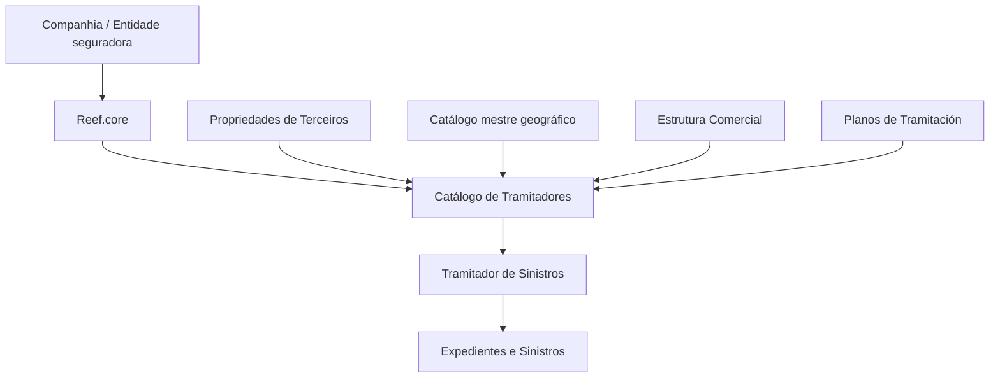

# Configuração de Informações do Tramitador de Sinistros no Reef.core

## 1. Metadados do Documento
- **Arquivo de Origem:** Não identificado no conteúdo fornecido
- **Tipo de Documento:** Especificação Técnica / Manual Funcional
- **Domínio / Sistema:** Reef.core — módulo de sinistros
- **Público-Alvo:** Analistas funcionais, desenvolvedores, administradores de catálogo e operação de sinistros
- **Data/Versão Identificada:** Não identificada

---

## 2. Resumo Executivo & Contexto de Negócio

O documento define a configuração das informações de um **Tramitador de Siniestros** no sistema Reef.core. Um tramitador é a pessoa responsável por gerir expedientes de sinistros, assegurando a aderência às políticas e aos procedimentos de atuação estabelecidos pela Direção Técnica de Sinistros da entidade seguradora.

Funcionalmente, o núcleo do sistema permite identificar e configurar pessoas físicas ou jurídicas que atuarão como tramitadores no módulo de sinistros. A definição é composta por propriedades identificativas, dados de contato, propriedades operacionais e outras propriedades administrativas.

A configuração operacional permite especializar a atuação de um tramitador por setor, ramo técnico, apólice e tipo de expediente. O Reef.core também prevê códigos genéricos para setor e ramo técnico, permitindo configurações aplicáveis a múltiplos contextos de sinistro.

A definição inclui controles de capacidade e comportamento operacional, como número de expedientes pendentes, limite diário de expedientes atribuíveis, possibilidade de exibir pergunta em vez de descrição e autorização para alterar a data de controle. O cadastro também suporta inabilitação e vigência, permitindo histórico e rastreabilidade das alterações realizadas.

---

## 3. Arquitetura, Componentes & Tecnologias Envolvidas

O conteúdo descreve uma estrutura funcional de cadastro no **Reef.core**, sem detalhar arquitetura de infraestrutura, protocolos, APIs, microsserviços, bancos de dados, URLs ou ambientes técnicos.

Os componentes funcionais identificados são:

- **Reef.core:** Sistema que armazena e aplica a configuração do tramitador.
- **Módulo de sinistros:** Módulo no qual os tramitadores gerenciam expedientes e sinistros.
- **Catálogo de Tramitadores:** Catálogo que contém dados identificativos, de contato, operacionais e administrativos do tramitador.
- **Configuração da Entidade / Companhia:** Contexto de companhia no qual ocorre a definição do tramitador.
- **Catálogo mestre geográfico:** Fonte dos possíveis valores de país, estado, província e localidade.
- **Estrutura Comercial:** Estrutura cujo terceiro nível identifica a Oficina Tramitadora de Sinistros.
- **Planos de Tramitación:** Configuração corporativa que condiciona a possibilidade de alteração da Fecha de Control.
- **Entidade, Terceiros, Supervisores e Usuários da Companhia:** Domínios relacionados, citados como leitura recomendada.



> **Nota de Análise:** O documento apresenta relações funcionais entre catálogos e configurações do Reef.core, mas não detalha interfaces técnicas, contratos de integração, métodos HTTP, tecnologias de persistência ou fluxo de comunicação entre sistemas.

---

## 4. Regras de Negócio, Especificações Funcionais & Processos

### 4.1 Papel do Tramitador

Um Tramitador de Siniestros é a pessoa responsável pela gestão dos expedientes de sinistros, observando as políticas e procedimentos definidos pela Direção Técnica de Sinistros da entidade seguradora.

O Reef.core permite configurar pessoas físicas ou jurídicas que atuarão como tramitadores no módulo de sinistros.

### 4.2 Identificação do Tramitador

A definição do tramitador deve estar associada a uma companhia. A identificação considera tipo e chave de documento identificador, código de atividade do terceiro, tipologia, supervisor, código do tramitador e código de usuário.

A tipologia do tramitador deve corresponder a um dos valores previamente configurados no Reef.core.

### 4.3 Localização e Dados de Contato

A localização do tramitador utiliza a estrutura geográfica configurada no sistema:

1. **País:** primeiro nível da estrutura geográfica.
2. **Estado:** segundo nível da estrutura geográfica.
3. **Província:** terceiro nível da estrutura geográfica.
4. **Localidade:** quarto nível da estrutura geográfica.
5. **Nome da Localidade:** nome do quarto nível geográfico.
6. **Código Postal:** chave associada aos cinco níveis da estrutura geográfica da direção do terceiro.

O endereço corporativo pode utilizar tipo de via, duas linhas de endereço, número, portal, piso/planta, letra, escada e urbanização/polígono.

Os dados de contato incluem prefixo telefônico do país, prefixo zonal, número telefônico, extensão telefônica, número de fax e endereço de correio eletrônico corporativo.

### 4.4 Especialização Operacional

O tramitador pode ser especializado mediante os seguintes critérios:

- **Sector:** associa a gestão do tramitador aos sinistros de um setor específico.
- **Ramo Técnico:** associa a gestão do tramitador aos sinistros de um ramo técnico específico.
- **Número de Póliza:** permite determinar um tramitador específico para expedientes e sinistros de uma apólice com características especiais.
- **Tipo de Expediente:** permite especializar a gestão por tipo de expediente, como DPM, RC ou DAP.
- **Oficina Tramitadora:** associa o tramitador ao terceiro nível da Estrutura Comercial.

### 4.5 Regras de Códigos Genéricos

- O Reef.core permite configurar o **setor genérico com código `9999`** para o tramitador.
- O Reef.core permite configurar o **ramo técnico genérico com código `999`**.
- O ramo técnico genérico implica que o tramitador pode gerir expedientes de sinistros de todos os ramos técnicos definidos no sistema.

### 4.6 Capacidade, Estado e Comportamento do Tramitador

O estado do tramitador deve ser um dos valores configurados no Reef.core.

O número de expedientes pendentes é atualizado sempre que ocorre uma das seguintes ações sobre um expediente:

- Abertura do expediente.
- Finalização do expediente.
- Atribuição do expediente.
- Reatribuição do expediente.

O número máximo de expedientes atribuídos identifica a quantidade máxima de expedientes que podem ser atribuídos diariamente a um tramitador.

Quando a propriedade **Pregunta vs. Descripción** está ativa, o Reef.core apresenta a pergunta associada à consequência em vez de apresentar a descrição dessa consequência.

A alteração da **Fecha de Control** pelo tramitador somente é permitida quando:

1. A propriedade correspondente está habilitada na configuração do tramitador.
2. A companhia indicou que os Planos de Tramitación trabalharão com a Fecha de Control.

### 4.7 Inabilitação e Vigência

A propriedade de inabilitação informa ao sistema que o tramitador está desativado.

Quando o tramitador está inabilitado, deve ser indicado o código da causa de inabilitação do terceiro, de acordo com o código de atividade do terceiro.

A data de validade determina a partir de qual data a definição do tramitador estará disponível para uso no sistema. A configuração correta da data de validade permite manter histórico das alterações de definição e rastrear ou explorar posteriormente essas informações.

---

## 5. Tabelas de Parâmetros, Ambientes e Estruturas de Dados

| Item / Parâmetro | Descrição / Função | Tipo / Valores / Formato | Ambiente / Observações |
| :--- | :--- | :--- | :--- |
| Compañía | Indica o código da companhia para a qual a definição do tramitador é realizada. | Código de companhia | Aplicável à definição do tramitador. |
| Tipo Documento Identificador | Define o tipo de documento usado para identificar o tramitador como pessoa física ou jurídica. | Tipo de documento previamente configurado | Deve pertencer aos tipos de documentos configurados no sistema. |
| Clave del Documento Identificador | Contém a chave do tramitador associada ao tipo de documento identificador. | Chave de documento | Associada ao Tipo Documento Identificador. |
| Código de Actividad del Tercero | Indica o código da atividade do terceiro. | Código de atividade | Utilizado também no contexto da causa de inabilitação. |
| Tipología del Tramitador | Indica a tipologia do tramitador. | Valor configurado no Reef.core | Deve ser um dos valores possíveis configurados no Reef.core. |
| Código del Supervisor | Identifica o supervisor do sistema ao qual o tramitador será atribuído. | Código de supervisor | Relação entre tramitador e supervisor. |
| Código del Tramitador | Identifica o código do tramitador no sistema. | Código | Identificação interna do tramitador. |
| Clave de Usuario | Contém o código do usuário. | Código de usuário | Atributo do catálogo de tramitadores da entidade. |
| País | Código do primeiro nível da estrutura geográfica da direção do tramitador. | Código geográfico | Valor proveniente do catálogo mestre do sistema. |
| Estado | Código do segundo nível da estrutura geográfica da direção do tramitador. | Código geográfico | Valor proveniente do catálogo mestre do sistema. |
| Provincia | Código do terceiro nível da estrutura geográfica da direção do tramitador. | Código geográfico | Valor proveniente do catálogo mestre do sistema. |
| Localidad | Código do quarto nível da estrutura geográfica da direção do tramitador. | Código geográfico | Valor proveniente do catálogo mestre do sistema. |
| Nombre de la Localidad | Nome do quarto nível da estrutura geográfica. | Texto | Relacionado à localidade. |
| Código Postal | Chave que identifica o código postal associado aos cinco níveis da estrutura geográfica. | Chave de código postal | Aplicável à direção do terceiro. |
| Extensión Postal | Contém a extensão do código postal. | Extensão de código postal | O documento o cita como atributo do catálogo de supervisores. |
| Tipo de Domicilio | Tipo de via associado ao tramitador conforme codificação local da seguradora. | Código de tipo de via | Exemplo: Calle, Avenida, Plaza, Carretera, Eje Vial. |
| Domicilio `<1>` | Primeira parte do endereço corporativo do tramitador. | Texto | Pode conter informação complementar de localização. |
| Domicilio `<2>` | Segunda parte do endereço corporativo do tramitador. | Texto | Complementa Domicilio `<1>`. |
| Número | Número da via do endereço do tramitador. | Número / texto conforme codificação local | Associado ao tipo de via. |
| Portal | Número do portal do endereço, se necessário. | Número / texto | Opcional conforme necessidade. |
| Piso | Número do piso ou planta, se necessário. | Número / texto | Opcional conforme necessidade. |
| Letra | Letra do endereço, quando necessária. | Texto | Opcional conforme necessidade. |
| Escalera | Escada que identifica o endereço, quando necessária. | Texto / código | Opcional conforme necessidade. |
| Urbanización/Polígono | Urbanização, desenvolvimento urbano, polígono ou informação equivalente. | Texto | Opcional conforme necessidade. |
| Prefijo Telefónico del País | Prefixo internacional do telefone corporativo do tramitador. | Prefixo telefônico | Exemplos: Espanha `+34`, México `+52`, Argentina `+54`. |
| Prefijo Zonal Telefónico | Prefixo zonal correspondente ao telefone corporativo do tramitador. | Prefixo telefônico local | Exemplos: Madrid `91`, Barcelona `93`, Monterrey `81`, Ciudad de México `55`. |
| Número Telefónico | Número telefônico do tramitador. | Número telefônico | Dado de contato corporativo. |
| Extensión Telefónica | Extensão do telefone corporativo, se necessária. | Número / texto | Opcional. |
| Número Fax | Número telefônico do fax corporativo do tramitador. | Número telefônico | Dado de contato corporativo. |
| Dirección Correo Electrónico | Endereço de correio eletrônico corporativo do tramitador. | E-mail | Dado de contato corporativo. |
| Sector | Chave do setor para especializar a gestão do tramitador. | Código de setor | Código genérico permitido: `9999`. |
| Ramo Técnico | Chave do ramo técnico para especializar a gestão do tramitador. | Código de ramo técnico | Código genérico permitido: `999`; habilita gestão de todos os ramos técnicos. |
| Número de Póliza | Chave de apólice para a qual um tramitador específico será responsável. | Chave de apólice | Aplicável a apólices com características especiais. |
| Tipo de Expediente | Chave de tipo de expediente para especializar a gestão. | Exemplos: `DPM`, `RC`, `DAP` | DPM = Daños Materiales Propios; RC = Responsabilidad Civil; DAP = Lesionados. |
| Oficina Tramitadora | Código do terceiro nível da Estrutura Comercial ao qual o tramitador é atribuído. | Código de estrutura comercial | Identifica a Oficina Tramitadora de Siniestros. |
| Estado | Estado do tramitador na data de consulta. | Valor configurado no Reef.core | Deve corresponder a um valor possível configurado no Reef.core. |
| Número de Expedientes Pendientes | Quantidade de expedientes pendentes atribuídos ao tramitador. | Número | Atualizado na abertura, finalização, atribuição ou reatribuição de expedientes. |
| Número Máximo de Expedientes Asignados | Quantidade máxima de expedientes que podem ser atribuídos diariamente ao tramitador. | Número | Limite diário de atribuição. |
| Pregunta vs. Descripción | Define se o Reef.core mostra a pergunta associada à consequência em vez da descrição. | Propriedade ativada ou não ativada | Altera o comportamento de apresentação do Reef.core. |
| Se permite modificar la Fecha de Control | Define se o tramitador pode modificar a Fecha de Control. | Propriedade habilitada ou não habilitada | Depende também da configuração da companhia nos Planos de Tramitación. |
| Inhabilitación | Indica que o tramitador está desativado. | Propriedade de status | Quando ativa, exige consideração da causa de inabilitação. |
| Código de la Causa de Inhabilitación | Código da causa de inabilitação do terceiro. | Código | Aplicável quando o tramitador está inabilitado e conforme código de atividade do terceiro. |
| Fecha de Validez | Data a partir da qual a definição do tramitador estará disponível no sistema. | Data | Permite histórico, rastreabilidade e exploração posterior das alterações. |

### Valores exemplificados para Tipo de Domicilio

| Código | Tipo de Via | Descrição |
| :--- | :--- | :--- |
| `001` | Calle | Calle |
| `002` | Avenida | Avenida |
| `003` | Plaza | Plaza |
| `004` | Carretera | Carretera |
| `005` | Eje Vial | Eje Vial |

---

## 6. Bateria de Perguntas & Respostas para RAG (FAQ Sintético)

### P1: Qual é a responsabilidade de um Tramitador de Siniestros no Reef.core?
**R:** Um Tramitador de Siniestros é a pessoa responsável por gerir expedientes de sinistros, garantindo o cumprimento das políticas e dos procedimentos de atuação definidos pela Direção Técnica de Sinistros da entidade seguradora.

### P2: O Reef.core permite configurar tramitadores como pessoas físicas e jurídicas?
**R:** Sim. O núcleo funcional do sistema permite identificar e configurar as informações de pessoas físicas ou jurídicas que atuarão como tramitadores no módulo de sinistros.

### P3: Quais dados identificam um tramitador no catálogo?
**R:** O catálogo inclui companhia, tipo de documento identificador, chave do documento identificador, código de atividade do terceiro, tipologia do tramitador, código do supervisor, código do tramitador e chave de usuário.

### P4: Quais níveis geográficos são usados para configurar a direção do tramitador?
**R:** A direção utiliza país como primeiro nível, estado como segundo nível, província como terceiro nível e localidade como quarto nível da estrutura geográfica. O cadastro também contempla o nome da localidade e o código postal associado aos cinco níveis da estrutura geográfica.

### P5: Qual é o código do setor genérico permitido pelo Reef.core na configuração de um tramitador?
**R:** O Reef.core permite utilizar o código de setor genérico `9999` na configuração do tramitador.

### P6: O que significa usar o ramo técnico genérico `999`?
**R:** O código `999` representa o ramo técnico genérico. Quando utilizado na configuração do tramitador, implica que o tramitador pode gerir expedientes de sinistros de todos os ramos técnicos definidos no sistema.

### P7: Quando o número de expedientes pendentes de um tramitador é atualizado?
**R:** O número de expedientes pendentes é atualizado sempre que um expediente é aberto, finalizado, atribuído ou reatribuído ao tramitador.

### P8: Como funciona o limite máximo diário de expedientes atribuídos?
**R:** A propriedade Número Máximo de Expedientes Asignados identifica a quantidade máxima de expedientes que podem ser atribuídos diariamente ao tramitador.

### P9: O que ocorre quando a propriedade “Pregunta vs. Descripción” está ativada?
**R:** Quando essa propriedade está ativada na configuração do tramitador, o Reef.core exibe a pergunta associada à consequência em vez de exibir a descrição da consequência.

### P10: Em quais condições um tramitador pode modificar a Fecha de Control?
**R:** O tramitador pode modificar a Fecha de Control somente se a propriedade correspondente estiver habilitada em sua configuração e se a companhia tiver indicado, nos Planos de Tramitación, que trabalhará com a Fecha de Control.

### P11: O que deve ser informado quando um tramitador está inabilitado?
**R:** Quando o tramitador está inabilitado, deve ser informado o Código de la Causa de Inhabilitación do terceiro no sistema, de acordo com o código de atividade do terceiro.

### P12: Qual é a função da Fecha de Validez na definição do tramitador?
**R:** A Fecha de Validez determina a partir de qual data a definição do tramitador fica disponível no sistema. Uma configuração correta permite manter histórico das alterações, rastrear a evolução das definições e explorar posteriormente essas informações.

---

## 7. Glossário de Termos, Siglas & Conceitos-Chave

- **Reef.core:** Sistema mencionado como responsável pela configuração e pelo comportamento do catálogo de tramitadores.
- **Tramitador de Siniestros:** Pessoa responsável por gerir expedientes de sinistros segundo políticas e procedimentos da Direção Técnica de Sinistros.
- **Expediente:** Registro ou processo de sinistro gerido pelo tramitador.
- **Siniestro:** Sinistro tratado no módulo de sinistros.
- **Catálogo de Tramitadores:** Estrutura de cadastro que armazena propriedades identificativas, de contato, operacionais e administrativas do tramitador.
- **Tercero:** Entidade ou pessoa associada a propriedades de terceiros no sistema.
- **Sector:** Critério que permite especializar a gestão do tramitador para sinistros de um setor concreto.
- **Ramo Técnico:** Critério que permite especializar a gestão do tramitador para sinistros de um ramo técnico particular.
- **DPM:** Daños Materiales Propios.
- **RC:** Responsabilidad Civil.
- **DAP:** Lesionados.
- **Oficina Tramitadora:** Unidade identificada pelo terceiro nível da Estrutura Comercial à qual o tramitador é atribuído.
- **Fecha de Control:** Data cujo tratamento pode ser configurado nos Planos de Tramitación e cuja alteração pode ser autorizada para o tramitador.
- **Planos de Tramitación:** Configuração em nível de companhia relacionada ao trabalho com a Fecha de Control.
- **Inhabilitación:** Propriedade que indica que o tramitador está desativado.
- **Fecha de Validez:** Data a partir da qual a definição do tramitador pode ser utilizada no sistema.

---

## 8. Notas Críticas, Riscos & Limitações

- O documento não especifica tecnologias, APIs, integrações, URLs, protocolos, bancos de dados, modelos de segurança ou mecanismos de auditoria técnica.
- A tipologia e o estado do tramitador dependem de valores previamente configurados no Reef.core; os valores permitidos não são enumerados no conteúdo.
- Os valores geográficos dependem da relação existente no catálogo mestre do sistema; a estrutura e os códigos concretos desse catálogo não são detalhados.
- A capacidade de modificar a Fecha de Control depende de duas configurações: permissão no tramitador e habilitação da Fecha de Control nos Planos de Tramitación da companhia.
- A correta utilização da Fecha de Validez é necessária para preservar histórico e rastreabilidade das alterações de definição.
- A interpretação isolada do documento pode conduzir a erro. O próprio conteúdo recomenda a leitura de documentação sobre Estrutura de Produtos, Supervisores, Usuários da Companhia e Perguntas Frequentes.
- **Nota de Análise:** O documento lista o catálogo e as regras de configuração do tramitador, mas não detalha procedimentos de criação, alteração, consulta, exclusão, validação de campos obrigatórios ou permissões de acesso.

---

## 9. Conteúdo Bruto Estruturado (Referência Fiel)

```text
--- [PÁGINA 1 DE 7] ---

DEFINIR Información del TRAMITADOR de
SINIESTROS
Contexto
Un Tramitador de Siniestros es aquella persona responsable de gestionar los expedientes de los
siniestros velando por el cumplimiento de las Políticas y Procedimientos de actuación definidos por la
Dirección Técnica de Siniestros de la Entidad Aseguradora.
Objetivo
Funcionalmente, el núcleo del Sistema cuenta con la posibilidad de identificar y configurar la
información de aquellas personas físicas o jurídicas que van a actuar como Tramitadores en el
módulo de siniestros.
Propiedades Identificativas
Datos de Contacto
Propiedades Operativas
Otras Propiedades
Propiedades Identificativas
Compañía
Esta propiedad le indica al sistema el código de la compañía sobre la que se está realizando la
definición del Tramitador.
 / 
 CF
Home Solutions APIs Documentation Zeus
EN


--- [PÁGINA 2 DE 7] ---

Tipo Documento Identificador
Este Atributo del colapsador contiene el tipo de documento con el que se va a identificar al
Tramitador como persona física o jurídica y de acuerdo con los tipos de documentos que hayan sido
configurados en el sistema previamente.
Clave del Documento Identificador
Este Atributo del catálogo contendrá la clave del Tramitador asociado al Tipo de Documento
Identificador.
Código de Actividad del Tercero
Esta propiedad indicará el código de la Actividad del Tercero.
Tipología del Tramitador
Esta propiedad del Catálogo de Tramitadores muestra la Tipología del mismo, tipología que tiene que
tener uno de los posibles valores configurados para Reef.core.
Código del Supervisor
Este dato identifica el código del Supervisor en el Sistema al que estará asignado el Tramitador.
Código del Tramitador
Este dato identifica el código del Tramitador en el Sistema.
Clave de Usuario
Este Atributo del catálogo de Tramitadores de la Entidad contiene el código del Usuario.
Datos de Contacto
Pais
Este Campo contiene el código del primer nivel de la estructura Geográfica en la que se encuentra
ubicada la Dirección del Tramitador de acuerdo con la relación de posibles valores existentes en el
catálogo maestro existente en el Sistema.
Estado
Este Campo contiene el código del segundo nivel de la estructura Geográfica en la que se encuentra
ubicada la Dirección del Tramitador de acuerdo con la relación de posibles valores existentes en el
catálogo maestro existente en el Sistema.


--- [PÁGINA 3 DE 7] ---

Provincia
Este Campo contiene el código del tercer nivel de la estructura Geográfica en la que se encuentra
ubicada la Dirección del Tramitador de acuerdo con la relación de posibles valores existentes en el
catálogo maestro existente en el Sistema.
Localidad
Este Campo contiene el código del cuarto nivel de la estructura Geográfica en la que se encuentra
ubicada la Dirección del Tramitador de acuerdo con la relación de posibles valores existentes en el
catálogo maestro existente en el Sistema.
Nombre de la Localidad
Este Campo contiene el nombre del cuarto nivel de la estructura geográfica.
Código Postal
Esta Propiedad contiene la clave que identifica el Código Postal asociado a los cinco niveles de la
estructura geográfica en la que está ubicada la Dirección del Tercero.
Extensión Postal
Este atributo del catálogo de Supervisores contiene la extensión del Código Postal.
Tipo de Domicilio
De acuerdo con el callejero local, este dato contendrá el Tipo de Vía que se va a asociar al
Tramitador de acuerdo con la codificación efectuada localmente por parte de la entidad aseguradora.
A modo de ejemplo sus valores podrían ser:
Código TIPO VIA DESCRIPCIÓN
001 Calle
002 Avenida
003 Plaza
004 Carretera
005 Eje Vial


--- [PÁGINA 4 DE 7] ---

Código TIPO VIA DESCRIPCIÓN
... ...
Domicilio <1>
Este Atributo contiene el domicilio Corporativo del Tramitador de acuerdo con la ubicación geográfica
y la tipología del domicilio además de permitir la captura de información complementaria que facilite
su ubicación.
Domicilio <2>
Este Atributo, conjuntamente con el atributo anterior, contiene el domicilio Corporativo del Tramitador
de acuerdo con la ubicación geográfica y la tipología del domicilio además de permitir la captura de
información complementaria que facilite su ubicación.
Número
Este Atributo contiene el número del tipo de vía del Domicilio del Tramitador.
Portal
Este Atributo contiene, de ser necesario, el número del Portal del Domicilio del Tramitador.
Piso
Este Atributo contiene, de ser necesario, el número del Piso/Planta del Domicilio del Tramitador.
Letra
Este Atributo contiene, de plantearse la necesidad, la Letra del del Domicilio del Tramitador.
Escalera
Este Atributo contiene, caso de ser necesario, la Escalera que identifica el Domicilio del Tramitador.
Urbanización/Polígono
Este Atributo en caso de ser necesario contendrá la Urbanización, Desarrollo Urbano, Polígono, ...
que identifica el Domicilio del Tramitador.
Prefijo Telefónico del País
Este atributo contiene el Prefijo del País Telefónico correspondiente al número telefónico Corporativo
del Tramitador.


--- [PÁGINA 5 DE 7] ---

A modo de ejemplo, en España el prefijo es +34, en México +52 y en Argentina +54.
Prefijo Zonal Telefónico
Este atributo contiene el Prefijo Zonal Telefónico que corresponde al número telefónico Corporativo
del Tramitador.
A modo de ejemplo,
En España el prefijo zonal de Madrid es el 91, el de Barcelona 93, ...
En México la Clave Lada local que corresponde a Monterrey, Nuevo León es 81, la de Ciudad de
México es 55,...
Número Telefónico
Este Campo contiene el número telefónico del Tramitador.
Extensión Telefónica
Caso de ser necesario, este atributo contendrá la Extensión Telefónica correspondiente al Teléfono
Corporativo del Tramitador.
Número Fax
Este atributo contiene el Número Telefónico del Fax Corporativo del Tramitador.
Dirección Correo Electrónico
Este atributo contiene la dirección de correo electrónico corporativo del Tramitador.
Propiedades Operativas
Sector
Esta propiedad identifica la clave del Sector que se está configurando en el Sistema y que permite
'especializar' las labores de Gestión del Tramitador para que se ocupe de los siniestros de un Sector
en concreto.
NOTA: Reef.core permite el uso del sector genérico (código 9999) en la configuración del Tramitador.
Ramo Técnico
Esta propiedad identifica la clave del Ramo Técnico y que permite 'especializar' las labores de
Gestión del Tramitador para que se ocupe de los siniestros de un Ramo Técnico en particular.
NOTA: Reef.core permite el uso del Ramo Técnico genérico (código 999) en la configuración del
Tramitador, lo que implica que el Tramitador puede gestionar los expedientes de los Siniestros de


--- [PÁGINA 6 DE 7] ---

todos los Ramos Técnicos definidos en el Sistema.
Número de Póliza
Esta propiedad identifica la clave de una Póliza en la que por sus especiales características se haya
determinado que un Tramitador específico ha de ser la persona que se responsabilice de sus
expedientes y siniestros.
Tipo de Expediente
Esta propiedad identifica la clave de un 'tipo de expediente' determinado (DPM - Daños Materiales
Propios,RC - Responsabilidad Civil, DAP - Lesionados,...) que permite especializar la gestión del
Tramitador.
Oficina Tramitadora
Este atributo contiene el código del tercer nivel de la Estructura Comercial al que estará asignado el
Tramitador en el Sistema y que la identifica como Oficina Tramitadora de Siniestros.
Estado
Esta propiedad del Catálogo de Tramitadores muestra el estado en el que se encuentra el Tramitador
a la fecha de Consulta del mismo, estado que tiene que tener uno de los posibles valores
configurados en Reef.core.
Número de Expedientes Pendientes
Este Atributo contiene el número de expedientes pendientes que tiene asignado un Tramitador,
sabiendo que cada vez que se abre, se termina, se asigna o se reasigna un expediente, se actualiza
y modifica su contenido.
Número Máximo de Expedientes Asignados
Esta Propiedad del Catálogo identifica el número máximo de expedientes asignados que le pueden
asignar diariamente al tramitador.
Pregunta vs. Descripción
Si esta propiedad está activada en la configuración de la información del Tramitador el
comportamiento de Reef.core varía haciendo que se muestre la pregunta asociada a la consecuencia
en vez de su descripción.
Se permite modificar la Fecha de Control
Este campo modula el comportamiento de Reef.core permitiendo que el Tramitador pueda o no
modificar la Fecha de Control (siempre y cuando se haya indicado a nivel de compañía que en los


--- [PÁGINA 7 DE 7] ---

Planes de Tramitación se vaya a trabajar con la Fecha de Control).
Otras Propiedades
Inhabilitación
Esta propiedad le indica al Sistema que el Tramitador se encuentra desactivado.
Código de la Causa de Inhabilitación
Si el Tramitador está inhabilitado, este Atributo indicará de acuerdo con el código de actividad del
Tercero, el código de la Causa de la Inhabilitación del Tercero en el sistema.
Fecha de Validez
Esta propiedad establece la fecha a partir de la cual la definición del Tramitador está disponible en el
sistema para ser utilizado, por lo que una correcta configuración habilita tener un histórico de los
cambios efectuados en sus definiciones y poder así trazar y explotar posteriormente esta
información.
Vínculos
Relación de Directrices y Documentos funcionales cuya lectura recomendada para evitar que la
interpretación aislada del presente documento pueda conducir a error.
Estructura de Productos
Supervisores
Usuarios de la Compañía
Preguntas frecuentes
(1) ¿Existe alguna particularidad operativa que deba ser tomada en consideración localmente en la
codificación, uso y definición de los Tramitadores en el Sistema?
Se debe considerar tanto las Propiedades de Terceros realizadas en la definición de la Entidad, como
aquellas Propiedades configuradas en la Instalación de Reef.core.
```
