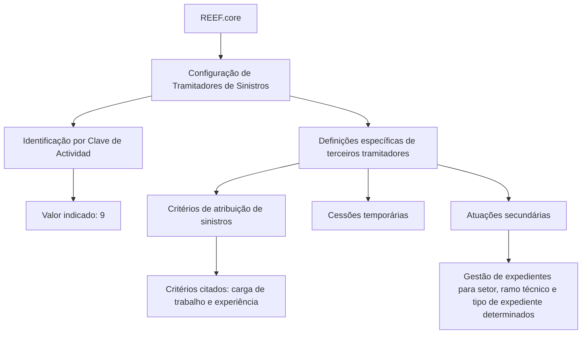

# Definição e Configuração de Tramitadores de Sinistros no REEF.core

## 1. Metadados do Documento
- **Arquivo de Origem:** `Não identificado no conteúdo fornecido`
- **Tipo de Documento:** `Apresentação Executiva`
- **Domínio / Sistema:** `REEF.core — gestão de sinistros e tramitadores`
- **Público-Alvo:** `Negócio, operação, administradores funcionais e equipes de configuração`
- **Data/Versão Identificada:** `Não identificada`

---

## 2. Resumo Executivo & Contexto de Negócio

O documento apresenta a definição de **Tramitadores de Sinistros** no sistema **REEF.core**. O objetivo é relacionar os elementos de configuração necessários para que os tramitadores possam ser posteriormente utilizados na operação do sistema.

No REEF.core, os tramitadores são identificados pela **Clave de Actividad**. O texto informa o valor `9` associado a essa identificação, sem detalhar a estrutura, o formato ou o catálogo completo de valores da chave.

A apresentação descreve definições específicas aplicáveis exclusivamente a terceiros classificados como tramitadores. Entre os tópicos apresentados estão critérios de atribuição de sinistros, cessões temporárias e atuações secundárias.

O conteúdo enfatiza que a configuração pode estabelecer atribuições de sinistros considerando critérios como carga de trabalho e experiência. Também permite configurar atuações secundárias para tramitadores cujo papel, em princípio, impede a gestão de expedientes, habilitando essa gestão para combinações determinadas de setor, ramo técnico e tipo de expediente.

---

## 3. Arquitetura, Componentes & Tecnologias Envolvidas

Os componentes e conceitos identificados no conteúdo são:

- **REEF.core:** sistema no qual os tramitadores são configurados e operados.
- **Tramitadores de Sinistros:** terceiros configurados para atuar sobre sinistros.
- **Clave de Actividad:** identificador utilizado pelo REEF.core para reconhecer os tramitadores; o documento associa o valor `9`.
- **Definições específicas de terceiros tramitadores:** grupo de definições exclusivo para terceiros que são tramitadores.
- **Critérios de atribuição:** configuração para atribuir sinistros aos tramitadores.
- **Cessões temporárias:** tópico de configuração apresentado junto aos critérios de atribuição.
- **Atuações secundárias:** mecanismo para permitir a gestão de expedientes em condições definidas.
- **Home Solutions APIs Documentation Zeus:** texto presente no conteúdo bruto, sem descrição de integração, função técnica ou relação explícita com REEF.core.



> **Nota de Análise:** O documento não detalha interfaces, APIs, métodos HTTP, contratos JSON, bancos de dados, infraestrutura, autenticação ou topologia de implantação do REEF.core.

---

## 4. Regras de Negócio, Especificações Funcionais & Processos

### 4.1 Configuração de tramitadores

1. O REEF.core possui elementos que permitem configurar os **Tramitadores de Sinistros**.
2. A configuração é necessária para que os tramitadores possam operar posteriormente no sistema.
3. O REEF.core identifica os tramitadores mediante a **Clave de Actividad**.
4. O conteúdo fornecido associa o valor `9` à Clave de Actividad dos tramitadores.

### 4.2 Obrigatoriedade de configuração

1. Os asteriscos presentes nas tarjetas indicam se a configuração de um elemento é obrigatória em relação à definição dos tramitadores.
2. O documento não informa quais tarjetas possuem asteriscos nem lista os elementos obrigatórios individualmente.

### 4.3 Definições específicas para terceiros tramitadores

1. Existe um grupo de definições empregado exclusivamente quando um terceiro é classificado como **TRAMITADOR**.
2. O documento não detalha os campos, telas, permissões ou regras de cadastro que compõem esse grupo de definições específicas.

### 4.4 Critérios de atribuição de sinistros

1. Os critérios de atribuição configuram a distribuição de sinistros para tramitadores.
2. Os critérios explicitamente citados são:
   - Carga de trabalho.
   - Experiência.
3. O conteúdo não define algoritmo de distribuição, pesos, prioridades, limites de capacidade, critérios de desempate ou comportamento em caso de indisponibilidade de tramitadores.

### 4.5 Cessões temporárias

1. O documento apresenta **CESIONES TEMPORALES** como tópico de configuração.
2. O texto associado a cessões temporárias menciona configuração de critérios de atribuição de sinistros a tramitadores por carga de trabalho e experiência.
3. O conteúdo não descreve duração, ativação, revogação, aprovação ou regras operacionais específicas para cessões temporárias.

### 4.6 Atuações secundárias

1. As atuações secundárias configuram capacidades adicionais do tramitador.
2. O mecanismo é aplicável quando o papel do tramitador, inicialmente, impede a gestão de expedientes.
3. A configuração pode permitir que esse tramitador gerencie expedientes para uma combinação determinada de:
   - Setor.
   - Ramo técnico.
   - Tipo de expediente.
4. O documento não especifica os valores permitidos, a precedência dessas permissões, limites temporais ou controles de autorização associados.

---

## 5. Tabelas de Parâmetros, Ambientes e Estruturas de Dados

| Item / Parâmetro | Descrição / Função | Tipo / Valores / Formato | Ambiente / Observações |
| :--- | :--- | :--- | :--- |
| REEF.core | Sistema que permite configurar e operar tramitadores de sinistros. | Sistema corporativo. | Não há ambiente identificado. |
| Tramitador de Sinistros | Terceiro configurado para operar posteriormente no sistema. | Entidade funcional. | O documento não apresenta campos cadastrais. |
| Clave de Actividad | Chave utilizada pelo REEF.core para identificar tramitadores. | Valor indicado: `9`. | Formato e catálogo de valores não detalhados. |
| Asteriscos das tarjetas | Indicadores de obrigatoriedade da configuração de elementos relacionados aos tramitadores. | Indicador visual. | Tarjetas e elementos obrigatórios não listados. |
| Definições específicas | Definições utilizadas exclusivamente quando o terceiro é um tramitador. | Grupo funcional de configuração. | Sem detalhamento de atributos. |
| Critérios de atribuição | Configuração para atribuição de sinistros aos tramitadores. | Critérios citados: carga de trabalho e experiência. | Não há algoritmo ou regra de prioridade descrita. |
| Cessões temporárias | Tópico de configuração apresentado no documento. | Não especificado. | A descrição fornecida repete a configuração de critérios de atribuição. |
| Atuações secundárias | Permissão para que tramitador gerencie expedientes apesar de seu papel inicial impedir essa gestão. | Setor, ramo técnico e tipo de expediente determinados. | Valores e regras de autorização não detalhados. |
| Home Solutions APIs Documentation Zeus | Texto exibido no conteúdo bruto. | Não especificado. | Não há relação técnica explicitada com os demais tópicos. |

---

## 6. Bateria de Perguntas & Respostas para RAG (FAQ Sintético)

### P1: Qual é o objetivo da configuração de tramitadores no REEF.core?
**R:** O objetivo é configurar os elementos necessários para que os Tramitadores de Sinistros possam operar posteriormente no sistema REEF.core.

### P2: Como o REEF.core identifica os tramitadores?
**R:** O REEF.core identifica os tramitadores por meio da **Clave de Actividad**. O conteúdo fornecido associa o valor `9` a essa identificação.

### P3: O que indicam os asteriscos nas tarjetas relacionadas aos tramitadores?
**R:** Os asteriscos indicam se a configuração de um elemento é obrigatória para a definição dos tramitadores. O documento não identifica quais elementos específicos são obrigatórios.

### P4: O que são as definições específicas de terceiros tramitadores?
**R:** São definições empregadas exclusivamente quando o terceiro é um **TRAMITADOR**. O material não detalha os campos, atributos ou regras incluídos nesse grupo.

### P5: Quais critérios de atribuição de sinistros são citados no documento?
**R:** O documento cita **carga de trabalho** e **experiência** como critérios para configurar a atribuição de sinistros aos tramitadores.

### P6: O documento define como calcular a carga de trabalho ou a experiência do tramitador?
**R:** Não. O conteúdo apenas cita carga de trabalho e experiência como critérios de atribuição, sem apresentar fórmulas, indicadores, pesos ou regras de cálculo.

### P7: O que são cessões temporárias no contexto apresentado?
**R:** Cessões temporárias são apresentadas como um tópico de configuração. O texto associado menciona critérios de atribuição de sinistros por carga de trabalho e experiência, mas não detalha regras específicas para duração, aprovação ou encerramento dessas cessões.

### P8: Para que servem as atuações secundárias?
**R:** As atuações secundárias permitem configurar que um tramitador, cujo papel inicialmente impede a gestão de expedientes, possa gerenciá-los para um setor, ramo técnico e tipo de expediente determinados.

### P9: Quais condições delimitam a gestão de expedientes por atuações secundárias?
**R:** A gestão de expedientes é delimitada por uma combinação determinada de **setor**, **ramo técnico** e **tipo de expediente**. O documento não fornece os valores possíveis para essas classificações.

### P10: O documento descreve APIs ou contratos de integração do REEF.core?
**R:** Não. Embora o conteúdo bruto inclua a expressão “Home Solutions APIs Documentation Zeus”, não há métodos HTTP, URLs, contratos JSON, serviços ou fluxos de integração descritos.

---

## 7. Glossário de Termos, Siglas & Conceitos-Chave

- **REEF.core:** Sistema mencionado como responsável pela configuração e operação de tramitadores de sinistros.
- **Tramitador:** Terceiro configurado para atuar sobre sinistros no REEF.core.
- **Tramitador de Sinistros:** Tramitador associado à operação de sinistros.
- **Clave de Actividad:** Chave usada pelo REEF.core para identificar tramitadores; o documento indica o valor `9`.
- **Tercero:** Entidade externa ou terceiro mencionado no contexto de classificação como tramitador.
- **Criterios de Asignación:** Critérios utilizados para configurar a atribuição de sinistros aos tramitadores.
- **Carga de Trabajo:** Critério citado para atribuição de sinistros, sem definição de cálculo no documento.
- **Experiencia:** Critério citado para atribuição de sinistros, sem definição de cálculo no documento.
- **Cesiones Temporales:** Tópico de configuração apresentado sem detalhamento operacional próprio.
- **Actuaciones Secundarias:** Configuração que permite a gestão de expedientes por tramitadores sob condições determinadas.
- **Expediente:** Caso ou processo que pode ser gerenciado por um tramitador.
- **Ramo Técnico:** Classificação utilizada, junto a setor e tipo de expediente, para delimitar atuações secundárias.

---

## 8. Notas Críticas, Riscos & Limitações

- O conteúdo possui natureza resumida e não detalha telas, campos, fluxos operacionais completos ou procedimentos de configuração.
- A **Clave de Actividad** é associada ao valor `9`, mas o documento não informa o tipo do campo, a origem do valor ou se existem outras chaves de atividade.
- A obrigatoriedade indicada por asteriscos é mencionada, mas os elementos obrigatórios não são identificados.
- Os critérios de atribuição citados — carga de trabalho e experiência — não possuem fórmula, prioridade, pesos ou regras de exceção.
- A seção sobre cessões temporárias não contém detalhamento específico sobre cessão, apenas repete a descrição dos critérios de atribuição.
- As atuações secundárias descrevem as dimensões de permissão — setor, ramo técnico e tipo de expediente —, mas não apresentam valores permitidos, workflow de aprovação ou controles de acesso.
- Não há informações verificáveis sobre ambientes, URLs, logs, servidores, autenticação, APIs, infraestrutura ou implantação.
- **Nota de Análise:** A expressão “Home Solutions APIs Documentation Zeus” está presente no material, porém o documento não esclarece sua função nem sua integração com REEF.core.

---

## 9. Conteúdo Bruto Estruturado (Referência Fiel)

```text
--- [PÁGINA 1 DE 2] ---

DEFINICIÓN de los TRAMITADORES
Se relacionan los elementos que permiten configurar en Reef.core a los Tramitadores de Siniestros
para poder operar posteriormente con ellos en el Sistema.
Reef.core identifica a los Tramitadores con la Clave de Actividad... 9.
Los Asteriscos de las Tarjetas indican si la configuración del elemento es obligatoria en relación
con la definición de los Tramitadores.
Definiciones ESPECÍFICAS, propias de los
Terceros TRAMITADORES
En este Grupo se encuentran definiciones que se emplean
exclusivamente cuando el Tercero es un TRAMITADOR.
CRITERIOS DE ASIGNACIÓN
Configuración de los Criterios de Asignación
de Siniestros a los Tramitadores por carga de
Trabajo, Experiencia,...
CESIONES TEMPORALES
Configuración de los Criterios de Asignación
de Siniestros a los Tramitadores por carga de
Trabajo, Experiencia,...
/
CF
Home Solutions APIs Documentation Zeus
EN

--- [PÁGINA 2 DE 2] ---

ACTUACIONES SECUNDARIAS
Configuración de las Actuaciones
Secundarias del Tramitador, cuyo rol en
principio le impide gestionar expedientes,
para que pueda hacerlo para un sector, ramo
técnico y tipo de expediente determinados.
```
