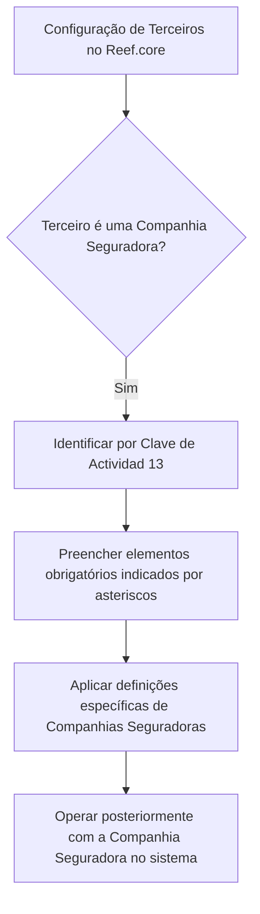

# Definição de Companhias Seguradoras no Reef.core

## 1. Metadados do Documento
- **Arquivo de Origem:** Não identificado no conteúdo fornecido
- **Tipo de Documento:** Especificação Técnica
- **Domínio / Sistema:** Reef.core — configuração de Terceiros classificados como Companhias Seguradoras
- **Público-Alvo:** Desenvolvedores, Arquitetos, Operação e Negócio
- **Data/Versão Identificada:** Não identificada

---

## 2. Resumo Executivo & Contexto de Negócio

O documento descreve a definição de Companhias Seguradoras no sistema Reef.core. O objetivo é relacionar os elementos necessários para configurar essas entidades e permitir sua operação posterior no sistema.

No Reef.core, Companhias Seguradoras são identificadas por uma **Clave de Actividad** cujo valor informado é **13**. Esse identificador é o único critério explícito de classificação apresentado no conteúdo extraído.

A configuração contém elementos obrigatórios, indicados por asteriscos nas respectivas tarjetas. A obrigatoriedade é relacionada especificamente à definição de Companhias Seguradoras.

O documento também informa a existência de definições específicas para Terceiros que sejam Companhias Seguradoras. Entretanto, o conteúdo fornecido não detalha quais são essas definições, campos, telas, regras de validação ou comportamentos operacionais.

---

## 3. Arquitetura, Componentes & Tecnologias Envolvidas

| Componente / Termo | Papel identificado |
| :--- | :--- |
| Reef.core | Sistema no qual Companhias Seguradoras são configuradas e operadas. |
| Compañías Aseguradoras | Tipo de Terceiro configurável no Reef.core. |
| Clave de Actividad | Identificador usado pelo Reef.core para reconhecer Companhias Seguradoras. |
| Clave de Actividad 13 | Valor de identificação das Companhias Seguradoras no Reef.core. |
| Tarjetas | Elementos de configuração cujos asteriscos indicam obrigatoriedade. |
| Definiciones ESPECÍFICAS | Grupo de definições utilizado exclusivamente quando o Terceiro é uma Companhia Seguradora. |
| Home Solutions APIs Documentation Zeus / EN | Texto presente no conteúdo bruto; o documento não explica seu significado, função ou relação técnica com Reef.core. |



> **Nota de Análise:** O conteúdo não descreve integrações, APIs, métodos HTTP, bancos de dados, ambientes, servidores, contratos de dados ou tecnologias adicionais.

---

## 4. Regras de Negócio, Especificações Funcionais & Processos

1. O Reef.core deve permitir a configuração de Companhias Seguradoras para operação posterior no sistema.
2. O Reef.core identifica Companhias Seguradoras por meio da **Clave de Actividad 13**.
3. Os elementos marcados com asteriscos nas tarjetas são obrigatórios na configuração relacionada à definição de Companhias Seguradoras.
4. Existe um grupo de definições específicas aplicável exclusivamente quando o Terceiro é uma Companhia Seguradora.
5. O conteúdo não especifica:
   - Os nomes dos elementos obrigatórios marcados com asteriscos.
   - Os campos ou valores das tarjetas.
   - As regras de validação para a Clave de Actividad 13.
   - O processo de inclusão, alteração, exclusão ou aprovação de Companhias Seguradoras.
   - Os efeitos operacionais das definições específicas.
   - Perfis de acesso, permissões ou responsáveis pela configuração.

### Fluxo funcional identificado

1. Configurar uma entidade Terceiro no Reef.core.
2. Classificar o Terceiro como Companhia Seguradora por meio da Clave de Actividad 13.
3. Informar os elementos obrigatórios sinalizados com asteriscos nas tarjetas.
4. Aplicar as definições específicas destinadas a Terceiros classificados como Companhias Seguradoras.
5. Utilizar a Companhia Seguradora posteriormente nas operações do sistema.

---

## 5. Tabelas de Parâmetros, Ambientes e Estruturas de Dados

| Item / Parâmetro | Descrição / Função | Tipo / Valores / Formato | Ambiente / Observações |
| :--- | :--- | :--- | :--- |
| Companhia Seguradora | Entidade configurável no Reef.core para operação posterior no sistema. | Tipo de Terceiro | Não há ambiente identificado. |
| Clave de Actividad | Critério de identificação de Companhias Seguradoras no Reef.core. | Valor informado: `13` | Regra explicitamente declarada no documento. |
| Asteriscos das tarjetas | Indicadores de obrigatoriedade dos elementos de configuração. | Marcador visual de campo obrigatório | O conteúdo não relaciona quais tarjetas ou campos possuem asteriscos. |
| Definiciones ESPECÍFICAS | Definições empregadas exclusivamente para Terceiros que sejam Companhias Seguradoras. | Grupo de definições | Sem detalhamento de campos, comportamento ou regras. |
| Reef.core | Sistema que realiza a identificação, configuração e operação posterior das Companhias Seguradoras. | Sistema corporativo | Não há versão, URL ou ambiente informados. |
| Home Solutions APIs Documentation Zeus | Texto encontrado no rodapé ou trecho final do conteúdo bruto. | Não especificado | A função e a relação com o restante do documento não são detalhadas. |
| EN | Texto encontrado no conteúdo bruto. | Não especificado | Não há significado contextual explicado. |

---

## 6. Bateria de Perguntas & Respostas para RAG (FAQ Sintético)

### P1: Como o Reef.core identifica uma Companhia Seguradora?
**R:** O Reef.core identifica Companhias Seguradoras por meio da **Clave de Actividad 13**.

### P2: Qual valor de Clave de Actividad deve ser usado para Companhias Seguradoras no Reef.core?
**R:** O valor informado no documento para identificar Companhias Seguradoras é **13**.

### P3: Qual é o objetivo da configuração de Companhias Seguradoras no Reef.core?
**R:** A configuração tem o objetivo de permitir que as Companhias Seguradoras possam ser operadas posteriormente no sistema Reef.core.

### P4: O que significam os asteriscos nas tarjetas de configuração?
**R:** Os asteriscos indicam a obrigatoriedade do elemento de configuração em relação à definição de Companhias Seguradoras.

### P5: Quais campos obrigatórios devem ser preenchidos para configurar uma Companhia Seguradora?
**R:** O documento informa que os campos ou elementos assinalados com asteriscos são obrigatórios, mas não apresenta os nomes desses campos nem os valores aceitos.

### P6: Existem definições exclusivas para Terceiros classificados como Companhias Seguradoras?
**R:** Sim. O documento afirma que existe um grupo de definições específicas empregado exclusivamente quando o Terceiro é uma Companhia Seguradora. O conteúdo extraído não detalha essas definições.

### P7: O documento descreve como criar, alterar ou excluir Companhias Seguradoras?
**R:** Não. O conteúdo apresenta a identificação por Clave de Actividad 13, a existência de elementos obrigatórios e definições específicas, mas não descreve procedimentos operacionais de criação, alteração ou exclusão.

### P8: O documento informa APIs ou contratos de integração para Companhias Seguradoras?
**R:** Não. Embora o texto contenha a expressão “Home Solutions APIs Documentation Zeus”, não há especificação de API, endpoint, método HTTP, contrato JSON, autenticação ou integração.

### P9: Há informações sobre ambientes, URLs ou servidores do Reef.core?
**R:** Não. O conteúdo fornecido não contém URLs, nomes de servidores, portas, ambientes ou parâmetros de infraestrutura.

### P10: Quais condições tornam uma regra aplicável exclusivamente a uma Companhia Seguradora?
**R:** Segundo o documento, as definições específicas são empregadas exclusivamente quando o Terceiro é uma Companhia Seguradora. A classificação é identificada no Reef.core pela Clave de Actividad 13.

---

## 7. Glossário de Termos, Siglas & Conceitos-Chave

- **Reef.core:** Sistema citado como responsável por configurar, identificar e operar posteriormente Companhias Seguradoras.
- **Compañías Aseguradoras / Companhias Seguradoras:** Tipo de Terceiro tratado no Reef.core.
- **Tercero / Terceiro:** Entidade para a qual podem existir definições específicas quando classificada como Companhia Seguradora.
- **Clave de Actividad:** Chave de atividade utilizada pelo Reef.core para identificar Companhias Seguradoras.
- **Clave de Actividad 13:** Valor de identificação associado às Companhias Seguradoras.
- **Tarjetas:** Elementos ou cartões de configuração nos quais asteriscos indicam obrigatoriedade.
- **Definiciones ESPECÍFICAS:** Grupo de definições destinado exclusivamente a Terceiros que sejam Companhias Seguradoras.
- **Home Solutions APIs Documentation Zeus:** Expressão apresentada no conteúdo bruto sem definição funcional ou técnica adicional.
- **EN:** Texto apresentado no conteúdo bruto sem significado contextual identificado.

---

## 8. Notas Críticas, Riscos & Limitações

- O arquivo de origem, a versão e a data do documento não foram identificados no conteúdo fornecido.
- O conteúdo não lista os campos, tarjetas ou elementos concretos obrigatórios para a configuração.
- O documento não detalha o comportamento das definições específicas aplicáveis a Companhias Seguradoras.
- Não há informações sobre validações, mensagens de erro, fluxos de aprovação, permissões ou auditoria.
- Não há dados sobre integrações, APIs, URLs, ambientes, servidores, portas, autenticação ou contratos de dados.
- A expressão “Home Solutions APIs Documentation Zeus” aparece no conteúdo, mas não possui explicação suficiente para classificá-la como integração, produto, módulo ou referência técnica.
- **Nota de Análise:** O documento lista o Reef.core e a Clave de Actividad 13, porém não detalha métodos de manutenção, estruturas de dados, contratos ou regras de operação das Companhias Seguradoras.

---

## 9. Conteúdo Bruto Estruturado (Referência Fiel)

```text
--- [PÁGINA 1 DE 1] ---

DEFINICIÓN de las Compañías
ASEGURADORAS
Se relacionan los elementos que permiten configurar en Reef.core a las Compañías Aseguradoras
para poder operar posteriormente con ellas en el Sistema.
Reef.core identifica a las Compañías Aseguradoras con la Clave de Actividad... 13.
Los Asteriscos de las Tarjetas indican la obligatoriedad en la configuración del elemento en
relación con la definición de las Compañías Aseguradoras.
Definiciones ESPECÍFICAS, propias de los
Terceros COMPAÑÍAS ASEGURADORAS
En este Grupo se encuentran definiciones que se emplean
exclusivamente cuando el Tercero es una COMPAÑÍA ASEGURADORA.
 /
 CF
Home Solutions APIs Documentation Zeus
EN
```
