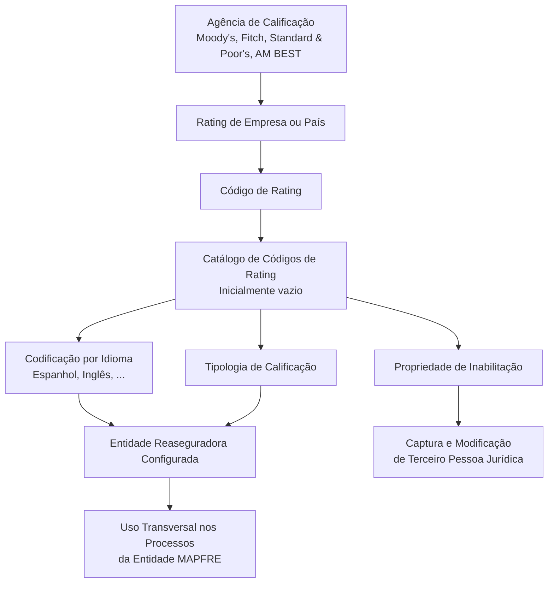

# Catálogo de Códigos de Calificação (Rating) para Terceiros Jurídicos e Entidades Reaseguradoras

## 1. Metadados do Documento
- **Arquivo de Origem:** `Não identificado no conteúdo fornecido`
- **Tipo de Documento:** Manual Funcional
- **Domínio / Sistema:** Atividades de Terceiros — Códigos de Calificação (Rating) de Terceiros Jurídicos
- **Público-Alvo:** Negócio, operação, configuração funcional e entidades MAPFRE
- **Data/Versão Identificada:** Não identificada

---

## 2. Resumo Executivo & Contexto de Negócio

O documento descreve a definição e a gestão de Códigos de Calificação, também denominados *Ratings*, aplicáveis a terceiros pessoas jurídicas, com foco em companhias reaseguradoras configuradas no sistema. Um Rating representa a avaliação da solvência de uma empresa ou país para cumprir obrigações financeiras.

A classificação é atribuída por agências especializadas de calificação, como Moody's, Fitch e Standard & Poor's. O documento também menciona AM BEST como referência para exemplos reais de classificações relacionadas à fortaleza financeira.

Funcionalmente, o núcleo do sistema disponibiliza um catálogo específico para identificar e codificar os Códigos de Rating das companhias reaseguradoras. Esse catálogo é inicialmente entregue às entidades sem conteúdo, cabendo à entidade definir os códigos que utilizará.

O sistema permite codificar os Códigos de Rating por idioma, incluindo Espanhol e Inglês, identificando individualmente cada código por uma denominação ou texto descritivo. Além do código e descrição, o catálogo contempla propriedades operacionais como tipologia de calificação e inabilitação para uso nas operações de captura e modificação de terceiros pessoas jurídicas.

O documento não determina um padrão obrigatório de codificação. Entretanto, recomenda que a entidade MAPFRE avalie a conveniência de utilizar transversalmente esse catálogo nos processos corporativos, especialmente para permitir a exploração posterior das informações e o agrupamento de ratings conforme sua tipologia: curto prazo, longo prazo e fortaleza financeira.

---

## 3. Arquitetura, Componentes & Tecnologias Envolvidas

Os elementos funcionais identificados no documento são:

| Componente / Entidade | Papel descrito |
| :--- | :--- |
| Sistema / Núcleo do Sistema | Disponibiliza o catálogo específico para identificação e codificação dos Códigos de Rating. |
| Catálogo de Códigos de Rating | Repositório de informação inicialmente vazio, configurado pelas entidades para registrar ratings de companhias reaseguradoras. |
| Entidade MAPFRE | Deve analisar a conveniência de utilizar o catálogo de forma transversal nos processos corporativos. |
| Entidades Reaseguradoras | Entidades configuradas no sistema e associadas ao uso do catálogo de Códigos de Rating. |
| Terceiro pessoa jurídica | Entidade sujeita a operações de captura e/ou modificação, nas quais um Código de Rating inabilitado não pode ser empregado. |
| Agências de Calificação | Organizações especializadas que atribuem Ratings, incluindo Moody's, Fitch, Standard & Poor's e AM BEST. |
| Idiomas | Mecanismo de codificação dos códigos por idioma, com exemplos de Espanhol e Inglês. |



> **Nota de Análise:** O documento descreve propriedades funcionais do catálogo de Códigos de Rating, mas não detalha arquitetura técnica, banco de dados, APIs, métodos HTTP, contratos JSON, integrações, ambientes, URLs, tecnologias de implementação ou mecanismos de autenticação.

---

## 4. Regras de Negócio, Especificações Funcionais & Processos

### 4.1 Conceito de Código de Calificação ou Rating

Um Rating é a calificação de solvência atribuída a uma empresa ou país para avaliar a capacidade de cumprir obrigações financeiras. A nota é concedida por uma agência especializada, denominada agência de calificação.

As agências explicitamente mencionadas são:

- Moody's;
- Fitch;
- Standard & Poor's;
- AM BEST, citada como fonte de exemplos reais de classificações.

### 4.2 Catálogo de Códigos de Rating

O núcleo do sistema possui a capacidade funcional de identificar e codificar os Códigos de Rating próprios das companhias reaseguradoras.

O catálogo de Códigos de Rating possui as seguintes características:

1. É um catálogo de informação específico.
2. É entregue inicialmente às entidades sem conteúdo.
3. Deve ser preenchido ou codificado conforme a necessidade de cada entidade.
4. É aplicável a entidades reaseguradoras configuradas no sistema.
5. Permite registrar individualmente cada Código de Rating com uma denominação ou texto descritivo.
6. Permite codificação por idioma, com Espanhol e Inglês apresentados como exemplos.

### 4.3 Codificação multilíngue

O sistema permite que os Códigos de Rating sejam codificados por idioma. A codificação deve identificar individualmente cada código mediante uma denominação ou texto descritivo.

Exemplos de idiomas mencionados:

- Espanhol;
- Inglês;
- Outros idiomas, indicados pela expressão “...”.

### 4.4 Tipologia de Calificação

A propriedade **Tipologia de Calificação** informa ao sistema a classificação do Código de Rating, distinguindo seu uso e âmbito de operação.

O documento apresenta como exemplo a classificação associada à fortaleza financeira. Nesse contexto, a classificação sintetiza a posição financeira de uma entidade mediante avaliação e agregação de indicadores financeiros pertencentes a cinco categorias de desempenho:

1. Suficiência de capital;
2. Qualidade de ativos;
3. Eficiência operativa;
4. Rentabilidade;
5. Liquidez.

A classificação de fortaleza financeira também está relacionada à capacidade de obter benefícios e distribuí-los aos acionistas.

### 4.5 Organização recomendada dos códigos por tipologia

Não existe preferência ou recomendação obrigatória para estabelecer ou padronizar a codificação do catálogo no sistema.

Apesar da ausência de uma regra obrigatória, a entidade MAPFRE deve analisar a conveniência de usar transversalmente o catálogo de Códigos de Rating nos processos corporativos, visando sua correta exploração posterior.

O documento fornece como exemplo de agrupamento e codificação:

1. Primeiro, códigos pertencentes à calificação de curto prazo;
2. Depois, códigos pertencentes à calificação de longo prazo;
3. Por último, códigos correspondentes à Fortaleza Financeira.

### 4.6 Inabilitação de Código de Rating

A propriedade **Inabilitação** indica ao sistema se um Código de Rating está inabilitado para uso.

Quando um Código de Rating estiver inabilitado, ele não poderá ser empregado nas operações de:

- Captura de Terceiro pessoa Jurídica;
- Modificação de Terceiro pessoa Jurídica.

### 4.7 Vínculos documentais

O documento menciona a existência de uma relação de diretrizes e documentos funcionais cuja leitura é recomendada. A finalidade dessa leitura é evitar que uma interpretação isolada do documento conduza a erro.

> **Nota de Análise:** O conteúdo fornecido menciona vínculos para diretrizes e documentos funcionais, porém não identifica nomes, códigos, URLs ou conteúdo desses documentos relacionados.

---

## 5. Tabelas de Parâmetros, Ambientes e Estruturas de Dados

| Item / Parâmetro | Descrição / Função | Tipo / Valores / Formato | Ambiente / Observações |
| :--- | :--- | :--- | :--- |
| Código de Rating | Código que identifica uma calificação de solvência. | Exemplos: `001`, `002`, `AAa`. | Aplicável ao catálogo de Códigos de Rating. |
| Descrição do Código de Rating | Denominação ou texto descritivo que identifica individualmente um Código de Rating. | Exemplos: `Grado Inversión Baa2`, `Grado Inversión Baa3`, `Grado Especulativo Ba1`. | Deve poder ser codificada por idioma. |
| Idioma | Permite manter a codificação dos Códigos de Rating por idioma. | Exemplos: Espanhol, Inglês. | O documento admite outros idiomas, sem especificá-los. |
| Tipologia de Calificação | Classificação que diferencia o uso e o âmbito operacional de um Código de Rating. | Curto prazo, longo prazo, fortaleza financeira. | Os três valores são apresentados no exemplo de agrupamento recomendado, não como lista exaustiva de valores permitidos. |
| Fortaleza Financeira | Tipologia exemplificada para sintetizar a posição financeira de uma entidade. | Avaliação agregada de cinco categorias de desempenho. | O documento referencia exemplos reais de classificações com dados da AM BEST. |
| Suficiência de capital | Categoria de desempenho considerada na classificação de fortaleza financeira. | Não detalhado. | Não são fornecidas fórmulas, métricas ou limites. |
| Qualidade de ativos | Categoria de desempenho considerada na classificação de fortaleza financeira. | Não detalhado. | Não são fornecidas fórmulas, métricas ou limites. |
| Eficiência operativa | Categoria de desempenho considerada na classificação de fortaleza financeira. | Não detalhado. | Não são fornecidas fórmulas, métricas ou limites. |
| Rentabilidade | Categoria de desempenho considerada na classificação de fortaleza financeira. | Não detalhado. | Relacionada no texto à capacidade de obter benefícios. |
| Liquidez | Categoria de desempenho considerada na classificação de fortaleza financeira. | Não detalhado. | Não são fornecidas fórmulas, métricas ou limites. |
| Inabilitação | Determina se o Código de Rating pode ser utilizado em operações sobre terceiros pessoas jurídicas. | Estado habilitado ou inabilitado, sem formato técnico especificado. | Quando inabilitado, não pode ser utilizado em captura ou modificação. |
| Entidade Reaseguradora | Companhia reaseguradora cujos códigos próprios podem ser identificados e codificados. | Não detalhado. | Configurada no sistema. |
| Terceiro pessoa jurídica | Entidade sujeita a operações de captura e/ou modificação. | Não detalhado. | É impactada pela regra de inabilitação do Código de Rating. |
| Agência de Calificação | Agência especializada que atribui a nota de solvência. | Moody's, Fitch, Standard & Poor's, AM BEST. | AM BEST é mencionada como exemplo de classificações de fortaleza financeira. |
| Catálogo de Códigos de Rating | Catálogo específico que armazena a codificação dos ratings das companhias reaseguradoras. | Inicialmente vazio. | A entidade deve definir seu uso e conteúdo. |

### Exemplos de Códigos de Rating apresentados

| Código de Rating | Descrição |
| :--- | :--- |
| `001` | Grado Inversión Baa2 |
| `002` | Grado Inversión Baa3 |
| `AAa` | Grado Especulativo Ba1 |

> **Nota de Análise:** O documento apresenta apenas exemplos de códigos e descrições. Não informa a origem, a taxonomia completa, regras de validação, tamanhos de campo, obrigatoriedade, unicidade ou relacionamentos entre os códigos listados.

---

## 6. Bateria de Perguntas & Respostas para RAG (FAQ Sintético)

### P1: O que é um Código de Calificação ou Rating no contexto de Terceiros Jurídicos?
**R:** Um Código de Calificação ou Rating representa a avaliação da solvência de uma empresa ou país para cumprir suas obrigações financeiras. A nota é atribuída por uma agência especializada de calificação, como Moody's, Fitch, Standard & Poor's ou AM BEST.

### P2: Qual é a finalidade do catálogo de Códigos de Rating?
**R:** O catálogo de Códigos de Rating permite ao núcleo do sistema identificar e codificar os Códigos de Rating próprios das companhias reaseguradoras. O catálogo é específico para essa informação e é entregue inicialmente às entidades sem conteúdo.

### P3: O catálogo de Códigos de Rating já possui valores pré-carregados quando é entregue à entidade?
**R:** Não. O documento informa que o catálogo específico de Códigos de Rating é entregue às entidades inicialmente vazio de conteúdo.

### P4: O sistema permite manter descrições de Códigos de Rating em mais de um idioma?
**R:** Sim. O sistema permite codificar os Códigos de Rating por idioma, com Espanhol e Inglês apresentados como exemplos. Cada código pode ser identificado individualmente por uma denominação ou texto descritivo.

### P5: O que representa a propriedade Tipologia de Calificação?
**R:** A Tipologia de Calificação informa ao sistema a classificação de um Código de Rating e distingue o uso e o âmbito operacional desse código. O documento cita como referência classificações de curto prazo, longo prazo e fortaleza financeira.

### P6: Quais categorias são consideradas na classificação de fortaleza financeira?
**R:** A classificação de fortaleza financeira considera a avaliação e agregação de indicadores financeiros de cinco categorias: suficiência de capital, qualidade de ativos, eficiência operativa, rentabilidade e liquidez.

### P7: O que acontece quando um Código de Rating é marcado como inabilitado?
**R:** Um Código de Rating inabilitado não pode ser utilizado nas operações de captura e/ou modificação de um Terceiro pessoa Jurídica.

### P8: Existe uma padronização obrigatória para codificar os Códigos de Rating no sistema?
**R:** Não. O documento afirma que não existe preferência nem recomendação para estabelecer ou padronizar a codificação no sistema. Contudo, a entidade MAPFRE deve analisar a conveniência de utilizar transversalmente o catálogo nos processos corporativos.

### P9: Qual organização de Códigos de Rating é sugerida para facilitar o uso transversal do catálogo?
**R:** O documento apresenta como exemplo o agrupamento dos códigos conforme a tipologia de classificação: primeiro códigos de calificação de curto prazo, depois códigos de longo prazo e, por último, códigos relacionados à Fortaleza Financeira.

### P10: Quais agências de calificação são citadas no documento?
**R:** O documento cita Moody's, Fitch e Standard & Poor's como exemplos de agências especializadas que atribuem Ratings. AM BEST também é mencionada como referência para exemplos reais de classificações de fortaleza financeira.

### P11: O documento especifica APIs, contratos JSON ou métodos HTTP para gerenciar o catálogo de Ratings?
**R:** Não. O conteúdo fornecido descreve funcionalidades e propriedades operacionais do catálogo, mas não detalha APIs, endpoints, métodos HTTP, contratos JSON, tecnologias ou integrações técnicas.

### P12: Por que a leitura de diretrizes e documentos funcionais vinculados é recomendada?
**R:** A leitura é recomendada para evitar que uma interpretação isolada do documento sobre Códigos de Rating leve a conclusões incorretas. O conteúdo fornecido, entretanto, não identifica quais são os documentos vinculados.

---

## 7. Glossário de Termos, Siglas & Conceitos-Chave

- **AM BEST:** Agência mencionada como fonte de exemplo real para classificações relacionadas à fortaleza financeira.
- **Agência de Calificação:** Organização especializada que atribui uma nota de solvência a empresas ou países.
- **Código de Rating:** Código que representa uma classificação de solvência e que pode ser mantido em catálogo específico para companhias reaseguradoras.
- **Fortaleza Financeira:** Classificação que sintetiza a posição financeira de uma entidade com base em indicadores de suficiência de capital, qualidade de ativos, eficiência operativa, rentabilidade e liquidez.
- **MAPFRE:** Entidade mencionada no documento como responsável por analisar a conveniência de utilizar transversalmente o catálogo de Códigos de Rating.
- **Rating:** Calificação de solvência de uma empresa ou país para cumprir obrigações financeiras.
- **Terceiro pessoa jurídica:** Entidade jurídica submetida a operações de captura e/ou modificação no sistema.
- **Tipologia de Calificação:** Propriedade que classifica um Código de Rating e diferencia seu uso e âmbito de operação.
- **Reaseguradora / Entidade Reaseguradora:** Companhia configurada no sistema cujos Códigos de Rating próprios podem ser identificados e codificados.

---

## 8. Notas Críticas, Riscos & Limitações

- O catálogo de Códigos de Rating é entregue inicialmente vazio; a qualidade, padronização e completude do cadastro dependem da configuração realizada por cada entidade.
- O documento não define uma codificação obrigatória nem uma taxonomia fechada de Códigos de Rating.
- A organização por curto prazo, longo prazo e fortaleza financeira é apresentada como exemplo de exploração transversal, não como validação obrigatória do sistema.
- Um Código de Rating inabilitado não pode ser usado em captura ou modificação de Terceiros pessoas jurídicas, o que pode impactar processos operacionais caso códigos ativos sejam inabilitados sem análise prévia.
- O documento recomenda consultar diretrizes e documentos funcionais vinculados para evitar interpretações isoladas, mas não identifica esses materiais.
- Não são detalhados critérios de criação, alteração, exclusão, aprovação, auditoria, governança, responsáveis, perfis de acesso ou rastreabilidade dos Códigos de Rating.
- Não são fornecidos campos obrigatórios, tipos de dados, tamanhos máximos, regras de unicidade, integrações, APIs, URLs, ambientes, logs ou procedimentos de tratamento de erro.
- Os exemplos de códigos e descrições apresentados não permitem inferir uma equivalência completa entre código, agência classificadora, tipologia ou escala de risco.

---

## 9. Conteúdo Bruto Estruturado (Referência Fiel)

```text
--- [PÁGINA 1 DE 4] ---

DEFINIR Códigos de Calificación (Rating)
Contexto
¿Qué son los Códigos de Calificación o (Ratings)?
El Rating es la calificación de solvencia de una Empresa o País para hacer frente a sus obligaciones
financieras. Esta nota se la otorga una agencia especializada (Moody's, Fitch, Standard & Poor's,... )
que se conoce como agencia de Calificación.
Propiedades Generales
Propiedades Operativas
Propiedades Generales
Funcionalmente, el núcleo del Sistema cuenta con la posibilidad de identificar y codificar los Códigos
de Rating propios de las Compañías Reaseguradoras en un catálogo de información específico que
se entrega a las entidades inicialmente vacío de contenido.
Idioma
El sistema permite por idioma (Español, Inglés,...) codificar estos códigos identificando
individualmente cada una de ellos mediante una denominación o texto descriptivo, e.g:
 / 
 CF
Home Solutions APIs Documentation Zeus
EN


--- [PÁGINA 2 DE 4] ---

CÓDIGO DE RATING. DESCRIPCIÓN
001 Grado Inversión Baa2
002 Grado Inversión Baa3
AAa Grado Especulativo Ba1
... ...
Propiedades Operativas
Tipología de Calificación
Esta propiedad le indica al Sistema la Clasificación del código de Rating que distingue su uso y
ámbito de operación.
Por ejemplo y si nos referimos a la fortaleza financiera, esta clasificación sintetiza la posición
financiera de una entidad mediante la evaluación y agregación de indicadores financieros de cinco
categorías de desempeño (suficiencia de capital, calidad de activos, eficiencia operativa, rentabilidad
y liquidez) y alude a la capacidad de obtener beneficios y de repartirlos entre sus accionistas.
Un ejemplo Real de las Clasificaciones con datos de AM BEST:


--- [PÁGINA 3 DE 4] ---

Inhabilitación
Esta propiedad le indica al Sistema si el Código de Rating está inhabilitado para poder ser empleado
en las operaciones de captura y/o modificación del Tercero persona Jurídica.
Vínculos
Relación de Directrices y Documentos funcionales cuya lectura recomendada para evitar que la
interpretación aislada del presente documento pueda conducir a error.


--- [PÁGINA 4 DE 4] ---

Actividades de Terceros
Códigos de Calificación (Rating) Terceros Jurídicos
Preguntas frecuentes
(1) ¿Existe alguna recomendación operativa que deba ser tomada en consideración localmente en la
codificación, uso y definición del catálogo de Códigos de Rating para las Entidades Reaseguradoras
configuradas en el Sistema?
No existe una preferencia ni recomendación para establecer o estandarizar en el sistema su
codificación si bien la entidad MAPFRE debe analizar la conveniencia de utilizar transversalmente en
los procesos de la compañía este catálogo de información para su correcta y posterior explotación,
e.g:
Agrupando y codificando los códigos de las diferentes Agencias de Rating que se van a usar en
los procesos de la entidad de acuerdo con la tipología de su clasificación: Primero los Códigos
que pertenezcan a la calificación a corto plazo, luego los del largo plazo y por último los
correspondientes a la Fortaleza Financiera.
```
