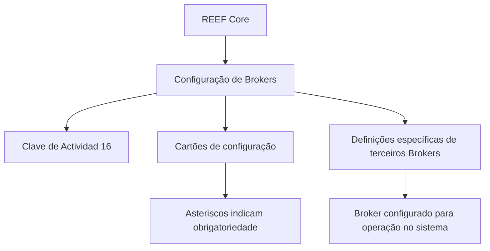

# Documentação Zeus — Definição de Brokers no REEF Core

## 1. Metadados do Documento
- **Arquivo de Origem:** Não identificado
- **Tipo de Documento:** Especificação Técnica
- **Domínio / Sistema:** REEF Core / Zeus
- **Público-Alvo:** Desenvolvedores, Arquitetos, Operação e Negócio
- **Data/Versão Identificada:** Não identificada

---

## 2. Resumo Executivo & Contexto de Negócio

O conteúdo apresenta a seção de documentação intitulada **“Definición de los Brokers”**, relacionada ao sistema **REEF Core** e acessível no contexto de documentação Zeus. O objetivo declarado é relacionar os elementos necessários para configurar Brokers no REEF Core, permitindo que essas entidades sejam utilizadas posteriormente pelo sistema.

No contexto apresentado, um **Broker** é definido como um agente intermediário em operações financeiras ou comerciais que recebe uma comissão por sua intervenção. O documento estabelece, portanto, uma caracterização funcional do terceiro classificado como Broker.

O sistema identifica Brokers pela **Clave de Actividad 16**. Além dessa identificação, a configuração é composta por cartões ou elementos cujos asteriscos indicam se determinado elemento é obrigatório para a definição de Brokers.

O documento também indica a existência de um grupo de definições específicas aplicáveis exclusivamente a terceiros classificados como Brokers. Entretanto, o trecho fornecido não detalha quais são todos os cartões, campos, regras de obrigatoriedade, fluxos de cadastro ou comportamentos operacionais dessa configuração.

---

## 3. Arquitetura, Componentes & Tecnologias Envolvidas

### Componentes identificados

| Componente | Papel identificado no conteúdo | Detalhamento disponível |
| :--- | :--- | :--- |
| Zeus | Contexto de navegação/documentação exibido no conteúdo bruto. | Não há detalhamento técnico adicional. |
| REEF Core | Sistema no qual os elementos de configuração de Brokers são definidos. | Não há arquitetura técnica, interfaces ou integrações descritas. |
| Broker | Terceiro ou agente intermediário em operações financeiras ou comerciais. | Identificado pela Clave de Actividad 16. |
| Grupo de definições específicas | Grupo de definições utilizado exclusivamente quando o terceiro é um Broker. | Os elementos internos do grupo não foram apresentados. |
| Cartões | Elementos de configuração relacionados à definição de Brokers. | Asteriscos sinalizam obrigatoriedade. |



> **Nota de Análise:** O conteúdo não descreve APIs, microsserviços, bancos de dados, métodos HTTP, contratos JSON, ambientes, servidores ou mecanismos de integração do REEF Core.

---

## 4. Regras de Negócio, Especificações Funcionais & Processos

1. O REEF Core possui elementos que permitem configurar Brokers para operação posterior no sistema.
2. Broker é caracterizado como agente intermediário em operações financeiras ou comerciais.
3. O Broker percebe uma comissão por sua intervenção.
4. O sistema identifica Brokers pela **Clave de Actividad 16**.
5. Os asteriscos dos cartões indicam se a configuração de determinado elemento é obrigatória para a definição de Brokers.
6. Existe um grupo de definições empregado exclusivamente quando o terceiro é um Broker.
7. O conteúdo não especifica:
   - Os nomes dos cartões de configuração.
   - Os campos exigidos para cadastro de Broker.
   - As condições exatas de obrigatoriedade de cada cartão.
   - Os fluxos de aprovação, alteração ou exclusão.
   - As regras de cálculo, percentuais ou liquidação de comissões.
   - Os contratos ou operações técnicas expostas pelo REEF Core.

---

## 5. Tabelas de Parâmetros, Ambientes e Estruturas de Dados

| Item / Parâmetro | Descrição / Função | Tipo / Valores / Formato | Ambiente / Observações |
| :--- | :--- | :--- | :--- |
| Broker | Agente intermediário em operações financeiras ou comerciais que percebe comissão pela intervenção. | Terceiro / entidade de negócio | Aplicável ao REEF Core. |
| Clave de Actividad | Identificador utilizado pelo sistema para reconhecer Brokers. | Valor informado: `16` | Não há detalhamento sobre domínio, formato técnico ou manutenção do valor. |
| Cartões | Elementos de configuração associados à definição de Brokers. | Não detalhado | Asteriscos indicam obrigatoriedade. |
| Asteriscos dos cartões | Indicadores de obrigatoriedade de configuração. | Indicador visual | A regra específica de cada cartão não foi fornecida. |
| Definições específicas | Definições usadas exclusivamente quando o terceiro é um Broker. | Grupo funcional | Conteúdo interno não detalhado. |
| REEF Core | Sistema que contém a configuração de Brokers. | Sistema | Sem informações de versão, ambiente, URL ou arquitetura. |
| Zeus | Nome exibido no cabeçalho da documentação. | Documentação / contexto de navegação | Sem detalhamento adicional. |

---

## 6. Bateria de Perguntas & Respostas para RAG (FAQ Sintético)

### P1: Qual é o objetivo da seção “Definición de los Brokers” no REEF Core?
**R:** A seção relaciona os elementos que permitem configurar Brokers no REEF Core para que essas entidades possam operar posteriormente no sistema.

### P2: Como o documento define um Broker?
**R:** O documento define Broker como um agente intermediário em operações financeiras ou comerciais que recebe uma comissão por sua intervenção.

### P3: Qual identificador o sistema utiliza para reconhecer um Broker?
**R:** O sistema identifica Brokers pela **Clave de Actividad 16**.

### P4: O que significam os asteriscos exibidos nos cartões de configuração de Broker?
**R:** Os asteriscos indicam se a configuração de determinado elemento é obrigatória em relação à definição de Brokers.

### P5: As definições específicas de Broker podem ser usadas para qualquer terceiro?
**R:** Não. O documento afirma que o grupo de definições específicas é empregado exclusivamente quando o terceiro é um Broker.

### P6: O documento detalha quais cartões são obrigatórios para configurar um Broker?
**R:** Não. O documento informa apenas que os asteriscos indicam obrigatoriedade, mas não apresenta os nomes dos cartões nem a obrigatoriedade individual de cada elemento.

### P7: O documento informa como a comissão do Broker é calculada?
**R:** Não. O conteúdo apenas declara que o Broker percebe uma comissão por sua intervenção; não há regras de cálculo, percentuais, bases de cálculo ou processos de pagamento.

### P8: Há APIs ou contratos técnicos descritos para a configuração de Brokers?
**R:** Não. O conteúdo fornecido não descreve APIs, métodos HTTP, contratos JSON, serviços, integrações ou endpoints relacionados à configuração de Brokers.

### P9: Qual sistema contém os elementos de configuração de Brokers?
**R:** Os elementos de configuração de Brokers são relacionados no sistema REEF Core.

### P10: O conteúdo identifica versão, data ou ambiente do REEF Core?
**R:** Não. Não foram identificadas informações de versão, data, servidor, URL, ambiente ou implantação no trecho fornecido.

---

## 7. Glossário de Termos, Siglas & Conceitos-Chave

- **Broker:** Agente intermediário em operações financeiras ou comerciais que percebe uma comissão pela intervenção.
- **Clave de Actividad:** Chave ou identificador de atividade usado pelo sistema para reconhecer Brokers; o valor apresentado é `16`.
- **REEF Core:** Sistema mencionado como responsável por conter os elementos de configuração de Brokers.
- **Zeus:** Nome exibido no contexto de documentação; não há definição adicional no conteúdo.
- **Tercero:** Entidade ou terceiro para o qual podem ser aplicadas definições específicas; no contexto, um terceiro classificado como Broker.
- **Cartões:** Elementos de configuração associados à definição de Brokers; os asteriscos indicam obrigatoriedade.

---

## 8. Notas Críticas, Riscos & Limitações

- O conteúdo fornecido é resumido e não detalha os componentes internos da configuração de Brokers.
- Não há relação dos cartões, campos, atributos, valores permitidos ou validações necessárias.
- Não há descrição de APIs, integrações, persistência de dados, autenticação, permissões ou interfaces de usuário.
- A **Clave de Actividad 16** é apresentada como identificador de Broker, mas não há detalhamento sobre manutenção, origem ou validação dessa chave.
- Não há informação sobre cálculo, cobrança, pagamento ou auditoria de comissões.
- Não foram identificadas versão do documento, data, responsáveis, ambiente ou dependências externas.

---

## 9. Conteúdo Bruto Estruturado (Referência Fiel)

```text
--- [PÁGINA 1 DE 2] ---

/
CF
Home Solutions APIs Documentation Zeus
EN

--- [PÁGINA 2 DE 2] ---

DEFINICIÓN de los BROKERS
Se relacionan los elementos que permiten configurar en Reef.core a los Brokers para poder operar
posteriormente con ellos en el Sistema.
Agente intermediario en operaciones financieras o comerciales que percibe una comisión por su
intervención.
El Sistema identifica a los Brokers con la Clave de Actividad... 16.
Los Asteriscos de las Tarjetas indican si la configuración del elemento es obligatoria en relación
con la definición de los Brokers.
Definiciones ESPECÍFICAS, propias de los
Terceros BROKERS
En este Grupo se encuentran definiciones que se emplean
exclusivamente cuando el Tercero es un BROKER.
Definición de Broker
```
