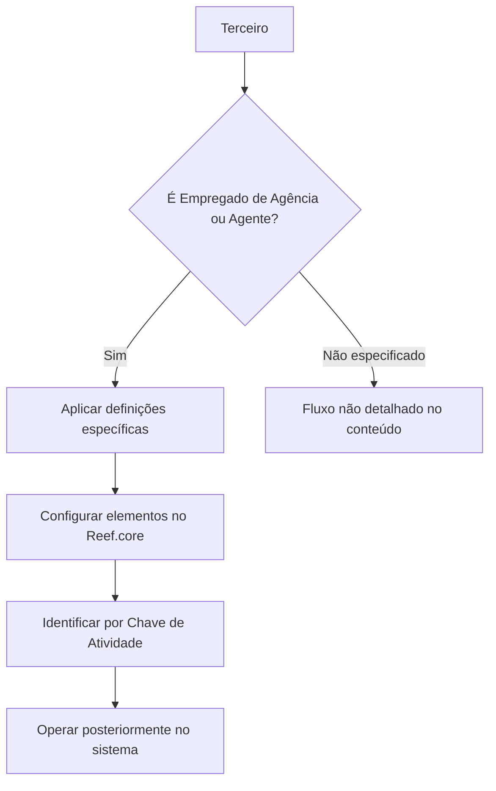

# Definição de Empregados de Agência / Agente no Reef.core

## 1. Metadados do Documento
- **Arquivo de Origem:** Não identificado
- **Tipo de Documento:** Manual Operacional
- **Domínio / Sistema:** Reef.core
- **Público-Alvo:** Operação, Negócio e Administradores do Sistema
- **Data/Versão Identificada:** Não identificada

---

## 2. Resumo Executivo & Contexto de Negócio

O conteúdo descreve a definição e configuração de **Empregados de Agência** ou **Empregados de Agente** no sistema **Reef.core**. A finalidade declarada é permitir que esses terceiros sejam posteriormente operados no sistema.

A identificação dos Empregados de Agência ou Agente é realizada pelo sistema usando uma **Chave de Atividade**. O trecho disponibilizado menciona o valor ou referência `37` associado a essa identificação, sem detalhar sua semântica, formato ou regras de atribuição.

O documento também informa que os asteriscos exibidos nos cartões indicam se a configuração de determinado elemento é obrigatória para a definição de Empregados de Agência ou Empregados de Agente.

Existe um grupo de definições específicas destinado exclusivamente a terceiros classificados como Empregados de Agência ou Agente. O conteúdo fornecido não descreve os elementos, campos ou procedimentos internos desse grupo.

---

## 3. Arquitetura, Componentes & Tecnologias Envolvidas

| Componente / Termo | Papel identificado no conteúdo |
| :--- | :--- |
| Reef.core | Sistema no qual são configurados e posteriormente operados os Empregados de Agência ou Agente. |
| Empregados de Agência | Tipo de terceiro tratado pelas definições específicas do documento. |
| Empregados de Agente | Tipo de terceiro tratado pelas definições específicas do documento. |
| Chave de Atividade | Elemento usado pelo sistema para identificar Empregados de Agência ou Empregados de Agente. |
| Cartões | Elementos visuais que exibem asteriscos para indicar obrigatoriedade de configuração. |
| Grupo de definições específicas | Grupo utilizado exclusivamente quando o terceiro é um Empregado de Agência ou Agente. |



> **Nota de Análise:** O conteúdo não apresenta integrações, APIs, microsserviços, bancos de dados, tecnologias de infraestrutura, ambientes ou contratos técnicos.

---

## 4. Regras de Negócio, Especificações Funcionais & Processos

1. O sistema Reef.core deve permitir a configuração de Empregados de Agência ou Empregados de Agente.
2. A configuração é necessária para que Empregados de Agência ou Empregados de Agente possam ser operados posteriormente no sistema.
3. O sistema identifica Empregados de Agência ou Empregados de Agente por meio da **Chave de Atividade**.
4. O conteúdo associa a identificação à referência `37`, mas não explica se `37` é um código, página, valor de configuração ou outro identificador.
5. Os asteriscos presentes nos cartões indicam se a configuração do elemento correspondente é obrigatória em relação à definição de Empregados de Agência ou Empregados de Agente.
6. Há definições específicas aplicáveis exclusivamente quando o terceiro é um Empregado de Agência ou Empregado de Agente.
7. O documento não detalha:
   - os campos que compõem a definição do empregado;
   - os valores permitidos para a Chave de Atividade;
   - os critérios de classificação de um terceiro como Empregado de Agência ou Agente;
   - as telas, menus ou procedimentos de configuração;
   - os efeitos operacionais da obrigatoriedade sinalizada por asteriscos;
   - validações, mensagens de erro, permissões ou fluxos de aprovação.

---

## 5. Tabelas de Parâmetros, Ambientes e Estruturas de Dados

| Item / Parâmetro | Descrição / Função | Tipo / Valores / Formato | Ambiente / Observações |
| :--- | :--- | :--- | :--- |
| Reef.core | Sistema no qual os empregados são configurados e operados. | Sistema corporativo; detalhes técnicos não informados. | Ambiente não identificado. |
| Empregado de Agência | Terceiro para o qual existem definições específicas. | Classificação de terceiro; critérios não informados. | Aplicável no Reef.core. |
| Empregado de Agente | Terceiro para o qual existem definições específicas. | Classificação de terceiro; critérios não informados. | Aplicável no Reef.core. |
| Chave de Atividade | Identifica Empregados de Agência ou Empregados de Agente no sistema. | Referência `37`; formato e domínio de valores não detalhados. | Aplicável no Reef.core. |
| Asterisco nos cartões | Indica se a configuração de um elemento é obrigatória. | Indicador visual de obrigatoriedade. | Regra relacionada à definição de empregados. |
| Grupo de definições específicas | Reúne definições usadas exclusivamente para terceiros Empregados de Agência ou Agente. | Grupo funcional; estrutura interna não detalhada. | Aplicável quando o terceiro possuir a classificação indicada. |

---

## 6. Bateria de Perguntas & Respostas para RAG (FAQ Sintético)

### P1: Qual é o objetivo da configuração de Empregados de Agência ou Agente no Reef.core?
**R:** O objetivo é configurar no Reef.core os elementos necessários para Empregados de Agência ou Empregados de Agente, permitindo que esses terceiros possam ser operados posteriormente no sistema.

### P2: Como o Reef.core identifica Empregados de Agência ou Empregados de Agente?
**R:** O conteúdo afirma que o sistema identifica Empregados de Agência ou Empregados de Agente por meio da Chave de Atividade. A referência `37` é apresentada no trecho, mas o documento não detalha seu significado técnico ou funcional.

### P3: O que significam os asteriscos exibidos nos cartões?
**R:** Os asteriscos indicam se a configuração do elemento exibido no cartão é obrigatória para a definição de Empregados de Agência ou Empregados de Agente.

### P4: Quando devem ser utilizadas as definições específicas de terceiros?
**R:** As definições específicas devem ser utilizadas exclusivamente quando o terceiro for um Empregado de Agência ou um Empregado de Agente.

### P5: O documento apresenta os campos obrigatórios para cadastro de Empregados de Agência?
**R:** Não. O conteúdo informa apenas que a obrigatoriedade é indicada por asteriscos nos cartões, sem listar os campos, valores, formatos ou validações correspondentes.

### P6: O documento explica como atribuir a Chave de Atividade ao empregado?
**R:** Não. O conteúdo afirma que a Chave de Atividade identifica o empregado, mas não apresenta o procedimento de atribuição, o formato da chave ou os valores permitidos.

### P7: O fluxo descrito se aplica a qualquer tipo de terceiro?
**R:** Não. O trecho informa que o grupo de definições específicas é empregado exclusivamente quando o terceiro é um Empregado de Agência ou Empregado de Agente.

### P8: Há detalhes sobre APIs, integrações ou contratos JSON relacionados ao Reef.core?
**R:** Não. O conteúdo disponibilizado não descreve APIs, métodos HTTP, contratos JSON, microsserviços, integrações ou dependências técnicas externas.

### P9: Há ambientes, URLs ou servidores informados para a configuração?
**R:** Não. O trecho não contém URLs, nomes de servidores, ambientes, credenciais, rotas de log ou parâmetros de infraestrutura.

### P10: O que ocorre após a configuração dos Empregados de Agência ou Agente?
**R:** Após a configuração, os Empregados de Agência ou Empregados de Agente podem ser operados posteriormente no sistema, conforme declarado no conteúdo. Os processos operacionais subsequentes não são detalhados.

---

## 7. Glossário de Termos, Siglas & Conceitos-Chave

- **Reef.core:** Sistema mencionado como responsável pela configuração e operação posterior de Empregados de Agência ou Empregados de Agente.
- **Empregado de Agência:** Tipo de terceiro para o qual o documento indica a existência de definições específicas.
- **Empregado de Agente:** Tipo de terceiro para o qual o documento indica a existência de definições específicas.
- **Terceiro:** Entidade classificada, no contexto apresentado, como Empregado de Agência ou Empregado de Agente.
- **Chave de Atividade:** Elemento utilizado pelo sistema para identificar Empregados de Agência ou Empregados de Agente.
- **Cartões:** Elementos que apresentam asteriscos como indicador de obrigatoriedade de configuração.
- **Definições específicas:** Grupo de definições aplicável exclusivamente aos terceiros Empregados de Agência ou Agente.

---

## 8. Notas Críticas, Riscos & Limitações

- **Limitação de detalhamento:** O conteúdo é um trecho resumido e não apresenta procedimentos operacionais completos.
- **Ambiguidade da referência `37`:** O texto contém `Clave de Actividad... 37`, mas não define se `37` é código de atividade, número de página, referência de seção ou outro identificador.
- **Ausência de estrutura de dados:** Não há campos, formatos, domínios de valores, regras de cálculo ou validações descritas.
- **Ausência de requisitos técnicos:** Não foram identificados ambientes, URLs, integrações, APIs, servidores, tecnologias ou dependências.
- **Risco operacional:** A interpretação de quais elementos são obrigatórios depende dos asteriscos presentes nos cartões, mas os cartões e seus conteúdos não estão incluídos no material fornecido.
- **Nota de Análise:** O documento lista Empregados de Agência ou Agente e a Chave de Atividade, porém não detalha métodos de configuração, contratos, permissões ou mecanismos de validação no Reef.core.

---

## 9. Conteúdo Bruto Estruturado (Referência Fiel)

```text
--- [PÁGINA 1 DE 1] ---

DEFINICIÓN de los EMPLEADOS de AGENTES
Se relacionan los elementos que permiten configurar en Reef.core a los Empleados de Agencia o
Empleados de Agente, para poder operar posteriormente con ellos en el Sistema.
El Sistema identifica a los Empleados de Agencia o de los Agentes con la Clave de Actividad... 37.
Los Asteriscos de las Tarjetas indican si la configuración del elemento es obligatoria en relación
con la definición de los Empleados de Agencia o Empleados de Agente.
Definiciones ESPECÍFICAS, propias para los
Terceros EMPLEADOS DE AGENCIA / AGENTE
En este Grupo se encuentran definiciones que se emplean
exclusivamente cuando el Tercero es un EMPLEADO DE AGENCIA O
AGENTE.
 / 
 CF
Home Solutions APIs Documentation Zeus
EN
```
