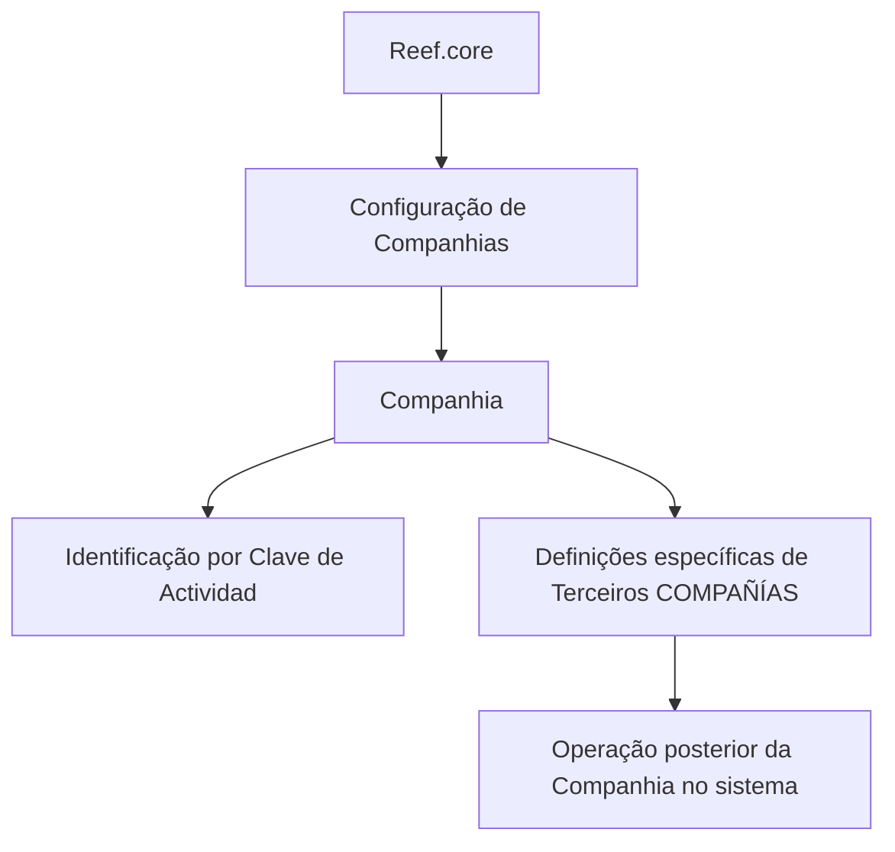

# Definição de Companhias no Reef.core

## 1. Metadados do Documento
- **Arquivo de Origem:** `Não identificado`
- **Tipo de Documento:** Manual Operacional
- **Domínio / Sistema:** Reef.core — configuração de Terceiros do tipo Companhia
- **Público-Alvo:** Operação, Analistas Funcionais e Administradores de Configuração
- **Data/Versão Identificada:** Não identificada

---

## 2. Resumo Executivo & Contexto de Negócio

O conteúdo descreve a definição de **Companhias** no sistema **Reef.core**. O objetivo informado é relacionar os elementos necessários para configurar Companhias e, posteriormente, permitir a operação dessas Companhias no sistema.

No contexto apresentado, o Reef.core identifica as Companhias do sistema por meio da **Clave de Actividad**. O trecho disponibilizado menciona a referência “39” associada a esse conceito, mas não fornece detalhamento adicional sobre formato, valores permitidos ou regras de preenchimento da chave.

O documento também estabelece que existem definições específicas para Terceiros classificados como **COMPAÑÍAS**. Essas definições devem ser empregadas exclusivamente quando o Terceiro for uma Companhia.

A obrigatoriedade dos elementos de configuração é indicada por asteriscos nas respectivas telas ou cartões. O conteúdo não identifica quais cartões possuem asteriscos nem descreve as consequências operacionais da ausência de configuração dos elementos obrigatórios.

---

## 3. Arquitetura, Componentes & Tecnologias Envolvidas

Os componentes e termos identificados são:

| Componente / Termo | Papel identificado no conteúdo |
| :--- | :--- |
| Reef.core | Sistema no qual as Companhias são configuradas e posteriormente operadas. |
| Compañías / Companhias | Entidades configuráveis e operáveis no Reef.core. |
| Terceros COMPAÑÍAS | Grupo de definições utilizado exclusivamente quando o Terceiro é uma Companhia. |
| Clave de Actividad | Elemento pelo qual o Reef.core identifica as Companhias do sistema. |
| Tarjetas | Cartões ou telas cuja marcação por asterisco indica obrigatoriedade de configuração. |
| Home Solutions APIs Documentation Zeus | Texto presente na extração bruta; o documento não explica sua função ou relação com Reef.core. |



> **Nota de Análise:** O conteúdo não detalha arquitetura técnica, serviços, APIs, bancos de dados, métodos HTTP, contratos JSON, ambientes ou integrações do Reef.core.

---

## 4. Regras de Negócio, Especificações Funcionais & Processos

1. As Companhias devem ser configuradas no Reef.core antes de poderem ser operadas no sistema.
2. O Reef.core identifica as Companhias do sistema por meio da **Clave de Actividad**.
3. Existem definições específicas próprias para Terceiros classificados como **COMPAÑÍAS**.
4. As definições do grupo de Terceiros COMPAÑÍAS devem ser utilizadas exclusivamente quando o Terceiro for uma Companhia.
5. A presença de asteriscos nas Tarjetas indica que o elemento correspondente é obrigatório para a configuração relacionada à definição de Companhias.
6. O conteúdo menciona a referência “39” após a Clave de Actividad, mas não explica se esse valor corresponde a uma página, código, referência documental ou regra de negócio.

### Processo identificado

1. Relacionar os elementos necessários para a configuração de Companhias no Reef.core.
2. Configurar os elementos obrigatórios, identificados por asteriscos nas Tarjetas.
3. Aplicar as definições específicas de Terceiros COMPAÑÍAS quando o Terceiro for uma Companhia.
4. Identificar a Companhia no sistema utilizando a Clave de Actividad.
5. Operar a Companhia posteriormente no Reef.core.

---

## 5. Tabelas de Parâmetros, Ambientes e Estruturas de Dados

| Item / Parâmetro | Descrição / Função | Tipo / Valores / Formato | Ambiente / Observações |
| :--- | :--- | :--- | :--- |
| Companhia | Entidade que deve ser configurada para posterior operação no sistema. | Não especificado. | Reef.core. |
| Clave de Actividad | Elemento utilizado pelo Reef.core para identificar Companhias. | Não especificado. O texto apresenta a referência “39”. | Não há detalhamento de formato ou valores. |
| Terceiro Companhia | Classificação de Terceiro para a qual existem definições específicas. | Terceiro classificado como Companhia. | As definições são exclusivas para esse caso. |
| Asterisco nas Tarjetas | Indicador de obrigatoriedade de um elemento de configuração. | Marcador visual. | Aplicável à configuração relacionada à definição de Companhias. |
| Definições específicas | Conjunto de definições exclusivo para Terceiros COMPAÑÍAS. | Não especificado. | Não aplicável a Terceiros que não sejam Companhias. |
| Home Solutions APIs Documentation Zeus | Texto adicional presente no conteúdo bruto. | Não especificado. | Relação com Reef.core não detalhada. |
| EN | Texto adicional presente no conteúdo bruto. | Possível indicador de idioma, sem confirmação no documento. | Não detalhado. |

---

## 6. Bateria de Perguntas & Respostas para RAG (FAQ Sintético)

### P1: Qual é o objetivo da definição de Companhias no Reef.core?
**R:** O objetivo é relacionar os elementos que permitem configurar Companhias no Reef.core para que essas Companhias possam ser operadas posteriormente no sistema.

### P2: Como o Reef.core identifica as Companhias do sistema?
**R:** O conteúdo informa que o Reef.core identifica as Companhias do sistema por meio da Clave de Actividad. O documento não detalha o formato, os valores permitidos ou a origem dessa chave.

### P3: Quando as definições específicas de Terceiros COMPAÑÍAS devem ser utilizadas?
**R:** As definições específicas de Terceiros COMPAÑÍAS devem ser utilizadas exclusivamente quando o Terceiro for uma Companhia.

### P4: O que indicam os asteriscos nas Tarjetas?
**R:** Os asteriscos nas Tarjetas indicam a obrigatoriedade do elemento de configuração em relação à definição das Companhias.

### P5: É possível operar uma Companhia no Reef.core sem configurá-la?
**R:** O conteúdo estabelece que os elementos permitem configurar Companhias para que seja possível operar posteriormente com elas no sistema. Portanto, a configuração antecede a operação, embora o documento não detalhe validações técnicas para impedir a operação sem configuração.

### P6: Quais elementos de configuração de Companhia são obrigatórios?
**R:** O documento informa que elementos marcados por asteriscos nas Tarjetas são obrigatórios, mas não lista quais elementos, cartões ou campos possuem essa marcação.

### P7: O documento descreve APIs ou contratos técnicos para Companhias?
**R:** Não. Embora o texto bruto contenha a expressão “Home Solutions APIs Documentation Zeus”, não há descrição de APIs, métodos HTTP, endpoints, autenticação ou contratos de dados relacionados a Companhias.

### P8: Qual é a função das definições específicas de Terceiros COMPAÑÍAS?
**R:** Essas definições são empregadas exclusivamente quando o Terceiro é uma Companhia. O conteúdo não apresenta os campos, telas, regras adicionais ou comportamentos dessas definições.

### P9: O que significa a referência “39” após Clave de Actividad?
**R:** O texto apresenta “Clave de Actividad... 39”, mas não explica o significado da referência. Ela pode indicar uma paginação ou referência documental, porém essa interpretação não é confirmada pelo conteúdo.

### P10: O documento informa ambientes, servidores ou rotas de log do Reef.core?
**R:** Não. O conteúdo disponibilizado não contém URLs, servidores, portas, ambientes, variáveis de configuração ou caminhos de logs.

---

## 7. Glossário de Termos, Siglas & Conceitos-Chave

- **Reef.core:** Sistema citado como responsável por configurar e permitir a operação de Companhias.
- **Compañías / Companhias:** Entidades do sistema Reef.core que precisam ser configuradas antes da operação.
- **Terceros:** Termo utilizado para classificar entidades; o documento menciona um grupo específico para Terceiros que são Companhias.
- **Terceros COMPAÑÍAS:** Grupo de definições empregado exclusivamente quando um Terceiro é uma Companhia.
- **Clave de Actividad:** Chave pela qual o Reef.core identifica as Companhias do sistema.
- **Tarjetas:** Cartões ou telas em que a presença de asteriscos indica obrigatoriedade de configuração.
- **EN:** Texto presente no conteúdo bruto, sem definição explícita no documento.

---

## 8. Notas Críticas, Riscos & Limitações

- O arquivo de origem, tipo técnico exato, versão, data e autoria não foram identificados no conteúdo fornecido.
- O documento não descreve os campos concretos necessários para configurar uma Companhia.
- A Clave de Actividad é citada como identificador de Companhias, mas não possui formato, domínio de valores, origem ou processo de validação documentados.
- O conteúdo não detalha as Tarjetas nem identifica quais elementos obrigatórios são marcados por asteriscos.
- Não há especificação de APIs, integrações, ambientes, permissões, logs, banco de dados ou mecanismos de erro.
- A expressão “Home Solutions APIs Documentation Zeus” aparece no texto bruto, porém sua relação funcional ou técnica com a configuração de Companhias não é explicada.
- **Nota de Análise:** O documento lista definições específicas para Terceiros COMPAÑÍAS, porém não detalha os atributos, comportamentos ou regras dessas definições.

---

## 9. Conteúdo Bruto Estruturado (Referência Fiel)

```text
--- [PÁGINA 1 DE 1] ---

DEFINICIÓN de las COMPAÑÍAS
Se relacionan los elementos que permiten configurar en Reef.core a las Compañías, para poder
operar posteriormente con ellas en el Sistema.
Reef.core identifica a las Compañías del Sistema con la Clave de Actividad... 39.
Los Asteriscos de las Tarjetas indican la obligatoriedad en la configuración del Elemento en
relación con la definición de las Compañías.
Definiciones ESPECÍFICAS, propias de los
Terceros COMPAÑÍAS
En este Grupo se encuentran definiciones que se emplean
exclusivamente cuando el Tercero es una COMPAÑÍA.
 /
 CF
Home Solutions APIs Documentation Zeus
EN
```
