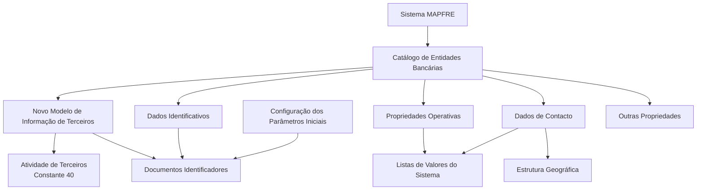

# Definição e Configuração de Entidades Bancárias no Sistema MAPFRE

## 1. Metadados do Documento
- **Arquivo de Origem:** Não identificado no conteúdo extraído
- **Tipo de Documento:** Especificação Funcional
- **Domínio / Sistema:** MAPFRE — Catálogo de Entidades Bancárias / Modelo de Informação de Terceiros
- **Público-Alvo:** Negócio, Configuração Local, Departamento de Tecnologia Local e Operação
- **Data/Versão Identificada:** Não identificada

---

## 2. Resumo Executivo & Contexto de Negócio

O documento define os atributos funcionais usados pelo sistema MAPFRE para cadastrar, identificar, localizar, classificar e controlar entidades bancárias. O catálogo de entidades bancárias é apresentado como um repositório específico, inicialmente entregue sem conteúdo, no qual podem ser codificadas múltiplas entidades bancárias utilizadas localmente.

A definição está alinhada ao Novo Modelo de Informação de Terceiros. Nesse modelo, uma entidade bancária é identificada por uma atividade específica, um tipo de documento identificativo e uma chave associada. A atividade associada às entidades bancárias é a constante `40`, pertencente ao núcleo do sistema e não modificável.

Os dados do catálogo são organizados em quatro grupos: Dados Identificativos, Dados de Contacto, Propriedades Operativas e Outras Propriedades. Esses grupos permitem representar identidade corporativa, endereço e comunicação, características bancárias e condições de utilização da entidade dentro das operações de terceiros.

A configuração local possui responsabilidade relevante na definição de catálogos de valores. O Departamento de Tecnologia Local deve identificar valores adequados ao país para atributos como Tipo de Domicílio e Tipo de Entidad, pois valores disponibilizados pelo núcleo podem não refletir o uso local ou podem não existir como valores pré-configurados.

O documento também estabelece regras operacionais para SWIFT/BIC, domiciliação bancária, concentração bancária, cálculo de data valor e inabilitação de entidades bancárias. Não apresenta APIs, contratos HTTP, bancos de dados físicos, servidores, URLs, versões técnicas ou fluxos de integração entre microsserviços.

---

## 3. Arquitetura, Componentes & Tecnologias Envolvidas

O conteúdo descreve uma estrutura funcional de catálogo dentro do sistema MAPFRE, sem detalhar arquitetura técnica, microsserviços, APIs, tecnologias de desenvolvimento, protocolos ou ambientes de implantação.

Os componentes funcionais identificados são:

- **Sistema MAPFRE:** Sistema no qual entidades bancárias podem ser cadastradas, associadas e utilizadas em operações de captura e alteração de terceiros físicos e jurídicos.
- **Catálogo de Entidades Bancárias:** Repositório de informação específico, inicialmente vazio, destinado à codificação de múltiplas entidades bancárias.
- **Novo Modelo de Informação de Terceiros:** Modelo que determina identificação por atividade, documento identificativo e chave.
- **Atividade de Terceiros:** Contexto funcional no qual entidades bancárias usam a atividade constante `40`.
- **Documentos Identificadores:** Referência funcional para o tipo e a chave de documento identificativo.
- **Estrutura Geográfica:** Estrutura de quatro níveis usada para localização geográfica da entidade bancária.
- **Listas de Valores do Sistema:** Catálogos cuja adequação local deve ser identificada pelo Departamento de Tecnologia Local.
- **Configuração dos Parâmetros Iniciais:** Fonte de configuração para o tipo de documento identificativo atribuído inicialmente quando a atividade `40` não possuir documento associado.



> **Nota de Análise:** O documento não detalha componentes técnicos de implementação, tais como APIs, métodos HTTP, contratos JSON, persistência, autenticação, logs, URLs, ambientes ou integrações.

---

## 4. Regras de Negócio, Especificações Funcionais & Processos

### 4.1. Repositório de entidades bancárias

- O núcleo do sistema permite codificar múltiplas entidades bancárias.
- As entidades bancárias são armazenadas em um repositório de informação específico.
- O repositório é entregue inicialmente às instalações sem conteúdo.

### 4.2. Identificação no Novo Modelo de Informação de Terceiros

- As entidades bancárias possuem uma chave de atividade específica no Novo Modelo de Informação de Terceiros.
- O atributo **Código de Actividad del Tercero** deve possuir o valor constante `40`.
- A atividade `40` é uma atividade pertencente ao núcleo do sistema.
- O valor `40` não pode ser modificado.
- Para coerência com as demais pessoas físicas e jurídicas, a entidade bancária deve possuir um tipo de documento identificativo e uma chave associada.
- O valor do tipo de documento identificativo é `THP`, desde que a entidade bancária não tenha documentos identificativos próprios associados.
- A chave do documento identificativo contém o código do tipo de documento identificativo.
- O documento apresenta como exemplo o Banco de Santander, identificado na Espanha com tipo de documento `NIF` e chave `A-39000013`.

### 4.3. Identificação funcional e comercial

- A **Clave Entidad Bancaria** é a chave usada para identificar bancos que operam localmente com a entidade MAPFRE.
- O **Nombre Entidad Bancaria** armazena o nome pelo qual a entidade bancária é identificada no sistema.
- A **Abreviatura Entidad Bancaria** armazena o nome abreviado usado para identificar a entidade bancária no sistema.
- O **Código de Referencia** armazena uma chave de referência da entidade bancária.
- O **Código de Entidad Nueva** armazena o código da entidade bancária compradora quando ocorre concentração bancária e uma entidade absorve uma ou mais entidades bancárias.

### 4.4. Localização geográfica e endereço

- A entidade bancária pode ser identificada geograficamente por chaves correspondentes ao primeiro, segundo, terceiro e quarto níveis da estrutura geográfica.
- O quarto nível pode possuir conteúdo complementar, pois nem todos os países possuem esse mesmo grau de detalhamento geográfico.
- O quarto nível vernáculo permite representar a chave conforme a forma própria do local ou país de nascimento.
- O nome vernáculo do quarto nível armazena sua nomenclatura no idioma vernáculo.
- O atributo **Tipo de Domicilio** deve refletir a tipologia do endereço conforme o uso e a exploração local que a seguradora pretende fazer da informação.
- Exemplos de Tipo de Domicilio: Calle, Avenida, Cerrada, Carretera e Paseo.
- O Departamento de Tecnologia Local deve identificar os valores aplicáveis nas listas de valores do sistema, pois valores pré-definidos pelo núcleo podem não corresponder ao uso comum do país.
- Os valores de Tipo de Domicilio são transversais à aplicação; não são exclusivos da configuração de entidades bancárias.
- Os atributos de **Domicilio** descrevem a localização e a tipologia do endereço, permitindo também informações complementares que facilitem localizar a entidade bancária.
- O **Código Postal** contém a chave do código postal onde a entidade bancária está localizada.
- O **Apartado Postal** contém a chave da caixa postal da entidade bancária, normalmente situada em uma agência de correios.

### 4.5. Comunicação corporativa

- A **Dirección Correo Electrónico** armazena o endereço de correio eletrônico corporativo da entidade bancária.
- O **Prefijo Telefónico del País** armazena o prefixo de país aplicável ao telefone corporativo.
- Exemplos apresentados: Espanha `+34`, México `+52` e Argentina `+54`.
- O **Prefijo Zonal Telefónico** armazena o prefixo zonal aplicável ao telefone corporativo.
- Exemplos apresentados: Madrid `91`, Barcelona `93`, Monterrey/Nuevo León `81` e Ciudad de México `55`.
- O **Número Fax** armazena o número telefônico de fax corporativo.
- O **Número Telefónico** armazena o telefone corporativo.
- A **Extensión Telefónica**, quando necessária, armazena a extensão do telefone corporativo.

### 4.6. Classificação e propriedades operativas

- O **Tipo de Entidad** classifica a entidade bancária conforme o uso e a exploração local desejados pela seguradora.
- Exemplos de Tipo de Entidad:
  - Bancos, caixas de poupança e cooperativas de crédito.
  - Entidades de dinheiro eletrônico.
  - Entidades de pagamento.
  - Estabelecimentos financeiros de crédito.
  - Estabelecimentos de compra e venda de moeda estrangeira.
  - Sucursais de entidades estrangeiras.
  - Intermediação financeira no mercado de crédito.
- Não existem valores pré-definidos pelo núcleo para Tipo de Entidad.
- O Departamento de Tecnologia Local deve identificar os valores de Tipo de Entidad nas listas de valores do sistema.
- O **Tipo de Institución Bancaria** suporta classificação bancária conforme o uso local dado à informação.
- Exemplos de Tipo de Institución Bancaria:
  - Bancos minoristas.
  - Bancos comerciales.
  - Bancos de desarrollo comunitario.
  - Bancos de inversión.
  - Bancos en línea o neobancos.
  - Cooperativas de crédito.
  - Asociaciones de ahorro y préstamo.
- O **Tipo de Empresa Jurídica** armazena o tipo de empresa jurídica da entidade bancária.
- O **Tipo de Domiciliación Bancaria** representa a tipologia do processo de domiciliação bancária considerada pela entidade MAPFRE local, de acordo com o acordo comercial entre as partes.
- Valores definidos para Tipo de Domiciliación Bancaria:
  - Domiciliación con cuentas bancarias.
  - Domiciliación con Tarjetas.
  - Domiciliación indistintamente con Tarjetas y/o Cuentas Bancarias.
- A **Fecha de Constitución** armazena a data de constituição legal da entidade bancária no país em que opera.
- A **Nacionalidad** armazena a chave do primeiro nível da estrutura geográfica correspondente ao país de procedência da entidade bancária.
- O **Número de Días Extra** armazena o número de dias que a entidade bancária considera para compor a `FECHA VALOR` em operações financeiras.

### 4.7. Regra de SWIFT/BIC

- A **Clave SWIFT** contém o código SWIFT, também denominado BIC.
- SWIFT significa *Society for Worldwide Interbank Financial Telecommunication*.
- BIC significa *Bank Identifier Code*.
- O SWIFT/BIC é uma série alfanumérica de `8` ou `11` dígitos.
- O código é utilizado para identificar o banco receptor de uma transferência internacional.
- Conforme o documento, SWIFT/BIC aplica-se unicamente a países que não pertencem à Zona SEPA.
- O documento descreve a Zona SEPA como composta por 28 países da União Europeia, Liechtenstein, Islândia, Noruega, Andorra, Mônaco, San Marino, Suíça, Reino Unido e Cidade do Vaticano.

### 4.8. Inabilitação de entidade bancária

- A propriedade **Inhabilitación** indica que a entidade bancária está inabilitada no sistema.
- Uma entidade bancária inabilitada não pode ser utilizada nem associada em operações de captura e/ou modificação de terceiros físicos e/ou jurídicos.

### 4.9. Regra operacional para o tipo de documento identificativo

- Se a atividade `40` atribuída a entidades bancárias não possuir nenhum tipo de documento identificativo associado, o sistema atribuirá inicialmente à entidade bancária o tipo de documento definido na configuração dos parâmetros da instalação.
- Essa regra é aplicável na captura inicial de uma entidade bancária.

---

## 5. Tabelas de Parâmetros, Ambientes e Estruturas de Dados

| Item / Parâmetro | Descrição / Função | Tipo / Valores / Formato | Ambiente / Observações |
| :--- | :--- | :--- | :--- |
| Compañía | Código da companhia na qual a entidade bancária está sendo definida. | Código de companhia | Dados Identificativos |
| Código de Actividad del Tercero | Código da atividade associada a entidades bancárias no Novo Modelo de Informação de Terceiros. | Constante `40` | Valor de núcleo; não pode ser modificado. |
| Tipo Documento Identificador | Tipo de documento identificativo da entidade bancária. | `THP` quando não existirem documentos identificativos próprios associados | Pode ser atribuído segundo configuração inicial se atividade `40` não tiver documento associado. |
| Clave del Documento Identificador | Código associado ao tipo de documento identificativo. | Código de documento | Exemplo: NIF `A-39000013` para Banco de Santander na Espanha. |
| Clave Entidad Bancaria | Chave pela qual bancos que operam localmente com MAPFRE são identificados. | Chave de entidade | Dados Identificativos |
| Nombre Entidad Bancaria | Nome da entidade bancária no sistema. | Texto | Dados Identificativos |
| Abreviatura Entidad Bancaria | Nome abreviado da entidade bancária. | Texto | Dados Identificativos |
| Primer Nivel de la Estructura Geográfica | Chave do primeiro nível geográfico da entidade bancária. | Chave geográfica | Dados de Contacto |
| Segundo Nivel de la Estructura Geográfica | Chave do segundo nível geográfico da entidade bancária. | Chave geográfica | Dados de Contacto |
| Tercer Nivel de la Estructura Geográfica | Chave do terceiro nível geográfico da entidade bancária. | Chave geográfica | Dados de Contacto |
| Cuarto Nivel de la Estructura Geográfica | Chave do quarto nível geográfico da entidade bancária. | Chave geográfica | Dados de Contacto |
| Nombre del Cuarto Nivel de la Estructura Geográfica | Informação correspondente ao quarto nível geográfico. | Texto | Pode conter informação complementar em países sem esse nível de detalhe. |
| Cuarto Nivel Vernáculo de la Estructura Geográfica | Chave do quarto nível geográfico na forma própria do local ou país. | Chave geográfica | Dados de Contacto |
| Nombre vernáculo del Cuarto Nivel de la Estructura Geográfica | Nomenclatura do quarto nível geográfico na língua vernácula. | Texto | Dados de Contacto |
| Tipo de Domicilio | Tipologia do endereço da entidade bancária. | Exemplos: Calle, Avenida, Cerrada, Carretera, Paseo | Valores devem ser identificados localmente nas listas de valores; uso transversal. |
| Domicilio | Descrição do endereço e informação complementar de localização. | Dados de endereço | Dados de Contacto |
| Código Postal | Chave do código postal do local onde está situada a entidade bancária. | Código postal | Dados de Contacto |
| Apartado Postal | Chave da caixa postal da entidade bancária. | Código de caixa postal | Geralmente relacionado a uma agência de correios. |
| Dirección Correo Electrónico | Endereço de correio eletrônico corporativo. | E-mail | Dados de Contacto |
| Prefijo Telefónico del País | Prefixo telefônico internacional do telefone corporativo. | Exemplos: Espanha `+34`, México `+52`, Argentina `+54` | Dados de Contacto |
| Prefijo Zonal Telefónico | Prefixo zonal do telefone corporativo. | Exemplos: Madrid `91`, Barcelona `93`, Monterrey `81`, Ciudad de México `55` | Dados de Contacto |
| Número Fax | Número do fax corporativo. | Número telefônico | Dados de Contacto |
| Número Telefónico | Número de telefone corporativo. | Número telefônico | Dados de Contacto |
| Extensión Telefónica | Extensão do telefone corporativo, quando necessária. | Número ou identificador de extensão | Dados de Contacto |
| Tipo de Entidad | Classificação da entidade bancária para uso e exploração local. | Bancos; caixas de poupança; cooperativas de crédito; dinheiro eletrônico; pagamento; crédito; câmbio; sucursais estrangeiras; intermediação financeira | Não existem valores pré-definidos pelo núcleo. |
| Tipo de Institución Bancaria | Tipologia ou classificação bancária. | Bancos minoristas, comerciais, comunitários, de investimento, neobancos, cooperativas de crédito, associações de poupança e empréstimo | Propriedades Operativas |
| Tipo de Empresa Jurídica | Tipo de empresa jurídica da entidade bancária. | Não detalhado | Propriedades Operativas |
| Tipo de Domiciliación Bancaria | Tipologia do processo de domiciliação bancária. | Contas bancárias; cartões; cartões e/ou contas bancárias | Conforme acordo comercial MAPFRE local e entidade bancária. |
| Fecha de Constitución | Data de constituição legal da entidade bancária no país onde opera. | Data | Propriedades Operativas |
| Clave SWIFT | Código de identificação internacional do banco destinatário de transferência. | Alfanumérico de `8` ou `11` dígitos | Aplicável, segundo o documento, apenas fora da Zona SEPA. |
| Nacionalidad | País de procedência da entidade bancária. | Chave do primeiro nível da estrutura geográfica | Propriedades Operativas |
| Código de Referencia | Chave de referência da entidade bancária. | Código de referência | Propriedades Operativas |
| Código de Entidad Nueva | Código da entidade bancária adquirente em processo de concentração bancária. | Código de entidade | Aplicável quando uma entidade absorve outra(s). |
| Número de Días Extra | Número de dias usados pela entidade bancária para compor a FECHA VALOR. | Número de dias | Operações financeiras |
| Inhabilitación | Indica que a entidade bancária não pode ser utilizada no sistema. | Estado de inabilitação | Bloqueia associação em captura e/ou alteração de terceiros físicos e jurídicos. |

---

## 6. Bateria de Perguntas & Respostas para RAG (FAQ Sintético)

### P1: Qual código de atividade deve ser utilizado para entidades bancárias no sistema?
**R:** As entidades bancárias devem utilizar o código de atividade `40` no Novo Modelo de Informação de Terceiros. O valor `40` é uma constante pertencente ao núcleo do sistema e não pode ser modificado.

### P2: Quando o tipo de documento identificativo de uma entidade bancária será THP?
**R:** O tipo de documento identificativo será `THP` quando a entidade bancária não possuir documentos identificativos próprios associados.

### P3: O que acontece na captura inicial de uma entidade bancária se a atividade 40 não tiver documento identificativo associado?
**R:** Se a atividade `40` não tiver nenhum tipo de documento identificativo associado, o sistema atribuirá inicialmente à entidade bancária o tipo de documento definido na configuração dos parâmetros da instalação.

### P4: Como o documento exemplifica a identificação do Banco de Santander na Espanha?
**R:** O documento informa que o Banco de Santander é identificado no Reino de Espanha pelo tipo de documento `NIF`, cuja chave é `A-39000013`.

### P5: Quem deve configurar os valores de Tipo de Domicilio e Tipo de Entidad?
**R:** O Departamento de Tecnologia Local deve identificar os valores aplicáveis nos catálogos do sistema que representam Listas de Valores. Para Tipo de Domicilio, os valores de núcleo podem não refletir o uso comum no país. Para Tipo de Entidad, não existem valores pré-definidos pelo núcleo.

### P6: Quais são os valores permitidos para Tipo de Domiciliación Bancaria?
**R:** Os valores definidos são: domiciliação com contas bancárias, domiciliação com cartões e domiciliação indistintamente com cartões e/ou contas bancárias. A escolha deve refletir o processo de domiciliação adotado pela entidade MAPFRE local e o acordo comercial com a entidade bancária.

### P7: Para que serve a Clave SWIFT ou código BIC?
**R:** A Clave SWIFT, também chamada código BIC, identifica o banco receptor de uma transferência internacional. O código é alfanumérico e possui 8 ou 11 dígitos. Segundo o documento, ele é aplicado somente em países fora da Zona SEPA.

### P8: O que representa o Número de Días Extra?
**R:** O Número de Días Extra representa a quantidade de dias que a entidade bancária considera para compor a `FECHA VALOR` em suas operações financeiras.

### P9: Qual é a consequência de inabilitar uma entidade bancária?
**R:** A propriedade Inhabilitación indica que a entidade bancária não pode ser utilizada ou associada em operações de captura e/ou modificação de terceiros físicos e/ou jurídicos no sistema.

### P10: Como o catálogo trata processos de concentração bancária?
**R:** O atributo Código de Entidad Nueva armazena o código da entidade bancária compradora quando ocorre concentração bancária e uma entidade absorve uma ou mais entidades bancárias.

### P11: Quais níveis geográficos podem ser cadastrados para uma entidade bancária?
**R:** O catálogo prevê primeiro, segundo, terceiro e quarto níveis da estrutura geográfica. Também permite nome do quarto nível, quarto nível em forma vernácula e nome vernáculo do quarto nível.

### P12: Quais dados de contato corporativo podem ser registrados para uma entidade bancária?
**R:** Podem ser registrados endereço de correio eletrônico corporativo, prefixo telefônico do país, prefixo zonal, número de fax, número telefônico e extensão telefônica quando necessária, além de endereço, código postal e apartado postal.

---

## 7. Glossário de Termos, Siglas & Conceitos-Chave

- **BIC:** *Bank Identifier Code*; código também utilizado para identificar o banco receptor de uma transferência internacional.
- **Código de Actividad del Tercero:** Código de atividade que identifica a natureza da entidade no Modelo de Informação de Terceiros; para entidades bancárias, o valor é `40`.
- **Domiciliación Bancaria:** Processo de domiciliação bancária contemplado pela entidade MAPFRE local conforme acordo comercial com a entidade bancária.
- **FECHA VALOR:** Data valor de operações financeiras, cuja composição pode considerar o Número de Días Extra da entidade bancária.
- **MAPFRE:** Entidade/sistema corporativo citado como contexto de operação local das entidades bancárias.
- **NIF:** Tipo de documento identificativo usado no exemplo do Banco de Santander no Reino de Espanha.
- **Novo Modelo de Informação de Terceiros:** Modelo no qual entidades bancárias são identificadas por atividade específica, tipo de documento identificativo e chave associada.
- **SEPA:** Zona Única de Pagamentos em Europa, descrita no documento como composta por países da União Europeia e outros países/territórios listados.
- **SWIFT:** *Society for Worldwide Interbank Financial Telecommunication*; código alfanumérico de 8 ou 11 dígitos para identificação do banco receptor de transferência internacional.
- **THP:** Valor de tipo de documento identificativo utilizado quando a entidade bancária não possui documentos identificativos próprios associados.

---

## 8. Notas Críticas, Riscos & Limitações

- O catálogo de entidades bancárias é entregue inicialmente vazio; a codificação local das entidades é necessária.
- O código de atividade `40` é uma constante de núcleo e não pode ser alterado.
- A configuração de Tipo de Domicilio depende de validação do Departamento de Tecnologia Local, pois valores padrão do núcleo podem não ser apropriados ao país.
- A configuração de Tipo de Entidad também depende do Departamento de Tecnologia Local, pois o núcleo não disponibiliza valores pré-definidos.
- Os valores configurados para Tipo de Domicilio são transversais à aplicação, não exclusivos para entidades bancárias; configurações locais podem afetar outros usos do sistema.
- A regra de SWIFT/BIC é apresentada apenas no nível funcional; o documento não especifica validações de formato, integração com redes bancárias ou verificações de pertencimento à SEPA.
- O documento não detalha obrigatoriedade de campos, tipos físicos de dados, tamanhos máximos, validações de consistência, permissões, APIs, logs, fluxos de aprovação ou tratamento de erros.
- A referência a “28 países da União Europeia” e à lista de participantes SEPA é apresentada literalmente conforme o conteúdo de origem, sem atualização ou validação externa.

---

## 9. Conteúdo Bruto Estruturado (Referência Fiel)

```text
--- [PÁGINA 1 DE 8] ---

DEFINICIÓN de Entidades Bancarias
La banca o el sistema bancario, es el conjunto de entidades o instituciones que, dentro de una
economía determinada, prestan servicios financieros. Entre los bancos, existen algunos tipos, como
los bancos de inversión, que a diferencia de los bancos comerciales se centran en ciertos tipos de
servicios financieros y de consultoría.
Funcionalmente, el núcleo del Sistema cuenta con la posibilidad de codificar múltiples entidades
Bancarias en un repositorio de información específico que se entrega inicialmente a las instalaciones
vacío de contenido.
Datos Identificativos
Datos de Contacto
Propiedades Operativas
Otras Propiedades
Datos Identificativos
Compañía
Este Atributo del catálogo de entidades bancarias contiene el código de la compañía sobre la que se
está realizando la definición de la Entidad Bancaria.
Código de Actividad del Tercero
Esta propiedad indicará el código de la Actividad del Tercero que se asocian a las entidades
Bancarias puesto que en el Nuevo Modelo de Información de Terceros, las entidades bancarias se
 / 
 CF
Home Solutions APIs Documentation Zeus
EN

--- [PÁGINA 2 DE 8] ---

identifican en el sistema con una clave de actividad específica.
NOTA: Su valor es la constante '40' puesto que esta es una de las actividades que corresponden al
núcleo y por ello no puede ser modificado.
Tipo Documento Identificador
En el nuevo Modelo de Información de Terceros y por coherencia con la información del del resto de
Personas Físicas o Jurídicas las entidades bancarias se deben identificar en el sistema con un tipo
de documento identificativo y una clave asociada.
El valor del tipo de documento identificativo es THP siempre y cuando no tengan asociados
documentos identificativos propios.
Clave del Documento Identificador
En el nuevo Modelo de Información de Terceros y por coherencia con los datos del resto de Terceros,
las entidades bancarias se identifican en el sistema con un código de actividad propio además de un
tipo de documento identificativo y una clave asociada.
Este atributo contendrá el código del Tipo de documento Identificador.
A modo de ejemplo, el Banco de Santander se identifica en el Reino de España con el Tipo de
Documento NIF cuya clave es A-39000013
Clave Entidad Bancaria
Este atributo será la clave por la que se va a identificar los distintos bancos que operan localmente
con la entidad MAPFRE.
Nombre Entidad Bancaria
Este atributo contiene el nombre por el que se identifica a la Entidad Bancaria en el Sistema.
Abreviatura Entidad Bancaria
Este atributo contiene el nombre abreviado por el que se puede identificar a la Entidad Bancaria en
el Sistema.
Datos de Contacto
Primer Nivel de la Estructura Geográfica
Este atributo contiene la clave del primer nivel de la estructura con la que se va a identificar
geográficamente a las Entidades Bancarias que operan localmente con la entidad MAPFRE.
Segundo Nivel de la Estructura Geográfica

--- [PÁGINA 3 DE 8] ---

Este atributo contiene la clave del segundo nivel de la estructura con la que se va a identificar
geográficamente a las Entidades Bancarias que operan localmente con la entidad MAPFRE.
Tercer Nivel de la Estructura Geográfica
Este atributo contiene la clave del tercer nivel de la estructura con la que se va a identificar
geográficamente a las Entidades Bancarias que operan localmente con la entidad MAPFRE.
Cuarto Nivel de la Estructura Geográfica
Este atributo contiene la clave del cuarto nivel de la estructura con la que se va a identificar
geográficamente a las Entidades Bancarias que operan localmente con la entidad MAPFRE.
Nombre del Cuarto Nivel de la Estructura Geográfica
Este atributo contiene información que corresponde al cuarto nivel de la estructura geográfica si bien
y puesto que no en todos los países se cuenta con este nivel de detalle, puede contener información
complementaria.
Cuarto Nivel Vernáculo de la Estructura Geográfica
Este atributo contiene la clave del cuarto nivel de la estructura con la que se va a identificar
geográficamente a las Entidades Bancarias que operan localmente con la entidad MAPFRE, si bien a
la manera propia del lugar o país de nacimiento de uno.
Nombre vernáculo del Cuarto Nivel de la Estructura Geográfica
El propósito de este atributo es contener la nomenclatura del cuarto nivel de la estructura geográfica
en lengua vernácula.
Tipo de Domicilio
Este atributo ha de contener la tipología del Domicilio la entidad bancaria de acuerdo con el uso y
explotación que posteriormente quiera realizar localmente la aseguradora con esta información.
A modo de ejemplo sus valores podrían ser:
Calle.
Avenida.
Cerrada.
Carretera.
Paseo.
...

--- [PÁGINA 4 DE 8] ---

NOTA: Es necesario que el Departamento de Tecnología Local identifique sus valores en los
catálogos del Sistema que identifican las Listas de Valores puesto que los valores prefijados por el
núcleo pueden no ser aquellos de uso común en el país, teniendo en mente además que los valores
serán de uso transversal en la aplicación y no de uso específico para la configuración de las
entidades bancarias.
Domicilio
Estos Atributos contienen la descripción del domicilio de acuerdo con la ubicación geográfica y
tipología del domicilio de la entidad bancaria además de permitir la captura de información
complementaria que facilite la ubicación de la entidad bancaria.
Código Postal
Este atributo contiene la clave del Código Postal en donde está ubicada la entidad Bancaria.
Apartado Postal
Este atributo contiene la clave del Apartado Postal perteneciente a la entidad Bancaria, normalmente
ubicado en una oficina de Correos, que le permite recibir correspondencia y paquetes sin tener que
entregar una dirección física concreta.
Dirección Correo Electrónico
Este atributo contiene la dirección de correo electrónico corporativo de la entidad Bancaria.
Prefijo Telefónico del País
Este atributo contiene el Prefijo del País Telefónico correspondiente al número telefónico Corporativo
de la entidad Bancaria.
A modo de ejemplo, en España el prefijo es +34, en México +52 y en Argentina +54.
Prefijo Zonal Telefónico
Este atributo contiene el Prefijo Zonal Telefónico que corresponde al número telefónico Corporativo
de la entidad Bancaria.
A modo de ejemplo,
En España el prefijo zonal de Madrid es el 91, el de Barcelona 93, ...
En México la Clave Lada local que corresponde a Monterrey, Nuevo León es 81, la de Ciudad de
México es 55,...
Número Fax

--- [PÁGINA 5 DE 8] ---

Este atributo contiene el Número Telefónico del Fax Corporativo de la entidad Bancaria.
Número Telefónico
Este atributo contiene el Número Telefónico que corresponde al Teléfono Corporativo de la entidad
Bancaria.
Extensión Telefónica
Caso de ser necesario, este atributo contendrá la Extensión Telefónica correspondiente al Teléfono
Corporativo de la entidad Bancaria.
Propiedades Operativas
Tipo de Entidad
Este atributo ha de contener la tipología de la entidad bancaria de acuerdo con el uso y explotación
que posteriormente quiera realizar localmente la aseguradora con esta información.
A modo de ejemplo sus valores podrían ser:
Bancos, cajas de ahorros y cooperativas de crédito.
Entidades de dinero electrónico.
Entidades de pago.
Establecimientos financieros de crédito.
Establecimientos de venta y compra de moneda extranjera.
Sucursales de entidades extranjeras.
Intermediación financiera en el mercado de crédito.
...
NOTA: Es necesario que el Departamento de Tecnología Local identifique sus valores en los
catálogos del Sistema que identifican las Listas de Valores puesto que no existen valores prefijados
por el núcleo.
Tipo de Institución Bancaria
Este atributo permite contener una tipología o clasificación bancaria de acuerdo con el uso y
explotación que posteriormente quiera realizar localmente la aseguradora con esta información.
A modo de ejemplo, si la entidad local quisiera explotar la información de sus clientes para conocer
de manera agregada con qué bancos operan estos, sus valores podrían ser:
Bancos minoristas.
Bancos comerciales.

--- [PÁGINA 6 DE 8] ---

Bancos de desarrollo comunitario.
Bancos de inversión.
Bancos en línea o neobancos.
Cooperativas de crédito.
Asociaciones de ahorro y préstamo.
Tipo de Empresa Jurídica
Este atributo contiene el tipo de empresa jurídica de la entidad bancaria.
Tipo de Domiciliación Bancaria
Este atributo contiene la tipología del proceso de Domiciliación bancaria que la entidad MAPFRE
local contempla con la entidad bancaria y de acuerdo con el acuerdo comercial pactado entre ambas
partes.
Sus valores son:
Domiciliación con cuentas bancarias.
Domiciliación con Tarjetas.
Domiciliación indistintamente con Tarjetas y/o Cuentas Bancarias.
Fecha de Constitución
Este atributo contiene la fecha en la que se constituyó legalmente la entidad bancaria en el país en el
que está operando.
Clave SWIFT
Este atributo contiene el código SWIFT (acrónimo de Society for Worldwide Interbank Financial
Telecommunication), también denominado código BIC (Bank Identifier Code), que no es sino una
serie alfanumérica de 8 u 11 dígitos que se utiliza para identificar al banco receptor de una
transferencia internacional.
¿Cuándo se aplica el código SWIFT / BIC?
El código SWIFT / BIC se aplica únicamente en aquellos países que no pertenecen a la Zona SEPA
(o Zona única de Pagos en Europa) comprendida por los 28 países de la Unión Europea, además de
Liechtenstein, Islandia, Noruega, Andorra, Mónaco, San Marino, Suiza, Reino Unido y Ciudad del
Vaticano Estado.
Nacionalidad

--- [PÁGINA 7 DE 8] ---

Este atributo contiene la clave del primer nivel de la estructura geográfica que corresponde al país
de procedencia de la entidad bancaria.
Código de Referencia
Este atributo contiene la clave de referencia de la entidad bancaria.
Código de Entidad Nueva
Este atributo contiene el código de la entidad bancaria compradora en el supuesto que haya existido
un proceso de concentración bancario y una entidad haya absorbido una u otras entidades
bancarias.
Número de Días Extra
Este atributo contiene el número de días que la entidad bancaria contempla para conformar la
'FECHA VALOR' en sus operaciones financieras.
Otras Propiedades
Inhabilitación
Esta propiedad indica en el Sistema que la Entidad Bancaria está inhabilitada para poder ser utilizada
y asociada en las operaciones de captura y/o modificación de Terceros Físicos y/o Jurídicos.
Vínculos
Relación de Directrices y Documentos funcionales cuya lectura recomendada para evitar que la
interpretación aislada del presente documento pueda conducir a error.
Actividades de Terceros
Documentos Identificadores
Estructura Geográfica
Configuración de los Parámetros Iniciales
Preguntas frecuentes
(1) ¿Existe alguna aclaración operativa que deba ser tomada en consideración en el uso y definición
de la tabla de Entidades Bancarias del Sistema?
Siempre y cuando la actividad 40 asignada a las entidades bancarias no tuviera asociada ningún tipo
de documento identificador, el valor que el sistema asignará en el atributo del Tipo de Documento
Identificativo en la captura *inicial** de una entidad bancaria será aquel que se define en la
configuración de los parámetros de la instalación.

--- [PÁGINA 8 DE 8] ---

[Página em branco ou apenas elementos visuais/imagem]
```
