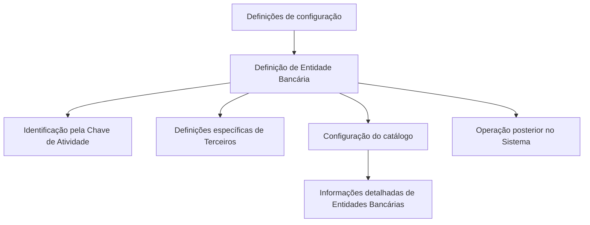

# Definição e Configuração de Entidades Bancárias no Sistema

## 1. Metadados do Documento
- **Arquivo de Origem:** Não identificado
- **Tipo de Documento:** Procedimento
- **Domínio / Sistema:** Configuração de Entidades Bancárias
- **Público-Alvo:** Operação, Negócio e Administradores do Sistema
- **Data/Versão Identificada:** Não identificada

---

## 2. Resumo Executivo & Contexto de Negócio

O documento descreve a definição de Entidades Bancárias no sistema, incluindo os elementos que participam da configuração dessas entidades e a ordem necessária para realizar essa definição antes da operação posterior no sistema.

O sistema identifica Entidades Bancárias pela **Chave de Atividade**, embora o trecho disponível não apresente a estrutura, o formato ou as regras de atribuição dessa chave. O texto também aponta que cartões marcados com asteriscos indicam obrigatoriedade na configuração de elementos relacionados à definição de Entidades Bancárias.

Há definições específicas destinadas exclusivamente a Terceiros classificados como Entidades Bancárias. Além disso, o documento menciona a configuração de um catálogo de Entidades Bancárias com informações detalhadas dessas entidades.

**Nota de Análise:** O conteúdo disponível não detalha telas, campos, fluxos operacionais completos, regras de validação, integrações, métodos de acesso ou estruturas de dados.

---

## 3. Arquitetura, Componentes & Tecnologias Envolvidas

Os componentes e conceitos explicitamente citados são:

- **Sistema:** ambiente no qual Entidades Bancárias são configuradas e posteriormente operadas.
- **Entidades Bancárias:** tipo de Terceiro com definições e informações específicas.
- **Chave de Atividade:** identificador utilizado pelo sistema para Entidades Bancárias.
- **Cartões/Tarjetas:** elementos de configuração cuja obrigatoriedade é indicada por asteriscos.
- **Catálogo de Entidades Bancárias:** estrutura configurável que armazena informações detalhadas das entidades.
- **Home Solutions APIs Documentation Zeus:** texto presente no conteúdo bruto, sem relação técnica detalhada apresentada.



**Nota de Análise:** O diagrama representa somente relações declaradas no texto. O documento não apresenta arquitetura de infraestrutura, serviços, APIs, bancos de dados ou protocolos de integração.

---

## 4. Regras de Negócio, Especificações Funcionais & Processos

1. A definição de Entidades Bancárias exige a configuração de elementos que intervêm nesse processo.
2. A configuração dos elementos deve obedecer a uma ordem de definição para permitir a operação posterior com Entidades Bancárias no sistema.
3. O sistema identifica as Entidades Bancárias por meio da **Chave de Atividade**.
4. Os asteriscos nos cartões indicam a obrigatoriedade de configurar determinado elemento em relação à definição de Entidades Bancárias.
5. Existem definições específicas aplicáveis exclusivamente quando o Terceiro é uma Entidade Bancária.
6. O catálogo de Entidades Bancárias deve ser configurado com informações detalhadas dessas entidades.

**Nota de Análise:** O conteúdo não informa:
- A sequência concreta de configuração dos elementos.
- Os valores permitidos para a Chave de Atividade.
- Os nomes dos cartões ou campos obrigatórios.
- O conjunto de informações detalhadas do catálogo.
- Critérios de validação, aprovação, alteração ou exclusão de Entidades Bancárias.

---

## 5. Tabelas de Parâmetros, Ambientes e Estruturas de Dados

| Item / Parâmetro | Descrição / Função | Tipo / Valores / Formato | Ambiente / Observações |
| :--- | :--- | :--- | :--- |
| Entidade Bancária | Entidade configurada no sistema para operação posterior. | Não informado | Associada ao contexto de Terceiros. |
| Chave de Atividade | Identificador utilizado pelo sistema para reconhecer Entidades Bancárias. | Não informado | O texto contém referência a “40”, sem explicar seu significado. |
| Asteriscos nos cartões | Indicadores de obrigatoriedade de configuração de elementos. | Marcação visual | Aplicável à definição de Entidades Bancárias. |
| Definições específicas | Definições utilizadas exclusivamente quando o Terceiro é uma Entidade Bancária. | Não informado | Não são detalhadas no trecho fornecido. |
| Catálogo de Entidades Bancárias | Estrutura de configuração com informações detalhadas das Entidades Bancárias. | Não informado | Campos e regras não informados. |
| Home Solutions APIs Documentation Zeus | Texto mencionado no conteúdo bruto. | Não informado | Não há detalhamento de relação com a configuração bancária. |

---

## 6. Bateria de Perguntas & Respostas para RAG (FAQ Sintético)

### P1: Qual é o objetivo da definição de Entidades Bancárias no sistema?
**R:** A definição de Entidades Bancárias organiza os elementos necessários para configurar essas entidades e estabelece que essa configuração deve ocorrer antes que seja possível operar posteriormente com elas no sistema.

### P2: Como o sistema identifica uma Entidade Bancária?
**R:** O sistema identifica Entidades Bancárias por meio da Chave de Atividade. O trecho disponível não informa o formato, os valores permitidos nem a regra de geração dessa chave.

### P3: O que significam os asteriscos nos cartões relacionados a Entidades Bancárias?
**R:** Os asteriscos indicam que a configuração de determinado elemento é obrigatória para a definição de Entidades Bancárias.

### P4: As definições específicas de Entidades Bancárias podem ser usadas para qualquer Terceiro?
**R:** Não. O documento informa que essas definições são utilizadas exclusivamente quando o Terceiro é uma Entidade Bancária.

### P5: O que é configurado no catálogo de Entidades Bancárias?
**R:** O catálogo de Entidades Bancárias é configurado com informações detalhadas dessas entidades. O conteúdo não especifica quais são os campos ou atributos incluídos.

### P6: Existe uma ordem obrigatória para configurar Entidades Bancárias?
**R:** Sim. O documento afirma que a definição deve seguir uma ordem para que seja possível operar posteriormente com as Entidades Bancárias no sistema. A ordem concreta não é apresentada.

### P7: O documento define os campos obrigatórios da Entidade Bancária?
**R:** Não de forma detalhada. O documento informa apenas que a obrigatoriedade é indicada por asteriscos nos cartões, sem listar os cartões ou campos correspondentes.

### P8: O documento descreve APIs, serviços ou integrações para Entidades Bancárias?
**R:** Não. Embora o conteúdo bruto mencione “Home Solutions APIs Documentation Zeus”, não há descrição de APIs, contratos, URLs, métodos HTTP, integrações ou tecnologias relacionadas.

### P9: Qual é a relação entre Terceiros e Entidades Bancárias?
**R:** As Entidades Bancárias aparecem como um caso específico de Terceiros, para o qual existem definições exclusivas.

### P10: O que representa a referência numérica “40” associada à Chave de Atividade?
**R:** O texto apresenta a expressão “Clave de Actividad... 40”, mas não explica se o número representa página, código, valor de parâmetro ou outra referência. Portanto, seu significado não pode ser determinado com base no conteúdo disponível.

---

## 7. Glossário de Termos, Siglas & Conceitos-Chave

- **Entidade Bancária:** entidade configurada no sistema e identificada pela Chave de Atividade.
- **Terceiro:** categoria na qual podem existir Entidades Bancárias com definições específicas.
- **Chave de Atividade:** identificador utilizado pelo sistema para reconhecer Entidades Bancárias.
- **Catálogo de Entidades Bancárias:** configuração que detalha informações das Entidades Bancárias.
- **Cartões/Tarjetas:** elementos de interface ou configuração mencionados como portadores de asteriscos de obrigatoriedade.
- **Home Solutions APIs Documentation Zeus:** expressão presente no conteúdo bruto, sem definição contextual adicional.

---

## 8. Notas Críticas, Riscos & Limitações

- A ordem de configuração é mencionada, mas não está documentada no trecho disponível.
- A Chave de Atividade é citada como mecanismo de identificação, mas não possui formato, regras ou exemplos.
- Os elementos obrigatórios são indicados apenas genericamente por asteriscos; os campos ou cartões correspondentes não foram fornecidos.
- As definições exclusivas para Terceiros classificados como Entidades Bancárias não são especificadas.
- O catálogo de Entidades Bancárias é citado sem detalhamento de estrutura, campos, responsáveis ou validações.
- Não há informações suficientes para inferir tecnologias, integrações, URLs, ambientes, permissões ou fluxos de exceção.

---

## 9. Conteúdo Bruto Estruturado (Referência Fiel)

```text
--- [PÁGINA 1 DE 1] ---

DEFINICIÓN de las ENTIDADES BANCARIAS
Elementos que intervienen en la Configuración de las Entidades Bancarias, así como el orden en el
que esta definición se debe realizar para poder operar posteriormente con ellas en el Sistema.
El Sistema identifica a las Entidades Bancarias con la Clave de Actividad... 40.
Los Asteriscos de las Tarjetas indican la obligatoriedad en la configuración del Elemento en
relación con la definición de las Entidades Bancarias.
DEFINICIONES ESPECÍFICAS, propias de los
Terceros ENTIDADES BANCARIAS
En este Grupo se encuentran definiciones que se utilizan
exclusivamente cuando el Tercero es una ENTIDAD BANCARIA.
INFORMACIÓN ENTIDADES BANCARIAS
Configuración del catálogo de Entidades Bancarias detallando la información de estas.
 / 
 CF
Home Solutions APIs Documentation Zeus
EN
```
