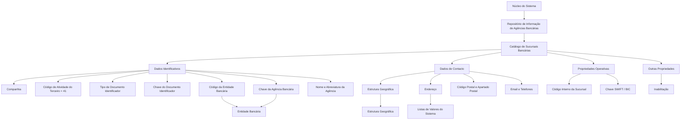

# Definição Funcional das Agências Bancárias no Modelo de Informação de Terceiros

## 1. Metadados do Documento
- **Arquivo de Origem:** `Não identificado no conteúdo fornecido`
- **Tipo de Documento:** `Especificação Funcional`
- **Domínio / Sistema:** `Modelo de Informação de Terceiros — Entidades Bancárias e Agências Bancárias`
- **Público-Alvo:** `Não identificado explicitamente no texto`
- **Data/Versão Identificada:** `Não identificada`

---

## 2. Resumo Executivo & Contexto de Negócio

O documento define os atributos utilizados para cadastrar sucursais ou agências bancárias no sistema. O núcleo do sistema disponibiliza um repositório de informação específico para codificação dessas agências, entregue inicialmente sem conteúdo.

A definição de uma agência bancária é organizada em quatro grupos: dados identificativos, dados de contacto, propriedades operativas e outras propriedades. A estrutura pretende manter coerência com o Novo Modelo de Informação de Terceiros, no qual entidades bancárias e respetivas sucursais são identificadas por atividade, documento identificativo e chave associada.

O cadastro associa cada agência a uma entidade bancária por meio do código da entidade e identifica a agência por uma chave própria. O documento exemplifica que, para uma entidade bancária identificada pelo código `AAAA`, chaves como `0001` e `0002` distinguem sucursais diferentes dessa entidade.

Também são definidos atributos de localização geográfica, endereço, contacto e operação bancária. Entre eles estão níveis da estrutura geográfica, endereço, código postal, email corporativo, dados telefónicos, código interno da sucursal e código SWIFT/BIC.

O documento estabelece restrições e observações importantes: a atividade de terceiro associada às agências bancárias possui valor constante `41` e não pode ser alterada; o tipo de documento identificativo assume o valor `THP` quando não existirem documentos identificativos associados; e uma agência marcada como inabilitada não deve ser utilizada, considerada ou contemplada em processos operativos nos quais o seu estado seja relevante.

---

## 3. Arquitetura, Componentes & Tecnologias Envolvidas

O conteúdo descreve uma estrutura funcional de cadastro dentro do núcleo do sistema, sem detalhar tecnologias de implementação, serviços HTTP, bases de dados, contratos JSON, interfaces ou ambientes técnicos.

### Componentes e estruturas identificadas

| Componente / Conceito | Papel descrito |
| :--- | :--- |
| Núcleo do Sistema | Disponibiliza a possibilidade de codificar sucursais ou agências bancárias em repositório específico. |
| Repositório de informação de agências bancárias | Repositório inicialmente entregue vazio para cadastro das agências das entidades bancárias. |
| Novo Modelo de Informação de Terceiros | Modelo que estabelece a identificação de entidades bancárias e sucursais por atividade, documento identificativo e chave associada. |
| Catálogo de Sucursais Bancárias | Estrutura que contém os atributos de identificação, contacto, operação e outras propriedades das agências. |
| Entidade Bancária | Banco ao qual a sucursal ou agência bancária está associada. |
| Estrutura Geográfica | Estrutura formada por primeiro, segundo, terceiro e quarto níveis para identificação geográfica da agência. |
| Listas de Valores | Catálogos do sistema nos quais a Tecnologia Local deve identificar valores aplicáveis, incluindo os tipos de domicílio. |
| Departamento de Tecnologia Local | Responsável por identificar nos catálogos do sistema os valores adequados às listas de valores locais. |
| SWIFT / BIC | Código alfanumérico usado para identificar o banco recetor de uma transferência internacional. |
| Zona SEPA | Zona única de pagamentos na Europa, usada no documento para delimitar a aplicabilidade do código SWIFT/BIC. |



> **Nota de Análise:** O documento não detalha tecnologias, métodos HTTP, contratos de integração, persistência de dados, permissões de acesso ou fluxos de aprovação para o cadastro das agências bancárias.

---

## 4. Regras de Negócio, Especificações Funcionais & Processos

### 4.1. Estrutura geral do catálogo de agências bancárias

O núcleo do sistema permite codificar as sucursais ou agências das entidades bancárias em um repositório de informação específico. O repositório é entregue inicialmente vazio.

A informação de uma agência bancária está distribuída nos seguintes grupos:

1. Dados Identificativos.
2. Dados de Contacto.
3. Propriedades Operativas.
4. Outras Propriedades.

### 4.2. Regras de identificação

- O atributo **Companhia** contém o código da companhia sobre a qual é realizada a definição da agência bancária.
- O **Código de Atividade do Terceiro** indica o código de atividade de terceiro associado às agências bancárias.
- No Novo Modelo de Informação de Terceiros, entidades bancárias e sucursais são identificadas no sistema com uma chave de atividade específica.
- O valor do **Código de Atividade do Terceiro** é a constante `41`.
- O valor `41` não pode ser modificado, pois corresponde a uma das atividades do núcleo.
- As agências bancárias devem ser identificadas com um tipo de documento identificativo e uma chave associada, em coerência com a informação das restantes pessoas físicas ou jurídicas.
- O **Tipo de Documento Identificador** possui valor `THP` quando não há documentos identificativos associados.
- O documento não informa outros valores possíveis para o Tipo de Documento Identificador quando existem documentos identificativos associados.
- A **Chave do Documento Identificador** contém o código do tipo de documento identificador associado à sucursal bancária.
- A sucursal ou agência bancária possui código de atividade próprio, além de tipo de documento identificativo e chave associada.
- O **Código da Entidade Bancária** é a chave do banco à qual a sucursal em definição estará associada.
- A **Chave da Agência Bancária** é a chave que identifica a sucursal vinculada ao código de entidade bancária previamente capturado.
- O exemplo fornecido estabelece que, para o código `AAAA`, que identifica o `BANCO Santander` como entidade bancária:
  - A chave `0001` corresponde à sucursal localizada em `C/Campos Elíseos, 35`.
  - A chave `0002` corresponde a uma sucursal localizada em `Avda. Dr. García Tapia`.
- O **Nome da Agência** contém o nome pelo qual a sucursal bancária é identificada no sistema.
- A **Abreviatura da Agência Bancária** contém o nome abreviado pelo qual é possível identificar uma sucursal pertencente a determinado banco no sistema.

### 4.3. Regras de contacto e localização geográfica

- O **Primeiro Nível da Estrutura Geográfica** contém a chave do primeiro nível usado para identificar geograficamente a sucursal bancária.
- O **Segundo Nível da Estrutura Geográfica** contém a chave do segundo nível usado para identificar geograficamente a sucursal bancária.
- O **Terceiro Nível da Estrutura Geográfica** contém a chave do terceiro nível usado para identificar geograficamente a sucursal bancária.
- O **Quarto Nível da Estrutura Geográfica** contém a chave do quarto nível usado para identificar geograficamente a sucursal bancária.
- O **Nome do Quarto Nível da Estrutura Geográfica** contém a descrição correspondente ao quarto nível. Como nem todos os países possuem esse nível de detalhe, o atributo pode conter informação complementar.
- O **Quarto Nível Vernáculo da Estrutura Geográfica** contém a chave do quarto nível para identificação geográfica das agências bancárias em idioma vernáculo.
- O **Nome Vernáculo do Quarto Nível da Estrutura Geográfica** contém a nomenclatura, em língua vernácula, do quarto nível geográfico no qual a sucursal bancária está localizada.
- O **Tipo de Domicílio** deve conter a tipologia do endereço da sucursal bancária, conforme o uso e a exploração local que a seguradora deseje realizar com a informação.
- O documento apresenta como exemplos de valores para Tipo de Domicílio: `Calle`, `Avenida`, `Cerrada`, `Carretera` e `Paseo`.
- O Departamento de Tecnologia Local deve identificar os valores adequados nos catálogos do sistema que identificam as Listas de Valores.
- Os valores predefinidos pelo núcleo podem não ser os valores de uso comum no país.
- Os valores de Tipo de Domicílio são de uso transversal na aplicação, não sendo específicos da configuração de agências bancárias.
- Os atributos de **Domicílio** contêm a descrição do endereço de acordo com a localização geográfica e a tipologia do endereço da sucursal bancária.
- Os atributos de Domicílio também permitem capturar informação complementar para facilitar a localização da agência.
- O **Código Postal** contém a chave do código postal onde a agência bancária está localizada.
- O **Apartado Postal** contém a chave da caixa postal pertencente à agência bancária, normalmente localizada em uma estação dos correios, permitindo receber correspondências e pacotes sem informar o endereço físico concreto.
- A **Direção de Correio Eletrónico** contém o email corporativo da sucursal bancária.
- O **Prefixo Telefónico do País** contém o prefixo telefónico nacional correspondente ao telefone da sucursal. O documento fornece os exemplos `+34` para Espanha, `+52` para México e `+54` para Argentina.
- O **Prefixo Zonal Telefónico** contém o prefixo zonal correspondente ao telefone da agência. O documento fornece os exemplos `91` para Madrid e `93` para Barcelona, em Espanha, e `81` para Monterrey, Nuevo León, e `55` para Ciudad de México, no México.
- O **Número de Fax** contém o número telefónico do fax da agência bancária.
- O **Número Telefónico** contém o número de telefone da sucursal bancária.
- A **Extensão Telefónica**, quando necessária, contém a extensão do telefone de atendimento da agência bancária.

### 4.4. Regras operativas

- O **Código Interno da Sucursal** contém o código interno da agência bancária conforme a configuração da estrutura territorial própria da entidade bancária.
- A **Chave SWIFT** contém o código SWIFT, também chamado BIC.
- SWIFT é o acrónimo de *Society for Worldwide Interbank Financial Telecommunication*.
- BIC significa *Bank Identifier Code*.
- O código SWIFT/BIC é uma sequência alfanumérica de `8` ou `11` dígitos.
- O código SWIFT/BIC é utilizado para identificar o banco recetor de uma transferência internacional.
- Segundo o documento, o código SWIFT/BIC aplica-se apenas a países que não pertencem à Zona SEPA.
- A Zona SEPA é descrita como integrada pelos 28 países da União Europeia, além de Liechtenstein, Islândia, Noruega, Andorra, Mónaco, San Marino, Suíça, Reino Unido e Cidade do Vaticano.
- Os três últimos dígitos do código SWIFT/BIC são opcionais.
- Quando presentes, os três últimos dígitos referem-se à sucursal onde está localizada a conta.
- Quando os três últimos dígitos não estão presentes, entende-se que o código pertence à agência central do banco.
- Nessa situação, o código SWIFT deve ser o código configurado no nível da Entidade Bancária.

### 4.5. Regra de inabilitação

- O campo **Inabilitação** informa ao sistema que a agência bancária está inabilitada.
- Quando a agência estiver inabilitada, ela não deve ser utilizada, contemplada ou considerada nos processos operativos da entidade nos quais o estado da agência seja relevante.

### 4.6. Documentos e temas vinculados

A interpretação isolada do documento pode conduzir a erro. A leitura dos seguintes temas ou documentos funcionais é recomendada:

- Atividades de Terceiros.
- Entidades Bancárias.
- Estrutura Geográfica.
- Perguntas frequentes.

> **Nota de Análise:** O conteúdo apenas apresenta a pergunta frequente sobre esclarecimentos operativos para o uso e definição da tabela de Entidades Bancárias. O documento não inclui a respetiva resposta.

---

## 5. Tabelas de Parâmetros, Ambientes e Estruturas de Dados

| Item / Parâmetro | Descrição / Função | Tipo / Valores / Formato | Ambiente / Observações |
| :--- | :--- | :--- | :--- |
| Companhia | Código da companhia para a qual a agência bancária está a ser definida. | Código não especificado. | Dados Identificativos. |
| Código de Atividade do Terceiro | Código de atividade associado às agências bancárias no Novo Modelo de Informação de Terceiros. | Constante `41`. | Não pode ser modificado. |
| Tipo de Documento Identificador | Tipo de documento usado para identificar a agência bancária. | `THP` quando não existem documentos identificativos associados. | Outros valores não detalhados. |
| Chave do Documento Identificador | Contém o código do tipo de documento identificador associado à sucursal bancária. | Código não especificado. | Dados Identificativos. |
| Código da Entidade Bancária | Chave do banco ao qual a sucursal está associada. | Código não especificado. | Deve ser capturado antes da Chave da Agência Bancária. |
| Chave da Agência Bancária | Chave que identifica a sucursal associada à entidade bancária. | Exemplo: `0001`, `0002`. | Associada ao Código da Entidade Bancária. |
| Nome da Agência | Nome pelo qual a sucursal bancária é identificada no sistema. | Texto. | Dados Identificativos. |
| Abreviatura da Agência Bancária | Nome abreviado usado para identificar a sucursal de um banco no sistema. | Texto. | Dados Identificativos. |
| Primeiro Nível da Estrutura Geográfica | Chave do primeiro nível de identificação geográfica da sucursal. | Chave não especificada. | Dados de Contacto. |
| Segundo Nível da Estrutura Geográfica | Chave do segundo nível de identificação geográfica da sucursal. | Chave não especificada. | Dados de Contacto. |
| Terceiro Nível da Estrutura Geográfica | Chave do terceiro nível de identificação geográfica da sucursal. | Chave não especificada. | Dados de Contacto. |
| Quarto Nível da Estrutura Geográfica | Chave do quarto nível de identificação geográfica da sucursal. | Chave não especificada. | Dados de Contacto. |
| Nome do Quarto Nível Geográfico | Descrição do quarto nível geográfico; pode conter informação complementar. | Texto. | Pode ser aplicável mesmo em países sem esse nível de detalhe. |
| Quarto Nível Vernáculo | Chave do quarto nível geográfico em idioma vernáculo. | Chave não especificada. | Dados de Contacto. |
| Nome Vernáculo do Quarto Nível | Nomenclatura, em língua vernácula, do quarto nível geográfico da localização da agência. | Texto. | Dados de Contacto. |
| Tipo de Domicílio | Tipologia do endereço da sucursal bancária. | Exemplos: `Calle`, `Avenida`, `Cerrada`, `Carretera`, `Paseo`. | Valores devem ser identificados pela Tecnologia Local nas Listas de Valores. |
| Domicílio | Descrição do endereço conforme localização geográfica e tipologia do endereço. | Texto e informação complementar. | Deve facilitar a localização da sucursal. |
| Código Postal | Chave do código postal da localização da agência. | Chave não especificada. | Dados de Contacto. |
| Apartado Postal | Chave da caixa postal da agência bancária. | Chave não especificada. | Permite receber correspondência sem informar endereço físico concreto. |
| Direção de Correio Eletrónico | Endereço de email corporativo da sucursal bancária. | Email. | Dados de Contacto. |
| Prefixo Telefónico do País | Prefixo telefónico nacional da sucursal. | Exemplos: `+34`, `+52`, `+54`. | Espanha, México e Argentina, respetivamente. |
| Prefixo Zonal Telefónico | Prefixo zonal do telefone da agência. | Exemplos: `91`, `93`, `81`, `55`. | Madrid, Barcelona, Monterrey e Ciudad de México, conforme exemplos do documento. |
| Número de Fax | Número telefónico de fax da agência. | Número telefónico. | Dados de Contacto. |
| Número Telefónico | Número de telefone da sucursal bancária. | Número telefónico. | Dados de Contacto. |
| Extensão Telefónica | Extensão do telefone de atendimento da agência, quando necessária. | Extensão não especificada. | Campo condicional: “caso de ser necessário”. |
| Código Interno da Sucursal | Código interno da agência conforme estrutura territorial da entidade bancária. | Código não especificado. | Propriedades Operativas. |
| Chave SWIFT / BIC | Código para identificar o banco recetor de transferência internacional. | Sequência alfanumérica de `8` ou `11` dígitos. | Aplicável, segundo o documento, a países fora da Zona SEPA. |
| Inabilitação | Indica que a agência bancária está inabilitada no sistema. | Estado não especificado. | Agência inabilitada não deve ser usada em processos operativos relevantes. |

---

## 6. Bateria de Perguntas & Respostas para RAG (FAQ Sintético)

### P1: Qual é a finalidade do repositório de agências bancárias no núcleo do sistema?
**R:** O núcleo do sistema permite codificar sucursais ou agências das entidades bancárias em um repositório de informação específico. Esse repositório é entregue inicialmente vazio, devendo receber os dados de identificação, contacto, operação e demais propriedades das agências bancárias.

### P2: Qual é o valor do Código de Atividade do Terceiro para uma agência bancária?
**R:** O Código de Atividade do Terceiro possui o valor constante `41`. O documento afirma que esse valor corresponde a uma das atividades do núcleo e, por esse motivo, não pode ser modificado.

### P3: Quando o Tipo de Documento Identificador deve assumir o valor THP?
**R:** O Tipo de Documento Identificador possui valor `THP` quando a agência bancária não tiver documentos identificativos associados. O documento não detalha o comportamento ou os valores aplicáveis quando existem documentos identificativos associados.

### P4: Como uma agência bancária é associada a uma entidade bancária?
**R:** A associação é realizada pelo Código da Entidade Bancária, que representa a chave do banco. A Chave da Agência Bancária identifica a sucursal vinculada a esse banco. O documento exemplifica que uma entidade identificada pelo código `AAAA` pode possuir agências identificadas pelas chaves `0001` e `0002`.

### P5: Quais níveis geográficos podem ser utilizados para localizar uma sucursal bancária?
**R:** O cadastro contém atributos para Primeiro, Segundo, Terceiro e Quarto Níveis da Estrutura Geográfica. Cada atributo armazena a chave do respetivo nível usada na identificação geográfica da sucursal. Há ainda campos para o nome do quarto nível e para representação vernacular desse nível.

### P6: Como deve ser definido o Tipo de Domicílio de uma agência bancária?
**R:** O Tipo de Domicílio deve conter a tipologia do endereço da sucursal bancária conforme o uso e a exploração local que a seguradora pretende realizar com a informação. O documento cita Calle, Avenida, Cerrada, Carretera e Paseo como exemplos. O Departamento de Tecnologia Local deve identificar os valores adequados nas Listas de Valores do sistema, pois os valores predefinidos pelo núcleo podem não corresponder ao uso comum local.

### P7: Quais informações de contacto podem ser registadas para uma agência bancária?
**R:** O documento prevê código postal, apartado postal, endereço de correio eletrónico corporativo, prefixo telefónico do país, prefixo zonal telefónico, número de fax, número telefónico e extensão telefónica quando necessária. Também prevê atributos de endereço e de localização geográfica em quatro níveis.

### P8: Qual é o formato do código SWIFT/BIC?
**R:** O código SWIFT/BIC é uma sequência alfanumérica de 8 ou 11 dígitos usada para identificar o banco recetor de uma transferência internacional. SWIFT significa *Society for Worldwide Interbank Financial Telecommunication* e BIC significa *Bank Identifier Code*.

### P9: O que representam os três últimos dígitos de um código SWIFT/BIC de 11 dígitos?
**R:** Os três últimos dígitos são opcionais e, quando presentes, fazem referência à sucursal onde está localizada a conta. Quando esses três dígitos não aparecem, entende-se que o código pertence à agência central do banco e deve ser utilizado o código SWIFT configurado no nível da Entidade Bancária.

### P10: Em quais países o documento determina a aplicação do código SWIFT/BIC?
**R:** O documento afirma que o código SWIFT/BIC se aplica apenas aos países que não pertencem à Zona SEPA. A Zona SEPA é descrita como composta pelos 28 países da União Europeia e por Liechtenstein, Islândia, Noruega, Andorra, Mónaco, San Marino, Suíça, Reino Unido e Cidade do Vaticano.

### P11: O que acontece quando uma agência bancária é marcada como inabilitada?
**R:** O campo Inabilitação informa ao sistema que a agência está inabilitada. Quando esse estado está ativo, a agência não deve ser utilizada, contemplada nem considerada nos processos operativos da entidade em que o estado da agência seja relevante.

### P12: Quais documentos devem ser consultados para evitar interpretação isolada da definição de agências bancárias?
**R:** O documento recomenda consultar as diretrizes e os documentos funcionais relacionados a Atividades de Terceiros, Entidades Bancárias, Estrutura Geográfica e Perguntas frequentes. A finalidade é evitar erros decorrentes de uma interpretação isolada do documento atual.

---

## 7. Glossário de Termos, Siglas & Conceitos-Chave

- **Agência Bancária / Sucursal Bancária:** Unidade bancária associada a uma entidade bancária e registada no sistema mediante atributos identificativos, de contacto, operativos e outros.
- **Apartado Postal:** Caixa postal da agência, normalmente localizada em estação dos correios, que permite receber correspondências e pacotes sem fornecer o endereço físico concreto.
- **BIC:** *Bank Identifier Code*; denominação alternativa para o código SWIFT.
- **Código de Atividade do Terceiro:** Código associado às agências bancárias no Novo Modelo de Informação de Terceiros; o documento fixa o valor `41`.
- **Código da Entidade Bancária:** Chave do banco ao qual a sucursal bancária está associada.
- **Código Interno da Sucursal:** Código interno da agência segundo a estrutura territorial própria da entidade bancária.
- **Estrutura Geográfica:** Estrutura de identificação geográfica composta por primeiro, segundo, terceiro e quarto níveis.
- **Inabilitação:** Estado que informa que uma agência bancária não deve ser usada, considerada ou contemplada em processos operativos relevantes.
- **Listas de Valores:** Catálogos do sistema nos quais devem ser identificados os valores locais aplicáveis a determinados atributos, como Tipo de Domicílio.
- **Novo Modelo de Informação de Terceiros:** Modelo citado como referência para a identificação de entidades bancárias e sucursais por atividade, documento identificativo e chave associada.
- **SEPA:** Zona única de pagamentos na Europa, descrita no documento como critério para a aplicação do código SWIFT/BIC.
- **SWIFT:** *Society for Worldwide Interbank Financial Telecommunication*; código alfanumérico de 8 ou 11 dígitos usado para identificar o banco recetor de uma transferência internacional.
- **THP:** Valor do Tipo de Documento Identificador quando uma agência bancária não possui documentos identificativos associados. O documento não expande a sigla.
- **Tipo de Domicílio:** Tipologia do endereço da sucursal bancária, com exemplos como Calle, Avenida, Cerrada, Carretera e Paseo.

---

## 8. Notas Críticas, Riscos & Limitações

- O repositório de agências bancárias é entregue inicialmente vazio; o documento não descreve o processo operacional de carga inicial, validação, aprovação ou manutenção cadastral.
- O documento não especifica formatos técnicos, tamanhos máximos, obrigatoriedade, unicidade, regras de preenchimento ou validações para a maioria dos atributos.
- O Tipo de Documento Identificador é definido como `THP` somente quando não existem documentos identificativos associados. Não há detalhamento para cenários com documentos associados.
- A Chave do Documento Identificador é descrita como contendo o código do tipo de documento identificador, o que pode exigir validação adicional em documentação relacionada para evitar interpretação incorreta.
- Os valores de Tipo de Domicílio devem ser identificados pela Tecnologia Local nas Listas de Valores, porque os valores predefinidos pelo núcleo podem não ser adequados ao país.
- Os valores de Tipo de Domicílio são transversais à aplicação; alterações nesses valores podem afetar outros contextos além da configuração de agências bancárias.
- O quarto nível geográfico pode não existir em todos os países; o respetivo campo de nome pode, nesses casos, conter informação complementar.
- O documento afirma que SWIFT/BIC se aplica apenas fora da Zona SEPA, mas não apresenta regras adicionais de validação, seleção de código ou exceções operativas.
- A lista de países incluídos na Zona SEPA deve ser tratada como a lista apresentada no próprio documento; o conteúdo não fornece data de vigência nem mecanismo de atualização.
- A inabilitação impede o uso da agência em processos relevantes, mas o documento não enumera quais processos operativos consultam esse estado.
- A pergunta frequente sobre a tabela de Entidades Bancárias é apresentada sem resposta.
- **Nota de Análise:** O documento não descreve APIs, integrações, tecnologias, persistência de dados, controlo de acesso, auditoria, logs ou responsabilidades operacionais além da identificação dos valores locais pelo Departamento de Tecnologia Local.

---

## 9. Conteúdo Bruto Estruturado (Referência Fiel)

```text
--- [PÁGINA 1 DE 6] ---

DEFINICIÓN de las Oficinas Bancarias
Funcionalmente, el núcleo del Sistema cuenta con la posibilidad de codificar las Sucursales u
Oficinas de las entidades Bancarias en un repositorio de información específico que se entrega
inicialmente a las instalaciones vacío de contenido.
Datos Identificativos
Datos de Contacto
Propiedades Operativas
Otras Propiedades
Datos Identificativos
Compañía
Este Atributo del catálogo de Sucursales bancarias contiene el código de la compañía sobre la que
se está realizando la definición de la Oficina Bancaria.
Código de Actividad del Tercero
Esta propiedad indicará el código de la Actividad del Tercero que se asocian a las Oficinas Bancarias
puesto que en el Nuevo Modelo de Información de Terceros, las entidades bancarias y sus
Sucursales se identifican en el sistema con una clave de actividad específica.
NOTA: Su valor es la constante '41' puesto que esta es una de las actividades que corresponden al
núcleo y por ello no puede ser modificado.
 / 
 CF
Home Solutions APIs Documentation Zeus
EN


--- [PÁGINA 2 DE 6] ---

Tipo Documento Identificador
En el nuevo Modelo de Información de Terceros y por coherencia con la información del del resto de
Personas Físicas o Jurídicas las Oficinas bancarias se deben identificar en el sistema con un tipo de
documento identificativo y una clave asociada.
El valor del tipo de documento identificativo es THP siempre y cuando no tengan asociados
documentos identificativos.
Clave del Documento Identificador
En el nuevo Modelo de Información de Terceros y por coherencia con los datos del resto de Terceros,
las Sucursales u Oficinas bancarias se identifican en el sistema con un código de actividad propio
además de un tipo de documento identificativo y una clave asociada.
Este atributo contendrá el código del Tipo de documento Identificador asociado a la Sucursal
Bancaria
Código Entidad Bancaria
Este atributo será la clave del banco a la que estará asociada la sucursal bancaria que se esté
definiendo.
Clave Oficina Bancaria
Este atributo será la clave por la que se va a identificar la sucursal bancaria que estará asociada al
código de Entidad Bancaria previamente capturado.
A modo de ejemplo, y para el código AAAA que identifica al 'BANCO Santander' como su entidad
Bancaria, la Clave '0001' sería la clave de la Sucursal Bancaria ubicada en C/Campos Elíseos, 35., la
clave '0002' sería la clave de la sucursal bancaria ubicada en Avda. Dr. García Tapia,... etc.
Nombre Oficina
Este atributo contiene el nombre por el que se identifica a la Sucursal Bancaria en el Sistema.
Abreviatura Oficina Bancaria
Este atributo contiene el nombre abreviado por el que se puede identificar a la Sucursal Bancaria X
perteneciente al Banco Y en el Sistema.
Datos de Contacto
Primer Nivel de la Estructura Geográfica
Este atributo contiene la clave del primer nivel de la estructura con el que se va a identificar
geográficamente a la Sucursal Bancaria.


--- [PÁGINA 3 DE 6] ---

Segundo Nivel de la Estructura Geográfica
Este atributo contiene la clave del segundo nivel de la estructura con el que se va a identificar
geográficamente a la Sucursal Bancaria.
Tercer Nivel de la Estructura Geográfica
Este atributo contiene la clave del tercer nivel de la estructura con el que se va a identificar
geográficamente a la Sucursal Bancaria.
Cuarto Nivel de la Estructura Geográfica
Este atributo contiene la clave del cuarto nivel de la estructura con el que se va a identificar
geográficamente a la Sucursal Bancaria..
Nombre del Cuarto Nivel de la Estructura Geográfica
Este atributo contiene la descripción que corresponde al cuarto nivel de la estructura geográfica si
bien y puesto que no en todos los países se cuenta con este nivel de detalle, puede contener
información complementaria.
Cuarto Nivel Vernáculo de la Estructura Geográfica
Este atributo contiene la clave del cuarto nivel de la estructura con la que se va a identificar
geográficamente y en idioma vernáculo a las Oficinas Bancarias.
Nombre vernáculo del Cuarto Nivel de la Estructura Geográfica
El propósito de este atributo es contener la nomenclatura del cuarto nivel de la estructura geográfica,
en donde estará ubicada la Sucursal Bancaria, en lengua vernácula.
Tipo de Domicilio
Este atributo ha de contener la tipología del Domicilio de la sucursal bancaria de acuerdo con el uso y
explotación que posteriormente quiera realizar localmente la aseguradora con esta información.
A modo de ejemplo sus valores podrían ser:
Calle.
Avenida.
Cerrada.
Carretera.
Paseo.
...


--- [PÁGINA 4 DE 6] ---

NOTA: Es necesario que el Departamento de Tecnología Local identifique sus valores en los
catálogos del Sistema que identifican las Listas de Valores puesto que los valores prefijados por el
núcleo pueden no ser aquellos de uso común en el país, teniendo en mente además que los valores
serán de uso transversal en la aplicación y no de uso específico para la configuración de las
oficinas bancarias.
Domicilio
Estos Atributos contienen la descripción del domicilio de acuerdo con la ubicación geográfica y
tipología del domicilio de la Sucursal Bancaria además de permitir la captura de información
complementaria que facilite la ubicación de esta.
Código Postal
Este atributo contiene la clave del Código Postal en donde está ubicada la Oficina Bancaria.
Apartado Postal
Este atributo contiene la clave del Apartado Postal perteneciente a la Oficina Bancaria, normalmente
ubicado en una oficina de Correos, que le permite recibir correspondencia y paquetes sin tener que
entregar su dirección física concreta.
Dirección Correo Electrónico
Este atributo contiene la dirección de correo electrónico corporativo de la Sucursal Bancaria.
Prefijo Telefónico del País
Este atributo contiene el Prefijo del País Telefónico correspondiente al número telefónico de la
Sucursal Bancaria.
A modo de ejemplo, en España el prefijo es +34, en México +52 y en Argentina +54.
Prefijo Zonal Telefónico
Este atributo contiene el Prefijo Zonal Telefónico que corresponde al número telefónico de la Oficina
Bancaria.
A modo de ejemplo,
En España el prefijo zonal de Madrid es el 91, el de Barcelona 93, ...
En México la Clave Lada local que corresponde a Monterrey, Nuevo León es 81, la de Ciudad de
México es 55,...
Número Fax


--- [PÁGINA 5 DE 6] ---

Este atributo contiene el Número Telefónico del Fax correspondiente a la Oficina Bancaria.
Número Telefónico
Este atributo contiene el Número Telefónico que corresponde al Teléfono de la Sucursal Bancaria.
Extensión Telefónica
Caso de ser necesario, este atributo contendrá la Extensión Telefónica correspondiente al Teléfono
de atención de la Oficina Bancaria.
Propiedades Operativas
Código Interno Sucursal
Este atributo contiene el código interno de la Oficina Bancaria de acuerdo con la configuración de la
estructura Territorial propia de la entidad Bancaria.
Clave SWIFT
Este atributo contiene el código SWIFT (acrónimo de Society for Worldwide Interbank Financial
Telecommunication), también denominado código BIC (Bank Identifier Code), que no es sino una
serie alfanumérica de 8 u 11 dígitos que se utiliza para identificar al banco receptor de una
transferencia internacional.
¿Cuándo se aplica el código SWIFT / BIC?
El código SWIFT / BIC se aplica únicamente en aquellos países que no pertenecen a la Zona SEPA
(o Zona única de Pagos en Europa) comprendida por los 28 países de la Unión Europea, además de
Liechtenstein, Islandia, Noruega, Andorra, Mónaco, San Marino, Suiza, Reino Unido y Ciudad del
Vaticano Estado.
NOTA: Los tres últimos dígitos son opcionales y en caso de aparecer hacen referencia a la sucursal
en la que se encuentra la cuenta en concreto. Si no estuvieran presentes se entiende que pertenece
a la oficina central del banco y por tanto el código SWIFT sería el configurado a nivel de la Entidad
Bancaria.
Otras Propiedades
Inhabilitación
Este campo le indica al Sistema que la Oficina Bancaria está inhabilitada en el Sistema por lo cual,
de estarlo, no debería ser empleada, contemplada o considerada en los procesos operativos de la
entidad en los que el estado de la Oficina sea relevante.


--- [PÁGINA 6 DE 6] ---

Vínculos
Relación de Directrices y Documentos funcionales cuya lectura recomendada para evitar que la
interpretación aislada del presente documento pueda conducir a error.
Actividades de Terceros
Entidades Bancarias
Estructura Geográfica
Preguntas frecuentes
(1) ¿Existe alguna aclaración operativa que deba ser tomada en consideración en el uso y definición
de la tabla de Entidades Bancarias del Sistema?
```
