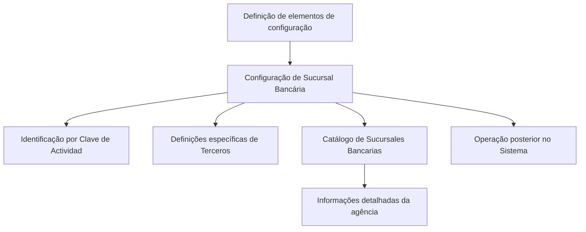
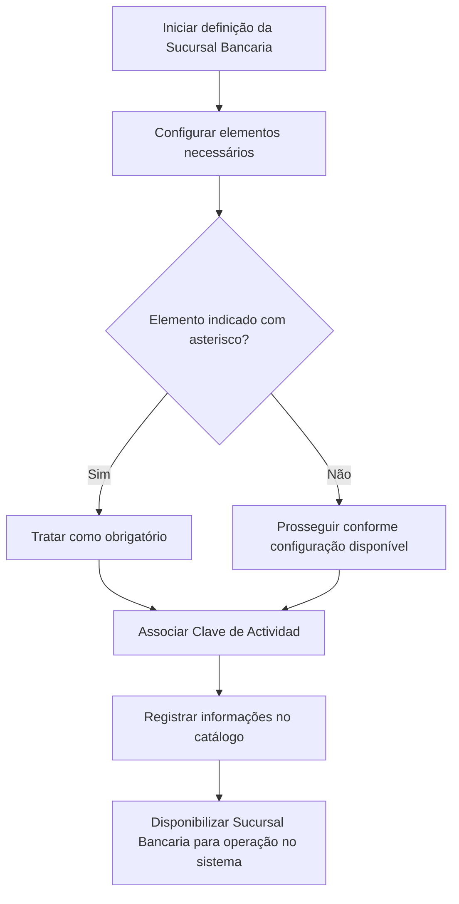

# Definição e Configuração de Agências Bancárias no Sistema

## 1. Metadados do Documento
- **Arquivo de Origem:** Não identificado
- **Tipo de Documento:** Manual Operacional
- **Domínio / Sistema:** Configuração de Sucursais/Agências Bancárias
- **Público-Alvo:** Operação, Negócio e Administradores do Sistema
- **Data/Versão Identificada:** Não identificada

---

## 2. Resumo Executivo & Contexto de Negócio

O conteúdo descreve a definição de **Sucursales Bancarias** (agências bancárias) no sistema, incluindo os elementos envolvidos em sua configuração e a ordem necessária para que essas agências possam ser operadas posteriormente.

O sistema identifica as agências bancárias por meio da **Clave de Actividad**. O texto também indica que determinados campos ou cartões de configuração possuem asteriscos, os quais sinalizam obrigatoriedade na definição dos elementos relacionados às agências bancárias.

O documento menciona um grupo de definições específicas utilizadas exclusivamente quando o terceiro cadastrado é uma agência bancária. Além disso, referencia uma seção de informação destinada à configuração do catálogo de agências, com detalhamento dos dados dessas entidades.

Não há detalhamento adicional sobre telas, campos, valores permitidos, métodos de integração, regras de validação específicas ou contratos técnicos. O conteúdo disponível é predominantemente descritivo e introdutório.

---

## 3. Arquitetura, Componentes & Tecnologias Envolvidas

Os componentes e conceitos explicitamente citados são:

- **Sistema:** ambiente que identifica e permite operar agências bancárias.
- **Sucursales Bancarias:** agências bancárias configuradas no sistema.
- **Clave de Actividad:** chave usada pelo sistema para identificar uma agência bancária.
- **Terceros:** grupo ou entidade para a qual existem definições específicas quando o terceiro é uma agência bancária.
- **Catálogo de Sucursales Bancarias:** catálogo configurável contendo informações detalhadas das agências.
- **Cartões/Tarjetas com asteriscos:** elementos visuais ou de configuração cuja obrigatoriedade é indicada por asteriscos.



> **Nota de Análise:** O texto não especifica tecnologias, bancos de dados, interfaces, APIs, microsserviços, ambientes ou protocolos de comunicação.

---

## 4. Regras de Negócio, Especificações Funcionais & Processos

1. A definição das agências bancárias depende da configuração de elementos associados à entidade **Sucursal Bancaria**.
2. Existe uma ordem para realizar a definição dos elementos de configuração.
3. A configuração deve ser concluída para que as agências bancárias possam ser operadas posteriormente no sistema.
4. O sistema identifica as agências bancárias utilizando a **Clave de Actividad**.
5. Asteriscos presentes nos cartões ou telas de configuração indicam a obrigatoriedade de um elemento para a definição de agências bancárias.
6. Há definições específicas aplicáveis exclusivamente quando um terceiro é classificado como uma **Sucursal Bancaria**.
7. O catálogo de agências bancárias deve conter informações detalhadas sobre cada agência configurada.

### Fluxo operacional extraído



> **Nota de Análise:** O documento afirma que há uma ordem de definição, mas não apresenta a sequência detalhada dos elementos, nem critérios técnicos de validação para a **Clave de Actividad**.

---

## 5. Tabelas de Parâmetros, Ambientes e Estruturas de Dados

| Item / Parâmetro | Descrição / Função | Tipo / Valores / Formato | Ambiente / Observações |
| :--- | :--- | :--- | :--- |
| Sucursal Bancaria | Agência bancária configurada e posteriormente operada no sistema. | Entidade de negócio. | O texto não informa campos ou estrutura cadastral. |
| Clave de Actividad | Chave pela qual o sistema identifica as agências bancárias. | Chave de identificação; formato não informado. | Não há regra de geração, unicidade ou validação descrita. |
| Elementos de configuração | Elementos necessários à definição das agências bancárias. | Não especificado. | Devem ser definidos em determinada ordem, não detalhada. |
| Asteriscos nas tarjetas | Indicam obrigatoriedade de configuração de um elemento. | Indicador visual de obrigatoriedade. | Relacionado à definição de agências bancárias. |
| Terceros | Grupo que contém definições específicas para casos em que o terceiro é uma agência bancária. | Grupo ou classificação; não especificado. | Aplicável exclusivamente a Sucursales Bancarias. |
| Catálogo de Sucursales Bancarias | Catálogo que detalha informações das agências bancárias. | Catálogo de dados; estrutura não informada. | Não são apresentados campos, fontes ou periodicidade de atualização. |
| CF | Termo exibido no conteúdo bruto. | Não identificado. | O documento não define o significado de CF. |
| Home Solutions APIs Documentation Zeus | Texto exibido no rodapé ou navegação do conteúdo. | Não especificado. | Não há relação técnica explicada com a configuração de agências. |

---

## 6. Bateria de Perguntas & Respostas para RAG (FAQ Sintético)

### P1: Qual é o objetivo da definição de Sucursales Bancarias no sistema?
**R:** O objetivo é configurar os elementos necessários para definir agências bancárias e permitir que essas agências possam ser operadas posteriormente no sistema.

### P2: Como o sistema identifica uma agência bancária?
**R:** O sistema identifica as agências bancárias por meio da **Clave de Actividad**. O documento não detalha o formato, a origem ou as regras de validação dessa chave.

### P3: O que significam os asteriscos nos cartões de configuração?
**R:** Os asteriscos indicam que o elemento correspondente é obrigatório na configuração relacionada à definição das agências bancárias.

### P4: Existe uma ordem obrigatória para configurar uma agência bancária?
**R:** Sim. O conteúdo informa que os elementos de configuração devem ser definidos em uma ordem para que seja possível operar posteriormente com as agências no sistema. A sequência específica não é apresentada.

### P5: Quais definições são exclusivas para um terceiro classificado como agência bancária?
**R:** O documento informa que existe um grupo de definições utilizado exclusivamente quando o terceiro é uma **Sucursal Bancaria**. Entretanto, não especifica quais são essas definições, seus campos ou regras.

### P6: O que é o catálogo de Sucursales Bancarias?
**R:** É o catálogo utilizado para configurar e detalhar as informações das agências bancárias. O texto não apresenta a estrutura de dados, os atributos cadastrais ou os responsáveis pela manutenção do catálogo.

### P7: Quais tecnologias ou integrações são utilizadas na configuração das agências bancárias?
**R:** O conteúdo fornecido não descreve tecnologias, integrações, APIs, microsserviços, bancos de dados, URLs técnicas ou protocolos associados à configuração de agências bancárias.

### P8: Quais dados são obrigatórios para criar uma agência bancária?
**R:** O documento estabelece apenas que elementos marcados com asterisco são obrigatórios. Os nomes desses elementos e seus formatos não foram fornecidos.

### P9: A Clave de Actividad é uma chave de negócio ou uma chave técnica?
**R:** O texto afirma apenas que a **Clave de Actividad** é utilizada pelo sistema para identificar as agências bancárias. Não há informação suficiente para classificá-la como chave de negócio, chave técnica ou identificador externo.

### P10: O documento apresenta detalhes sobre operações disponíveis para uma agência bancária já configurada?
**R:** Não. O documento informa que, após a definição adequada, as agências podem ser operadas no sistema, mas não descreve quais operações estão disponíveis.

---

## 7. Glossário de Termos, Siglas & Conceitos-Chave

- **Sucursal Bancaria:** Agência bancária configurada e identificada no sistema.
- **Sucursales Bancarias:** Plural de agência bancária; conjunto ou catálogo de agências bancárias.
- **Clave de Actividad:** Chave usada pelo sistema para identificar uma agência bancária.
- **Terceros:** Grupo ou entidade mencionado como possuidor de definições específicas quando classificado como uma agência bancária.
- **Tarjetas:** Cartões ou elementos de interface/configuração nos quais asteriscos indicam obrigatoriedade.
- **Catálogo de Sucursales Bancarias:** Catálogo contendo informações detalhadas das agências bancárias.
- **CF:** Sigla exibida no conteúdo, sem definição fornecida.
- **Zeus:** Termo exibido no conteúdo bruto, sem papel funcional ou técnico explicado.

---

## 8. Notas Críticas, Riscos & Limitações

- O nome do arquivo de origem, a data e a versão do documento não foram identificados.
- O conteúdo não apresenta a ordem concreta de configuração dos elementos necessários para uma agência bancária.
- Não foram informados os atributos do catálogo de agências bancárias.
- Não foram fornecidos formatos, regras de unicidade ou critérios de validação para a **Clave de Actividad**.
- Não há detalhamento sobre permissões, perfis de acesso, auditoria, integração, APIs, URLs, ambientes ou logs.
- A sigla **CF** e a referência a **Home Solutions APIs Documentation Zeus** não são explicadas.
- **Nota de Análise:** O documento lista conceitos de configuração de agências bancárias, porém não detalha métodos operacionais, contratos de dados ou implementações técnicas.

---

## 9. Conteúdo Bruto Estruturado (Referência Fiel)

```text
--- [PÁGINA 1 DE 1] ---

DEFINICIÓN de las OFICINAS BANCARIAS
Elementos que intervienen en la Configuración de las Sucursales Bancarias, así como el orden en
el que esta definición se debe realizar para poder operar posteriormente con ellas en el Sistema.
El Sistema identifica a las Sucursales Bancarias con la Clave de Actividad... 41.
Los Asteriscos de las Tarjetas indican la obligatoriedad en la configuración del Elemento en
relación con la definición de las Sucursales Bancarias.
DEFINICIONES ESPECÍFICAS, propias de los
Terceros SUCURSALES BANCARIAS
En este Grupo se encuentran definiciones que se utilizan
exclusivamente cuando el Tercero es una SUCURSAL BANCARIA.
INFORMACIÓN SUCURSALES BANCARIAS
Configuración del catálogo de Sucursales Bancarias detallando la información de estas.
 / 
 CF
Home Solutions APIs Documentation Zeus
EN
```
