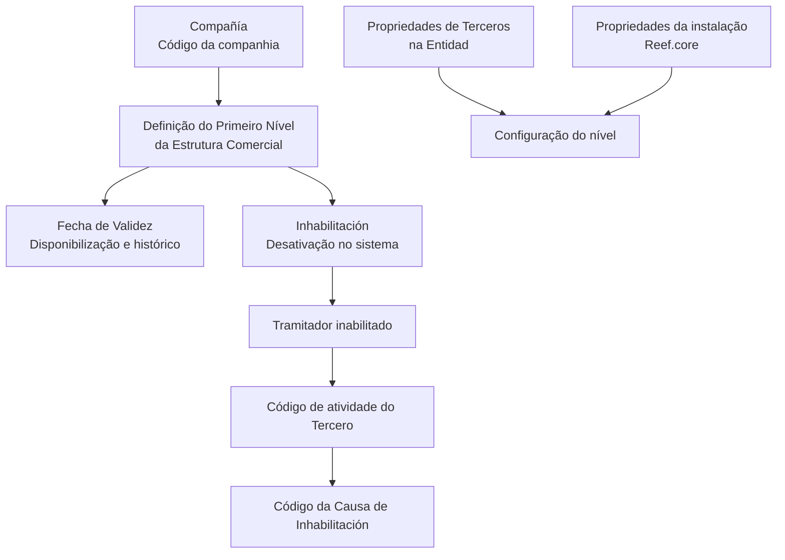

# Definição do Primeiro Nível da Estrutura Comercial

## 1. Metadados do Documento
- **Arquivo de Origem:** Não identificado
- **Tipo de Documento:** Especificação Técnica
- **Domínio / Sistema:** Estrutura Comercial / Reef.core
- **Público-Alvo:** Analistas funcionais, configuradores e operação
- **Data/Versão Identificada:** Não identificada

---

## 2. Resumo Executivo & Contexto de Negócio

O documento descreve a definição do **Primeiro Nível da Estrutura Comercial** no sistema, organizando as propriedades necessárias para a sua configuração. O conteúdo está estruturado nas categorias: contexto, objetivo, propriedades identificativas, dados de contacto, propriedades operativas e outras propriedades.

A propriedade **Compañía** identifica o código da companhia sobre a qual a definição do Primeiro Nível da Estrutura Comercial está sendo realizada. O documento não especifica o formato, domínio de valores ou mecanismo de validação desse código.

A propriedade de **Inhabilitación** determina se o Primeiro Nível da Estrutura Comercial está desativado no sistema. Quando um Tramitador estiver inabilitado, o atributo **Código de la Causa de Inhabilitación** deve indicar a causa de inabilitação conforme o código de atividade do Terceiro.

A **Fecha de Validez** controla a data a partir da qual a definição do nível fica disponível para uso. A configuração correta dessa data permite manter histórico das alterações efetuadas nas definições, viabilizando rastreabilidade e exploração posterior dessas informações.

O documento também recomenda a leitura de diretrizes e documentos funcionais relacionados. Para responder à particularidade operacional apresentada na seção de perguntas frequentes, a configuração deve considerar tanto as propriedades de Terceiros definidas na Entidade quanto as propriedades configuradas na instalação do **Reef.core**.

---

## 3. Arquitetura, Componentes & Tecnologias Envolvidas

Os componentes e conceitos explicitamente citados são:

| Componente / Conceito | Papel identificado no documento |
| :--- | :--- |
| Primeiro Nível da Estrutura Comercial | Entidade funcional cuja definição é configurada no sistema. |
| Sistema | Ambiente que registra, disponibiliza e reconhece a inabilitação do nível da estrutura comercial. |
| Compañía | Propriedade que informa o código da companhia associada à definição. |
| Tramitador | Entidade citada na regra do Código da Causa de Inhabilitación. |
| Tercero | Entidade cujo código de atividade é usado para determinar a causa de inabilitação. |
| Entidad | Contexto em que propriedades de Terceiros devem ser consideradas. |
| Reef.core | Instalação cuja configuração de propriedades deve ser considerada. |
| Zeus | Termo presente no conteúdo bruto, sem descrição funcional adicional. |
| Home Solutions APIs Documentation | Termo presente no conteúdo bruto, sem relação arquitetural detalhada. |



> **Nota de Análise:** O documento não detalha interfaces, métodos HTTP, contratos JSON, bancos de dados, protocolos de integração, URLs, ambientes ou tecnologias de implementação.

---

## 4. Regras de Negócio, Especificações Funcionais & Processos

1. A definição do Primeiro Nível da Estrutura Comercial deve informar a propriedade **Compañía**.
2. A propriedade **Compañía** representa o código da companhia sobre a qual a definição está sendo realizada.
3. A propriedade **Inhabilitación** informa ao sistema que o Primeiro Nível da Estrutura Comercial está desativado.
4. Se o **Tramitador** estiver inabilitado, o atributo **Código de la Causa de Inhabilitación** deve indicar o código da causa de inabilitação.
5. A causa de inabilitação deve ser determinada de acordo com o código de atividade do **Tercero**.
6. A **Fecha de Validez** define a partir de qual data a definição do nível da Estrutura Comercial fica disponível para utilização no sistema.
7. A configuração correta da **Fecha de Validez** permite manter histórico das mudanças efetuadas nas definições.
8. O histórico habilitado pela data de validade permite rastrear e explorar posteriormente as informações relativas às definições.
9. Na codificação, uso e definição local do nível da Estrutura Comercial, devem ser consideradas:
   - As propriedades de Terceiros definidas na Entidade.
   - As propriedades configuradas na instalação do Reef.core.
10. A interpretação isolada do documento pode levar a erros; por isso, é recomendada a consulta às diretrizes e aos documentos funcionais vinculados.

---

## 5. Tabelas de Parâmetros, Ambientes e Estruturas de Dados

| Item / Parâmetro | Descrição / Função | Tipo / Valores / Formato | Ambiente / Observações |
| :--- | :--- | :--- | :--- |
| Compañía | Indica o código da companhia sobre a qual é realizada a definição do Primeiro Nível da Estrutura Comercial. | Código de companhia; formato não detalhado. | Aplicável à definição do Primeiro Nível da Estrutura Comercial. |
| Inhabilitación | Indica ao sistema que o Primeiro Nível da Estrutura Comercial está desativado. | Estado de inabilitação; valores não detalhados. | Afeta a disponibilidade operacional do nível. |
| Código de la Causa de Inhabilitación | Indica a causa de inabilitação quando o Tramitador está inabilitado. | Código; domínio não detalhado. | Determinado de acordo com o código de atividade do Tercero. |
| Fecha de Validez | Estabelece a data a partir da qual a definição do nível fica disponível no sistema. | Data; formato não detalhado. | Suporta histórico, rastreabilidade e exploração posterior das alterações. |
| Propiedades de Terceros | Propriedades a serem consideradas na definição local do nível. | Não detalhado. | Devem ser consideradas conforme definidas na Entidad. |
| Propiedades configuradas en Reef.core | Propriedades a serem consideradas na definição local do nível. | Não detalhado. | Devem ser consideradas conforme configuradas na instalação Reef.core. |
| Vínculos | Relação de diretrizes e documentos funcionais recomendados. | Lista documental; não detalhada. | A leitura é recomendada para evitar erros de interpretação isolada. |

---

## 6. Bateria de Perguntas & Respostas para RAG (FAQ Sintético)

### P1: Qual é a finalidade da propriedade Compañía no Primeiro Nível da Estrutura Comercial?
**R:** A propriedade **Compañía** informa ao sistema o código da companhia sobre a qual está sendo realizada a definição do Primeiro Nível da Estrutura Comercial. O documento não informa o formato ou os valores permitidos para esse código.

### P2: O que acontece quando o Primeiro Nível da Estrutura Comercial é marcado com Inhabilitación?
**R:** A propriedade **Inhabilitación** informa ao sistema que o Primeiro Nível da Estrutura Comercial está desativado.

### P3: Quando deve ser preenchido o Código de la Causa de Inhabilitación?
**R:** O atributo **Código de la Causa de Inhabilitación** deve ser considerado quando o Tramitador está inabilitado. Nesse caso, o atributo indica o código da causa de inabilitação do Terceiro no sistema.

### P4: Como é definida a causa de inabilitação de um Tramitador?
**R:** O documento determina que a causa de inabilitação deve ser indicada de acordo com o código de atividade do **Tercero**. Não há detalhamento dos códigos de atividade nem do catálogo de causas.

### P5: Para que serve a Fecha de Validez na definição da Estrutura Comercial?
**R:** A **Fecha de Validez** estabelece a data a partir da qual a definição do nível da Estrutura Comercial fica disponível para ser utilizada no sistema.

### P6: Qual é o impacto da configuração correta da Fecha de Validez?
**R:** Uma configuração correta da **Fecha de Validez** permite manter um histórico das alterações efetuadas nas definições. Esse histórico permite rastrear e explorar posteriormente as informações relacionadas às mudanças.

### P7: Quais propriedades devem ser consideradas para a codificação e uso local do nível da Estrutura Comercial?
**R:** Devem ser consideradas tanto as propriedades de Terceiros definidas na **Entidad** quanto as propriedades configuradas na instalação do **Reef.core**.

### P8: Por que o documento recomenda consultar diretrizes e documentos funcionais vinculados?
**R:** O documento recomenda a consulta aos vínculos porque uma interpretação isolada do material pode conduzir a erro. Os documentos funcionais e diretrizes relacionados fornecem contexto complementar.

### P9: O documento especifica APIs, métodos HTTP ou contratos de integração para a Estrutura Comercial?
**R:** Não. Embora o conteúdo bruto mencione “Home Solutions APIs Documentation” e “Zeus”, o documento não detalha APIs, métodos HTTP, contratos JSON, endpoints, autenticação ou fluxos de integração.

### P10: O documento define os valores possíveis para o estado de Inhabilitación?
**R:** Não. O documento explica somente que a propriedade indica que o Primeiro Nível da Estrutura Comercial está desativado, sem informar valores, formato ou regras técnicas de preenchimento.

---

## 7. Glossário de Termos, Siglas & Conceitos-Chave

- **Compañía:** Propriedade que indica o código da companhia relacionada à definição do Primeiro Nível da Estrutura Comercial.
- **Código de la Causa de Inhabilitación:** Atributo que informa o código da causa de inabilitação quando o Tramitador está inabilitado.
- **Entidad:** Contexto no qual são definidas propriedades de Terceiros que devem ser consideradas na configuração local.
- **Fecha de Validez:** Data a partir da qual uma definição do nível da Estrutura Comercial fica disponível no sistema.
- **Inhabilitación:** Propriedade que indica a desativação do Primeiro Nível da Estrutura Comercial.
- **Primer Nivel de la Estructura Comercial:** Primeiro nível de uma estrutura comercial, objeto principal da definição descrita.
- **Reef.core:** Instalação cuja configuração de propriedades deve ser considerada na definição, codificação e uso do nível da Estrutura Comercial.
- **Tercero:** Entidade cujo código de atividade é utilizado para determinar o código da causa de inabilitação.
- **Tramitador:** Entidade citada como potencialmente inabilitada, para a qual deve ser indicada a causa de inabilitação.
- **Vínculos:** Relação de diretrizes e documentos funcionais recomendados para complementar a interpretação do documento.

---

## 8. Notas Críticas, Riscos & Limitações

- O documento não identifica arquivo de origem, versão, data, autoria ou responsável.
- O conteúdo não apresenta detalhamento para as seções **Contexto**, **Objetivo**, **Datos de Contacto** e **Propiedades Operativas**.
- Não foram fornecidos formatos, obrigatoriedade, valores permitidos ou regras de validação para **Compañía**, **Inhabilitación**, **Código de la Causa de Inhabilitación** e **Fecha de Validez**.
- Não há catálogo de códigos de atividade do Terceiro nem de causas de inabilitação.
- Não há especificação de APIs, integrações, rotas, URLs, ambientes, logs ou contratos técnicos.
- A interpretação isolada do documento apresenta risco explícito de erro; a consulta às diretrizes e documentos funcionais vinculados é recomendada.
- Os termos “Home Solutions APIs Documentation Zeus” aparecem no conteúdo, mas não possuem explicação adicional.

---

## 9. Conteúdo Bruto Estruturado (Referência Fiel)

```text
--- [PÁGINA 1 DE 2] ---

DEFINICIÓN del PRIMER NIVEL de la
ESTRUCTURA COMERCIAL
Contexto
Objetivo
Propiedades Identificativas
Datos de Contacto
Propiedades Operativas
Otras Propiedades
Propiedades Identificativas
Compañía
Esta propiedad le indica al sistema el código de la compañía sobre la que se está realizando la
definición del Primer Nivel de la Estructura Comercial.
Datos de Contacto
Propiedades Operativas
 /
 CF
Home Solutions APIs Documentation Zeus
EN


--- [PÁGINA 2 DE 2] ---

Otras Propiedades
Inhabilitación
Esta propiedad le indica al Sistema que el Primer Nivel de la Estructura Comercial se encuentra
desactivado.
Código de la Causa de Inhabilitación
Si el Tramitador está inhabilitado, este Atributo indicará de acuerdo con el código de actividad del
Tercero, el código de la Causa de la Inhabilitación del Tercero en el sistema.
Fecha de Validez
Esta propiedad establece la fecha a partir de la cual la definición del Nivel de la Estructura Comercial
está disponible en el sistema para ser utilizado, por lo que una correcta configuración habilita tener
un histórico de los cambios efectuados en sus definiciones y poder así trazar y explotar
posteriormente esta información.
Vínculos
Relación de Directrices y Documentos funcionales cuya lectura recomendada para evitar que la
interpretación aislada del presente documento pueda conducir a error.
Preguntas frecuentes
(1) ¿Existe alguna particularidad operativa que deba ser tomada en consideración localmente en la
codificación, uso y definición de este Nivel de la Estructura Comercial en el Sistema?
Se debe considerar tanto las Propiedades de Terceros realizadas en la definición de la Entidad, como
aquellas Propiedades configuradas en la Instalación de Reef.core.
```
