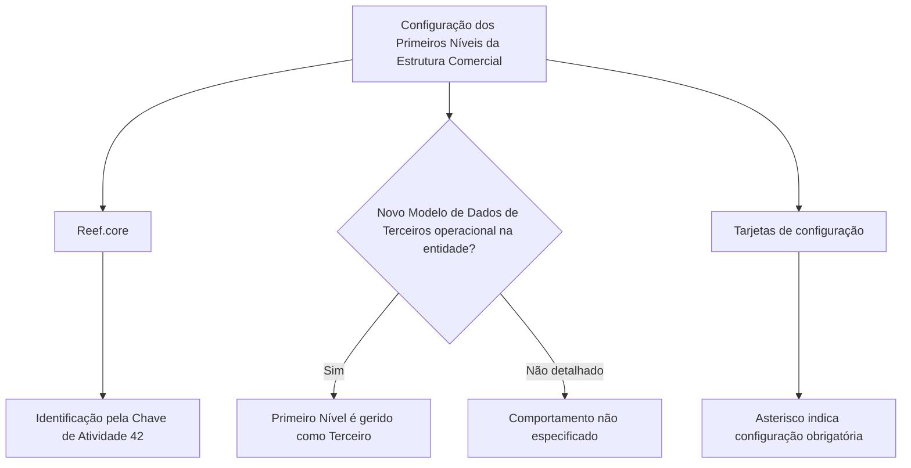

# Definição do Primeiro Nível da Estrutura Comercial no Reef.core

## 1. Metadados do Documento
- **Arquivo de Origem:** Não identificado no conteúdo fornecido
- **Tipo de Documento:** Especificação Técnica
- **Domínio / Sistema:** Reef.core; Estrutura Comercial; Terceiros
- **Público-Alvo:** Negócio, Desenvolvedores, Arquitetos e Operação
- **Data/Versão Identificada:** Não identificada

---

## 2. Resumo Executivo & Contexto de Negócio

O conteúdo descreve a definição do **Primeiro Nível da Estrutura Comercial** no sistema **Reef.core**. O objetivo declarado é relacionar os elementos necessários para configurar esses primeiros níveis, permitindo sua operação posterior no sistema.

O Reef.core identifica o Primeiro Nível da Estrutura Comercial pela **Chave de Atividade 42**. Essa chave é o identificador explicitamente citado para esse nível da estrutura.

O documento estabelece uma condição de gestão: o Primeiro Nível da Estrutura Comercial é tratado como um **Terceiro** somente quando o **Novo Modelo de Dados de Terceiros** estiver operacional na entidade.

Também são citados indicadores de obrigatoriedade nas telas de configuração. Os asteriscos das “Tarjetas” indicam se a configuração de determinado elemento é obrigatória para a definição dos Primeiros Níveis da Estrutura Comercial.

---

## 3. Arquitetura, Componentes & Tecnologias Envolvidas

Componentes e conceitos citados:

| Componente / Conceito | Papel identificado |
| :--- | :--- |
| Reef.core | Sistema no qual os Primeiros Níveis da Estrutura Comercial são configurados e operados. |
| Primeiro Nível da Estrutura Comercial | Entidade de estrutura comercial configurada no Reef.core. |
| Chave de Atividade 42 | Identificador usado pelo sistema para reconhecer o Primeiro Nível da Estrutura Comercial. |
| Terceiro | Forma de gestão do Primeiro Nível, condicionada à operação do Novo Modelo de Dados de Terceiros. |
| Novo Modelo de Dados de Terceiros | Condição necessária para que o Primeiro Nível seja gerido como Terceiro. |
| Tarjetas | Elementos de interface cuja marcação por asterisco indica obrigatoriedade de configuração. |



**Nota de Análise:** O conteúdo não descreve tecnologias de implementação, APIs, métodos HTTP, contratos JSON, servidores, URLs de ambiente ou integrações entre microsserviços.

---

## 4. Regras de Negócio, Especificações Funcionais & Processos

1. Os elementos necessários para configurar os Primeiros Níveis da Estrutura Comercial devem ser relacionados no Reef.core.
2. A configuração dos Primeiros Níveis da Estrutura Comercial tem como finalidade permitir sua operação posterior no sistema.
3. O sistema identifica o Primeiro Nível da Estrutura Comercial pela **Chave de Atividade 42**.
4. O Primeiro Nível da Estrutura Comercial deve ser gerido como um Terceiro somente se o Novo Modelo de Dados de Terceiros estiver operacional na entidade.
5. As definições agrupadas como específicas são utilizadas exclusivamente quando o Terceiro corresponde ao Primeiro Nível da Estrutura Comercial.
6. Os asteriscos exibidos nas Tarjetas indicam se a configuração de um elemento é obrigatória para a definição dos Primeiros Níveis da Estrutura Comercial.
7. O conteúdo fornecido não detalha o procedimento operacional para configurar cada elemento, nem descreve o comportamento aplicável quando o Novo Modelo de Dados de Terceiros não está operacional.

---

## 5. Tabelas de Parâmetros, Ambientes e Estruturas de Dados

| Item / Parâmetro | Descrição / Função | Tipo / Valores / Formato | Ambiente / Observações |
| :--- | :--- | :--- | :--- |
| Primeiro Nível da Estrutura Comercial | Nível de estrutura comercial configurado para operação posterior no sistema. | Conceito de estrutura comercial. | Configurado no Reef.core. |
| Chave de Atividade | Identifica o Primeiro Nível da Estrutura Comercial no sistema. | Valor informado: `42`. | Regra explícita do documento. |
| Terceiro | Forma de gestão aplicável ao Primeiro Nível da Estrutura Comercial. | Entidade / conceito de dados. | Aplicável quando o Novo Modelo de Dados de Terceiros está operacional na entidade. |
| Novo Modelo de Dados de Terceiros | Condição para gerir o Primeiro Nível como Terceiro. | Estado operacional. | O documento não define critérios para considerar o modelo operacional. |
| Asterisco nas Tarjetas | Indica obrigatoriedade de configuração de um elemento. | Indicador visual. | Relacionado à definição dos Primeiros Níveis da Estrutura Comercial. |
| Definições específicas | Definições empregadas exclusivamente quando o Terceiro é o Primeiro Nível da Estrutura Comercial. | Grupo de definições. | Sem detalhamento dos campos ou valores. |

---

## 6. Bateria de Perguntas & Respostas para RAG (FAQ Sintético)

### P1: Qual sistema é utilizado para configurar o Primeiro Nível da Estrutura Comercial?
**R:** O sistema citado para configurar e operar posteriormente os Primeiros Níveis da Estrutura Comercial é o **Reef.core**.

### P2: Qual chave identifica o Primeiro Nível da Estrutura Comercial no Reef.core?
**R:** O Reef.core identifica o Primeiro Nível da Estrutura Comercial pela **Chave de Atividade 42**.

### P3: Quando o Primeiro Nível da Estrutura Comercial é gerido como Terceiro?
**R:** O Primeiro Nível da Estrutura Comercial é gerido como um Terceiro quando o **Novo Modelo de Dados de Terceiros** estiver operacional na entidade.

### P4: O documento informa como o Primeiro Nível deve ser gerido quando o Novo Modelo de Dados de Terceiros não está operacional?
**R:** Não. O conteúdo apenas estabelece a condição para gestão como Terceiro quando o novo modelo está operacional; não descreve o comportamento alternativo.

### P5: Qual é a finalidade da configuração dos Primeiros Níveis da Estrutura Comercial?
**R:** A finalidade declarada é possibilitar a operação posterior desses Primeiros Níveis da Estrutura Comercial no sistema Reef.core.

### P6: O que representam os asteriscos das Tarjetas?
**R:** Os asteriscos indicam se a configuração de um elemento é obrigatória em relação à definição dos Primeiros Níveis da Estrutura Comercial.

### P7: Em que situação devem ser usadas as definições específicas citadas no documento?
**R:** As definições específicas devem ser utilizadas exclusivamente quando o Terceiro for o **Primeiro Nível da Estrutura Comercial**.

### P8: O documento detalha campos, APIs ou contratos de integração para a Estrutura Comercial?
**R:** Não. O conteúdo fornecido não apresenta campos técnicos, métodos HTTP, APIs, URLs, contratos JSON ou especificações de integração.

### P9: O que é a Chave de Atividade 42 no contexto apresentado?
**R:** A Chave de Atividade 42 é o identificador utilizado pelo Reef.core para reconhecer o Primeiro Nível da Estrutura Comercial.

### P10: Quais condições de obrigatoriedade são especificadas para os elementos de configuração?
**R:** A única condição explicitamente apresentada é visual: um asterisco nas Tarjetas sinaliza que a configuração do elemento é obrigatória. O documento não enumera quais elementos possuem essa obrigatoriedade.

---

## 7. Glossário de Termos, Siglas & Conceitos-Chave

- **Reef.core:** Sistema citado como responsável por configurar e permitir a operação dos Primeiros Níveis da Estrutura Comercial.
- **Primeiro Nível da Estrutura Comercial:** Nível da estrutura comercial que o documento descreve como configurável no Reef.core.
- **Chave de Atividade 42:** Chave pela qual o Reef.core identifica o Primeiro Nível da Estrutura Comercial.
- **Terceiro:** Entidade pela qual o Primeiro Nível da Estrutura Comercial é gerido quando o Novo Modelo de Dados de Terceiros está operacional.
- **Novo Modelo de Dados de Terceiros:** Modelo cuja disponibilidade operacional na entidade condiciona a gestão do Primeiro Nível como Terceiro.
- **Tarjetas:** Elementos citados no documento que usam asteriscos para indicar obrigatoriedade de configuração.

---

## 8. Notas Críticas, Riscos & Limitações

- O arquivo de origem, a data, a versão e a autoria do documento não foram identificados no conteúdo fornecido.
- O conteúdo não detalha os elementos concretos que devem ser configurados para os Primeiros Níveis da Estrutura Comercial.
- Não há detalhamento de telas, campos, valores permitidos, regras de validação ou etapas operacionais de configuração.
- Não é descrito o fluxo aplicável caso o Novo Modelo de Dados de Terceiros não esteja operacional na entidade.
- O conteúdo não apresenta detalhes de APIs, integrações, tecnologias, infraestrutura, ambientes ou mecanismos de auditoria.
- A segunda página é descrita como página em branco ou composta apenas por elementos visuais/imagem, sem conteúdo textual recuperável.

---

## 9. Conteúdo Bruto Estruturado (Referência Fiel)

```text
--- [PÁGINA 1 DE 2] ---

DEFINICIÓN del PRIMER NIVEL de la
ESTRUCTURA COMERCIAL
Se relacionan los elementos que permiten configurar en Reef.core a los Primeros Niveles de la
Estructura Comercial para poder operar posteriormente con ellos en el Sistema.
El Sistema identifica al Primer Nivel de la Estructura Comercial con la Clave de Actividad... 42.
El Primer Nivel de la Estructura Comercial se gestiona como un Tercero siempre y cuando el
Nuevo Modelo de Datos de Terceros esté operativo en la Entidad.
Los Asteriscos de las Tarjetas indican si la configuración del elemento es obligatoria en relación
con la definición de los Primeros Niveles de la Estructura Comercial.
Definiciones ESPECÍFICAS, propias de los
Terceros PRIMER NIVEL DE LA ESTRUCTURA
COMERCIAL
En este Grupo se encuentran definiciones que se emplean
exclusivamente cuando el Tercero es el PRIMER NIVEL DE LA
ESTRUCTURA COMERCIAL.
 /
 CF
Home Solutions APIs Documentation Zeus
EN

--- [PÁGINA 2 DE 2] ---

[Página em branco ou apenas elementos visuais/imagem]
```
