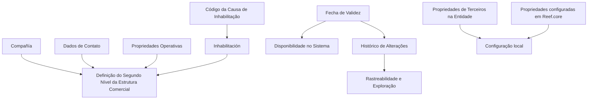

# Definição do Segundo Nível da Estrutura Comercial

## 1. Metadados do Documento
- **Arquivo de Origem:** Não identificado
- **Tipo de Documento:** Especificação Funcional
- **Domínio / Sistema:** Estrutura Comercial; Reef.core
- **Público-Alvo:** Negócio, analistas funcionais e equipes de configuração do sistema
- **Data/Versão Identificada:** Não identificada

---

## 2. Resumo Executivo & Contexto de Negócio

O documento descreve a definição do Segundo Nível da Estrutura Comercial no sistema. O conteúdo organiza as propriedades relacionadas a esse nível em propriedades identificativas, dados de contato, propriedades operativas e outras propriedades.

A propriedade **Compañía** identifica o código da companhia sobre a qual a definição do Segundo Nível da Estrutura Comercial está sendo realizada. O documento também estabelece propriedades destinadas ao controle operacional, incluindo inabilitação, causa de inabilitação e data de validade.

A propriedade **Inhabilitación** informa ao sistema que o Segundo Nível da Estrutura Comercial está desativado. Quando o tramitador estiver inabilitado, o atributo **Código de la Causa de Inhabilitación** deve indicar, conforme o código de atividade do terceiro, a causa da inabilitação do terceiro no sistema.

A **Fecha de Validez** determina a data a partir da qual a definição do nível comercial fica disponível para uso. A configuração correta dessa data permite manter histórico das alterações feitas nas definições, possibilitando posterior rastreabilidade e exploração das informações.

---

## 3. Arquitetura, Componentes & Tecnologias Envolvidas

Os elementos explicitamente citados são:

- Segundo Nível da Estrutura Comercial.
- Sistema responsável pela definição e disponibilidade do nível comercial.
- Entidade.
- Terceiros.
- Tramitador.
- Instalação de **Reef.core**.
- Referências textuais extraídas: “Home Solutions APIs Documentation Zeus” e “CF”; o documento não apresenta detalhamento suficiente para caracterizá-las como sistemas, integrações ou tecnologias.



> **Nota de Análise:** O documento não detalha interfaces, métodos HTTP, contratos de integração, banco de dados, ambientes ou responsabilidades técnicas dos componentes citados.

---

## 4. Regras de Negócio, Especificações Funcionais & Processos

1. A definição do Segundo Nível da Estrutura Comercial deve estar associada à propriedade **Compañía**.
2. A propriedade **Compañía** indica o código da companhia sobre a qual a definição do Segundo Nível da Estrutura Comercial está sendo realizada.
3. A propriedade **Inhabilitación** indica ao sistema que o Segundo Nível da Estrutura Comercial está desativado.
4. Caso o tramitador esteja inabilitado, o atributo **Código de la Causa de Inhabilitación** deve indicar a causa de inabilitação do terceiro no sistema.
5. A causa de inabilitação do terceiro deve ser indicada de acordo com o código de atividade do terceiro.
6. A propriedade **Fecha de Validez** estabelece a data a partir da qual a definição do nível comercial fica disponível no sistema.
7. A configuração correta da data de validade deve permitir a manutenção do histórico de alterações nas definições.
8. O histórico de alterações deve possibilitar rastrear e explorar posteriormente as informações.
9. Para codificação, uso e definição local do nível comercial, devem ser consideradas:
   - As propriedades de terceiros realizadas na definição da entidade.
   - As propriedades configuradas na instalação de Reef.core.
10. O documento recomenda a leitura de diretrizes e documentos funcionais vinculados, pois a interpretação isolada pode levar a erro.

---

## 5. Tabelas de Parâmetros, Ambientes e Estruturas de Dados

| Item / Parâmetro | Descrição / Função | Tipo / Valores / Formato | Ambiente / Observações |
| :--- | :--- | :--- | :--- |
| Compañía | Indica o código da companhia para a qual o Segundo Nível da Estrutura Comercial está sendo definido. | Código de companhia; formato não informado. | Associado à definição do nível comercial. |
| Inhabilitación | Indica que o Segundo Nível da Estrutura Comercial se encontra desativado. | Estado de inabilitação; valores não informados. | Aplicado pelo sistema. |
| Código de la Causa de Inhabilitación | Indica a causa de inabilitação do terceiro quando o tramitador está inabilitado. | Código; formato não informado. | Deve considerar o código de atividade do terceiro. |
| Fecha de Validez | Define a data a partir da qual a definição do nível comercial pode ser utilizada pelo sistema. | Data; formato não informado. | Permite histórico, rastreabilidade e exploração posterior das mudanças. |
| Propiedades de Terceros | Propriedades realizadas na definição da entidade. | Não informado. | Devem ser consideradas na configuração local. |
| Propiedades configuradas en Reef.core | Propriedades configuradas na instalação de Reef.core. | Não informado. | Devem ser consideradas na configuração local. |
| Home Solutions APIs Documentation Zeus | Texto presente na extração do documento. | Não informado. | Sem detalhamento adicional no material fornecido. |
| CF | Texto presente na extração do documento. | Não informado. | Sem detalhamento adicional no material fornecido. |

---

## 6. Bateria de Perguntas & Respostas para RAG (FAQ Sintético)

### P1: Qual é a finalidade da propriedade Compañía na definição do Segundo Nível da Estrutura Comercial?
**R:** A propriedade **Compañía** informa ao sistema o código da companhia sobre a qual está sendo realizada a definição do Segundo Nível da Estrutura Comercial.

### P2: O que acontece quando a propriedade Inhabilitación é aplicada?
**R:** A propriedade **Inhabilitación** informa ao sistema que o Segundo Nível da Estrutura Comercial está desativado.

### P3: Quando o Código de la Causa de Inhabilitación deve ser informado?
**R:** O **Código de la Causa de Inhabilitación** deve indicar a causa da inabilitação do terceiro no sistema quando o tramitador estiver inabilitado.

### P4: Qual regra deve ser usada para determinar a causa de inabilitação do terceiro?
**R:** A causa deve ser indicada de acordo com o código de atividade do terceiro.

### P5: Qual é o objetivo da Fecha de Validez?
**R:** A **Fecha de Validez** estabelece a data a partir da qual a definição do nível da Estrutura Comercial fica disponível no sistema para utilização.

### P6: Como a Fecha de Validez contribui para a rastreabilidade?
**R:** A configuração correta da data de validade permite manter histórico das mudanças realizadas nas definições, permitindo posteriormente rastrear e explorar essas informações.

### P7: Quais elementos devem ser considerados na codificação e definição local do nível comercial?
**R:** Devem ser consideradas tanto as propriedades de terceiros realizadas na definição da entidade quanto as propriedades configuradas na instalação de Reef.core.

### P8: Por que o documento recomenda consultar diretrizes e documentos funcionais relacionados?
**R:** O documento recomenda essa leitura porque a interpretação isolada do material pode conduzir a erro.

### P9: O documento especifica métodos HTTP ou contratos JSON para o Segundo Nível da Estrutura Comercial?
**R:** Não. O conteúdo fornecido não detalha métodos HTTP, contratos JSON, endpoints, integrações ou interfaces técnicas.

### P10: O documento define o formato da data de validade ou dos códigos de companhia e inabilitação?
**R:** Não. O documento descreve a finalidade desses atributos, mas não informa formatos, domínios de valores ou regras de validação técnica.

---

## 7. Glossário de Termos, Siglas & Conceitos-Chave

- **Segundo Nível da Estrutura Comercial:** Nível da estrutura comercial cuja definição é o objeto central do documento.
- **Compañía:** Propriedade que identifica o código da companhia associada à definição.
- **Inhabilitación:** Propriedade que indica que o Segundo Nível da Estrutura Comercial está desativado.
- **Tramitador:** Entidade mencionada como sujeita à condição de inabilitação; o documento não fornece definição adicional.
- **Tercero:** Terceiro cuja causa de inabilitação é indicada conforme seu código de atividade.
- **Código de la Causa de Inhabilitación:** Atributo que indica a causa da inabilitação do terceiro quando o tramitador está inabilitado.
- **Fecha de Validez:** Data a partir da qual a definição do nível comercial fica disponível no sistema.
- **Reef.core:** Sistema ou instalação citada como fonte de propriedades a considerar na configuração local; sem detalhamento adicional.
- **CF:** Sigla ou texto presente na extração; significado não definido no documento.
- **Zeus:** Termo presente na extração “Home Solutions APIs Documentation Zeus”; significado e função não definidos no documento.

---

## 8. Notas Críticas, Riscos & Limitações

- O documento não identifica arquivo de origem, versão, data de publicação ou responsáveis.
- As seções “Datos de Contacto” e “Propiedades Operativas” aparecem como títulos, sem detalhamento funcional adicional.
- Não há especificação de formatos, obrigatoriedade, valores permitidos ou regras de validação para os atributos citados.
- Não há detalhamento técnico sobre APIs, métodos HTTP, contratos JSON, persistência, integrações, autenticação ou ambientes.
- As referências “Home Solutions APIs Documentation Zeus” e “CF” não possuem contexto suficiente para interpretação técnica confiável.
- A interpretação isolada do documento pode levar a erro; a leitura de diretrizes e documentos funcionais vinculados é recomendada.
- A configuração local depende de propriedades de terceiros definidas na entidade e de propriedades configuradas na instalação de Reef.core.

---

## 9. Conteúdo Bruto Estruturado (Referência Fiel)

```text
--- [PÁGINA 1 DE 2] ---

DEFINICIÓN del SEGUNDO NIVEL de la
ESTRUCTURA COMERCIAL
Contexto
Objetivo
Propiedades Identificativas
Datos de Contacto
Propiedades Operativas
Otras Propiedades
Propiedades Identificativas
Compañía
Esta propiedad le indica al sistema el código de la compañía sobre la que se está realizando la
definición del Segundo Nivel de la Estructura Comercial.
Datos de Contacto
Propiedades Operativas
 /
 CF
Home Solutions APIs Documentation Zeus
EN


--- [PÁGINA 2 DE 2] ---

Otras Propiedades
Inhabilitación
Esta propiedad le indica al Sistema que el Segundo Nivel de la Estructura Comercial se encuentra
desactivado.
Código de la Causa de Inhabilitación
Si el Tramitador está inhabilitado, este Atributo indicará de acuerdo con el código de actividad del
Tercero, el código de la Causa de la Inhabilitación del Tercero en el sistema.
Fecha de Validez
Esta propiedad establece la fecha a partir de la cual la definición del Nivel de la Estructura Comercial
está disponible en el sistema para ser utilizado, por lo que una correcta configuración habilita tener
un histórico de los cambios efectuados en sus definiciones y poder así trazar y explotar
posteriormente esta información.
Vínculos
Relación de Directrices y Documentos funcionales cuya lectura recomendada para evitar que la
interpretación aislada del presente documento pueda conducir a error.
Preguntas frecuentes
(1) ¿Existe alguna particularidad operativa que deba ser tomada en consideración localmente en la
codificación, uso y definición de este Nivel de la Estructura Comercial en el Sistema?
Se debe considerar tanto las Propiedades de Terceros realizadas en la definición de la Entidad, como
aquellas Propiedades configuradas en la Instalación de Reef.core.
```
