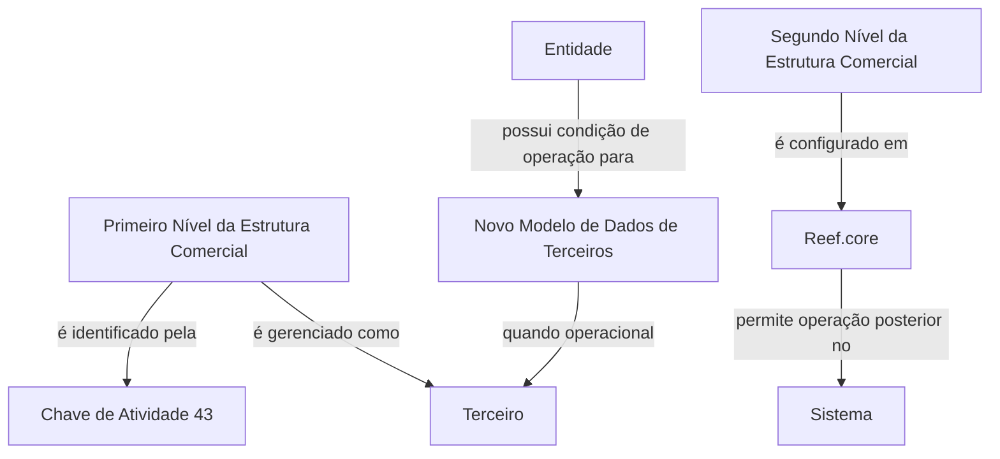

# Definição do Segundo Nível da Estrutura Comercial no Reef.core

## 1. Metadados do Documento
- **Arquivo de Origem:** Não identificado no conteúdo fornecido
- **Tipo de Documento:** Especificação Técnica
- **Domínio / Sistema:** Reef.core; Estrutura Comercial; Terceiros
- **Público-Alvo:** Não explicitamente identificado
- **Data/Versão Identificada:** Não identificada

---

## 2. Resumo Executivo & Contexto de Negócio

O documento define elementos necessários para configurar os Segundos Níveis da Estrutura Comercial no sistema Reef.core. A finalidade declarada é permitir que esses Segundos Níveis sejam posteriormente operados no Sistema.

O conteúdo estabelece uma relação entre a Estrutura Comercial e conceitos de Terceiros. Em particular, o Primeiro Nível da Estrutura Comercial é identificado pelo Sistema por meio da Chave de Atividade 43.

O Primeiro Nível da Estrutura Comercial é tratado como um Terceiro somente quando o Novo Modelo de Dados de Terceiros está operacional na Entidade. O texto não detalha os critérios técnicos que determinam se esse modelo está operacional.

Também são mencionadas definições específicas para Terceiros que representam o Segundo Nível da Estrutura Comercial. O documento informa que essas definições são de uso exclusivo nesse contexto, sem detalhar os campos, regras de preenchimento ou fluxos operacionais associados.

---

## 3. Arquitetura, Componentes & Tecnologias Envolvidas

| Componente / Conceito | Papel descrito |
| :--- | :--- |
| Reef.core | Sistema no qual os elementos dos Segundos Níveis da Estrutura Comercial são configurados. |
| Sistema | Ambiente que posteriormente opera os Segundos Níveis configurados. |
| Primeiro Nível da Estrutura Comercial | Nível identificado pelo Sistema pela Chave de Atividade 43. |
| Segundo Nível da Estrutura Comercial | Entidade cuja configuração é o foco principal do documento. |
| Terceiro | Modelo pelo qual o Primeiro Nível é gerenciado quando o Novo Modelo de Dados de Terceiros está operacional. |
| Novo Modelo de Dados de Terceiros | Condição para que o Primeiro Nível da Estrutura Comercial seja gerenciado como Terceiro. |
| Entidade | Contexto organizacional no qual o Novo Modelo de Dados de Terceiros pode estar operacional. |



> **Nota de Análise:** O documento não descreve integrações técnicas, interfaces, métodos HTTP, contratos JSON, bancos de dados, versões de software, ambientes ou mecanismos de autenticação.

---

## 4. Regras de Negócio, Especificações Funcionais & Processos

1. Os elementos necessários para configurar os Segundos Níveis da Estrutura Comercial devem ser relacionados no Reef.core.
2. A configuração dos Segundos Níveis da Estrutura Comercial tem como objetivo permitir sua operação posterior no Sistema.
3. O Sistema identifica o Primeiro Nível da Estrutura Comercial pela **Chave de Atividade 43**.
4. O Primeiro Nível da Estrutura Comercial é gerenciado como um Terceiro somente quando o **Novo Modelo de Dados de Terceiros** está operacional na Entidade.
5. A obrigatoriedade da configuração de elementos associados aos Segundos Níveis é indicada por asteriscos nas respectivas “Tarjetas”.
6. O grupo de definições específicas de Terceiros contém definições utilizadas exclusivamente quando o Terceiro corresponde ao **Segundo Nível da Estrutura Comercial**.

> **Nota de Análise:** O documento não informa quais são os elementos de configuração, quais Tarjetas existem, quais campos recebem asteriscos, nem quais valores devem ser utilizados para cada definição específica.

---

## 5. Tabelas de Parâmetros, Ambientes e Estruturas de Dados

| Item / Parâmetro | Descrição / Função | Tipo / Valores / Formato | Ambiente / Observações |
| :--- | :--- | :--- | :--- |
| Chave de Atividade | Identifica o Primeiro Nível da Estrutura Comercial no Sistema. | `43` | Valor explicitamente informado no documento. |
| Primeiro Nível da Estrutura Comercial | Nível identificado pela Chave de Atividade 43. | Conceito de estrutura comercial | Pode ser gerenciado como Terceiro sob condição específica. |
| Segundo Nível da Estrutura Comercial | Nível cujos elementos são configurados no Reef.core. | Conceito de estrutura comercial | Deve poder ser operado posteriormente no Sistema. |
| Novo Modelo de Dados de Terceiros | Modelo cuja operação na Entidade condiciona o gerenciamento do Primeiro Nível como Terceiro. | Estado operacional não detalhado | Não há critérios de ativação ou validação descritos. |
| Terceiro | Modelo de gerenciamento aplicável ao Primeiro Nível sob condição descrita. | Entidade de dados conceitual | Também possui definições específicas quando representa o Segundo Nível. |
| Asteriscos nas Tarjetas | Indicadores de obrigatoriedade da configuração de elementos. | Marcador visual | Aplicável à definição dos Segundos Níveis. |
| Reef.core | Sistema de configuração dos Segundos Níveis. | Sistema | Nenhuma versão ou URL foi informada. |
| Home Solutions APIs Documentation Zeus | Texto exibido no conteúdo bruto. | Referência textual | O documento não explica a relação dessa expressão com Reef.core ou a Estrutura Comercial. |

---

## 6. Bateria de Perguntas & Respostas para RAG (FAQ Sintético)

### P1: Qual é o objetivo da configuração dos Segundos Níveis da Estrutura Comercial?
**R:** O objetivo é configurar no Reef.core os elementos que permitem operar posteriormente os Segundos Níveis da Estrutura Comercial no Sistema.

### P2: Em qual sistema são configurados os Segundos Níveis da Estrutura Comercial?
**R:** Os Segundos Níveis da Estrutura Comercial são configurados no Reef.core.

### P3: Como o Sistema identifica o Primeiro Nível da Estrutura Comercial?
**R:** O Sistema identifica o Primeiro Nível da Estrutura Comercial pela Chave de Atividade 43.

### P4: Qual é a Chave de Atividade do Primeiro Nível da Estrutura Comercial?
**R:** A Chave de Atividade informada para identificação do Primeiro Nível da Estrutura Comercial é 43.

### P5: Quando o Primeiro Nível da Estrutura Comercial é gerenciado como Terceiro?
**R:** O Primeiro Nível da Estrutura Comercial é gerenciado como Terceiro quando o Novo Modelo de Dados de Terceiros está operacional na Entidade.

### P6: O documento detalha como verificar se o Novo Modelo de Dados de Terceiros está operacional?
**R:** Não. O documento informa essa condição de negócio, mas não descreve critérios, telas, campos, consultas ou procedimentos para verificar o estado operacional do Novo Modelo de Dados de Terceiros.

### P7: O que significam os asteriscos nas Tarjetas?
**R:** Os asteriscos nas Tarjetas indicam se a configuração de determinado elemento é obrigatória em relação à definição dos Segundos Níveis da Estrutura Comercial.

### P8: Para que servem as definições específicas de Terceiros do Segundo Nível da Estrutura Comercial?
**R:** Essas definições são empregadas exclusivamente quando o Terceiro corresponde ao Segundo Nível da Estrutura Comercial.

### P9: Quais campos ou parâmetros específicos devem ser preenchidos para um Terceiro de Segundo Nível?
**R:** O documento não lista os campos, parâmetros, valores permitidos ou regras de preenchimento das definições específicas para Terceiros de Segundo Nível.

### P10: O documento fornece detalhes sobre APIs, URLs, métodos HTTP ou contratos de integração?
**R:** Não. Embora o conteúdo apresente a expressão “Home Solutions APIs Documentation Zeus”, não fornece URLs, operações de API, métodos HTTP, contratos JSON ou detalhes de integração.

---

## 7. Glossário de Termos, Siglas & Conceitos-Chave

- **Reef.core:** Sistema no qual são configurados os elementos dos Segundos Níveis da Estrutura Comercial.
- **Estrutura Comercial:** Estrutura composta, no mínimo, por Primeiro Nível e Segundo Nível conforme o conteúdo fornecido.
- **Primeiro Nível da Estrutura Comercial:** Nível identificado pelo Sistema por meio da Chave de Atividade 43.
- **Segundo Nível da Estrutura Comercial:** Nível para o qual o documento descreve a configuração de elementos no Reef.core.
- **Chave de Atividade:** Chave utilizada pelo Sistema para identificar o Primeiro Nível da Estrutura Comercial; o valor informado é 43.
- **Terceiro:** Entidade pela qual o Primeiro Nível pode ser gerenciado quando o Novo Modelo de Dados de Terceiros está operacional; possui definições específicas quando representa o Segundo Nível.
- **Novo Modelo de Dados de Terceiros:** Modelo cuja operação na Entidade condiciona o gerenciamento do Primeiro Nível como Terceiro.
- **Tarjetas:** Elementos visuais mencionados no documento, cujos asteriscos indicam obrigatoriedade de configuração.
- **Entidade:** Contexto no qual o Novo Modelo de Dados de Terceiros pode estar operacional.

---

## 8. Notas Críticas, Riscos & Limitações

- O conteúdo fornecido possui somente uma página textual substantiva; a segunda página é descrita como página em branco ou composta apenas por elementos visuais/imagem.
- Não foram informados os campos, telas, valores, estruturas de dados ou procedimentos necessários para configurar o Segundo Nível da Estrutura Comercial.
- Não há detalhamento dos critérios de disponibilidade do Novo Modelo de Dados de Terceiros na Entidade.
- Não há descrição de métodos técnicos, APIs, integrações, logs, URLs, ambientes, servidores ou versões.
- A obrigatoriedade é indicada por asteriscos nas Tarjetas, mas o documento não identifica quais Tarjetas ou elementos são obrigatórios.
- A expressão “Home Solutions APIs Documentation Zeus” aparece no conteúdo, mas sua finalidade e relação com o processo descrito não são explicadas.

---

## 9. Conteúdo Bruto Estruturado (Referência Fiel)

```text
--- [PÁGINA 1 DE 2] ---

DEFINICIÓN del SEGUNDO NIVEL de la
ESTRUCTURA COMERCIAL
Se relacionan los elementos que permiten configurar en Reef.core a los Segundos Niveles de la
Estructura Comercial para poder operar posteriormente con ellos en el Sistema.
El Sistema identifica al Primer Nivel de la Estructura Comercial con la Clave de Actividad... 43.
El Primer Nivel de la Estructura Comercial se gestiona como un Tercero siempre y cuando el
Nuevo Modelo de Datos de Terceros esté operativo en la Entidad.
Los Asteriscos de las Tarjetas indican si la configuración del elemento es obligatoria en relación
con la definición de los Segundos Niveles de la Estructura Comercial.
Definiciones ESPECÍFICAS, propias de los
Terceros SEGUNDO NIVEL DE LA ESTRUCTURA
COMERCIAL
En este Grupo se encuentran definiciones que se emplean
exclusivamente cuando el Tercero es el SEGUNDO NIVEL DE LA
ESTRUCTURA COMERCIAL.
 / 
 CF
Home Solutions APIs Documentation Zeus
EN


--- [PÁGINA 2 DE 2] ---

[Página em branco ou apenas elementos visuais/imagem]
```
