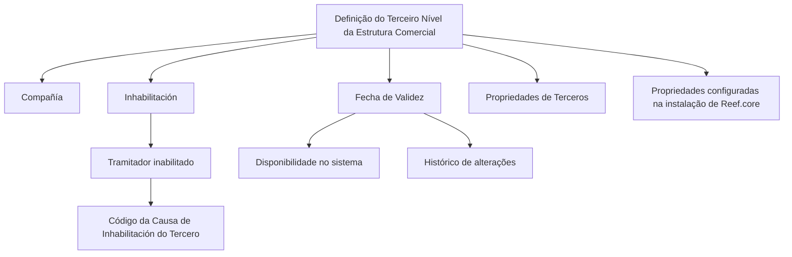

# Definição do Terceiro Nível da Estrutura Comercial

## 1. Metadados do Documento
- **Arquivo de Origem:** Não identificado no conteúdo fornecido
- **Tipo de Documento:** Especificação Funcional
- **Domínio / Sistema:** Estrutura Comercial; Reef.core
- **Público-Alvo:** Negócio, Analistas Funcionais, Desenvolvedores e Operação
- **Data/Versão Identificada:** Não identificada

---

## 2. Resumo Executivo & Contexto de Negócio

O documento descreve propriedades relacionadas à definição do **Terceiro Nível da Estrutura Comercial** em um sistema corporativo. O conteúdo está organizado em tópicos de contexto, objetivo, propriedades identificativas, dados de contato, propriedades operativas e outras propriedades, embora o material fornecido detalhe apenas parte dessas áreas.

A propriedade **Compañía** informa ao sistema o código da companhia para a qual está sendo realizada a definição do Terceiro Nível da Estrutura Comercial. Dessa forma, a definição está vinculada a uma companhia identificada por código.

O documento estabelece mecanismos de indisponibilização e histórico. A propriedade **Inhabilitación** indica que o Terceiro Nível da Estrutura Comercial está desativado. Quando o tramitador está inabilitado, o **Código de la Causa de Inhabilitación** informa, conforme o código de atividade do terceiro, o código da causa da inabilitação do terceiro no sistema.

A propriedade **Fecha de Validez** define a data a partir da qual a definição do nível da Estrutura Comercial fica disponível para uso no sistema. A configuração correta dessa data permite manter histórico das alterações realizadas nas definições e possibilita rastrear e explorar posteriormente essas informações.

---

## 3. Arquitetura, Componentes & Tecnologias Envolvidas

Os seguintes elementos são mencionados no conteúdo:

| Componente / Termo | Papel identificado no documento |
| :--- | :--- |
| Terceiro Nível da Estrutura Comercial | Entidade ou nível cuja definição é tratada no documento. |
| Sistema | Repositório de disponibilidade, inabilitação e códigos associados à definição. O nome do sistema não é explicitamente informado. |
| Reef.core | Instalação cuja configuração de propriedades deve ser considerada na codificação, uso e definição do nível da Estrutura Comercial. |
| Propriedades de Terceros | Propriedades realizadas na definição da Entidade que devem ser consideradas. |
| Home Solutions APIs Documentation Zeus | Texto presente na extração; o documento não explica a função, integração ou relação desse elemento com o Terceiro Nível da Estrutura Comercial. |
| Tramitador | Elemento que pode estar inabilitado; nessa condição, uma causa de inabilitação é indicada. |
| Terceiro | Entidade para a qual o sistema registra o código da causa de inabilitação conforme o código de atividade. |



> **Nota de Análise:** O conteúdo não fornece arquitetura técnica de software, interfaces, métodos HTTP, contratos de integração, tecnologias de implementação, URLs de ambiente, servidores ou relações explícitas entre microsserviços.

---

## 4. Regras de Negócio, Especificações Funcionais & Processos

### 4.1 Definição por companhia

1. A propriedade **Compañía** informa ao sistema o código da companhia sobre a qual a definição do Terceiro Nível da Estrutura Comercial está sendo realizada.
2. O documento não especifica formato, tamanho, domínio de valores ou processo de validação do código da companhia.

### 4.2 Inabilitação do Terceiro Nível da Estrutura Comercial

1. A propriedade **Inhabilitación** informa ao sistema que o Terceiro Nível da Estrutura Comercial está desativado.
2. O documento não informa quais operações ficam bloqueadas, quais usuários podem realizar a inabilitação, nem se existe processo de reabilitação.

### 4.3 Código da causa de inabilitação

1. Quando o **Tramitador** está inabilitado, o atributo **Código de la Causa de Inhabilitación** deve indicar o código da causa de inabilitação do terceiro no sistema.
2. A causa deve ser indicada de acordo com o código de atividade do terceiro.
3. O documento não apresenta catálogo de causas, códigos de atividade válidos, regras de obrigatoriedade ou formato do atributo.

### 4.4 Data de validade e histórico

1. A propriedade **Fecha de Validez** estabelece a data a partir da qual a definição do nível da Estrutura Comercial está disponível no sistema para utilização.
2. A configuração correta da data de validade habilita a manutenção de histórico das mudanças efetuadas nas definições.
3. O histórico possibilita rastrear e explorar posteriormente as informações relativas às definições.
4. O documento não define regras para datas retroativas, datas futuras, expiração, sobreposição de vigências ou fuso horário.

### 4.5 Considerações locais para codificação, uso e definição

1. Para a codificação, uso e definição do nível da Estrutura Comercial no sistema, devem ser consideradas as **Propriedades de Terceros** realizadas na definição da Entidade.
2. Também devem ser consideradas as propriedades configuradas na instalação de **Reef.core**.
3. O documento não detalha quais propriedades de terceiros existem, quais propriedades são configuradas no Reef.core ou quais particularidades operativas locais devem ser aplicadas.

---

## 5. Tabelas de Parâmetros, Ambientes e Estruturas de Dados

| Item / Parâmetro | Descrição / Função | Tipo / Valores / Formato | Ambiente / Observações |
| :--- | :--- | :--- | :--- |
| Compañía | Indica ao sistema o código da companhia sobre a qual é realizada a definição do Terceiro Nível da Estrutura Comercial. | Código de companhia; formato não informado. | Sistema não identificado. |
| Inhabilitación | Indica que o Terceiro Nível da Estrutura Comercial está desativado. | Propriedade; valores não informados. | Não são informadas consequências operacionais adicionais. |
| Código de la Causa de Inhabilitación | Indica o código da causa de inabilitação do terceiro quando o tramitador está inabilitado. | Código; domínio e formato não informados. | Deve considerar o código de atividade do terceiro. |
| Fecha de Validez | Determina a data a partir da qual a definição do nível fica disponível no sistema. | Data; formato não informado. | Permite histórico, rastreabilidade e exploração posterior das mudanças. |
| Propriedades de Terceros | Propriedades realizadas na definição da Entidade que devem ser consideradas. | Não detalhado. | Relevantes para codificação, uso e definição local. |
| Propriedades configuradas no Reef.core | Configurações da instalação de Reef.core que devem ser consideradas. | Não detalhado. | Relevantes para codificação, uso e definição local. |
| Home Solutions APIs Documentation Zeus | Texto identificado no conteúdo bruto. | Não aplicável; função não detalhada. | Não há explicação sobre relação com o processo descrito. |

---

## 6. Bateria de Perguntas & Respostas para RAG (FAQ Sintético)

### P1: Qual é a finalidade da propriedade Compañía na definição do Terceiro Nível da Estrutura Comercial?
**R:** A propriedade **Compañía** informa ao sistema o código da companhia sobre a qual está sendo realizada a definição do Terceiro Nível da Estrutura Comercial. O documento não especifica o formato nem os valores válidos desse código.

### P2: O que significa configurar Inhabilitación para o Terceiro Nível da Estrutura Comercial?
**R:** A propriedade **Inhabilitación** indica ao sistema que o Terceiro Nível da Estrutura Comercial está desativado. O material fornecido não detalha quais funcionalidades ou operações são afetadas pela desativação.

### P3: Quando o Código de la Causa de Inhabilitación deve ser informado?
**R:** O atributo **Código de la Causa de Inhabilitación** deve indicar a causa de inabilitação do terceiro no sistema quando o tramitador estiver inabilitado. A indicação deve ocorrer de acordo com o código de atividade do terceiro.

### P4: Qual é a relação entre o tramitador inabilitado e o terceiro?
**R:** Quando o tramitador está inabilitado, o atributo de código da causa informa no sistema a causa de inabilitação do terceiro. O código aplicável deve considerar o código de atividade do terceiro.

### P5: Para que serve a Fecha de Validez?
**R:** A **Fecha de Validez** estabelece a data a partir da qual a definição do nível da Estrutura Comercial fica disponível no sistema para ser utilizada.

### P6: Como a Fecha de Validez contribui para o histórico de definições?
**R:** Uma configuração correta da **Fecha de Validez** permite manter um histórico das mudanças realizadas nas definições. Esse histórico pode ser rastreado e explorado posteriormente.

### P7: Quais elementos devem ser considerados em particularidades operativas locais?
**R:** Devem ser consideradas tanto as **Propriedades de Terceros** realizadas na definição da Entidade quanto as propriedades configuradas na instalação de **Reef.core**.

### P8: O documento especifica os valores permitidos para os códigos de causa de inabilitação?
**R:** Não. O documento informa que o código da causa deve ser indicado conforme o código de atividade do terceiro, mas não apresenta catálogo de causas, domínio de valores ou formato do código.

### P9: O documento descreve APIs, métodos HTTP ou contratos JSON para o Terceiro Nível da Estrutura Comercial?
**R:** Não. Embora o texto contenha a expressão “Home Solutions APIs Documentation Zeus”, o conteúdo fornecido não descreve endpoints, métodos HTTP, contratos JSON, autenticação ou integrações técnicas.

### P10: O documento detalha as propriedades de contato e as propriedades operativas?
**R:** Não. Os tópicos **Datos de Contacto** e **Propiedades Operativas** são mencionados, mas o trecho fornecido não apresenta regras, campos, formatos ou comportamentos adicionais para essas seções.

---

## 7. Glossário de Termos, Siglas & Conceitos-Chave

- **Compañía:** Propriedade que informa o código da companhia para a qual a definição do Terceiro Nível da Estrutura Comercial está sendo realizada.
- **Código de la Causa de Inhabilitación:** Atributo que indica o código da causa da inabilitação do terceiro no sistema quando o tramitador está inabilitado.
- **Código de actividad del Tercero:** Código de atividade do terceiro considerado para determinar a causa de inabilitação.
- **Datos de Contacto:** Seção mencionada no documento; não há detalhamento adicional no conteúdo fornecido.
- **Entidad:** Entidade cuja definição contém Propriedades de Terceros a serem consideradas.
- **Fecha de Validez:** Propriedade que determina a partir de que data a definição do nível está disponível para utilização no sistema.
- **Inhabilitación:** Propriedade que indica que o Terceiro Nível da Estrutura Comercial se encontra desativado.
- **Propiedades de Terceros:** Propriedades realizadas na definição da Entidade que devem ser consideradas localmente.
- **Propiedades Operativas:** Seção mencionada no documento; não há detalhamento adicional no conteúdo fornecido.
- **Reef.core:** Instalação cuja configuração de propriedades deve ser considerada na codificação, no uso e na definição do nível da Estrutura Comercial.
- **Tercer Nivel de la Estructura Comercial:** Nível da Estrutura Comercial cuja definição, disponibilidade, inabilitação e validade são tratadas no documento.
- **Tercero:** Entidade associada a um código de atividade e, quando aplicável, a uma causa de inabilitação.
- **Tramitador:** Elemento que pode estar inabilitado; nessa condição, há registro de uma causa de inabilitação do terceiro.

---

## 8. Notas Críticas, Riscos & Limitações

- O arquivo de origem, a data, a versão e a autoria do documento não estão identificados no conteúdo fornecido.
- O documento cita seções de contexto, objetivo, dados de contato, propriedades operativas e outras propriedades, mas não fornece detalhamento de todas elas.
- Não há definição de formatos, valores válidos, obrigatoriedade, regras de consistência ou mensagens de erro para os atributos descritos.
- Não é apresentado o catálogo de códigos de atividade do terceiro nem o catálogo de causas de inabilitação.
- Não há especificação de permissões, perfis de usuário, auditoria, reabilitação, exclusão ou ciclo de vida do Terceiro Nível da Estrutura Comercial.
- Não existem detalhes de APIs, bancos de dados, endpoints, contratos, tecnologias, ambientes, servidores, URLs ou rotas de log.
- A expressão “Home Solutions APIs Documentation Zeus” aparece no texto bruto, mas não possui explicação funcional ou técnica suficiente para estabelecer seu papel.
- **Nota de Análise:** O documento menciona propriedades configuradas na instalação de Reef.core, porém não detalha quais propriedades, seus valores ou como influenciam a definição do Terceiro Nível da Estrutura Comercial.

---

## 9. Conteúdo Bruto Estruturado (Referência Fiel)

```text
--- [PÁGINA 1 DE 2] ---

DEFINICIÓN del TERCER NIVEL de la
ESTRUCTURA COMERCIAL
Contexto
Objetivo
Propiedades Identificativas
Datos de Contacto
Propiedades Operativas
Otras Propiedades
Propiedades Identificativas
Compañía
Esta propiedad le indica al sistema el código de la compañía sobre la que se está realizando la
definición del Tercer Nivel de la Estructura Comercial.
Datos de Contacto
Propiedades Operativas
 / 
 CF
Home Solutions APIs Documentation Zeus
EN


--- [PÁGINA 2 DE 2] ---

Otras Propiedades
Inhabilitación
Esta propiedad le indica al Sistema que el Tercer Nivel de la Estructura Comercial se encuentra
desactivado.
Código de la Causa de Inhabilitación
Si el Tramitador está inhabilitado, este Atributo indicará de acuerdo con el código de actividad del
Tercero, el código de la Causa de la Inhabilitación del Tercero en el sistema.
Fecha de Validez
Esta propiedad establece la fecha a partir de la cual la definición del Nivel de la Estructura Comercial
está disponible en el sistema para ser utilizado, por lo que una correcta configuración habilita tener
un histórico de los cambios efectuados en sus definiciones y poder así trazar y explotar
posteriormente esta información.
Vínculos
Relación de Directrices y Documentos funcionales cuya lectura recomendada para evitar que la
interpretación aislada del presente documento pueda conducir a error.
Preguntas frecuentes
(1) ¿Existe alguna particularidad operativa que deba ser tomada en consideración localmente en la
codificación, uso y definición de este Nivel de la Estructura Comercial en el Sistema?
Se debe considerar tanto las Propiedades de Terceros realizadas en la definición de la Entidad, como
aquellas Propiedades configuradas en la Instalación de Reef.core.
```
