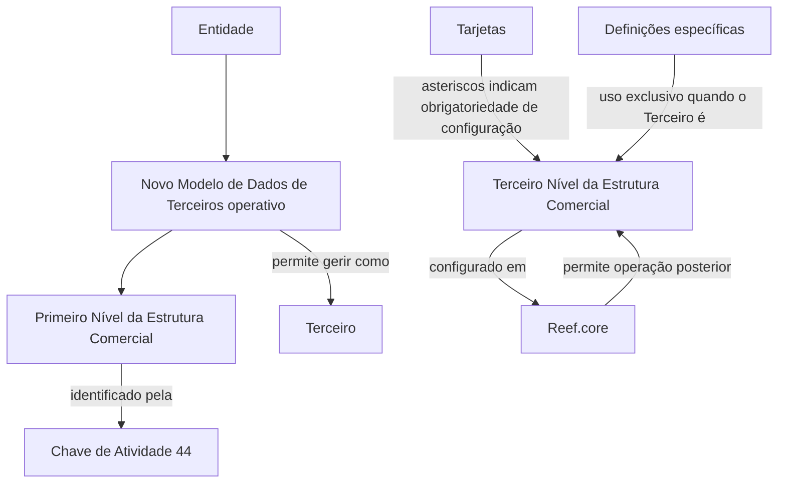

# Definição do Terceiro Nível da Estrutura Comercial no Reef.core

## 1. Metadados do Documento
- **Arquivo de Origem:** Não identificado; excerto textual fornecido pelo usuário.
- **Tipo de Documento:** Não identificado; conteúdo apresenta definição funcional/técnica.
- **Domínio / Sistema:** Reef.core; Estrutura Comercial; Terceiros.
- **Público-Alvo:** Desenvolvedores, analistas funcionais e equipes de configuração.
- **Data/Versão Identificada:** Não identificada.

---

## 2. Resumo Executivo & Contexto de Negócio

O documento descreve a definição do **Terceiro Nível da Estrutura Comercial** no sistema **Reef.core**. O propósito declarado é relacionar os elementos necessários para configurar os Terceiros Níveis da Estrutura Comercial e viabilizar sua operação posterior no sistema.

O texto informa que o sistema identifica o **Primeiro Nível da Estrutura Comercial** pela **Chave de Atividade 44**. Também estabelece uma condição para o tratamento do Primeiro Nível como Terceiro: o **Novo Modelo de Dados de Terceiros** deve estar operativo na Entidade.

A configuração possui indicadores visuais: os asteriscos das tarjetas indicam se a configuração de cada elemento é obrigatória para a definição dos Terceiros Níveis da Estrutura Comercial. Além disso, existe um grupo de definições específicas usado exclusivamente quando o Terceiro corresponde ao Terceiro Nível da Estrutura Comercial.

> **Nota de Análise:** O excerto não detalha as telas, tarjetas, campos, valores permitidos, contratos de integração, métodos HTTP ou procedimentos operacionais para configurar os elementos no Reef.core.

---

## 3. Arquitetura, Componentes & Tecnologias Envolvidas

| Componente / Conceito | Papel identificado |
| :--- | :--- |
| Reef.core | Sistema no qual são configurados e posteriormente operados os Terceiros Níveis da Estrutura Comercial. |
| Estrutura Comercial | Estrutura composta por níveis comerciais; o texto referencia explicitamente Primeiro Nível e Terceiro Nível. |
| Primeiro Nível da Estrutura Comercial | Identificado pelo sistema com a Chave de Atividade 44. |
| Terceiro Nível da Estrutura Comercial | Objeto principal da definição e configuração descrita. |
| Terceiro | Entidade empregada para gerir o Primeiro Nível, condicionada à operacionalidade do Novo Modelo de Dados de Terceiros. |
| Novo Modelo de Dados de Terceiros | Condição citada para que o Primeiro Nível seja gerido como Terceiro na Entidade. |
| Tarjetas | Elementos de interface ou configuração cujos asteriscos sinalizam obrigatoriedade. |



---

## 4. Regras de Negócio, Especificações Funcionais & Processos

1. O Reef.core deve possuir elementos configuráveis para os **Terceiros Níveis da Estrutura Comercial**.
2. A finalidade da configuração é permitir que os Terceiros Níveis da Estrutura Comercial sejam operados posteriormente no sistema.
3. O sistema identifica o **Primeiro Nível da Estrutura Comercial** pela **Chave de Atividade 44**.
4. O Primeiro Nível da Estrutura Comercial é gerido como um Terceiro somente quando o **Novo Modelo de Dados de Terceiros** estiver operativo na Entidade.
5. Os asteriscos presentes nas tarjetas indicam se a configuração de um elemento é obrigatória em relação à definição dos Terceiros Níveis da Estrutura Comercial.
6. O grupo de definições específicas citado no documento é empregado exclusivamente quando o Terceiro corresponde ao **Terceiro Nível da Estrutura Comercial**.

> **Nota de Análise:** O documento não especifica a sequência de cadastro, critérios de validação adicionais, mensagens de erro, responsáveis pelo processo ou efeitos de uma configuração obrigatória ausente.

---

## 5. Tabelas de Parâmetros, Ambientes e Estruturas de Dados

| Item / Parâmetro | Descrição / Função | Tipo / Valores / Formato | Ambiente / Observações |
| :--- | :--- | :--- | :--- |
| Chave de Atividade | Identifica o Primeiro Nível da Estrutura Comercial no sistema. | `44` | Associada ao Primeiro Nível da Estrutura Comercial. |
| Novo Modelo de Dados de Terceiros | Condição para gerir o Primeiro Nível como Terceiro. | Deve estar operativo | Aplicável na Entidade. |
| Asteriscos das tarjetas | Indicam se a configuração de um elemento é obrigatória. | Indicador visual de obrigatoriedade | Relacionado à definição dos Terceiros Níveis da Estrutura Comercial. |
| Definições específicas | Definições de uso exclusivo em um contexto determinado. | Grupo de definições | Utilizadas exclusivamente quando o Terceiro é o Terceiro Nível da Estrutura Comercial. |
| Reef.core | Sistema que recebe a configuração e suporta a operação posterior. | Sistema | Não há ambiente, URL ou versão informados. |

---

## 6. Bateria de Perguntas & Respostas para RAG (FAQ Sintético)

### P1: Qual é o objetivo da definição do Terceiro Nível da Estrutura Comercial?
**R:** O objetivo é relacionar os elementos que permitem configurar no Reef.core os Terceiros Níveis da Estrutura Comercial, para que possam ser operados posteriormente no sistema.

### P2: Qual sistema é citado para configurar os Terceiros Níveis da Estrutura Comercial?
**R:** O sistema citado é o Reef.core. O texto afirma que os elementos permitem configurar nesse sistema os Terceiros Níveis da Estrutura Comercial.

### P3: Como o sistema identifica o Primeiro Nível da Estrutura Comercial?
**R:** O sistema identifica o Primeiro Nível da Estrutura Comercial por meio da Chave de Atividade `44`.

### P4: Qual é a Chave de Atividade do Primeiro Nível da Estrutura Comercial?
**R:** A Chave de Atividade informada para identificação do Primeiro Nível da Estrutura Comercial é `44`.

### P5: Em qual condição o Primeiro Nível da Estrutura Comercial é gerido como Terceiro?
**R:** O Primeiro Nível da Estrutura Comercial é gerido como Terceiro quando o Novo Modelo de Dados de Terceiros estiver operativo na Entidade.

### P6: O que os asteriscos das tarjetas representam?
**R:** Os asteriscos das tarjetas indicam se a configuração de um elemento é obrigatória em relação à definição dos Terceiros Níveis da Estrutura Comercial.

### P7: Quando as definições específicas devem ser usadas?
**R:** As definições específicas devem ser usadas exclusivamente quando o Terceiro for o Terceiro Nível da Estrutura Comercial.

### P8: O documento detalha os campos e valores necessários para a configuração no Reef.core?
**R:** Não. O excerto informa que existem elementos para configurar os Terceiros Níveis da Estrutura Comercial, mas não apresenta os campos, tipos de dados, valores permitidos ou instruções operacionais desses elementos.

### P9: O documento informa APIs, métodos HTTP ou contratos JSON do Reef.core?
**R:** Não. O conteúdo fornecido não descreve APIs, métodos HTTP, URLs, contratos JSON ou integrações técnicas.

---

## 7. Glossário de Termos, Siglas & Conceitos-Chave

- **Reef.core:** Sistema citado como responsável por permitir a configuração e a operação posterior dos Terceiros Níveis da Estrutura Comercial.
- **Estrutura Comercial:** Estrutura organizacional/comercial mencionada com pelo menos Primeiro Nível e Terceiro Nível.
- **Primeiro Nível da Estrutura Comercial:** Nível identificado no sistema pela Chave de Atividade 44.
- **Terceiro Nível da Estrutura Comercial:** Nível comercial cuja configuração no Reef.core é o tema central do documento.
- **Terceiro:** Entidade utilizada para gerir o Primeiro Nível quando o Novo Modelo de Dados de Terceiros está operativo na Entidade.
- **Novo Modelo de Dados de Terceiros:** Modelo citado como condição para o tratamento do Primeiro Nível como Terceiro.
- **Tarjetas:** Elementos que apresentam asteriscos para indicar obrigatoriedade de configuração.
- **Chave de Atividade:** Identificador do Primeiro Nível da Estrutura Comercial; valor informado: 44.

---

## 8. Notas Críticas, Riscos & Limitações

- O excerto não informa o nome do arquivo, data, versão, autoria ou ambiente do documento.
- Não há detalhamento de campos, telas, regras de preenchimento, permissões, validações, exceções ou tratamento de erros.
- Não são apresentados servidores, URLs, portas, logs, APIs, contratos de integração ou tecnologias de implementação.
- A operação do Terceiro Nível no Reef.core é mencionada, mas os procedimentos operacionais não são descritos.
- A condição “Novo Modelo de Dados de Terceiros operativo na Entidade” é relevante, porém o documento não define como verificar essa operacionalidade.

---

## 9. Conteúdo Bruto Estruturado (Referência Fiel)

```text
--- [PÁGINA 1 DE 2] ---

DEFINICIÓN del TERCER NIVEL de la
ESTRUCTURA COMERCIAL

Se relacionan los elementos que permiten configurar en Reef.core a los Terceros Niveles de la
Estructura Comercial para poder operar posteriormente con ellos en el Sistema.

El Sistema identifica al Primer Nivel de la Estructura Comercial con la Clave de Actividad... 44.

El Primer Nivel de la Estructura Comercial se gestiona como un Tercero siempre y cuando el
Nuevo Modelo de Datos de Terceros sea operativo en la Entidad.

Los Asteriscos de las Tarjetas indican si la configuración del elemento es obligatoria en relación
con la definición de los Terceros Niveles de la Estructura Comercial.

Definiciones ESPECÍFICAS, propias de los
Terceros TERCER NIVEL DE LA ESTRUCTURA
COMERCIAL

En este Grupo se encuentran definiciones que se emplean
exclusivamente cuando el Tercero es el TERCER NIVEL DE LA
ESTRUCTURA COMERCIAL.

 /
 CF
Home Solutions APIs Documentation Zeus
EN

--- [PÁGINA 2 DE 2] ---

[Página em branco ou apenas elementos visuais/imagem]
```
