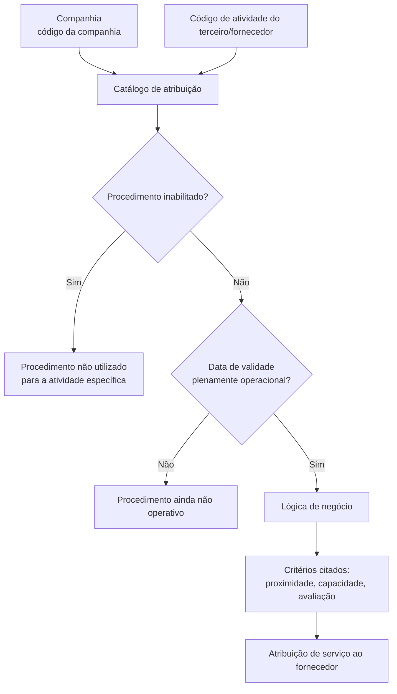

# Critérios de Atribuição de Serviços a Fornecedores por Atividade de Terceiro

## 1. Metadados do Documento
- **Arquivo de Origem:** `Não informado`
- **Tipo de Documento:** Especificação Funcional
- **Domínio / Sistema:** Atribuição de Serviços a Fornecedores; catálogo de atribuição; entidade MAPFRE local
- **Público-Alvo:** Negócio, Tecnologia e Processos, Desenvolvedores, Arquitetos e Operação
- **Data/Versão Identificada:** Não identificada

---

## 2. Resumo Executivo & Contexto de Negócio

O documento descreve a definição de critérios utilizados pelo núcleo do sistema para atribuir serviços a fornecedores. A atribuição é configurada considerando a companhia e o código de atividade do terceiro ou fornecedor, desde que a atividade do terceiro determine a aplicação desses critérios.

A configuração é mantida em um catálogo que contém propriedades de identificação, lógica de negócio, inabilitação e validade temporal. A lógica de negócio avalia um ou mais critérios definidos pela companhia para decidir a atribuição de serviços aos fornecedores.

Entre os critérios de atribuição citados estão proximidade, capacidade e avaliação. O documento não detalha o algoritmo, a ordem de prioridade, os pesos, os limites ou as fontes de dados usados para calcular esses critérios.

A propriedade de inabilitação permite desativar o procedimento de atribuição para uma atividade específica. A propriedade de data de validade define a partir de quando o procedimento se torna plenamente operacional e permite conservar histórico de alterações ao longo do tempo.

A responsabilidade pela nomenclatura, implementação e associação da lógica de negócio no catálogo é atribuída ao departamento local de Tecnologia e Processos da entidade MAPFRE.

---

## 3. Arquitetura, Componentes & Tecnologias Envolvidas

O documento apresenta um modelo funcional de catálogo para configurar a atribuição de serviços a fornecedores. Os componentes e conceitos identificados são:

| Componente / Conceito | Papel identificado no documento |
| :--- | :--- |
| Núcleo do Sistema | Possui a capacidade de determinar os critérios considerados no procedimento de atribuição de serviços a fornecedores. |
| Catálogo de Atribuição de Serviços | Reúne os atributos usados para definir a atribuição de serviços a fornecedores. |
| Companhia | Define o código da companhia para a qual é configurado o critério de atribuição da atividade do terceiro ou fornecedor. |
| Código de Atividade do Terceiro | Identifica a atividade do terceiro ou fornecedor para a qual são estabelecidos critérios de atribuição. |
| Lógica de Negócio | Avalia os critérios definidos pela companhia para atribuir serviços aos fornecedores. |
| Procedimento de Atribuição de Serviços | Processo que utiliza atividade, companhia, lógica de negócio, inabilitação e data de validade para atribuir serviços. |
| Fornecedor / Terceiro | Entidade que pode receber a atribuição de serviços conforme sua atividade e os critérios configurados. |
| Tecnologia e Processos da entidade MAPFRE local | Departamento responsável pela nomenclatura, implementação e associação da lógica de negócio no catálogo. |
| Home Solutions APIs Documentation Zeus | Texto citado no conteúdo bruto; o documento não explica sua função, integração ou relação técnica com o processo. |



**Nota de Análise:** O documento menciona o núcleo do sistema, um catálogo e uma lógica de negócio, mas não descreve interfaces, métodos HTTP, contratos JSON, bancos de dados, tecnologias de implementação, ambientes, URLs operacionais ou integrações técnicas.

---

## 4. Regras de Negócio, Especificações Funcionais & Processos

### 4.1 Definição de critérios de atribuição

1. O núcleo do sistema pode determinar um ou mais critérios a considerar no procedimento de atribuição de serviços a fornecedores.
2. Os critérios de atribuição estão associados ao código de atividade do terceiro ou fornecedor.
3. A aplicação dos critérios ocorre somente quando a atividade do terceiro estabelecer que tais critérios devem ser considerados.
4. A companhia define os critérios de atribuição aplicáveis à atividade do terceiro ou fornecedor.
5. A lógica de negócio avalia os critérios definidos pela companhia para realizar a atribuição de serviços aos fornecedores.

### 4.2 Critérios explicitamente citados

O documento cita os seguintes exemplos de critérios que podem ser avaliados pela lógica de negócio:

- Proximidade.
- Capacidade.
- Avaliação.

**Nota de Análise:** O documento utiliza reticências após os critérios “proximidade, capacidade, avaliação”, indicando que podem existir outros critérios, mas não os identifica. Não há detalhamento sobre cálculos, precedência, pesos, regras de desempate ou critérios obrigatórios.

### 4.3 Companhia

1. O atributo de companhia no catálogo contém o código da companhia.
2. O código da companhia identifica a companhia sobre a qual é realizada a definição do critério de atribuição.
3. A definição é feita para a atividade do terceiro ou fornecedor correspondente.

### 4.4 Código de atividade do terceiro

1. O código de atividade do terceiro identifica, no sistema, a atividade do terceiro ou fornecedor.
2. O código de atividade é usado para estabelecer os critérios de atribuição.
3. Os critérios são aplicáveis quando a própria atividade do terceiro assim determinar.

### 4.5 Lógica de negócio

1. A lógica de negócio corresponde a um atributo do catálogo.
2. A lógica de negócio avalia o critério ou os critérios definidos pela companhia.
3. A finalidade da avaliação é atribuir serviços aos fornecedores.
4. A responsabilidade pela nomenclatura, implementação e associação da lógica de negócio no catálogo pertence ao departamento de Tecnologia e Processos da entidade MAPFRE local.

### 4.6 Inabilitação do procedimento

1. A propriedade de inabilitação estabelece que o procedimento de atribuição de serviços para uma atividade específica está desativado ou inabilitado.
2. Quando o procedimento está desativado ou inabilitado, ele não pode ser utilizado para a atribuição de serviços a fornecedores.

### 4.7 Data de validade e histórico

1. A propriedade de data de validade informa ao sistema a data a partir da qual o procedimento de atribuição de serviço está plenamente operacional.
2. O uso correto da data de validade permite manter um histórico das mudanças efetuadas ao longo do tempo.
3. O documento não especifica formato de data, fuso horário, comportamento para datas futuras, expiração, sobreposição de vigências ou tratamento de registros históricos.

### 4.8 Documentos relacionados

O documento recomenda a leitura de diretrizes e documentos funcionais relacionados, para evitar interpretações isoladas e incorretas:

- Serviços de Fornecedores.
- Atividades dos Terceiros.

---

## 5. Tabelas de Parâmetros, Ambientes e Estruturas de Dados

| Item / Parâmetro | Descrição / Função | Tipo / Valores / Formato | Ambiente / Observações |
| :--- | :--- | :--- | :--- |
| Companhia | Código da companhia para a qual se define o critério de atribuição para a atividade do terceiro ou fornecedor. | Código de companhia; formato não informado. | Configurado no catálogo. |
| Código de Atividade do Terceiro | Determina o código da atividade do terceiro ou fornecedor para o qual são estabelecidos os critérios de atribuição. | Código de atividade; formato não informado. | Aplicável desde que a atividade do terceiro estabeleça o uso dos critérios. |
| Lógica de Negócio | Avalia o critério ou os critérios definidos pela companhia para atribuir serviços aos fornecedores. | Lógica de negócio; implementação não detalhada. | A nomenclatura, implementação e associação são responsabilidade de Tecnologia e Processos da entidade MAPFRE local. |
| Critérios de atribuição | Elementos avaliados pela lógica de negócio para a atribuição de serviços. | Exemplos: proximidade, capacidade, avaliação. | Outros critérios podem existir, mas não são detalhados. |
| Inabilitação | Indica que o procedimento de atribuição de serviços para uma atividade específica está desativado ou inabilitado. | Estado de inabilitação; valores e formato não informados. | Impede o uso do procedimento na atribuição de serviços a fornecedores. |
| Data de Validade | Data a partir da qual o procedimento de atribuição de serviço está plenamente operacional. | Data; formato não informado. | Permite manter histórico de mudanças ao longo do tempo. |
| Serviços de Fornecedores | Documento funcional relacionado recomendado para leitura. | Referência documental. | Sem detalhes adicionais no conteúdo fornecido. |
| Atividades dos Terceiros | Documento funcional relacionado recomendado para leitura. | Referência documental. | Sem detalhes adicionais no conteúdo fornecido. |
| Home Solutions APIs Documentation Zeus | Texto citado no conteúdo bruto. | Não identificado. | O documento não explica seu propósito, arquitetura ou relação com a atribuição de serviços. |

---

## 6. Bateria de Perguntas & Respostas para RAG (FAQ Sintético)

### P1: Qual é a finalidade do procedimento de atribuição de serviços a fornecedores?
**R:** O procedimento tem a finalidade de atribuir serviços a fornecedores utilizando um ou mais critérios definidos pela companhia e associados ao código de atividade do terceiro ou fornecedor. A avaliação desses critérios é realizada por uma lógica de negócio configurada no catálogo.

### P2: Quais critérios de atribuição de fornecedores são citados no documento?
**R:** O documento cita proximidade, capacidade e avaliação como exemplos de critérios que podem ser considerados pela lógica de negócio para atribuir serviços a fornecedores. O texto não define fórmulas, pesos, prioridade entre critérios ou regras de desempate.

### P3: Qual é a função do atributo Companhia no catálogo de atribuição?
**R:** O atributo Companhia contém o código da companhia sobre a qual é realizada a definição do critério de atribuição para a atividade do terceiro ou fornecedor. O documento não informa o formato desse código.

### P4: Em que situação os critérios de atribuição são aplicados a uma atividade de terceiro?
**R:** Os critérios são aplicados ao código de atividade do terceiro ou fornecedor quando a própria atividade do terceiro estabelece que esses critérios devem ser contemplados no procedimento de atribuição de serviços.

### P5: O que a lógica de negócio faz no procedimento de atribuição?
**R:** A lógica de negócio avalia o critério ou os critérios determinados pela companhia para atribuir serviços aos fornecedores. Os critérios explicitamente citados são proximidade, capacidade e avaliação.

### P6: Quem é responsável pela nomenclatura, implementação e associação da lógica de negócio no catálogo?
**R:** A responsabilidade pela nomenclatura, implementação e associação da lógica de negócio no catálogo recai sobre o departamento de Tecnologia e Processos da entidade MAPFRE local.

### P7: Qual é o efeito da propriedade Inabilitação?
**R:** A propriedade Inabilitação estabelece que o procedimento de atribuição de serviços para uma atividade específica está desativado ou inabilitado. Nessa condição, o procedimento não pode ser utilizado para atribuir serviços aos fornecedores.

### P8: Para que serve a Data de Validade no procedimento de atribuição?
**R:** A Data de Validade informa ao sistema a data a partir da qual o procedimento de atribuição de serviço está plenamente operacional. O uso correto dessa propriedade permite manter um histórico das mudanças realizadas ao longo do tempo.

### P9: O documento define como proximidade, capacidade e avaliação devem ser calculadas?
**R:** Não. O documento apenas cita proximidade, capacidade e avaliação como exemplos de critérios avaliados pela lógica de negócio. Não há definição de fontes de dados, fórmulas, pesos, limiares, ordem de processamento ou regras de desempate.

### P10: Quais documentos funcionais devem ser consultados para evitar interpretação isolada do processo?
**R:** O documento recomenda consultar os materiais “Serviços de Fornecedores” e “Atividades dos Terceiros”. A leitura é recomendada para evitar que uma interpretação isolada do documento de critérios de atribuição leve a erros.

### P11: O documento especifica APIs, endpoints ou contratos de integração para a atribuição de serviços?
**R:** Não. Embora o conteúdo bruto mencione “Home Solutions APIs Documentation Zeus”, não são descritos endpoints, métodos HTTP, autenticação, payloads, contratos JSON, URLs, ambientes ou comportamentos de integração.

---

## 7. Glossário de Termos, Siglas & Conceitos-Chave

- **Atribuição de Serviços:** Procedimento usado para atribuir serviços a fornecedores com base em critérios configurados.
- **Atividade do Terceiro:** Atividade associada ao terceiro ou fornecedor; seu código pode determinar a aplicação de critérios de atribuição.
- **Catálogo:** Estrutura que contém atributos para definição do procedimento de atribuição de serviços.
- **Código de Atividade do Terceiro:** Código que identifica a atividade do terceiro ou fornecedor para a qual são estabelecidos critérios de atribuição.
- **Companhia:** Entidade identificada pelo código da companhia para a qual são definidos os critérios de atribuição.
- **Critério de Atribuição:** Elemento avaliado para atribuir serviços a fornecedores; o documento cita proximidade, capacidade e avaliação.
- **Data de Validade:** Data a partir da qual o procedimento de atribuição de serviço está plenamente operacional.
- **Fornecedor:** Entidade que pode receber serviços atribuídos pelo procedimento.
- **Inabilitação:** Propriedade que desativa ou inabilita o procedimento de atribuição de serviços para uma atividade específica.
- **Lógica de Negócio:** Lógica responsável por avaliar os critérios definidos pela companhia para atribuir serviços aos fornecedores.
- **MAPFRE:** Entidade mencionada como responsável, por meio de seu departamento local de Tecnologia e Processos, pela nomenclatura, implementação e associação da lógica de negócio.
- **Terceiro:** Entidade cuja atividade é usada para determinar os critérios aplicáveis ao procedimento de atribuição.

---

## 8. Notas Críticas, Riscos & Limitações

- O documento não descreve a implementação técnica da lógica de negócio.
- O documento não define pesos, prioridades, algoritmos, regras de desempate ou critérios de elegibilidade para proximidade, capacidade e avaliação.
- O formato dos códigos de companhia e atividade do terceiro não é informado.
- Os valores aceitos pela propriedade de inabilitação não são informados.
- O formato, o fuso horário e as regras de coexistência de datas de validade não são detalhados.
- Não há definição de comportamento para procedimentos inabilitados que já possuam histórico de atribuições.
- Não há descrição de APIs, métodos HTTP, contratos de dados, autenticação, URLs, servidores, logs ou ambientes.
- A menção a “Home Solutions APIs Documentation Zeus” não possui contexto suficiente para determinar sua função no processo.
- A leitura isolada do documento pode levar a interpretações incorretas; o próprio conteúdo recomenda consultar “Serviços de Fornecedores” e “Atividades dos Terceiros”.
- A nomenclatura, implementação e associação da lógica de negócio dependem do departamento de Tecnologia e Processos da entidade MAPFRE local.

---

## 9. Conteúdo Bruto Estruturado (Referência Fiel)

```text
--- [PÁGINA 1 DE 2] ---

DEFINICIÓN de los CRITERIOS de
ASIGNACIÓN de los SERVICIOS a
PROVEEDORES
Funcionalmente el núcleo del Sistema cuenta con la posibilidad de determinar el criterio o los criterios
que se tienen que contemplar en el procedimiento de asignación de Servicios a los Proveedores y de
acuerdo con su código de actividad.
Propiedades
Otras Propiedades
Propiedades
Compañía
Este Atributo del catálogo contiene el código de la compañía sobre la que se está realizando la
definición del criterio de Asignación para la Actividad del Tercero/Proveedor.
Código de Actividad del Tercero
Esta propiedad determina en el sistema el código de la Actividad del Tercero-Proveedor para el cual
se está estableciendo el criterio/criterios de asignación (siempre y cuando la Actividad del Tercero así
lo establezca)
Lógica de Negocio
 / 
 CF
Home Solutions APIs Documentation Zeus
EN


--- [PÁGINA 2 DE 2] ---

Este Atributo del catálogo corresponde con una lógica de negocio cuyo cometido es evaluar el criterio
o los criterios que determine la Compañía para asignar servicios a los Proveedores: proximidad,
capacidad, valoración, ...
Otras Propiedades
Inhabilitación
Esta propiedad establece que el Procedimiento de Asignación de los Servicios para la Actividad
específica esta desactivada o inhabilitada para poder ser utilizada en la asignación de los Servicios a
los Proveedores.
Fecha de Validez
Esta propiedad le indica al Sistema la fecha a partir de la cual el procedimiento de Asignación del
Servicio está plenamente operativo en el sistema por lo que su correcto uso permite tener un
histórico de los cambios efectuados a lo largo del tiempo.
Vínculos
Relación de Directrices y Documentos funcionales cuya lectura recomendada para evitar que la
interpretación aislada del presente documento pueda conducir a error.
Servicios de Proveedores
Actividades de los Terceros
Preguntas frecuentes
(1) ¿Existe alguna recomendación operativa que deba ser tomada en consideración localmente en la
codificación, uso y definición del catálogo de Asignación de Servicios de los Proveedores?
La Responsabilidad de la nomenclatura, implementación y asociación en el catálogo de la lógica de
negocio recae en el departamento de Tecnología y Procesos de la Entidad MAPFRE local.
```
